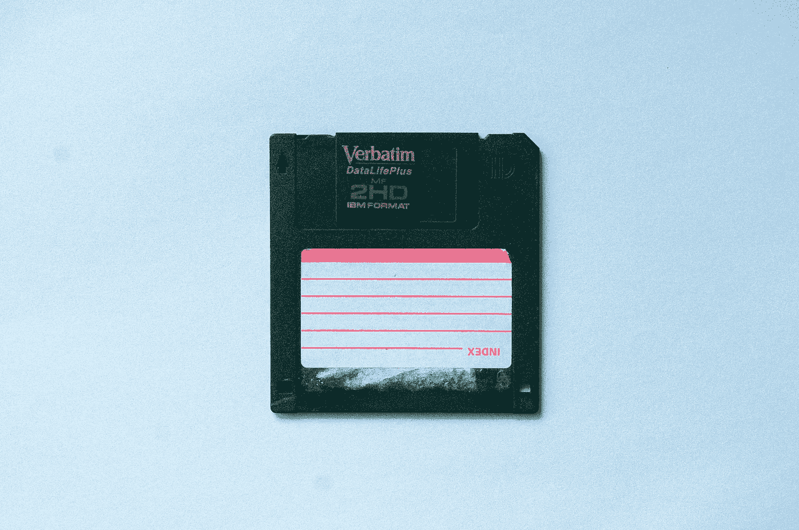

# 如何用 Python 在磁盘上保存训练好的模型

> 原文：<https://towardsdatascience.com/save-trained-models-python-22a11376d975>

## 用 scikit 探索模型持久性——在 Python 中学习



图为[费尔南多·拉文](https://unsplash.com/@filmlav?utm_source=unsplash&utm_medium=referral&utm_content=creditCopyText)在 [Unsplash](https://unsplash.com/s/photos/save?utm_source=unsplash&utm_medium=referral&utm_content=creditCopyText)

## 介绍

当开发机器学习模型时，我们使用所谓的训练集中包含的数据点来训练它们。通常，我们需要在磁盘上保存一个训练好的模型，以便以后将它加载回内存中。这可能需要发生，因为我们想要在不同的数据集上评估模型的性能，或者可能因为我们想要进行一些小的修改。

在今天的简短教程中，我们将展示如何在磁盘上存储经过训练的`scikit-learn`模型。此外，我们还将讨论如何将预先训练好的模型加载回内存中，并在新的实例上运行它(例如，测试或验证集中可能包含的数据点)。

首先，让我们训练一个示例模型，我们将在本教程中引用它来演示一些概念。我们将使用[鸢尾数据集](https://scikit-learn.org/stable/auto_examples/datasets/plot_iris_dataset.html)(它也包含在`scikit-learn`的`datasets`模块中，所以如果你想按照本教程学习，你不必依赖外部资源)来训练 K-Neighbors 分类器，以便根据花瓣和萼片的长度和宽度来预测数据集( *Setosa* 、 *Versicolour* 和 *Virginica* )中包含的鸢尾的类型。

现在，让我们开始加载我们的 Iris 数据集，并创建一个训练和测试集(如果您想了解更多关于如何将数据集分为训练、测试和验证测试的信息，您可以阅读我的一篇旧文章):

```
import numpy as np
from sklearn import datasets # Load the Iris Dataset
iris_X, iris_y = datasets.load_iris(return_X_y=True) # Split the data into training and testing sets
# Note that we use a fixed seed so that results
# are reproduciblenp.random.seed(0)
indices = np.random.permutation(len(iris_X))iris_X_train = iris_X[indices[:-10]]
iris_y_train = iris_y[indices[:-10]]
iris_X_test = iris_X[indices[-10:]]
iris_y_test = iris_y[indices[-10:]]
```

然后，我们使用在上一步中创建的一组训练实例来训练 K-Neighbors 分类器:

```
from sklearn.neighbors import KNeighborsClassifier knn = KNeighborsClassifier()
knn.fit(iris_X_train, iris_y_train)
```

## 保存已训练的模型

**酸洗**是 Python 中使用的一个过程，目的是**将对象序列化(或反序列化)成字节流**。机器学习模型也是对象，因此我们可以利用酸洗方法将它们存储在本地磁盘上。

在 Python 中，你可以使用`[pickle](https://docs.python.org/3/library/pickle.html)`或`[joblib](https://joblib.readthedocs.io/en/latest/)`库来挑选对象。请注意，`**joblib**` **在对携带大型数组**的对象进行序列化(解序列化)时效率更高(这在使用`scikit-learn`模型/估算器时很常见)。注意，与`pickle`相反，`joblib`也可以 pickle 磁盘上的对象(而不是字符串对象)。

下面我们将演示如何持久化模型以供将来使用，而不必使用两个库进行重新训练。

**使用** `**pickle**`

```
import pickle**with open('my_trained_model.pkl', 'wb') as f:
    pickle.dump(knn, f)**
```

**使用**和`**joblib**`

```
import joblib**joblib.dump(knn, 'my_trained_model.pkl', compress=9)**
```

注意`compress`参数可以取 0 到 9 之间的整数值。较高的值意味着更多的压缩，但也意味着较慢的读写时间。

## 从磁盘加载预训练模型

现在，为了从磁盘加载回预先训练好的模型，你需要解开字节流。同样，我们将展示如何使用`pickle`和`joblib`库来做到这一点。

**使用** `**pickle**`

```
import pickle**with open('my_trained_model.pkl', 'rb') as f:
    knn = pickle.load(f)**
```

**使用** `**joblib**`

```
import joblib**knn = load('****my_trained_model.pkl****')**
```

## 在新数据点上运行加载的模型

现在，一旦我们加载回(即解除)预训练的 scikit-learn 模型，我们就可以在本教程开始时准备的测试集上运行它。

下面我们演示一个端到端的例子，包含今天教程中用到的全部代码

```
import joblib
import numpy as np
from sklearn import datasets
from sklearn.neighbors import KNeighborsClassifier # Load the Iris Dataset
iris_X, iris_y = datasets.load_iris(return_X_y=True)# Split the data into training and testing sets
# Note that we use a fixed seed so that results
# are reproduciblenp.random.seed(0)
indices = np.random.permutation(len(iris_X))iris_X_train = iris_X[indices[:-10]]
iris_y_train = iris_y[indices[:-10]]
iris_X_test = iris_X[indices[-10:]]
iris_y_test = iris_y[indices[-10:]] # Fit the classifier
knn = KNeighborsClassifier()
knn.fit(iris_X_train, iris_y_train) # Persist the trained model on the local disk
joblib.dump(knn, 'my_trained_model.pkl', compress=9)# Load the trained model from the disk
knn = load('my_trained_model.pkl')# Make predictions on the loaded pre-trained model
knn.predict(iris_X_test)
```

## 最后的想法

在今天的文章中，我们讨论了保存经过训练的机器学习模型的重要性，以便它们可以在以后使用。我们使用一个示例`scikit-learn`模型展示了如何做到这一点，我们最初将它存储在本地磁盘上，然后将其加载回内存，以便在新的、不可见的数据集上运行它，这些数据集包括在我们一开始准备的示例测试集中。

请注意，在某些情况下(主要与文本分类任务相关)，您可能还希望持久化 vectoriser。您可以通过使用包含矢量器和训练模型的元组来实现，如下所示:

```
import pickle**# Pickle the vectorizer and the classifier**
with open('trained_model_with_vecotizer.pkl', 'wb') as f:
  pickle.dump((vectorizer, clf), f)**# Unpickle the vectorizer and the classifier**
with open('trained_model_with_vecotizer.pkl', 'rb') as f:
  vectorizer, clf = pickle.load(f)**# Vectorize the testing instances and perform predictions**
X_test = vectorizer.transform(X_test)
predictions = clf.predict(X_test)
```

[**成为会员**](https://gmyrianthous.medium.com/membership) **阅读介质上的每一个故事。你的会员费直接支持我和你看的其他作家。你也可以在媒体上看到所有的故事。**

<https://gmyrianthous.medium.com/membership>  

**你可能也会喜欢**

</predict-vs-predict-proba-scikit-learn-bdc45daa5972>  </scikit-learn-vs-sklearn-6944b9dc1736> 