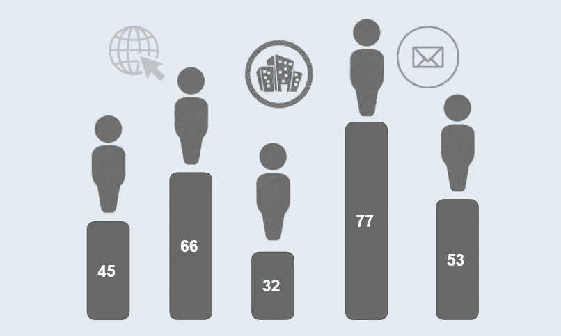
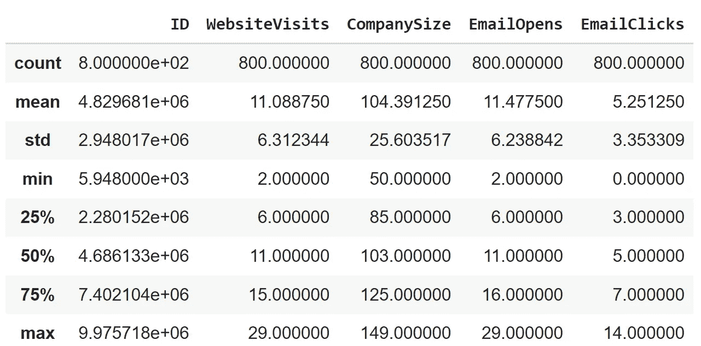
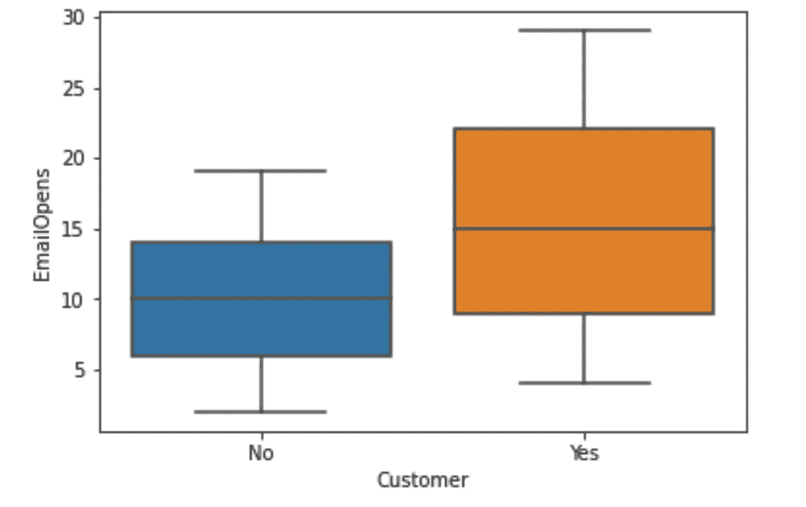
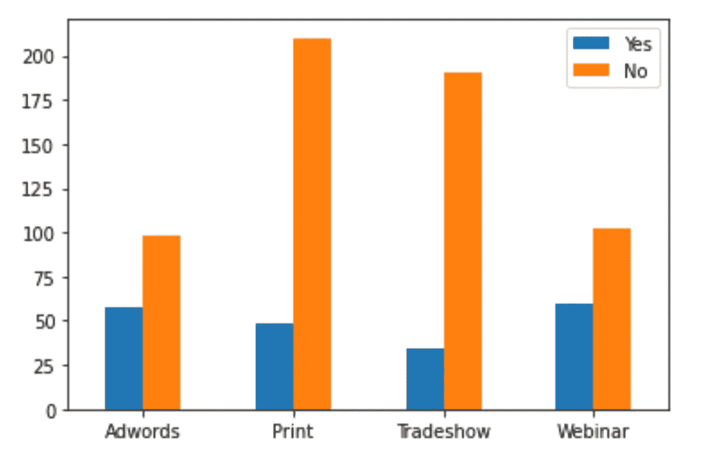
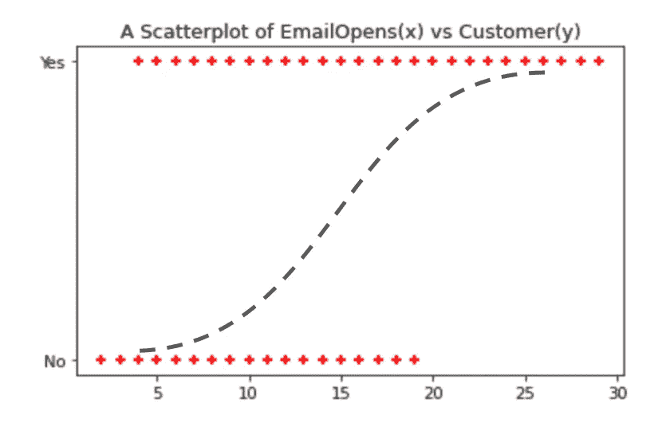
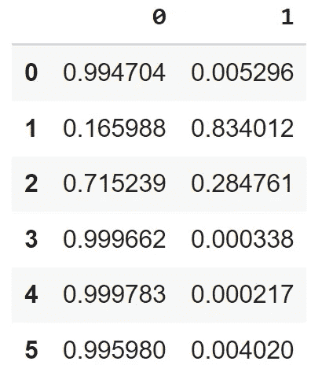
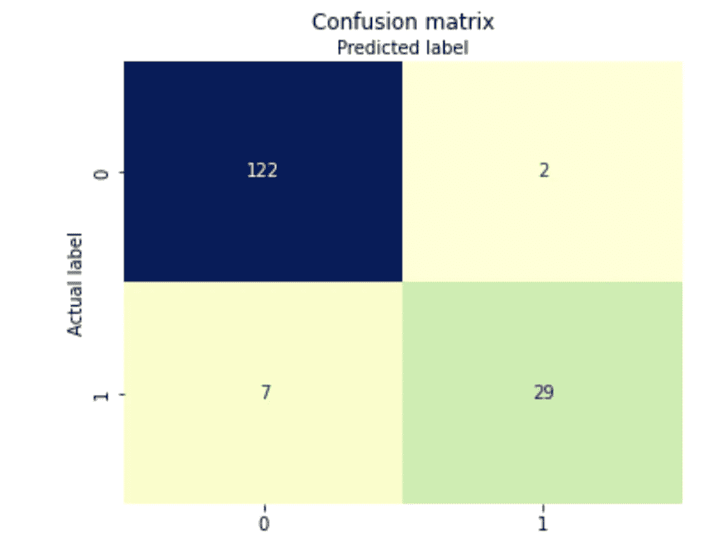
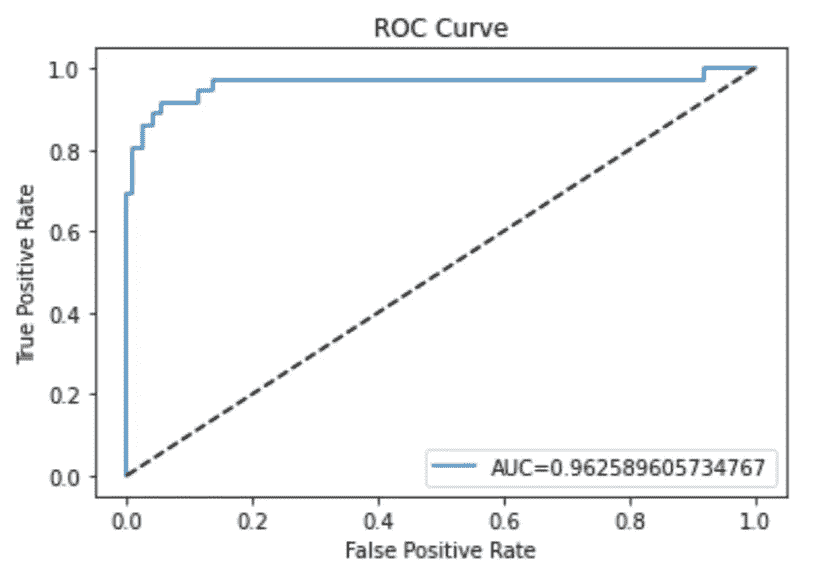

# 通过领先得分挽救斯克兰顿分行

> 原文：<https://towardsdatascience.com/saving-the-scranton-branch-with-lead-scoring-8599ed4a874f>

## [实践教程](https://towardsdatascience.com/tagged/hands-on-tutorials)

# **挽救斯克兰顿分行领先得分**

## *逻辑回归模型如何优化 Dunder Mifflin 销售团队*

[斯科特·格雷厄姆](https://unsplash.com/@homajob?utm_source=medium&utm_medium=referral)在 [Unsplash](https://unsplash.com?utm_source=medium&utm_medium=referral) 上拍照

# 第一集:搭建舞台

*“商业是一个狗狗的世界。而我是鲨鱼，吃狗狗的。”*

迈克尔·斯科特

在宾夕法尼亚州斯克兰顿的一家中型纸张供应公司的墙上，似乎散发着商业和生活的教训。处理办公室恋情、引导合并、思考 Creed 每天到底在做什么只是 Dunder Mifflin 员工的部分职责。谈到业务运营，地区总裁迈克尔·斯科特，一位经验丰富的销售主管，当然知道营销和销售之间的重要关系，因为他实际上是世界上最好的老板。然而，对于 Dunder Mifflin 销售团队的所有镜头时间和情节主线，很难提到一个营销员工，更不用说整个团队了。就连最详细的办公室粉丝页面也对这个话题保持沉默。

面对竞争日益激烈的 one click 电子商务解决方案和提供大幅折扣的大盒子零售商，Dunder Mifflin 必须找到一种创造性的方法来推动增长并保持其斯克兰顿分公司的运营。Chilis 上的即兴[客户会议](https://www.youtube.com/watch?v=vYWwfdb2A88)和[实际销售培训](https://www.youtube.com/watch?v=1QQBB3cwNM0)不再管用了。相反，迈克尔和销售团队需要答案，他们现在就需要。如果有一个营销团队可以构建的数据工具来帮助他们就好了…

# 第 2 集:销售线索评分概述

销售线索是最终可能成为客户的个人或企业。线索可以通过各种有针对性的营销活动获得，并作为一个运行良好的销售引擎的众所周知的燃料。邓德米夫林也不例外；事实上，第六季第一集强调了新线索对销售团队的重要性，同时也展示了 Erin 和 Andy 的浪漫爱情。将销售线索转化为客户说起来容易做起来难。这是销售人员真正技能的闪光之处。但并不是所有的线索都必须一视同仁。事实上，任何寻求推动真正业务影响的营销人员都应该为他或她的销售同事提供工具和资源，以筛选有时很长的潜在客户名单，并帮助提高经过严格审查的潜在客户到客户的转化率。

如果我们能利用数据帮助 Jim、Dwight、Phyllis、Andy 和 Dunder Mifflin 销售团队的其他成员更有效地拓展业务，会怎么样？甚至在拿起电话向潜在客户推销开创性的纸制品之前，他们就可以知道电话另一端的人成为客户的可能性。这正是[领先得分](https://outfunnel.com/lead-scoring/)所做的；这是一个评估工具，它试图根据潜在的潜在价值对潜在客户进行排名和“评分”。

图:线索评分(作者图片)

诸如职位、公司位置、网站访问量等因素都可以组合和加权，以帮助确定线索的适当分数。准确的销售线索评分模型通过识别和排列最有可能转化的销售线索来提高销售效率，同时还可以帮助团队成员降低不转化的销售线索的优先级。这样的工具将允许斯克兰顿分公司削减成本，完成更多交易，并留出时间进行更重要的办公室恶作剧或甜菜农场维护。

# 第 3 集:查看数据

在本练习中，我们将模拟[一个总共有 800 条线索的模拟数据集](https://raw.githubusercontent.com/wcrowley342/LogisticRegression/main/Lead%20Source%20Dataset%20V14.csv)，其中 200 条是 Dunder Mifflin 的当前客户。虽然使用现实生活中的数据集总是更好，但我侵入德怀特的 Salesforce.com 账户的努力没有成功，所以我选择创建一个假数据集([有很多工具](https://medium.datadriveninvestor.com/best-3-tools-for-generating-fake-data-a34a842f2acb)可以做这样的练习)，原因有两个。首先，我遇到的每个教程或课程似乎都在持续使用相同的旧的“[电信客户流失](https://www.kaggle.com/blastchar/telco-customer-churn)”数据集。其次，也是更重要的一点，下面概述的通过逻辑回归构建销售线索评分模型的过程和方法是本文的主要关注点和范围。我的希望是，理解潜在客户的特征与潜在客户成为客户的概率之间的关系，可以应用于逻辑回归可以开启商业洞察力的任何数据集……或者至少在明年的 [Dundies](https://en.wikipedia.org/wiki/The_Dundies) 中为你赢得一些当之无愧的支持。

我们的数据集将包含第一方[firmographic](https://blog.hubspot.com/marketing/firmographics)(company size，State)和行为(WebsiteVisits，EmailOpens)变量的组合，这些变量可以通过网站表单合理地收集，或者使用现代 B2B MarTech 堆栈中常见的数据丰富工具附加到记录中。感兴趣的因变量是二进制客户列，用“是”或“否”标记，以指示销售线索是否最终成为客户。我们将从 Python——一种常用于数据分析的编程语言——导入我们工作所必需的特定包，然后使用 *read_csv* 方法将数据读入 Pandas 数据框。这样做将允许我们更好地理解我们正在处理的数据，特别是如果我们使用 *head* 方法来预览我们数据的前五行。

图:预览前五个观察或我们的销售线索数据集的“头部”(作者图片)

# 第 4 集:探索性数据分析(EDA)

Python、R 甚至 Excel 等工具的一个关键优势在于它们能够帮助分析师快速更好地理解他们所处理的数据。通过适当的数据分析，我们可以开始识别数据中的趋势或异常值，这将有助于为构建预测模型的后续步骤提供信息。

我们可以运行 *describe* 方法，该方法将为每个数值变量创建汇总统计数据，并帮助我们了解每个变量的关键统计特征，包括最小值、平均值、不同百分位值和最大值。我们可以快速找到感兴趣的某些变量的平均值和范围。例如，电子邮件的平均点击量大约是电子邮件打开次数的一半。

图:的输出。描述数据的方法(图片由作者提供)

但是要回答我们的主要问题“在所有的潜在客户中，那些成为客户的和那些没有成为客户的有什么区别”，我们必须使用熊猫 *groupby* 方法，它允许我们聚集或分割我们的数据以更有效地理解它。

图:根据客户的因变量对数字变量进行“分组”(图片由作者提供)

在这里，我们开始开发关键的见解，可能会通知我们的预测模型。乍一看，与未转化的潜在客户相比，最终成为客户的潜在客户似乎具有更高的电子邮件点击/打开和网站访问量，但他们来自更小的公司。但真的是这样吗？让我们更深入地研究其中一个变量，EmailOpens。箱线图分析是一个很好的工具，有助于为上面的输出添加视觉背景。

图:一个箱线图，显示了基于因变量的电子邮件打开的差异(图片由作者提供)

*groupby* 方法对于评估分类变量也很有价值。LeadSource 就是这样一个变量，它指示该销售线索来自哪个特定的营销活动。这不仅对于我们模型的预测性，而且对于帮助 Dunder Mifflin 营销团队证明他们将来应该对哪种类型的活动分配更多的时间和预算，都是至关重要的信息。根据是否是客户的因变量分组的活动条形图最初表明，Adwords(谷歌开发的搜索引擎广告平台，也称为[谷歌广告](https://ads.google.com/home/#!/))和网上研讨会活动似乎在将销售线索转化为客户方面更有效；然而，这项分析遗漏了活动成本的一个关键组成部分，因此我们无法得出任何最终的、确定的结论。

图:一个条形图，比较了各种营销活动在产生潜在客户并将其转化为客户方面的情况(图片由作者提供)

# 第 5 集:准备和清理数据

数据准备就像办公室里的[消防演习](https://www.youtube.com/watch?v=gO8N3L_aERg)或[急救培训](https://www.youtube.com/watch?v=Vmb1tqYqyII):你可能不喜欢它，但当时间到了，你会意识到它的价值。因为我们正在处理一个模拟数据集，所以我们不必担心离群值、不正确或缺失的数据；尽管如此，我们还是可以采取很多措施，让自己在进入模型构建阶段时处于一个良好的位置。相对于更复杂的模型，更简单的模型几乎总是更受青睐，因此我们可以丢弃任何不相关的列或变量，我们知道这些列或变量没有预测能力，比如电话号码和 ID。(虽然假设电话号码的区号可用于通知销售线索的位置，但我们假设在本练习中，我们将 State 列包括在内)。

“越简单越好”的方法不仅适用于特征选择，也适用于特征工程。假设电子邮件的打开和潜在客户的点击之间有密切的关系，并且这两个变量对潜在客户的最终转化有类似的影响，我们可以将这两个变量相加到 EmailScore 列中，生成一个单一的指数，表明潜在客户与他们从 Dunder Mifflin 那里获得的销售或营销电子邮件的互动程度。这将允许我们用新的 EmailScore 列替换这两个变量，我们将使用下面的代码来完成。此外，这种类型的特征工程有助于我们在构建和评估模型时消除多重共线性的风险。

图:初始数据清理后数据集的“头部”

正如我们从 EDA 部分观察到的，并非我们数据集中的所有变量都是数值型的。例如，LeadSource 是一个名义上的(意味着值之间不存在固有的顺序)分类变量，表示销售线索来自哪个活动、Adwords、Print、Tradeshow 或 Webinar。这对于我们的销售线索评分工作来说是潜在的关键信息，因此为了确保我们能够将它包含在我们的模型中，我们将利用一种叫做[一键编码](https://scikit-learn.org/stable/modules/generated/sklearn.preprocessing.OneHotEncoder.html)的技术。这种方法创建了一个二进制“虚拟”变量数组，每个变量对应一个可能的导联源。例如，对于第 3 行中看到的销售线索(源自“Print”)，我们将在新的“Print”虚拟变量中有一个值“1”，在其他三个新编码的分类虚拟变量中有一个值“0”。这些新的虚拟列将与我们的原始数据集合并，现在可以在我们的预测模型中使用，以潜在地评估 LeadSource 和转化为客户的 lead 之间是否存在任何预测关系。

图:为 LeadSource 创建虚拟变量后，数据集的结果“头”

我们还将对分类状态变量执行相同的步骤。最后，也可能是最重要的，我们需要将二进制的分类客户变量转换为数字变量，将值 1 替换为“是”，0 替换为“否”。这可以通过熊猫的*替换*方法来实现。现在，我们已经准备好使用适当的算法来构建销售线索评分模型了！

# 第 6 集:逻辑回归概述

虽然在建立预测模型方面存在许多方法，但我们将利用[逻辑回归](https://realpython.com/logistic-regression-python/)，一种广泛使用的分类算法。与线性回归类似，逻辑回归依赖于一个等式，其中使用权重或系数值组合和分析各种输入值(x)来预测输出值(y)。然而，使用逻辑回归，感兴趣的输出值不是连续的，而是一个离散变量。具体来说，使用二元逻辑回归，输出是二分的，这意味着只有两种结果(通常表示为 0 或 1)是可能的。

逻辑回归让我们能够对我们感兴趣的评估对象的概率(范围从 0 到 1)进行建模。本质上，概率 *p* 的结果是我们的数据点可以被分类为“1”而不是“0”的概率。下图是映射到分类客户变量的 EmailOpens 变量散点图，显示了通过我们的数据点拟合一条直线有多困难。相反，我们添加了一条永远不会完全达到 0(否)或 1(是)的 S 形曲线，以帮助解释逻辑回归如何更适合我们的数据。

图:强调逻辑回归本质的散点图(图片由作者提供)

举一个更具体的例子，对于住房数据，我们将使用线性回归来预测一所房子的市场价值为 500，000 美元；而逻辑回归将更适合于预测房屋被出售的 0.72%的可能性(范围从 0 到 1)。我们不会花太多时间去钻研逻辑回归的统计元素，但是可以查看[这里](https://www.datacamp.com/community/tutorials/understanding-logistic-regression-python)、[这里](https://www.youtube.com/watch?v=ckkiG-SDuV8)和[这里](https://machinelearningmastery.com/logistic-regression-tutorial-for-machine-learning/)中关于这个主题的一些很棒的资源。

在本练习中，理解算法是我们预测销售线索是否会成为客户的合适工具是非常好的。逻辑回归——有时也称为 logit 模型——相当容易实现和解释，这使得它被广泛采用。然而，逻辑回归并不总是能够处理包含大量分类变量的复杂数据集。在这种情况下，支持向量机、随机森林或神经网络等其他分类技术可能是更合适的工具。

# 第 7 集:构建模型

我们将训练一个二元逻辑回归模型，使我们能够根据公司规模和网站访问量等多种因素来估计线索成为 Dunder Mifflin 客户的概率。先从 Python 常用的机器学习库 Scikit-learn(俗称 sklearn)导入逻辑回归模型和必要的包或方法。我们还将从我们准备的销售线索数据框架中创建目标变量 y(客户)和输入变量 X(每隔一列)。

现在让我们把数据分成两组；用于训练模型的“训练”集，以及用于评估模型性能的“测试”集。这可以通过使用函数 train_test_split()来完成。这里，数据被分成两部分，该方法的 test_size 参数允许我们指定 80%的数据将用于模型训练，20%用于模型测试。训练集和测试集的大小会影响模型的性能，例如，模型在拥有更多训练数据时会学得更好。但是，存在这样的风险，即它们过度适应训练数据，并且不能很好地推广到新数据，因此为了正确评估模型的推广能力，您需要足够的测试数据。80/20 是一个很好的平衡。该方法返回四个变量:

*   训练数据:X_train
*   培训标签:y_train
*   测试数据:X_test
*   测试标签:y_test

我们将使我们的逻辑回归分类器适合训练数据和标签，因为它试图理解两者之间的关系。接下来，我们将让新创建的模型对它从未见过的测试数据进行预测。这个过程有助于确保我们模型的外部验证。我们将通过 0(非客户)或 1(客户)显示预测结果。二元分类器模型的默认或标准阈值是 0.5，因此，如果右边的“1”列中的值大于 0.5，则观察或潜在客户将被预测为成为客户；如果小于 0.5，则根据模型它不会成为客户，导致该变量为 0。

图:前五行测试数据的因变量的模型预测(图片由作者提供)

现在，当我们使用 sklearn 的 *score* 方法计算整个测试数据的模型精度时，我们得到的输出是 0.94。准确性是评估分类模型的度量之一，它被简单地定义为正确预测的数量除以预测的总数。

# 第 8 集:评估模型

虽然很高兴看到 94%的准确率，但这并没有描绘出一幅完整的画面。如上所述，我们总共 800 条线索的数据集包括 200 个客户和 600 个非客户；这是一个不平衡数据集的例子，其中因变量上的两个类的标签拥有显著不同的频率。

不平衡的数据集暴露了依赖准确性作为我们模型的唯一评估指标的主要局限性。例如，如果我们训练一个简单的模型来预测它作为非客户从我们的数据集中看到的每一个线索，它会有 0.75 的相当不错的准确性；然而，该模型将忽略并错误地预测所有 200 个客户为非客户，从而首先破坏了销售线索评分工作的目的。

图:上面 Python 代码的输出展示了我们数据集的不平衡类(图由作者提供)

由于不平衡的类使得“准确性”变得不那么有用，我们需要更细致的工具，比如混淆矩阵，来正确地评估我们的模型。*混淆矩阵*方法接受两个参数，测试集的实际标签(y_test)和你的预测标签(y_predict)。输出是一个 2x2 数组，通过显示正确和错误预测的频率来描述模型的性能，这些预测分为四个不同的组(真阳性、假阳性、真阴性和真阳性)。

图:每个象限描述的混淆矩阵(图片由作者提供)

图:我们模型的混淆矩阵的输出(图片由作者提供)

一些 Python 代码将有助于将这个数组转换成更直观的可视化形式。从这个矩阵中，我们可以更深入地挖掘模型的误差和性能。注意，混淆矩阵的格式和排列不是通用的，所以在解释时一定要注意格式。

图:我们模型的混淆矩阵的一个更容易解释的版本(图片由作者提供)

我们甚至可以获取测试数据集的一个子集，并将我们的模型对类值的预测值与真实值进行比较，以了解某些错误(由两个值之间的差异指示)可能发生的位置。

图:查看模型预测值和真实值之间差异的另一种方式(图片由作者提供)

让我们从混淆矩阵输出中定义和计算一些额外的评估指标，以更好地了解我们模型的性能和改进空间。

**精度**标识实际正确的肯定识别的比例(*精度= TP / TP + FP)。*不产生假阳性的模型精度为 1.0

**召回** —也称为灵敏度—确定被正确识别的实际阳性的比例(*召回= TP / TP + FN)。*没有产生假阴性的模型的召回率为 1.0

**F1 分数** —也称为平衡 F 分数或 F 测量值—可以解释为精确度和召回率的调和平均值。F1 分数的一个好处是它将精确度和召回率合并到一个单一的度量中；F1 的高分是一款性能良好车型的标志。

图:我们模型的各种评估指标的输出(图片由作者提供)

受试者工作特征(ROC)曲线是显示基于两个关键参数的分类模型的性能的图表；真阳性率或 TPR(计算方法与召回相同)和假阳性率或 FPR。该曲线绘制了在各种分类阈值下 TPR 与 FPR 的关系，提供了这两个指标之间权衡的直观感觉。

AUC——曲线下的面积——有助于表明模型性能。一般来说，模型越好，绘制的曲线越应该拉向图的左上角，使曲线下的区域最大化。AUC 分数 1 代表完美的分类器模型，而分数 0.5(虚线所示)代表随机或无价值的模型。与 ROC 曲线一起，AUC 允许您比较和评估各种分类器模型。

图:我们模型的 ROC 曲线的输出(蓝色)与随机猜测的比较(图片由作者提供)

# 第 9 集:调整模型和特性的重要性

在二进制分类中，阈值或者将观察值分类为 0 或 1 之间的界限通常设置为 0.5。虽然这个缺省值是合理的，但它可能并不总是作为在现实世界中导致分类器最佳性能的最佳截止值；因此，我们有机会应用业务环境来改进模型。识别和评估与我们原始模型的类型 I 和类型 II 错误相关联的成本，将有助于告知我们如何调整该分类阈值，以便在我们针对特定模型性能度量进行优化时最小化成本。

如前所述，召回率和精确度远比只看准确性更有价值；然而，这两个指标经常相互矛盾。提高精确度通常会降低召回率，反之亦然。要优化的指标取决于业务案例。Dunder Mifflin 将希望最大限度地减少“假阴性”(错误地预测销售线索不会成为客户的模型)，以确保销售团队的好销售线索不会被遗漏，不会被降低优先级或忽略。我们认为错过一个潜在客户的成本远远高于试图寻找一个不合格客户的相关成本。因此，我们希望专注于提高销售线索评分模型的召回率。为此，我们将从第一个模型中的原始位置稍微降低分类阈值，这将把更多的销售线索分类为客户，从而增加误报和真报。我们将默认阈值设置为 0.4，而不是 0.5，这意味着任何预测概率大于 0.4 的销售线索都将被视为潜在客户。

现在，让我们通过用加权类训练我们的新模型来处理上面提到的讨厌的类不平衡问题。Class_weight 是一个与分类算法相关联的参数，我们可以利用它来确保每个类别的平衡组合。通过使用“平衡”参数，我们可以自动对类进行与它们的频率成反比的加权。让我们看看如何进行这些更改，以及它们如何影响我们新调整的模型的性能指标。

图:我们调优模型的评估指标和混淆矩阵(图片由作者提供)

代价高昂的假阴性从我们第一个模型中的 7 个减少到这里的 3 个，这是一个巨大的进步，并转化为召回的增加。此外，模型的调整对已经令人印象深刻的准确性和 F1 成绩的影响可以忽略不计！

为了更好地理解和解释我们的逻辑回归模型，我们将利用一种称为特征重要性的技术，这种技术有助于量化自变量或特征对因变量的二元结果预测的积极或消极影响。

对于逻辑回归，我们可以提取每个输入变量的系数属性，并提供一个简单但可解释的特征重要性分数。至少，我们希望特征重要性输出能够证实销售团队对线索特征的现有信念或直觉。理想情况下，功能重要性—当与业务背景和领域专业知识相结合时—还可以为销售团队成员提供关于销售线索的全新见解，以便他们关注或优先考虑下一步工作。

图:一个图表显示了我们的更新模型的特性重要性分解(图片由作者提供)

上述图表和列表展示了位于 Dunder Mifflin 附近的大西洋中部各州对线索被归类为最终客户的可能性产生的积极影响。有趣的是像印第安纳这样的州有很高的系数。这可能有助于为更具地域针对性的营销活动的启动提供信息，甚至支持在哪里增加新的分支机构或雇用更多销售代表的决策。至于线索的来源，Adwords 似乎是明显的赢家；另一方面，贸易展有一个负系数。这些发现与我们在本练习前面的 EDA 部分中注意到的一致，可以帮助 Dunder Mifflin 暂停该活动，并将部分营销预算转移到最有效的渠道。

# 第 10 集:交付和实现模型

因此，我们已经建立，测试，并完善了模型，现在我们准备把它付诸行动，为 Dunder Mifflin 的好乡亲！适当的沟通、变革管理和培训对于推动采用这种销售线索评分模式并产生真正的业务影响至关重要。我们将在我们选择的会议室召集销售团队，展示他们的努力和发现。但是记住，不要埋没了主角(双关)；简单明了地描述该模型在实践中如何工作，并解释它将如何使他们和公司受益。透明度是关键，对于那些对模型的内部工作方式感兴趣的人，我们将在附录中或通过易于访问的幻灯片或知识文章介绍细节。

启动模型时，让销售团队解释他们的流程，以便它可以无缝地融入他们的工作流程。例如，营销团队可能会每周发送一封电子邮件，向他们的销售合作伙伴通报新资产或即将开展的活动。我们可以尝试在 Slack 上的电子邮件或类似的预定消息中包含模型对该周新线索的评分。或者销售代表们相信他们的 CRM，每天早上登录开始他们的一天；如果是这种情况，我们将在 CRM 中创建一个简单的报告或列表，如下所示，其中包括销售线索及其相关分数和信息。为了使事情变得更简单并推动采用，我们可以根据模型的概率得分对线索进行过滤或排序。

图:按新销售线索得分排序的销售团队新销售线索表(作者图片)

反过来，我们希望在营销和销售团队之间就这一新工具如何创造价值并支持他们的长期成功达成共识。我们将与销售领导合作，确定衡量他们部门的关键 KPI，如潜在客户转换率或渠道速度。在启动之前为这些指标建立一个基线，并在销售线索评分模型启动并运行时关注它们是如何随着时间的推移而变化的，这将是至关重要的。

随着邓德米夫林公司的发展，他们的客户也在发展；因此，销售线索得分计算将需要调整。我们将为销售团队成员提供对模型进行实时反馈的机会。也许 Jim 注意到，来自网络研讨会的销售线索最终并没有被证明是优质客户。从长远来看，来自销售和产品团队成员的这种类型的反馈将使我们能够完善并最终改进该模型。

# 第 11 集:**未来研究、额外资源和最终想法**

虽然我们在本教程中涉及了相当多的内容，但有些项目和主题超出了本文的范围，但它们是后续文章的绝佳候选。其中包括:

*   **额外的负面评分:**我们考虑的大多数因素都对销售线索的评分有积极影响，但我们是否可以通过与销售团队合作来增强模型，以确定将对销售线索评分产生潜在负面影响的额外因素，如访问我们网站上的招聘页面(来自求职者而非纸张购买者)、不相关的职位或我们竞争对手的员工？
*   **整合数据源:**Dunder Mifflin 可以利用哪些其他内部或外部数据源来增强销售线索评分模型？记住，越多不一定越好；我们必须考虑获取和组合这些数据源所需的成本，并确保它们不会超过它们为我们的模型带来的额外收益。
*   **RFM 分析**:近期、频率和货币价值(RFM)分析为营销人员提供了一种根据关键兴趣变量细分客户的方法。RFM 模型可以与某些预测模型(如逻辑回归)结合使用，以帮助分析师验证其客户评估工作的准确性。
*   **超参数调整**:不同的算法包含特定的[超参数](https://www.geeksforgeeks.org/hyperparameter-tuning/)，允许您修改与数据集相关的算法行为。随机或网格搜索是用于识别模型的超参数的最佳值的常用技术，以便最终改进模型构造和性能。

如果你想了解更多关于逻辑回归的知识，或者查看更多这类算法的例子，我在下面列出了我在研究和撰写这篇文章的过程中遇到的一些有用的文章和教程(排名不分先后):

*   [DataCamp —了解 Python 中的逻辑回归](https://www.datacamp.com/community/tutorials/understanding-logistic-regression-python)
*   [Chrisalbon.com—逻辑回归](https://chrisalbon.com/code/machine_learning/logistic_regression/logistic_regression/)
*   [Michael Galarnyk —使用 Python 进行逻辑回归(scikit-learn)](/logistic-regression-using-python-sklearn-numpy-mnist-handwriting-recognition-matplotlib-a6b31e2b166a)
*   [Analytics vid hya——如何在机器学习中使用类别权重改善类别不平衡](https://www.analyticsvidhya.com/blog/2020/10/improve-class-imbalance-class-weights/)
*   [Ritchie Ng —逻辑回归](https://www.ritchieng.com/logistic-regression/)
*   [谷歌开发者——机器学习速成班(分类)](https://developers.google.com/machine-learning/crash-course/classification/video-lecture)
*   [真实的 Python——Python 中的逻辑回归](https://realpython.com/logistic-regression-python/)
*   [机器学习掌握—机器学习的逻辑回归教程](https://machinelearningmastery.com/logistic-regression-tutorial-for-machine-learning/)
*   [统计学——如何用 Python 绘制 ROC 曲线](https://www.statology.org/plot-roc-curve-python/)
*   [数据科学原理与技术—分类](http://www.textbook.ds100.org/ch/24/classification_log_reg.html)
*   [Brandon Foltz —统计 101:逻辑回归概率、优势和优势比](https://www.youtube.com/watch?v=ckkiG-SDuV8)
*   [艾莉森·拉冈——从困惑矩阵中找出困惑](/taking-the-confusion-out-of-confusion-matrices-c1ce054b3d3e)
*   [Terrence Shin——了解特性的重要性以及如何在 Python 中实现它](/understanding-feature-importance-and-how-to-implement-it-in-python-ff0287b20285)

点击 Github 查看完整的 Python 代码[。我忘记了什么或者你会做什么不同的事情？任何和所有的反馈都欢迎通过下面的评论或在 wmc342@gmail.com 给我留言。](https://github.com/wcrowley342/LogisticRegression/blob/main/LeadScoring.ipynb)

非常感谢你的阅读！希望这份对销售线索评分和逻辑回归的高层次概述能够展示分析的力量如何加强销售和营销之间的重要关系。现在有了一个有用的工具来通知决策，Dunder Mifflin 的好伙计们可以分配更多的时间来创建他们的下一个[大型营销活动](https://www.youtube.com/watch?v=duq5w7tEn84)(安迪在 2:00 标记处的脸每次都让我感动)，以便创建一些高分线索！

非常感谢 Mick 吊床、Adrienne Raphel、Isaac Dinner、Ian MacDonald、Joanna Kelly 和 Susanna Arntz 对这个项目的编辑和见解！

# 奖金部分:术语表

以下是这篇文章中使用的一些营销、数据科学和办公术语的定义:

*   **Lead:** 最终可能成为客户/顾客的人或企业。
*   **销售线索评分:**一种共享的销售和营销方法，用于根据销售线索成为客户的可能性对其进行评级。
*   **公司数据:**可以用来对企业进行分类的信息，如地理区域、客户数量、组织类型、行业、使用的技术等。
*   一年一度的 Dunder Mifflin Scranton 员工颁奖典礼在当地的 Chili's 餐厅举行。
*   **Python:** 一种解释性的、面向对象的、具有动态语义的高级编程语言。
*   **箱线图:**一种通过四分位数以图形方式展示数字数据的局部性、分布和偏度组的方法。
*   **多重共线性:**多重回归模型中两个或多个独立变量之间高度相关的情况。
*   **One-Hot 编码:**一种向量表示的类型，其中向量中的所有元素都是 0，只有一个元素的值是 1，其中 1 表示指定元素类别的布尔值。
*   **逻辑回归:**用于确定自变量对二元因变量是否有影响的统计模型。
*   **Scikit-learn:** 一个开源的机器学习库，支持监督和非监督学习。它还为模型拟合、数据预处理、模型选择、模型评估和许多其他实用程序提供了各种工具。
*   外部有效性:一项研究的结果如何适用于其他环境。
*   **准确性:**分类器算法的评估指标，表示分类器正确的频率。
*   **混淆矩阵:**分类器做出的正确和错误预测数量的列表总结。它用于衡量分类模型的性能。
*   **精度:**真阳性结果数除以所有阳性结果数，包括未正确识别的。
*   **召回:**真阳性结果数除以所有应被鉴定为阳性的样本数。也称为敏感度，这回答了分类器在检测正面结果方面有多好。
*   **F1 评分:**精度和召回率的调和平均值。
*   **ROC 曲线**:显示分类模型在所有分类阈值下的性能的图表
*   **不平衡数据集:**标签在数据集中的分布不平衡的情况，即分布有偏差或偏斜。
*   **特征重要性:**根据自变量的输入特征在预测目标因变量时的有用程度对其进行评分的技术。
*   **渠道速度:**合格销售线索在销售渠道中移动的速度
*   **RFM(近期、频率、货币价值)分析**:一种营销方法，用于根据客户的消费习惯识别最佳客户。它有助于预测哪些客户可能会再次购买产品，并估计来自老客户和新客户的收入。
*   克瑞德·布拉顿:一个电视偶像和我的个人英雄。