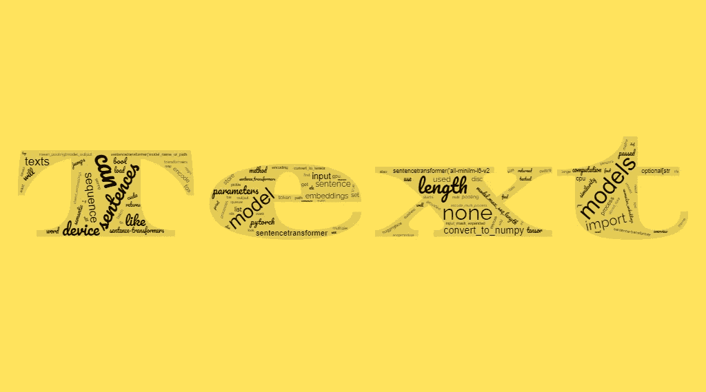

# SBERT 与 Data2vec 在文本分类上的比较

> 原文：<https://towardsdatascience.com/sbert-vs-data2vec-on-text-classification-e3c35b19c949>

## 使用两个流行的预训练拥抱脸模型进行文本分类的代码演示

作者图片

# 介绍

我个人确实相信，所有花哨的人工智能研究和先进的人工智能算法工作都只有极小的价值，如果不是零的话，直到它们可以应用于现实生活的项目，而无需向用户要求大量的资源和过多的领域知识。拥抱脸搭建了桥梁。拥抱脸是成千上万预先训练好的模型的家园，这些模型通过开源和开放科学为人工智能的民主化做出了巨大贡献。

今天，我想给你一个端到端的代码演示，通过进行多标签文本分类分析来比较两个最受欢迎的预训练模型。

第一款是[sentence transformers(SBERT)](https://www.sbert.net/)。这实际上是由达姆施塔特科技大学的[泛在知识处理实验室的团队为各种任务创建的一系列预训练模型的集合。我在以前的项目中使用过几次 SBERT。他们甚至有一个 python 库，为您提供了不使用拥抱脸 API 和 Pytorch 框架的灵活性。点击这里查看](https://www.informatik.tu-darmstadt.de/ukp/ukp_home/index.en.jsp)。

第二个模型是 [Data2vec](https://ai.facebook.com/blog/the-first-high-performance-self-supervised-algorithm-that-works-for-speech-vision-and-text/) ，这是一个由 Meta(脸书)的 AI 团队提供的强大的预训练模型。它是一个自我监督的框架(教师模型→学生模型),为文本、音频和图像编码而设计。如果你对它是如何开发的感兴趣，你可以在这里找到原文。

# 数据

对于数据，我使用一个著名的开源文本数据集:BBC 新闻集团(它的许可证在这里:[https://opendatacommons.org/licenses/dbcl/1-0/](https://opendatacommons.org/licenses/dbcl/1-0/))。您可以通过执行以下操作来加载数据:

作者代码

或者，你可以从我的 GitHub repo 中找到一个预处理过的 CSV 版本:[https://GitHub . com/Jin hangjiang/Medium _ Demo/blob/main/data 2 vec _ vs _ SBERT/BBC-text . CSV](https://github.com/jinhangjiang/Medium_Demo/blob/main/Data2vec_vs_SBERT/bbc-text.csv)

# 代码演示

## 步骤 1:安装并导入我们需要的包

作者代码

## 步骤 2:拆分数据进行验证

作者代码

这里注意一个细节:我使用的是 CSV 文件，而不是从 sklearn 导入数据。于是我给了输入数据为**一个 list (X.tolist())** 。如果不这样做，模型稍后会抛出错误。

## 第三步。对文本进行标记

作者代码

以下是一些澄清:

***model_name*** :该参数应为您要使用的预训练模型的名称字符串。你可以找到可用的型号:[https://huggingface.co/models](https://huggingface.co/models)

***【max _ length】***:该参数将直接影响训练时间和训练速度。如果每个文档都很长，您可能希望指定模型为每个文档处理的文本的长度。

***填充*** :如果给定了 max_length，则将该参数设置为 True。填充到批中最长的序列(如果只提供一个序列，则不填充)

## 步骤 4:将嵌入转换成 torch 数据集

作者代码

## 第五步:给模特打电话

作者代码

***AutoModelForSequenceClassification***:“AutoModel…”将帮助您自动识别要使用的正确型号。到目前为止，它对我来说很好。“……用于序列分类”专门用于分类问题。

to("cuda "):如果你的机器上有 GPU，你可以在末尾添加这个函数来利用 GPU 的能力。如果没有此功能，训练时间通常会显著增加。

步骤 6:定义评估指标

作者代码

***metrics_name*** :这应该是一个字符串。对于我们的演示，我选择“f1”作为评估指标。你可以在这里找到可用的选项:[https://github.com/huggingface/datasets/tree/master/metrics](https://github.com/huggingface/datasets/tree/master/metrics)

***平均*** :我传递这个参数是因为我在用 f1 的分数来评估一个多标签分类问题。它不是一个通用参数。

## 步骤 7:微调预训练的模型

作者代码

步骤 8:保存您的微调模型，使其可重用

作者代码

当您想要使用您的微调模型时，您需要做的就是用您自己的模型的路径替换步骤 3 和步骤 5 中的模型名称字符串。

您可以在这里访问完整的代码脚本:[https://github . com/Jin hangjiang/Medium _ Demo/blob/main/data 2 vec _ vs _ SBERT/data 2 vec _ vs _ SBERT _ 512 . ipynb](https://github.com/jinhangjiang/Medium_Demo/blob/main/Data2vec_vs_SBERT/Data2vec_vs_SBERT_512.ipynb)

# 结果

## 对于 SBERT(最大长度= 512，纪元= 5):

f1 最佳成绩:0.985034

f1 平均得分:0.959524

挂壁时间:15 分 36 秒

内存增加:5.0294 GB

## 对于 Data2vec (max_length = 512，epoch = 5):

f1 最佳成绩:0.976871

f1 平均得分:0.957822

挂壁时间:15 分 8 秒

内存增加:0.3213 GB

每次运行模型时，结果可能会有一些变化。总的来说，经过 5 次尝试，我可以得出结论，SBERT 在最好的 f1 成绩方面有更好的表现，而 Data2vec 使用了更少的内存。两款车型的 f1 平均成绩非常接近。

看完今天的演示，您应该有以下收获:

1.  如何使用预先训练好的模型来标记文本数据
2.  如何正确地将您的数据转换为 torch 数据集
3.  如何利用和微调预先训练的模型
4.  如何保存您的模型以备将来使用
5.  Data2vec 和 SBERT 的性能比较

***请随时与我联系***[***LinkedIn***](https://www.linkedin.com/in/jinhangjiang/)***。***

# 参考

Baevski 等人(2022 年)。data2vec:语音、视觉和语言自我监督学习的一般框架。[https://arxiv.org/pdf/2202.03555.pdf](https://arxiv.org/pdf/2202.03555.pdf)

拥抱脸。(2022).文本分类。[https://hugging face . co/docs/transformers/tasks/sequence _ class ification](https://huggingface.co/docs/transformers/tasks/sequence_classification)

Reimers，n .和 Gurevych，I. (2019 年)。句子伯特:使用暹罗伯特网络的句子嵌入。[https://arxiv.org/pdf/1908.10084.pdf](https://arxiv.org/pdf/1908.10084.pdf)