# 扩展您的数据科学意味着扩展您的计算

> 原文：<https://towardsdatascience.com/scaling-up-your-data-science-means-scaling-up-your-compute-ead3d5dd243d>

# 扩展您的数据科学意味着扩展您的计算

## 如何使用云虚拟机设置支持远程桌面的数据科学环境


Artur Aldyrkhanov 在 [Unsplash](https://unsplash.com?utm_source=medium&utm_medium=referral) 上拍摄的照片

在每个数据科学家的旅程中，经常会有这样一个时刻，她/他/他们已经不再学习数据科学的基础知识，并开始将新获得的知识应用到越来越大的数据集。与此同时，这些数据科学家也经常开始试验更复杂的模型，如深度学习模型。

随着我们的数据集越来越大，模型越来越复杂，所需的计算资源也在增加。在不太遥远的过去，这意味着我们需要购买更好的硬件。内存更大、光盘更大、芯片更快的笔记本电脑。幸运的是，如今随着云技术的出现，我们可以利用大得多的计算资源进行有限的使用，其成本只是购买高性能笔记本电脑的一小部分。

不幸的是，对于今天的数据科学学生来说，这些云资源也提供了许多利用更强大的计算环境的选项。如此之多，以至于它可能会变得相当混乱，不知道该把重点放在哪里。DataBricks、AWS Sagemaker 或 Google CoLab 等数据科学平台都提供托管数据科学环境，让数据科学家能够访问更强大的计算资源。

所有这些或多或少“受管理”的选项的缺点是，每个平台都有难以驾驭的方面。例如，Google CoLab 使用一个非持久性磁盘来存储您的工件(例如 csv 文件、结果输出等)，每次会话结束时都会删除这些工件。此外，磁盘环境的目录结构可能并不总是容易理解。最后，添加更多您可能需要的软件作为您的数据科学管道的一部分会更加困难，因为您对用于支持您的笔记本电脑的虚拟机的可见性更低。

尽管有这些限制，云环境仍然为数据科学家提供了大量短期借用大量计算资源的潜力，这有助于控制成本。在本教程的剩余部分，我将带您使用虚拟机和云存储桶来设置云数据科学环境。此外，我们将建立一个远程桌面连接，并安装 Anaconda 的 Miniconda，以实现更丰富的视觉体验，更类似于您自己的个人笔记本电脑。我们的目标是在不倾家荡产的情况下，让有兴趣扩大数据科学工作负载的年轻数据科学家具备相关能力。

对于那些只需要高级步骤而不需要所有解释的人，请参见 TL；文末博士。让我们跳进来。

# 第一步:选择云平台并建立账户

让我们面对现实吧，随着越来越多的公司使用云服务构建基础设施，云计算将会继续存在。对于所有数据科学家来说，熟悉云技术是数据科学之旅的一个基本组成部分，因为我们希望在这个不断发展的商业环境中保持竞争力。对于数据科学企业家来说，学习如何导航和利用云服务更加重要，因为学习这些技能可以让我们获得高性能计算环境和一流的人工智能服务，使我们的初创公司能够支持大规模企业。

因此，在现有的“三大”云平台(如 AWS、微软 Azure、谷歌云平台[GCP])中设立一两个账户是向前迈出的重要一步。在本教程中，我们利用 GCP，但 AWS 和微软的步骤是相似的，有一些明显的小差异。

这三种云中的每一种都提供了一个可通过浏览器访问的管理控制台。要找到 GCP 控制台，我只需打开 Chrome，搜索“GCP 控制台”如果你有一个链接到 Chrome 浏览器的 Gmail 帐户，点击搜索链接将打开该帐户下的控制台。如果您是第一次访问 GCP 控制台，您的屏幕应该是这样的:

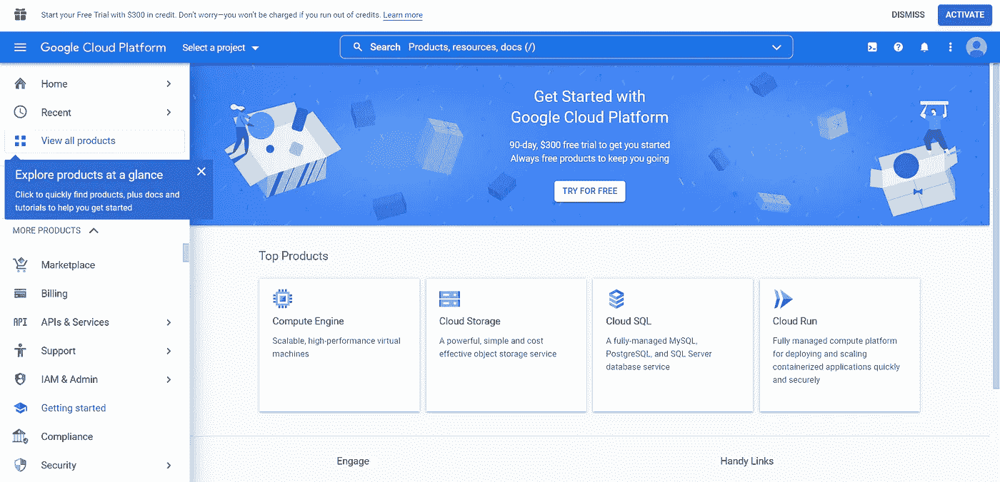

作者图片

你会注意到谷歌提供 300 美元信用的免费试用，这相当于相当多的实验。您还将被要求设置计费信息，这可以通过单击控制台中的“计费”链接来完成。请注意，虽然本教程中的大多数服务都很便宜，但如果不删除，随着时间的推移，它们会产生一些费用。一个很好的经验是，云服务使我们能够轻松扩展，但当我们这样做时，我们的成本也会增加😊让潜在的雇主知道你了解扩展这些云服务的后果，因此会是他们云成本的好管家，这总是好的。

先不说速度，几年前我很快就学到了这一课。我通过谷歌的 NLP API 运行一些从互联网上搜集的文本，为我正在测试的实验产品提取实体。我们的目标是将搜索范围扩大到数千个抓取的网页。当我自动化这个过程时，我注意到代码需要一段时间才能完成。不久之后，谷歌给我发了一封电子邮件，大意是“嘿，老兄，你正在运行异常高数量的 API 请求，所以我们为你停止了它，因为我们认为可能有问题。”天哪，有过吗？！？当我爬到我的控制台仪表板上去看发生了什么事时，我的胃沉了下去。啊，蟹肉块，我的预期账单从几美元涨到了 300 多美元。听起来不多，但对于一个我亲自买单的实验来说，只能说这远远超出了预算。经过一番挖掘，我发现我在搜索中找到的一个网页是一本书的几千页电子版。惨痛的教训。

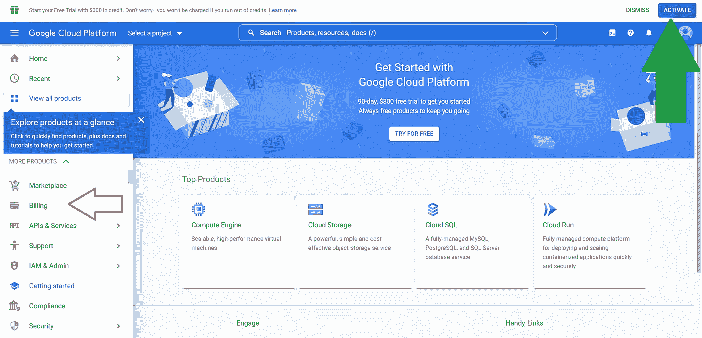

作者图片

一旦你建立了你的帐户，点击“创建项目”按钮。如果你已经设置了 GCP，那么你很可能会看到你已经在你工作的最后一个项目中，如下图所示。您可以选择为本教程创建一个新项目，也可以留在当前使用的项目中。

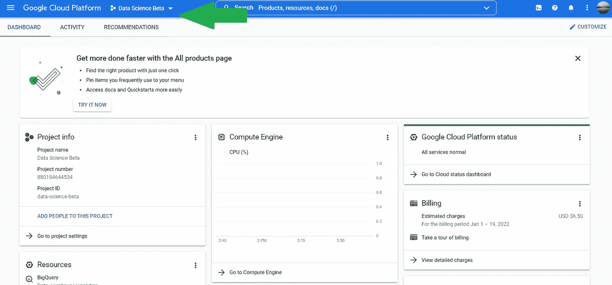

作者图片

# 步骤 2:创建虚拟机和存储桶

启用帐户后，下一步是设置一个虚拟机，用于设置我们的数据科学环境。点击左上角的“汉堡”菜单，向下滚动到菜单的“计算”部分。在“计算”下，你会看到一个“计算引擎”的选项，将鼠标悬停在该选项上会打开另一个带有更多选项的侧边栏。在顶部，您应该会看到“虚拟机实例”单击此处，让我们设置虚拟机。

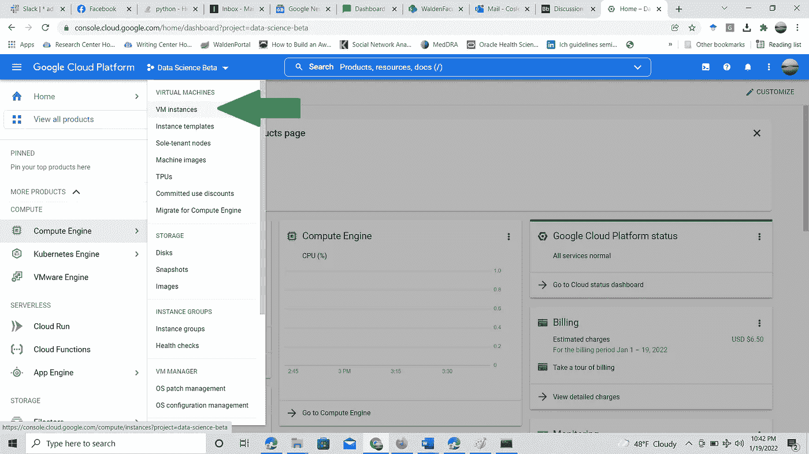

作者图片

在虚拟机设置页面上，您会注意到相当多的选项。让我们讨论一下数据科学环境中的重要问题。首先，是选择地区。选择地理空间上离您最近的地区，以确保最佳的网络速度。

接下来，选择您希望使用的实例类型。请注意，较大的计算资源与较高的每小时成本相关，例如正常运行时间。默认选择是 E2 实例，这是通用机器，当您向下滚动不同的 E2 选项时，仍然提供相当多的计算。对于这个演示，我将选择一台小型机器，它有 2 个虚拟 CPU(vCPU)和 2 GB 的 RAM。把 vCPUs 想象成线程。如果您有 2 个 vCPUs，您可以跨 2 个线程进行多进程处理。

运行这台机器的成本大约是 0.02 美元/小时，我们可以看到，如果我不小心让这台机器 24/7 运行一个月，它只需要大约 13 美元。不算太寒酸。

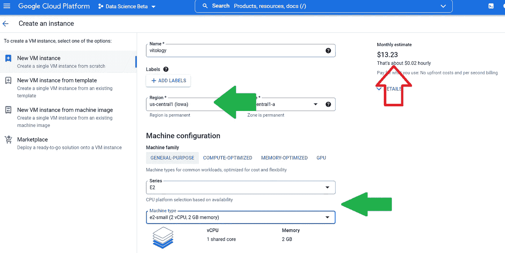

作者图片

我们要更改的下一个选项是启动盘的大小和操作系统。默认情况下，Debian OS 包含一个 10 GB 的引导磁盘，但是由于我们的目标是为我们的数据科学开发设置一个具有更丰富视觉体验的远程桌面，并计划安装 Anaconda，我们将需要一个更大的引导磁盘来处理所有这些应用程序。我选择了 100 GB 的启动盘。请记住，您还需要为正在使用的磁盘付费，也可以选择为 SSD 等速度更快的磁盘付费，但它们的价格甚至更高。不幸的是，引导磁盘不能像虚拟机那样关闭，所以只要它们在我们的帐户中，我们就要为它们付费。然而，总的来说，我们每月的花费仍然只有 22 美元左右。幸运的是，即使在启动虚拟机之后，磁盘大小也是可以调整的。

我也喜欢用 Ubuntu，所以我把我的 OS 换成了包含 Ubuntu。请注意，使用一些操作系统，如 Ubuntu Pro，会产生额外的云费用。

在设置我们的虚拟机时，我们最不想做的事情是选择让所有 Google APIs 都可以访问虚拟机的选项(“允许完全访问所有云 API”)。通过选择此选项，我们可以确保我们的虚拟机能够访问其他云服务，如我们将设置的云存储桶或 Google 的认知服务，如 Google NLP。Google NLP 是一个经过预先训练的机器学习解决方案，用于从非结构化文本中提取含义(参见上面我的故事，了解我如何使用 API)😊).

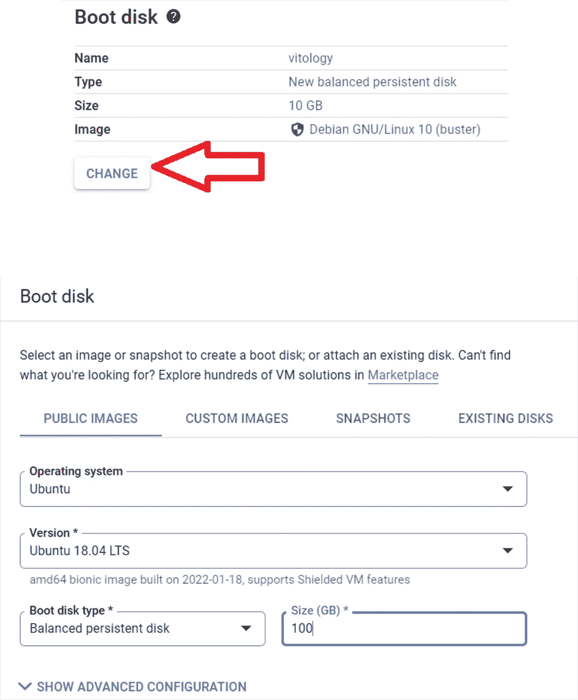

作者图片

一旦我们做出了选择，我们就可以启动我们的实例了。除了 VM 之外，我们还想建立一个 Google 云存储桶来保存我们的数据科学实验的任何工件。谷歌云存储桶比我们连接到虚拟机的磁盘更便宜，因此是一种经济高效的方式来存储我们的代码、数据集、模型和其他与数据科学项目相关的工件，如果我们选择在使用后删除它们。

例如，我们可以启动一个大型虚拟机实例，并设置我们的远程桌面来执行我们的研究和训练模型。一旦完成训练，我们就可以将实验代码、管道代码、最终模型、相关的训练数据集和 requirements.txt 保存到一个存储桶中。保存后，我们可以删除该实例，这样我们就不会再为虚拟机或相关磁盘产生费用。

Google 甚至允许我们将实例保存为映像，因此如果我们需要重新启动完全相同的虚拟机环境，因为我们可能下载了其他软件工具，如 Tesseract for OCR，我们可以使用保存的映像创建一个新的实例。

但是我跑题了。要设置云存储桶，我们需要做的就是选择左上角的“汉堡”菜单图标，向下滚动到存储。

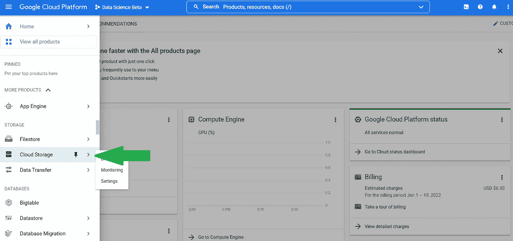

作者图片

选择后，我们可以选择创建一个存储桶，并为该桶提供一个唯一的名称。我们可能希望打开的另一个配置是，为了安全起见，确保没有对 bucket 的公共访问，如下所示。除了这些选择，缺省值将满足我们在这里的使用。

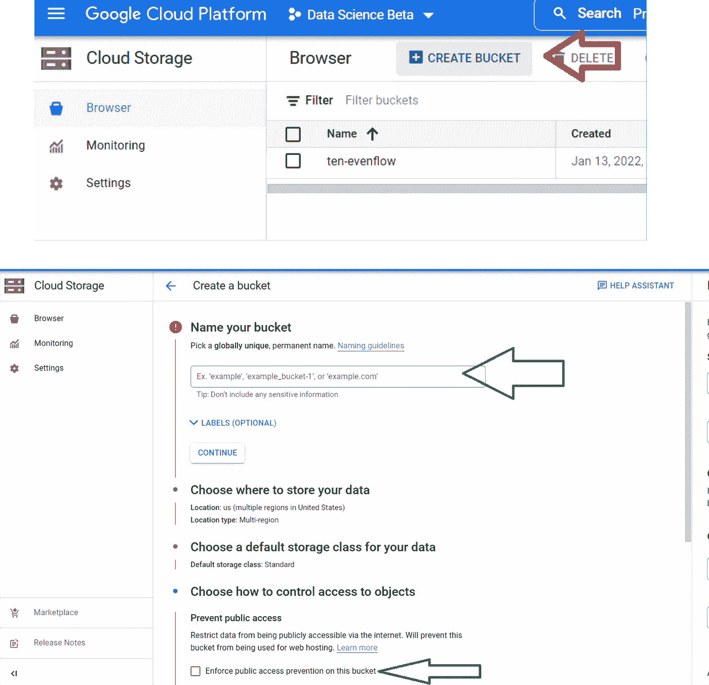

作者图片

# 步骤 3:设置防火墙规则

在开始使用我们的实例之前，我们还需要设置一些防火墙规则，允许虚拟机建立"[一个加密隧道，通过该隧道，您可以将 SSH、RDP 和其他流量转发到虚拟机实例](https://cloud.google.com/iap/docs/using-tcp-forwarding)"，并确保我们可以从本地笔记本电脑通过远程桌面连接到实例。要设置这些规则，请在搜索栏中键入“防火墙”点击“防火墙”服务。

防火墙窗口打开后，单击浏览器顶部的“创建防火墙规则”。我们将设置 2 个防火墙规则。第一个允许创建加密隧道，第二个允许从您的特定笔记本电脑访问。[此链接](https://cloud.google.com/iap/docs/using-tcp-forwarding)展示了如何创建防火墙规则以允许加密隧道。要设置允许您的个人笔记本电脑访问的规则，请先访问[此链接](https://whatismyipaddress.com/)并复制您的 IPv4 地址。

接下来，将目标更改为“网络中的所有实例”，将您的特定 IP 地址粘贴到“源 IPv4 范围”框中，选中“tcp”复选框，并在 TCP 框中输入“20，3389，4000”。这些端口允许 RDP、SSH 和 NoMachine(我们将使用的远程桌面应用程序)。


作者图片

既然您的防火墙规则已经设置好了，我们就可以在虚拟机上完成远程桌面的设置了。

# 步骤 4:通过 SSH 访问我们的虚拟机并安装远程桌面

现在我们的项目已经设置了初始的云服务，下一步是回到我们刚刚设置的 VM 实例。单击左侧菜单栏中的“VM Instance”选项将弹出一个窗口，其中列出了我们为此项目启动的虚拟机。

与 AWS 相比，Google 的优点在于它提供了一个基于浏览器的 SSH 连接窗口，可以直接从实例启动命令 shell。另一方面，如果您使用 Windows，AWS 需要使用第三方 SSH 客户端，如 Putty，这也意味着您需要下载 Putty 用来与 AWS 云上任何正在运行的实例建立安全 SSH 连接的私钥。

只要您登录到控制台环境，Google 就会为您处理这些 SSH 密钥，为我们节省了一个敏感的安全步骤。

单击新创建的实例旁边的 SSH 按钮后，一个 SSH shell 将在一个新窗口中打开。

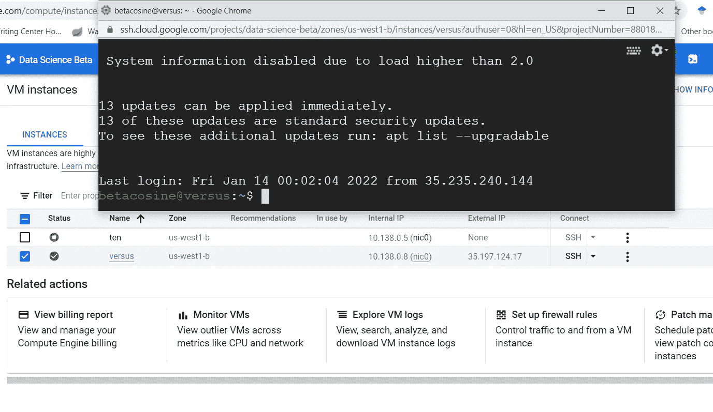

作者图片

现在，我们提交一系列命令，这些命令将执行以下操作:1 .更新我们的 Linux 应用程序 repo，2。将用户添加到机器，以便从远程桌面连接(系统将提示您设置密码，其余信息是可选的)，3 .从 NoMachine 下载我们的 Ubuntu 操作系统的最新远程桌面应用程序，4。并在虚拟机上设置我们的访问规则，以允许基于密码访问机器。

下面是要输入的命令。请注意，这一步需要一点时间来下载。完成后，返回控制台中的虚拟机窗口，停止然后启动实例，以说明对机器所做的所有更改。在这里，为您的虚拟机复制外部 IP。

本地机器的快速步骤。我们正在使用一个免费的远程桌面应用程序，名为 NoMachine。要建立远程桌面连接，我们需要在笔记本电脑上安装 NoMachine 软件。你可以通过访问这个[链接](https://www.nomachine.com/download)来实现。

```
sudo apt-get updatesudo apt-get upgrade -ysudo adduser usernamesudo apt-get install ubuntu-desktopwget [https://www.nomachine.com/free/linux/64/deb](https://www.nomachine.com/free/linux/64/deb) -O nomachine.debsudo dpkg -i ./nomachine.deb
```

下面是如何使用 VIM 在 shell 中设置访问规则。

```
sudo vim /etc/ssh/sshd_config
```

一旦 VIM 打开配置文件，输入以下内容:

```
- press i and then enter
- change “PasswordAuthentication” line from no to yes
- press esc then :wq
```

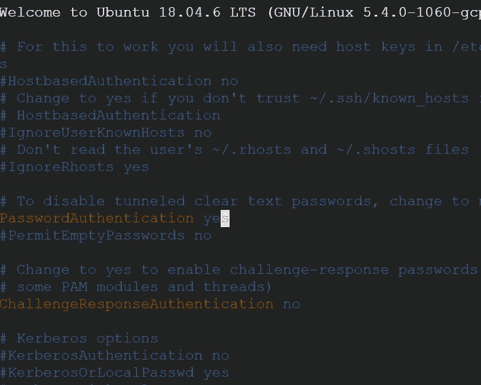

作者图片

# 步骤 5:访问远程桌面并安装 Miniconda

一旦您在本地笔记本电脑上下载了 NoMachine，打开应用程序并单击“添加”来添加您的新连接。您将需要虚拟机的外部 IP 地址，以便将应用程序指向正确的访问位置。注意，每次你关闭你的虚拟机和重启外部 IP 都会改变。你可以向谷歌申请创建一个“静态 IP ”,或者在重新连接时确保重新复制和粘贴。

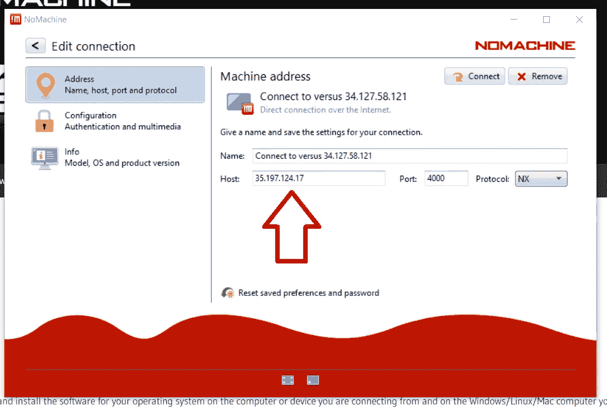

作者图片

此外，请确保在连接前选择“配置”并选择“使用密码验证”选项。

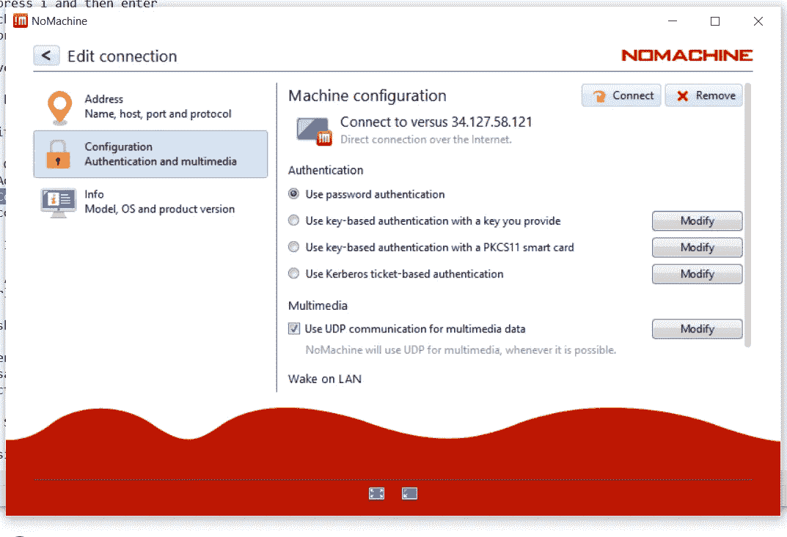

现在是我们期待已久的时刻。点击“连接”并输入您的用户名和密码。一旦你完成了 NoMachine 和 Ubuntu 的设置问题，你应该会看到你新创建的桌面。

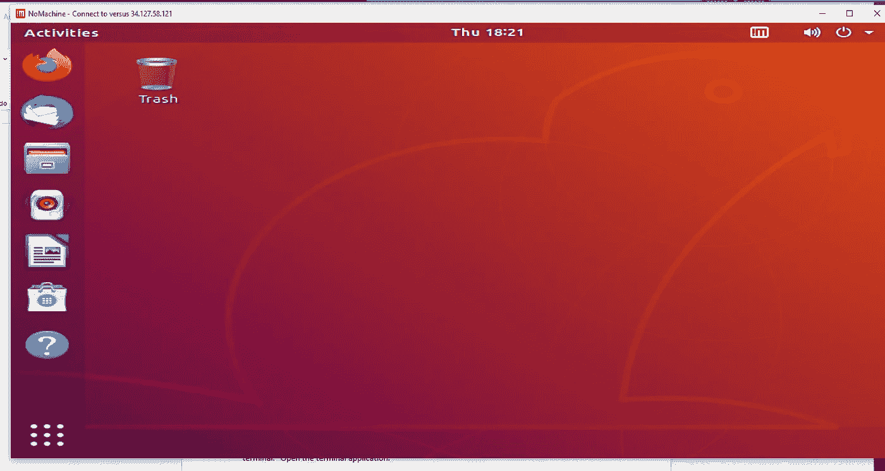

作者图片

从这里开始，我们将像对待任何桌面环境一样对待我们的桌面。Ubuntu 桌面包括一个终端，我们可以启动它来运行命令行提示。要找到它，点击“显示应用程序”按钮，然后在搜索框中输入“终端”打开终端应用程序。


作者图片

打开后，我们将使用以下命令将 Miniconda 安装程序下载到新创建的目录(/miniconda3)中:

```
mkdir -p ~/miniconda3
wget [https://repo.anaconda.com/miniconda/Miniconda3-latest-Linux-x86_64.sh](https://repo.anaconda.com/miniconda/Miniconda3-latest-Linux-x86_64.sh) -O ~/miniconda3/miniconda.sh
bash ~/miniconda3/miniconda.sh -b -u -p ~/miniconda3
rm -rf ~/miniconda3/miniconda.sh
~/miniconda3/bin/conda init bash
```

上面的代码取自[这里的](https://waylonwalker.com/install-miniconda/)，如果需要关于代码做什么的额外解释。

# 步骤 6:数据科学环境

完成上述命令后，Miniconda 会要求您关闭然后重新打开终端。执行此操作后，您将看到一个“(base)”描述符出现在命令行上终端屏幕的左侧。这告诉您现在正在使用 Anaconda 环境，您可以自由地使用常见的命令，比如包安装(conda 或 pip)。要停用 conda 环境，只需输入“conda 停用”或“conda 激活”即可重新激活。

让我们安装一个 IDE (Spyder)和一个特定的包来用 Python 访问我们的 Google 云存储桶。

```
conda install spyder
pip install gcsfs
pip install pandas
```

安装完软件包后，在终端中键入“spyder”来启动 Spyder IDE。在下图中，我添加了一些代码来创建一个 dataframe，将它作为一个. csv 文件保存到我们的存储桶中，然后删除它。

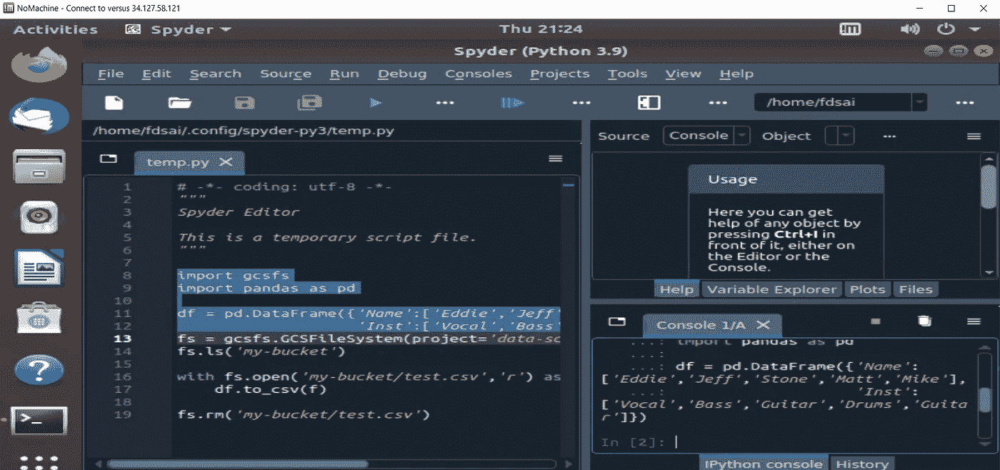

作者图片

```
import gcsfs
import pandas as pddf = pd.DataFrame({'Name':['Eddie','Jeff','Stone','Matt','Mike'], 'Inst':['Vocal','Bass','Guitar','Drums','Guitar']})fs = gcsfs.GCSFileSystem(project='your-project-name')
fs.ls('your-bucket')with fs.open('your-bucket/test.csv','r') as f:
 df.to_csv(f)fs.rm('your-bucket/test.csv')
```

仅此而已。现在，您已经使用云服务成功设置了自己的虚拟数据科学环境。

关于上面的设置，最后一个警告。我们的引导磁盘只有 100 GBs，对于像 Pandas 这样的大型 Python 数据科学库来说，这实在是小得可怜。实际上，您更可能希望使用更大的引导磁盘(500 GB 或更大)来支持您的实验。只要你记得在完成后停止并删除你的实例，你就能有效地控制成本。

# 结论

同样，这种方法的核心优势是用户控制，因此这是一种利用云服务处理超过笔记本电脑需求的大型数据科学工作负载的好方法，其成本只是外出购买新笔记本电脑的一小部分。

此外，初创公司可以避免与更多托管解决方案相关的成本不确定性，还可以利用按需提供自己的虚拟机实例的灵活性。

比如参与学习数据科学、职业发展或糟糕的商业决策？[加入我](https://www.facebook.com/groups/thinkdatascience)。

# TL；速度三角形定位法(dead reckoning)

GCP 设置

1.创建虚拟机实例
-更改实例类型
-更改引导磁盘
-更改对 API 的访问
-创建后复制外部 IP

2.转到防火墙
-添加 allow-ingress-from-iap
名称:allow-ingress-from-iap
流量方向:Ingress
目标:网络中的所有实例
源过滤器:IP 范围
源 IP 范围:35.235.240.0/20
协议和端口:选择 TCP 并输入 22，3389，4000 以允许 RDP 和 SSH 以及 nomachine。

-添加笔记本电脑到虚拟机
流量方向:入口
目标:网络中的所有实例
源过滤器:IP 范围
源 IP 范围:您的 IPv4
协议和端口:选择 TCP 并输入 22，3389，4000 以允许 RDP、SSH 和 nomachine。

3.为桌面设置虚拟机
- SSH 到虚拟机

sudo apt-get 更新
sudo apt-get 升级-y

sudo adduser 用户名

安装 ubuntu 桌面

https://www.nomachine.com/free/linux/64/deb-O nomachine . deb

sudo dpkg -i ./nomachine.deb

-在虚拟机上配置系统 SSHD，以启用基于密码的身份验证。

编辑/etc/ssh/sshd_config，将“PasswordAuthentication”行从“No”更改为“Yes”。

sudo vim/etc/ssh/sshd _ config
-按 I 然后回车
-从否变为是
-按 esc 然后:wq

保存更改。

返回 GCP 仪表板，停止并启动您的虚拟机。

等到它重新启动

4.在本地打开 no machine
-添加
-配置使用 pw 认证
-连接

5.安装

-miniconda
mkdir-p ~/miniconda 3
wget[https://repo . anaconda . com/miniconda/miniconda 3-latest-Linux-x86 _ 64 . sh](https://repo.anaconda.com/miniconda/Miniconda3-latest-Linux-x86_64.sh)-O ~/miniconda 3/miniconda . sh
bash ~/miniconda 3/miniconda . sh-b-u-p ~/miniconda 3
RM-RF ~/miniconda 3/miniconda . sh
~/miniconda 3/bin/

*   anaconda
    CD/tmp
    curl-O[https://repo . anaconda . com/archive/anaconda 3-2021.05-Linux-x86 _ 64 . sh](https://repo.anaconda.com/archive/Anaconda3-2021.05-Linux-x86_64.sh)
*   bash anaconda 3–2021.05-Linux-x86 _ 64 . sh

6.设置 Google 云存储

-简单地设置一个桶并阻止公共访问

7.根据需要返回桌面
安装库