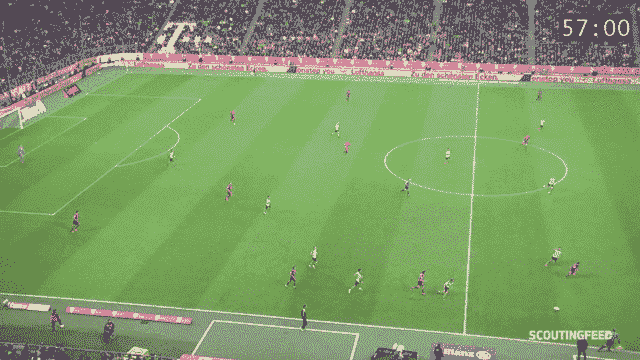
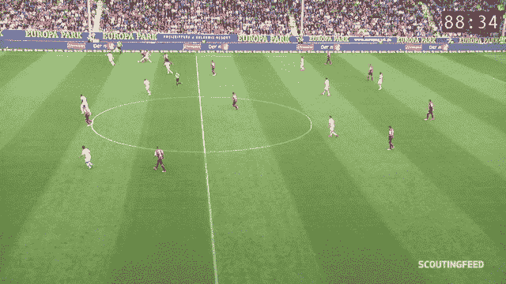
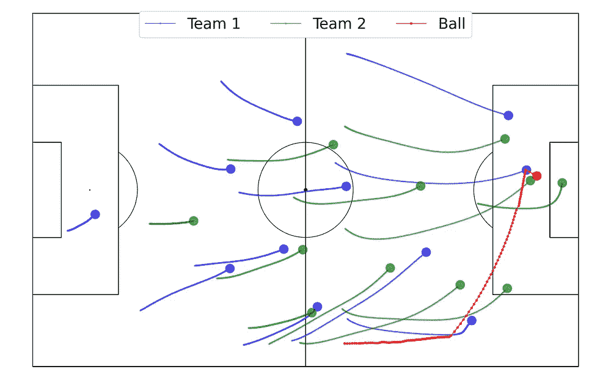
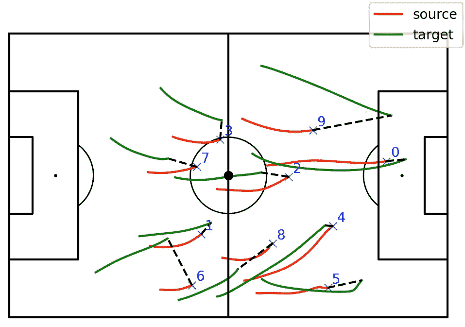
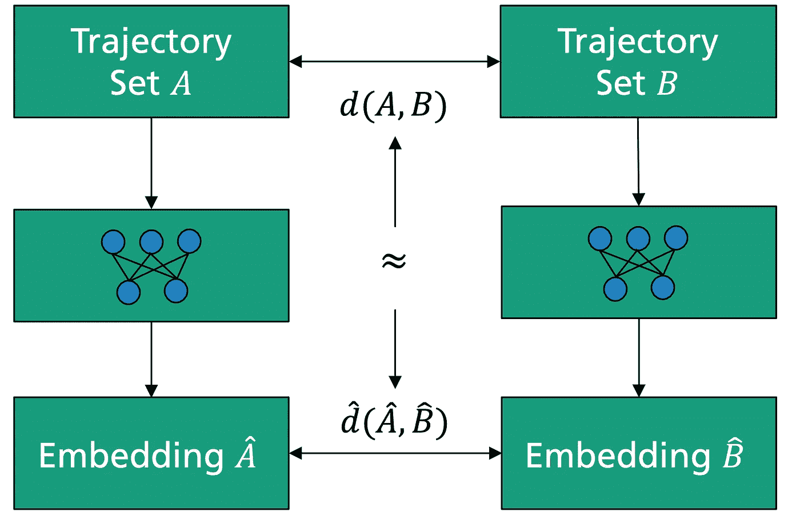
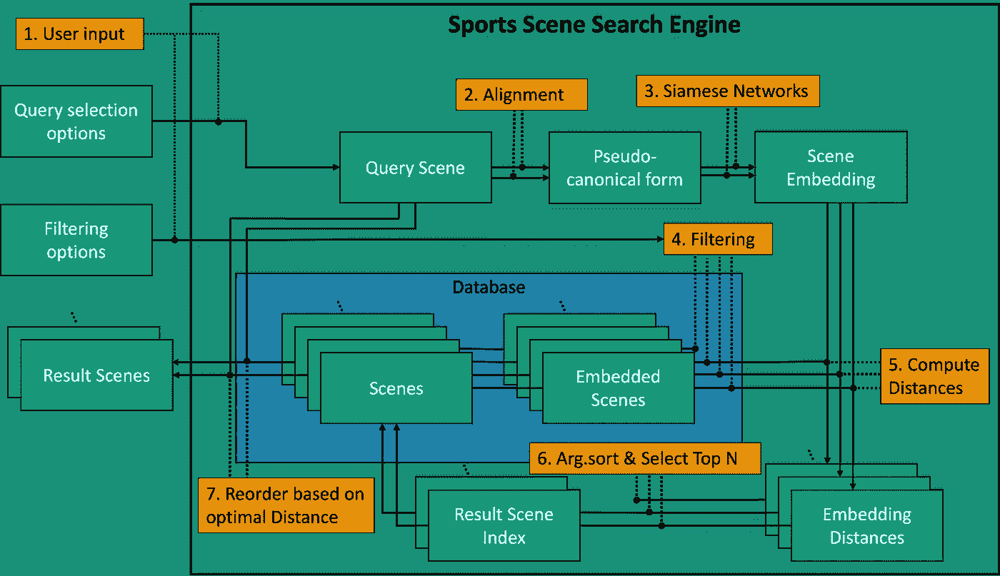
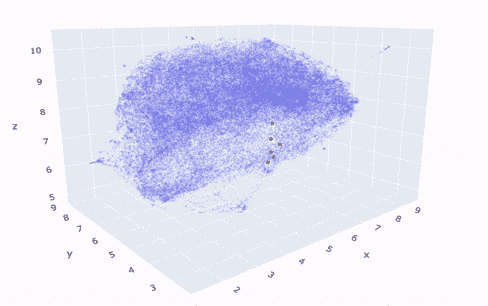

# 使用连体神经网络搜索足球场景

> 原文：<https://towardsdatascience.com/searching-for-soccer-scenes-using-siamese-neural-networks-76405ef159e>

## 如何在多智能体轨迹数据中找到相似的运动模式

在体育运动中产生定位数据的设备和系统的广泛使用需要工具来大规模地分析这些数据。为此，我们开发了一个多代理跟踪数据搜索引擎，我们在本文中介绍。该引擎能够在几秒钟内在大型数据库中找到类似的运动模式。想知道它是如何工作的吗？那就继续读下去！

**图 1:** 在一次反击中，我们使用本文中概述的方法找到了两个几乎相同的交叉场景。这两个场景都源于不同球队的不同比赛，以及潜在的不同阵型。虽然使用传统方法可以找到两个场景，因为它们包含事件“交叉”，但是我们的方法快速过滤掉大多数交叉，因为基于玩家移动，只有少数场景实际上是相似的。我们在整个系列中将这些场景称为左边的 **Q** (即查询)，右边的 **R** (即结果)。(*图片由作者提供，*视频由 DFL Deutsche fubal Liga 经许可提供)

我们可以访问一个大型足球数据库，其中包含一个赛季的跟踪数据，即球员轨迹、比赛统计数据和专家注释的事件，如德国德甲联赛的*传球*或*射门*。虽然事件允许你找到像角球这样的定位球，但结果是粗糙的，因为它们没有考虑球员在事件中的行为。此外，一些潜在利益的情况，如反击，不是由事件表示的。为了能够对足球比赛进行精细分析，必须考虑球员的运动(即跟踪数据)。

*图 1* 显示了我们在追踪数据中进行足球场景搜索的结果。图的左边部分显示了查询场景。反击中的传中是在球场的一侧进行的，在禁区内找到一名前锋。目标紧随其后，但没有显示出来。图的右边显示了一个非常相似的场景，但是来自一个不同的游戏，这是我们的方法的搜索结果。右边的结果场景的情节是镜像的，因为攻击队从右到左比赛。使用控球注释，我们使所有场景正常化，这样控球的球队从左向右比赛。因此，我们可以找到所有相似的运动模式，与演奏方向无关。

为了提高搜索的计算效率，我们还在 5 秒长的窗口中切割每个游戏。这允许我们以标准化的格式表现场景，包括 23×125×2 的值(25 赫兹的采样率，22 名球员和球在 2D 坐标系中)。这看起来像是非常限制性的假设，但是我们将在本文后面介绍可变场景长度的扩展。

## 相似性度量和指派问题

在多智能体跟踪数据中搜索在理论上是简单的。设置:给你两组无序的轨迹(例如，进攻队的场上队员)，你应该返回一个数字来表示它们有多相似，即*距离度量*的倒数(低距离≙高相似度)。根据这个标准，我们可以在数据库中搜索最近的邻居，这样就完成了(理论上)。

那么，我们如何衡量这里的相似性呢？存在各种很好理解的基于轨迹的相似性度量。但是在我们的例子中，我们操作的是*无序集*(由于阵型之间没有明确的映射，球员也可能在比赛中扮演不同的角色)，因此我们还需要一个分配方案，将这些转换成有序集，在此基础上我们可以计算连贯轨迹对之间的相似性。我们分两步实现这一点:

1.  **轨迹分配:**我们使用 [*匈牙利算法*](https://en.wikipedia.org/wiki/Hungarian_algorithm) 为彼此分配最优轨迹。匈牙利算法需要一个成本矩阵(包含将 A 中的所有项目分配给 B 中的所有项目的成本)来优化，我们使用轨迹距离度量来计算，例如[欧几里德距离](https://en.wikipedia.org/wiki/Euclidean_distance)。这产生了最佳轨迹分配，即两个局部有序轨迹集。图 2 显示了结果赋值的一个例子。
2.  **距离聚合:**给定两个有序轨迹集，我们通过平均来聚合相干轨迹之间的距离，从而得到可用于搜索的最终场景距离。

**图 2:** 图 1 中查询 **Q** (左)和结果 **R** (右)之间两个攻击队的最优分配。相互分配的轨迹由虚线连接。此外，任意局部轨迹对排序通过蓝色索引显示。我们如何实现全球排序将在后面讨论。(*图片作者*)

有了这个距离度量，我们可以在数据库中搜索最相似的场景。给定一些查询 **Q，**我们为每个可能的结果分配轨迹( **X₁** ，… **Xₙ** )，合计距离并返回所有具有最低距离的 **X** 。这种天真的方法的问题是它非常慢，因为对于数据库中的每一项，都必须解决一个小的优化问题(即匈牙利算法)。此外，不能应用加速搜索的普通技术，如聚类，因为在分配之前，轨迹很可能是不一致的。

根据相关文献，我们将这个问题称为*分配问题*。这个问题的自然结论是构建一些全局轨迹排序方案。给定这样的方案，在建立搜索引擎时，为每个数据库项目进行一次计算上昂贵的轨迹分配步骤，而不是为每个查询进行一次。几篇论文提出了这样的方案:沙等人[1]学习了一个模板(即每支球队在球场上的 10 个巧妙定位的点)，数据库中的所有场景(**，…**)都被分配给该模板，同样使用匈牙利算法。在检索过程中，将查询分配给模板，跳过每个数据库项的最佳分配。在接下来的论文中，Sha 等人[2]提出了一个学习模板层次结构的方案，允许使用多个模板来考虑各种游戏情况。另一方面，Wang 等人[3]通过对场景图像进行操作，完全避开了这个问题。****

****也就是说，我们有经验证据表明，这样的全局轨迹排序方案一般来说不可能是最优的。因此，上面概述的方法产生带有未量化误差的次优结果。我们的方法直接逼近最佳距离，并产生可量化的误差，我们可以使用这些误差来衡量性能。下面的部分详细阐述了这一主张，并概述了我们的近优解决方案。****

## ****轨迹集的伪标准形****

****一组对象的标准形式，在我们的例子中是所有无序轨迹集，为每个等价类给出了满足某个*属性*的*特定表示*。例如，由从 q₁到 q₁₀的 10 条轨迹组成的无序轨迹集
**Q** ={q₁，…，q₁₀}，等于轨迹索引的某种排列: **Q** ={q₁₀，…，q₁}关于之前定义的相似性(由于最优分配)。这意味着 **Q** 的等价类是所有轨迹索引排列的集合。我们想要满足的性质是，该等价类的代表(即，特定的轨迹排列)被最优地分配给所有其他等价类的代表。换句话说:轨迹集的标准形式是全局最优排序。给定这样一个标准形式，我们可以根据它们的索引来比较轨迹，跳过昂贵的赋值步骤，快速得出最佳距离。****

****不幸的是，这样的规范形式并不存在。例如，如果您优化分配了 **A** ↔ **B** 和 **A** ↔ **C** ，则存在一些未优化分配的三元组 **B** ↔ **C** 。这意味着我们要么接受最佳结果的慢速搜索，要么接受次优结果的快速搜索。****

> ****TLDR:没有简单的方法可以绕过昂贵的分配步骤。****

********

******图 3** :使用我们的伪规范场景表示法在 **Q** 和 **R** 之间进行轨迹分配。与图 2 相反，轨迹不是由匈牙利算法分配的，而是基于它们的索引。基于相对于编队质心的角度来计算轨迹指数，该角度可针对每个场景单独计算。(图片由作者提供)****

****但是有办法在保持高检索速度的同时达到接近最优的结果。为此，我们使用试探法构建伪规范表示。我们根据轨迹围绕每队质心的角度对轨迹进行排序。通过这种方式，阵型被考虑在内，分配适用于球场的所有部分。*图 3* 显示了在我们的伪正则场景表示下 **R** 和 **Q** 之间的轨迹分配。注意，与图 2 中的*相比，轨迹对排序是系统化的。同样重要的是要注意，在图 3* 的*中，轨迹不是使用匈牙利算法相互分配的，而是基于我们的角度启发式算法得出的索引，该索引是独立于任何其他轨迹集计算的。*****

****虽然使用这种试探法分配给彼此的轨迹可能不是最佳的，但是它确实显著地减少了最佳分配的误差:如果我们基于如何从数据库中检索轨迹来分配轨迹给彼此(即，随机的)，相对于最佳分配的误差平均约为 60%；使用启发式算法，我们将这个误差平均降低到 4%左右。接受这个误差允许我们在回收过程中跳过计算量大的轨迹分配步骤。****

## ****使用连体网络逼近最佳距离****

****为了进一步减少这种误差，我们采用连体神经网络来近似基于这些启发式对齐轨迹集的最佳距离。该方法概述如下。****

****我们随机抽取一批场景对，用前面描述的角度试探法将它们相互对齐。这两个场景然后通过暹罗网络产生两个 64 维向量。拟合网络，使得嵌入 d̂中的距离(我们选择欧几里德距离)等于轨迹集之间的距离(见*图 4* )。理想情况下，嵌入距离与最佳距离匹配，我们可以快速搜索最近邻的嵌入。****

********

******图 4** :连体神经网络的训练示意图。两个轨迹集 A 和 B(例如，两个攻击队轨迹)是在所有可用的轨迹集中随机选择的。我们计算两者之间的最佳距离 d(A，B)作为网络的目标。这两个集合通过网络被转发以产生两个 n 维向量 Â和 B̂.然后，网络适合于最小化嵌入距离 d̂(â(b̂)和最佳距离 d(A，b)之间的差异。(图片由作者提供)****

****该网络由时间卷积网络实例化，我们通过使用梯度下降最小化均方误差来拟合该网络。我们还对其他损失进行了实验，例如，通过最佳距离的倒数对损失进行加权(产生局部精确的嵌入，类似于 [Sammons 映射](https://en.wikipedia.org/wiki/Sammon_mapping))，但没有显著的改进。****

****我们发现的最佳配置将误差降低到 2%多一点。这不仅因为维数较低(64 比 2500 = 10 * 2 * 125)而更快，而且还允许通过聚类来减少搜索空间。****

## ****让足球场景可搜索****

****为了完全代表整个足球场景，我们训练两个连体网络(参见*图 5* 中的步骤 3)，一个用于控球(或拥有大部分控球权)的球队，一个用于另一个。这允许用户通过计算两个嵌入中距离的加权和来指定两个团队的权重。例如，取决于应用，攻击队的动态可能更重要，反之亦然。另一方面，球不需要分配，因此计算轨迹距离的相似性是可行的。由于由连体网络产生的嵌入近似最优轨迹集(即，团队)距离的平均值，团队的规模和球嵌入距离是可比较的，从而也允许类似地加权球的重要性。****

********

******图 5:** 我们的体育场景搜索引擎的系统概述。 **1。**用户通过在查询选择和过滤选项中进行选择来指定搜索参数。 **2。**查询场景基于角度启发式对齐，并为两个团队带入其伪规范形式。 **3。**使用两个连体网络将场景投影到嵌入中。 **4。**基于用户过滤规范，选择所有嵌入场景的子集作为候选。 **5。**计算查询和候选结果之间的距离。 **6。**对距离进行排序，并保留最近的 N 个邻居的索引。 **7。**计算查询和每个结果场景之间的最佳距离，以确定最终的结果排序。数据库中每个场景的嵌入向量是在系统设置期间计算的，并且必须为添加到其中的任何新场景进行计算。(图片由作者提供)****

****为了减少由近似引入的误差，我们基于到查询的最佳距离对结果场景进行排序(参见图 5 中的*步骤 7)。这降低了对那些场景的近似距离的影响，由于高估了它们的真实距离，我们可能在最近的 N 个邻居中错过这些场景，如果检索到足够多的(例如 1000 个)最近的邻居(尽管不是所有的邻居都必须显示给用户)，则真实距离是最小的。这种方法允许我们将搜索整个赛季的足球场景的时间从大约一个小时(对于天真的方法)减少到不到一秒，同时检索接近最优的结果。*****

****给定足够大的数据库，检索时间可能会变得过长。通过对嵌入空间进行聚类，可以进一步提高检索速度。在距离计算之前，找到嵌入查询的最近的聚类中心，并且只有落入该聚类中的那些场景才有资格沿着管道进一步处理。通过增加聚类的数量，所有下游处理成本将除以该数量，代价是可能会丢失位于邻近聚类边界错误一侧的场景。****

************

**图 6:** 包含 17 个匹配的嵌入的 3d-UMAP 投影。(图片和视频由作者提供)**** 

*****图 6* 示出了 17 个匹配子集的学习嵌入的三维投影。查询 **Q** 用绿色标出，5 个最近的邻居用红色标出。大部分场景源于连续的主动播放，导致主集群较大。位于主集群之外的两个小集群(左下方)是两个定位球，它们导致了在活跃的比赛中很少观察到的特殊动态，即射门和开球。有趣的是，其他定位球，如角球，并没有表现出足够的差异，以主动发挥位于主群之外(但这也可能是由于投射方法和维度)。最后，主集群上方可见的几个异常值是游戏暂停的场景，但注释错误地声称游戏是活动的。****

## ****延伸到更长的场景****

****为了搜索大于 5 秒的动态场景长度，我们使用现有的嵌入，将包含在较长场景中的每个 5 秒窗口映射到嵌入中，并将较长场景视为嵌入中的轨迹。我们计算嵌入中所有 5 秒窗口序列的欧几里德距离，并产生具有最低距离的那些。****

## ****结论****

****足球比赛或一般团队运动的精细分析可以通过考虑运动员的运动来增强。我们概述了我们的方法来搜索大型数据库的无序轨迹集相似的运动模式在互动的速度使用暹罗神经网络。****

# ****承认****

****这项工作得到了巴伐利亚经济事务、基础设施、能源和技术部的支持，作为巴伐利亚项目 Leistungszentrum Elektroniksysteme(LZE)的一部分，并通过分析-数据-应用中心(ADA-Center)在“拜仁数字 II”框架内提供支持。****

****我还要感谢我在弗劳恩霍夫国际研究所的同事 Daniel Dzibela、Christoffer Lö ffler、Robert Marzilger 和 Nicolas Witt，感谢他们支持本文系统的开发和对本文的审阅。****

# ****参考****

****在我们的出版物中找到更多详细信息:****

****  

[1]沙，龙等.**黑板:一种新的体育比赛时空查询范式.***第 21 届智能用户界面国际会议论文集*。2016.
【2】沙，龙等.**基于树的轨迹对齐的体育比赛细粒度检索** *arXiv 预印本 arXiv:1710.02255* ，2017。
【3】王，郑，等.**基于深度表征学习的高效体育游戏检索。***第 25 届 ACM SIGKDD 知识发现国际会议论文集&数据挖掘*。2019.****