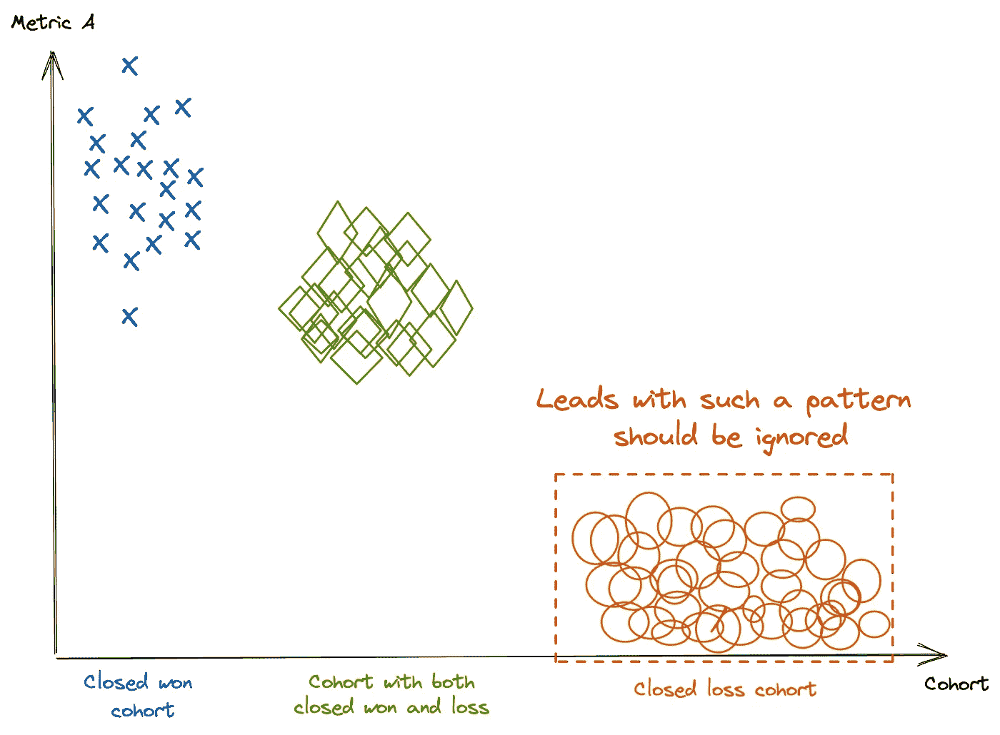
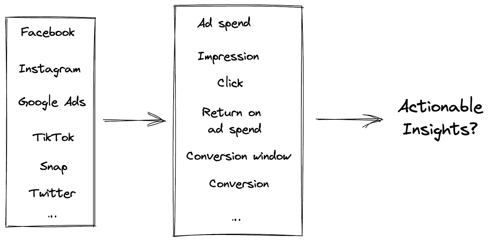

# 用数据科学抓住商业中唾手可得的果实

> 原文：<https://towardsdatascience.com/seizing-the-low-hanging-fruit-in-business-with-data-science-7b3a3265e07e>

## 今天，我想分享一个看似常识却常常被忽视的数据科学发现

企业只需在不起作用的项目上削减预算，就能获得巨大的增长机会——这是商业中唾手可得的果实。

我曾经在一家初创公司担任数据科学家。这家初创公司的大部分收入来自内部销售线索。尽管每天都有令人满意的销售线索，但转化率并不理想。出于对如何用有限的资源提高转化率和收入的好奇，我启动了[一个领先评分项目](/supercharge-your-monetization-a-practical-way-to-lead-scoring-99452db89dec)来寻找最有可能转化的潜在群体。

在从数据中获得任何有意义的见解之前，我预计会花几周时间建立数据管道并运行机器学习模型。因为，如你所知，一个领先的评分项目需要付出巨大的努力。

令人惊讶的是，在我汇总数据后不久，我发现了一些有趣的事情——数据表明该公司应该忽略至少 80%的入站销售线索。这些线索通常来自明显买不起该产品的潜在客户——一旦销售团队在一个地方看到所有访问者的属性，他们就可以很快判断出谁永远不会转换。

例如，指标 A 被证明是预测转化率的关键指标。虽然高指标 A 不能保证成交，但低指标 A 表示成交亏损，如下图所示。

作者图片

然而，销售团队花了 50%的时间——如果不是更多的话——来追逐 orange 队列。为什么？团队面前没有潜在客户的完整图片。

一旦公司实施了销售线索评分系统来指导销售工作，销售效率在三个月内就提高了两倍。销售团队不再关注那些低质量的销售线索，而是达成了更多和更大的交易。

后来，当我在各种公司(包括 B2B 和 B2C)从事更多数据科学项目时，我注意到了这种重复的模式。例如，许多公司的广告活动表现如下图所示:很大一部分预算花在了几乎没有回报的活动上。应该立即关闭这些活动。

作者图片

一旦一家公司削减了表现不佳的营销活动或其他举措，它就会立即为高潜力的飞行员提供更长的跑道。

**在当前充满不确定性的经济形势下，用更少的资源创造更多的收入比以往任何时候都更加重要。**

你可能会问，为什么公司会继续把钱花在没有前途的东西上。他们不会的。一旦看到业绩的全貌，大多数高管会迅速采取行动，削减停滞举措的支出。然而，问题是直到他们已经浪费了数万美元，如果不是数百万美元，他们才有这样的照片。以营销数据为例；在一家积极开展营销活动的公司中，数据流如下所示。

作者图片

如果没有专门的头脑和数据战略方面的努力，大多数公司不会对其业务绩效有一个整体的看法。因此，减少浪费在表现不佳的计划上的资源的机会永远不会到达高管手中。许多公司将数据科学视为必需品，在高管们无法理解什么可行、什么不可行及其原因之前，不会投资于分析。

相反，数据科学是每个公司的关键路径，即获取客户。

对每家公司来说，实时监控业务表现并迅速停止有负回报的计划是唾手可得的事情。这将给公司更多的时间和现金来度过不稳定的经济。

你可以阅读[数据战略](/connect-the-dots-in-data-strategy-56f65a1e63a5)中的点点滴滴，了解更多如何抓住低垂的果实。在接下来的文章中，我将讨论如何进行实验，以及如何用数据来识别在商业中起作用的东西。敬请期待！