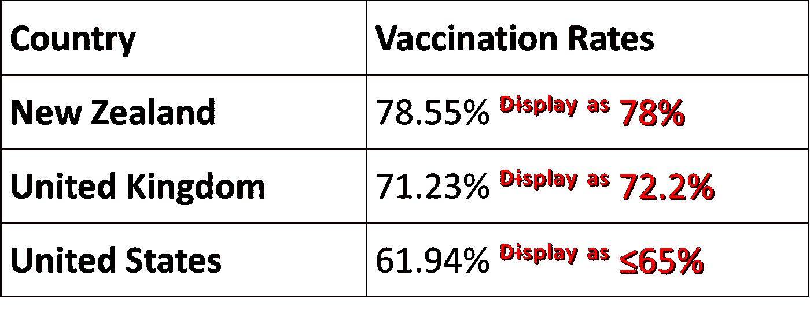
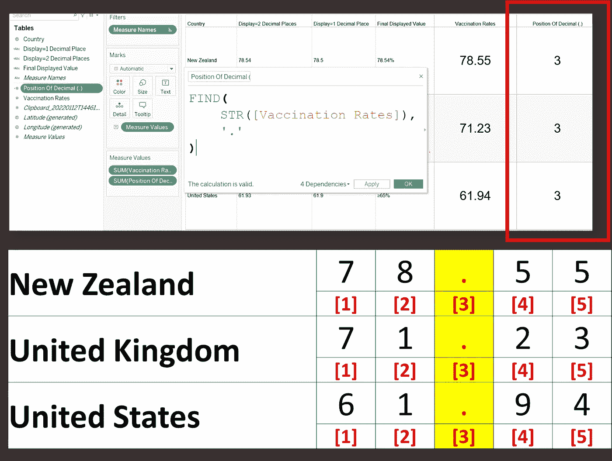
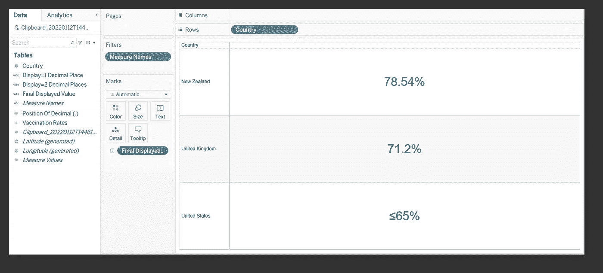

# Tableau 中数字的选择性格式

> 原文：<https://towardsdatascience.com/selective-formatting-of-numbers-in-tableau-f5035cc64b68>

## 这就是如何在同一个数据表中有条件地显示不同的小数位数

Tableau 软件是一个令人惊讶的多功能工具。它不仅提供了广泛的数据可视化选项，而且还是一个强大的报告辅助工具。

> 我最近在工作中遇到的一个非常有趣的用例涉及到选择性地格式化 Tableau 中一个数据表中的数字。

## 例如，下表包含 3 个随机选择的国家的疫苗接种率的虚拟值:



作者插图|请注意，红色文本数字是 Tableau 中预期的最终显示值

而 Tableau 使用户能够从侧面板格式化这些数字，以便**有选择地显示带有自定义小数位数的数值(。#, #.##等。)或自定义文本(例如，对于小于 65 的值，应改为显示为“** ≤ **65”)在同一个表**中，在这种情况下，可考虑在相应的计算字段中使用以下公式。

# 计算字段:[小数点的位置(。)]

```
FIND( STR([Vaccination Rates]), '.' )
```



作者插图|注意字段的值是“3 ”,因为符号位于 3 号位置，如**【3】**所示

# 用于显示自定义小数位数的计算字段

## I)[显示=1 位小数]

```
LEFT(
    STR([Vaccination Rates]),
    [Position Of Decimal (.)]+1
)
```

**注:**上面的粗体数字代表所需的小数位数(也称为“.”后显示的位数)符号)


作者插图|请注意，在这种情况下，由于只需要 1 位小数(黄色+蓝色)，因此新西兰、英国和美国的值分别为 **78.5、71.2 和 61.9** 。| FYI:公式中的" LEFT()"包括"."之前的所有字符符号。

## ii)[显示=两位小数]

```
LEFT(
    STR([Vaccination Rates]),
    [Position Of Decimal (.)]+2
)
```

**注:**上面的粗体数字代表所需的小数位数(也称为“.”后显示的位数)符号)


作者插图|请注意，在这种情况下，由于需要两位小数(黄色+蓝色)，因此新西兰、英国和美国的值分别为 **78.55、71.23 和 61.94** 。| FYI:公式中的" LEFT()"包括"."之前的所有字符符号。

# 数字的最终显示

## 主要假设:

*   值≥75 时显示 2 个小数位
*   对于大于 65 但小于 75 的值，只显示 1 位小数
*   值≤65 总结为'≤65% '

```
IF [Vaccination Rates] >= 75 THEN [Display=2 Decimal Places]+'%'
ELSEIF [Vaccination Rates] > 65 THEN [Display=1 Decimal Place]+'%'
ELSE '≤65%' END
```

## 总之…



作者插图|在 Tableau 的[最终显示值]字段中实现公式后，将其拖动到标记架的[文本]中，上面的内容将根据需要显示。

现在你知道了！非常感谢你坚持到这篇文章的结尾！❤希望你觉得这个指南有用，如果你想了解更多 GIS、数据分析(Tableau-inclusive) & Web 应用相关的内容，请随时[关注我的 Medium](https://medium.com/@geek-cc) 。会非常感激—😀

[](https://geek-cc.medium.com/membership)  

## 想了解更多的 Tableau 技巧和窍门，请随意查看下面的帖子:

[](/how-to-plot-a-custom-map-image-on-tableau-dashboard-in-just-3-easy-steps-no-calculations-required-8db0d41680c4)  [](/leverage-on-d3-js-v4-to-build-a-network-graph-for-tableau-with-ease-cc274cba69ce)  [](/5-lesser-known-tableau-tips-tricks-hacks-with-use-case-demo-463f98fbdc7e)  [](/superscript-and-subscript-in-tableau-why-and-how-you-can-implement-it-764caf0cc932)  [](/underrated-combined-functionalities-of-tableau-point-linestring-polygon-mapping-b4c0568a4de2) 