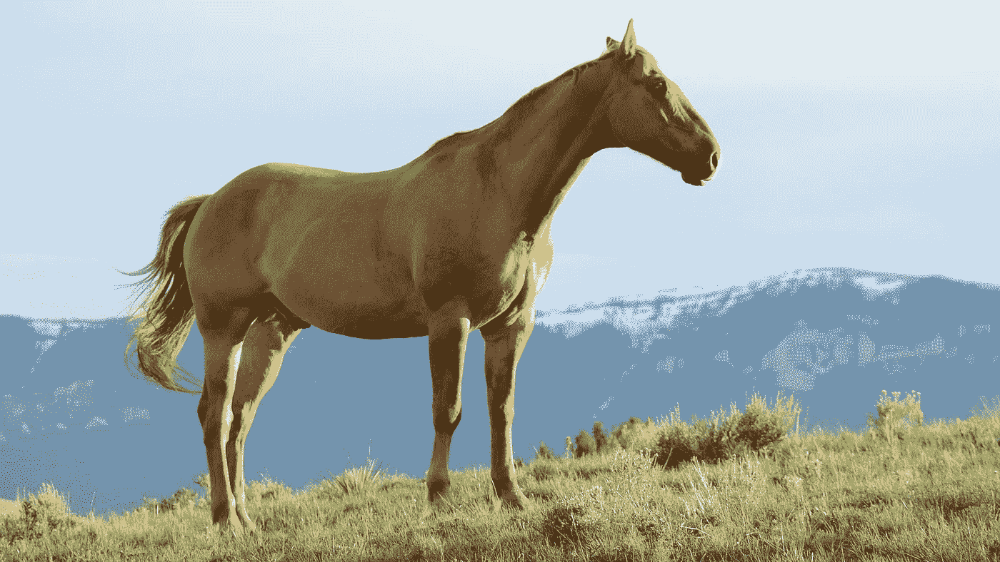
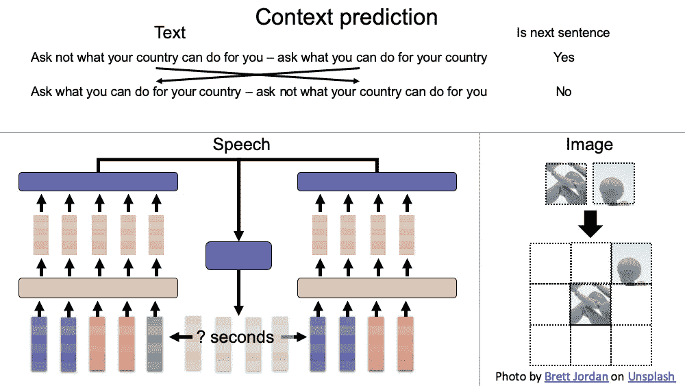
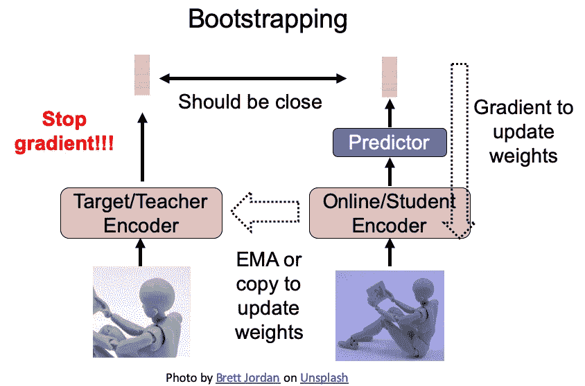

# 自我监督学习(SSL)概述

> 原文：<https://towardsdatascience.com/self-supervised-learning-ssl-overview-8a7f24740e40>

## 为什么重要，它是什么&不同类型的自我监督学习

机器人是“自我监督”的。布雷特·乔丹在 [Unsplash](https://unsplash.com/s/photos/robot?utm_source=unsplash&utm_medium=referral&utm_content=creditCopyText) 上的照片。

“自我监督学习”一词来源于 Yann le Cun 2019 年 4 月 30 日的语录([推文](https://twitter.com/ylecun/status/1123235709802905600)和[帖子](https://www.facebook.com/722677142/posts/10155934004262143/)):

> 我现在称之为“自我监督的学习”，因为“无监督的”是一个令人困惑的术语。

在这篇文章中，我将解释它是什么，为什么它很重要，它可以如何使用，以及不同类别的自我监督学习在多个领域，包括文本，图像，语音/音频和图形。

# 什么是自我监督学习？

自监督学习是无监督学习下的一个子类，因为它利用了未标记的数据。关键思想是允许模型在没有手动标签的情况下学习数据表示。一旦模型学会了如何表示数据，那么它就可以用更少量的标记数据用于下游任务，以实现与没有自我监督学习的模型相似或更好的性能。

它有三个步骤:

1.  基于对数据的理解，通过编程从未标记的数据生成输入数据和标签
2.  预训练:使用上一步中的数据/标签训练模型
3.  微调:使用预先训练的模型作为初始权重来训练感兴趣的任务

如果我们在第二步中使用带有手动标签的数据，而不是自动生成的标签，这将是受监督的预训练，称为迁移学习的一个步骤。

# 为什么自我监督学习很重要？

自我监督学习已经在多个领域获得成功，例如文本、图像/视频、语音和图形。本质上，自我监督学习挖掘未标记的数据并提高性能。就像 Yann Lecun 的蛋糕([视频](https://www.youtube.com/watch?v=YzD7Z2yRL7Y)，[幻灯片](https://www.slideshare.net/rouyunpan/deep-learning-hardware-past-present-future))的比喻一样，这种自我监督的学习(蛋糕 génoise)可以对每个样本进行数百万次咬入，而监督学习(糖衣)只能进行 10 到 10，000 次咬入。也就是说，**自监督学习比监督学习**能从每个样本中获得更多有用的信息。

人工生成的标签通常关注数据的特定视图。例如，我们可以只用一个术语“马”来描述草地上的一匹马的图像(如下图所示)，用于图像识别，并提供语义分割的像素坐标。然而，数据中有更多的信息，例如，马的头和尾巴在身体的另一侧，或者马通常在草的顶部(而不是下面)。模型可以直接从数据中学习更好和更复杂的表示，而不是手动标注。更不用说手工标签有时会出错，这对模型是有害的。[一项实验](https://www.reddit.com/r/MachineLearning/comments/uc9z2y/p_we_cleaned_up_pascal_and_improved_map_by_13/)显示清理 PASCAL 数据集可以提高 MAP 13。即使不与最先进的技术相比，我们仍然可以看到错误的标签可能会导致更差的性能。

由[大卫·迪伯特](https://unsplash.com/@dibert?utm_source=unsplash&utm_medium=referral&utm_content=creditCopyText)在 [Unsplash](https://unsplash.com/s/photos/horse?utm_source=unsplash&utm_medium=referral&utm_content=creditCopyText) 上拍摄。

数据标注成本高、耗时且劳动强度大。此外，监督学习方法将需要针对新数据/标签和新任务的不同标签。更重要的是，已经表明，对于基于图像的任务(即，图像识别、对象检测、语义分割)，自我监督预训练甚至优于监督预训练。换句话说，**直接从数据中提取信息比手工标注**更有帮助。那么，根据任务的不同，现在或在不久的将来，我们可能不需要许多昂贵的标签和更先进的自我监督学习。

自监督学习的优越性在基于图像的任务中得到了验证，这得益于图像领域中的大规模标记数据集，在最近的深度学习趋势中，图像领域比其他领域具有更长的历史。我相信类似的优势将来也会在其他领域得到证明。因此，自我监督学习对于推进机器学习领域至关重要。

# 怎么用？

通常，当一个自我监督的模型发布时，我们可以下载预先训练好的模型。然后，我们可以对预先训练的模型进行微调，并将微调后的模型用于特定的下游任务。例如，最著名的自我监督学习的例子可能是 BERT ( [ref](https://arxiv.org/abs/1810.04805) )。伯特以自我监督学习的方式接受了 33 亿单词的预训练。我们可以针对文本相关的任务(如句子分类)对 BERT 进行微调，与从头开始训练模型相比，所需的精力和数据要少得多。基于一个经过微调的 BERT 模型，我开发了一个应用程序，用于预测一条推文信息是否来自拥抱脸的埃隆·马斯克([链接](https://huggingface.co/spaces/jacklindsai/is_it_elon_musk))。我会单独写一篇关于我如何创建它的文章。随意摆弄，玩得开心！

# 自我监督学习有哪些类别？

让我用几句话描述一下每一个类别，稍后再深入研究每一个类别。

1.  **生成方法**:恢复原始信息
    a .非自回归:屏蔽一个记号/像素并预测被屏蔽的记号/像素(如屏蔽语言建模(MLM))
    b .自回归:预测下一个记号/像素
2.  **预测任务**:基于对数据的理解、聚类或扩充来设计标签
    a:预测上下文(例如，预测图像块的相对位置，预测下一个片段是否是下一个句子)
    b:预测每个样本的聚类 id
    c:预测图像旋转角度
3.  **对比学习**(又名对比实例辨别):基于增强创建的正负样本对建立一个二元分类问题
4.  **自举** **方法**:使用两个相似但不同的网络从相同样本的扩充对中学习相同的表示
5.  **正则化**:基于假设/直觉增加损失和正则化项:
    a:阳性对应该相似
    b:同一批次不同样本的输出应该不同

# 生成方法

图片由作者提供。

通过周围数据预测屏蔽输入是最早的自我监督方法类别。这个想法实际上可以追溯到这句名言，“你应该通过一个人交的朋友来了解这个人。”—约翰·鲁伯特·弗斯(1957)，语言学家。这一系列算法是从 2013 年文本领域的 word2vec ( [ref](https://arxiv.org/abs/1310.4546) )开始的。word2vec 的连续词包(CBOW)的概念是通过其邻居预测一个中心词，这与 ELMo ( [ref](https://arxiv.org/abs/1802.05365) )和 BERT ( [ref](https://arxiv.org/abs/1810.04805) )的掩蔽语言建模(MLM)非常相似。这些模型都被归类为非自回归生成方法。主要区别在于，后来的模型使用了更高级的结构，如双向 LSTM(用于 ELMo)和 transformer(用于 BERT)，而最近的模型生成了上下文嵌入。

在语音领域，Mockingjay ( [ref](https://arxiv.org/abs/1910.12638) )屏蔽了连续特征的所有维度，TERA ( [ref](https://arxiv.org/abs/2007.06028) )屏蔽了特征维度的特定子集。在图像领域，OpenAI 应用了 BERT 的方案([参考](https://openai.com/blog/image-gpt/))。在图形区域，GPT-GNN 也屏蔽了属性和边缘。这些方法都屏蔽了部分输入数据，并试图将其预测回来。

另一方面，另一种生成方法是预测下一个标记/像素/声学特征。在文本领域，GPT 系列车型([ref](https://d4mucfpksywv.cloudfront.net/better-language-models/language-models.pdf)&ref[ref](https://arxiv.org/abs/2005.14165))是这一类别的先驱。APC ( [ref](https://arxiv.org/abs/1910.12607) )和 ImageGPT ( [ref](https://openai.com/blog/image-gpt/) )分别在语音和图像领域应用了相同的思想。有趣的是，因为相邻的声学特征很容易预测，所以模型通常被要求预测后面序列中的记号(至少 3 个记号之外)。

自我监督学习(尤其是伯特/GPT)的巨大成功促使研究人员将类似的生成方法应用于图像和语音等其他领域。然而，对于图像和语音数据，生成屏蔽输入更难，因为选择有限数量的文本标记比选择无限数量的图像像素/声学特征更容易。性能改进不如文本字段。因此，研究人员在接下来的会议中还开发了许多其他非生成性方法。

# 预测任务

图片由作者提供。

主要想法是设计更简化的目标/指标，以避免数据生成。**最关键也是最具挑战性的一点是，任务需要达到模型学习的适当难度水平。**

例如，在预测文本字段中的上下文时，BERT 和 ALBERT 都预测下一个片段是否是下一个句子。BERT 通过将下一个片段与另一个片段随机交换来提供负训练样本(下一句预测；NSP)而阿尔伯特通过交换前一个和下一个片段(句序预测；SOP)。SOP 的表现已经超过了 NSP ( [参考](https://arxiv.org/abs/1909.11942))。一种解释是，通过话题预测区分随机句子对是如此容易，以至于该模型没有从 NSP 任务中学到多少东西；而 SOP 允许模型学习一致性关系。**因此，需要领域知识来设计好的任务，并通过实验来验证任务的效率。**

类似 SOP 的预测上下文的思想也被应用于图像域(预测图像块的相对位置([参考](https://arxiv.org/abs/1505.05192)))和语音域(预测两个声学特征组之间的时间间隔([参考](https://ieeexplore.ieee.org/document/9060816)))。

另一种方法是通过聚类来生成标签。在图像字段中，DeepCluster 应用了 k 均值聚类([参考](https://arxiv.org/abs/1807.05520))。在语音领域，HuBERT 应用了 k 均值聚类([参考](https://arxiv.org/abs/2106.07447))，BEST-RQ 采用了随机投影量化器([参考](https://arxiv.org/abs/2202.01855))。

图像领域的其他任务有:通过图像的颜色通道预测灰度通道(反之亦然； [ref](https://arxiv.org/abs/1611.09842) )，重建图像的随机剪切块(即修复； [ref](https://arxiv.org/abs/1604.07379) 、重建原始分辨率的图像( [ref](https://arxiv.org/abs/1609.04802) )、预测图像的旋转角度( [ref](https://arxiv.org/abs/1803.07728) )、预测图像的颜色( [ref1](https://arxiv.org/abs/1603.08511) 、 [ref2](https://arxiv.org/abs/1705.02999) 、 [ref3](http://iizuka.cs.tsukuba.ac.jp/projects/colorization/en/) )以及解决拼图( [ref](https://arxiv.org/abs/1603.09246) )。

# 对比学习(对比实例辨别)

图片由作者提供。

对比学习的关键概念是在理解数据的基础上产生正负训练样本对。该模型需要学习一个函数，使得两个阳性样本具有高相似性得分，而两个阴性样本具有低相似性得分。因此，适当的样本生成对于确保模型了解数据的基本特征/结构至关重要。

图像领域中的对比学习应用来自同一原始图像的两个不同的数据扩充来生成正样本对，并且使用两个不同的图像作为负样本对。两个最关键和最具挑战性的部分是扩增的强度和阴性样本对的选择。如果增强太强，以至于来自同一样本的两个增强样本之间没有关系，则模型无法学习。类似地，如果增加量很小，以至于模型可以很容易地解决问题，那么模型也不能学习对下游任务有用的信息。至于选择负样本对，如果我们随机分配两幅图像作为负样本对，它们可以是相同的类别(例如，猫的两幅图像)，这将冲突噪声引入到模型中。如果负对非常容易区分，那么模型不能学习数据的潜在特征/结构。对比学习最著名的例子是 SimCLR ( [v1](https://arxiv.org/abs/2002.05709) 、 [v2](https://arxiv.org/abs/2006.10029) )和 MoCo ( [v1](https://arxiv.org/abs/1911.05722) 、 [v2](https://arxiv.org/abs/2003.04297) )。

至于语音领域，一种方法是应用类似 SimCLR ( [Speech SimCLR](https://arxiv.org/abs/2010.13991) )的增强。另一种方法是使用相邻特征作为正对，使用来自不同样本的特征作为负对(例如， [CPC](https://arxiv.org/abs/1807.03748) 、Wav2vec ( [v1](https://arxiv.org/abs/1904.05862) 、 [v2.0](https://arxiv.org/abs/2006.11477) )、[VQ-瓦 v2vec](https://arxiv.org/abs/1910.05453) 和[离散 BERT](https://arxiv.org/abs/1911.03912) )。在图领域， [DGI](https://arxiv.org/abs/1809.10341) 最大化了图的补丁表示和全局表示之间的互信息，最小化了损坏图的补丁表示和原始图的全局表示之间的互信息。

一个有趣的认识是，从文本领域的自我监督学习分类实际上类似于概念上的对比学习。分类最大化正类的输出，最小化负类的输出。同样地，对比学习也最大化了正对的输出，最小化了负对的输出。关键区别在于分类有有限数量的否定类别(在文本标记的情况下)，而对比学习有无限数量的否定类别(在图像和声学特征的情况下)。理论上，我们可以通过给定少量的类来设计图像/语音的分类器。一类是一幅原始图像，输入是增强图像。然而，这是不实际的，因为它只适用于有限数量的图像/类。

# 自举方法

图片由作者提供。

研究人员进一步开发了 bootstrapping 方法，以避免使用负样本，因为这对于训练来说是计算密集型的，并且不容易选择好的负样本。bootstrapping 方法的核心思想是 1)从同一原始样本的两个扩充中生成一对正样本(就像对比学习一样)；2)将一个网络设置为目标网络(也称为教师网络)，将另一个网络设置为在线网络(也称为学生网络)，该网络与目标网络的架构相同，但增加了一个前馈层(称为预测器)；3)固定目标/教师网络的权重，只更新在线/学生网络；4)基于在线/学生网络的权重来更新目标/教师网络的权重。

最重要的设计是 1)在线网络需要有预测器(附加层)；2)只能更新在线网络的权重；否则，网络会崩溃(即，不管输入如何，输出相同的值)。

在图像字段中，BYOL 通过取在线/学生网络( [ref](https://arxiv.org/abs/2006.07733) )的权重的指数移动平均(EMA)来更新目标/教师网络的权重；而暹罗只是简单地复制了重量([参考](https://arxiv.org/abs/2011.10566))。

Meta 的 Data2vec 是图像、语音和文本领域的统一框架( [ref](https://arxiv.org/abs/2202.03555) )。还需要 EMA 来更新目标/教师网络，但是它使用掩蔽预测任务。它向目标/教师网络提供原始数据，向在线/学生网络提供屏蔽数据。一个重要的设计是它的目标是预测目标/教师网络中顶部几层的屏蔽输入区域/标记的平均嵌入。

# 正规化

图片由作者提供。

这是另一种只需要正对而不需要反例的方法。令人惊讶的是，这些方法可以对两个网络使用相同的架构，并且它们也不需要“停止梯度”机制来在训练期间仅更新网络之一。通过添加额外的正则项，模型也不会崩溃。目标函数项包括:

1.  不变性:损失项使来自同一正对的两个嵌入尽可能相似。[巴洛双胞胎](https://arxiv.org/abs/2103.03230)和[德洛丽丝](https://arxiv.org/abs/2203.13628)的不变性项寻求分别在图像域和音频域中使互相关矩阵的对角元素等于 1；在图像域中，VICReg 最小化两个嵌入之间的均方欧几里德距离( [ref](https://arxiv.org/abs/2105.04906) )。
2.  方差:正则项使同一批**中的样本保持足够的差异**，因为它们不是同一个样本。 [Barlow Twins](https://arxiv.org/abs/2103.03230) 和 [DeLoRes](https://arxiv.org/abs/2203.13628) 的冗余减少项试图分别使互相关矩阵的非对角元素在图像域和音频域中等于 0。在图像域中，VICReg 的方差项使用铰链损失来保持同一批样本中嵌入输出的标准偏差高于阈值([参考](https://arxiv.org/abs/2105.04906))。VICReg 的协方差项最小化协方差矩阵中非对角项的幅度，以对每对嵌入进行去相关。这一项可以大大提高性能，并最大限度地利用嵌入向量的所有维度的效率。然而，这并不是防止信息崩溃所必需的([参考](https://arxiv.org/abs/2105.04906))。

VICReg 的论文表明，与其他自监督框架(Barlow Twins 和 SimCLR)相比，VICReg 对不同的网络架构更具鲁棒性。因此，它可以在将来实现多模态应用。

# 摘要

本文概述了自我监督学习(SSL)的历史和进展。SSL 从掩蔽预测、下一个令牌预测、对比学习发展到文本、图像、音频/语音和图形等多种形式的自举和正则化。最初，模型恢复部分数据进行学习，因此不需要手动标记。然后，模型可以通过基于数据理解设计的任务进行学习。随着数据的增加，正负成对的例子使得对比学习成为可能。最令人惊讶的是，利用自举技术或正则项，该模型甚至可以在没有任何负面例子的情况下进行学习。随着在可预见的将来对 SSL 有了更好的理解，我相信我们可以用更少的数据、时间和努力来开发更健壮的模型。我迫不及待地想看到这个令人兴奋的领域中更先进的进展！

我是 Jack Lin， [C3.ai](https://c3.ai/) 的高级数据科学家，我对深度学习和机器学习充满热情。你可以看看[我在 Medium](https://medium.com/@jacklindsai) 上的其他文章！

由[安德里亚·德·森蒂斯峰](https://unsplash.com/@santesson89?utm_source=unsplash&utm_medium=referral&utm_content=creditCopyText)在 [Unsplash](https://unsplash.com/s/photos/artificial-intelligence?utm_source=unsplash&utm_medium=referral&utm_content=creditCopyText) 上拍摄