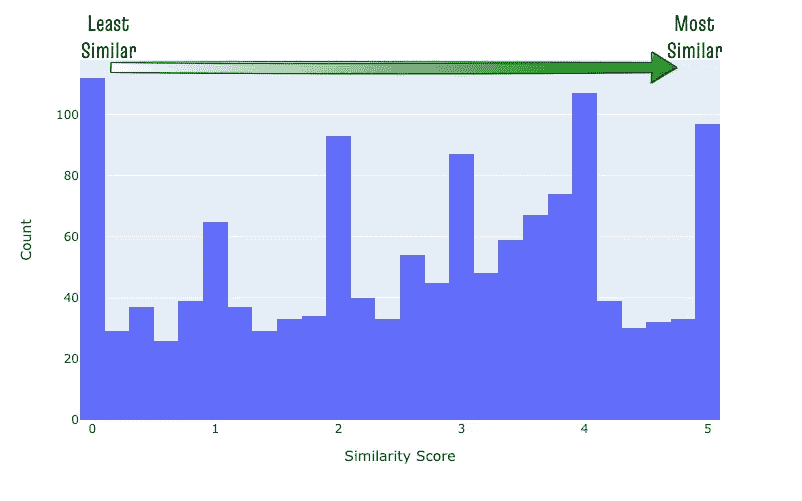
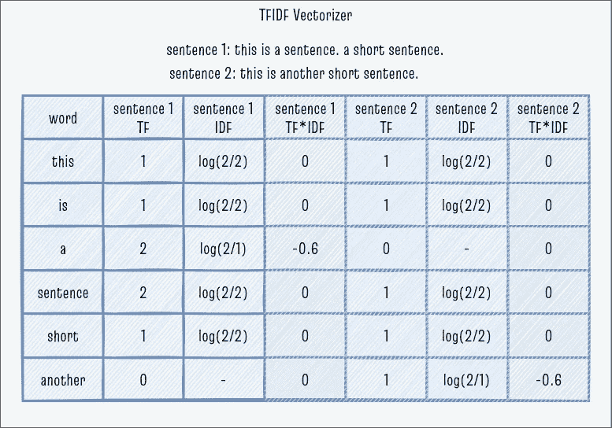
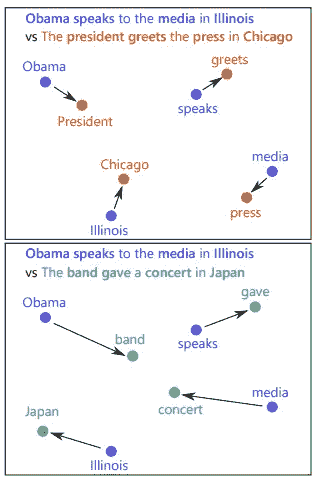
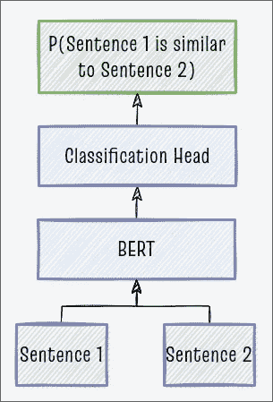
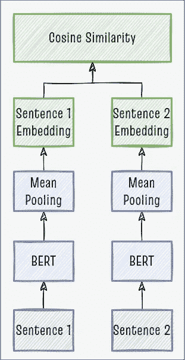
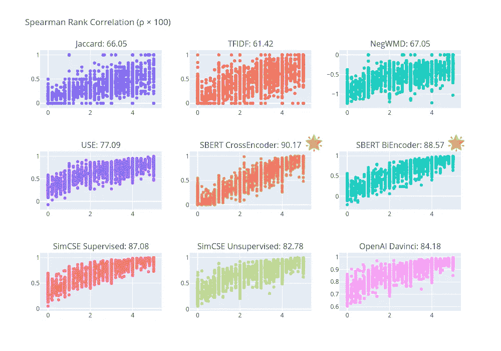
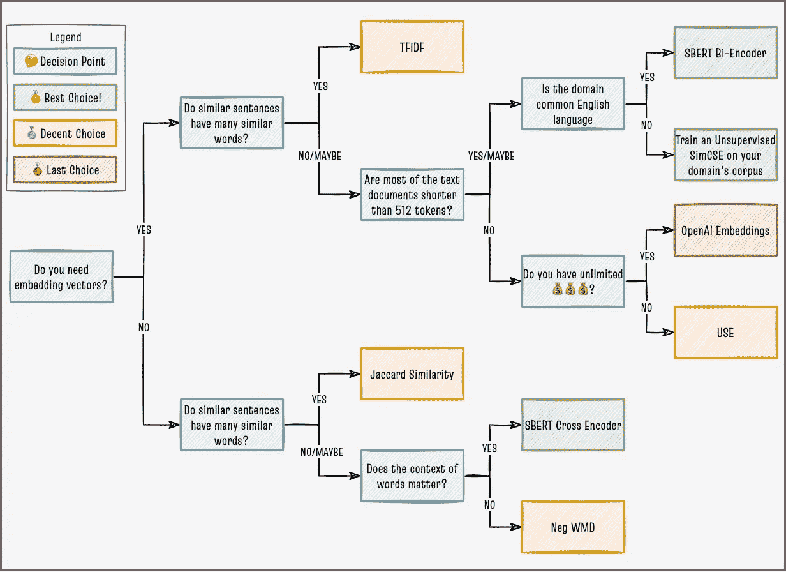

# 语义文本相似度

> 原文：<https://towardsdatascience.com/semantic-textual-similarity-83b3ca4a840e>

## 从 Jaccard 到 OpenAI，为您的语义文本相似性项目实现最佳的 NLP 算法


在 [Unsplash](https://unsplash.com?utm_source=medium&utm_medium=referral) 上由[伊尼基·德尔·奥尔莫](https://unsplash.com/@inakihxz?utm_source=medium&utm_medium=referral)拍摄的照片

# 🎬介绍

自然语言处理(NLP)在信息提取、自然语言理解和自然语言生成方面有着巨大的[现实世界应用](https://zilliz.com/learn/top-5-nlp-applications)。比较自然语言文本之间的相似性对于许多信息提取应用来说是必不可少的，例如[谷歌搜索](https://blog.google/products/search/search-language-understanding-bert/)、 [Spotify 的播客搜索](https://engineering.atspotify.com/2022/03/introducing-natural-language-search-for-podcast-episodes/)、[家得宝的产品搜索](https://www.datanami.com/2022/03/15/home-depot-finds-diy-success-with-vector-search/)等。语义文本相似性(STS)问题试图比较两个文本，并确定它们在意义上是否相似。由于自然语言的细微差别，这是一个众所周知的难题，两个文本可能是相似的，尽管没有一个共同的单词！

虽然这个挑战已经存在很长时间了，但是 NLP 的最新进展已经开发了许多算法来解决这个问题。一些方法接受两个文本作为输入，并直接提供两个文本相似程度的分数。其他一些技术只是将每个文本转换成一个称为嵌入的数字向量，然后我们可以通过数学计算向量之间的距离来进行比较。回想一下，

> 💡“嵌入”向量是我们自然语言文本的数字表示，以便我们的计算机可以理解我们文本的上下文和含义。

这篇文章将介绍几种在不同场景下解决 STS 问题的技术。我的目标是尽可能多地使用预先训练好的模型，这些模型提供了开箱即用的优秀结果。在文章的最后，我附上了一个流程图，帮助你决定解决定制问题的最佳方法。具体来说，在这篇文章中，我们将讨论以下内容。点击链接，跳转到以下部分:

1.  [设置环境并下载一些数据](https://medium.com/p/83b3ca4a840e#45f9)
2.  [用经典的非上下文算法测量文本相似性](https://medium.com/p/83b3ca4a840e#4031)
3.  [用现代上下文算法测量文本相似度](https://medium.com/p/83b3ca4a840e#b3f1)
4.  [结果&结论](https://medium.com/p/83b3ca4a840e#012f)

在这篇文章中，我们将使用 [Huggingface datasets](https://huggingface.co/datasets/stsb_multi_mt) 上可用的 stsb_multi_mt 数据集。该数据集包含成对的句子和一个正实数标签，该标签指示每对句子的相似度，范围从 0(最不相似)到 5(最相似)。作者已经在[Commons Attribution-Share like 4.0 国际许可](https://github.com/PhilipMay/stsb-multi-mt/blob/main/LICENSE)下许可了数据集。


STSB 数据集的前五行。图片作者。



STSB 测试数据集相似性得分分布。图片作者。

# 🧩设置环境并下载一些数据

我们首先需要安装所有必要的库来测试各种嵌入策略。我们将使用来自 [mini-forge](https://github.com/conda-forge/miniforge) 的 conda 来管理这个项目的虚拟环境。

## 设置环境并安装必要的库

因为我们将在这篇文章中讨论几种不同的算法，所以我们需要安装各种各样的库来让它们都工作。不幸的是，安装 pip 时，WMD 算法所必需的 pyemd 库无法工作，因此我们需要使用 conda 来完成这个项目。

作者代码。

## 加载 STSB 数据集

我们将使用 [Huggingface 的数据集库](https://huggingface.co/docs/datasets/index)将 STSB 数据集快速加载到熊猫数据帧中。STSB 数据集由一个`train`表和一个`test`表组成。我们将这两个表分成它们各自的数据帧`stsb_train`和`stsb_test`。

作者代码。

## 创建一些助手函数

让我们为我们将在这篇文章中重复执行的操作创建两个助手函数。第一个功能是对文本进行预处理，将字母符号化、小写化，并删除数字和停用词。第二个函数接受两列文本嵌入，并返回两列之间的行余弦相似度。

作者代码。

现在我们有了环境和数据，让我们开始讨论算法吧！

# 用经典的非上下文算法进行文本相似性的🧮度量

本节将讨论一些使用经典的非上下文方法来测量文本间相似性的技术。在这些算法中，我们只使用实际的单词进行相似度计算，而不考虑每个单词出现的上下文。正如所料，这些技术通常比更现代的上下文方法性能更差。

## 雅克卡相似性

比较两篇文章最简单的方法是计算它们共有的独特单词的数量。然而，如果我们仅仅计算独特的常用词的数量，那么较长的文档将具有更多的常用词。为了克服这种对较长文档的偏见，在 Jaccard 相似度中，我们将两个文本中共同的唯一单词的数量标准化为唯一单词的总数。


Jaccard 相似方程。图片作者。

Jaccard 相似性是 Python 中使用 [textdistance](https://github.com/life4/textdistance) 库可以轻松计算的几种距离之一。请注意，在运行 Jaccard similarity 之前，要对文本进行预处理，以删除停用词、小写字母并对其进行词条归类，以确保在计算中仅使用信息词。

作者代码。

在上面的代码中，我们仅使用单词(1-gram)来计算 Jaccard 相似性。然而，该技术也可以很容易地扩展到任何 N 元文法。使用 N-gram 而不是单词(1-gram)的 Jaccard 相似度被称为 [w-shingling](https://en.wikipedia.org/wiki/W-shingling) 。

虽然 Jaccard 相似性和 w-shingling 是测量文本相似性的简单方法，但它们在实践中表现得相当不错，如本文末尾的[结果部分所示！](https://medium.com/p/83b3ca4a840e#012f)

## 单词袋(蝴蝶结)

[Bag of Words](https://machinelearningmastery.com/gentle-introduction-bag-words-model/) 是从文本中提取特征并将其转换为数字嵌入向量的经典方法的集合。然后，我们通过计算它们之间的余弦相似性来比较这些嵌入向量。使用单词包方法有两种流行的方式:[计数矢量器](https://scikit-learn.org/stable/modules/generated/sklearn.feature_extraction.text.CountVectorizer.html)和 [TFIDF 矢量器](https://scikit-learn.org/stable/modules/generated/sklearn.feature_extraction.text.TfidfVectorizer.html)。

***计数矢量器***

该算法将整个文本语料库中的每个唯一单词映射到一个唯一的向量索引。每个文档的向量值是每个特定单词在该文本中出现的次数。因此，向量可以由整数值组成，包括 0，这表示该单词没有出现在文本中。虽然计数矢量器易于理解和实现，但它的主要缺点是，不管单词的实际重要性如何，它对所有单词都一视同仁。


计数矢量器示例。图片作者。

***TFIDF 矢量器***

为了克服计数矢量器的缺点，我们可以使用 TFIDF 矢量器。该算法还将整个文本语料库中的每个唯一单词映射到一个唯一的向量索引。但是每个文档的向量值不是简单的计数，而是两个值的乘积:术语频率(TF)和逆文档频率(IDF)。

1.  词频(TF):每个单词的 TF 是该单词在该文档中出现的次数，与来自计数矢量器的值相同。这是衡量该单词对文档有多重要的标准。
2.  逆文档频率(IDF):另一方面，一个单词的 IDF 是该单词出现的文档部分的倒数的对数。它衡量这个词在整个语料库中的稀有程度。

最后，每个文档中每个单词的 TFIDF 值是单个 TF 和 IDF 分数的乘积。这里的直觉是，一个文档中在整个语料库中相对罕见的频繁词是该文档的关键词，并且具有高 TFIDF 分数。TFIDF 的大多数实现都将这些值标准化为文档长度，这样较长的文档就不会在计算中占主导地位。



TFIDF 矢量器示例。图片作者。

使用 sklearn 库在代码中实现 TFIDF 很简单，它以稍微复杂一点的方式计算 IDF，实现规范化并防止 0 除法；你可以在这里了解更多关于[的信息。TFIDF 是这篇文章中我们需要训练的唯一模型，以学习语料库中所有独特的单词及其相关的 IDF 值。](https://www.analyticsvidhya.com/blog/2021/11/how-sklearns-tfidfvectorizer-calculates-tf-idf-values/)

作者代码。

尽管单词包方法很直观，并为我们提供了文本的矢量表示，但它们在现实世界中的表现却千差万别。在 STSB 任务中，TFIDF 没有 Jaccard 相似性做得好，正如在[结果部分](https://www.notion.so/The-State-of-the-Art-for-Semantic-Textual-Similarity-366cf60864404eff9d6cc70274b3ccbe)中看到的。

词汇袋方法的其他潜在陷阱是

1.  如果文档的数量很大，那么由这种方法生成的向量将具有非常高的维数，因为在语料库中会有许多独特的单词。
2.  这些向量非常稀疏，因为大多数单词不会出现在大多数文档中。

以下测量文本相似性的方法通过使用预先训练的单词嵌入克服了这些限制。

## 字移动距离(WMD)

Jaccard 相似度和 TFIDF 假设相似的文本有许多共同的单词。但是，情况可能并不总是如此，因为即使没有任何常用的不间断单词的文本也可能是相似的，如下所示。解决这个问题的一种方法是使用预先训练的单词嵌入。

```
*document1: “Obama speaks to the media in Illinois” 
document2: “The president greets the press in Chicago”*
```

> 💡单词嵌入是将单词编码成数字向量的模型，使得[相似的单词具有在向量空间](https://machinelearningmastery.com/what-are-word-embeddings/)中彼此靠近的向量。

生成单词嵌入有几种方式，最突出的是 [Word2Vec](https://en.wikipedia.org/wiki/Word2vec) 、 [GloVe](https://nlp.stanford.edu/projects/glove/) 和 [FastText](https://fasttext.cc/docs/en/unsupervised-tutorial.html) 。

由于我们需要比较包含多个单词的文本之间的相似性，从单个单词嵌入到单个句子嵌入的最简单方法是计算该文本中所有单词嵌入的元素平均值。然而，有一种更好的方法可以直接从单词嵌入中计算文本之间的相似性，这种方法称为单词移动距离(WMD)。

[WMD](http://proceedings.mlr.press/v37/kusnerb15.pdf) 基于[推土机距离](https://www.cs.jhu.edu/~misha/Papers/Rubner98.pdf)的概念，是一个文档中的单词嵌入需要“行进”到我们与之比较的文档的单词嵌入的最小距离。由于每个文档包含多个单词，WMD 计算需要计算每个单词到其他单词的距离。它还根据每个单词的词频对“旅行”进行加权。令人欣慰的是， [gensim](https://github.com/RaRe-Technologies/gensim) 库使用[快速 WMD 算法](https://www.cs.huji.ac.il/w~werman/Papers/ICCV2009.pdf)有效地实现了这个复杂的计算。我们只需一行代码就可以轻松使用它！



大规模杀伤性武器在行动。两对句子都没有共同的词。WMD 仍然可以找到一个相似的句子，因为它们的单词更接近。图片来自 [Arxiv 论文](https://arxiv.org/pdf/2105.14403.pdf)。

虽然我们可以在 WMD 中使用任何单词嵌入模型，但我决定使用在维基百科上预先训练的 FastText 模型，主要是因为 [FastText 使用子单词](https://arxiv.org/pdf/1607.04606.pdf)信息，并且永远不会遇到 Word2Vec 或 GloVe 可能会遇到的词汇问题。注意对文本进行预处理，删除停用词、小写字母，并对其进行词条归类，以确保 WMD 计算仅使用信息词。最后，由于 WMD 是一个距离度量，而我们正在寻找一个相似性度量，我们将 WMD 值乘以-1(负 WMD ),这样更多的相似文本在数字上具有更大的值。

作者代码。

在 STSB 数据集上，负的 WMD 分数仅比 Jaccard 相似度稍好，因为该数据集中的大多数句子都有许多相似的词。NegWMD 的性能在文本之间有较少共同词的数据集上将比 Jaccard 好得多。

WMD 的限制之一是 WMD 中使用的单词嵌入是非上下文相关的，其中每个单词获得相同的嵌入向量，而不管它出现在句子的其余部分的上下文。本文其余部分的算法也可以使用上下文来克服这个问题。

# 🚀用现代上下文算法度量文本相似性

本节将讨论几种测量语义文本相似性的技术，考虑不同单词出现的上下文。这些方法通常比非上下文方法更准确。

## 通用句子编码器(使用)

在[使用](http://arxiv.org/abs/1803.11175)中，谷歌的研究人员首先在多任务目标上预先训练了一个基于 Transformer 的模型，然后将其用于迁移学习。为了计算文本相似性，我们首先使用预先训练的使用模型来计算句子中每个单词的上下文单词嵌入。然后，我们通过执行所有单词向量的元素式求和并除以句子长度的平方根来标准化句子长度，从而计算句子嵌入。一旦我们有了每个句子的使用嵌入，我们就可以使用本文开头定义的帮助函数来计算余弦相似度。研究人员在 Tensorflow hub 上开源了预训练模型，我们将直接使用它。

作者代码。

与 NegWMD 度量相比，USE 在 STSB 数据集上实现了显著的 10 点跳跃。它显示了在迁移学习环境中使用变形金刚生成的上下文句子嵌入的潜力。随后，研究人员开发了更先进的方法，使用度量学习来预训练基于变压器的模型，以获得更好的性能！

## 交叉编码器

2018 年来自变压器(BERT) 模型的[双向编码器表示的出现，通过击败几个基准，开创了 NLP 的新时代。随着时间的推移，研究人员继续改进香草伯特模型，产生了几个值得注意的变体，如](https://en.wikipedia.org/wiki/BERT_(language_model))[罗伯塔](https://arxiv.org/abs/1907.11692)、[迪翁伯特](https://arxiv.org/abs/1910.01108)、[艾伯特](https://arxiv.org/abs/1909.11942)等。，正如本帖中讨论的[。](https://zilliz.com/learn/7-nlp-models)

BERT 的强大功能来自其自我监督的预训练任务，称为掩蔽语言建模(MLM)，我们随机隐藏一些单词，并训练模型预测丢失的单词，同时给出丢失单词之前和之后的单词。对大规模文本语料库的训练允许 BERT 学习语言中各种单词之间的语义关系。

我们可以通过向 BERT 模型的输出添加分类头来使用 BERT 作为交叉编码器。交叉编码器模型将一对文本文档作为输入，直接输出两个文档相似的概率。通过在带标签的 [STS](https://paperswithcode.com/dataset/semantic-textual-similarity-2012-2016) 数据集上微调预训练的 BERT 模型，我们可以在 STS 任务上获得最先进的结果！



交叉编码器。图片作者。

我们将使用 [sentence_transformers 库](https://www.sbert.net/)来有效地使用在 [SNLI](https://paperswithcode.com/dataset/snli) 和 [STS](https://paperswithcode.com/dataset/semantic-textual-similarity-2012-2016) 数据集上训练的各种开源交叉编码器模型。

作者代码。

交叉编码器不输出任何嵌入向量，因此在几千个文档之外不具有很好的可扩展性。但总的来说，BERT 交叉编码器在大多数句子相似性任务中提供了最好的性能。在我们的 STSB 数据集中，BERT Cross 编码器给出了最好的分数！

## 度量学习

[度量学习](https://paperswithcode.com/task/metric-learning?page=6)是生成嵌入的最有前途的方法之一，尤其是对于相似性搜索应用。在最基本的层面上，在度量学习中，

1.  我们使用像 BERT 这样的神经网络将文本转换成嵌入。
2.  我们构建这些嵌入，使得语义相似的文本彼此聚得更近，而不相似的文本则相距更远。


向量空间中的自然语言文本示例。图片来自作者，灵感来自[媒体博客文章](/contrastive-loss-explaned-159f2d4a87ec)作者[布莱恩·威廉斯](https://medium.com/@rantlab?source=post_page-----159f2d4a87ec-----------------------------------)。

训练度量学习模型需要在如何处理数据和如何训练模型方面进行创新，正如在[我的上一篇文章](/powering-semantic-similarity-search-in-computer-vision-with-state-of-the-art-embeddings-f6c183fff134)中详细描述的那样。在用这种方法训练模型之后，我们可以通过数学上计算两个文本向量之间的余弦相似性来找到两个文本之间的相似性。

## SBERT 双编码器

[句子转换器](http://arxiv.org/abs/1908.10084)(也称为 SBERT)是当前最先进的 NLP 句子嵌入。它使用 [BERT](https://en.wikipedia.org/wiki/BERT_(language_model)) 及其变体作为基础模型，并利用一种称为对比学习的度量学习进行预训练。在对比学习中，对比损失函数比较两个嵌入是相似的(0)还是不相似的(1)。

句子变形金刚的核心思想如下。

1.  使用带标签的 [SNLI 数据集](https://paperswithcode.com/dataset/snli)或 [STS 数据集](https://paperswithcode.com/dataset/semantic-textual-similarity-2012-2016)作为训练数据。这些数据集包含数千对被标记为相似或不相似的句子。
2.  对于训练数据集中的每个文本，使用任何预先训练的 BERT 模型作为编码器来计算该文本的上下文单词嵌入。
3.  计算所有标记嵌入的元素平均值，以获得整个文本的单个固定维度句子嵌入。这种操作称为平均池。
4.  使用具有对比损耗的[连体网络架构](https://www.cs.cmu.edu/~rsalakhu/papers/oneshot1.pdf)训练模型。该模型的目标是将相似文本的嵌入移得更近，使得它们之间的距离接近 0。相反，该模型旨在将来自不同文本的嵌入彼此远离，使得它们之间的距离很大。
5.  在我们完成模型的训练之后，我们可以通过计算任意两个文本的嵌入之间的余弦相似性来比较这两个文本。

双编码器句子转换器模型一次接收一个文本作为输入，并输出一个固定维度的嵌入向量作为输出。然后，我们可以通过计算任意两个文档的嵌入之间的余弦相似性来比较这两个文档。

尽管在我们的 STSB 数据集上，双编码器句子转换器的性能略低于交叉编码器，但通过与向量搜索数据库(如 [Milvus](https://milvus.io/) )相结合，双编码器在扩展到数十亿甚至数万亿个文档时大放异彩！



双编码器。图片作者。

我们将使用[句子 _ 变形金刚库](https://www.sbert.net/)来有效地使用在 [SNLI](https://paperswithcode.com/dataset/snli) 和 [STS](https://paperswithcode.com/dataset/semantic-textual-similarity-2012-2016) 数据集上训练的各种开源 SBERT 双编码器模型。

作者代码。

尽管在 STSB 数据集上表现很好，但不幸的是，句子转换器是完全监督的模型，需要大量带标签的句子对语料库来训练。因此，在新的领域采用句子转换器是一个耗时且昂贵的收集大量高质量标记数据的过程。幸运的是，在半监督和自监督学习方面的一些前沿研究显示了有希望的结果！

## 希姆策

在我的[上一篇关于计算机视觉嵌入的文章](/powering-semantic-similarity-search-in-computer-vision-with-state-of-the-art-embeddings-f6c183fff134)中，我介绍了 [SimCLR](https://arxiv.org/abs/2002.05709) ，一种使用对比损失学习图像嵌入的自我监督算法。在这篇文章中，我们来讨论 SimCSE，它是 SimCLR 的 NLP 等价物。

SimCSE 代表句子嵌入的简单对比学习。我们可以将它训练成一个有监督的模型(如果有标签数据的话)或者一个完全无监督的模型！

SimCSE 的核心思想如下。

1.  给定一个文本文档，使用任何预先训练的 BERT 模型作为编码器来计算该文本的嵌入，并获取[【CLS】令牌](https://datascience.stackexchange.com/questions/66207/what-is-purpose-of-the-cls-token-and-why-is-its-encoding-output-important)的嵌入。
2.  通过对原始嵌入应用两个不同的[缺失](https://machinelearningmastery.com/dropout-regularization-deep-learning-models-keras/)蒙版，创建同一文本嵌入的两个噪点版本。从相同输入文本生成的这两个有噪声的嵌入被认为是“正”对，并且模型期望它们具有 0 的余弦距离。在 [SimCSE 论文](https://aclanthology.org/2021.emnlp-main.552)中的实验发现，对于 STSB 数据集，0.1 的辍学率是最佳的。
3.  我们认为这一批中所有其他文本的嵌入是“否定的”该模型期望“负片”到来自前一步骤的目标文本嵌入的余弦距离为 1。损失函数然后更新编码器模型的参数，使得嵌入更接近我们的期望。
4.  监督 SimCSE 有一个额外的步骤，我们使用一个[自然语言推理(NLI)标记的数据集](https://paperswithcode.com/task/natural-language-inference)从标记为“蕴涵”的文本中获得“肯定”对，从标记为“矛盾”的文本中获得“否定”对

下图从概念上解释了整个过程。


无监督和有监督 SimCSE。图片来自 [arxiv 论文](https://arxiv.org/pdf/2104.08821.pdf)。

SimCSE 模型是使用 SimCSE 方法训练的双编码器句子转换器模型。因此，我们可以直接重用来自双编码器句子转换器模型的所有代码，但是将预训练模型更改为 SimCSE 模型。

作者代码。

从 STSB 数据集上的结果，我们看到，与有监督的 SimCSE 和其他有监督的句子转换器模型相比，无监督的 SimCSE 模型具有显著的性能下降。然而，尽管完全在无监督的情况下训练，仅使用 Dropout 来创建“正”对，但无监督的 SimCSE 可以轻松击败其他方法，如 WMD 和 USE。因此，在没有足够的标记数据或收集这些数据的成本很高的领域，无监督 SimCSE 将是首选方法。

## OpenAI

所有基于 BERT 的模型(如句子转换器和 SimCSE)的一个重大限制是，它们只能对最长 512 个标记的文本进行编码。这个限制是因为 BERT 系列模型有 512 个令牌输入限制。此外，由于 BERT 的子单词标记器可能会将每个单词分成多个标记，因此可以使用这些技术转换为嵌入的文本需要少于 512 个单词。如果您需要比较较长文档之间的相似性，这可能会带来问题。非基于 BERT 的模型不会面临这种限制，但它们的性能比基于 BERT 的模型差，因此如果有更好的替代方案，我们宁愿避免使用它们。

生成最先进嵌入的最后一种方法是使用付费托管服务，如 [OpenAI 的嵌入端点](https://beta.openai.com/docs/guides/embeddings/what-are-embeddings)。它支持多达 2048 个标记的文本，因此非常适合比 BERT 的 512 个标记限制更长的文本文档。然而，OpenAI 端点价格昂贵，尺寸较大(12288 维，而基于 BERT 的模型为 768 维)，与同类最佳的免费开源句子转换器模型相比，性能有所下降。

为了让你知道它有多贵，我花了大约**20 美元**在这个小的 STSB 数据集上生成 OpenAI Davinci 嵌入，甚至在确保每个唯一文本只生成一次嵌入之后！即使对于大型组织来说，将这一代嵌入扩展到一个巨大的语料库也是非常昂贵的。收集标记数据并在内部训练模型可能更便宜。因此，我认为这种技术在现实世界中的用途有限，但是我仍然将它包含在本文中以完善它。

作者代码。

# 🏅结果和结论

最后，让我们比较一下我在这篇文章中提到的各种文本相似性方法的结果。许多关于语义文本相似性的论文使用 [Spearman 等级相关系数](https://en.wikipedia.org/wiki/Spearman%27s_rank_correlation_coefficient)来衡量模型的性能，因为它对离群值、非线性关系或非正态分布数据不敏感，如本文中的[所述。](https://aclanthology.org/C16-1009.pdf)

因此，我们将计算每种方法的相似性得分与 STSB 数据集提供的实际`similarity_score`标签之间的 Spearman 等级相关性。使用`pandas`中内置的`corr`方法，计算相对简单，如下所示。

作者代码。

下面的 Spearman 等级相关分数显示 SBERT 交叉编码器具有最好的性能，紧随其后的是 SBERT 双编码器。无监督 SimCSE 的性能非常有前途，因为它比 Jaccard、TFIDF、WMD 和 USE 等其他方法好得多。最后，OpenAI Davinci 显示了良好的性能，但是它的成本超过了接受超过 512 个令牌的文本的大多数好处。


STSB 数据集上各种算法的 Spearman 秩相关性能。图片作者。

我们绘制了实际相似性分数和来自各种算法的预测相似性之间的相关性。视觉上，SBERT 和 SimCSE 的相关性看起来相当强！

作者代码。



Spearman 等级相关系数和本帖中介绍的各种方法的实际与预测相似性得分。图片作者。

我开发了下面的流程图来帮助你选择你自己的语义文本相似性任务的方法。我希望它能让你为你的用例选择最好的技术！感谢您的阅读。



选择语义文本相似度算法的流程图。图片作者。

要了解如何比较图像之间的相似性，请阅读下面的帖子。

[](/powering-semantic-similarity-search-in-computer-vision-with-state-of-the-art-embeddings-f6c183fff134)  

请阅读下面的帖子，了解如何在产品中部署文本图像多模态搜索引擎。

[](https://blog.milvus.io/supercharged-semantic-similarity-search-in-production-f2a3c35c4e00) 