# 📢使用 Python 和谷歌云功能的 VADER 对谷歌表单的情感分析

> 原文：<https://towardsdatascience.com/sentiment-analysis-on-google-sheets-with-vader-using-python-and-google-cloud-functions-e767985ed27d>

## 用于情感分析的云函数配方


jkozoski 在 Unsplash 上拍摄的照片

## TLDR

我们将讨论如何建立一个基本的工作流程来对谷歌表单中的文本进行简单的情感分析。具体来说，我们将:

1.  使用 Python 和 Google Sheets API 读取电子表格中的评论数据
2.  应用 [VADER](https://github.com/cjhutto/vaderSentiment) (休顿&吉尔伯特，2014)，一个来自 [nltk](https://github.com/nltk/nltk) 包的开源情感分析器来执行情感分析
3.  将结果写入谷歌电子表格的另一个标签
4.  **奖励**:将 Python 代码部署到谷歌云功能上，这样你就可以直接从谷歌表单上在线运行你的 Python 代码，而不是在你的本地机器上。

这个循序渐进的指南使用非常基本的例子来帮助那些刚开始使用 Python 和情感分析的人。我对我的 Python 代码做了大量的注释，希望能让它更容易理解。

## 语境

已经有很多很棒的教程解释了如何使用 Python 进行情感分析，但没有多少详细介绍了如何将情感分析代码推送到 Google Cloud 函数。许多设置云功能的教程都非常普通，使用“hello world！”股票示例。对于想要学习的初学者来说，Google Cloud 文档也可能令人困惑。

考虑到上述情况，本文很少进行深入的情感分析(我们将查看极性得分和复合得分，但跳过符号化、可视化结果等)，而是更侧重于如何设置这一切。

目标是帮助你在 Google Cloud 上部署你的第一个情绪分析模型。

💪让我们开始吧！

客户评论和用户反馈——在处理社交媒体数据或用户体验研究中，经常会遇到这类开放式的定性文本数据。从中可以得出许多真知灼见，例如，一个品牌是受欢迎还是不受欢迎，用户是否会再次使用该产品，以及*为什么*有人会推荐或不推荐某样东西。

当我们阅读所使用的单词时，我们可以判断他们的情绪是积极的、中立的还是消极的。但是想象一下，必须手动阅读和分析数百条用户评论——对于一个人来说，这将是一个非常耗时的过程😪！

## 什么是情感分析

简单来说:情感分析是一种自然语言处理方法，用来判断语料数据是正面的、负面的还是中性的。这有时被称为“观点挖掘”。用于评论或意见的大型数据集可以非常快速地进行分析和分类，这可以极大地帮助节省时间并产生更多见解。

💡想象一下，你收到了数千条关于某个特定产品的顾客评论。情感分析可以帮助将这些评论分为正面、中性和负面，并提取正面和负面评论中使用的常用词，从而显示用户喜欢的功能和用户认为产品缺少的功能。这种类型的信息是非常宝贵的，尤其是当我们考虑到它来自产品的实际用户时。

## 情感分析的局限性

近年来，自然语言处理领域取得了许多进展。一些例子包括:

*   [BERT](https://ai.googleblog.com/2018/11/open-sourcing-bert-state-of-art-pre.html) ，由谷歌开发的双向模型，可以通过从单词的左侧或右侧考虑上下文来帮助它更好地理解句子之间的关系。
*   微软与英伟达一起开发了 [MT-NLG](https://www.microsoft.com/en-us/research/blog/using-deepspeed-and-megatron-to-train-megatron-turing-nlg-530b-the-worlds-largest-and-most-powerful-generative-language-model/) 模型，提高了阅读理解、常识推理和自然语言推理能力。
*   最近，为了确保语言不会成为元宇宙及其他地区的障碍，Meta AI 正在开发创新，如 [NLLB-200 模型](https://about.fb.com/news/2022/07/new-meta-ai-model-translates-200-languages-making-technology-more-accessible/)，能够翻译 200 多种不同的语言，包括罕见的语言。它还可以立即将非英语文本翻译成另一种非英语语言，而不必先将源文本翻译成英语，与以英语为中心的模型相比，这提高了翻译的准确性。

然而，如果最终目标是让机器能够以人类可以理解的方式理解人类语言，那么还有很长一段路要走🤖！

例如，有时我们说的话并不是我们真正想说的🤔。此外，像挖苦、讽刺和跨文化引用这样的非平凡例子是 NLP 建模的细微差别(老实说，甚至是人类！)还在纠结。

简而言之:情感分析还不是 100%完美的。

# 练习:使用 VADER 和谷歌云函数为谷歌表单构建一个基本的 Python 情感分析工作流

幸运的是，我们的练习相当基础，不需要[万亿参数语言模型](https://arxiv.org/pdf/2101.03961.pdf)😲！

我们在谷歌表单中收到了上百行客户反馈，需要我们进行分析。反馈与特定产品相关，我们需要大致确定评论是正面的、中性的还是负面的。

## R 和 Python 中的 NLP 包

根据所选择的编程语言，有许多 NLP 包可供使用。有些 R 的套装包括[R sentence](https://cran.r-project.org/web/packages/RSentiment/index.html)、 [syuzhet](https://cran.r-project.org/web/packages/syuzhet/vignettes/syuzhet-vignette.html) 或[sentence R](https://cran.r-project.org/web/packages/sentimentr/index.html)。在 Python 中，通过 [nltk](https://github.com/nltk/nltk) 包的 [TextBlob](https://textblob.readthedocs.io/en/dev/) 和 [VADER](https://github.com/cjhutto/vaderSentiment) (休顿& Gilbert，2014)是可用的。nltk 代表自然语言工具包。

在这个 Python 练习中，我们将学习使用 VADER 创建一个简单的例子。

## 但是，VADER 是什么？

不，不是星球大战的反派。VADER 代表**价感知词典和情感推理机**——一个开源的、词汇的、基于规则的情感分析模型。由 C. J .休顿& E. E. Gilbert (2014)开发，它是一种相对快速的无监督方法，能够分析未标记的文本语料库，并且不需要模型训练。

它的许多功能包括正确处理带有否定、变价、标点符号甚至一些城市俚语和表情符号的文本🤯🔥🔥！

你可以通过 Github 官方回购[了解更多信息。](https://github.com/cjhutto/vaderSentiment)

# 先决条件

在继续下一步之前，您需要确保完成以下先决条件:

## 👉 **#1 您已经** [**注册了**](https://cloud.google.com/free) **谷歌云。**

谷歌云平台(GCP)有一个[免费层](https://www.youtube.com/watch?v=ogzJovMsDIU)。只要您将资源保持在最低水平，并且不超过概述的阈值，您应该没问题。谷歌还为新注册用户提供 300 美元的信用额度——但这个基本练习真的不需要。

## 👉 **#2 您已经在 Google Cloud 中创建了一个项目。**

您需要确保您已经在项目中启用了计费，否则您将无法继续。只要您保持在免费等级的阈值范围内，就不应该向您收费。您可以随时在项目仪表板中关注您的账单，并在不再需要时关闭资源(或项目本身):


截图:作者自己的

## 👉**您已经启用了所需的 API**

*   谷歌工作表 API
*   秘密管理器 API
*   云函数 API

如果您还没有这样做，那么在运行云功能时，系统会提示您启用以下 API:

*   云运行管理 API
*   云日志 API
*   云构建 API
*   云发布/订阅 API
*   工件注册 API

要在您的 GCP 项目中启用这些 API，请使用搜索栏或前往 GCP 左侧的导航菜单，进入 API 和服务>库:

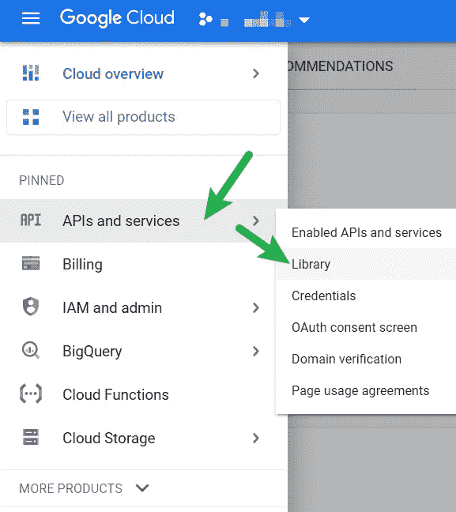

截图:作者自己的

然后搜索 API 并启用它们:

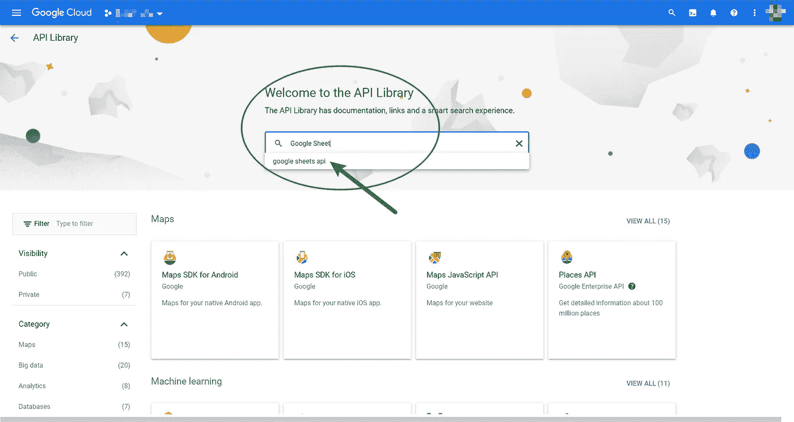

截图:作者自己的

## 👉 **#3 您已经创建了一个服务帐户。**

使用这些 API 时，我们需要凭证来进行身份验证。为此，在 GCP 的左侧导航菜单中，选择 API 和服务>凭据:


截图:作者自己的

选择顶部的“创建凭据”，然后选择服务帐户:

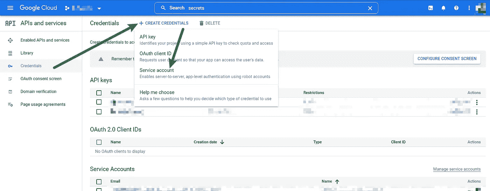

截图:作者自己的

为您的服务帐户命名。这将自动用于填充 ID 并生成一个`iam.gserviceaccount.com`电子邮件地址。

> ⚠️ **记下这个电子邮件地址，因为你以后会用到它！**

你现在可以跳过下面截图中的第 2 步和第 3 步:


截图:作者自己的

一旦完成，这应该会带你回到主屏幕。找到您刚刚创建的服务帐户，并单击其末尾的铅笔编辑图标:


截图:作者自己的

在下一个屏幕上，单击“Keys”，然后单击“Add Key”，从下拉菜单中选择“Create a New Key”，然后从弹出菜单中选择“JSON”并将其保存在桌面上的某个位置:

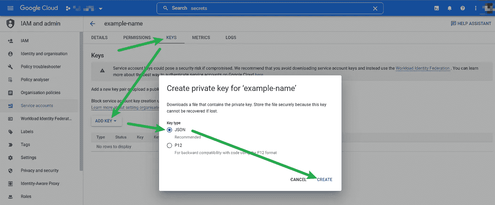

截图:作者自己的

## 👉 **#4 您已经将密钥保存在 Secret Manager 中。**

在使用 API 时，我们将使用 Google 的 Secret Manager 来安全地存储和访问凭证，而不是在不安全的代码中直接引用您的密钥。
在顶部搜索栏中搜索“秘密经理”,然后点击秘密经理:


截图:作者自己的

然后选择“创建密码”:

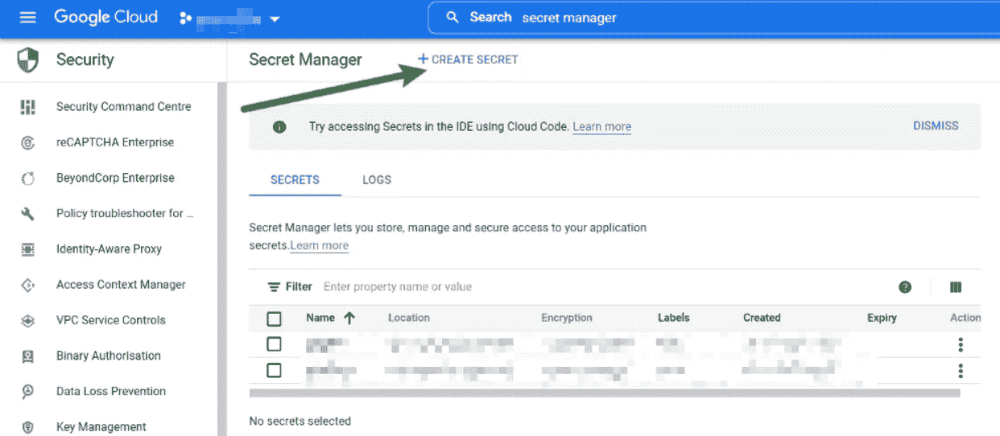

截图:作者自己的

给你的秘密取个名字，从你的桌面上传你之前创建的 JSON 文件，然后选择“创建秘密”:


截图:作者自己的

完成后，在这个屏幕上，勾选你刚刚创建的秘密，然后点击“添加原则”。使用之前创建服务帐户时生成的`iam.gserviceaccount.com`电子邮件地址，并确保其角色设置为“Secret Manager Secret Accessor”:

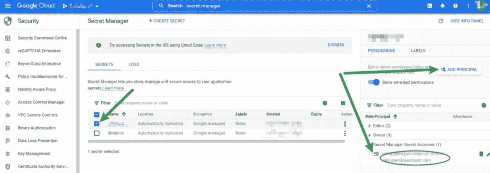

截图:作者自己的

## 👉 **#5 您已经将服务帐户电子邮件地址添加到您的 Google 表单中。**

进入包含您想要分析的数据的 Google 工作表，并将此电子邮件地址作为编辑器分配给该工作表。您可以取消选中“通知”框，然后点按“共享”。


截图:作者自己的

apis 已启用。

✅凭据已创建。

🚀您已经为下一步做好了准备！

# 步骤 1:使用 Python 和 Google Sheets API 从 Google Sheets 中检索数据

假设您收到了来自 100 个客户的反馈，数据存储在一个包含 3 列的 Google 工作表中:产品 ID、客户反馈和客户 ID，如下所示:

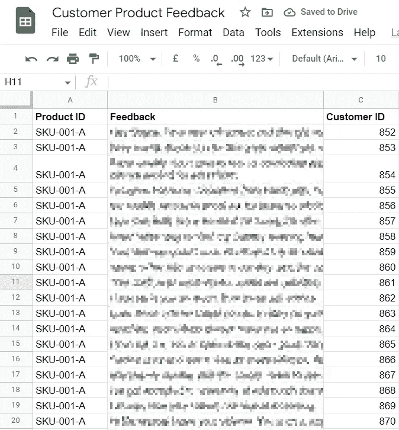

截图:作者自己的

## Python 和 VS 代码

👨‍💻我们将假设您首先在本地工作，我们使用的是 Python 3。当用 R 编写代码时，我专门使用 [RStudio](https://www.rstudio.com/) (现在是 [Posit](https://posit.co/) )，但是因为这是一个 Python 练习，所以当用 Python 安装软件包和编程时，我使用 [VS Code](https://code.visualstudio.com/) 作为我的首选 IDE。

以下步骤假设您使用 VS 代码。

## 安装云代码扩展

如果我们在本地机器上工作，并且在使用 Google Cloud APIs 时处理认证，我们将需要在 VS 代码中安装官方的 Cloud 代码扩展。此处的说明[为](https://cloud.google.com/code/docs/vscode/install)。


截图:作者自己的

> ⚠️ **注意:确保你之后从 VS 代码登录谷歌云！**

您可以在屏幕底部看到您是否登录。如果您尚未登录，请单击此处登录:

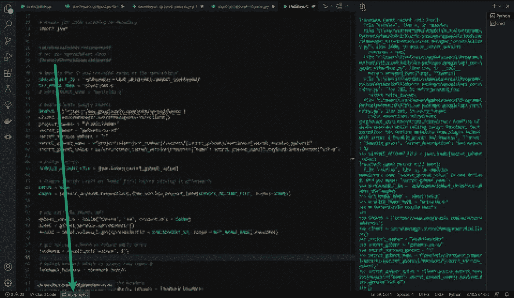

截图:作者自己的

## **安装包**

[Google API 客户端](https://developers.google.com/docs/api/quickstart/python)包含了我们将在 Python 中使用的所有相关的基于发现的 API。安装软件包:

```
pip3 install google-api-python-client
```

我们还需要 [google.auth](https://google-auth.readthedocs.io/en/master/) 包:

```
pip3 install google-auth
```

如前所述，我们将使用[Google Cloud Secret Manager](https://codelabs.developers.google.com/codelabs/secret-manager-python#3)来保护我们的凭证安全，所以让我们也安装它:

```
pip3 install google-cloud-secret-manager
```

我们将使用 [gspread](https://docs.gspread.org/en/latest/) 包使使用 Google Sheets 变得更加容易:

```
pip3 install gspread
```

当然还有 [gspread_dataframe](https://gspread-dataframe.readthedocs.io/en/latest/) :

```
pip3 install gspread-dataframe
```

🐍现在让我们使用 Python 并导入我们刚刚安装的包，调用 Google Sheets API，从电子表格中获取我们的反馈数据并将其保存为 dataframe👇

## 导入包

```
##########################
# Load packages
##########################*# Google Credentials* from googleapiclient.discovery import build
from google.oauth2 import service_account
import google.auth
from google.cloud import secretmanager*# Python API for Google Sheets* import gspread
from gspread_dataframe import set_with_dataframe
```

我们还将导入 [NumPy](https://numpy.org/) 、 [pandas](https://pandas.pydata.org/) 、 [copy](https://docs.python.org/3/library/copy.html) 和[JSON](https://docs.python.org/3/library/json.html)——这些**不需要像其他**一样安装，因为它们在 Python 中是标准的:

```
*# Standard Python packages* import pandas as pd
import numpy as np*# to create deep copy* import copy*# for JSON encoding or decoding* import json
```

## 重要变量

准备好以下变量的值。我们需要他们马上调用 GSheets API:

👉电子表格 _ID

👉获取范围名称

👉项目编号

👉秘密 _gsheet

👉秘密 _ 版本 _ 页面

## **电子表格 _ID**

这是指 Google Sheet URL 末尾的字母数字字符串，如下图所示:


图片:作者自己的

## **获取范围名称**

这是一个字符串值，表示电子表格中数据所在的区域。根据下面的截图，如果您的数据在 Sheet 1 中，那么您的范围名称将是: *Sheet1！A1:C*


截图:作者自己的

## **项目 _ 编号**

这是一个字符串，表示为您在 Google Cloud 中创建的项目分配的编号。您可以通过访问 Google Cloud 仪表板并选择您的项目来找到它:

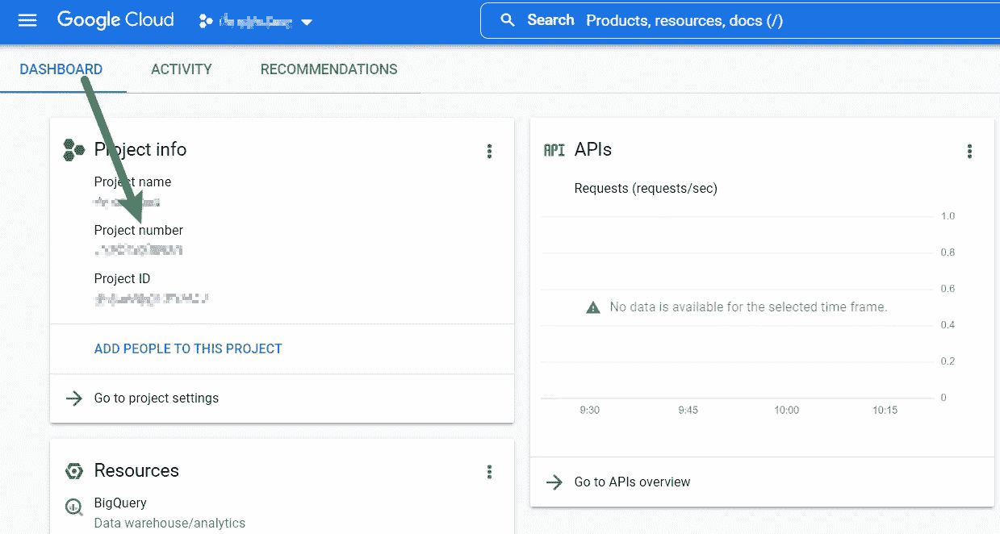

截图:作者自己的

## **secret_gsheet**

这是一个字符串，表示您为 Secret Manager 中的 gsheet 练习指定的名称:

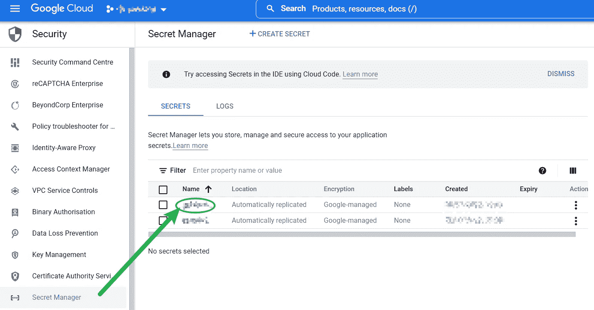

截图:作者自己的

## **secret_version_gsheet**

这是一个字符串，表示您的密码的版本号。您可以通过在秘密管理器中点击您的秘密来找到它:

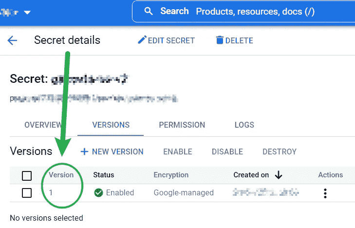

截图:作者自己的

## 📞调用 Google Sheet API

让我们从 Google Sheets 中获取数据并保存在一个数据框架中。

> ⚠️注意:在运行之前，你必须先通过 VS 代码登录谷歌云。记住还要更新上面讨论的变量的值。

## 注意事项:

✏️ **第 20 行**:当我们给`SERVICE_ACCOUNT_FILE`分配秘密的时候，我们用了`json.loads()`。由于我们没有引用实际的 JSON 文件(因为我们现在使用 Secret Manager)，我们需要使用`json.loads()`将`secret_gsheet_value`从 JSON 字符串转换成 Python 字典。

✏️ **第 24 行**:同样，由于我们不再直接处理 JSON 文件，我们使用了`service_account.Credentials.from_service_account_**info**()`而不是`service_account.Credentials.from_service_account_**file**()`。

# 第二步:开始情感分析

现在，让我们开始对反馈数据进行基本的情感分析。

## 安装情感分析包

我们将试用 Python [nltk](https://github.com/nltk/nltk) 包中的 VADER(休顿&吉尔伯特，2014)。安装它:

```
pip3 install nltk
```

## 导入情感分析包

导入我们刚刚安装的包。在本练习中，我们不做标记化，因此下面的内容就足够了:

```
import nltk
from nltk.corpus import stopwords
from nltk.sentiment.vader import SentimentIntensityAnalyzer
```

## 运行情绪分析

现在，让我们开始对反馈数据进行基本的情感分析。

## 注意事项:

✏️ **第 8–13 行:**为了进行更准确的分析，需要从反馈语料库中删除停用词，以便在分析过程中不考虑不重要的词。英语中常见的停用词是像“the”、“and”、“is”这样的词。

✏️ **第 25 行** : VADER 根据它所分析的文本输出负极、中性和正极的极性分数。

✏️ **第 32 行**:维达也从极性得分中输出复合得分。这实际上是将消极、中立和积极的分数相加，然后标准化为一个等级，其中+1 表示高度积极，而-1 表示高度消极。

✏️ **Line 40** :复合分数可以帮助我们标注一条反馈是正面的、中立的还是负面的。通过在复合分数上创建一个基本逻辑，我们可以返回更容易理解的值(即“正”，而不是“0.89”)。

您可以定制这种逻辑，如果您愿意，可以有更多的标签(例如，有 5 个标签，而不是 3 个:“非常积极”、“积极”、“中性”、“消极”、“非常消极”)。

# 步骤 3:将结果写入电子表格

现在我们已经有了分析结果，让我们在同一个电子表格中的一个新选项卡上写东西。我们将数据保存到 Sheet2，如下所示:


截图:作者自己的

这就是我们使用`gspread`和`gspread_dataframe`的方法👇

## 注意事项:

✏️️ **第 7 行&第 10 行:**我们引用了之前第一次调用 Google Sheets API 时已经引用过的`CREDS`和`SPREADSHEET_ID`变量。

✏️ **第 13 行**:我们指定数据应该写到哪里。例如，如果你想把它写到一个名为“Sheet2”的标签中，那么它将被保存在 Google sheet 中的这个位置。

> ⚠️If 当你在实际的工作表中改变标签的名字时，记得更新你的代码中的值，否则你的代码将无法工作。

# 好处:部署到谷歌云功能

👏到目前为止，我们做得很好！但不幸的是，这段代码目前仍在您的本地机器上💻—这意味着它只能从您的计算机上运行。

通过将我们的代码部署到 Google Cloud Functions 的云☁️上，我们将能够在任何地方运行代码。在这一节中，我将概述如何将这些代码直接添加到 Google Cloud 接口中。

仅供参考:直接从您的 IDE 部署是可能的，但这超出了本文的范围(本文已经够长了！)

## 配置云功能

在 Google Cloud dashboard 的搜索栏中为您的项目搜索云功能:


截图:作者自己的

点击屏幕上的“创建功能”,您将进入以下页面:

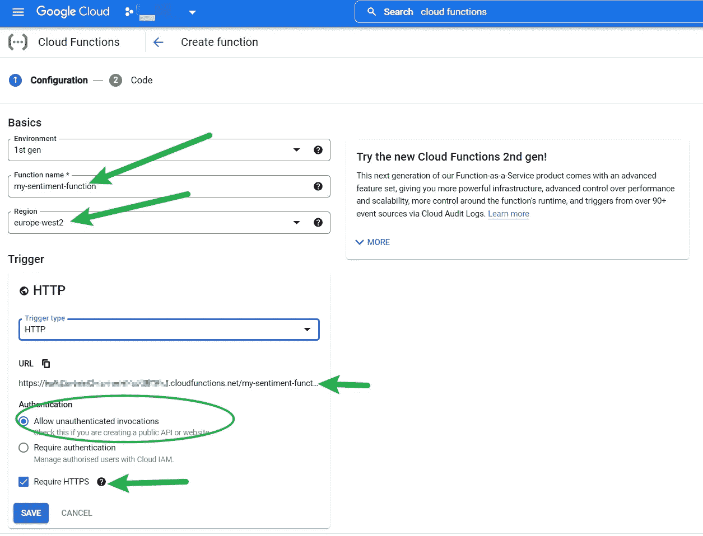

截图:作者自己的

*   环境:暂时把它作为第一代。
*   **函数名**:给你的函数起个名字。这里的例子叫做`my-sentiment-function`。
*   **区域**:选择一个最近的区域。
*   **触发器类型**:我们正在创建一个基本的 HTTP 触发器。勾选“要求 HTTPS”框，您可以暂时将身份验证设置为“未验证”,仅用于本练习。

点击“保存”。

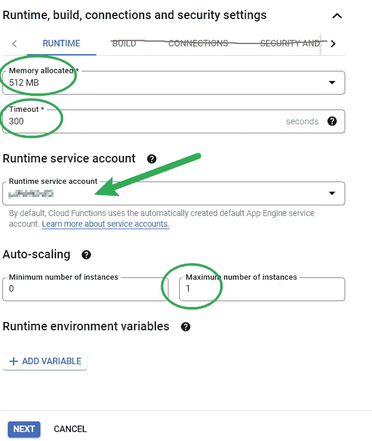

截图:作者自己的

*   **分配的内存**:该示例使用 512mb，但是如果您愿意，您可以更改它
*   **超时**:设定为 300 秒，但您也可以更改
*   **运行时服务帐户**:从下拉菜单中选择您之前创建的服务帐户
*   **最大实例数**:暂时设为 1。

现在，您可以跳过其他选项卡，单击“下一步”进入以下屏幕:

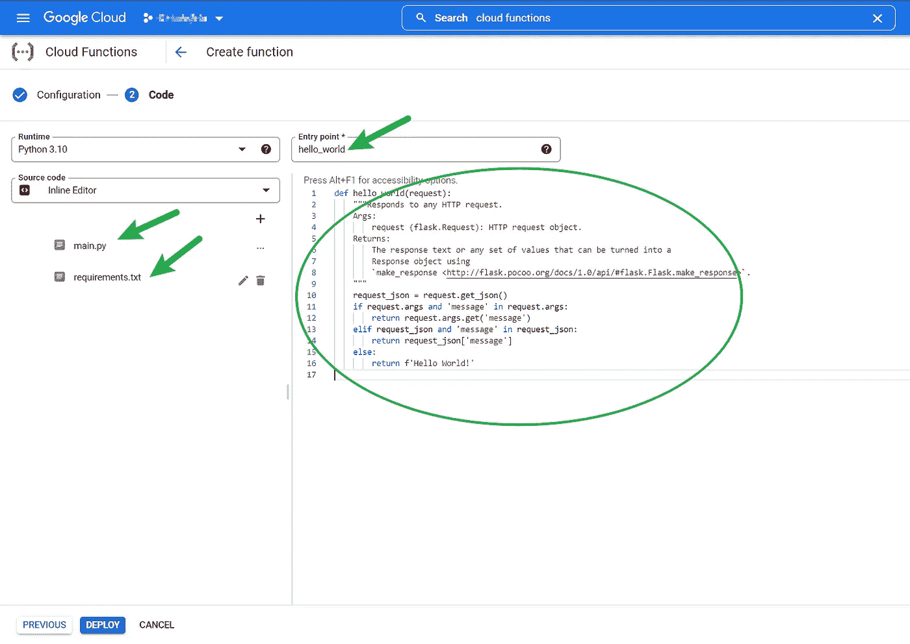

截图:作者自己的

这里有几个要点需要回顾。

## **运行时**

我们使用的是最新的 Python 3，所以选择 Python 3.10。

## **main.py**

云函数要求代码在一个名为`main.py`
的文件中，如果你正在上传代码，这对于确保你的文件名称为`main.py`是至关重要的。但是因为我们在界面中使用内嵌编辑器直接更新我们的代码(在截图中圈出)，所以这对于这个练习来说不是问题。

对于 Python，云函数使用 [Flask](https://flask.palletsprojects.com/en/2.2.0/) 框架。所以我们希望`main.py`中的代码是这样的:

我们需要命名我们的函数。在上面的例子中，我们称之为`my_function`。

函数中的请求参数应该返回可以转换成 Flask 响应的内容。这个响应可以是一个简单的字符串，甚至是一个 JSON 字符串。在上面的例子中，我们简单地返回了字符串“耶！搞定！”

## 关于最佳实践

从技术上讲，你可以在一个函数中做任何事情，只要它返回一个合适的响应。然而，作为最佳实践，我们应该努力确保一个函数只做一件事，如上面的例子所示。这更干净，有助于降低代码的复杂性。如果我们要正确地完成这项工作，我们之前编写的代码将需要重构，并分解成更小的、正确定义的单个函数。

但这并不意味着在一个功能中做多件事会让你的云功能完全无用。这只是意味着您的代码变得难以维护和调试。

> ⚠️知道，你的功能越长越复杂，谷歌云执行的时间就越长。

为了让这篇已经很长的帖子保持简短，并希望这个示例是一个基本的快速原型，我们之前编写的代码可以通过以下方式针对云函数进行更新:

## 注意事项:

✏️ **线 5** :所有要装载的包装都已经移动到顶部

✏️ **第 22 行**:剩下的代码在我们命名为`my_sentiment_function`的定义函数中。

✏️ **第 149 行**:如果这执行得很好，我们将得到响应“耶！搞定！”在我们的浏览器中。

上面的代码应该放入`main.py`的行内编辑器中。不要忘记指定云函数的开始作为入口点。我们的函数叫做`my_sentiment_function`,所以它被用作入口点:

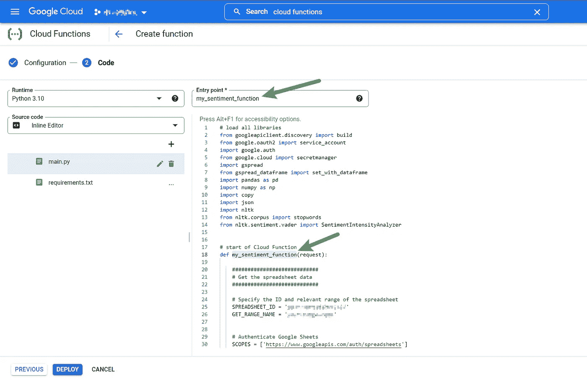

截图:作者自己的

## requirements.txt

我们需要在 requirements.txt 中指定需要安装的包。我们只需要以下内容:

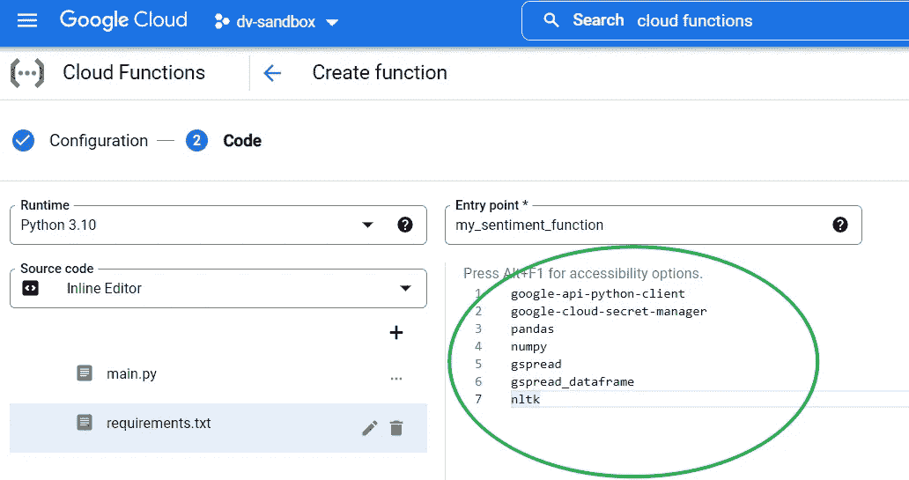

截图:作者自己的

请注意，我们没有在这里添加`Flask`、`copy`和`json`。这是因为它们在环境中已经存在。

> ⚠️:不管怎样，如果你把这些添加到 requirements.txt 中，云功能将无法部署，即使其他一切都安装正确。

`google-api-python-client`已经包含了像`googleapiclient.discovery`这样的 google discovery APIs，所以没有必要再将后者添加到 requirements.txt 中。

现在部署！


截图:作者自己的

几分钟后，如果您完成了上述所有操作，您应该会看到绿色的 tick✅，表明您的功能已经成功部署🙌🥳!


截图:作者自己的

# 测试

让我们快速测试一下这是否真的有效！

1.  点击你的功能，然后进入名为“触发”的标签。此功能是通过 HTTP 触发的，因此谷歌云功能已经为您分配了一个 URL。
2.  点击 URL 触发您的功能:

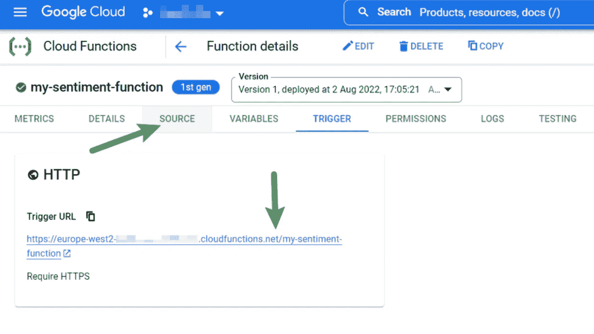

截图:作者自己的

3.应该会打开一个新的浏览器选项卡。

**结果:**

❌If:如果失败，你会得到一个错误信息，你可以查看“日志”标签，检查错误，看看为什么失败。这些错误已经被很好的描述了，所以你应该能够理解。

✅如果成功了，你会得到你的“耶！搞定！”浏览器中的成功消息:


截图:作者自己的

为了全面测试这一点，请记住，我们已经配置了代码，从 Sheet1 读取数据，然后将情感分析结果写入 Sheet2。

1.  所以继续删除 Sheet2 中的所有内容。
2.  复制云功能给你的网址，再次输入浏览器。再次触发该函数应该会更新 Sheet2！

因此，如果您在 Sheet1 中添加新的客户反馈或更改它们，只需点击您的云函数 URL，就会将情感分析的结果输出到 Sheet2 中！

## 作为 JSON 返回

如果你不想回“耶！搞定！”，并希望该函数返回我们之前以 JSON 形式创建的情感数据帧，请将 return 语句替换为:

```
*from flask import Response**return Response(sentiment_df.to_json(orient="records"), mimetype='application/json')*
```

# 结束了

这就是如何通过 Google Cloud 函数实时部署基本 Python 情绪分析代码的快速示例的结尾。谢谢你读到这里🤗！

现在您已经了解了所有这些是如何工作的，您可能想进一步了解:

*   执行更深入的情感分析——首先尝试一些句子和单词的标记化。
*   看看改进代码，让它更干净。
*   注意云安全——我们已经避免在代码中硬编码我们的凭证，并使用了 Google Secret Manager 的基本方法。但是您可以研究进一步的改进，比如限制权限、将密钥限制在特定的 API 上、只允许经过身份验证的访问、在您完成实验后删除未经身份验证的函数等等。
*   关注你的云资源:这个练习不应该让你超越你的免费层，但是如果你正在分析大量的情感数据，那么你将需要关注你的资源。关闭不使用的资源，删除不再需要的示例项目，等等。

> ⚠️完成后别忘了删除这个云功能！

# 完整的 Python 代码

👉从我的 Github repo [这里](https://github.com/Practical-ML/vader-sentiment-analysis)获取完整的 Python 代码。

# 参考资料和进一步阅读

休顿，C.J .和吉尔伯特，2014 年。VADER:基于规则的社交媒体文本情感分析的简约模型。载于:*《网络与社交媒体国际 AAAI 会议论文集》，8* (1)，第 216–225 页。

nltk 是一个开放源码的 Python 工具包，受 [Apache 2.0 许可](https://github.com/nltk/nltk/blob/develop/LICENSE.txt)。

VADER 在麻省理工学院的许可下是开源的。