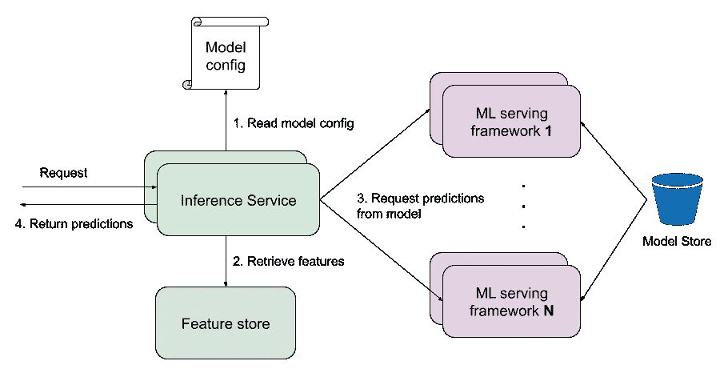
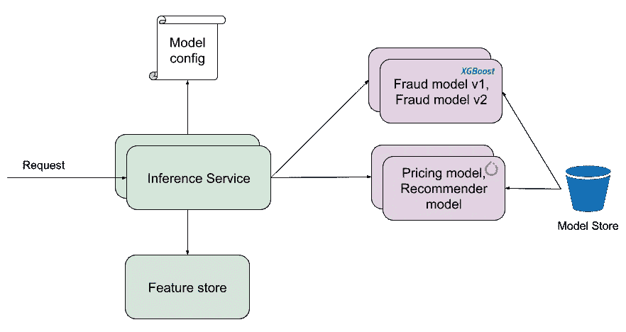

# 服务数百到数千个 ML 模型——来自行业的架构

> 原文：<https://towardsdatascience.com/serve-hundreds-to-thousands-of-ml-models-architectures-from-industry-bf3d9474d427>

## [行业笔记](https://towardsdatascience.com/tagged/notes-from-industry)

# 服务数百到数千个 ML 模型——来自行业的架构

当您只有一两个模型要部署时，您可以简单地将您的模型放在一个服务框架中，并将您的模型部署在几个实例/容器上。然而，如果您的 ML 用例增长或者您在您的数据的许多部分上构建单独的模型(像每个客户的模型)，您可能最终需要服务于大量的模型。这篇文章将探讨这个问题:如何设计一个可以实时服务数百甚至数千个模型的系统？

第一，当你需要部署成百上千的在线模型时，会有什么变化？TLDR:更加自动化和标准化。通常，这意味着对模型服务平台的投资。

像 Reddit、DoorDash、Grab 和 Salesforce 这样的公司已经建立了模型服务平台来:

1.  满足他们的规模需求，包括模型数量和每秒请求数。
2.  让整个组织的 ML 团队更容易部署模型。
3.  提供像影子模式、逐步展开和监控这样的功能。
4.  确保模型服务的一致 SLA，这可能涉及到实现对平台上所有模型都有利的优化。

尽管每个组织都独立地构建了自己的系统，但是高层设计惊人地相似。下面是我综合的一个总体设计。

这篇文章将主要关注服务于大量模型的模型服务架构，而不会涉及其他方面，如模型 CI/CD 或比较服务框架。

# 开发者体验

让我们从数据科学家/ML 工程师如何在平台上部署新模型开始。他们

1.  将训练好的模型保存到模型存储/注册表中。
2.  提供一个模型配置文件，其中包含模型的输入特性、模型位置、需要运行的内容(比如对 Docker 映像的引用)、CPU 和内存请求以及其他相关信息。

基本上——这是我的模型工件，以及如何使用它。这两个步骤可以通过内部工具来简化。在自动化再培训的情况下，部署新模型甚至可能是自动化的。

图 1:平台用户将模型工件和模型配置存储到模型服务平台期望的地方。作者图解。

# 服务架构

一旦平台有了模型工件及其配置，它就处理模型加载、特性获取和其他关注点。一般服务系统的高级组件如图 2 所示。为了简单起见，我假设所有服务都作为容器部署。

在一般情况下，对推理服务的请求可能要求来自多个模型的多个预测。如图 2 所示，服务请求的步骤如下:

1.  **读取请求**中模型的模型配置。然后使用配置来确定要获取的特性。
2.  **从特征库中检索特征**。有些功能可能包含在请求中，不需要提取。如果功能存储中缺少某个功能或该功能过于陈旧，请使用默认值。
3.  **向各自的模型发送特征以获得预测**。
4.  **将预测返回给客户端**。

图 2:支持许多模型的模型服务平台的架构。重叠的矩形显示组件可以水平缩放。作者图解。

**架构的组成部分**:

*   **推理服务** —提供服务 API。客户端可以向不同的路线发送请求，以从不同的模型获得预测。推理服务统一了跨模型的服务逻辑，并提供了与其他内部服务更容易的交互。因此，数据科学家不需要考虑这些问题。此外，推理服务调用 ML 服务容器来获得模型预测。这样，推理服务可以专注于 I/O 相关的操作，而模型服务框架则专注于计算相关的操作。每组服务都可以基于其独特的性能特征进行独立扩展。
*   **型号配置** —来自平台用户。可以从另一个服务中读取某个模型的配置，或者在推理服务启动时将所有配置加载到内存中。
*   **特征存储** —是一个或多个包含特征的数据存储。
*   **ML serving framework** —是一个容器，其中包含了运行某种模型所需的所有依赖关系。例如，具有 Tensorflow 服务的特定版本的容器。容器可以服务于一个或多个模型。为了确保图像的可重用性，模型通常不会被放入容器图像中。更确切地说，容器在启动时或者收到对模型的请求时加载模型。一段时间不活动后，模型可能会从内存中被逐出。
*   模型商店——听起来确实如此。这可以是像 AWS S3 这样的对象存储，服务可以通过模型注册服务与它交互。

## 图中未显示

图 2 并不全面，仅代表核心组件。所有生产系统都应该对运营指标进行监控。此外，模型度量可能会流入另一个系统进行漂移检测。可能有一个组件将业务逻辑应用于模型预测，例如，增加产品推荐的排名。每个企业都需要确定自己的需求。

## 系统存在于何处？

上面提到的许多组织选择在 Kubernetes 上部署平台。一些原因:

*   它帮助你管理大量的容器！
*   资源虚拟化。容器获得资源请求和限制，所以没有人可以独占所有的资源，这对于从同一个实例服务多个模型很有用。
*   基于 CPU 利用率和其他指标的水平自动扩展易于配置。

您可能不会选择 Kubernetes 进行容器编排，但您可能会想要类似的东西。

举个例子，Reddit 的服务平台是这样的:

图 3: Reddit 的推理服务，Gazette。来源:[2]。该架构类似于图 2。绿色方框用于张量流模型。他们使用 Memcached Daemonset 作为缓存来加速特征检索。

## 扩展以服务更多型号

首先，最简单的方法是为每组 ML 服务框架容器提供一个模型。图 4 是一个例子。欺诈模型在一组 XGBoost 容器中，定价模型在一组 TorchServe 容器中，推荐者模型在另一组 TorchServe 容器中。有了一个好的容器编排框架，您可以扩展到数百个模型。

图 4:每套 ML 服务容器一个模型。作者图表

随着时间的推移，团队产生了更多的模型和同一模型类型的多个版本，这导致了许多容器。您可能会倾向于为每个容器提供多个模型，因为:

1.  您想要更高的资源利用率。如果定价模型是空闲的，仍然有 2 个或更多的运行容器来确保模型是可用的。这些容器占用了所请求的资源量。但是，如果 TorchServe 容器同时服务于推荐模型和定价模型，您可以使用更高百分比的资源。当然，代价是你可能会有吵闹的邻居，其中一个模型变慢了，因为另一个正在争夺资源。
2.  你预计你会遇到一些容器数量的限制。Kubernetes 有每个集群的限制，AWS 弹性容器服务也是如此。或者，可能集群是共享的，服务平台的容器数量有限制。

一些像 Tensorflow Serving 和 TorchServe 这样的框架支持本地服务多个模型[1，5]。Salesforce Einstein 为每个容器提供多个模型，因为他们需要为超级大量的模型提供服务。

图 5:每组 ML 框架容器的多个模型。XGBoost 容器服务于同一模型类型的两个版本。TorchServe 容器同时服务于定价和推荐模型。作者图解。

# 最佳化

如果图 2 中的系统性能不够好，有很多优化的机会。

首先是添加缓存。您可以在要素存储前添加缓存，以加快要素检索。如果服务框架仅在有请求时将模型加载到内存中，那么第一个请求可能会很慢。加快速度的一个方法是在模型存储之前添加一个缓存，就像共享文件系统一样。如果您经常收到相同的预测请求，您甚至可以为模型预测添加缓存。

另一个优化是用 C++服务模型。DoorDash 的服务平台支持 lightGBM 和 PyTorch 模型，并且都在 C++中运行[7]。

如果某些应用程序需要一次预测多个输入，请求批处理会很有用。例如，在单个请求中对 100 个推荐项目进行排名。一些服务框架支持批处理多个预测请求，以获得更好的吞吐量。在 GPU 上运行神经网络时，批处理预测可能特别有益，因为批处理可以更好地利用硬件。

# 阴影模式和模型卷展栏

实现影子模式的一种方法是将一定比例的生产模型请求转发给影子模型。发送请求而不等待响应，并设置一个监视系统，将阴影模型输入和输出写到一个离线存储，如雪花或 AWS 红移。然后，数据科学家可以离线分析模型性能。给予影子模型比生产模型更低的优先级以防止停机是至关重要的。在 Kubernetes 中，您可以指定 pod 调度和驱逐的优先级[4]。

推出新版本模型的安全方法是首先将一小部分生产流量转移到新版本。有两种方法可以做到这一点。第一种是让客户选择使用哪个版本的模型。他们可以调用不同的 API 路由，或者在请求中包含模型版本。另一种让平台选择的方法是——开发人员在模型配置或其他配置文件中指定向新模型发送多少流量。然后，推理服务负责将正确百分比的请求路由到新模型。我更喜欢后一种方法，因为客户不需要改变他们的行为来使用新的模型。

# 服务于超大量的模型

Salesforce 有一个独特的使用案例，他们需要服务 100K-500K 模型，因为 Salesforce Einstein 产品为每个客户构建模型。他们的系统在每个 ML 服务框架容器中服务多个模型。为了避免嘈杂的邻居问题，并防止一些容器比其他容器承担更多的负载，他们使用 shuffle sharing[8]为容器分配模型。我就不赘述了，推荐看他们在[3]的精彩呈现。

图 Manoj Agarwal 关于 Salesforce Einstein 如何为模型服务的演示截图。Manoj 在这张幻灯片上解释了洗牌分块。“路由器”服务是推理服务。“版本管理”服务告诉“路由器”要服务哪个版本的模型。特征被发送到 AutoML 2.0 容器进行预测。来源:[3]。

# 结论

我们已经讨论了一个被多个组织使用的架构，它服务于大量的模型，并为整个组织中的团队提供了一条铺平的道路。我确信有替代设计，因为任何设计的细节都取决于组织的需求。请让我知道我应该考虑的其他架构！

# 参考

1.  "12.运行 TorchServe — PyTorch/Serve 主文档。 *PyTorch* ，py torch . org/serve/server . html # serving-multi-models-with-torch serve。访问时间为 2022 年 1 月 11 日。
2.  霍夫曼加勒特。"发展 Reddit 的 ML 模型部署和服务架构."*Reddit*2021 年 10 月 4 日[www . Reddit . com/r/RedditEng/comments/q 14 tsw/evolving _ reddits _ ml _ model _ deployment _ and _ serving](http://www.reddit.com/r/RedditEng/comments/q14tsw/evolving_reddits_ml_model_deployment_and_serving)。
3.  马诺基·阿加瓦尔。“以低延迟大规模提供 ML 模型// Manoj Agarwal // MLOps Meetup #48。” *YouTube* ，由 MLOps.community 上传，2021 年 1 月 22 日[www.youtube.com/watch?v=J36xHc05z-M](http://www.youtube.com/watch?v=J36xHc05z-M)。
4.  更多，普拉东斯。"猫步:大规模服务于机器学习模型——走向数据科学."*中*，2021 年 12 月 12 日，朝 sdadascience . com/catwalk-serving-machine-learning-models-at-scale-221d 1100 aa2b。
5.  "调度、抢占和驱逐."2022 年 1 月 11 日，kubernetes.io/docs/concepts/scheduling-eviction.*库伯内特斯*进入。
6.  "张量流服务配置| TFX | . " *TensorFlow* ，[www . tensor flow . org/tfx/serving/serving _ config # model _ server _ configuration。于 2022 年 1 月 11 日访问。](http://www.tensorflow.org/tfx/serving/serving_config#model_server_configuration.)
7.  曾，科迪。"认识 Sibyl——door dash 的新预测服务——了解它的构思、实施和推广." *DoorDash 工程博客*，2020 年 10 月 6 日，door dash . Engineering/2020/06/29/door dash-new-prediction-service。
8.  左，奎因。“在贝宝部署大规模欺诈检测机器学习模型。”*Medium*2022 年 1 月 4 日 Medium . com/paypal-tech/machine-learning-model-ci-CD-and-shadow-platform-8c4f 44998 c78。
9.  MacCárthaigh，Colm。"使用混洗分片的工作负载隔离."*亚马逊网络服务公司*，AWS . Amazon . com/builders-library/workload-isolation-using-shuffle-sharding。于 2022 年 1 月 13 日访问。