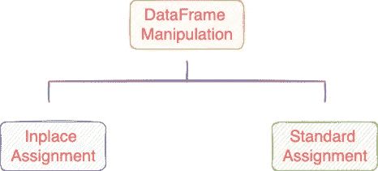
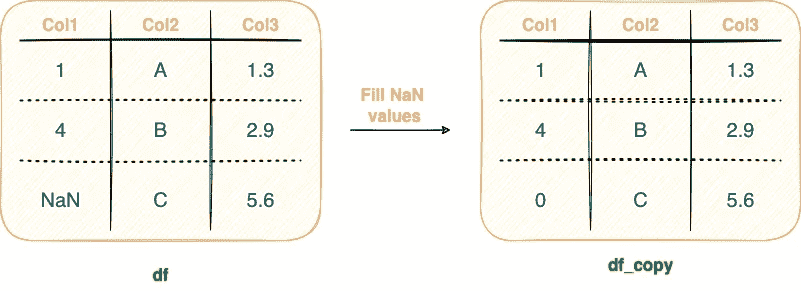
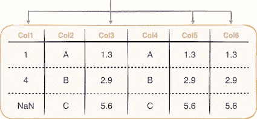
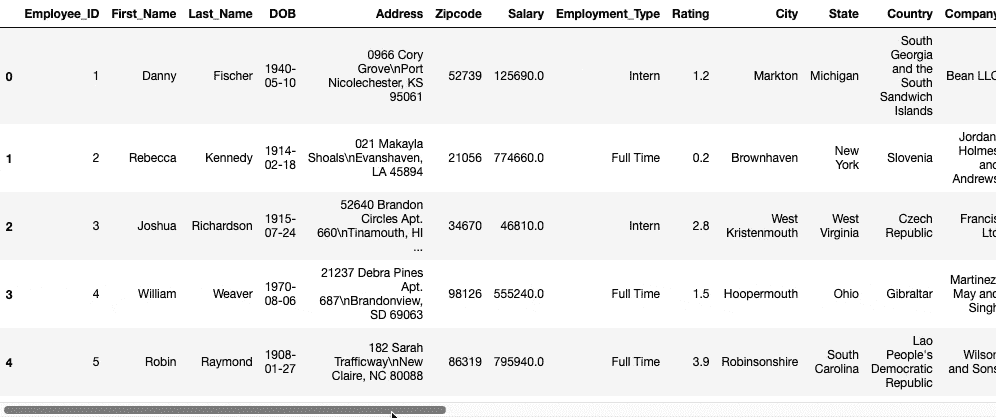
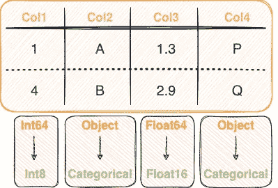
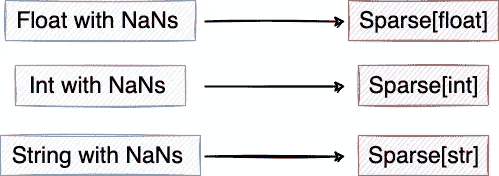
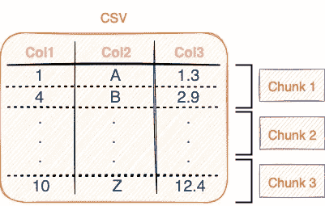
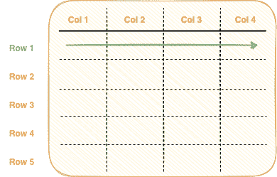
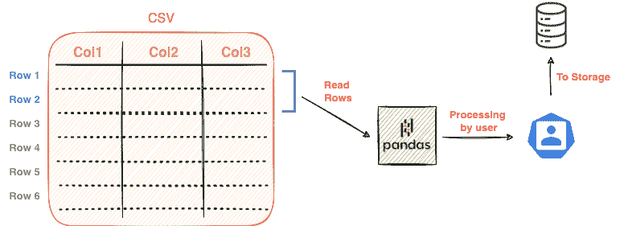

# 每个熊猫用户都应该知道的七个黑仔内存优化技术

> 原文：<https://towardsdatascience.com/seven-killer-memory-optimization-techniques-every-pandas-user-should-know-64707348ab20>

## 优化熊猫记忆利用的简单技巧

丹尼斯·简斯在 [Unsplash](https://unsplash.com?utm_source=medium&utm_medium=referral) 拍摄的照片

设计和构建现实世界中适用的机器学习模型一直是数据科学家的兴趣所在。这不可避免地导致他们大规模利用优化、高效和准确的方法。

运行时和内存级别的优化在可持续交付真实世界和面向用户的软件解决方案中扮演着基础角色。

优化分类(按作者分类的图片)

在我之前的一篇文章中，我介绍了一些顶级的运行时优化技术，您可以在常规的数据科学项目中使用这些技术。

  

在这篇文章中，我们将探索优化的另一个领域，我将向你介绍一些令人难以置信的技术来优化你的熊猫数据帧的**内存使用**。

这些提示将帮助您在 Pandas 中有效地执行典型的表格数据分析、管理和处理任务。

为了得到一个简要的概述，我将在这篇文章中讨论以下主题:

[**#1 就地修改数据帧**](#fbf8)[**# 2 只读 CSV 中必需的列**](#314b)[**# 3-# 5 更改列的数据类型**](#55a9)[**# 6 在读取 CSV**](#0760)

我们开始吧🚀！

# #1 对数据帧进行就地修改

一旦我们将数据帧加载到 Python 环境中，我们通常会对数据帧进行大范围的修改，不是吗？这些包括添加新列、重命名标题、删除列、改变行值、替换 NaN 值等等。

这些操作通常可以通过两种方式执行，如下所示:

熊猫数据帧操作的分类(图片由作者提供)。

**标准赋值**旨在转换后创建数据帧的新副本，保持原始数据帧不变。

从给定的数据帧创建新的数据帧(图片由作者提供)。

作为标准分配的结果，两个不同的熊猫数据帧(原始的和转换的)在环境中共存(上面的`df`和`df_copy`),加倍了存储器利用率。

与标准赋值操作相反，**就地赋值操作**打算修改原始数据帧本身，而不创建新的 Pandas 数据帧对象。下面演示了这一点:

执行就地操作(Gif 由作者提供)

因此，如果 DataFrame 的中间副本(`df_copy`)在您的项目中没有用处，那么在内存受限的应用程序中，采用就地赋值的方法是最理想的方法。

你可以在下面阅读我关于就地分配操作的详细帖子:

  

## 关键要点/最终想法:

1.  当需要中间数据帧，并且不想改变输入时，使用标准赋值(或`inplace=False`)。
2.  如果您正在处理内存限制，并且不特别使用中间数据帧，请使用就地赋值(或`inplace=True`)。

# # 2 CSV 中的只读必填列

只阅读感兴趣的栏目(图片由作者提供)。注意:CSV 文件是一个文本文件，上面的插图不是 CSV 的样子。这只是为了直观地阐述观点。

设想一个场景，您的 CSV 文件中有数百列，其中只有一部分列是您感兴趣的。

例如，考虑我使用 [Faker](https://faker.readthedocs.io/en/master/) ( `filename` : `dummy_dataset.csv`)创建的具有 25 列和 10⁵行的虚拟数据帧的前五行:

虚拟数据集(作者提供的 Gif)

在这 25 列中，假设只有 5 列是您最感兴趣的，并且您希望将它们作为 Pandas 数据框架加载。这些列是`Employee_ID`、`First_Name`、`Salary`、`Rating`和`Company`。

*   **加载所有列:**

如果您打算将整个 CSV 文件读入 python 环境，那么 Pandas 将被迫加载那些无用的列并推断它们的数据类型，从而导致运行时间和内存使用量的增加。

我们可以使用如下所示的`[info()](https://pandas.pydata.org/pandas-docs/stable/reference/api/pandas.DataFrame.info.html)`方法找到熊猫数据帧的内存使用情况:

在加载了所有 25 列的情况下，数据帧在内存中拥有 137 MBs 的空间。加载 CSV 文件的运行时间计算如下:

*   **加载所需列:**

与读取所有列相反，如果只有您感兴趣的列的子集，您可以将它们作为列表传递给`[pd.read_csv()](https://pandas.pydata.org/pandas-docs/stable/reference/api/pandas.read_csv.html)`方法的`usecols`参数。

内存利用率的计算如下所示:

仅加载感兴趣的列将内存利用率降低了近 9 倍，占用了大约 15 MBs 的空间，而不是之前的 137 MBs。

加载运行时间也显著减少，与加载所有列相比，提升了近 **4 倍**。

## 关键要点/最终想法:

1.  只加载所需的列可以显著提高运行时间和内存利用率。因此，在加载大型 CSV 文件之前，只加载几行(比如前五行)并列出感兴趣的列。

# # 3–5 改变列的数据类型

熊猫的数据类型转换(图片由作者提供)

默认情况下，Pandas 总是将最高的内存数据类型分配给列。例如，如果 Pandas 将一个列解释为整数值，则可能有四个子类别(有符号)可供选择:

*   `int8` : 8 位整数，包含来自【2⁷].-2⁷】的整数
*   `int16` : 16 位整数，包含[-2 ⁵，2 ⁵].]中的整数
*   `int32` : 32 位整数，涵盖[-2，2 ]中的整数。
*   `int64` : 64 位整数，包含来自【2⁶-2⁶】的整数。

然而，Pandas 总是将`int64`指定为整数值列的数据类型，而不管列中当前值的范围。

浮点数值也有类似的含义:`float16`、`float32`和`float64`。

> **注意**:我将引用我们在上一节中讨论的同一个虚拟数据集。下面，我再次提到了数据类型。

数据帧的当前内存利用率为 **137 MBs** 。

*   **改变整数列(#3)的数据类型**

降级整数数据类型(图片由作者提供)

让我们考虑一下`Employee_ID`列，求它的最大值和最小值。

请注意，即使该列可能被解释为`int32` (2 ⁵ < 10⁵ < 2)，熊猫仍然采用`int64`类型作为列。

幸运的是，Pandas 提供了使用`[astype()](https://pandas.pydata.org/docs/reference/api/pandas.DataFrame.astype.html)`方法改变列数据类型的灵活性。

下面演示了`Employee_ID`列的转换，以及转换前后的内存使用情况:

通过这个简单的单行数据类型转换，`Employee_ID`列使用的总内存减半。

通过类似的最小-最大分析，还可以改变其他整型和浮点型列的数据类型。

*   **改变代表分类数据的列的数据类型(#4)**

转换为分类列(作者图片)

顾名思义，分类列是只包含几个唯一值的列，这些值在整个列中反复出现。

例如，让我们使用如下所示的`[nunique()](https://pandas.pydata.org/docs/reference/api/pandas.DataFrame.nunique.html)`方法找出几列中唯一值的数量:

这些列中唯一值相对于数据帧大小的数量表明它们是分类列。

然而，默认情况下，Pandas 将所有这些列的数据类型推断为`object`，这实际上是一个`string`类型。

使用`astype()`方法，您可以将分类列的数据类型更改为`category`。内存利用率的降低如下所示:

随着从字符串到分类的转换，我们注意到内存利用率下降了 **75%** ，这是一个巨大的下降。

通过类似的唯一元素分析，您可以改变其他潜在分类列的数据类型。

*   **改变具有 NaN 值(#5)的列的数据类型**

将各种数据类型转换为稀疏类型(图片由作者提供)

在现实世界的数据集中，缺失值是不可避免的，不是吗？假设数据帧中的一列有很大比例的 NaN 值，如下所示:

在这种情况下，将列表示为一个备用数据结构(在接下来的文章中会详细介绍)可以提供显著的内存效率。

使用`astype()`方法，您可以将稀疏列的数据类型更改为`Sparse[str]` / `Sparse[float]` / `Sparse[int]`数据类型。内存利用率的降低和数据类型的转换如下所示:

从`float32`到`Sparse[float32]`的转换减少了近 40%的内存使用，这大约是`Rating`列中 NaN 值的百分比。

## 关键要点/最终想法:

1.  Pandas 总是用最大的内存数据类型来解释它的列。如果列中的值范围没有跨越数据类型的范围，请考虑将列的数据类型降级为最佳类型。

您可以在[这个 StackOverflow 答案](https://stackoverflow.com/a/57531404)中找到执行这些数据类型转换的参考代码。

# #6 在读取 CSV 时指定列数据类型

上面 [**#3-#5**](#55a9) 小节中讨论的技巧假设您已经在 python 环境中加载了一个熊猫数据帧。换句话说，这些是优化内存利用的**后输入**技术。

但是，在加载数据集是主要挑战的情况下，您可以控制 Pandas 在输入期间执行的数据类型解释任务，并指定您希望您的列被推断为的特定数据类型。

为熊猫提供数据类型说明(图片由作者提供)。注意:CSV 文件是一个文本文件，上面的插图不是 CSV 的样子。这只是为了直观地阐述观点。

可以通过将`dtype`参数传递给`pd.read_csv()`方法来实现这一点，如下所示:

如上所示，`dtype`参数期望从`column-name`到`data-type`的字典映射。

## 关键要点/最终想法:

1.  如果您通过数据字典或其他来源知道 CSV 的某些(或所有)列中的数据类型，尝试自己推断最合适的数据类型，并将其传递给`pd.read_csv()`方法的`dtype`参数。

# #7 从 CSV 中读取数据块

分块读取文件(图片由作者提供)。注意:CSV 文件是一个文本文件，上面的插图不是 CSV 的样子。这只是为了直观地阐述观点。

最后，假设您已经在[提示#6](#0760) 中做了所有可能做的事情，但是由于内存限制，CSV 仍然无法加载。

虽然我的最后一项技术无助于优化净内存利用率，但它更适合加载大型数据集，您可以在这种极端情况下使用。

熊猫的输入法是连载的。因此，它从 CSV 文件中一次只读取一行(或一行)。

一次读取一行(作者 Gif)。注意:CSV 文件是一个文本文件，上面的插图不是 CSV 的样子。这只是为了直观地阐述观点。

如果行数非常大，无法一次加载到内存中，您可以加载一段(或一大块)行，对其进行处理，然后读取 CSV 文件的下一段。下面演示了这一点:

在熊猫里分块处理数据(作者 Gif)。注意:CSV 文件是一个文本文件，上面的插图不是 CSV 的样子。这只是为了直观地阐述观点。

您可以通过将`chunksize`参数传递给`pd.read_csv()`方法来利用上述基于块的输入过程，如下所示:

每个`chunk`对象都是一个熊猫数据帧，我们可以使用 Python 中的`type()`方法来验证这一点，如下所示:

## 关键要点/最终想法:

1.  如果 CSV 文件太大，无法加载到内存中，请使用分块方法加载 CSV 的片段并逐个处理它们。
2.  这种方法的一个主要缺点是不能执行需要整个数据帧的操作。例如，假设您想要在一列上执行一个`groupby()`操作。这里，对应于一个组的行可能位于不同的块中。

# 结论

总之，在这篇文章中，我讨论了 Pandas 中的七种令人难以置信的内存优化技术，你可以在下一个数据科学项目中直接利用它们。

在我看来，我在这篇文章中讨论的领域是优化内存利用率的微妙方法，在寻求优化时经常被忽略。尽管如此，我希望这篇文章能让你深刻理解这些熊猫的日常功能。

感谢阅读！

[🧑‍💻**成为数据科学专家！获取包含 450 多个熊猫、NumPy 和 SQL 问题的免费数据科学掌握工具包。**](https://subscribepage.io/450q)

✉️ [**注册我的电子邮件列表**](https://medium.com/subscribe/@avi_chawla) 永远不要错过另一篇关于数据科学指南、技巧和提示、机器学习、SQL、Python 等的文章。Medium 会将我的下一篇文章直接发送到你的收件箱。