# 香农信息——我们发现了信息的原子

> 原文：<https://towardsdatascience.com/shannon-information-theory-discovering-particles-of-information-ab2c136c6a25>

## 物理对象有原子，信息有比特。克劳德·香农认为，信息虽然无形，但可以量化……

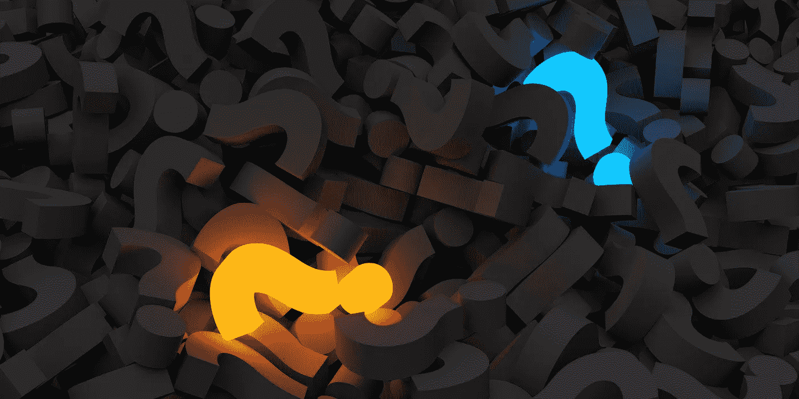

[图片](https://pixabay.com/illustrations/question-mark-pile-questions-symbol-2492009/)来自 Pixabay 的奇莫诺。

当球滚过桌面时，它掉了下来。我从未质疑过为什么会这样，因为从我们出生的那一天起，我们就一直在可观察的宇宙中与物理对象互动并观察它们的反应。如果我们看到一个事件重复了足够多，我们就开始接受它是“世界是如何运转的”。

我们不仅对这个世界的物理学有些熟悉，而且 19 世纪早期原子的发现也让我们对为什么它会起作用的基本原理有了更细致的了解。有具体的证据——可观察的，可量化的。

但是抽象的想法呢？我们看不见信息，也摸不着它。我们知道它的存在，但缺乏物理性使它的理解变得复杂，并使处理信息比它需要的更不直观。这就引出了一个问题……有没有一些不可分割的单元或者某种大统一理论像原子对物体一样塑造信息？

也许吧。

如果我们追根溯源，我们会发现香农的信息论。

*   [什么是信息？](#186f)
*   [我们能量化信息吗？](#bd41)
*   [我们如何利用香农的信息内容？](#e7ad)
*   [一个单位的信息有多大用处？](#4a50)
*   [香农信息量的实际应用](#ee35)

# 什么是信息？

想想上一次你读一篇很棒的媒体文章时，你对自己说，“这是令人难以置信的信息，”当你靠在椅子上，沉浸在绝对的满足中。

为什么？为什么信息丰富？

当有东西需要学习时，大多数人使用“信息丰富”这个词。它应该要么…

*   引入新的视角，
*   强化当前的信念，或者
*   使以前的真理无效。

不管是哪一种，它都是有益的，因为它改变了我们对世界的理解——我们的信仰。

我们生活的世界是如此不合理地动态和复杂，不可能在生活的每个方面都获得绝对的知识。每天，我们都被迫在信息不完整的情况下度过一生。随着新信息的出现，我们调整自己的信念，使之更好地与现实相一致，这样我们就能做出更好的决定。

由于我们对大多数事情都不是 100%确定，我们的观点很少是简单的二元“是”或“否”。相反，它们更好地表达为 0 到 1 之间的连续光谱，表明我们的信心水平。

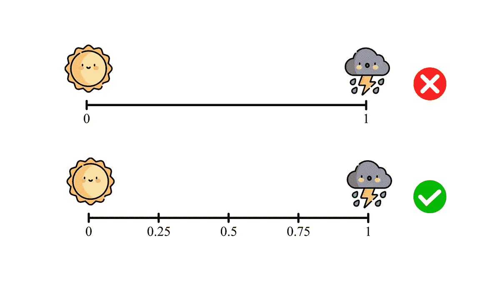

信念通常是介于两者之间的，而不是二元的。[孙](https://www.flaticon.com/free-icons/sun)、[雨](https://www.flaticon.com/free-icons/rain)、[删除](https://www.flaticon.com/premium-icon/delete_5610967)、[勾选](https://www.flaticon.com/premium-icon/check_5610944)图标由 Freepik hqrloveq 从 Flaticon 创建，经作者许可编辑。

如果有人问天气，在没有更好了解的情况下，我们会有一半的猜测。但是给定一份包含相关信息的天气预报报告，我们会偏向其中一个。

信息改变信仰。

信息是当前信念和事实之间的差异。[太阳](https://www.flaticon.com/free-icons/sun)和[雨](https://www.flaticon.com/free-icons/rain)图标由 Freepik 从 Flaticon 创建，经作者许可编辑。

虽然我们使用了天气预报报告作为类比，但我希望我没有描绘出关于信息需要如何成为报告、数字或一些条形图的错误画面。不一定非要这样。

信息是无形的。

正是这种抽象的“东西”可以以任何形状或形式表现出来——视觉、听觉、味觉，甚至嗅觉。重要的是，当消费时，它改变了我们的视角。

好像信息本身的概念还不够模糊，不幸的是，信念也可能是主观的。世界上有 70 亿人，每个人都有自己的经历、文化和价值观。当我们经历如此不同的世界时，不可避免地会发现截然不同的观点和信仰。你认为有价值的东西不会给别人。

想象一下看一本幼儿园的书。我怀疑我们会像一个 2 岁的孩子一样感到满足。

信息是个人的。

重点是—

信息是有意义知识的概念。它的存在取决于我们对世界的已知。如果它让我们离真相更近了一步，那么它就是信息。

> 信息改变信仰。
> 
> 信息是无形的。
> 
> 信息是个人的。

我们能不能把这样模糊的东西拿出来正式定义？

# 我们能量化信息吗？

答案是肯定的，而且看起来是这样的…

香农的信息量公式。

但是与其从表面上接受它并接受它定义了信息，不如理解*为什么*它有意义更有意义。

我建议我们从头开始推导公式。

之前，我们已经在信息和信念之间建立了联系。如果信念受到挑战时信息存在，那么我们知道信息需要被定义为信念的函数。

除此之外，重要的是要注意信息和信念不会一起增加。恰恰相反。当我们观察到我们认为不太可能的事件时，我们会感到惊讶，并质疑我们信念的正确性。因此，当我们错得最多的时候，我们收获最多。反之亦然。

我们的信念越符合事实，我们得到的信息就越少。[太阳](https://www.flaticon.com/free-icons/sun)和[雨](https://www.flaticon.com/free-icons/rain)图标由 Freepik 从 Flaticon 创建，经作者许可编辑。

如果我们必须用数学结构写下这种相反的关系，它会是这样的

信息是我们信念的函数，p(x)。

信息量与我们的信念相反。图片由作者提供。

从视觉上看，曲线符合我们所寻找的反向关系的描述。这是一个很好的开始，但是概率应该只在 0 到 1 之间。我们需要解决这个问题。

除此之外，还有两个小缺陷违反了我们试图建立的逻辑。问题在于 p(x) = 0 和 1 的两个极端，在这两个极端，直线变得越来越靠近轴，但从未真正接触过轴。

这说不通。

当一个事件的概率为 0 时，意味着它永远不会发生。如果它永远不会发生，那么我们将无法量化这些信息，也没有必要这样做。

另一方面，当事件的概率为 1 时，我们只是在观察一个已知的事实，因此应该没有新的信息需要学习。

*   当 p(x) = 0 时，信息应该是未定义的。
*   当 p(x) = 1 时，信息应该为零。

这需要对我们的公式稍加修改。应用对数有一些有趣的性质，可以帮助我们满足所有的标准。

信息是我们信念的对数的函数，p(x)。

添加一个日志可以改善曲线。[删除](https://www.flaticon.com/premium-icon/delete_5610967)和[勾选](https://www.flaticon.com/premium-icon/check_5610944)图标由 hqrloveq 从 Flaticon 创建，经作者许可编辑。

既然这两个极端是固定的，曲线是解释信息更合理的方式。从这里开始，我们可以用一点数学魔法重新排列我们的公式，它会给我们一个和克劳德·香农用来描述信息内容的公式完全一样的公式。

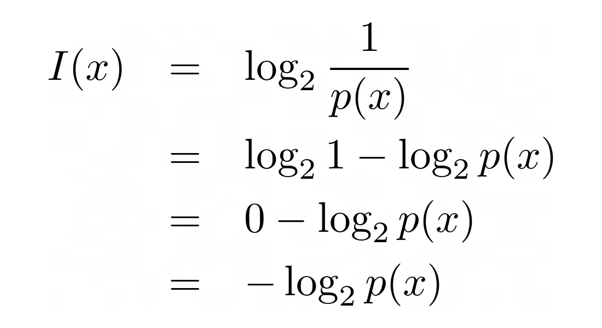

推导香农的信息量。

虽然这个公式起初看起来像是胡言乱语，但如果我们在窗帘后面窥视，香农信息量只是一种古怪的方式来表达信息的*量*是信念变化的幅度。

# 我们如何使用香农的信息内容？

有了一个公式，我们就有了一个量化的方法来跟踪系统中的已知和未知。它为我们提供了一个系统的方法来回答这三个问题:

*   有多少需要知道？
*   我们学到了多少？
*   我们还不知道多少？

为了证明这一点，我为我们准备了 8 个相同的宝箱。所有的箱子都是空的，除了一个，所以我们有 1/8 的机会打开正确的箱子。

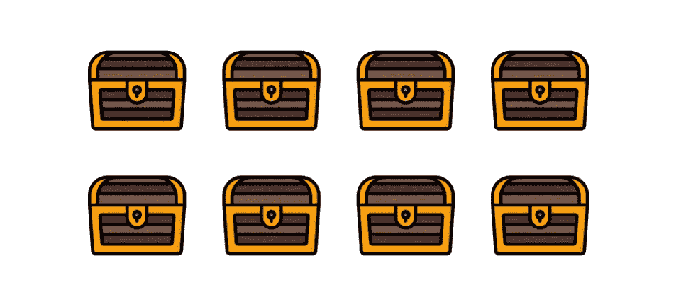

宝箱被打乱了，所以我们不知道哪一个有宝藏。[宝藏](https://www.flaticon.com/free-icon/treasure_1355958)图标由 Flaticon 的 Smashicons 创作，经作者许可编辑。

第一个问题是——我们需要多少信息才能百分之百确定地打开正确的箱子？一点点？很多吗？Claude Shannon 的《信息内容》( Information Content)没有玩弄这种模糊的确定性概念，而是认为我们恰恰需要 3 个单位的信息，或者如他所说的 **3 比特**。

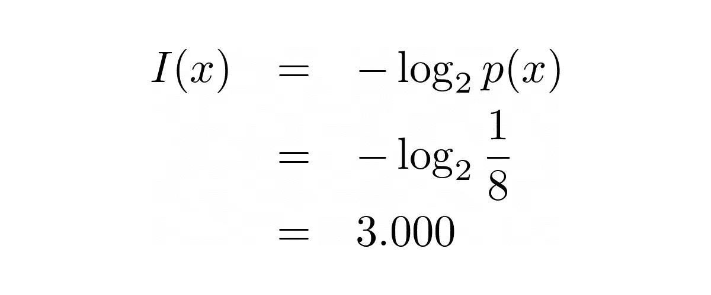

找到宝藏的概率是 1/8，因此我们需要 3 比特的信息。

香农声称……如果我们有 3 比特的信息，我们将知道整个系统的所有信息。让我们一个个打开箱子，观察一路上信息是如何获得的，验证这个说法的有效性。

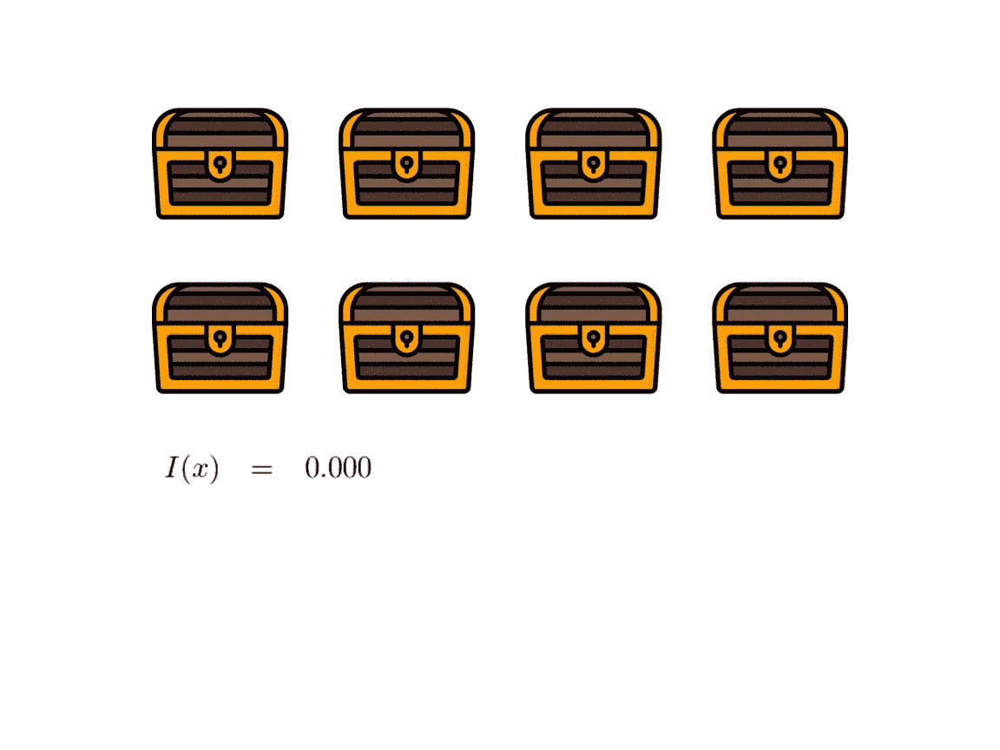

当我们打开箱子时，我们了解了更多关于这个系统的信息。宝藏([关闭](https://www.flaticon.com/free-icon/treasure_1355958)、[填充](https://www.flaticon.com/free-icon/treasure_1355982))、[删除](https://www.flaticon.com/premium-icon/delete_5610967)、[勾选](https://www.flaticon.com/premium-icon/check_5610944)图标由 Smashicons 和 hqrloveq 从 Flaticon 创建，经作者许可编辑。

打开第一个箱子发现里面是空的。有 7/8 的机会观察到这样的事件，所以我们已经了解了 0.193 比特的信息。对于我们打开的每一个空宝箱，找到另一个空宝箱的概率越来越低，因此，我们从每个宝箱中获得的信息量稳步增加。

随着我们获得的信息越来越多，这个系统剩余的不确定性就越来越少。在中间点，我们已经获得了 1 位信息，只剩下 2 位信息有待发现。通俗地说，就是我们比开始的时候更确定宝箱在哪里。这似乎很合适，因为只剩下 4 个箱子了。

在第六个箱子上，信息增益突然激增，因为我们设法找到了宝藏(有 1/3 的概率)。超过这一点，我们就不再得到任何信息，因为我们已经确定最后两个箱子是空的。

这里有一个有趣的观察。

当我们打开正确的箱子时，我们一口气学到了 1.585 比特的信息，使我们的累积信息达到 3 比特。这与系统中的 ***所有*** 的信息量相同。

直觉上，这是有道理的，因为如果我们知道唯一的宝箱在哪里，那么所有其他的选择都将无效。但是这些数字的增加仅仅是因为巧合吗？只是为了说服我们自己，让我们把宝藏藏在第五个箱子里。

观察。

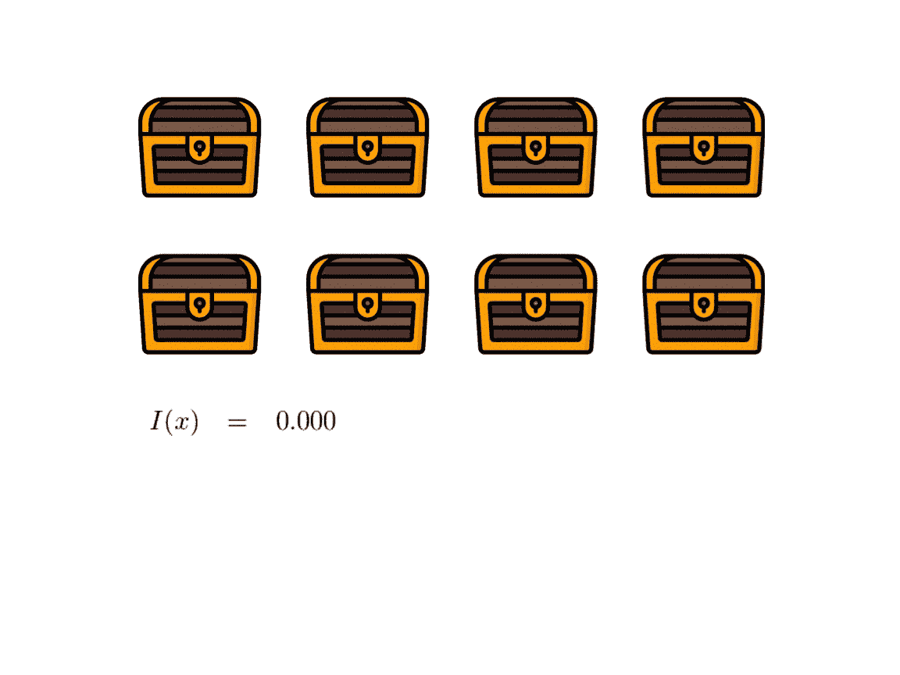

把宝藏放在第五个箱子里而不是第六个，仍然给了我们同样多的信息。宝藏([关闭](https://www.flaticon.com/free-icon/treasure_1355958)、[填充](https://www.flaticon.com/free-icon/treasure_1355982))、[删除](https://www.flaticon.com/premium-icon/delete_5610967)、[勾选](https://www.flaticon.com/premium-icon/check_5610944)图标由 Smashicons 和 hqrloveq 从 Flaticon 创建，经作者许可编辑。

无论我们把它放在哪里，它总是与总信息相匹配。这是支持这一说法的数学证明。

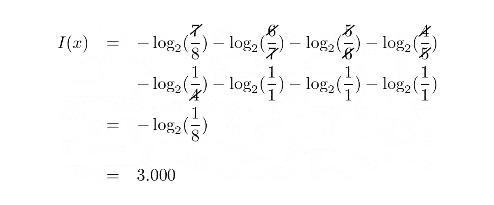

不管我们把宝藏放在哪里，信息内容总会加起来成为总信息。

希望这能让你相信香农信息量是一种在概率方法中客观量化不确定性顺序的明智方法。

但是有一个问题。

一个信息“单位”是一个模糊的量，可以是很多，也可以很少。这相当于说我需要一个“单位”的牛奶，可以说这比一“盒”或一“升”的牛奶更难以描述。

没有对其单位的解释，数字就只是一个数字。

# 一个单位的信息有多大用处？

Claude Shannon 建议我们用 1 比特来衡量将不确定性减半所需的信息量。

如果我们重新回到中间点，也许会更容易想象。

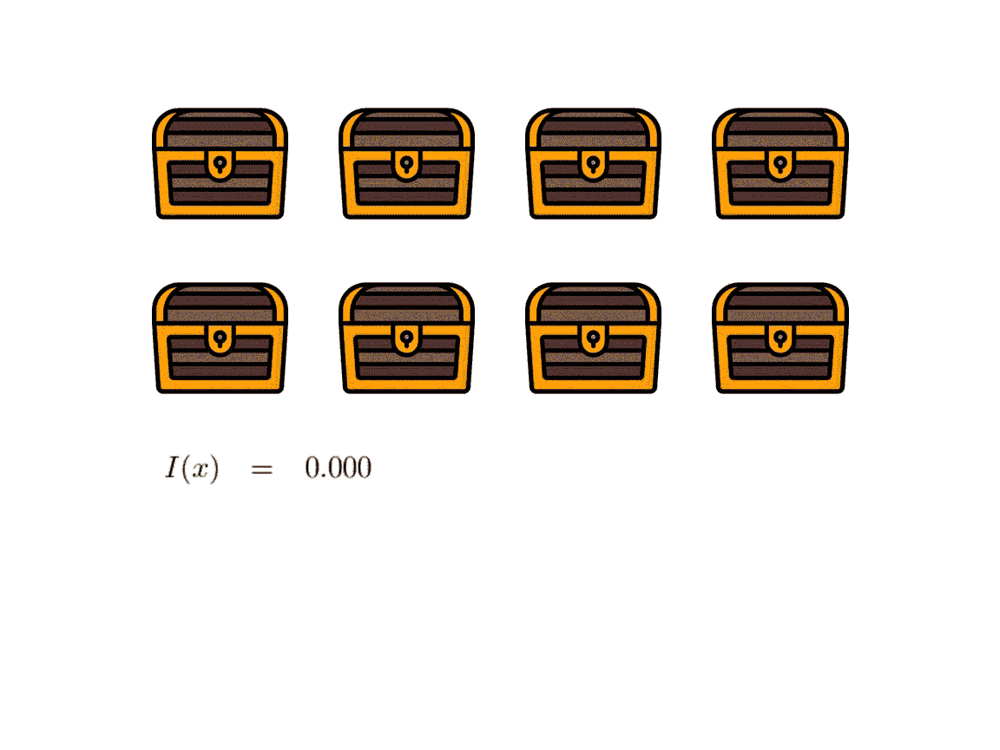

每一位信息都使不确定性减半。宝藏([关闭](https://www.flaticon.com/free-icon/treasure_1355958)、[填充](https://www.flaticon.com/free-icon/treasure_1355982)、[删除](https://www.flaticon.com/premium-icon/delete_5610967)图标由 Smashicons 和 hqrloveq 从 Flaticon 创作，经作者许可编辑。

请注意，当我们打开第四个箱子时，我们正好积累了 1 位信息。有了这一点信息，我们的概率空间减少了一半——从 8 个箱子减少到 4 个箱子。

再加一点，它会把我们的不确定性再减少一半，只剩下两个可能的箱子。正如您已经可以想象的那样，拥有 3 位将会简单地将其减少到一个单一的、明确的选择。这也证明了我们的系统总共只有 3 位信息。

另一种理解这个观点的方法是将一点信息与一个是或否的问题联系起来，这个问题排除了我们一半的选择。3 位信息意味着我们需要问 3 个问题来了解系统的一切。对于我们的例子，我们可以问…

*   问题 1:它在上面的箱子里吗？
*   问题 2:在右边吗？
*   问题 3:在左边吗？

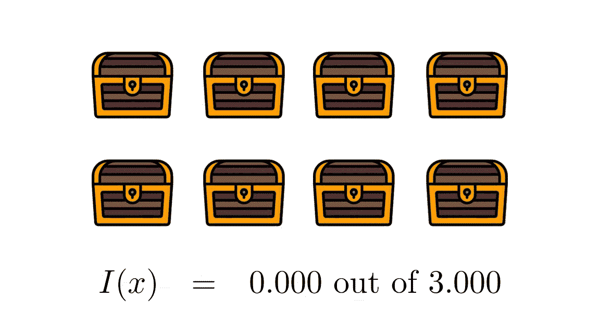

每一位信息都使不确定性减半。宝藏([关闭](https://www.flaticon.com/free-icon/treasure_1355958)、[填充](https://www.flaticon.com/free-icon/treasure_1355982))、[删除](https://www.flaticon.com/premium-icon/delete_5610967)、[勾选](https://www.flaticon.com/premium-icon/check_5610944)图标由 Smashicons 和 hqrloveq 从 Flaticon 创建，经作者许可编辑。

这个想法是双向的。如果我们正在处理的系统有 10 位信息，这意味着我们有 2 个⁰或 1024 次猜测。这种思路让我们对任何类型问题的可能性和不确定性有所了解。

我们不仅给“信息”一词赋予了意义，还给了它一个数字来阐述它的重要性，这完全改变了我们理解或处理信息的方式。

# 香农信息量的实际应用

Shannon 的信息内容远远超出了琐碎的猜谜游戏。它的主要贡献之一是在通信领域。

对于任何发生的交流，我们总是有一个来源，渠道和接收器。

*   讲话需要声音(源)通过空气(信道)传播，才能到达他人的耳朵(接收器)。
*   打电话需要电话(源)通过电话线(信道)将信号传输到另一部电话(接收器)。

在后一个例子中，我们还需要一个编码器将我们的声音转换成二进制 0 和 1 的数字流，以简化传输过程。在接收端，我们使用解码器将信号转换回语音。

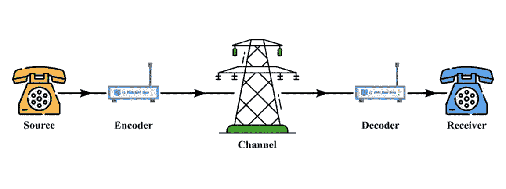

一个非常高效的通信系统。[Freepik 的电话](https://www.flaticon.com/free-icon/telephone_4321256?related_id=4321256&origin=search)、[编码器](https://www.flaticon.com/premium-icon/encoder_2249151)、[发射塔](https://www.flaticon.com/premium-icon/transmission-tower_4654178?term=transmission&page=2&position=32&page=2&position=32&related_id=4654178&origin=search)，Flaticon 的平面图标、Mehwish，经作者许可编辑。

从理论的角度来看，这种设置是可行的。但现实中，频道往往是嘈杂的。你的邻居把重金属音乐开到最大音量？噪音。传输过程中铜线上的磁干扰？噪音。总有噪音会降低我们的信息质量。我们可能听到的不是“十”，而是“锡”。我们发送的东西，不一定会被收到。

为了在不可靠的信道上实现可靠的通信，我们必须增加冗余来淹没噪声。例如，我们可以编程我们的编码器重复我们的信息三次，“十—十—十”。这样，即使消息最终在接收端“ten — tin — ten”被破坏，它仍然可以通过从多数中推断出“ten”来恢复原始消息。

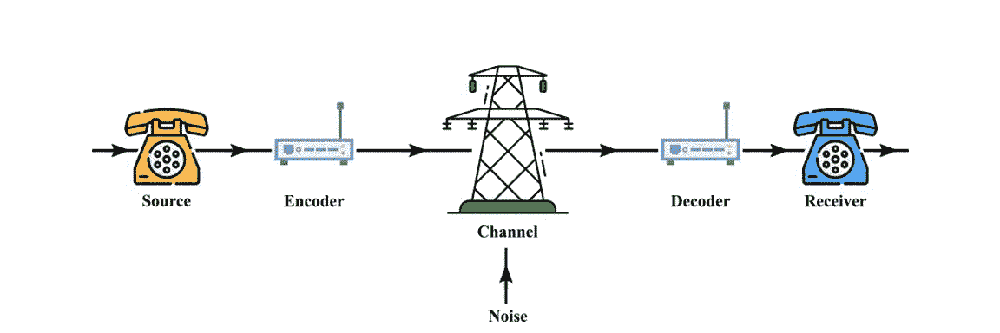

一种真实的通信系统，其中噪声翻转二进制位，从而使信息失真。[电话](https://www.flaticon.com/free-icon/telephone_4321256?related_id=4321256&origin=search)、[编码器](https://www.flaticon.com/premium-icon/encoder_2249151)、[发射塔](https://www.flaticon.com/premium-icon/transmission-tower_4654178?term=transmission&page=2&position=32&page=2&position=32&related_id=4654178&origin=search)由 Freepik、Flat Icons、Mehwish 来自 Flaticon，经作者许可编辑。

但是就像打地鼠一样，我们解决了一个问题，另一个又冒出来了。添加多余的信息来重新创建更短的原始消息会降低我们的传输速度。如果我们必须重复 3 次，这意味着我们的传输速度慢了 3 倍。

因此，在精度和传输速度之间进行权衡是必要的，但由于对于大多数应用来说精度优先，问题就变成了——我们需要牺牲多少速度？

利用一点概率论，我们可以[计算我们系统的错误概率](https://www.youtube.com/watch?v=rzg_CavQI_M)，并绘制它们与传输速率的关系。

权衡曲线。当我们增加冗余以降低错误率时，传输速率会下降。图片由作者提供。

通过相同的编码算法，但不同的冗余量循环，我们会得到一个很好的权衡曲线。但可悲的是，对于我们还没有发明的算法，我们将无法做到这一点。

如果没有权衡曲线，就很难决定我们是否应该使用不同的通道，或者我们应该更加努力地尝试一种更好的编码算法，以获得所需的错误率。没有明确的目标，射手注定会射不中。

克劳德·香农用他的量化信息的框架，能够计算出任何给定信道的最大传输速率，在该信道中会有任意低的错误率。换句话说，给定信道固有的噪声，假设我们有最有效的编码算法，信道传输我们的消息能有多好？

在他的噪声信道编码定理中，他将这个上限称为[信道容量](https://www.dip.ee.uct.ac.za/~nicolls/lectures/eee482f/04_chancap.pdf)(又名香农极限)。我希望这个公式能让你想起什么。

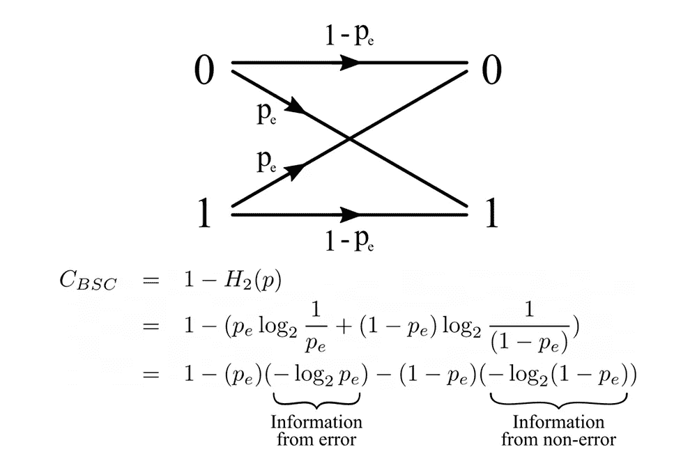

在二进制对称信道中，“0”和“1”具有 p(e)误差率，我们可以用它来计算信息量，或者确切地说是熵。图片由作者提供。

该公式读起来很直观——如果我们将信道的全部容量减去传输原始消息的信息所需的容量，最终可能是正确的比特或不正确的比特，那么剩下的一定是信道的过剩容量。这是信道能够达到的最佳传输速率。

虽然信道容量不能帮助我们设计最佳的编码算法，但它向世界展示了什么是可能的。对 [4 分钟一英里](https://hbr.org/2018/03/what-breaking-the-4-minute-mile-taught-us-about-the-limits-of-conventional-thinking)的回忆，一旦知道了理论极限，它就为我们交流方式的巨大进步铺平了道路。

# 结束语

这一应用只是冰山一角。香农的信息论引入了信息内容，有人称之为通信的基本粒子。物理对象有原子，而信息有比特。

它给世界提供了一种方式来进行任何形式的交流——从鸟儿的鸣叫，到绘画，再到莫尔斯电码——并对它们进行普遍的比较。

Shannon 的杰出工作彻底改变了我们处理信息的方式，成为数据压缩、密码学甚至数据科学中的一个关键概念，以及其他许多伟大的事物。

作为数据科学家，我们总是习惯于想要更多的数据或更多的“信息”。但我想克劳德·香农刚刚向我们展示了，虽然拥有信息很好，但理解信息会更有影响力。