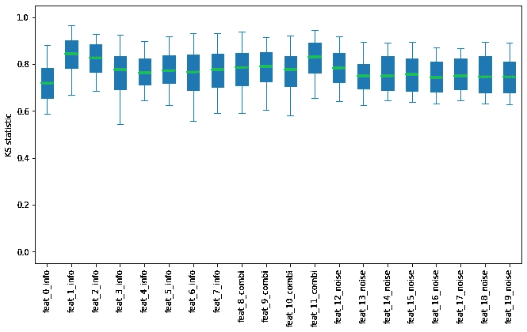
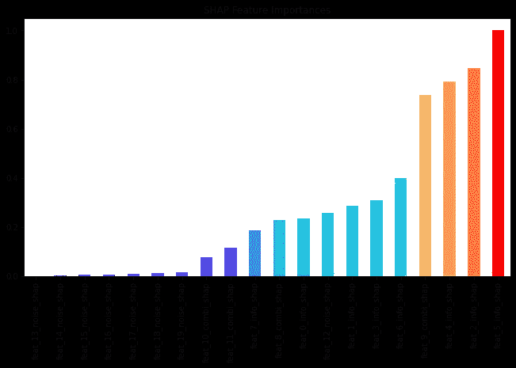
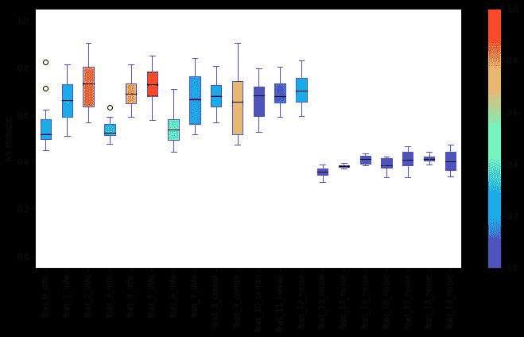

# 用于漂移检测的 SHAP:有效的数据偏移监控

> 原文：<https://towardsdatascience.com/shap-for-drift-detection-effective-data-shift-monitoring-c7fb9590adb0>

## 使用模型知识警告分布差异


约翰·安维克在 [Unsplash](https://unsplash.com?utm_source=medium&utm_medium=referral) 上的照片

**SHAP(SHapley Additive exPlanations)**是机器学习中一种众所周知的方法，用于提供可解释的结果。当然，无论预测任务是什么，向任何模型添加明确见解的能力是一个巨大的优势，这使得 SHAP 被广泛采用。将每个样本的每个值与相应的预测贡献进行映射的可能性使**适用于更高级的应用**。在这个意义上，我们已经证明了 [**SHAP 作为特征选择和超参数调整**](https://medium.com/towards-data-science/shap-for-feature-selection-and-hyperparameter-tuning-a330ec0ea104) 的有效方法的能力。

我们现在想测试的是**SHAP 能在多大程度上帮助发现数据转移？**对于在生产环境中发布的机器学习管道来说，数据转移可能是一场真正的噩梦。当我们的预测特征的分布以一种有意义的方式*与在训练阶段观察到的分布发生偏离时，它们就会发生。容易理解的是，无论我们的预测算法如何，与验证期间获得的结果相比，这提供了不一致的结果。*

*针对**数据偏移**，我们也无能为力。它们**在大多数涉及连续数据流的机器学习应用中是不可避免的，并且受到外部动态的影响**。我们可以反复检查数据摄取过程或预处理步骤的正确性，但是如果它们是正确的，问题仍然存在。我们绝对不能做的是放弃。我们可以引入一些非常聪明的技巧和技术来提醒传入的数据漂移，并采取适当的纠正措施。*

*首先，我们必须监控新输入数据的分布。将它们与训练中观察到的进行比较，我们可以验证我们是否存在有意义的转变。必须对所有感兴趣的特征进行这种操作，并持续检查。其次，当我们注意到数据漂移时，我们应该让我们的模型学习变化。这可以在本地支持[持续学习(也称为在线机器学习)](https://medium.com/towards-data-science/retrain-or-not-retrain-online-machine-learning-with-gradient-boosting-9ccb464415e7)的应用程序中轻松实现，或者简单地通过重新训练包括新数据的模型来实现。*

*所有的数据移位都相等吗？**不同的原因可能导致不同种类的漂移**。为了使事情变得更简单、更轻松，限制需要执行的检查的数量将是非常棒的。因此，只对有意义的预测实施控制可能是至关重要的。*

*在这篇文章中，我们利用 SHAP 的能力，作为一个模型不可知的解释框架，也用于漂移监测。**对 SHAP 值的分布进行控制，而不是原始值，我们可以只识别有效的偏移**。*

# *实验设置*

*我们在二元分类环境中操作，其中，给定一些特征，我们试图预测每个样本的所属类别。我们所掌握的所有特征都遵循高斯分布，但它们并不都是相等的。其中一些是*信息*的，因为它们直接有助于生成目标类。其他的*是冗余的*，因为它们是作为*信息*特征的随机线性组合产生的。最后，我们还有*噪声*特性，它们在我们的监督任务中不提供任何价值。*

**

*特征分布(图片由作者提供)*

*根据这些数据，建立一个*最优*漂移检测监控系统是可以理解的。*最佳*意味着我们应该只警告发生在信息特征上的变化(或者冗余特征也可以)。SHAP 非常适合这个目的。通过提供特性贡献的分布，我们可以直接在它们上面实现控制。*

# *结果*

*我们以依赖于时间的方式模拟不同幅度的漂移，并且针对我们所能支配的所有特征。换句话说，我们使用标准的交叉验证策略将数据分成时间片。在每个测试折叠中，我们根据基于真实特征分布建立的简单分位数阈值创建不同的数据块。最后，我们必须检查这些组块是否具有与训练集不同且有意义的分布。*

*为了从数学上证明分布漂移的存在，我们采用了对抗的方法。它包括建立一个分类器，该分类器被训练来辨别一些数据样本的来源。如果这种分类器能够实现很好的性能，则意味着数据源非常不同(测试数据不同于训练数据)。相反，这意味着没有明显的差异可以检测到。对抗的方法非常有用，可以在多维的背景下以一种非常容易解释的方式捕捉差异。作为良好的度量，我们选择双样本 Kolmogorov-Smirnov 检验。它适合于比较两个独立样本的分布。在我们的例子中，涉及的样本是属于特定数据源的预测概率。所有这些推理都可以简单地归结为以下几行代码:*

```
*def ks_drift_detection(X1,X2, n_splits=5, seed=33):

    import numpy as np
    import pandas as pd
    from scipy.stats import ks_2samp
    from sklearn.linear_model import LogisticRegression
    from sklearn.model_selection import StratifiedKFold

    assert isinstance(X1,pd.DataFrame)
    assert isinstance(X2,pd.DataFrame)

    CV = StratifiedKFold(n_splits, shuffle=True, random_state=seed)
    y = np.r_[np.ones((X1.shape[0],)),np.zeros((X2.shape[0],))]
    pred = np.zeros_like(y)
    X = pd.concat([X1, X2], ignore_index=True, axis=0)

    for i,(id_train,id_test) **in** enumerate(CV.split(X,y)):

        model = LogisticRegression(random_state=seed)
        model.fit(X.iloc[id_train], y[id_train])

        pred[id_test] = model.predict_proba(X.iloc[id_test])[:,1] 

    ks = ks_2samp(pred[(y == 0)], pred[(y == 1)])

    return round(ks.statistic, 4), round(ks.pvalue, 4)*
```

*专注于我们的实验，我们执行这个函数来测试块(我们在所有特征的每个时间分割中生成的)是否记录了漂移。我们开始对原始分布值执行这个测试。*

**

*Kolmogorov-Smirnov 统计为每个特征生成模拟数据漂移(图片由作者提供)*

*正如我们所想象的，我们记录了所有特征的一致变化。Kolmogorov-Smirnov 的高值意味着我们可以很容易地区分新的输入数据和在训练中观察到的数据。因此，我们可以记录数据漂移不一致，并采取相应的行动。*

*如果我们同样检查 SHAP 值分布，而不是原始分布，会发生什么？我们希望找到数据漂移的证据(如预期的那样)，但只是在相关的特征上。*

**

*SHAP 特色重要性(图片由作者提供)*

*我们知道 SHAP 在探测重要特征方面的有效性。通过绘制特征重要性，我们可以很容易地看到，噪声特征对生成预测的影响较小。对 SHAP 值分布的初步了解也有助于我们理解最重要的特征具有更宽的形状。*

**

*SHAP 值 vs 特征值(图片由作者提供)*

**

*SHAP 值 vs 特征值(图片由作者提供)*

**

*SHAP 值 vs 特征值(图片由作者提供)*

**

*SHAP 值 vs 特征值(图片由作者提供)*

**

*SHAP 值 vs 特征值(图片由作者提供)*

*最后，我们使用 SHAP 值重复检查以测试分布漂移的存在。根据相对特征贡献，相同的模拟偏移现在具有非常不同的影响。我们可以看到，信息功能(对 SHAP 最重要)产生了有意义的转变。相反，噪声特征不太容易生成警报，因为它们对模型输出的影响是不相关的。*

**

*基于 SHAP 值生成的 Kolmogorov-Smirnov 统计数据模拟了每个要素的数据漂移(图片由作者提供)*

# *摘要*

*在这篇文章中，我们使用了 SHAP 的能力来生成模型不可知的结果贡献，也作为一种检测有意义的数据漂移的方法。我们发现了监控 SHAP 分布变化以限制要执行的检查数量的优势。在这个意义上，我们也可以理解特征选择过程对帮助模型监控阶段的重要性。*

*[**查看我的 GITHUB 回购**](https://github.com/cerlymarco/MEDIUM_NoteBook)*

*保持联系: [Linkedin](https://www.linkedin.com/in/marco-cerliani-b0bba714b/)*