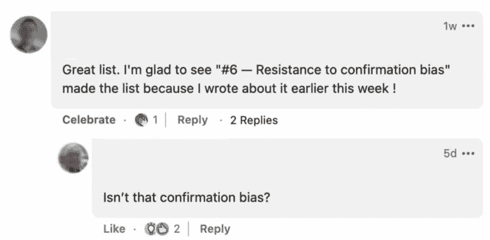

# 将你的思维从业余分析师转变为专业分析师

> 原文：<https://towardsdatascience.com/shifting-your-mindset-from-amateur-to-professional-analyst-61383f913408>

## 成为“真正的”数据分析师的旅程

在这个博客系列的开始，我开始向你证明[你已经是一名数据分析师](http://bit.ly/quaesita_mspaint)。是的，你！如果你正在读这篇文章，你此时此刻正在做分析。

由 [Alexander Sinn](https://unsplash.com/@swimstaralex?utm_source=medium&utm_medium=referral) 在 [Unsplash](https://unsplash.com/?utm_source=medium&utm_medium=referral) 上拍摄的照片

我觉得从那里开始很重要，不仅仅是因为鼓舞人心的信息— **你不需要许可就可以进行数据分析**，因为你已经在做了！—但也因为我相信**有太多的数据科学偏见**:我看到人们将神话般的常识应用于野外数据(例如，不相信 Instagram 上的每张照片都反映了现实)，然后一旦他们开始将同样的任务称为“数据分析”或“数据科学”,就将它扔出窗外。

但不管我们怎么称呼它，我们的许多日常任务都涉及到分析。我们都是数据分析师。这是不是意味着我们都同样擅长这个？

业余分析师和专业分析师之间有很大的区别。我们在[上一篇文章](http://bit.ly/quaesita_realanalyst)中详细介绍了前 3 个，现在我们将在这里继续我们的旅程。

## 专业数据与业余数据的区别# 4——了解职业

与业余分析师不同，专业分析师成为 ***分析师是出于选择*** ，而不是出于不幸。对他们来说，分析本身就是一门优秀的学科，而不是通往其他职业的敲门砖(比如[机器学习](http://bit.ly/mf-ml)或[统计学](http://bit.ly/quaesita_statistics))。

> 职业分析师是由选择 的 ***分析师，而不是由不幸。他们专注于达到自己职业的顶峰，而不是羡慕其他角色。***

他们确信，顶级分析师至少和顶级统计/人工智能专家一样擅长处理数据，如果不是更多的话。(如果你持怀疑态度，请阅读此文。)他们为自己是分析师而自豪，这种自豪是理所应当的。

> 太多的分析工作描述听起来好像工具是工作中最重要的部分。他们不是。

专业分析师明白，让你成为分析师的不是你的职位，也不是你使用的工具和技术。如今，就业市场无处不在，因此，如果我说的一些话与你不一致，我可能会用与你的雇主不同的方式来使用“分析师”这个词。你可以随意用你所谓的相同角色来代替，我不介意。

图片由作者制作，为我的[“数据科学到底是什么？”博文](http://bit.ly/quaesita_datascim)。

我在上图和[的一篇更长的博文](http://bit.ly/quaesita_datascim)中概述了不同的关注点，这篇博文解释了我使用术语“分析师”的意思，以及分析在各种数据科学学科中的位置。

> 工具不会让你变得专业。重要的是你如何对待他们。

每个数据科学学科都有助于使用相同的工具和公式，但他们使用它们的方式非常不同。你永远不会听到一位专家分析师声称，使用回归分析或 t 检验等统计方法意味着你在做统计。分析师、统计学家和人工智能专家使用同一个工具的方式有天壤之别。

专业分析师明白，让他们成为分析师的是他们在[探索和灵感](http://bit.ly/quaesita_hbrrish)方面的专业知识，他们也倾向于这一点。如果你想了解更多，我有很多关于分析职业的资源，包括:

*   [分析与数据科学——为什么一个是另一个的一部分](http://bit.ly/quaesita_datascim)
*   [分析与数据新闻——为什么分析不是讲故事](http://bit.ly/quaesita_hallows)
*   [分析与机器学习——为什么人工智能需要分析师的支持](http://bit.ly/quaesita_ytaiana)
*   [分析与统计——为什么统计学家和分析师是敌友](http://bit.ly/quaesita_battle)
*   [分析与决策——为什么分析师是王位继承人](http://bit.ly/quaesita_hero)

## 专业数据与业余数据的区别之五——拒绝成为数据骗子

失去我的职业尊严的最快方式是屈服于通过模仿分析和统计来快速赚钱的诱惑，而不理解它们的原因，从而污染每个人的声誉。如果你这样做，你比一个业余爱好者还不如。你是一个[数据骗子](http://bit.ly/quaesita_charlatan):兜售有毒的后见之明。

专业分析师*拒绝*成为[数据骗子](http://bit.ly/quaesita_charlatan)。

> 专业分析师拒绝兜售有毒的后见之明。

*   **分析师**给你[豁达](http://bit.ly/quaesita_inkblot)的灵感。
*   统计学家为你提供严格的测试。
*   江湖骗子为你提供扭曲的马后炮，假装是分析加统计。

数据骗子的第一个警告信号是无法理解[**分析和统计是非常不同的学科**](http://bit.ly/quaesita_battle) **。不管你的正式职位是什么，没有规定说你不能想学就学，只要你不把它们弄混。当专业分析师在这两方面都很熟练时，他们知道什么时候脱下分析师的帽子，戴上统计学家的头盔。当存在不确定性时:**

*   ***分析*** *是对好问题的追求。*
*   ***统计*** *是对好答案的追求。*

为了避免意外成为数据骗子，一次解决一个问题(阅读[这篇](http://bit.ly/quaesita_charlatan))。

## 专业数据与业余数据的差异# 6——抵抗确认偏差

> 确认偏差意味着我们都可以看到同一个数字，并对它有不同的理解。事实不再仅仅是事实。

****确认偏见是一个微妙的怪物:即使你接触到与你的观点不一致的信息，你也可能不会接受。你可能会记错。你可能会找到忽略它的理由。你将继续挖掘，直到你看到的数字是你想看到的。头脑就是那样滑稽。****

********

****保罗 J 对确认偏倚的说明，经允许使用。****

****换句话说，[确认偏差](http://bit.ly/quaesita_inspired)是数据驱动决策的死对头，因为它意味着一个事实不再仅仅是一个事实，无论你投入多少数学和科学去得到它。你和我可以看着同一个数字，而[会有不同的感知](http://bit.ly/quaesita_inkblot)。努力让自己接触更好的信息来源并不足以解决一个始于你眼前的问题。****

> *****许多人只是利用数据来让自己对已经做出的决定感觉更好。专业分析师对自己有更高的标准。*****

********

****每次我的追随者释放面无表情的 snark——这经常发生——我就能确认我显然在这个社区做了正确的事情。永远不要改变，我亲爱的！****

****我为所有读者写了一个克服确认偏见的通用指南，但是如果你渴望成为一名专业分析师，你需要绝地级别的确认偏见解药。从一般指南开始，然后有意识地练习，以磨练防止确认偏差的两个最佳技能: ***预先注册*** 和 ***面对*** [***脱发***](http://bit.ly/quaesita_inkblot) 时的豁达。****

## ******预先注册******

****消除确认偏差的一个方法是在查看数据之前设定你的决策标准。****

******问题:**没有预先注册，在你找到数据落地的地方后，你可以自由移动球门柱*。(当然你每次都进一球。你只是[那个](https://en.wikipedia.org/wiki/Overconfidence_effect)好。)*****

******解决方案:**提前设定球门柱，抵制诱惑，以后再移动它们。****

****养成理解寻求问题和寻求答案的[区别的习惯。当你寻找问题的时候，你可以自由处理你的数据而无需预先注册——但是你不允许使用你找到的任何东西作为证据*。另一方面，如果你在寻找答案或影响行动，承诺遵守预先设定的决策标准是强制性的。从技术上来说，这是决策者的工作，而不是分析师的工作，但在实践中，这通常会被委托，所以在你掌握这项技能之前，你不能称自己为专家分析师。*](http://bit.ly/quaesita_versus)****

*****点击了解更多关于如何做的[。](http://bit.ly/quaesita_inspired)*****

*****即使当你探索你的数据来寻找[寻求问题而不是答案](http://bit.ly/quaesita_versus)的时候，你仍然需要防止确认偏差的心理习惯，这让我们…*****

**********

*****蝙蝠？蝴蝶？或者只是一个墨迹？这是 1921 年创立的[罗夏测验](https://en.wikipedia.org/wiki/Rorschach_test)中十张卡片的第一张。来源:[维基百科](https://en.wikipedia.org/wiki/Rorschach_test#/media/File:Rorschach_blot_01.jpg)。*****

## *******思想开放*******

*****当你保持一个开放的心态并且不严格地持有你的观点时，确认偏见就很难生根。在这种情况下，专业分析师就是杰迪。*****

*****虽然业余爱好者以从他们的数据中挖掘出一个强有力和令人信服的故事而自豪，但专业分析师对此太精明了。他们知道复杂的数据集本质上是罗夏测验——它们是阿波芬尼亚症的滋生地:对数据集进行分割的方式越多，他们实际上就越希望你从中找到错误的意义。这就是为什么专家分析师已经教会自己保持令人印象深刻的知识谦逊、锐利的怀疑和强烈的好奇心。他们太擅长自己的工作了，不会轻易下结论。*****

> *****复杂的数据集实际上是在乞求你在其中找到错误的意义。*****

*****专家分析师永远不会试图向你推销一个通过拷问数据发现的故事，直到它坦白为止。相反，在谈论他们的发现时，他们使用模糊/软化的语言，他们有纪律为每件事提出多种解释。如果你怀疑某人是分析绝地，试试这个技巧:让他们为你解释一些数据/图表。他们产生多种解释的速度越快，产生的替代方案越多，他们的力量就越大。如果他们只停留在一个解释上，他们仍然处于业余幼虫阶段。*****

*****为了提升你的绝地技能，请到[这里](http://bit.ly/quaesita_inkblot)阅读我的《阿波菲斯尼亚分析》的长篇指南。*****

**********

*****如果分析是你的激情，拥抱它。达到你选择的职业的高度，不要听任何人告诉你换一个不同的职业。照片由[亚历山德罗·埃尔贝塔](https://unsplash.com/@alessandroerbetta?utm_source=medium&utm_medium=referral)在 [Unsplash](https://unsplash.com?utm_source=medium&utm_medium=referral) 拍摄*****

*****本文到此为止。在下一期[中，我们将继续探讨业余分析师和专业分析师之间的差异:](http://bit.ly/quaesita_realisticanalyst)*****

*******专业数据与业余数据的差异# 7——对数据的现实预期
专业数据与业余数据的差异# 8——知道如何增加价值
专业数据与业余数据的差异# 9——对时间的不同思考
专业数据与业余数据的差异# 10——细致入微的卓越观*******

*****让我知道你是否喜欢这个话题，不要忘记与你的社区分享你最喜欢的见解！*****

# *****本系列的前几篇文章*****

*****    

# 本系列的下一篇文章

  

*附言:你有没有试过在 Medium 上不止一次点击这里的鼓掌按钮，看看会发生什么？* ❤️

# 喜欢作者？与凯西·科兹尔科夫联系

让我们做朋友吧！你可以在 [Twitter](https://twitter.com/quaesita) 、 [YouTube](https://www.youtube.com/channel/UCbOX--VOebPe-MMRkatFRxw) 、 [Substack](http://decision.substack.com) 和 [LinkedIn](https://www.linkedin.com/in/kozyrkov/) 上找到我。有兴趣让我在你的活动上发言吗？使用[表格](http://bit.ly/makecassietalk)联系。*****