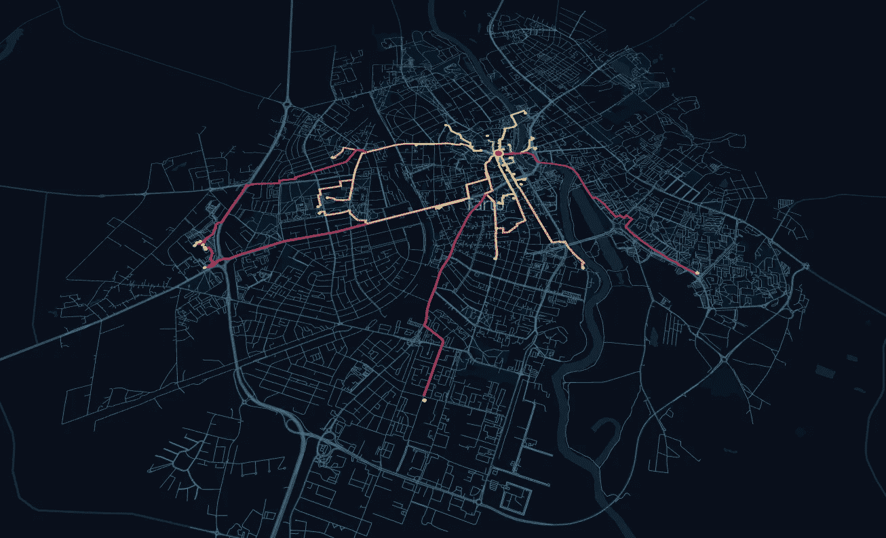
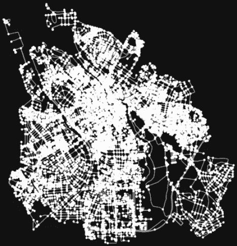
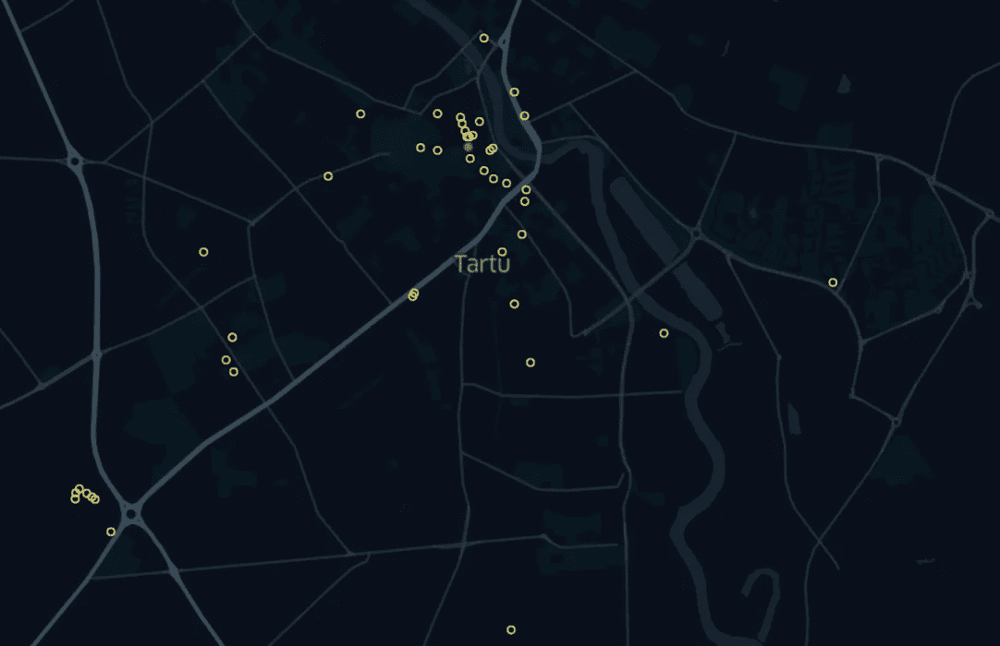
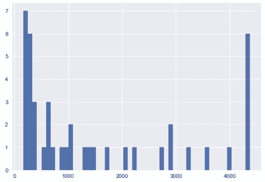
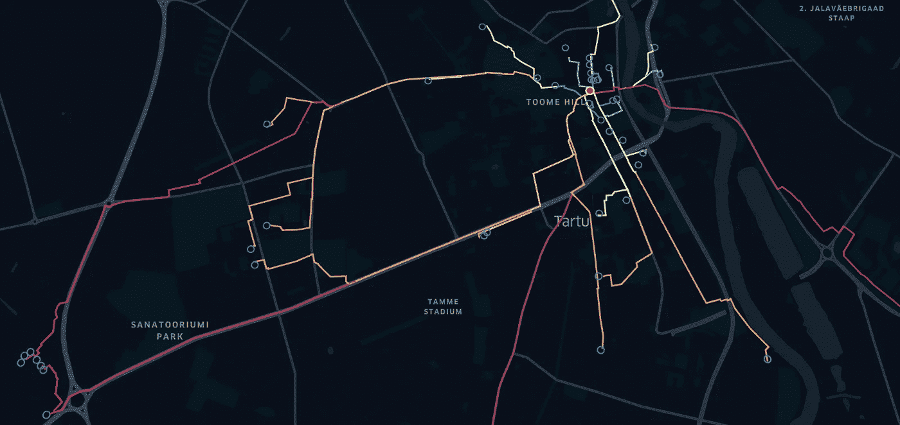
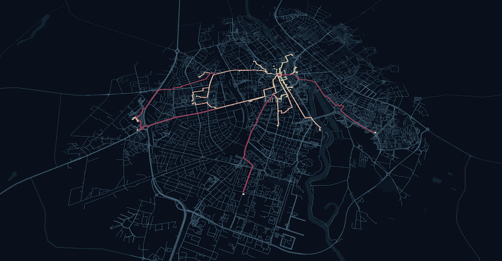

# 基于 OSM 步行网络的最短路径算法

> 原文：<https://towardsdatascience.com/shortest-path-algorithm-with-osm-walking-network-6d2863ae96be>

# 基于 OSM 步行网络的最短路径算法

## 利用爱沙尼亚塔尔图的 OSM 数据寻找最短步行路径


图片由作者提供。OSM 网络行走路线数据。从亲吻学生到塔尔图市的咖啡馆。

我终于回到了爱沙尼亚的文化之都塔尔图。美好思想之城神奇而辉煌。到处都是咖啡馆、酒吧、餐厅、文化活动和绿地。塔尔图为国际学生提供了一个舒适的城市校园，充满活力的氛围，我最喜欢的是，你可以步行到达大多数地方。令人惊讶的是，通过使用城市自行车、螺栓踏板车或仅仅通过步行，在城市中的移动是如此顺畅。

这个城市有很多地方可以参观，我决定用 OSM 步行网络来量化它。在这个故事中，我将解释如何在塔尔图的 OSM 步行网络中使用最短路径算法。主要的想法是量化从主要聚会点 ***、接吻的学生*** 到从 OSM 数据中提取的所有咖啡馆的距离。

看看这个故事的结局。

*   [**最终网络地图**](https://bryanvallejo16.github.io/shortest-walking-path-tartu/)
*   [**仓库代码**](https://github.com/bryanvallejo16/shortest-walking-path-tartu)



图片由作者提供。带有 OSM 步行网络和最短路径的最终地图

# 最短路径算法代码

要应用最短路径算法，你需要起点和终点。这些功能已经实现自动化，并在[地理空间分析](https://medium.com/geospatial-analytics)中发布。查看下面的文章，我是从哪里获取这些函数的。它们可用于 OSM 网络类型，如驾驶、自行车和步行。

[](https://medium.com/geospatial-analytics/shortest-path-algorithm-used-in-osm-street-network-33e0f864f34b) [## 最短路径算法在 OSM 街道网中的应用

### 针对汽车、自行车和行人的最短路径分析的 GIS 自动化提示

medium.com/geospatial-analytics](https://medium.com/geospatial-analytics/shortest-path-algorithm-used-in-osm-street-network-33e0f864f34b) 

最短路径算法在由 Geoff Boeing 开发的 python 库 OSMnx 中实现，它获取开放的街道地图数据。

# OSM 数据许可证

*   **打开街道地图数据。**根据[开放数据共享开放数据库许可证(ODbl)](https://opendatacommons.org/licenses/odbl/) 或归属许可证获得许可。用户可以自由复制、分发、传输和改编这些数据，只要这些数据属于作者，就像 [OpenStreetMap](https://www.openstreetmap.org/copyright) 的贡献者一样。

关于从 OSM 获取数据的回顾可以在下一篇文章中回顾:

[](https://medium.com/geekculture/fetching-green-areas-from-osm-data-a6ff835c40dc) [## 从 OSM 数据中提取绿色区域

### 如何使用 OSMnx 以几何图形的形式检索公园

medium.com](https://medium.com/geekculture/fetching-green-areas-from-osm-data-a6ff835c40dc) 

# 编码实践

我们开始吧。

```
**import** pandas **as** pd
**import** geopandas **as** gpd
**from** shapely.geometry **import** LineString, Point
**import** osmnx **as** ox
**import** networkx **as** nx
**import** matplotlib.pyplot **as** plt
```

所有步行路线的起点将是接吻学生纪念碑。

```
**# creating the origin from Kissing Students** origin = gpd.GeoDataFrame(columns = [‘name’, ‘geometry’], crs = 4326, geometry = ‘geometry’)
origin.at[0, ‘geometry’] = Point(26.722181, 58.380073)
origin.at[0, ‘name’] = ‘Kissing students’
```


图片由作者提供。亲吻学生纪念碑。

现在，我们要去塔尔图城所有的咖啡馆。我们将使用这些位置作为最短路径分析的目的地。

```
**# fetching cafes as the destinations from OSM****# Specify the name that is used to seach for the data** place_name = ‘Tartu, Tartu linn, Tartu maakond, Estonia’**# Fetch OSM street network from the location** graph = ox.graph_from_place(place_name)**# Get place boundary related to the place name as a geodataframe** area = ox.geocode_to_gdf(place_name)**# Plot the streets** fig, ax = ox.plot_graph(graph)
```



图片由作者提供。塔尔图的 OSM 图。

从 Tartu 区域获取数据。

```
**# List key-value pairs for tags** tags = {'amenity': 'cafe'}**# Get the data** cafes = ox.geometries_from_place(place_name, tags)cafes = cafes[['name', 'geometry']]
cafes = cafes.reset_index(drop=True)**# getting centroids from polygons to avoid polygon geometric objects** cafes['geometry'] = [geom.centroid for geom in cafes['geometry']]
```



图片由作者提供。根据 OSM 的数据，塔尔图市有 43 家咖啡馆

这里我定义了在有起点和终点的步行网络中应用最短路径的函数。该函数是从 [***条最短路径算法得到的，用于 OSM 街道网络***](https://medium.com/geospatial-analytics/shortest-path-algorithm-used-in-osm-street-network-33e0f864f34b) ***。*** 做查看 Github repo 这个故事的查看功能。该分析直接返回 UTM 投影中的路线。

```
def **shortest_path**(origin, destination, network = ‘drive’):
 ‘’’
**origin and destination <GeoDataFrame> crs 4326, network <str> drive, bike, walk
RETURN shortest path <GeoDataFrame>**
 ‘’’

 **# creating a frame for fetching OSM data**
 combined = origin.append(destination)

 convex = combined.unary_union.convex_hull

 graph_extent = convex.buffer(0.02)

 **# fetching graph**
 graph = ox.graph_from_polygon(graph_extent, network_type= network)

 **# Reproject the graph**
 graph_proj = ox.project_graph(graph)

 **# Get the edges as GeoDataFrame**
 edges = ox.graph_to_gdfs(graph_proj, nodes=False)

 **# Get CRS info UTM**
 CRS = edges.crs

 **# Reproject all data**
 origin_proj = origin.to_crs(crs=CRS)
 destination_proj = destination.to_crs(crs=CRS)

 **# routes of shortest path**
 routes = gpd.GeoDataFrame()

 **# Get nodes from the graph**
 nodes = ox.graph_to_gdfs(graph_proj, edges=False)

 **# Iterate over origins and destinations**
 for oidx, orig in origin_proj.iterrows():

   **# Find closest node from the graph → point = (latitude, longitude)**
   closest_origin_node = ox.get_nearest_node(G=graph_proj, point=(orig.geometry.y, orig.geometry.x), method=’euclidean’)

 **# Iterate over targets**    for tidx, target in destination_proj.iterrows():
      **# Find closest node from the graph → point = (latitude, longitude)**
      closest_target_node = ox.get_nearest_node(graph_proj, point=(target.geometry.y, target.geometry.x), method=’euclidean’)      **# Check if origin and target nodes are the same → if they are → skip**
      if closest_origin_node == closest_target_node:
          print(“Same origin and destination node. Skipping ..”)
          continue

 **# Find the shortest path between the points**       route = nx.shortest_path(graph_proj, 
 source=closest_origin_node, 
 target=closest_target_node, weight=’length’)

 **# Extract the nodes of the route**       route_nodes = nodes.loc[route]

 **# Create a LineString out of the route**       path = LineString(list(route_nodes.geometry.values))

 **# Append the result into the GeoDataFrame**       routes = routes.append([[path]], ignore_index=True) **# Add a column name** routes.columns = [‘geometry’]

 **# Set coordinate reference system** routes.crs = nodes.crs **# Set geometry** routes = routes.set_geometry(‘geometry’)

 **return** routes
```

然后，我们就应用它。

```
routes = shortest_path(origin, cafes, network = 'walk')
```

这将返回一个包含 43 条路线的地理数据框架，我们可以在其中计算距离。

```
routes['distance'] = routes['geometry'].length
```

在一张柱状图中，我们可以观察到咖啡馆是如何集中在行走的前 1.000m。大约 20 分钟的路程？它有一些例外，有些咖啡馆离得很远，也可以在地图上看到。



图片由作者提供。从接吻的学生到咖啡馆的步行距离直方图

下一张地图显示了距离的强度。红色是最长的步行路线。



图片由作者提供。从接吻的学生到咖啡馆的步行路线按距离分类

如果你想回顾行走的网络。请检查一下这个故事的笔记本，看看它是如何被提取的。下一张地图显示了提取的步行网络的广度。



图片由作者提供。围绕使用的起点和终点的步行网络。

# 结论

塔尔图是一座步行的城市。如果你在市中心附近，在最近的 500 米到 1000 米范围内，你会有很多咖啡馆可供选择。因此，在接下来的 5 分钟、10 分钟、20 分钟内，你会看到坐下来喝杯咖啡的选项。上面的直方图可以从接吻的学生开始给出一个快速概览。python 库 OSMnx 在分析咖啡馆等服务的可访问性时很有用。可达性可以通过步行、驾车或骑自行车的距离来衡量。如果在 OSM 数据中没有找到所有服务，或者如果您希望不仅通过距离而且通过时间来分析可达性，则会发现局限性。