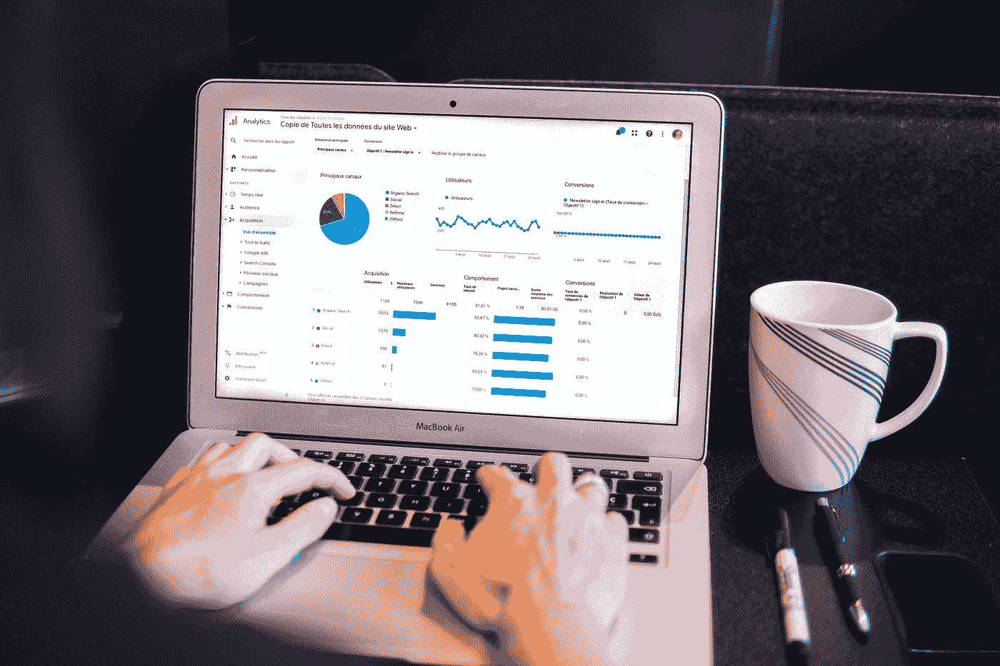

# 展示求职面试的 GitHub 简介

> 原文：<https://towardsdatascience.com/showcase-github-profile-for-job-interviews-b42d978a8a06>

## 使用 Datapane 和 GitHub API


[Adeolu Eletu](https://unsplash.com/@adeolueletu?utm_source=medium&utm_medium=referral) 在 [Unsplash](https://unsplash.com?utm_source=medium&utm_medium=referral) 拍摄的照片

GitHub 绝对是协作编码和软件共享使用最多的平台。因此，它是候选人展示其项目和公司筛选潜在雇员的宝贵资源。

无论您是申请人还是雇主，查询 GitHub 个人资料的信息都非常耗时，并且会带来一些挑战。你需要搜索用户的数据，检查存储库，探索活动和语言等。😬 😒此外，通过一个漂亮的仪表板来总结概要文件的内容需要使用拖放工具，如 *Power BI* 或 *Tableau* ，这需要相当大的努力。😰 😵更不用说为多个招聘信息或候选人重复这一点的丑陋感觉了。😫🤕

幸运的是，一些优秀的 API 能够以可定制和可复制的方式实现这一点。在这篇文章中，我们将使用[***data pane***](https://datapane.com/)和[***PyGithub***](https://pygithub.readthedocs.io/en/latest/introduction.html)构建一个仪表板来展示 GitHub 账户的主要特性。


罗曼·辛克维奇·🇺🇦在 [Unsplash](https://unsplash.com?utm_source=medium&utm_medium=referral) 上拍摄的照片

# 设置

设置非常简单。只需克隆这个 [***仓库***](https://github.com/clissa/github-user-dashboard) 并安装`requirements.txt`文件中列出的 3 个依赖项。

```
$git clone [git@github.com](mailto:git@github.com):clissa/github-user-dashboard.git
$cd github-user-dashboard
$conda create --name datapane python=3.9.6
$conda activate datapane
$conda install -c conda-forge --file requirements.txt
```

# 使用 GitHub API 提取配置文件数据

首先，让我们获得一些关于用户活动、其存储库和语言的数据。

## 连接到 GitHub API

> 为了方便起见，我将使用我的 GitHub 帐户作为例子，但是您可以很容易地修改代码以供自己使用。

尽管对于我们的分析来说不是绝对必要的，但是我们通过一个令牌连接到 GitHub API 来访问公共和私有信息。为此，您可以在这里获得一个令牌[并将其作为`GITHUB_API_TOKEN`环境变量存储在一个`.env`文件中。剩下的工作由`dotenv`包来完成！](https://github.com/settings/tokens)

通过访问令牌连接到 GitHub API。作者要点

## 检索用户数据

这项任务取决于我们希望在仪表板中显示什么样的信息。我选择了与*数量的存储库*和*提交*，根据*获得的明星*和*追随者*，采用的编程*语言*，以及最*重要的存储库*(协作项目和最多明星)相关的统计数据。

> 当然，可能性是无穷无尽的！！请随意修改以下脚本以满足您的需求！

从 GitHub API 中检索用户数据。作者要点



米利安·耶西耶在 [Unsplash](https://unsplash.com?utm_source=medium&utm_medium=referral) 上拍摄的照片

# 数据面板仪表板

*Datapane* 是一个开源的报告 API，使**能够构建交互式报告**，**在其平台上托管**，甚至**嵌入第三方网站**。所有这一切完全通过编程来保证快速**再现性和自动化**。

我们的想法是将我们的仪表板分为 3 个选项卡:

*   *突出显示*:显示一些关于用户的统计数据和信息
*   *语言*:概述关于所采用的编程语言的见解
*   *存储库*:展示用户对协作项目的贡献，总结最流行的存储库

## 结构块

为了做到这一点，我们可以使用 Datapane 的`Page()`类来构建每个选项卡。`blocks`参数收集显示在选项卡内的所有内容，而`title`决定选项卡的标题。

样本数据面板页面。作者要点

在每个选项卡内，可以通过`Group()`类设置页面结构。例如，我们可以嵌套几个这样的对象，以便在页面中清晰地表达我们的部分。我们使用`block`参数来列出组件，使用`columns`来指定结构，然后从结构中推断出每个元素的位置(默认情况下，内容按行填充)。

样本数据面板组。作者要点

另一个有用的构建块是`Select()`类，它充当嵌套内容的容器。除了通常的`block`参数外，`type`属性允许插入下拉菜单(`SelectType.DROPDOWN`)或标签(`SelectType.TABS`)。

样本数据面板选择。作者要点

## 内容块

Datapane 的伟大之处在于它为您可能想要插入到报告中的所有类型的内容提供了本地类，包括文本、图表、表格、各种媒体类型的嵌入、附件等等！

`Text()`类允许以纯文本或降价的形式插入文本内容，并自动检测编码和相应显示。对于`HTML()`、`Code()`和`Formula()`类，也可提供替代格式。

关于数据 vizs，`Plot()`类支持使用静态和交互式图表，与最流行的绘图框架无缝交互，如 *Altair、Plotly、Bokeh、Matplotlib 和 Seaborn。*

最常用的编程语言。作者图片

最后，Datapane 允许在报告中插入整个数据表。为此，您只需使用`Data()`(静态)或`DataTable()`(交互式)类并传递一个 pandas 数据帧。

用户存储库数据。作者列表

## 创建报告并上传

一旦我们拥有了仪表板的所有构件，那么我们只需要将它们放在一起创建一个报告。为此，我们只需要实例化一个`Report()`对象，并传递我们设计的所有块。

最后，我们可以在本地将我们的报告保存为一个 *html* 文件和/或直接免费上传到 Datapane！✨ 👏 ✌️

报告保存和上传。作者要点


在 [Unsplash](https://unsplash.com?utm_source=medium&utm_medium=referral) 上的[窗口](https://unsplash.com/@windows?utm_source=medium&utm_medium=referral)处拍照

> 那么，你准备好看我们 GitHub 用户仪表板的最终版本了吗？

可能最令人兴奋的 Datapane 特性是你可以在任何地方共享你的公共报告，甚至可以将整个仪表板作为交互元素嵌入到 Medium 中！这是结果📊 📈 😎

仪表板预览。作者图片

## 最后的想法

干得好，伙计们！我们刚刚创建了一个 GitHub 用户仪表板，用于在工作面试中展示我们的项目或总结潜在候选人的活动。

此外， **Datapane** 确保一切都易于定制和再现，使过程可扩展到多个应用或候选人！😃 😍 🍾 🙌 🎉

如果你想了解更多关于 Datapane 和 GitHub API 的知识，这里有一些有用的阅读资料:

1.  【https://blog.datapane.com/ 号
2.  [https://www . techgeekbuzz . com/how-to-use-github-API-in-python/](https://www.techgeekbuzz.com/how-to-use-github-api-in-python/)
3.  [https://martinheinz.dev/blog/25](https://martinheinz.dev/blog/25)

> 对于这篇文章来说，这就是全部。现在我真的很好奇你能拿出什么样的报告。欢迎在评论中给我你的数据面板的链接！