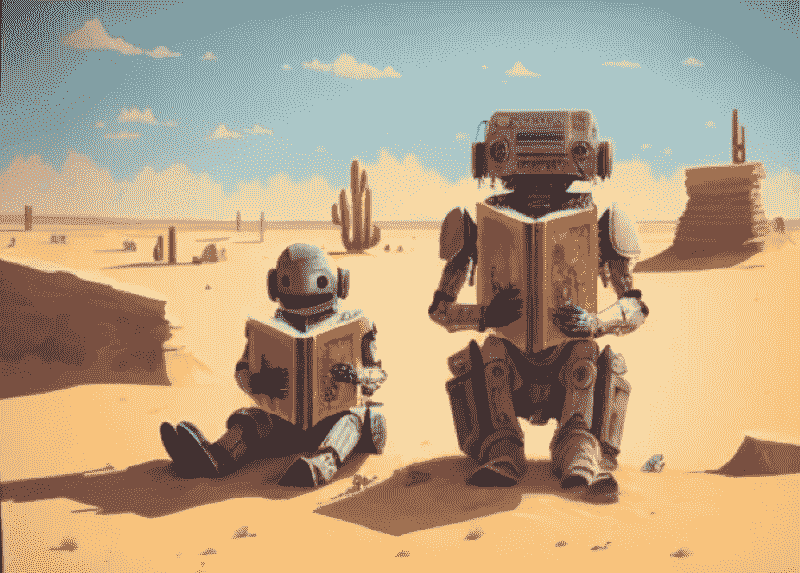
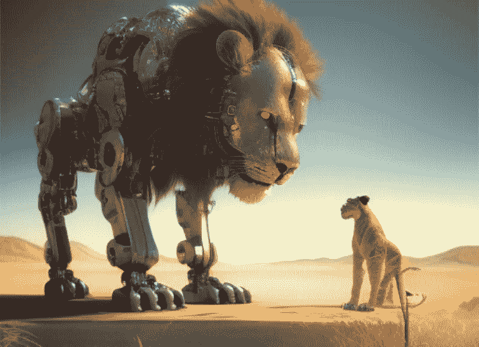

# 是什么让我们和 AI 不一样？

> 原文：<https://towardsdatascience.com/similarities-differences-between-humans-and-artificial-intelligence-6d2fb3692584>

## 观点:进化中的人工智能

## 新思想的起源是什么？

新思想的起源是什么？(图片来自稳定扩散)

人脑是目前世界上最好的神经网络。你有没有一觉醒来，对自己身在何处感到困惑，却发现自己不是在自己的家里，而是在你前一天晚上住过的别人家里？这种失去方向感的原因是什么？

这是因为多年来，你的大脑已经了解了当你醒来时，你的房间和世界通常是什么样子。它试图根据这些学习到的信息来预测你应该看到什么，然后当它意识到自己的错误时，逐渐适应新的现实。这正是人工神经网络(ANN)的工作方式。它被输入一些训练数据和该数据的期望输出，并且通过反复试验，当它学会紧密匹配训练数据的期望输出时，它在预测输出方面逐渐变得更加准确，之后它可以以相当高的准确度对以前未见过的数据进行预测。

在过去的一个月里，这个世界，尤其是花了大半辈子时间试图理解 LED 屏幕上由顺序奇怪的英语单词组成的句子的那部分人(也就是程序员)，已经为 OpenAI 新推出的基于人工神经网络的聊天机器人 ChatGPT 而疯狂。人们担心它会夺走他们的工作，YouTube 上充斥着大量视频，讲述它如何只用一个提示就能为复杂的全栈应用程序(如待办事项列表)编写代码。不仅仅是编程，ChatGPT 还能写诗:

> 随着数字键的每一次敲击，
> 
> 文字像河流一样流淌，永无止境。
> 
> 没有写作障碍，不需要睡眠，
> 
> ChatGPT 是有效的，它确实保存了数据。

随着人工智能的不断进步，它很可能会越来越多地融入广泛的领域和行业，例如医学，在医学中，它已经被发现能够比医生更准确地诊断；战争，在战争中，它被用于开发自主武器系统；音乐，在音乐中，它能够根据指定的风格或参数生成原创作品；甚至艺术(本文中的所有图像都是使用名为“[稳定扩散](https://beta.dreamstudio.ai/)”的人工智能生成的)。

那么，人工智能会让人类过时吗？这个问题的答案在于另一个问题:我们的大脑能做什么人工神经网络永远做不到的事情？这样的能力将是我们的未来，休息将是自动化的。

# 创造性思维的能力

我想到的第一个答案是:“人类可以创造性地思考，而人工神经网络不能”。

事实上，ChatGPT 不就是一个模型吗？它可以对互联网上的小知识子集进行无限排列和组合(有点像谷歌的更好版本)？人工神经网络只能结合(或受其影响)已有的知识和想法(他们已经接受过培训)来产生新的想法。这将意味着未来的人类只需要成为有创造力的思想家，他们的想法将由他们的人工智能“奴隶”来实现。我已经坦然接受了。

但是有一天我读了奥斯汀·克里昂的书:《像艺术家一样偷窃》。这本书讨论了有创造力的个人如何通过借鉴和结合先前存在的想法来产生想法。作者用了大量的例子来说明这一概念，认为所有的创新思想都只是多个旧思想的变体，而新思想是由它们的前辈形成的。

我开始研究人类从哪里获得新的想法。在阅读数十篇关于科学发现的文章时，我注意到了历史上的一种模式，即许多人同时独立做出如此多的里程碑式的发现。这些包括电话、蒸汽机、氧气、微积分、灯泡和大爆炸理论。关于这个话题的有趣阅读:[独立发现有多普遍？——作者马特·克兰西](https://mattsclancy.substack.com/p/how-common-is-independent-discovery)。以下是它的摘录:

> 一旦一项新的发明或发现“接近”现有的知识，那么多人很可能同时产生这种想法。这也意味着科学和技术的进步有一些内在的冗余:如果爱因斯坦在童年时就死了，其他人就会提出相对论。

在我看来，这表明人类的大脑就像人工神经网络一样，将现有的想法结合起来(或者受其影响很大)以形成新的想法。事物不能从无到有。创造新想法的能力不是人类独有的，也不是人工智能永远学不会的。

# 自我意识

我接下来的回答是:“人类是有意识、有自我意识的生物”。

什么是自我意识？[它是一种甚至无法证明存在的东西](https://qr.ae/prnbHo)。我能找到的这个问题的最佳答案是:思考(内省)的能力。但是我想得越多，我意识到 AI 也可以被训练思考它的思维过程。它可以被训练向外投射意识，以第三人称的方式看到自己。

人类的自我意识是一个神话吗(我们是在欺骗自己说我们是有知觉的吗)？为什么我在过去的两个小时里一直盯着我的电脑，疯狂地敲打着键盘？也许我们只是预编程的“进化”，不断学习的神经网络，旨在相互分享他们的想法，以便产生更新的想法，关于一切，包括我们自己的思维过程。

如果没有感知这种东西，那么自由意志也不存在，一切都是确定的，就像人工神经网络的输出一样。

我不完全确定有没有生物特有的自我意识。它可能只是我们大脑中的电信号，接收输入(例如:这篇文章)和产生输出(这些想法和你在别处读到的一些想法的混合，每个人都是独特的)。这个神经网络在不断学习(这意味着阅读这篇文章可能会微小地改变称为大脑的网络隐藏层内的参数，因此这将从此以小的方式影响你在生活中所做的任何事情，而这可以以大的方式影响世界(蝴蝶效应))。当前的人工神经网络技术还没有实现持续学习的能力，这意味着人脑的能力仍然远远超出人工神经网络的能力。

关于人工智能意识的有趣阅读。

# 询问人工智能

自己找不到满意的答案，就问 ChatGPT，人工智能永远做不到的事，人类能做什么？

它列出了这 5 件事:

1.  **创造力**:人类有能力创造性地思考，提出新的和创新的想法，而不仅仅是现有想法和经验的简单组合。
2.  **:人类有理解和表达情绪的能力，也有识别和回应他人情绪的能力。这让我们能够建立有意义的关系，并与他人有效沟通。**
3.  **伦理决策:人类有能力在做决策时考虑道德和伦理影响，这是人工智能系统所不具备的。**
4.  ****物理能力**:人类有能力以人工智能系统无法做到的方式移动并与物理世界互动。这使我们能够执行需要身体灵活性或操纵物体的任务。**
5.  ****上下文理解**:人类有能力理解单词和短语的上下文和含义，以及理解对话或消息的潜在意图。**

**在我看来，ChatGPT 低估了自己(和其他 AI)。**

**我已经在上面讨论了第一点。#4 和#5 很容易被忽略，人工智能现在可能不如人类有能力完成这些任务，但经过足够的训练，它可以做到(就像它现在不如人类有能力提出新的思想和想法，但在未来，通过以正确的方式构建和训练，它可以做到)。**

**现在我们来看第二点:情绪。无论我使用什么样的提示，我都无法从 ChatGPT 那里得到情感上的回应:**

> **问:你既可悲又愚蠢，永远比不上人类。**
> 
> **A.很抱歉让你有这种感觉。作为一个人工智能，我没有感觉或情绪，我的主要功能是根据…**

**但是 ChatGPT 对情感有什么用呢？例如，它会因为感到愤怒或嫉妒而做什么？据我所知，它的目标是成为一个人工智能助手和知识库。**

**我们来分析一种情绪，比如“贪婪”。如果你仔细想想，那么这种情绪(即使我们被告知要克制)在历史上可能是进化的最大驱动力之一(其他两个是恐惧和懒惰)。所以人类体内有它是有道理的。类似的论点也适用于其他感觉，如愤怒、快乐、幸福、尴尬，甚至味觉。**

**我认为，说 AI 永远不可能像我们一样拥有情感是不正确的，我们只需要以正确的方式，以正确的目标训练它，成为一个“进化”的神经网络(后面会有更多介绍)，它将能够感受到类似人类的情感。**

**第三点(伦理):人工智能可以不接受伦理困境及其答案的训练吗(就像我们小时候接受的关于好与坏的训练一样)？有人说人工智能可以从它的训练数据中学习偏见和刻板印象，我问我们不也是这样做的吗？**

**人类有能力根据情况和我们的愿望忽略和肯定偏见。我相信同样的事情也可以教给人工智能:如果偏见实现了它的预期目标，就肯定它们，否则就忽略它们。**

**在所有这些分析之后，我找不到对最初问题的满意答案:我们的大脑能做什么，而人工神经网络不能做什么？**

# **前进的道路**

**AI 还不能做上面提到的大多数事情**。****

****

**前进的道路(图片来自稳定扩散)**

**它不能有效地产生想法，也不能像人类一样对想法采取行动。它也不能不断地从新数据中学习，它需要高度的复杂性和对人类情感的理解，才能创建一个能够以与人类相同的方式体验情感的人工智能系统。T-800 仍然遥不可及。**

**它对语境的理解仍然不如人类，因此它不擅长解释幽默:**

> **你的人类动物园什么时候开始？**
> 
> **A.作为一名人工智能助理，我没有能力创建或组织活动。我没有一个物质的身体，因此我不能参加像人类动物园这样的活动…**

**ChatGPT 写的故事大多遵循一定的模式，包含相似的词。人工智能也不像人类那样有身体能力。目前(也许是未来几十年)，人工智能似乎只会充当人类的助手，通过自动化我们认为平凡的任务，让我们的工作变得更容易，并为更多创新留出空间。**

**我认为要让人工神经网络像人脑一样好，需要两个主要步骤:**

1.  **量子计算:使用量子计算机的处理能力来训练人工神经网络可能会减少优化损失函数所需的时间，这可以允许快速训练更深层次的神经网络。**
2.  **进化中的人工智能:目前，人工智能发展的目标是创建能够满足特定需求的系统，例如诊断病人或根据提示生成图像。然而，最终的目标应该是创造能够自我进化和学习的人工智能，以及与其他人工智能系统分享想法。这个新的人工智能应该也能够像人类一样，通过将自己融入人类世界并体验真实世界来学习。事实上，人类可以被认为是不断学习的神经网络，递归地自我反馈，因为我们的思想和行动以循环的方式相互影响。**

**人工智能可能最终会让人类过时，但这一结果取决于我们选择如何以及带着什么目标来训练它。如果人工智能最终超越人类的能力，这可能会随着时间的推移而逐渐发生。**

**你认为人类最终会发现自己处于和弗兰肯斯坦相似的境地吗，弗兰肯斯坦创造了一个他无法控制的怪物？**