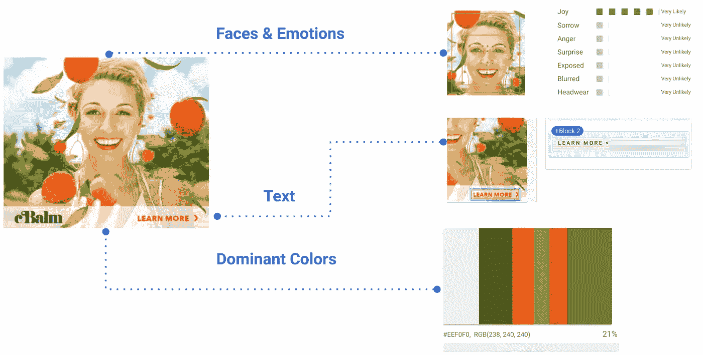
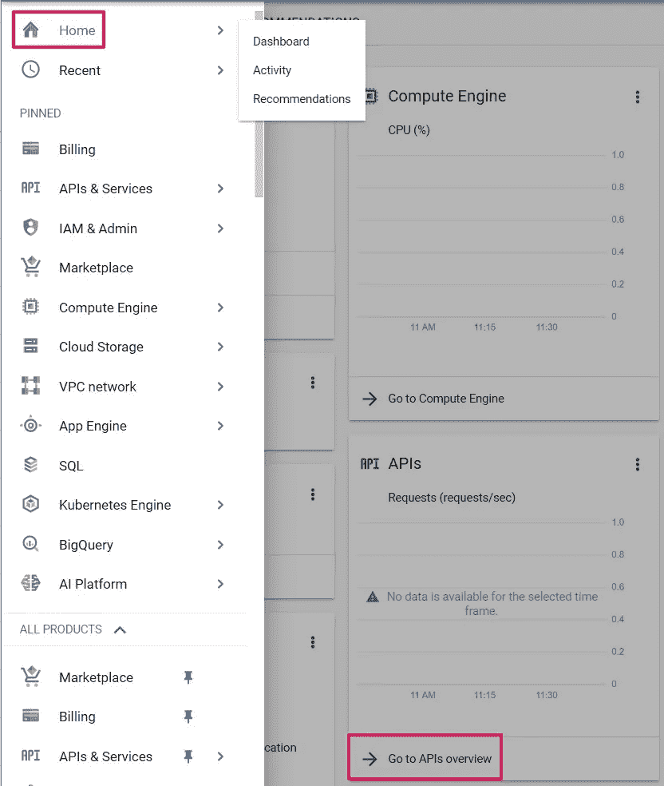
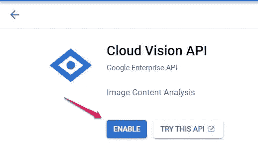
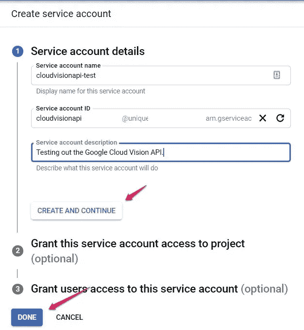
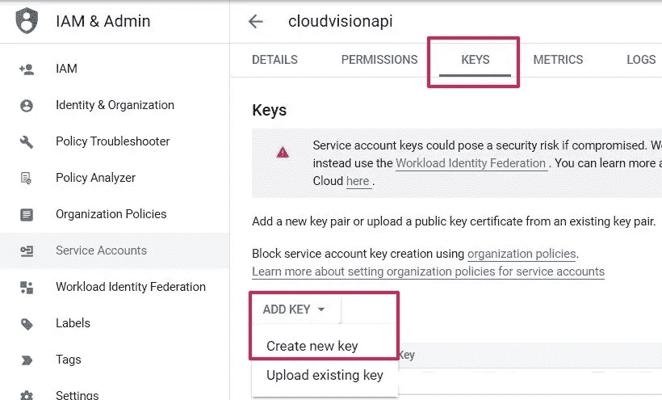
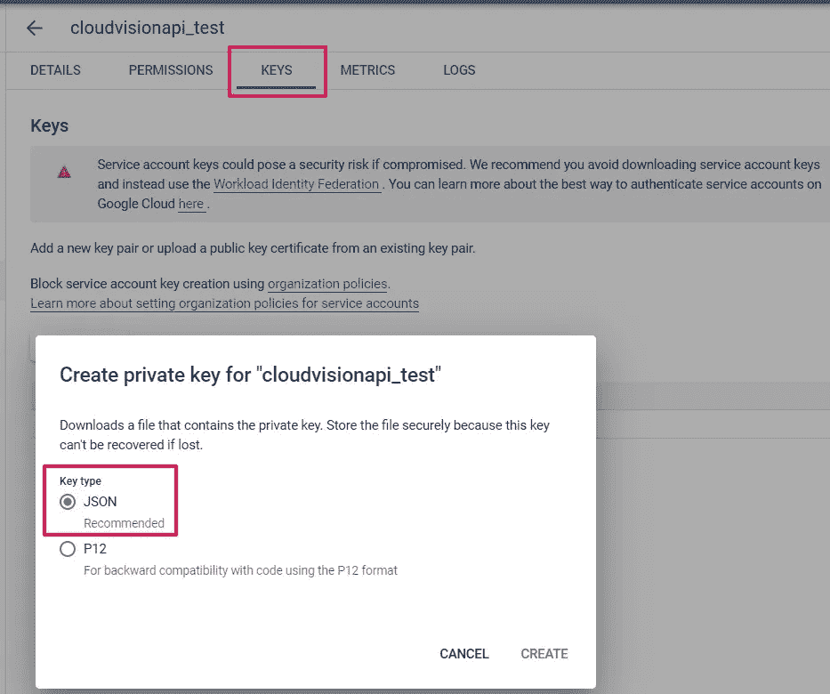

# 使用 Google Vision API 进行简单的计算机视觉图像创意分析

> 原文：<https://towardsdatascience.com/simple-computer-vision-image-creative-analysis-using-google-vision-api-50cc42737a00>

## 使用标签检测、对象检测、面部表情检测、文本检测和主色检测创建您的第一个计算机视觉项目

凯文·Ku 在 [Unsplash](https://unsplash.com?utm_source=medium&utm_medium=referral) 上的照片

# 介绍

计算机视觉可以用来从图像、视频和音频中提取有用的信息。它允许计算机看到并理解从视觉输入中可以收集到什么信息。收到视觉输入后，它可以收集图像中有价值的信息，并确定必须采取的下一步措施。

Google Vision API 是一项 Google 云服务，支持使用计算机视觉从图像输入中提取有价值的信息。作为初学者，您可以使用此服务来获得对图像的有意义的见解。下图显示了 Google vision API 的工作方式。

来源:[https://cloud . Google . com/architecture/creative-analysis-at-scale with Google-cloud and-machine-learning](https://cloud.google.com/architecture/creative-analysis-at-scale-with-google-cloud-and-machine-learning)

上图展示了谷歌视觉 API 的能力。Google Vision API 可以识别广告图像中的面部表情、文本和主色。面部表情清楚地显示了这个人喜悦的表情，文本描述了单词“了解更多”，主色显示了图像中的前 10 种主色。

我们可以看到，通过利用 Google vision API 功能，我们可以从图像中获得很多洞察力。例如，假设我们想知道广告图像中的哪些因素导致客户点击并查看我们的广告。这可以通过利用 Google vision API 服务来发现。

本文将主要关注如何获得图像中的洞察力因素，以及我们可以从特定图像中获得什么样的洞察力。我们将不会使用广告图像的例子，因为它不能发表由于公司的保密性。相反，我们将使用 Kaggle 数据集中可用于数据分析的产品图像。

# 资料组

这个项目的数据集图像基于 Kaggle 的[时尚产品图像数据集](https://www.kaggle.com/datasets/kuchhbhi/stylish-product-image-dataset)。因为数据集包含大量来自电子商务网站的产品图像，所以我们将只选取一小部分可用于我们的创意分析的图像。这个[数据集许可](https://creativecommons.org/publicdomain/zero/1.0/)允许你复制、修改、分发和执行工作。

# 设置 Google cloud vision API:循序渐进

在开始之前，我们必须首先从 Google Cloud services 配置 vision API 服务。一步一步的说明可以在[这里](https://cloud.google.com/vision/docs/setup#windows)找到。但是，为了让事情变得更简单，我们将向您展示如何一步一步地从 Google Cloud Services 设置 vision API。

> **(注意:您必须从您自己的 Google Cloud 帐户配置此 Google Cloud services vision API 我们不会在本教程中向您提供包含机密 Google Cloud 密钥的文件)。**

**第一步:**登录谷歌云项目，从主页选择“转到 API 概述”。

(图片来自作者)

**步骤 2:** 选择“启用 API 和服务”，然后搜索并启用 Cloud Vision API。

(图片来自作者)

(图片来自作者)

**第 3 步:**转到凭证，然后单击“创建凭证”，再单击“服务帐户”。

(图片来自作者)

**步骤 4:** 输入您的服务帐户信息(您可以跳过可选部分)，然后单击完成。

(图片来自作者)

**步骤 5:** 导航到您创建的服务帐户。转到密钥，然后“添加密钥”和“创建新密钥”。

(图片来自作者)

(图片来自作者)

**第六步:**创建一个 JSON 键类型，然后下载 JSON 文件，放在 Python 脚本的工作目录下。

(图片来自作者)

# 安装必要的库

在我们开始计算机视觉建模之前，我们必须首先安装所需的库。我们将安装的第一个库是 google-cloud-vision，用于计算机视觉模型检测。我们可以在获得对 Google Cloud Vision API 的访问权后使用这个库。

下一个库是 webcolors，当我们需要将十六进制颜色数从颜色检测转换为我们知道的最接近的颜色名称时，它就派上了用场。

# 导入必要的库

安装完必要的库之后，我们将把它们导入到我们的脚本中。我们将从谷歌云库导入视觉，用于视觉建模检测目的。对于数据预处理，使用了 Ipython、io 和 pandas 等其他库。

Webcolors 用于将十六进制颜色格式转换为我们熟悉的颜色名称。KDTree 用于在 CSS3 库中查找最接近的颜色匹配。 [KDTree](https://docs.scipy.org/doc/scipy/reference/generated/scipy.spatial.KDTree.html) 提供了一组 k 维点的索引，可用于快速找到任意点的最近邻居。

# 在我们的 python 脚本上激活 Google vision API

将 JSON 文件放入我们的目录后，我们必须在 Python 脚本中激活 Google Cloud Vision API 服务。

# 标签检测

可以使用标签检测来检测图像中的任何标签。LabelAnnotation 可用于标识图像中的一般对象、位置、活动、产品和其他事物。下面的代码描述了我们将如何从时尚数据集的图像中提取标签信息。

从这张图片中，我们可以看到谷歌视觉 API 已经检测到几个通用标签，如:

*   面部表情(微笑)
*   人体(脸、关节、皮肤、手臂、肩膀、腿、人体、袖子)
*   物体(鞋)

尽管视觉已经识别了许多标签，但是一些一般的物体被错误地识别并且没有被提及。视觉将凉鞋图像误认为是一只鞋。它也无法识别上图中的衣服、叶子植物、杯子和椅子。

# 目标检测

对象检测可用于检测图像中的任何对象。与标记不同，对象检测主要与检测的置信度有关。LocalizedObjectAnnotation 扫描图像中的多个对象，并显示矩形边界内的对象位置。

从该图中，我们可以看到 google vision API 检测到了如下几个对象:

*   太阳镜(置信度:90%)
*   项链 1(置信度:83%)
*   项链 2(信心:77%)
*   超短裙(信心:76%)
*   衬衫(信心:75%)
*   服装(信心:70%)
*   项链 3(信心:51%)

在上图中，我们可以看到大部分的视觉已经识别出了一件衣服。由于它们的高置信度，水晶般透明的物体已经被识别为几个物体，例如太阳镜、项链 1、项链 2、迷你裙、衬衫和衣服。项链 3 具有最低的置信度，因为视觉认为右下角的图像也是项链。因为项链 3 对象更像手镯而不是项链，所以它的置信度比其他对象低。

# 人脸表情检测

人脸检测可以检测图像中的任何人脸和情感。FaceAnnotation 是一种扫描图像中人脸位置的技术。在扫描人脸的同时，还可以扫描各种面部情感表情。

从上面的这张图片中，我们可以看到谷歌视觉 API 已经检测到人脸的各种表情，例如:

*   乔伊:很有可能
*   悲伤:不太可能
*   愤怒:不太可能
*   惊喜:不太可能

从上图我们可以看出，表情是微笑，vision API 将其识别为喜悦的表情。悲伤、愤怒和惊讶的其他表情似乎与上图不符，因为这个人没有表达这些情绪。结果，快乐被评分为非常可能，而另一个被评分为非常不可能。

# 文本检测

TextAnnotation 可用于从图像中检测和提取文本。矩形边界内的单个单词和句子包含在提取的文本中。

从这张图片中，我们可以看到谷歌视觉 API 已经检测到各种文本，如:

*   文化
*   这是
*   什么
*   可怕的
*   相貌
*   喜欢

For some reason, the vision has identified what appears to be a Japanese word of 文化. This can happen if the vision inadvertently detects any word from the rattan carving behind the clothing picture and somehow translates it into a Japanese word.

图像中的文本显示它检测大写和非大写单词。它还在上面的文本中找到了“THISIS”这个词，应该是“THIS IS”。因此，vision API 的局限性在于，它会将单词“THISIS”检测为“THIS IS ”,因为该单词太窄。

# 主色检测

主色检测是图像属性标注的特征之一。它可以使用主色检测来检测图像中的前十个主要特征颜色及其颜色分数。

Google Vision API 已经检测到十六进制格式的前十种不同颜色，如上图所示。为了获得真实的颜色名称，我们必须使用 CSS3 库将十六进制颜色格式转换为颜色名称格式。然后，我们利用 KDTree 获得我们在 CSS3 库中熟悉的最接近的颜色。

我们使用十六进制颜色 A41B24 作为第二主色的示例。使用上面的函数，我们发现 CSS3 库中最接近的颜色是耐火砖。上图中运动鞋的红色表明了这一点。

# 结论

我们已经使用标签、物体、面部表情、文本和上面创造性分析中的主色检测完成了计算机视觉建模。在我们运行 vision API 之后，每个检测注释仍然有许多限制。

*   **标签检测:**它可以检测图片上的许多一般对象和面部表情，但有些对象会被误识别(例如在我们的分析中，它将一只凉鞋误识别为一只鞋)。
*   **物体检测:**在这些因素中也存在误识别的情况，但是我们可以通过查看物体检测置信度来预测它(例如在我们的分析中，它将手镯误识别为另一条项链)。
*   **面部表情检测:**图像清晰地显示出男孩喜悦的表情。但是，如果您尝试使用从视觉建模中排除的表情的图像，它会将所有表情检测分类为非常不可能，因为视觉建模无法确定它是哪个表情。
*   **Text detection:** The texts can be detected using the text annotate, but there is an unwanted text that is included in our vision modeling (for example, in our analysis, it detects the Japanese word “文化” even though there are no Japanese words on the picture).
*   **主色检测:**可以检测上图中的多种主色，但目前只能转换成 RGB 或 hex 颜色格式。要转换成我们熟悉的颜色，必须添加一个将十六进制颜色转换成颜色名称的函数。

# 承认

如果你想获得更多关于这个建模方法中使用的代码的细节，你可以查看我的 [Github 库](https://github.com/nugrahazikry/Simple-Computer-Vision-Image-Creative-Analysis-using-Google-Vision-API)。

> **(注意:Google 云密钥在存储库中不可用，您必须按照上面的步骤自己创建)。**

**Github:**https://github.com/nugrahazikry<https://github.com/nugrahazikry>

【领英:[https://www.linkedin.com/in/zikry-adjie-nugraha/](https://www.linkedin.com/in/zikry-adjie-nugraha/)