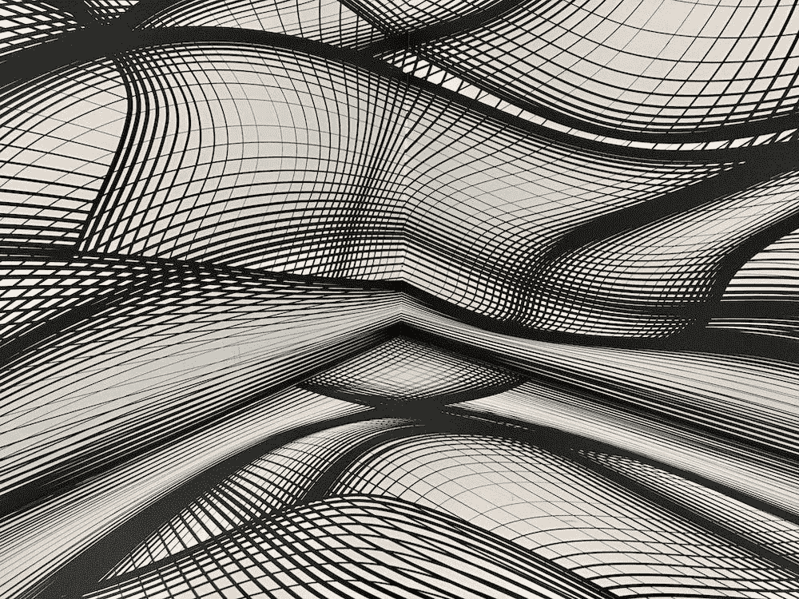
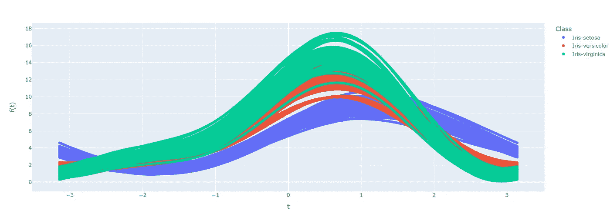

# 用 Python 实现安德鲁斯曲线的简单介绍

> 原文：<https://towardsdatascience.com/simple-introduction-to-andrews-curves-with-python-e20d0620ed6b>

## 一种有效的多维数据可视化方法

Armand Khoury 在 [Unsplash](https://unsplash.com/) 拍摄的图片

# 背景

安德鲁斯曲线，也称为安德鲁斯图，是一种可视化技术，用于识别多维数据中的潜在结构。与主成分分析和 T 分布随机邻居嵌入类似，安德鲁斯曲线将多个特征减少到低维空间，以显示与目标变量或分类的关系。安德鲁斯曲线的工作原理是将单次观察或一行数据的所有特征映射到一个函数上。该功能定义为:

按作者分类的图像-f(x)表示函数输出的总和，而 x1、x2、x3、x4、x5、xn…表示单个观测值或数据行的 n 个要素或列以及相应的映射函数

生成的函数输出创建了一条唯一的曲线，保留了每个函数系数的所有要素之间以及观测值之间的相对距离和方差。思考安德鲁斯曲线的另一种方式可能是平行坐标图的变换版本。安德鲁斯曲线结合了多种观察结果，并通过目标可变颜色映射进行区分，突出了类别之间的潜在聚类或类别之间的分离。

按作者分类的图像-带有 Iris 数据集的示例 Andrews 曲线，其中要素以-pi 到 pi 的比例映射在 x 轴上，生成的函数输出值绘制在 y 轴上。注意类内的相似性和类间的差异。在一个分类模型中，哪一个最能准确地区分？

> 要了解更多关于安德鲁斯曲线和上面提到的其他多维可视化工具，请查看下面的链接

        

在下面的段落中，我们将讨论如何为安德鲁斯曲线准备数据，并测试一些绘图方法。

# 准备数据

如上图所示，本教程使用 Iris 数据集。我们可以用熊猫来读取 UCI 机器学习库中的数据。

让我们来看看我们正在使用的一些功能。

为了快速有效地为安德鲁斯曲线准备数据，我们可以使用 *acdata* 库。acdata 函数需要的三个参数是:

*   数据=虹膜
*   class_column = 'Class '
*   样本= 1000

*acdata* 函数输出一个熊猫数据帧，该数据帧包含创建完整的安德鲁斯曲线图所需的所有组件，同时保留原始特征数据中的信息。点击了解更多关于 acdata 库[的信息。](https://github.com/chags1313/andrewscurves)

# 绘制安德鲁斯曲线

可视化我们的数据的一个有用的方法是通过 Plotly 的交互式绘图库。通过 Plotly，我们创建了带有 **x = 't'** 和 **y = 'f(t)'** 的曲线。为了展示类分布，我们设置 **color = 'Class'** 。对于特征信息，我们设置 **hover_data = ['Sepal_Length '，' Sepal_Width '，' Petal_Length '，' Petal_Width']** 。x 轴是从-pi 到 pi 的范围，并且线性间隔 t，f(t)表示 y 轴上 t 的系数。

Seaborn 的数据[可视化库](https://seaborn.pydata.org/)提供了另一种创建高质量安德鲁斯图的方法。对于 Seaborn，我们设置了 **x = 't'** ， **y = 'f(t)'** ， **hue = 'Class'** 。我们的 seaborn 图创建了误差带来清理观察值之间的分布，并更好地区分类别。

绘制安德鲁斯曲线的其他方法包括 pandas 绘图函数和 hvplot，它们内置于库中。您可以查看以下选项:

    

# 结论

安德鲁斯曲线提供了一种简单而有用的方法来可视化与目标变量或分类相关的高维数据中的结构。本教程提供了安德鲁斯曲线的简要背景，并展示了准备和创建有效的绘图简单方法。希望这对您的数据科学之旅有所帮助！

## 感谢您的阅读！

  

作者的类似文章—

   