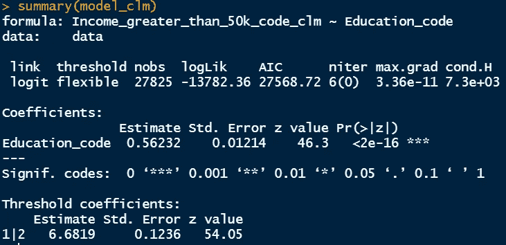
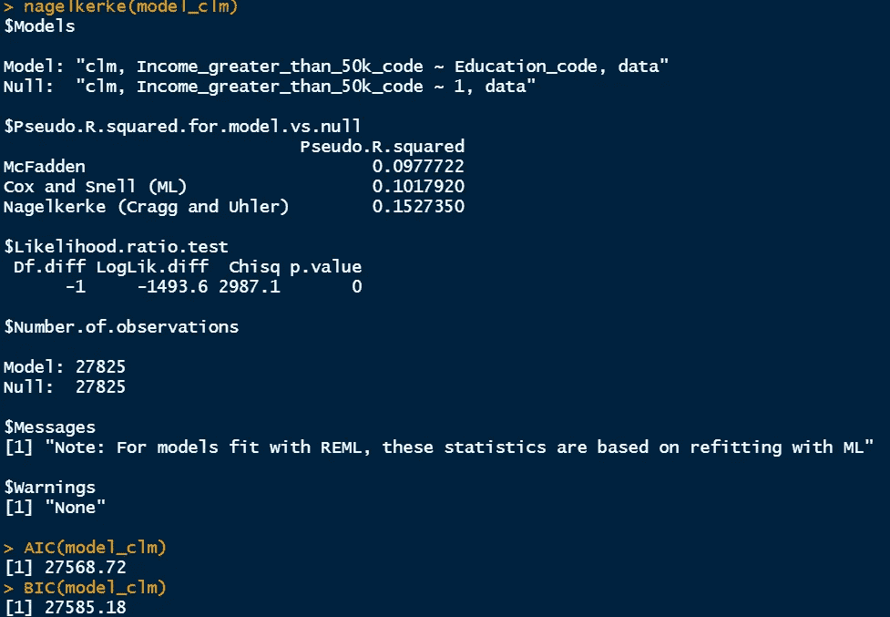
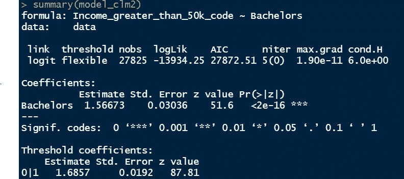
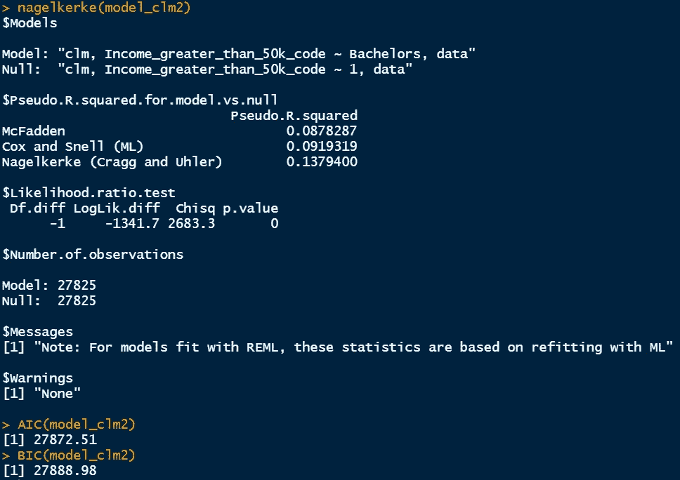
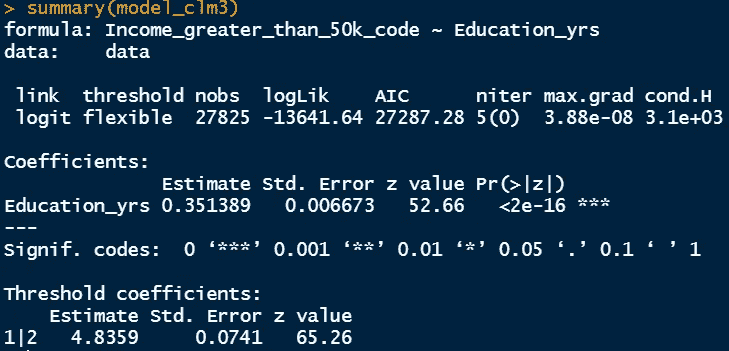
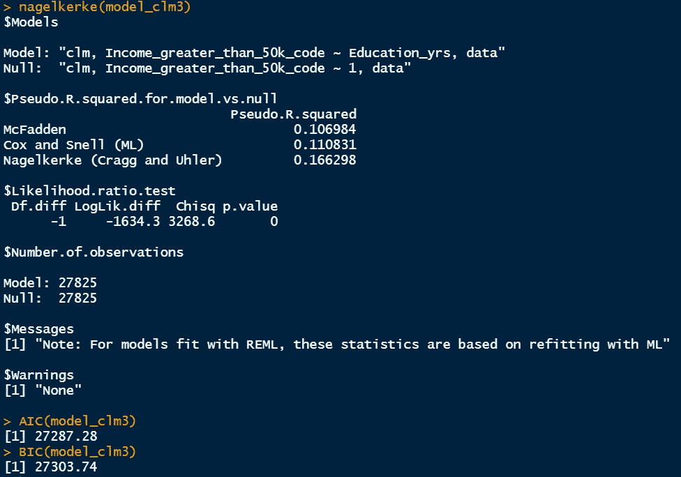

# R 中序数变量的简单逻辑回归

> 原文：<https://towardsdatascience.com/simple-logistic-regression-for-ordinal-variables-in-r-1d95fa278c5e>

## R 系列中的统计

苏珊·Q·尹在 [Unsplash](https://unsplash.com/s/photos/education?utm_source=unsplash&utm_medium=referral&utm_content=creditCopyText) 上的照片

> **简介**

当我们处理序数变量时，逻辑回归变得相当有趣。与二元变量不同，现在我们有顺序预测变量和响应变量。我们可以有这样的情况，预测变量是有序的，响应变量是二进制的，反之亦然。有序变量是指具有有序数据的变量。例如，我们可以将教育水平数据分为“高中”、“学士”、“硕士”和“博士”。这些数据以有序的方式显示了几个级别的可能分类值。在本文中，我们将深入研究序数变量的简单逻辑回归。

在以前的文章中，我们已经经历了简单的和多重的逻辑回归。读者可以看看这些文章，以便更好地理解逻辑回归。

 [## R 中二分变量的简单 Logistic 回归

### R 系列中的统计

towardsdatascience.com](/simple-logistic-regression-for-dichotomous-variables-in-r-8befbe3e95b4)  [## R 中二分变量的多元 Logistic 回归

### R 系列中的统计

mdsohel-mahmood.medium.com](https://mdsohel-mahmood.medium.com/multiple-logistic-regression-in-r-aa65c2a91e22) 

> **数据集**

这里，我们将使用来自 UCI 机器学习知识库的 [**成人数据集**](https://archive.ics.uci.edu/ml/datasets/adult) 。这个数据集有超过 30000 个人的人口统计数据，包括种族，教育，职业，性别，每周工作时间，收入水平等。

[**成人数据集**](https://archive.ics.uci.edu/ml/datasets/adult) 来自 UCI 机器学习资源库

为了进行有序逻辑回归研究，我们需要对给定的数据稍加修改。但首先，我们提出一个学习问题。

> 受教育程度对收入水平有什么影响？

要回答这个问题，我们需要教育和收入水平的标签编码数据。给定数据集的教育水平从一年级一直到博士学位。收入水平是二元的，提供了个人收入是否超过 50000 美元的信息。因此，我们有序数预测变量和二元反应变量。让我们在 r 中执行分析。

[链接到 github 中的 excel 文件](https://github.com/mdsohelmahmood/Statistics-in-R-Series/tree/main/Simple%20Logistic%20Regression)(成人— v2 —适用于 github.xlsx)

> **在 R 实施**

我们首先完成了“教育标签编码”专栏。由于这是一个序数数据，我们需要设置适当的顺序，并设置数值。顺序和设定值如下所示。我们将使用 Education_code 专栏，并通过利用它来尝试回答手头的问题。我们将看看这种教育水平对收入是否有任何影响。

我们的收入数据是二进制的。这意味着我们只有两个级别:收入> 50000 美元和收入≤50000 美元。我们还将相应的数据编码为 1(收入> 50000 美元)和 0(收入≤ $50000 美元)。

在 R 中，我们将首先读取修改后的数据，并将所需的列传递给 clm()函数。

这里，我们使用了 clm()函数来代替 glm()。clm()代表累积链接模型，我们需要安装“顺序”包来使用 clm()函数。

> **结果解读**

为了阐明研究顺序，我们用不同的顺序变量组运行了三个相似的模型。

1.  模型 1:如上所述，它具有代表不同教育水平的序数预测变量“教育代码”。它还有二进制响应变量“Income_greater_than_50k_code ”,我们通过将最低值分配给收入类别≤$50000，最高值分配给收入类别> $50000，使其成为序数。
2.  模型 2:该模型有二元预测变量“单身汉”(如果个体有单身汉，赋值为 1，否则为 0)。响应变量与模型 1 相同。
3.  模型 3:该模型具有连续的预测变量“Education _ yrs ”,这是一个数字变量，响应变量与之前的模型相同。

我们将运行我们的数据集，解释每个案例的结果，并进行比较。

> **模型 1 结果**

模型 1 结果

clm()的输出窗口与 glm()函数略有不同。第一部分显示了链接函数、阈值选项、观察次数、对数似然值、AIC 统计、迭代次数、对数似然函数的最大绝对梯度和 Hessian 条件数。

“教育 _ 代码”的系数估计值为正，值为 0.562。其次，个人教育水平每增加一个单位，我们就有相关的 p 值< 0.05 and it indicates statistically significant data for the predictor variable.

Based on these figures, it can be concluded that there is a 0.562 increase in the logit or log odds of income level being 1 (i.e. income >【50000 美元】。

模型 1 结果

关于伪 R 值，我们的麦克法登值为 0.098，稍后我们将比较其他模型。还将比较 AIC/BIC 的统计数据，因为单个模型的单个值在逻辑回归中没有太大意义。

> **模型 2 结果**

模型 2 结果

“单身汉”列数据是二元的，它类似于我们之前做的简单逻辑回归。根据这些数字，我们可以得出结论，个人教育水平每增加一个单位，收入水平的对数或对数优势就增加 1.567。因此，拥有学士学位比仅仅提高教育水平 1 级(来自模型 1)有更大的影响。如果个人拥有学士学位，相关的 p 值也是< 0.05.

Model 2 result

Regarding the pseudo R² value, we have McFadden value of 0.087 which is smaller than model 1\. So, model 2 implies lesser significance for the predictor variable. What I mean is Bachelor column’s data have less significant impact on the income data than the ‘Education_code’ data which represents the ordinal values for education levels.

AIC/BIC statistics are also higher in model 2 which also indicates more robustness for model 1.

Since both the predictor and the response variable are binary, it makes more sense to use glm() function here. But this glm() should be run before factoring the variables.

Model 2 result using glm()

Model 2 result using glm()

Using glm() function, the coefficient becomes 0.314 which implies logit increase of 0.314 for income having >50000 美元。麦克法登的伪 R 值是 0.0978。AIC/BIC 值高于模型 1(类似于模型 2 的 clm()结果)。

> **模型 3 结果**

模型 3 结果

“Education_yrs”列数据在模型 3 中是连续的。根据这些数字，我们可以得出结论，个人受教育年限每增加一个单位，收入水平的 logit 或 log 比值就会增加 0.351。相关的 p 值也是< 0.05.

Model 3 result

Regarding the pseudo R² value, we have McFadden value of 0.106 which is higher than model 1 and model 2.

AIC/BIC statistics are also smaller in model 3 which also indicates more robustness for this model.

> **结论**

我们已经经历了三个模型，其中包括顺序预测变量和二元反应变量的逻辑回归。第一个模型有顺序教育变量和二元收入变量。第二个模型包含二元教育变量和二元收入变量。第三个模型有连续教育年限变量和二元收入变量。所有这些模型都根据伪 R 和 AIC/BIC 统计进行了比较。读者也可以将模型扩展到序数反应变量。

> **数据集的确认**

[Dua，d .和 Graff，C. (2019)。UCI 机器学习知识库[http://archive . ics . UCI . edu/ml]。加州欧文:加州大学信息与计算机科学学院。](https://archive.ics.uci.edu/ml/datasets/adult)

感谢阅读。

 [## 用我的推荐链接加入媒体

### 阅读 Md Sohel Mahmood(以及媒体上成千上万的其他作家)的每一个故事。您的会员费直接…

mdsohel-mahmood.medium.com](https://mdsohel-mahmood.medium.com/membership)  [## 每当 Md Sohel Mahmood 发表文章时，都会收到一封电子邮件。

### 每当 Md Sohel Mahmood 发表文章时，都会收到一封电子邮件。通过注册，您将创建一个中型帐户，如果您还没有…

mdsohel-mahmood.medium.com](https://mdsohel-mahmood.medium.com/subscribe)