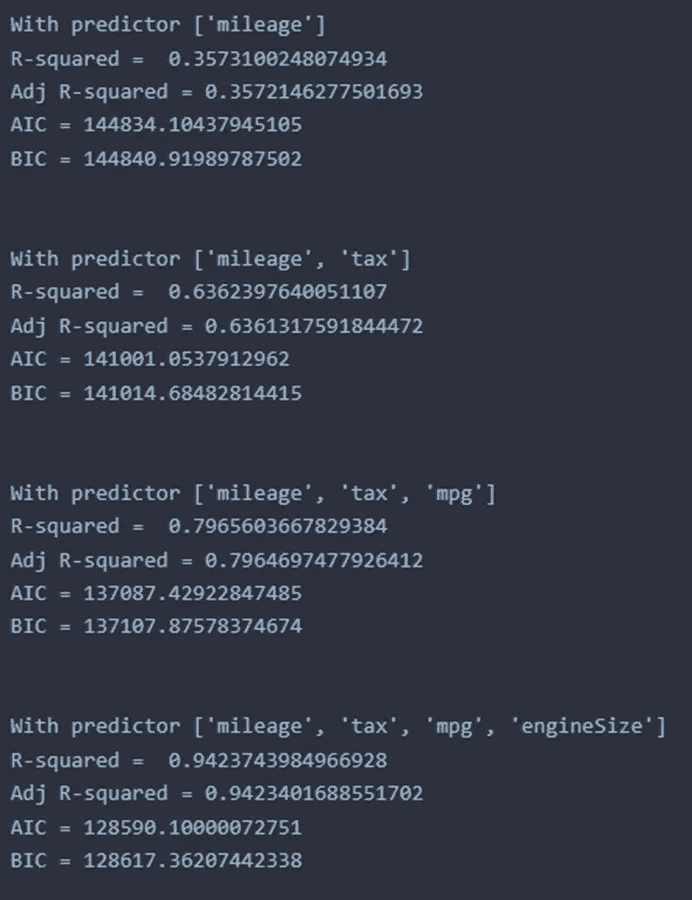

# 简单逐步加权回归模型

> 原文：<https://towardsdatascience.com/simple-stepwise-and-weighted-regression-model-53a31d9e4746>

## 逐步加权回归

作者图片

> **简介**

简单线性和多元线性回归是在工程、医学和其他科学领域广泛使用的统计技术。我们可以对模型进行很好的线性拟合，但同时我们需要找出模型可以解释多少变化。R 是这种变化测量的度量，但是如果我们增加独立变量的数量，R 的值也会增加。然而，我们的 R 的增加并不一定意味着模型变得更加健壮。如果数据集中存在多重共线性，我们需要找出调整后的 R。我们之前已经讨论了如果模型在训练数据上过度拟合，惩罚对模型的影响。特别是这些被称为岭回归和套索回归。

 [## 简单线性和多项式回归

### 使用 Statsmodels、Polyfit、线性回归和多项式特征

towardsdatascience.com](/simply-linear-and-polynomial-regression-9c9624774f5a) 

在这篇文章中，我将通过逐步回归和加权回归分析，这不过是常规回归的扩展。此外，我将扩展度量标准，以检查除 R 以外的 AIC 和 BIC 回归模型的稳健性。

> **逐步回归**

逐步回归与常规回归相同，但处理方式不同。回归模型的主要目标之一是用自变量尽可能多地解释因变量的变化。为此，我们要增加 R 值。如前所述，向模型中添加越来越多的变量将有助于增加 R 值的过程。我们还可以使用其他一些指标来表明模型的稳健性。例如，AIC(代表由日本统计学家 Hirotugo Akaike 开发的 Akaike 信息标准)和 BIC(代表贝叶斯信息标准)也被用作模型稳健性的标准。

AIC 和 BIC 公式[1]

这里，SSE 是误差的平方和，n 是记录数，k 是模型中包含的变量数。实质上，AIC 和 BIC 惩罚了给模型增加更多变量的行为。当开发一个模型时，目标是最小化 AIC 和 BIC 的值，而如果我们使用 R 作为度量，目标是增加它的值。

面临的挑战是找到一个最小化 AIC/BIC 或增加 R 的模型。如果数据集很小，我们可以找到所有可能的模型，但如果数据集很大，这种方法就不可行。它在计算上也很昂贵。我们只需要找出那些具有最高 R 值或最低 AIC/BIC 的模型。出于这个目的，我们可以从整个模型开始，随着我们一个接一个地去除独立变量，计算这些指标的值。如果数据中存在多重共线性，包含所有这些变量将导致较低的调整后 R 值。随着我们移除越来越多的变量，我们可能会发现某个模型产生了最高的 R 值。这种方法被称为逆向逐步回归。我们也可以用向前的方式进行逐步回归。这意味着我们可以从一个预测器开始，随着我们建立越来越多的模型，并同时确定这些指标，添加越来越多的预测器。

出于演示的目的，我们将使用 *CC0:公共领域*许可下的[二手车数据集](https://www.kaggle.com/datasets/adityadesai13/used-car-dataset-ford-and-mercedes)。我们将使用 4 个数字列(“里程”、“税”、“mpg”、“引擎大小”)来拟合汽车价格。

很明显，当我们从一个预测值开始并添加三个剩余的预测值时，R 值增加，AIC/BIC 值减少，表明模型更稳健。这意味着所有这些变量都是汽车价格的良好预测指标。如果有人只想使用 AIC/BIC，有 python 库可以做到这一点。“RegscorePy”是一个能够执行该任务的 python 库。使用该库的 AIC 和 BIC 的值分别为 109256.10676454737 和 109283.36883824323，这与我们使用 statsmodel 得到的值不同。然而，使用 AIC/BIC 的公式，我们获得了与“RegscorePy”相同的值。读者可以利用完整的笔记本并运行来检查这一点。

> **加权回归**

有时，在开发一个模型时，我们需要给某些数据更多的权重，以引入该数据对模型的重要性。例如，在我们的数据集中，我们可能会发现小的 mpg 值可能是不正确的。数据集中的最小 mpg 值是 2.8，我们将从所有数据点中减去该值，这将有效地抑制那些不正确的值。在某些情况下，早期阶段收集的数据可能不正确。在这些情况下，我们可以对那些不正确的值给予较小的权重，而对较新的数据给予较大的权重。对于我们的数据，让我们应用这个加权模型。

无权重线性回归()模型

加权线性回归()模型

有和没有加权的系数的值将是不同的。

> **结论**

在本文中，我们讨论了逐步回归和加权回归，并在 Python 中实现。目标是优化稳健性标准度量。一些可能使用 R 或调整后的 R，而另一些可能使用 AIC/BIC，对新术语进行更多的惩罚。无论标准是什么，这个度量都不是模型健壮性的唯一标准。还有其他检查也需要做。例如，检查残差分布和异方差在数据集中也很重要。读者可以查看我以前关于这些主题的文章。

感谢阅读。

[我的代码页](https://www.learningfromdata.net/simple-stepwise-and-weighted-regression)

 [## 用我的推荐链接加入媒体

### 作为一个媒体会员，你的会员费的一部分会给你阅读的作家，你可以完全接触到每一个故事…

mdsohel-mahmood.medium.com](https://mdsohel-mahmood.medium.com/membership) 

参考

1.  信息标准和新闻，STAT 462，宾州州立大学(网址:【https://online.stat.psu.edu/stat462/node/199/ )