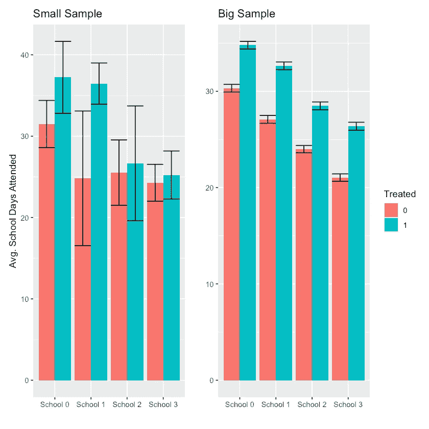
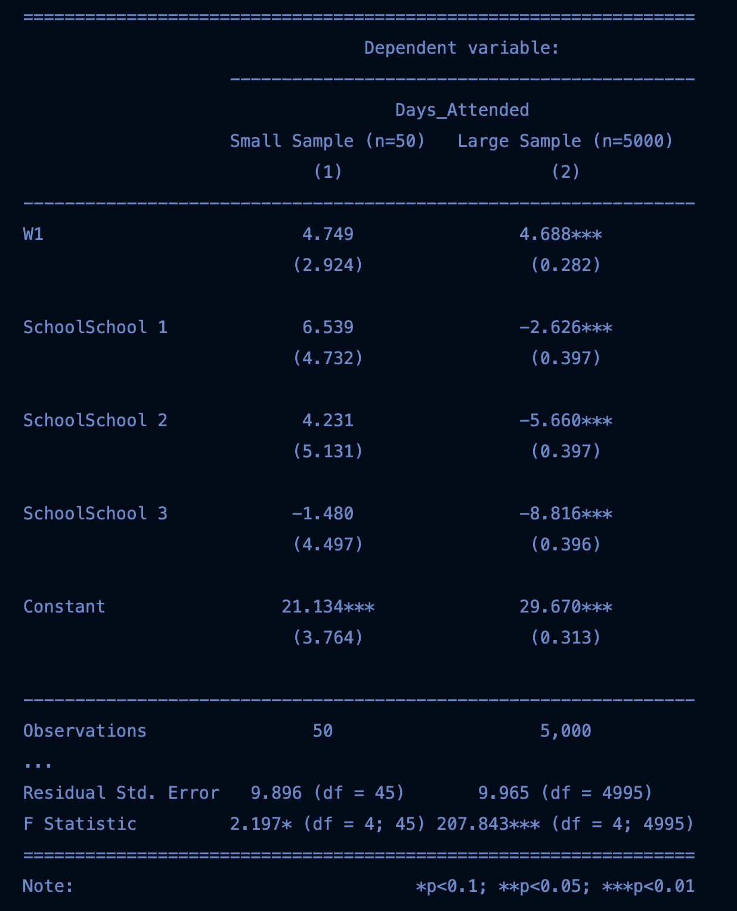
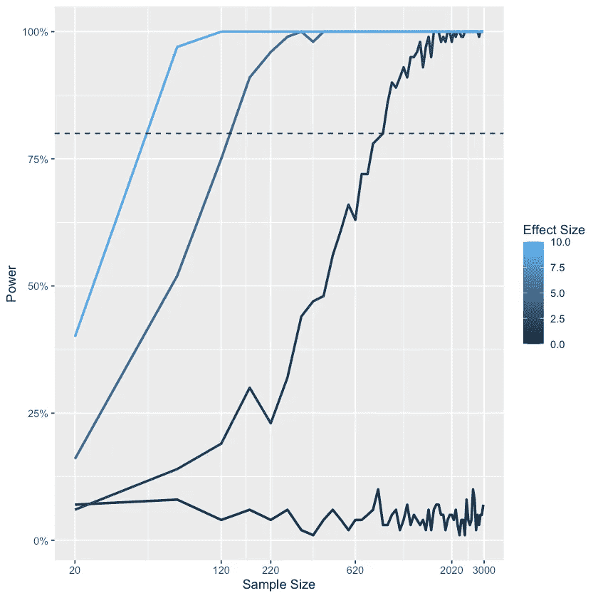

# 模拟 R 中的统计功效

> 原文：<https://towardsdatascience.com/simulating-statistical-power-in-r-9eba698625e7>

## 一个教程(带代码！)解释了支撑疫苗试验设计的重要概念、A/B 检验的有效性以及推动社会科学中的“再现性危机”。

假设你有两个硬币:硬币 A 是公平的，硬币 B 在 90%的情况下会正面朝上。如果让你找出哪个硬币是公平的，哪个是有偏见的，你可能会把两个硬币都抛过来，并记录下每个硬币正面朝上的频率。如果你这样做的次数足够多，硬币 B 就会变得明显有偏差。但是每枚硬币你应该掷几次呢？也就是说，你需要多大的硬币投掷样本才能正确判断出哪枚硬币是有偏差的？

[乔丹·罗兰](https://unsplash.com/@yakimadesign?utm_source=unsplash&utm_medium=referral&utm_content=creditCopyText)在 [Unsplash](https://unsplash.com/s/photos/two-coins?utm_source=unsplash&utm_medium=referral&utm_content=creditCopyText) 上的照片

即使硬币 B 几乎总是正面朝上，你有时也会翻转反面。因此，在任何给定的样本中，你可能只是运气不好，硬币 B *看起来很公平*，尽管它并不公平。如果你把每枚硬币抛了很多次，就不太可能出现这种情况，但这需要付出努力，而且你永远无法保证自己不会倒霉，所以问题是:你对自己犯错有多满意？如果硬币 B 只有 60%的机会正面朝上呢？凭直觉，你似乎需要一个更大的样本，因为硬币现在更相似了，但是要大多少呢？

这些都是关于**统计力的问题。**通俗地说，异能就是你检测效果的能力。用更通俗的术语来说，权力是识别一个效果的可能性，以一个人在场为条件。权力支撑着疫苗试验和 A/B 试验的设计，也是社会科学中“再现性危机”的驱动因素。确保你有足够的权力意味着你可以更确定你的统计数据告诉你什么。动力不足意味着你发现的任何效应都是偶然的结果，你没有发现的任何效应可能只是因为你没有足够的数据*。

# 什么是权力？

统计功效是识别一个效应的概率，以一个效应存在为条件。功效通常是你的假设效应大小、你的观察结果的可变性、你的样本大小、你的信心阈值的函数。要获得一个像样的概述，请参见:[科恩的权力初级读本(1992)](https://www2.psych.ubc.ca/~schaller/528Readings/Cohen1992.pdf) 。

照片由 [Raphael Renter](https://unsplash.com/@raphi_rawr?utm_source=unsplash&utm_medium=referral&utm_content=creditCopyText) 在 [Unsplash](https://unsplash.com/s/photos/power?utm_source=unsplash&utm_medium=referral&utm_content=creditCopyText) 上拍摄

在硬币的例子中，效果大小是硬币 A 正面朝上和硬币 B 正面朝上的频率之差；更大的影响更容易被发现。在硬币的例子中，你被告知硬币 B 有多大的偏差，但是在现实世界中，你必须对影响大小做出合理的猜测。样本大小是你掷硬币的次数；较大的样本不太可能是“不幸的”,因此也增加了功率。你的信心阈值是你对说*有影响*而实际上可能没有影响的容忍度。

功效分析最常用于确定:a)您的分析需要多大的样本，以及 b)您能够检测到的最小效应大小。这是通过保持其他因素不变，并增加/减少感兴趣的变量(样本大小或效果大小)直到达到功效阈值来实现的。一般来说，研究人员选择 0.80 的任意功率阈值，这意味着您有 80%的功率，并且能够在 80%的时间内检测到该量级的真实影响。

# 模拟能力

虽然存在用于计算功率的标准公式和[软件](https://homepage.stat.uiowa.edu/~rlenth/Power/)，但在许多情况下它们可能不适用(例如，当使用随机化推断、混合效应模型等时..参见:阿诺德等人，2011 年)。另一种方法是进行模拟。模拟可以针对所有可能的设计运行，并且更加健壮。它们还增加了生态学的有效性，因为从理论上讲，您可以采用完全相同的分析方法(甚至相同的 R 代码)，并将其应用到您的实际数据中。最后，模拟迫使你明确你对数据生成过程的假设。

在硬币的例子中，你的力量模拟的一次运行将包括模拟一组投掷硬币的次数，比较硬币 A 和硬币 B 的正面率，运行统计测试以确定硬币 A 是否！=硬币 B，并记录结果。你将重复这个过程很多次，并计算你正确说出硬币 B 有偏差的次数的百分比:这是你的功率估计。

虽然像 SIMR 这样的 R 包是用于运行功率模拟的，但我发现它们可能限制过多。本文将概述我是如何以最小的依赖性组织我的功率模拟的。虽然硬币的例子是有用的，但这些模拟考虑了随机实验需要多少参与者来提高 4 所学校的出勤率。

五个电源模拟依赖项。其中三个只是为了可视化输出

# 模拟结构

我组织我的模拟有三个重要的功能:

1.  **数据生成器**:根据你的世界模型创建数据样本。
2.  **评估者**:获取样本并返回包含效果评估的模型(两个硬币有什么区别？)
3.  **鉴别器**:接受模型并确定该效应是否可信(*即*统计显著)。

这些都用在您的组织能力模拟函数中，该函数将重复调用所有三个函数，并返回您的鉴别器正确发现效果的运行比例。

## 数据生成器

你的数据生成器将你所做的关于你的实验在现实世界中如何工作的所有假设整理成文。通常，这将包括关于观察独立性、恒定治疗效果、共同支持、非发现性等的假设。然而，在模拟您的功效分析时，您可以根据需要调整这些假设。鉴于功效分析的两个有趣问题是关于最小样本量*或*最小可检测效应量，我将它们作为参数包括在内。每次调用数据生成器函数时，它都会创建一个具有完全相同属性的全新数据样本。

使用您的数据生成器函数对数据生成过程进行建模。

在这个例子中，每一行代表 4 所不同学校中的一所学校的学生；我们也有那个学生那学期出勤的天数。w 代表治疗指标，我们假设该指标可提高 5 天的出勤率。我们还假设不同的学校有不同的基线出勤率，并且在个体层面存在一些随机噪声。

来自数据生成器的样本模拟了对四所学校的干预对出勤率的影响。左侧图的样本量为 50；右图的样本大小为 5000。两者都模拟了相同的 5 天效应大小。图片作者。

正如我们可以看到的，当运行我们的数据生成器功能时，具有相同的效果大小(额外参加了 5 天)但不同的样本大小，我们得到了一个非常不同的图片。重要的是，小样本运行(左，n=50)比大样本(右，n=5000)噪声大得多。

## 评估者

您的估计器接收数据样本，并尝试恢复您感兴趣的属性。重要的是，它返回某种类型的*模型*，允许您总结数据生成过程。在硬币示例中，感兴趣的属性将是硬币 A 与硬币 b 相比出现正面的频率。在我们的学校示例中，感兴趣的属性是在控制其他因素后，治疗组与对照组相比参加的天数。**理想情况下，您的估计函数应该执行与您希望对实际数据执行的分析相同的分析。**值得注意的是，使用的估计量也会影响统计功效，因为有些估计量的效率比其他估计量低。

然后传递给估计器函数的数据生成器函数的新样本。在这里，我们使用一个线性模型，其中包括治疗和学校指标，以模拟每个学生参加的天数。

在这个例子中，我们使用线性回归，包括治疗指标 W，以及作为对照的学校指标。由于样本量小(左)，该模型给出的估计不精确，标准误差大。较大的样本量能够自信地恢复我们在数据生成函数中编码的参数，包括治疗效果和学校基线出勤率的差异。

数据生成器的两个样本的估计函数的结果。请注意，右侧的参数估计值具有小得多的标准误差，并且非常接近我们的数据生成器中编码的真实值。图片作者。

## 鉴别器

鉴别器接受你的模型作为输入，并给出你的原始问题的答案，给出数据样本和分析方法。在我们的硬币示例中，这将评估硬币 A 和硬币 b 之间的差异。在我们的学校示例中，这将确定治疗指标的系数在我们设定的置信阈值下是否具有统计显著性。即检查治疗指示器的 *p* 值是否低于 0.05。

从下面可以看出，当使用大样本时，我们可以说我们的治疗对出勤率有统计学上的显著影响，但我们不能用小样本。但是请注意，如果我们再次运行这个代码块，我们可能会得到不同的结果(因为我们将使用新的数据样本)。

虽然这对于本例来说是微不足道的，但在某些情况下，您可能需要一个更复杂的鉴别器。例如，如果我们学校试验中的治疗分配不是在个人层面，而是在学校层面，那么您可能希望在学校层面对您的标准误进行聚类(Abadie 等人，2017)。或者，如果您的研究涵盖整个人群，并且您正在基于设计的推理框架内工作，您可能希望使用随机化推理来确定统计显著性(Abadie 等人，2020)。通过使用电源模拟，您可以根据需要交换这些不同的方法。

# 把所有的放在一起

一旦定义了数据发生器、估计器和鉴别器，就可以运行全功率仿真了。这个函数接受你的三个函数作为输入以及一些模拟参数(例如，你想在模拟中运行多少次？).对于模拟中的每次运行，您生成一个新的数据样本，将它传递给您的估计器，并记录您的鉴别器是否能够确定一个效果。最后，力量模拟会返回您正确识别效果的次数比例。这是你统计能力的近似值。

由于您经常想要改变数据生成器中的效果大小/样本大小，我传递了一个参数化的(*即*一个返回带有设定参数的函数的函数)版本的数据生成器。

在我们学校的例子中，我们的治疗增加了 5 天的出勤率。这种影响在不同的学校是不变的，这些学校有不同的基线出勤率。如果我们的研究只包括 50 名学生，我们只能说我们的治疗在大约 40%的时间里有效。如果我们的研究包括 5000 人，我们可能永远不会犯错误，说我们的治疗没有帮助。

因此，如果我们希望以 80%的功率供电，那么样本大小为 50 时，我们的功率就会不足，因为该设计的功率只有 40%。然而，如果 80%是我们的功率阈值，5000 名学生可能太多了，因为我们的功率接近 100%**。显然，能够确定地发现您的干预的效果是令人敬畏的，但是考虑到资源限制，5000 可能是多余的。

## 功率曲线

在我们学校的研究示例中，50 名学生参与者太少，5000 名则太多。为了找出满足我们的置信阈值所需的样本量，我们可以生成一条功效曲线。这是通过保持所有其他因素不变并增加样本大小，直到我们的功率模拟达到 80%的功率来实现的。

下图显示了样本规模从 20 到 3000 名学生的 4 种不同效应规模(0 天、2 天、5 天和 10 天出勤天数增加)的功效曲线。达到我们预定义的 0.80 (80%)的功效阈值所需的样本量取决于我们认为我们的干预将对出勤率产生多大的影响。如果我们认为它会有很大的效果，我们只需要招募 20 名学生就可以很好地观察效果。如果我们认为它会有一个小的影响，我们需要招募数百人。

幂曲线显示您通过注册学生人数(x 轴)检测治疗对学校出勤率(幂，y 轴)的影响的能力。这是针对四种不同的效果大小进行的。功率阈值为水平虚线，表示“功率充足”。图片作者。

如果干预没有任何效果，也没有提高出勤率，那么我们招收多少学生就无关紧要了。在这种情况下，我们只报告了一个假阳性，并且大约有 5%的时间“发现了一个效应”，如果您还记得的话，这是我们在鉴别器中设置的置信阈值。因此，你可以知道你的假阳性率在这些分析中也没有被夸大。

反过来，如果你的样本大小是固定的——可能是因为预算限制——你可以找到最小的可检测效应大小。随着你的效果尺寸变大，你的力量也会增加，希望直到你达到你的力量阈值。这就给了你一个基准，来衡量你的治疗有多有效，才能被你的分析检测出来。

# 结论

功效分析对于确定统计分析的可信度非常重要。需要它们来决定你应该收集多大的样本，或者需要多大的影响才能让你观察到它。虽然存在用于估计功率的标准方程，但是模拟是灵活且简单的近似，可用于任何研究设计。它们还迫使你考虑进入你的数据生成过程的心理模型的假设，以及它们与你的分析技术的一致性。

完整代码在这里:[https://github . com/Cameron-raymond/power-simulation-tutorial](https://github.com/cameron-raymond/power-simulation-tutorial)。

更多关于数据科学、因果推理、ML 和社会科学的博文，请查看我的网站:【https://cameronraymond.me/ 

*由此得到的教训是*而不是*收集数据，直到你发现一个效果。样本大小应该预先确定，以避免 p-hacking。

**实际上，您永远无法使幂=1，但在本次模拟中，我们仅运行了 500 次，从未遇到过无法拒绝零假设的样本。

# 参考

Abadie，a .，Athey，s .，Imbens，G. W .，& Wooldridge，J. (2017 年)。*什么时候应该调整聚类的标准误差？*(编号 w24003)。美国国家经济研究局。

a .阿巴迪、a .阿塞、s .伊本斯、G. W .、伍尔德里奇和 J. M. (2020 年)。回归分析中基于抽样与基于设计的不确定性。*计量经济学*， *88* (1)，265–296。

阿诺德，B. F .，霍根，D. R .，科尔福德，J. M .，，哈伯德，A. E. (2011)。估算设计功率的模拟方法:应用研究综述。BMC 医学研究方法论，11(1)，1–10。

科恩，雅各布。"动力引爆器"心理学通报 112.1 (1992): 155。