# 在运行时将图像分割成重叠的小块

> 原文：<https://towardsdatascience.com/slicing-images-into-overlapping-patches-at-runtime-911fa38618d7>

## 一种用于计算机视觉任务的高分辨率图像切片的有效方法

图片“000000380244.jpg”取自 MS COCO 数据集

处理大的高分辨率图像通常会给计算机视觉任务带来问题，因为在训练或推理期间创建批处理时需要大量的 GPU 内存。

也许克服这种限制的最常见的方法是将图像调整到较小的尺寸。虽然这在某些情况下可能有效，但对于保持高水平的图像细节对良好性能至关重要的情况(如小对象检测)，调整大小时发生的下采样可能会导致重要信息的丢失。一种替代的解决方案是将每个图像分成重叠的切片，并在聚集预测之前在训练和推断期间使用这些切片；这样，我们可以减少所需的内存量，但保持原始图像的细节。

尽管这种方法很有用，但在为最近的客户项目做准备时，我发现大多数可用的实现都采用了这样的方法:在开始正常训练之前，提前将每个图像分成切片，并将这些图像存储为单独的数据集。尽管这意味着在训练过程中只需要最少的预处理，但需要额外的磁盘空间来存储这些图像，这可能会导致大型数据集的巨大成本！

在这篇文章中，我将演示一个预先计算图像切片的实现，并在训练和评估期间在运行时应用裁剪之前将它们存储在一个单独的文件中。我们这样做的原因如下:

*   我们避免以任何方式修改原始数据，所有与切片图像相关的信息都将存储在一个额外的文件中，以便在必要时使用。
*   附加文件将包含使用了哪些切片的记录，这可能有助于分析和调试。
*   通过在运行时裁剪图像，我们避免了将图像的裁剪作为单独的文件存储；存储图像切片文件所需的存储量可能比将图像切片存储为图像少得多。
*   通过创建新文件并在运行时选择它，我们可以很容易地试验不同的裁剪设置。

***Tl；博士:*** *如果你只是想看到一些可以直接使用的工作代码，复制这篇文章所需的所有代码都可以在这里*[*GitHub gist*](https://gist.github.com/Chris-hughes10/ba2e074477a2e3016c50ba5befc7874f)*获得。*

# 选择数据集

这里，我们将使用的图像和注释来自流行的 [MS COCO(微软上下文中的公共对象)数据集](https://cocodataset.org/#home)。然而，由于该数据集非常大，包含大约 33 万张图像，我们将使用 Fastai 准备的该数据集的[样本，其中包含属于以下类别子集的所有图像:](https://course.fast.ai/datasets#coco)

*   椅子
*   表达
*   遥远的
*   书
*   花瓶

## 下载数据

我们可以使用以下命令下载数据:

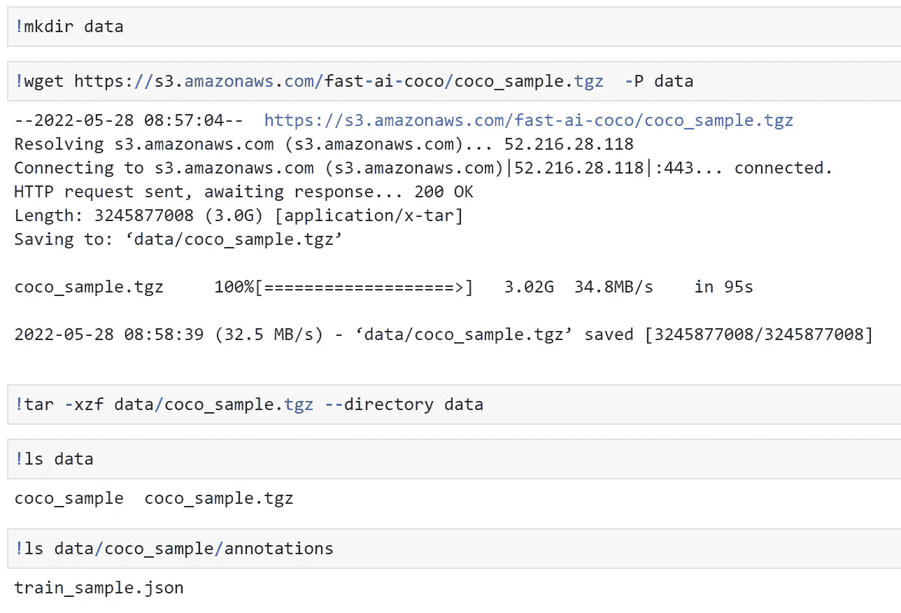

## 将注释转换为数据帧

像最初的 COCO 数据集一样，这个示例使用一个 Json 文件来存储注释。虽然像 [PyCocoTools](https://github.com/ppwwyyxx/cocoapi) 这样的库可以帮助我们与这种格式的文件进行交互，但我个人认为这种格式比以表格格式存储的数据更难浏览和查询。

为了简单起见，我们可以定义一个函数来加载作为 Pandas 数据帧的注释；这里，我也将边界框转换为 xyxy 格式，因为我个人认为这是最直观的工作方式。根据我的经验，我发现在项目开始时花一点时间将数据转换成一种易于交互的格式，可以节省以后大量的时间，而这些时间将用于处理一种困难格式的数据！

我们现在可以用它来加载数据集注释。

## 限制数据样本

通常，当我们试图检测大图像中的小对象时，我们会将图像分割成更小的块。为了表示这个场景，让我们把注意力限制在“远程”类上，它通常是小对象。

我们可以通过使用 Pandas 的[查询方法](https://pandas.pydata.org/pandas-docs/stable/reference/api/pandas.DataFrame.query.html)轻松做到这一点，如下所示。

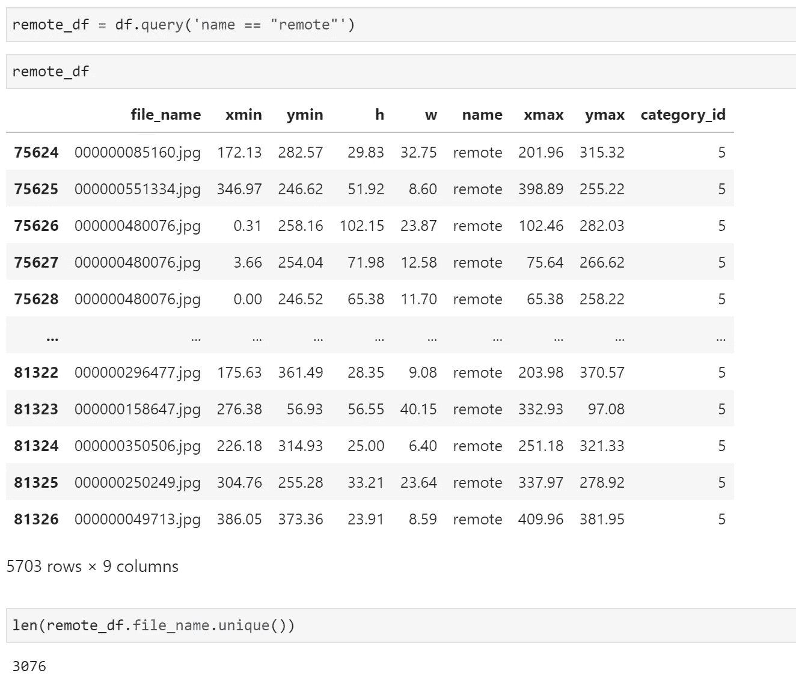

在这里，我们可以看到，我们只剩下与图像中遥控器位置相对应的注释。

## 创建数据集适配器

为了帮助我们探索我们的数据，让我们创建一个 adaptor 类来包装我们的数据帧，并可用于加载图像。当使用 PyTorch 时，我经常发现将图像和注释的加载抽象到这样一个类是有益的，然后可以将它传递给特定于任务的 dataset 类；这使得更改底层数据集变得容易，同时只需进行最少的代码更改。

我们可以定义适配器类，如下所示:

在这里，我们可以看到，虽然这个类看起来像一个 [PyTorch 地图样式的数据集](https://pytorch.org/docs/stable/data.html#torch.utils.data.Dataset)，但是我们没有显式地子类化 PyTorch 的`Dataset`类；这将使我们能够在不安装 PyTorch 的情况下使用它来探索环境中的数据。由于 Python 使用了 [duck typing](https://realpython.com/lessons/duck-typing/) ，由于这个类提供了正确的接口，我们也可以毫无问题地将它用作 PyTorch 数据集！

现在，我们可以使用它轻松地检查我们的一些数据！

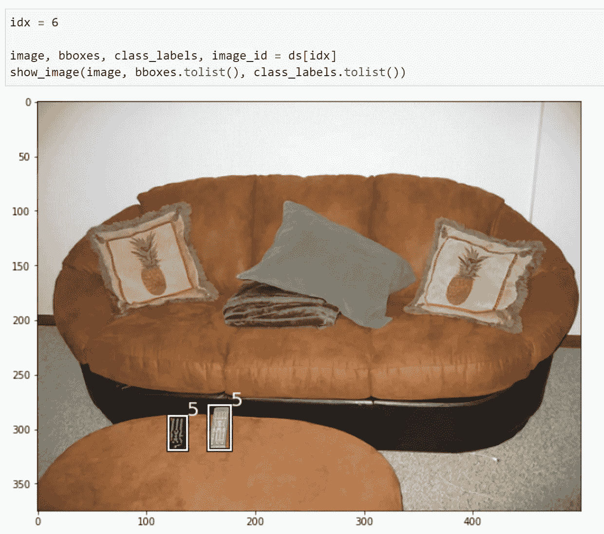

图片“000000371250.jpg”取自 MS COCO 数据集

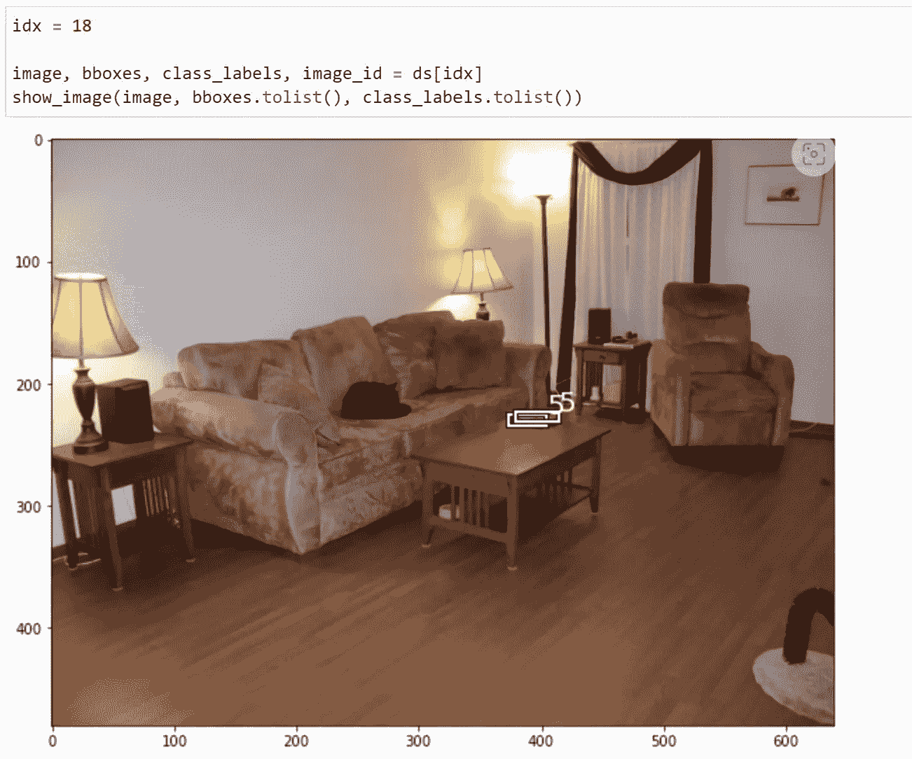

图片“000000199449.jpg”取自 MS COCO 数据集

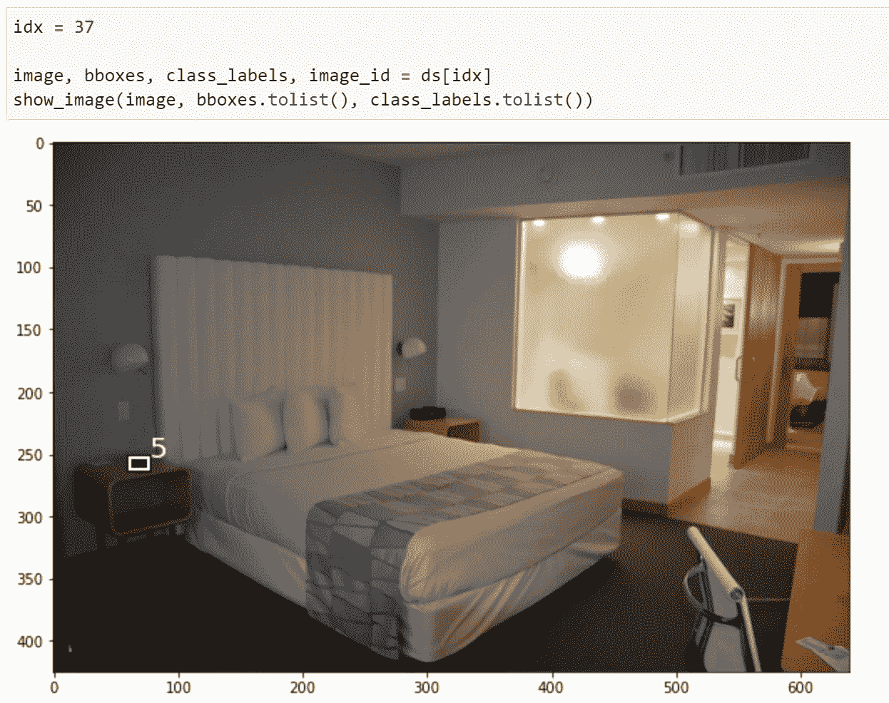

图片“000000380244.jpg”取自 MS COCO 数据集

绘制我们的一些图像和标签，我们可以看到它似乎工作正常！

# 切片图像

现在我们已经加载了数据，让我们探索如何将图像分割成更小的块。在推理过程中，我们可能希望确保所有的图像都被表示出来，所以我们可以采用滑动窗口的方法来分割图像。

如前所述，我们希望提前预计算这些切片，以便在运行时应用它们；而不存储额外的图像文件。实现这一点的一种方法是将每个切片存储为一个边界框，然后可以用它来裁剪图像。

## 计算切片

我们可以定义一个函数，根据给定图像的尺寸来计算我们需要多少个切片，并将每个切片的坐标作为 xyxy 格式的边界框返回，如下所示:

在这个函数中，我们还包括了指定每个切片应该有多少重叠的选项；这有利于避免小对象被分割成多个切片的情况。此外，根据为每个切片选择的高度和宽度以及图像的大小，我们可能会发现一些重叠是必要的，以确保所有切片的大小相同。

现在，让我们为切片设置一些参数。这里，我们任意选择 250 的切片大小，除非必要，否则没有重叠。

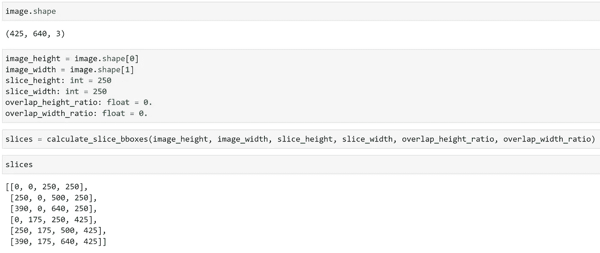

在这里，我们可以看到，使用这些设置，我们有六个不同的图像切片。

## 分割图像

现在我们已经有了表示切片的边界框，我们可以如下所示来可视化这些边界框:

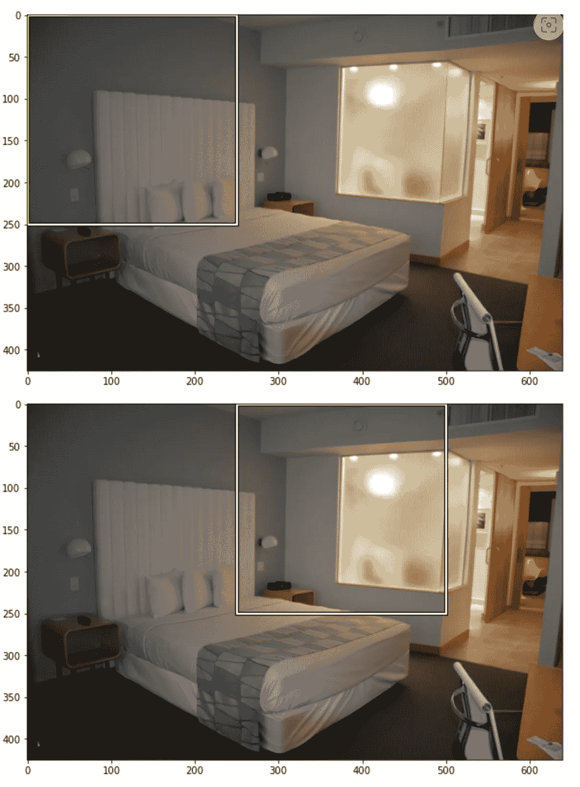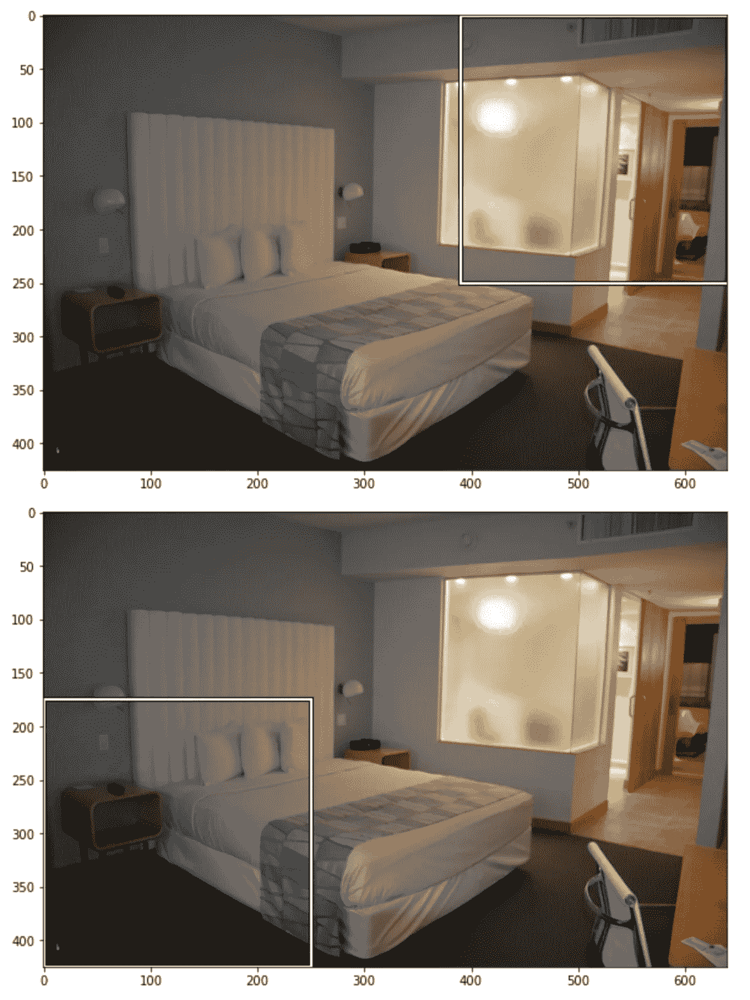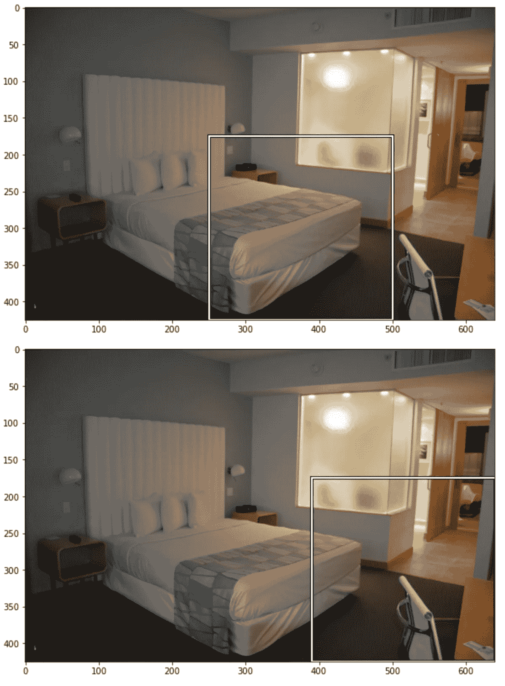

此外，很容易使用这些边界框来裁剪我们的图像，如下所示:

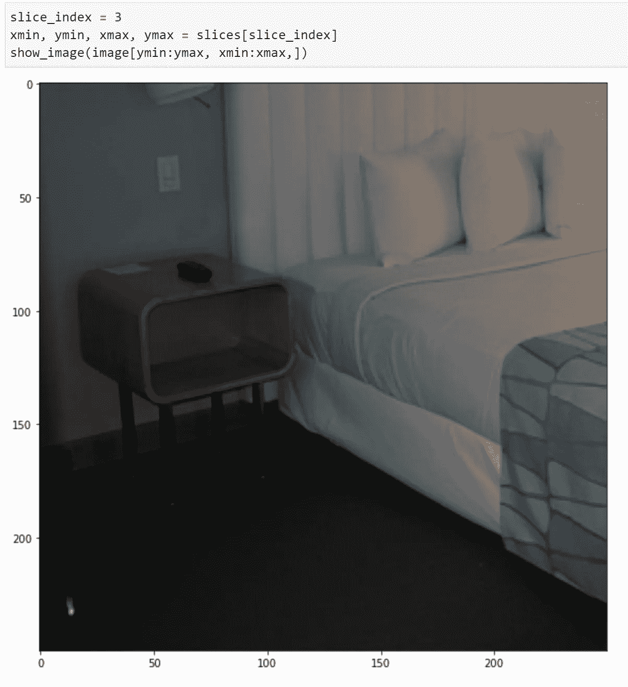

## 缩放注释

当我们将图像分割成更小的块时，我们还必须以两种方式修改我们的边界框注释:

*   对于每个切片，我们需要确定哪些边界框包含在这个切片中
*   对于现有的边界框，我们需要缩放这些框，以便它们相对于包含的切片。

幸运的是，优秀的[相册库](https://albumentations.ai/docs/)包含了这个功能作为其`Crop`转换的一部分，所以让我们在这里利用它。

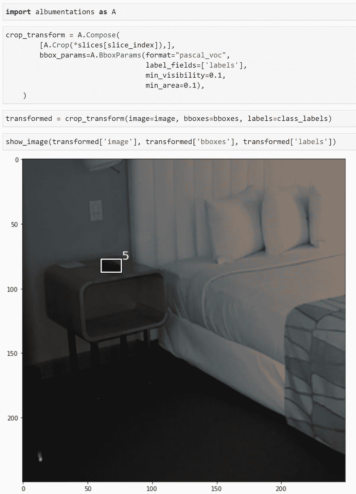

在这里，我们可以看到，即使图像被裁剪，这些框也显示正确。

# 创建切片数据帧

既然我们已经探索了如何分割我们的图像和修改我们的标签，下一步是将它存储在数据帧中。

## 查找图像尺寸

在我们使用的数据集中，图像具有不同的大小。这可能会给我们带来一个问题，因为为了计算我们的切片，我们需要提前知道每个图像的大小。为了有效地做到这一点，我们可以使用多重处理来打开每个图像并存储高度和宽度。

如果数据集中的所有图像大小相同，我们可以跳过这一步，将高度和宽度值指定为参数。

我们可以定义一个函数来完成这项工作，如下所示:

我们可以用它来获得 DataFrame 中每个图像的高度和宽度，如下所示。

## 计算和存储切片

现在我们知道了每个图像的大小，我们可以使用前面定义的函数来计算我们的图像切片，并将其作为附加列添加到我们的数据帧中。

正如我们所看到的，我们现在有了每张图像的切片边界框列表。但是，由于每个切片代表一幅图像，所以让我们修改数据帧，使数据帧的每一行都有一个切片。此外，将值存储为列表会在保存和加载数据帧时导致问题，所以让我们也将每个切片坐标分离到它自己的列中。

我们可以这样做，如下所示:

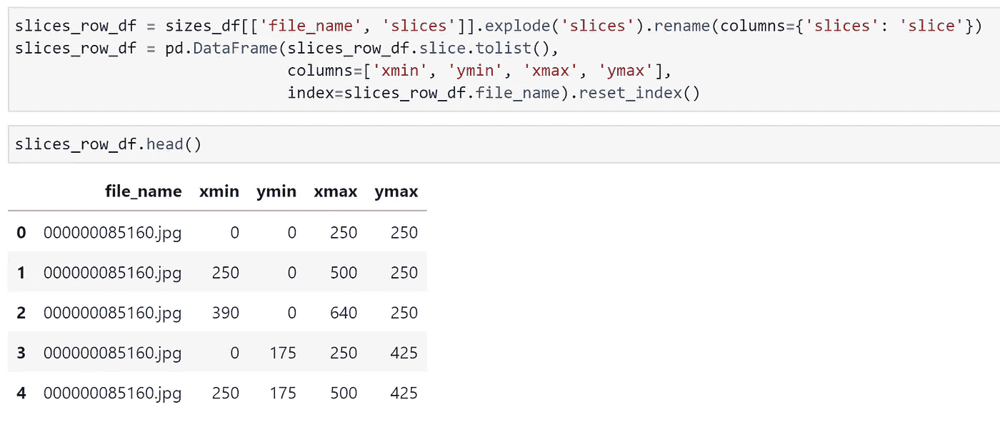

现在，让我们将这两个数据帧合并在一起。

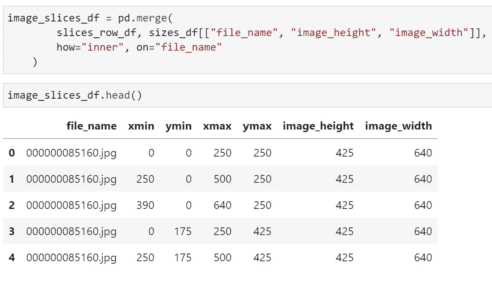

## 为每个切片创建一个标签

现在我们已经计算了我们的切片，我们拥有了我们需要的所有信息！然而，能够查询我们的图像切片中有多少包含我们试图检测的对象通常是有帮助的。

实现这一点的一种方法是计算每个框与图像切片的并集(IoU) 的[交集。或者，我们可以使用白蛋白转换来计算转换后的盒子，然后检查给定图像切片中是否存在任何盒子。](https://en.wikipedia.org/wiki/Jaccard_index)

为了与我们将在训练中使用的方法保持一致，让我们使用白蛋白。这种方法还提供了一个额外的优势，那就是我们将能够利用[albuminations 的](https://albumentations.ai/docs/getting_started/bounding_boxes_augmentation/#min_area-and-min_visibility) `[min_bbox_area](https://albumentations.ai/docs/getting_started/bounding_boxes_augmentation/#min_area-and-min_visibility)` [和](https://albumentations.ai/docs/getting_started/bounding_boxes_augmentation/#min_area-and-min_visibility) `[min_bbox_visibility](https://albumentations.ai/docs/getting_started/bounding_boxes_augmentation/#min_area-and-min_visibility)` [逻辑](https://albumentations.ai/docs/getting_started/bounding_boxes_augmentation/#min_area-and-min_visibility)。这些参数使我们能够控制边界框的哪一点被丢弃，当框的一部分由于变换而不再可见时。

然而，为了节省时间，我们可以避免加载每个图像，并使用具有正确形状的虚拟 numpy 数组来替换它。让我们定义一个函数来做这件事:

我们现在可以将该函数应用于我们的数据帧，如下所示:

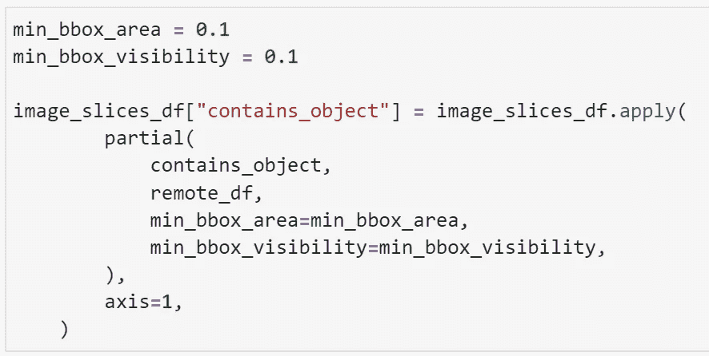

## 把所有的放在一起

既然我们已经了解了所涉及的步骤，我们可以将这些步骤合并到一个函数中，我们可以使用该函数在一个步骤中计算我们的图像切片数据帧:

这里，我还添加了一个额外的步骤，即添加一个 id 列来帮助我们唯一地标识每个切片，这在以后可能会很有用。

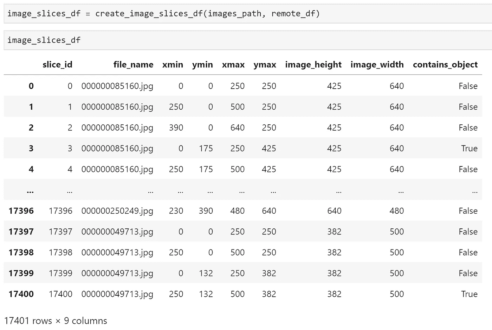

现在，我们可以用它来找出有多少图片至少包含一个遥控器。

在这种情况下，我们可以看到这只是超过 40%的图像！

# 为切片创建数据集

现在我们已经计算了切片，让我们定义一个数据集，它可以使用这个来加载我们的切片图像和标签:

我们可以通过禁用`as_slice`标志来验证这是否正确

## 使用随机裁剪的方法

虽然推理需要确定性切片，但这可能不是训练的最佳方法。这样做的原因是，如果数据集中的图像相当均匀，则模型将只看到同一组图像裁剪；这可能影响其普遍性。另一种方法是在训练期间的运行时随机裁剪图像，在模型看到的图像中添加一些变化——希望使模型更加健壮！

让我们探索一下如何修改我们的`ImageSliceDataset`来包含这一点。

这里，我们添加了一个调整大小的随机裁剪变换，如果`deterministic_crop`标志未启用，将应用该变换。这样，我们可以很容易地在两种行为之间切换。

多次加载同一个图像，可以看到拍摄的是不同的作物。

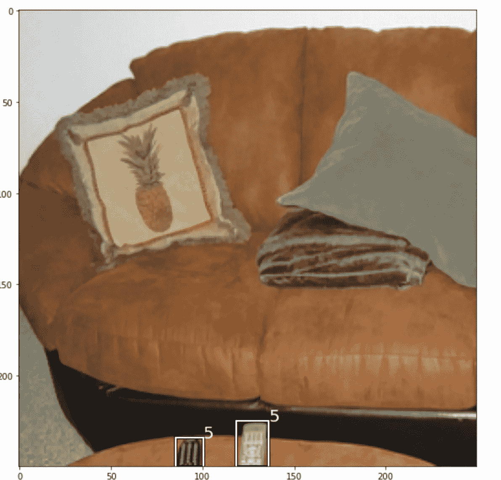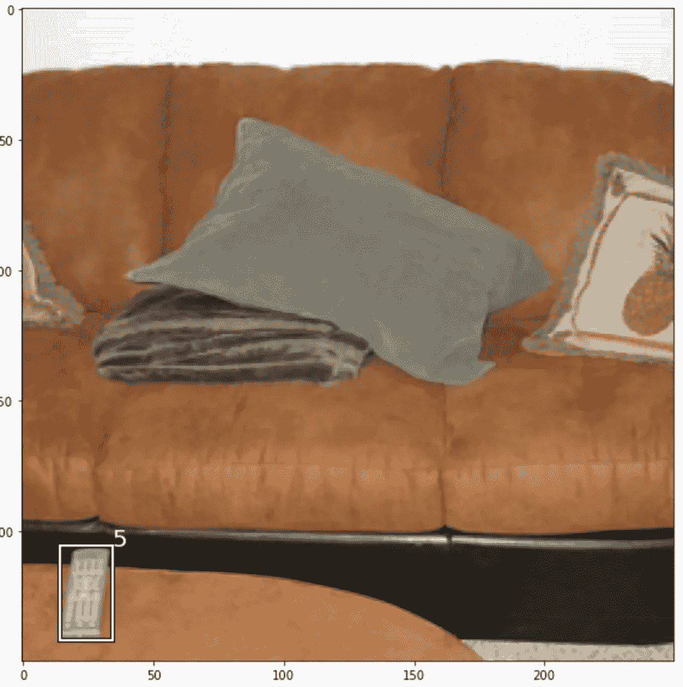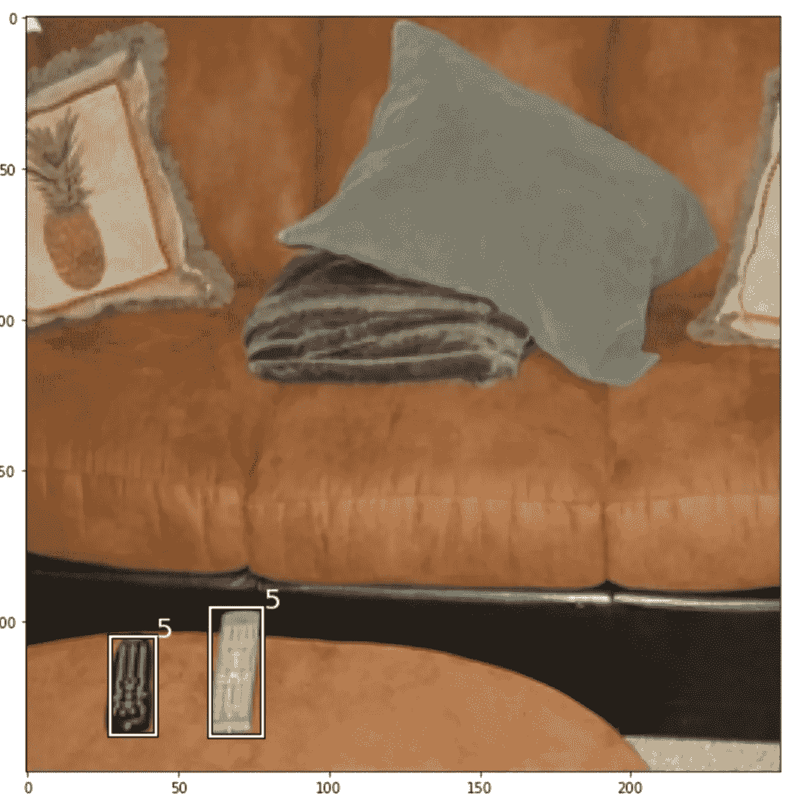

## 加入附加变换

对于更多的变化，我们可以使用额外的白蛋白转换，如下所示:

# 逆向转换我们的标签

在使用图像的切片进行推断后，我们可能希望转换我们预测的边界框，使它们与整个图像相关，让我们来探索如何做到这一点。

首先，让我们检索图像切片和相对边界框:

为了转换我们的盒子，我们还需要图像切片的坐标。这些没有从我们的数据集中返回，但是我们可以使用返回的图像切片的切片 id 从我们的切片数据帧中轻松地检索到这些。

因为我们的切片和边界框都是以 xyxy 格式表示的，所以我们可以简单地通过将起始 x 和 y 坐标值添加到边界框来转换我们的框，使它们相对于整个图像，如下所示:

为了验证这已经正确工作，让我们加载整个图像和我们的地面真相框。

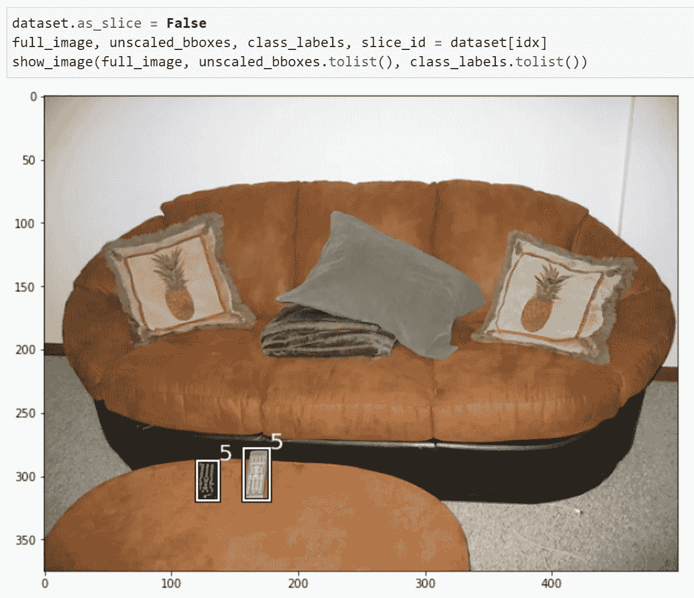

绘制我们重新缩放的方框，我们可以验证输出是相同的。

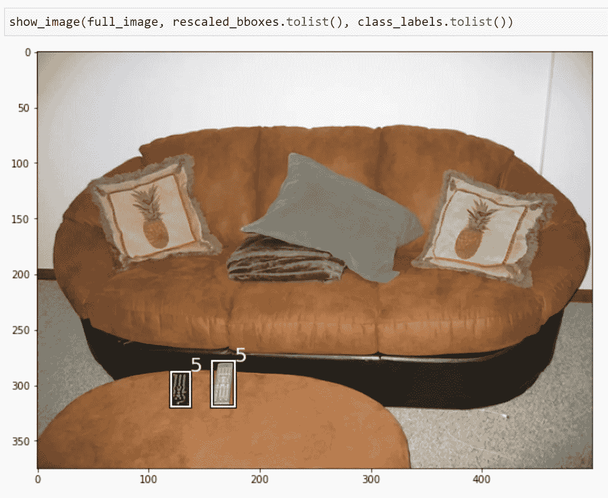

这里唯一需要注意的是边界框被分割成多个切片的情况；由于超出切片尺寸的盒子的任何部分都将在初始缩放期间被丢弃，因此不可能完全重建它。在推理过程中，这些情况将导致仅在所使用的切片中存在的对象部分周围绘制一个框，当框在整个图像上可视化时，这是我们所期望的。

一般来说，我们可以避免这种情况发生的唯一方法是尝试并确保我们感兴趣检测的整个对象包含在图像切片中；我们可以通过增加切片之间的重叠量来做到这一点。

# 结论

虽然可能需要根据您的特定用例来调整具体的实现，但希望这提供了一个清晰的起点，并展示了一种对我来说成功的方法背后的思想！

复制这篇文章所需的所有代码都可以在 GitHub gist [**这里**](https://gist.github.com/Chris-hughes10/ba2e074477a2e3016c50ba5befc7874f) 找到。

*克里斯·休斯上了* [*领英*](http://www.linkedin.com/in/chris-hughes1/) *。*

# 参考

*   [可可——上下文中的常见对象(cocodataset.org)](https://cocodataset.org/#home)
*   [fast.ai 数据集|面向编码人员的实用深度学习](https://course.fast.ai/datasets#coco)
*   [ppwwyyxx/cocoapi:包含 PyPI 上的“pycocotools”包。对官方 cocoapi 关于打包的修改。(github.com)](https://github.com/ppwwyyxx/cocoapi)
*   [torch . utils . data—py torch 1 . 11 . 0 文档](https://pytorch.org/docs/stable/data.html#torch.utils.data.Dataset)
*   [白蛋白文档](https://albumentations.ai/docs/)
*   [用于对象检测的边界框增强—图释文档](https://albumentations.ai/docs/getting_started/bounding_boxes_augmentation/#min_area-and-min_visibility)

# 数据集许可证

这篇博文中的所有图片都来自于 [MS COCO 数据集](https://cocodataset.org/#home)。

MS COCO 图像数据集是在知识共享署名 4.0 许可证下许可的。因此，本许可证允许您分发、重新混合、调整和构建您的作品，即使是商业性的，只要您认可原始创作者。