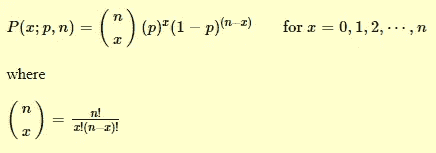
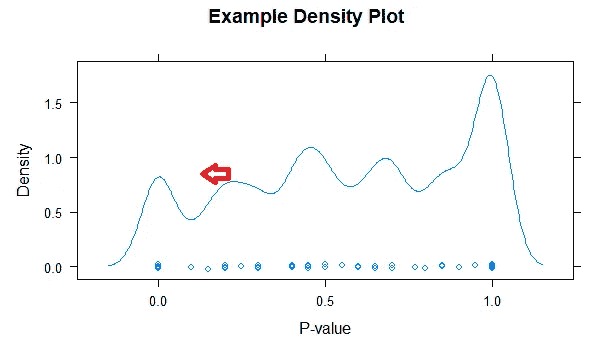

# 结果有意义的小样本

> 原文：<https://towardsdatascience.com/small-samples-with-meaningful-results-1a1b15052ac8>

## 使用非参数符号测试扩展您的数据科学工具包


克里斯多夫·伯恩斯在 [Unsplash](https://unsplash.com/?utm_source=medium&utm_medium=referral) 上拍摄的照片

数据以各种形状和大小出现。大多数统计方法依赖于对丰富和良好数据的假设。非参数方法，如符号检验，有很少的假设，因此是分析具有不寻常形状的小数据集的一个很好的选择。从有限的数据中提取有意义的信息，是生物学(基因分析)、管理学(德尔菲访谈)、地质学(水流)、商业(生产和消费者情绪)中的常见问题。

本文回顾了符号测试，并将其应用于两个实际的业务场景。理想情况下，这些例子将促使您重新考虑处理小数据集的方法，也许是一般的统计方法。通常的假设和规则并不适用。具有高 P 值的可操作结果？绝对的。依赖数据？完全可控。不是来自样本期望值的检验统计量？绝对的。都有可能。

# 关于标志测试

符号检验是一种基于二项式分布的方法，用于调查小样本。经典的二项式例子是在实验中通过投掷一枚硬币来计算正面和反面的数量。不太可能出现大量正面或反面，如果出现了，那将是意想不到和不寻常的。同样的原理适用于各种各样的现象，这些现象可以通过使用被分类为成功或失败的实验来分成这样或那样的东西。符号测试将识别匹配对或单个样本与参考点之间的一致差异。

符号检验是非参数的，这意味着数据可以是无分布的。也有可能我们可能知道分布，但参数(如均值或标准差)未指定。因此，非参数检验可以应用于数据，而无需可视化或确定其分布特征。这可以节省时间和精力，并为严格的统计分析打开异常分布的数据。

符号测试只有三个假设。第一个直观上是显而易见的:每个试验测量必须来自同一个连续的总体。这种假设通常在研究的设计阶段提出。例如，关于可乐偏好的实验将只有关于可乐的观察，而没有关于番茄酱的观察。第二个假设是，试验测量始终是有序的，以区分成功和失败。[1]成功标记为“+”；失败了，“-”。这就是符号测试得名的原因。测量可以采取二分是/否答案或 A/B 偏好、李克特式量表或正面/负面文本情感结果的形式。第三个也是最后一个假设是，试验是独立的，因此一个观察不会影响任何其他观察。这种约束在一定程度上让一枚公平的硬币变得“公平”，因为之前的投掷不会影响未来的结果。稍后我们将看到如何修改相关数据以生成有用的结果。

# 二项分布和基数 R

进行符号检验的统计方法是二项式检验。三个变量定义了二项分布:试验次数( *n* )、试验成功次数( *x* )以及单次试验成功的概率( *p* )。二项式概率质量函数的公式为:



美国商务部，[公共领域图像](https://www.itl.nist.gov/div898/handbook/eda/section3/eda366i.htm) [2]

等式的右边由两部分组成:试验次数乘以成功和失败概率的组合，每一项都是指数。概率就像组合中的一个系数。要查看 p 的效果，可以使用 0.35、0.5、0.6 和 0.9 的值绘制 100 次试验的密度函数。


作者图片

这些密度函数向我们展示了 *p* 对检测差异的影响有多大，因为试验结果围绕选定的概率聚集。对于大量试验，二项式开始接近正态分布，更有效的 z 检验是更好的选择。

要在 R 中运行精确的二项式测试，插入三个变量的值，然后选择一个单边或双边测试，最后设置置信水平。例如，R 中公平二项式检验的一般语法是[3]:

```
binom.test(*x*, *n*, *p*,
alternative = c("two.sided", "less", "greater"),
conf.level = 0.95)
```

假设的选择取决于研究的目标。“双侧”选择检测成功或失败次数的一致差异。“少”用于检测故障；“更大”，成功。P 值的报告方式可能因统计软件包的不同而有所不同，因此请务必验证您的结果。

二项式检验有三个主要的局限性。首先，置信区间的计算对少量试验没有太大帮助。即使有非常显著的 P 值，少于 50 次试验的间隔也会相当宽。第二，如果你知道分布，其他测试会更有效。一般规则是，超过 25 次观察表明其他替代方法可能比符号测试更好。最后，作为一个非参数检验，符号检验是低功率的，这意味着它更有可能拒绝无效假设，如果它是假的。[4]这是一个第二类错误，对数据科学家如何应用非参数检验的结果有影响。

在两个例子中，我们将利用这些统计概念来解决商业中的实际数据科学问题。当你通读这些例子时，考虑一下商业环境的限制如何影响研究的设计。更重要的是，想想这些例子与经典教科书上的问题有什么不同，它们会如何挑战你对应用统计学的信念。

# 场景一，对速度的需求:快速和近似的结果

场景:一家全球电话销售公司实施了一个新的销售报告系统，但推广情况不佳。在输入销售时出现的任何错误都会导致报告被自动系统拒绝，以便经理可以对其进行审查。因此，报告要么被接受，要么被拒绝，在有 5，000 名代表参与的大型电话销售业务中，不清楚哪些员工会从减少错误率的额外培训中受益最多。高级管理层将这种情况称为危机，因为有太多的报告被拒绝，而经理们手动审阅报告已经不堪重负。销售和营销团队要求您确定 1，000 名员工接受额外培训。他们给你一个数据文件，每个工人占一行，每个报告占 1 到 25 列，或者被接受，或者被拒绝。一些工人提交了少量报告，而其他人则提交了 25 份。

解决方案:有限的信息和时间结合在一起，产生很少的选项来发现模式并得出统计相关的结论。数据来源于对所有提交报告的普查， *N* 。然后，我们可以通过将成功提交的报告数量除以 *N* 来计算 *p* 。期望值和平均值为 *N* * *p* 。我们可以简单地计算每个员工成功提交的平均值，并将其与 *p* 进行比较，但这不会区分只有几份报告的员工和有很多份报告的员工。然而，根据每个员工的结果，有足够的信息来运行 5000 个“更少”的单尾符号测试，以确定哪 1000 名员工可能表现不佳，需要更多培训。

该研究的结果将是 5000 个 P 值，每个 P 值与一个工人相关联。请记住，P 值告诉我们，相对于测试假设的预测，我们的数据有多大差异。举例来说，“P = 0.01 表示数据与统计模型(包括测试假设)预测的数据不太接近，而 P = 0.40 表示数据与模型预测的数据非常接近，考虑到了机会变化。”[5]在典型的统计研究中，拒绝零假设所需的显著性是在设计阶段根据结果将如何被使用而建立的。低 P 值对于医学研究非常重要，以确保患者获得适当的护理。例如，在疾病关联研究中，临界值非常严格，为 0.01，而基因表达研究设定为 0.05。[6]发表的学术文章报道了低 P 值的研究，因为有趣的结果被定义为与预期不同的东西。

在我们的场景中，销售和营销团队已经隐式地为您设置了 P 值，因为他们想要 1，000 名绩效最低的员工的列表，也就是说，相对于我们的模型的成功概率预测，他们具有最大的差异。您将选择第 1000 名表现最差的员工的 P 值作为临界值。完全有可能重要性很低，但这没什么，因为犯错的风险也很低。一些人可能只是错过了培训，而另一些人可能接受了不必要的培训。

为了进一步了解具有大量测试的研究中的 P 值，可以在直方图或密度函数上显示这些值，以确定它们的近似形状。这是一个具有 50 个 P 值的非常具有统计学意义的研究的密度函数:


作者图片

30 个 P 值聚集在 0.01 和 0.05 附近，这意味着许多假设已经被拒绝。剩余的 20 个 P 值是均匀分布的，代表没有被拒绝的零假设。像这样表现良好的数据很受研究人员的赞赏，但很少。将此图与我们场景中前 50 个 P 值的假设密度函数进行比较:



作者图片

这个情节更难理解。最大的密度在右边，为 1.0，代表完美填写所有报告的员工个人。最左边的工人都拒绝接受报告。但是中间还有另外三个凸起。对于其他驼峰可能有许多可能的解释，但是我们需要更多的数据来确定它们为什么在那里。话虽如此，现有的 P 值仍可用于决策。对于这个假设的 50 个 P 值的样本，底层 20%的工人(巧合的是)的 P 值< = 0.2，并被送去接受额外的培训。从图形上看，这包括 P 值从红色箭头到 0.0 的所有员工。

完成这项任务后，你可以提供进一步的见解。其他数据，如工人的位置或工作年限，可能解释 P 值的峰值。培训完成后，可以对参与者进行配对符号测试，以寻找提交成功率的提高。可以考虑使用更强大的测试来识别最成功的报告提交者，以获得额外补偿。(请记住，非参数符号检验容易出现第二类错误，也就是说，更有可能的情况是，一名表现出色的员工在获得应得的奖金时遭到拒绝。薪酬的风险高于培训任务。)每一个新的见解都会带来清晰，并有助于理性决策。

# 场景 2，复杂数据:简化的统计数据

场景:一家在线电子产品零售商在其平台上销售 2000 多种产品。企业买家将参加一个贸易展，需要一份分析报告，根据网站上的客户评级和评论来支持购买哪些产品。为了准备你的分析，你已经为所有的产品搜集了定量的李克特式 5 分评级和定性的书面评论。您将如何确定哪些产品得到了最高的评价和最好的评论？

解决方案:数据集很复杂，可以从不同的角度进行分析。您可以使用混合方法，尽管有些产品可能缺少书面评论。此外，数据可能不是独立的，因为早期的评论可能会影响后来的评论。虽然数据集本身很大，但您需要深入到单个产品，对于某些电子产品，可能没有太多观察结果。产品也不一样——电视的平均评级可能与助听器电池的评级大相径庭。在任何情况下，零售商将不得不订购所有类别的高评级产品，以提供完整的电子产品选择。这意味着由于产品的异质性，没有一个有用的方法来衡量所有售出的商品。

为了制定可行的建议，可以对数据进行简化和转换，以运行标志测试。因为没有有用的总体平均值，李克特式量表可以作为一个先验的代理。这是合理的，因为消费者基于他们的感知而不是统计平均值做出购买决定。如果“3 星”是“平均”，那么测试“星”> 3 的每个评级将识别高于平均评级的产品。一些信息丢失了，在这种情况下，捕捉 4 星和 5 星评级之间的差异，但权衡是一个新的二分法变量。定性评论可以通过情感分析来分类为“正面”或“负面”结果是每个产品的逻辑数据向量。符号测试的前两个假设现在已经满足；每个产品都来自同一个连续的总体，并且数据是有意义地排序的。

转换后的数据几乎可以进行分析了，但是第三个假设有问题，因为数据可能不是独立的。这是很难克服的，但如果我们能确定依赖性的性质，这并非不可能。最直接的方法是检查数据，看看早期和后续的评论和评级之间是否存在任何关系。然而，这也是一个接受外部研究并将其纳入我们自己的模型的机会。大量的学术文献致力于消费者心理和购买选择，尤其是在线零售。最近的研究显示了第一次评论对产品后续星级的影响。通过对电子产品的案例研究，研究人员发现，不管产品质量或价格有何差异，负面的第一次评论平均会少 0.6 颗星。[7]我们可以使用这种信息来调整数据相关性。该 R 代码生成一个具有 0.1 显著性水平的高评级产品列表:[8]

```
# Count the number of trial success ratings with a positive first review
pos_review <- filter(v, Review == 1) %>%
  apply(1, function (x) sum(x>3))
# Count the number of trial success ratings with a negative first review
neg_review <- filter(v, Review == 0) %>%
  apply(1, function (x) sum(x>=3)) # Note the change in inequality
# Create a vector of all successes
success <- c(pos_review, neg_review)
# Extract just the ratings to find the number of trials
ratings <- select(v,c(3:ncol(v)))
trials <- apply(ratings, 1, function(x) sum(x>0))
# Find the P-values for each row
p_val <- mapply(function(success, trials) binom.test(success, trials, p=0.5, "greater")$p.value, success, trials)
# Create a dataframe of each product's P-value and identify products <=0.1 significance level
v_new <- data.frame(select(v,Product), p_val) %>%
  filter(p_val <= 0.1)
print(v_new)
```

这个场景的建议模型被大大简化，以说明数据科学家如何选择成功试验的构成要素。有许多途径可以改进分析；对于情感分析，您可以使用强度级别来确定措辞更强烈的评论是否与星级的较大变化相关。你也可以调整假设来扩大或缩小输出的范围，以适应公司购买者。只要在符号测试中对数据进行了有意义的测量，研究人员就可以应用先验信息来代替观察平均数据，从而得出有价值和有意义的结果。

# 走向

小数据集可能是决策制定中被忽视的来源。任何时候数据是有限的或不寻常的，考虑运行一个符号测试。它没有假设，为调查有序数据提供了极大的灵活性。不要被测试统计、显著性或依赖性的传统规则所约束。精心设计你的实验以获得洞察力，结果将是有意义的和可行的。

# 参考文献和注释

[1]美国商务部，NIST/SEMATECH 统计方法电子手册(2012 年)，[https://www . ITL . NIST . gov/div 898/software/dataplot/ref man 1/auxillar/sign test . htm](https://www.itl.nist.gov/div898/software/dataplot/refman1/auxillar/signtest.htm)

[2]美国商务部，NIST/SEMATECH 统计方法电子手册(2012 年)，[https://www . ITL . NIST . gov/div 898/Handbook/EDA/section 3/EDA 366 I . htm](https://www.itl.nist.gov/div898/handbook/eda/section3/eda366i.htm)

[3]数据营，RDocumentation (2022)，[https://www . RDocumentation . org/packages/stats/versions/3 . 6 . 2/topics/binom . test](https://www.rdocumentation.org/packages/stats/versions/3.6.2/topics/binom.test)

[4] W.W. LaMorte，MPH 在线学习模块(2017)，[https://SPH web . bumc . bu . edu/otlt/MPH-Modules/bs/bs 704 _ nonparametric/bs 704 _ nonparametric 8 . html #:~:text = A % 20 type % 20I % 20 error % 20 occurs，due % 20 to % 20 small % 20 sample % 20 size](https://sphweb.bumc.bu.edu/otlt/mph-modules/bs/bs704_nonparametric/BS704_Nonparametric8.html#:~:text=A%20Type%20I%20error%20occurs,due%20to%20small%20sample%20size)

[5] S. Greenland 等人，“统计检验、P 值、置信区间和功效:误解指南”，《欧洲流行病学杂志》(2016 年)，【https://www.ncbi.nlm.nih.gov/pmc/articles/PMC4877414/ 

[6] J. Mohieddin 和 N. Ansari-Pour，“为什么、何时以及如何调整你的 P 值？，《细胞杂志》(2019)，【https://www.ncbi.nlm.nih.gov/pmc/articles/PMC6099145/ 

[7] S. Park，W. Shin，J. Xie，“决定性的第一个顾客评论”，《营销科学》(2021 年)，[https://pubson line . informs . org/doi/ABS/10.1287/mksc . 2020.1264](https://pubsonline.informs.org/doi/abs/10.1287/mksc.2020.1264)

[8]该代码用于样本数据集 v，其中列 1 是产品名称，列 2 是评论，列 3 到 8 是“星级”评级。评级 N/A 被替换为零。数据被分类，正面评论排在最上面，负面评论排在后面。例如，数据集可能如下所示:


作者创建的假设数据。