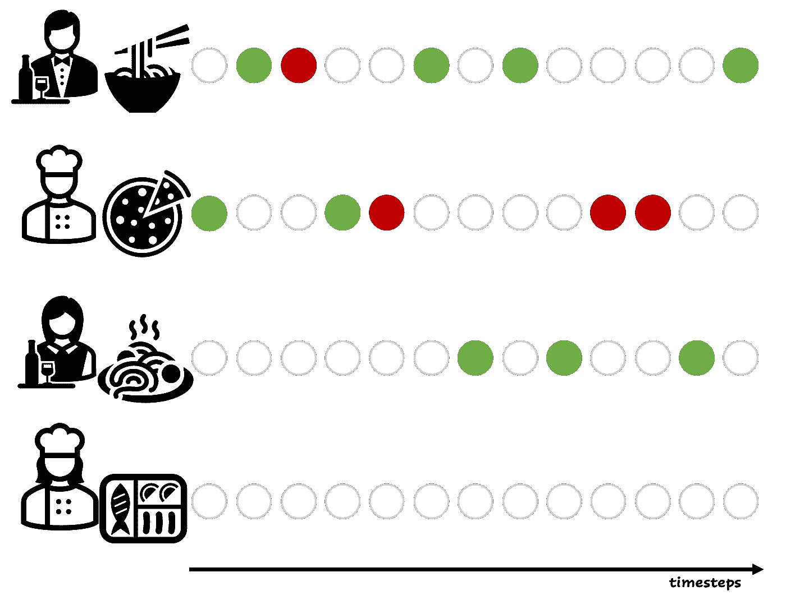
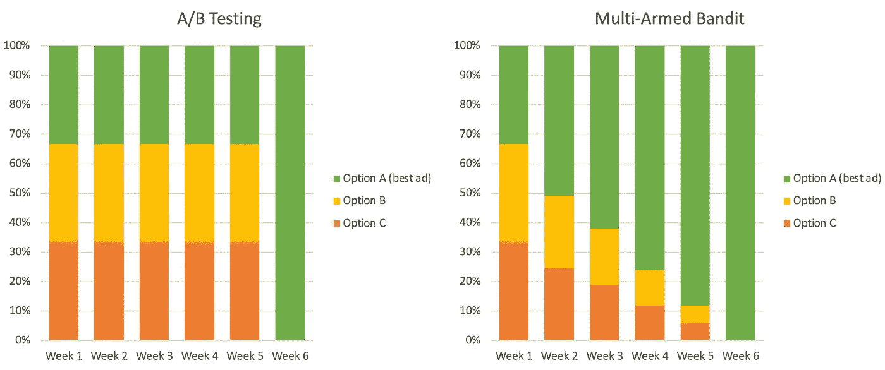
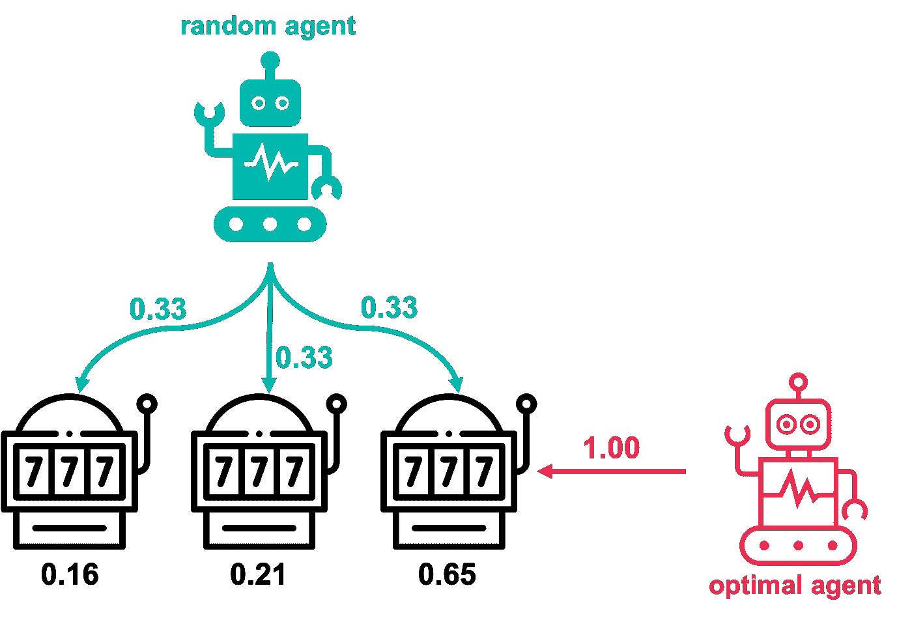
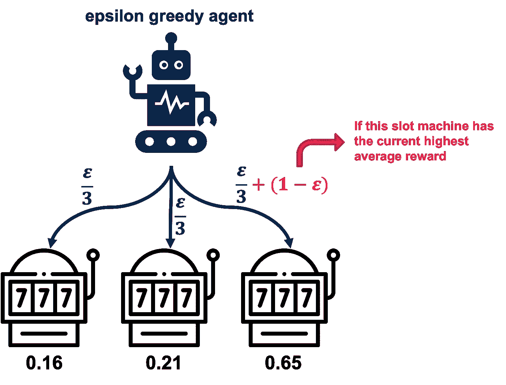
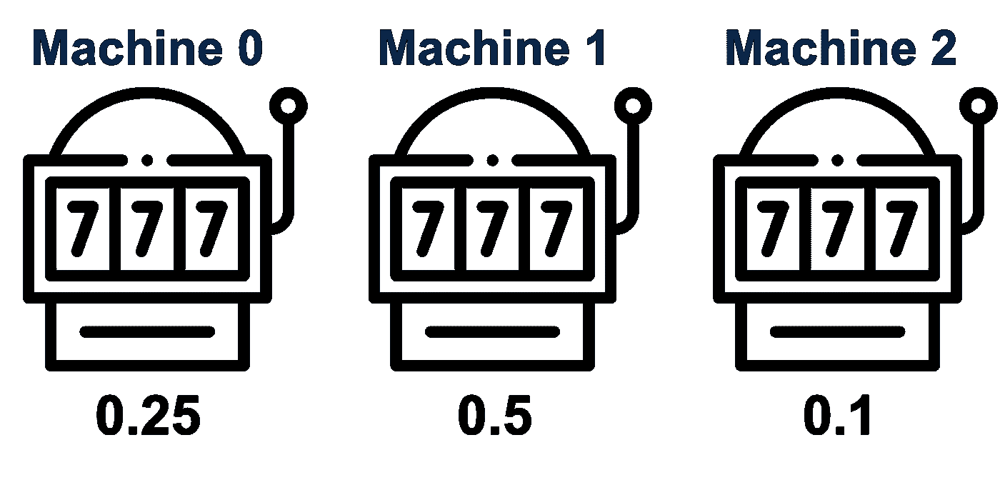
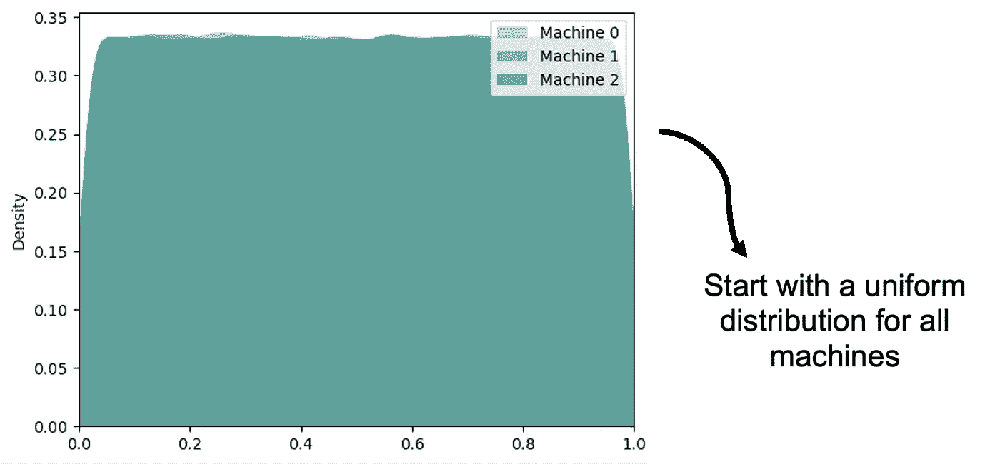
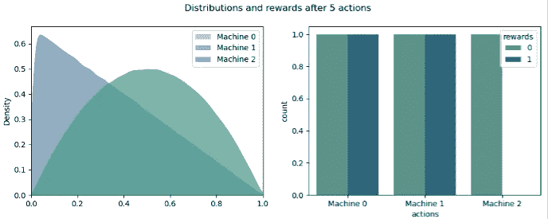
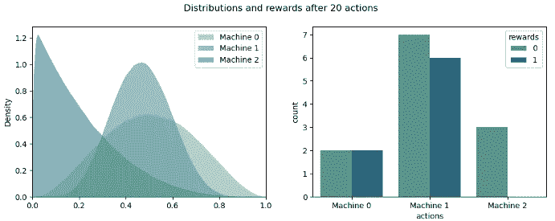
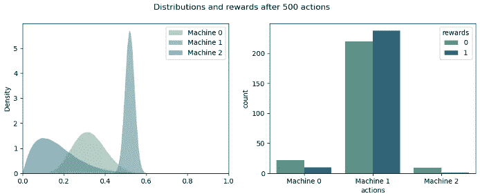

# 解决多臂强盗问题

> 原文：<https://towardsdatascience.com/solving-multi-armed-bandit-problems-53c73940244a>

土匪，图像由 Dall-E 2。

## 一种强大而简单的应用强化学习的方法。

**强化学习是一个有趣的领域，它正在游戏、机器人和金融市场中成长并取得巨大的成就。一个很好的事情是，你不必从深度 Q 学习代理开始！对于某些问题，基于强化学习的原理实现一个简单的算法就足够了。在这篇文章中，我将深入研究多臂土匪问题，并用 Python 构建一个基本的强化学习程序。**

# 强化学习

我们先来解释一下强化学习。这有点像在现实生活中学习:当一个蹒跚学步的孩子清理他的玩具时，他的妈妈很高兴，她给他一颗糖。但是如果一个蹒跚学步的孩子打了他的妹妹，他的妈妈会生气，他会受到惩罚。蹒跚学步的孩子采取行动，并因其行为受到奖励或惩罚。

你可以把蹒跚学步的孩子比作强化学习代理。在强化学习系统中，代理与环境交互。代理选择一个动作，并以状态(或观察)和奖励的形式接收来自环境的反馈。奖励可以是正面的，也可以是负面的，比如糖果和惩罚。这种循环一直持续到代理以终止状态结束(游戏结束)。然后新一集的学习就开始了。代理的目标是在一集里最大化总的回报。示意性地看起来是这样的:

强化学习:代理通过选择动作和接收观察(或状态)和奖励来与环境交互。图片作者。

# 什么是多臂土匪问题？

想象一下，你今晚想和一个好朋友去餐馆吃饭。轮到你选择餐馆了。当然，你想要一个有好食物(和好服务，但是为了简单起见，我们只看食物)的餐馆。你选择你最喜欢的餐馆，因为你知道你喜欢那里的食物吗？或者你会选择一家新餐馆，因为这家新餐馆的食物可能会更好？选择一家新餐馆，你也有更高的风险得到负面的回报(糟糕的食物)。

这是一个多臂土匪问题的例子。在每一个时间点，你都必须做出选择(也就是行动)，你可以决定*利用*你的经验，选择你熟悉的东西。但是你也可以*探索*新的选择，拓宽你的经验(和知识)。

餐馆的经历。在每个时间点，你选择一家餐馆。绿点代表积极的体验，红点对应消极的体验。你会选择积极体验比例最高的餐厅，还是尝试一家新餐厅？图片作者。

多臂强盗这个名字来源于赌场的老虎机，一个独臂强盗对应一个老虎机。因此，对于多台老虎机，您需要知道拉动哪个杠杆才能获得最大金额。你可以决定尝试一个新的老虎机，探索，或者你可以利用你过去的经验。探索和利用对于任何强化学习问题都是重要的概念，在接下来的段落中会有更多的介绍。

一个双臂强盗？艾莉森·巴特利在 [Unsplash](https://unsplash.com?utm_source=medium&utm_medium=referral) 上的照片

# 现实生活中的多武装土匪

除了选择餐馆或吃角子老虎机，还有其他现实生活中的应用，多臂土匪是有用的。它们已经证明了自己在推荐系统和异常检测等方面的价值。以下是一些实际例子:

## [评选最佳广告](https://www.economics.uci.edu/~ivan/asmb.874.pdf)

A/B 测试在网络广告中很常见。在 A/B 测试中，人们会看到不同的广告。点击量高得多的将是最成功的，其他的将被删除。用于选择最佳广告的多臂土匪工作如下。行动是选择一个广告。在开始时，选择广告的概率是相等的(探索阶段)，但是将被改变成有利于具有更高点击率的广告(开发阶段)。所以一个更成功的广告会被更多的展示，最终成为唯一的一个。这种方法的优点是你可以在过程的早期就开始利用你的知识，如下图所示:

测试了三个广告，看哪一个表现最好。多臂强盗在过程的早期收到选项 A 的积极反馈，并开始利用他的知识(从第二周开始)。图片作者。

## [临床试验](https://pubmed.ncbi.nlm.nih.gov/27158186/)

华法林是一种抗凝血药(它可以防止血凝块)。很难正确给药。适当的剂量因人而异。如果初始剂量不正确，这是很危险的，可能会导致中风或内出血。一个(上下文相关的)多臂土匪在这方面帮了大忙，他学习并给病人分配了适当的初始剂量。

## [推荐系统](https://link.springer.com/chapter/10.1007/978-3-319-70087-8_83)

在处理向用户推荐最感兴趣的产品时，多臂土匪可以帮忙。这有点像 A/B 测试:你想向用户展示他们感兴趣并愿意购买、放在购物图表中或点击的产品。如果用户点击了一个产品，这意味着这是一个好的产品展示给这个用户(或积极的回报)。通过将此应用于相似的顾客群，就有可能找到向一群顾客展示的最佳商品。

还有[更多的应用](https://arxiv.org/abs/1904.10040)。甚至有可能使用多臂土匪进行更好和/或更快的机器学习！它们用于算法选择、超参数优化(作为贝叶斯优化的改进)和聚类。这显示了该技术的多功能性。

由[布鲁诺·凯尔泽](https://unsplash.com/@bruno_kelzer?utm_source=medium&utm_medium=referral)在 [Unsplash](https://unsplash.com?utm_source=medium&utm_medium=referral) 上拍摄的照片

# 建立多武器强盗代理

当处理一个多武装匪徒问题时，有什么好的方法可以探索和利用？有不同的技术。首先，让我们看看 MABPs 的一些关键概念。

## 行动价值函数与后悔

让我们看看吃角子老虎机的例子。如果 3 台机器的奖励为 1 的概率分别为 0.16、0.21 和 0.65，那么采取的最佳行动是概率为 0.65 的机器(最高)。

老虎机示例。图片作者。

多臂强盗不知道概率，所以首先它会探索，直到它发现只拉老虎机 3 的杠杆就能最大化整体回报(概率 0.65)。一个行动的价值等于预期报酬，即等于该行动的概率:

一个行动的价值等于该行动的预期回报，等于该行动的概率。

因此，3 台老虎机的动作值分别为 0.16、0.21 和 0.65。

遗憾是多臂大盗没有得到的累积奖励，因为探索。吃角子老虎机示例 100 轮的最佳累积奖励将是 0.65 * 100 = 65(仅选择最好的机器)。但是在探索过程中，多臂强盗也会选择其他机器。所以累积回报可能是 0.65 * 60 + 0.16 * 15 + 0.21 * 25 = 46.65。这样的话，后悔就等于 65-46.65 = 18.35。

## 多武器土匪特工

多臂强盗特工的目标是最大化一集的总奖励。代理可以通过不同的方式探索和利用，并获得不同程度的成功。下面，我将讨论其中的一些。

随机最优代理人
一个不太聪明的代理人会在**随机选择每个行动**。不那么聪明，因为它只探索，不使用发现的知识。

相反的是一个**最优**代理，它每次都选择最优的行动。这是不现实的，因为如果我们知道每个强盗成功的概率，我们总是会选择最高的一个，没有必要实现一个代理。这是一个比较(现实的)代理表现如何的好方法。下面描述的所有代理的性能介于随机代理和最优代理之间。

随机最优代理。随机代理随机选择一个强盗，而最优代理只选择成功概率最高的强盗。随机代理给出一个基线。图片作者。

**Epsilon agents** 处理勘探和开发的另一种方式是通过选择“勘探值”Epsilon。如果我们选择ε等于 0.2，大约 20%的行动将被随机选择(探索)。对于其他 80%的动作，代理选择目前为止最好的动作(剥削)。它通过选择行动的最高平均奖励来做到这一点。这个代理叫做**ε贪心**。

ε贪婪代理。图片作者。

对常规 epsilon greedy 智能体的一个改进是在开始时探索更多，随着时间的推移探索更少。这很容易实现，通过添加一个衰变参数，这给了我们**ε贪婪衰变**代理。如果该参数等于 0.99，则每次迭代，ε的值以因子 0.99 减小。这确保了会有一些探索，但随着时间的推移会越来越少，这是有意义的，因为代理获得了知识，当他的知识增加时，探索的需求就会减少。

因为上面描述的 epsilon 代理在很大程度上利用了 T17，甚至在开始时，还有另一种可能的改进。通过将每个动作的初始奖励值设置为可能的最大奖励值(例如，当奖励可以是 0 或 1 时，设置为 1)，代理将更喜欢它没有尝试过这么多的动作，因为代理认为奖励很高。这个代理是**乐观ε贪婪**(带衰变)。这确保了在开始时防止利用不太好的动作。

上置信区间智能体
上置信区间智能体是知道如何处理勘探和开发的智能体。它使用所有可能盗匪的平均奖励进行剥削，就像艾司隆特工一样。然而，一个重要的区别是它如何处理探索。这是通过添加一个参数来实现的，这个参数使用了到目前为止的总时间步长，以及某个土匪被选中的次数。例如，当我们处于时间步骤 100 时，代理仅选择一次动作，该参数为高，确保代理将选择该动作。这样，**置信上限代理**自然地探索它不常探索的行为，同时也利用他的知识。以下是置信上限代理的动作选择公式:

置信上限代理的动作选择。图片作者。

**伯努利·汤普森智能体** 最终的智能体使用了与之前的智能体完全不同的方法，尽管直觉感觉是一样的。当一个强盗被选中的次数越多，汤普森的代理人就越有信心得到奖赏。对于每个土匪，代理跟踪成功的数量 *α* 和失败的数量 *β* 。它使用这些值为每个土匪创建一个概率模型。使用 [beta 分布](https://en.wikipedia.org/wiki/Beta_distribution)从所有盗匪的分布中采样一个值，汤普森代理选择这些采样值中的最高值。

为了更好地理解 Bernoulli Thompson 代理，让我们看看下面的强盗:

代理从等于 1 的 *α* 和等于 1 的 *β* 开始，对于所有盗匪，这等于均匀的β分布(被选择的概率相等):

5 次试验后，分配、行动和奖励如下所示:

机器 0 和 1 具有相同的分布，它们都被选择两次，一次成功，一次失败，而机器 2 被选择一次，奖励为 0。

20 次试验后，如果只看成功率，机器 0 看起来比机器 1 好:

如果我们快进到 500 个动作，代理非常确定机器 1 是最有回报的一个，并且分布的平均值几乎等于机器成功的真实概率(0.25，0.5 和 0.1):

## 代理的比较

在下面的图表中，对代理进行了测试。对于不同数量的试验和盗匪，该实验可以产生不同的结果。很明显，具有衰减的乐观 epsilon 代理、置信上限代理和 Thompson 代理优于其他代理。这正是我们所期望的，因为他们比其他代理更聪明地处理探索。

六个强盗的实验结果(除了随机和最优代理)，这是 50 轮 2000 次迭代的平均累积奖励。点击放大。图片作者。

## Python 代码

你可以在 [my Github](https://github.com/henniedeharder/multiarmedbandits) 上找到不同的多臂土匪代理的实现。有一个测试脚本(笔记本文件)对它们进行比较并绘制结果。

## 多臂强盗的缺点

基本多兵种土匪都想一直在同一个动作中选择。多臂强盗无法应对不断变化的环境:如果老虎机的概率发生变化(或者你最喜欢的餐馆换了一个新厨师)，多臂强盗需要从头开始学习(或者你需要增加探索参数)。

当你有一个以上的状态时，你应该切换到上下文土匪。情境强盗试图根据环境找到最佳的行动，因此他们可以与不同的状态一起工作。

# 结论

多臂匪是应用强化学习的最基本方式之一。它们被广泛应用于不同的领域:金融、广告、健康以及改善机器学习。多兵种强盗特工可以用许多不同的方式进行探索和剥削。他们可以使用随机技术，如 random 和 epsilon 代理。或者他们可以使用更聪明的方法，比如乐观 epsilon 代理、置信上限代理和 Bernoulli Thompson 代理。最终，这一切都是为了发现最佳行动，并最大化整体回报。

在赌场，你会选择哪个代理人做帮手？🤩

由[卡尔·劳](https://unsplash.com/@carltraw?utm_source=medium&utm_medium=referral)在 [Unsplash](https://unsplash.com?utm_source=medium&utm_medium=referral) 上拍摄

# 相关文章

</techniques-to-improve-the-performance-of-a-dqn-agent-29da8a7a0a7e>  </why-you-should-add-reinforcement-learning-to-your-data-science-toolbox-f6d4728afe66>  </snake-played-by-a-deep-reinforcement-learning-agent-53f2c4331d36> 