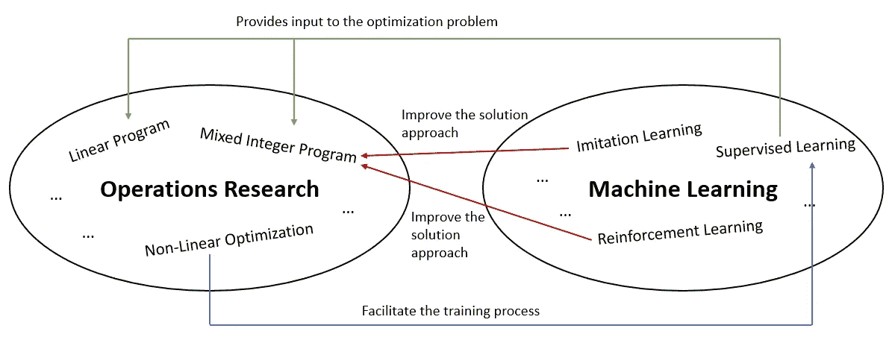
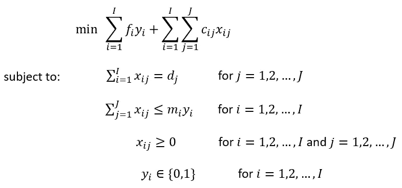
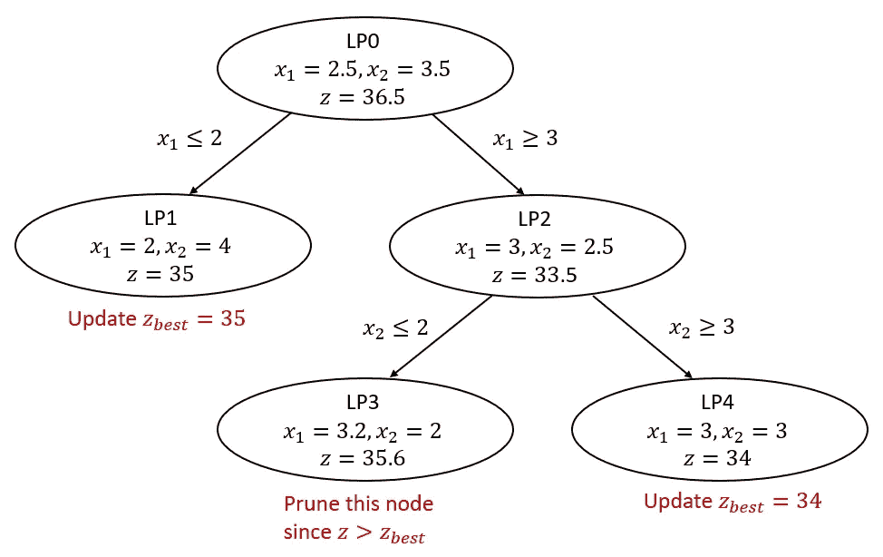

# 关于运筹学和机器学习协同作用的一些思考

> 原文：<https://towardsdatascience.com/some-thoughts-on-synergies-between-operations-research-and-machine-learning-921d78ed4bd5>

## 搭建运筹学和机器学习之间的桥梁

由 [Unsplash](https://unsplash.com?utm_source=medium&utm_medium=referral) 上的 [Modestas Urbonas](https://unsplash.com/@modestasu?utm_source=medium&utm_medium=referral) 拍摄的照片

几十年来，运筹学(or)和机器学习(ML)作为两个相对独立的研究领域取得了进展。数据科学和人工智能领域的人可能比 OR 更熟悉 ML，尽管每个 ML 从业者都应该知道至少一些优化技术，因为每个机器学习问题本质上都是一个优化问题。在本文中，我将把 OR 和 ML 视为一个整体主题，回顾它们之间的联系，并分享这两个领域之间协同作用的一些最新进展，以充分利用这两个领域的优势。

作为预览，下图从三个角度说明了 OR 和 ML 之间的联系:OR 帮助训练 ML 模型，ML 为 OR 提供输入，ML 改进 OR 的解决方法。以下段落将详细阐述这三个方面。

说明 OR 和 ML 之间相互作用的图表(图片由作者提供)

# 或者帮助训练 ML 模型

OR 的核心是优化。或者研究人员开发了许多技术来寻找决策变量的最优值，以最小化或最大化手头的目标函数。根据优化问题是否有约束，优化问题可以分为约束优化和无约束优化。基于目标函数和约束的公式化，优化问题可以粗略地分为线性优化和非线性优化。

也许 ML 中最常遇到的优化问题是非线性优化，因为对于监督学习中的分类(例如，交叉熵)和回归(例如，均方误差)，损失函数相对于 ML 模型的参数通常是非线性形式。基于梯度下降的算法在解决这些问题时通常是有效的。如果正则项存在，我们最终会遇到一个受约束的非线性优化问题(例如，岭回归、LASSO、支持向量机)。在这种情况下，我们应用[拉格朗日乘数](https://en.wikipedia.org/wiki/Lagrange_multiplier#:~:text=In%20mathematical%20optimization%2C%20the%20method,chosen%20values%20of%20the%20variables).)并对原始约束优化问题的[拉格朗日松弛](https://en.wikipedia.org/wiki/Lagrangian_relaxation)进行工作，这是处理复杂约束的典型 OR 技术。例如，在岭回归中，我们试图解决下面的问题:

其中 *y* 是输出变量的观测值的向量， *X* 是输入变量的观测值的矩阵， *b* 是要拟合的系数的向量， *t* 是用于控制正则化水平的参数。直接求解这个公式并不容易，所以我们应用一个拉格朗日乘数λ，并将原始公式转换为它的拉格朗日松弛:

这进一步简化为:

现在可以应用无约束优化技术来获得 *b* 的最优值。

每个 ML 问题本质上都是一个以损失函数为目标函数，模型参数为决策变量的优化问题。在这个意义上，OR 增强了 ML，因为对非线性优化问题的更好的解决方法无疑提高了机器学习模型的训练过程的准确性和效率。本文开头给出的图表中的蓝色箭头说明了 OR 和 ML 之间的这种交互。

# ML 向 OR 提供输入

与 ML 中 OR 技术的应用不同，现实世界应用中的主要 OR 模型是线性规划(LP)和混合整数线性规划(MILP)模型。LP 问题是具有线性目标函数和线性约束的优化问题，其中决策变量可以取连续值。虽然 MILP 问题也有线性目标函数和线性约束，但它的一些决策变量必须取整数值。LPs 和 MILPs 在各个行业都有广泛的应用。例如，在供应链管理中，MIPs 通常用于设施位置选择、生产计划和车辆路线安排等..这类问题通常具有线性成本函数作为目标函数，具有满足客户需求、确保资源最小利用率等大量约束..事实上，OR 从业者倾向于不将现实世界的问题公式化为非线性优化问题，因为它们解决起来要复杂得多，尤其是有许多约束的情况下。

在这样的应用中，ML 模型，主要是监督学习模型，通常用于提供 LP 和 MILP 模型中已知参数的估计。例如，在供应链管理领域，我们可以建立一个监督学习模型来预测客户需求，然后该模型成为 LP 和 MILP 模型的约束条件或目标函数中的一个已知参数。客户需求预测可以是点估计，也可以是概率估计，这与确定性或随机优化问题有关。由于 ML 模型会影响 OR 应用输入参数的准确性，因此 ML 模型的质量也会影响 OR 应用的成败。OR 和 ML 之间的这种相互作用由本文开头给出的图表中的绿色箭头来说明。

下面，我将通过一个设施位置选择问题的简单示例来说明 ML 模型的输出如何作为 MILP 的输入。让我们假设一家公司想要考虑在 *I* 候选地点中建立配送中心，将他们的成品运送给 *J* 的客户。每个站点 *i* 都有其相应的存储成品的容量，最多可存储 *m_i* 单位的产品*。*建造每个地点 *i* 需要固定的建造费用 *f_i.* 将每单位产品从地点 *i* 运送到客户 *j* 到*T21*c _ ij。*每个客户 *j* 都有一个 *d_j* 的需求，所有客户的需求都必须得到满足。设二进制变量 *y_i* 表示我们是否在站点 *i* 建造设施，并且 *x_ij* 表示从站点 *i* 向客户*j*装运的产品量。以最小化总成本为目标的优化问题可以表述如下:*

设施选址问题的数学公式(图片由作者提供)

这里， *y_i* 和 *x_ij* 是代表我们需要做出的决策的决策变量，在我们试图解决问题之前是未知的。其他变量是已知的参数，在我们试图解决问题之前必须知道这些参数。ML 在这个问题中的作用是它可以提供需求预测，对 *d_j.* 需求预测属于时间序列预测的范畴，因为需求数据通常以时间序列的形式出现。各种算法，从传统的时间序列模型(例如，ARIMA，指数平滑等。)到 ML 模型(例如，LightGBM、神经网络)可在此应用以获得 *d_j 的合理估计。* ML 模型也可用于获得其他参数的估计，如 *c_ij、f_i、*等。，但我个人在预测需求方面看到的应用比其他参数多。上述优化问题可以用任何商业求解器解决，如 [CPLEX](https://www.ibm.com/analytics/cplex-optimizer) 、 [Gurobi](https://www.gurobi.com/) 和 [Xpress](https://www.fico.com/en/products/fico-xpress-optimization) ，以及非商业求解器如 [SCIP](https://www.scipopt.org/) 。

# ML 改进了 OR 的求解方法

正如 OR 影响 ML 的训练过程一样，ML 也可以在 OR 模型的求解过程中发挥作用。近年来，利用 ML 提高求解混合整数规划(MIPs)的[分支定界](https://en.wikipedia.org/wiki/Branch_and_bound)算法的效率的研究兴趣越来越大。分支定界是一种广泛用于求解 MIPs 的算法，其工作方式类似于树搜索算法。假设我们正在解决一个最小化问题。在根节点，该算法求解原始问题的 LP 松弛(在 MIP 中丢弃完整性约束将原始问题转换成它的 LP 松弛)。然后从根节点发展两个分支，产生两个新节点，并且使用最接近的整数向每个分支添加附加约束。下图简要说明了在分支定界算法中开发分支的过程。

一个简单的图表来说明分支定界算法(图片由作者提供)

以上图为例，如果在根节点(即 LP0)原问题的 LP 松弛的最优解中 x_1 = 2.5，我们选择在其上分支，我们将 x_1 ≤ 2 加到第一个分支，x_1 ≥ 3 加到第二个分支。然后在每一个新节点，我们用增加的约束来解决产生的 LP 松弛问题。上面的过程被称为分支，我们在开发树的时候重复这个过程。如果带有完整性约束的决策变量都是整数，那么我们到达一个叶子节点。

请注意，在搜索树时，每当我们在一个节点遇到整数解时，我们就更新当前的最佳解。当前最佳解决方案提供了 MIP 的最佳目标值的上限。如果在特定节点处，LP 松弛具有大于当前最佳解的最优目标值，则无需进一步探索该节点，并且该节点将被修剪。这种修剪过程通过消除到达树的每个叶节点的必要性，显著地帮助减少了树搜索工作。

然而，即使有剪枝，实际问题通常是如此之大，以至于执行分支定界算法的普通版本仍然相当耗时。研究人员已经提出了几个改进品牌和边界算法的想法。一个想法是在一些节点上增加对 LP 松弛的削减。截是可以排除非整数解，但不能排除整数解的约束。通过在一些节点上添加切割，我们可以缩小 LP 松弛的可行区域，并且通过求解 LP 松弛更容易找到整数解。遵循这种思想的算法叫做分支切割算法。

添加切割是一个好主意，但有时找到好的切割本身也是一项重要的任务。在这种情况下，对一些节点应用试探法对于寻找整数解非常有用。一种常用的试探法是松弛诱导邻域搜索(RINS)。这种启发式方法查看当前节点处 LP 松弛的当前最佳整数解和分数解，固定两个解一致的决策变量的值，并将其余决策变量作为子问题求解。

注意，每个整数解提供了原始 MIP 的最优解的上界(假设解决了最小化问题)，并且在活动节点(未被修剪的节点)处的 LP 松弛的每个分数解是原始 MIP 的最优解的下界。因此，添加切割有助于改善下限，应用试探法有助于改善上限，这一起有助于分支和界限算法更快地收敛。

回到 OR 和 ML 之间的交互，使用 ML 改进分支定界算法的核心思想是将 ML 应用于:

1.  学习分支——在节点上分支哪个决策变量
2.  学会削减——如何找到有效的削减来增加 LP 放松
3.  学会寻找好的启发法——帮助找到更好的整数解
4.  学习配置优化求解器的参数化-如何配置求解器(例如，终止标准、应用试探法的频率)，以便更快地解决问题

通常需要一大组 MIP 来训练 ML 模型，然后 ML 模型将其所学应用于感兴趣的特定 MIP 实例。

利用最大似然法求解 MIPs 是一个新兴的研究课题，大部分工作都集中在理论研究上，而不是在商业或非商业 MIPs 求解器中的实际实现。下面是一个有用的资源列表，您可以从这个角度了解更多信息。

1.  [ML4CO](https://www.ecole.ai/2021/ml4co-competition) 是与此题目相关的竞赛，致力于鼓励使用 ML 解决组合优化(一个与整数规划大致相同的概念)问题。这项比赛向参与者提出了三项任务的挑战:原始任务、对偶任务和配置任务，每项任务都侧重于分支定界算法的不同方面。假设求解最小化 MIP，原始任务要求参与者使用 ML 在根节点找到更好的整数解，以降低最优解的上限。双重任务要求参与者关注如何用 ML 进行分支决策，以增加最优解的下限。最后，在配置任务中，参与者试图使用 ML 为非商业求解器 SCIP 找到更好的参数化来求解 MIPs。
2.  论文“ [*《组合优化的机器学习:方法论之旅 d'Horizon*](https://arxiv.org/abs/1811.06128) ”提供了利用 ML 技术解决组合优化问题的尝试的综述。作者总结了使用 ML 解决组合优化问题的两个动机:从专家给出的**演示**中学习，以在搜索最优解的同时做出决策(例如，分支定界算法中的分支决策);从**经验**中学习，这可能导致探索做出决策(例如，分支决策)的新策略，以推进技术水平。第一个概念与模仿学习一致，第二个概念与强化学习一致。本文开头给出的图中的红色箭头从这个方面说明了 OR 和 ML 之间的交互。
3.  另一篇值得注意的论文是由 Google DeepMind 团队撰写的“ [*使用神经网络*](https://arxiv.org/abs/2012.13349) 求解混合整数程序”，其中创建了 MIPs 的图形表示，并且使用神经网络来为整数变量生成部分赋值(神经驱动)并学习做出分支决策(神经分支)。在使分支定界算法更有效方面获得了有希望的结果。

# 结论

在本文中，我从三个角度分析了 OR 和 ML 之间的联系。虽然对于前两种观点，实际实现中已经有成熟的技术，但最后一种观点仍然需要更多的研究工作来实现实际和可扩展的实现，但它非常有前途。OR 和 ML 在本质上是紧密相连的，并将随着两个领域的推进而齐头并进。很可能在未来 OR 和 ML 之间还会有其他更有趣、更令人兴奋的协同作用。