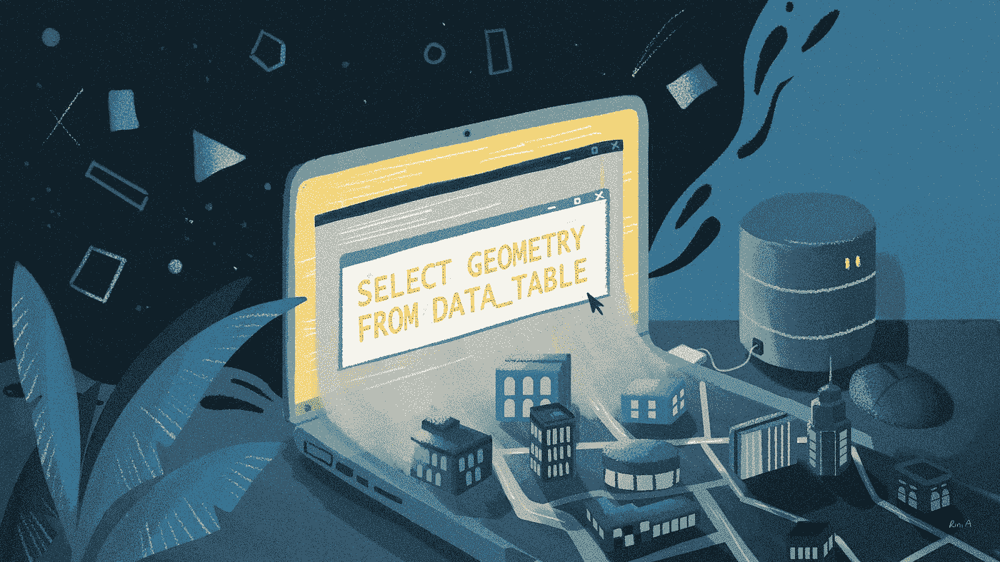
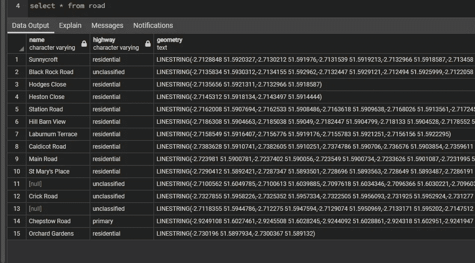
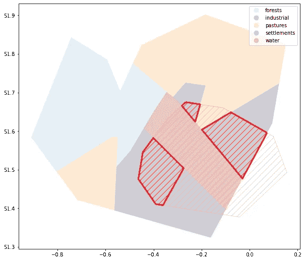
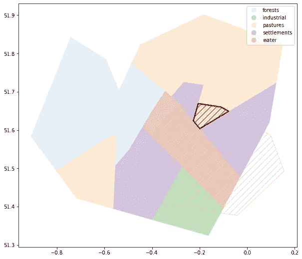
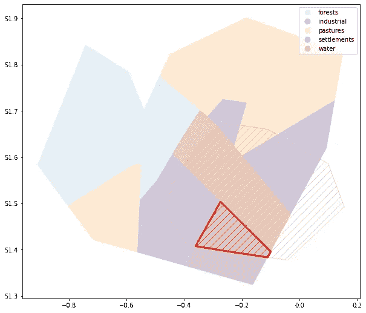
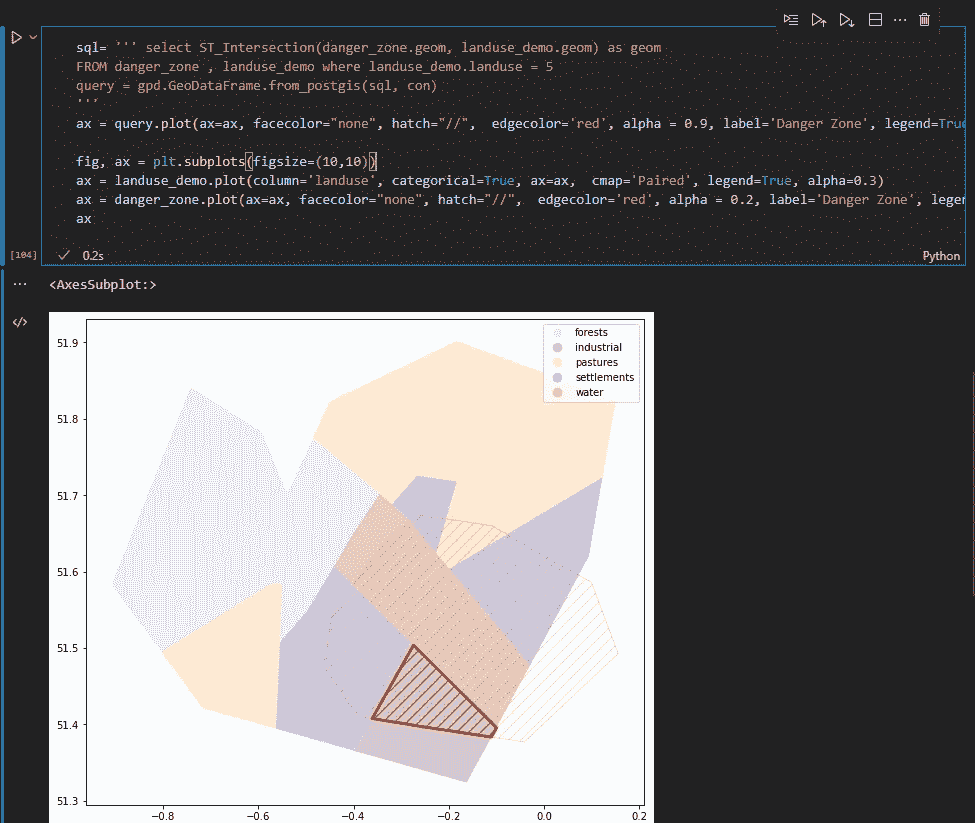
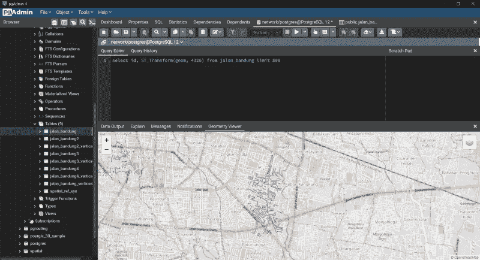

# 空间数据科学:空间查询

> 原文：<https://towardsdatascience.com/spatial-data-science-spatial-queries-8d6709fd9747>



里尼和作者(2022)

## 用 SQL 回答每个“在哪里”的问题；举例说明

# 介绍

我们通常通过地理过程(如 ArcGIS 和 Qgis 中的缓冲区、联合和相交)逐个过程地进行适宜性分析。单击一个工具按钮，创建一个输出，并将其用作其他流程的输入。这导致在你的缓存文件夹中有许多暂存文件，从而产生了记住使用哪些文件的奇迹。对于像这样简单的适宜性分析，从技术上讲，我们可以在 ArcGIS 和 Qgis 中使用模型构建器，但更好的方法是以更易于计算机解析的方式来表达我们的适宜性请求。

适宜性分析只是我们对空间数据集提出的一组要求，例如:

我想寻找土地开发成农场，所以我们有这样一套说明:

*   获取非保护区和可耕地之间的交集
*   从交叉点，查询所有现有的空地土地使用
*   从那些确定的空地中，过滤掉那些不在 1 公里灌溉范围内的空地，以保证农场的用水

有一种方法可以翻译这些指令，只需单击一次“enter”就可以从我们所有的数据集中进行查询。

# SQL —结构化查询语言

对于本文上下文，结构化查询语言(SQL)是一种将查询数据参数表达成数据库管理员能够理解的指令的语言。我们可以做得更多，但就目前而言，这个解释就足够了。它是一个指令；请求数据库返回我们想要的数据。相信大家都已经知道什么是数据库了。

SQL 看起来怎么样？它看起来像这样:

```
SELECT * FROM land_use
```

这意味着“从 land_use shapefile 中选择所有列”。不是 shapefile 本身，而是来自`land_use`表(包含地理信息)。另一个例子:

```
SELECT name, length, geometry FROM irrigation WHERE length < 2000
```

这意味着“返回长度小于 2000 的灌溉线，但只有列名、长度及其几何图形”。这省略了除名称、长度和几何图形之外的其他列，因为灌溉表可能包含许多不必要的列，如类型、开发者等等。返回太多的列会导致不必要的带宽和大量计算资源的消耗。



空间表中的 SQL 示例(来源:作者，2022)

## 这个想法

**我们的想法是制定查询指令，使其返回满足我们查询的空间数据。**这意味着我们字面上键入指令；使未来的分析师能够审计我们的流程并复制它。这也有助于我们跟踪我们一直在做的事情。看看 PostGIS 文档中的一些空间查询示例。

空间查询的一些示例(从 where 开始):

*   我应该住在哪里？
*   我应该在哪里开我的新店？
*   工业区旁边的住宅区在哪里？
*   我的办公室应该搬迁到广告中的物业吗？
*   濒危动物在哪里？
*   如果我建造一条高速铁路，这会对该地区的生物多样性产生什么影响？

## 空间查询

当我们在 SQL 脚本中引入空间查询函数时，空间查询就开始了。这些功能因软件而异，但我认为最流行的是带有 PostGIS 扩展的 Postgresql，或者我们称之为(只是)Postgis。我将在本文末尾讨论 PostgreSQL。其他软件也提供这种能力；例如使用 Google BigQuery 或 Microsoft SQL Server。

以下脚本是 postgis 中 SQL 的官方示例。

```
WITH city AS 
(SELECT 'Gotham' AS name,  ST_Buffer(ST_Point(0,0), 10) AS geom),superhero(name,geom) AS (VALUES
('Bat Boy', ST_Point(0.1,0)), 
('Bat Girl', ST_Point(1,1)))SELECT superhero.name FROM city INNER JOIN superhero ON ST_Contains(city.geom, superhero.geom);
```

[你可以在这个官方参考文档](https://postgis.net/docs/reference.html)中看到所有的函数和操作符。像 buffer、union 和 clip 这样的常用工具就在那里！

让我们开始行动吧

# 案例:使用空间 SQL 识别濒危住区

假设有一个城市很容易发生洪水之类的自然灾害，但我们不知道哪个居民区处于危险之中。我们需要为这些市民制定缓解措施，但我们不知道为谁。

我们有土地利用数据，还有洪水危险区(红色散列多边形)。当我们叠加数据时，就产生了这张地图。


案例数据(来源:作者，2022 年)

这对我们来说很容易理解，但在现实生活中，这可能是一个地区或一个省的大小；大到我们的大脑无法理解。

这里我们可以看到，定居点和危险区之间有重叠；我们如何获得那块区域？换句话说，**哪些地方是容易发生洪水的聚居地？**

## 普通的方式

常见的方法是

*   根据土地使用数据的属性进行选择，其中土地使用等于“定居点”(顺便说一下，这实际上是 SQL)
*   选择仍处于活动状态时，打开裁剪/相交工具
*   将所选土地利用设置为输入，将危险区域设置为相交要素
*   执行交集，并将结果保存在内存或某个目录中

现在让我们用空间 SQL 来做这件事

## 更好的空间 SQL

使用空间 SQL 函数创建 SQL 脚本:`ST_Intersection()`如下

```
select **ST_Intersection**(danger_zone.geom, landuse_demo.geom) as geom FROM danger_zone , landuse_demo where landuse_demo.landuse = settlements
```

并且结果如下层(回答危险区的居民点在哪里？).



(来源:作者，2022)

# 看起来更复杂，为什么要这么麻烦呢？

有几个主要原因:

*   速度和性能:更快地完成工作，加载您不需要的所有数据！
*   再现性和责任性:记录和了解你所做的事情
*   多功能性:灵活，可与其他应用程序互操作。
*   问责:审计脚本更容易，因为它是流程的文字形式，而不是流程图。

这是复杂性和灵活性之间的权衡，但如果以上几点是您正在寻找的，这是一个选项。

让我们进一步讨论原因

## 速度和性能

每次执行 SQL 时，我都会生成一个地图。因此，转换标准来制作地图将会非常快**。**

**现在，我想将标准从定居点切换到工业区，我可以像这样编辑脚本的结尾**

```
select ST_Intersection(danger_zone.geom, landuse_demo.geom) as geom FROM danger_zone , landuse_demo where landuse_demo.landuse = **pastures**
```

**请注意，我将最后的`landuse`参数从 settlement 切换到 industrial。结果现在是这样的**

****

**(来源:作者，2022)**

**或者像这样切换到`industrial`。**

```
select ST_Intersection(danger_zone.geom, landuse_demo.geom) as geom FROM danger_zone , landuse_demo where landuse_demo.landuse = **industrial**
```

****

**(来源:作者，2022)**

**这只是掌握空间 SQL 概念的一个简单例子。在自动化至关重要的开发环境中，这种脚本是一种提高性能的技术。我甚至没有使用 QGIS 或 ArcGIS 来制作您看到的地图。**所有这些都可以通过一个显示器和一个键盘来完成(**)，前提是你在 PostGIS 服务器上有高质量的数据，但是，嘿，这是另一篇文章的不同故事 **)** 。**

****

**Geopandas 中的 Postgis SQL，(来源:作者，2022)**

**执行 SQL 会在不加载整个数据集的情况下生成图层。你不需要加载 4 GB 的 shapefile 然后过滤它；只要输入你想看的东西，图层就在你的画布上了。你做错什么了吗？只需更改查询脚本。**

**想象一下用老方法做，你必须再次点击工具，当事情变得复杂时，你会迷失方向。当然，我们可以用模型构建器来实现这一点；它是这类脚本的图形化表示。当然，如果这对你有用，这也没什么不好；但是很多时候，一旦我学会了如何写脚本，我就不喜欢点击按钮了。**

**我们还将处理任务切换到服务器，而不是我们的机器。当数据复杂且庞大，但我们没有一台非常强大的计算机时，这非常有用；虽然这意味着我们需要一个更可靠的服务器。但是，嘿，这就是为什么我们有云计算！**

## **多功能性、可复制性和责任性**

**因此，空间 SQL 实现了通用性和可再现性。我可以把这个脚本给我的同事，他们执行的时候也会有同样的结果。同事们可以看到我们在做什么，并在 git 工作流环境中协作编辑脚本。从我个人的经验来看，一旦你熟悉了 SQL 和脚本环境，你会变得非常快，对你的分析更加负责。当事情出错时，我们可以追溯我们做了什么，只需读取我们执行的指令。**

**它是通用的，因为我们可以复制 SQL 脚本来开发许多应用程序。SQL 是通用语言；我们可以在 javascript web-gis 应用程序上传递它，比如传单/OpenLayers，或者作为服务器端的视图传递它。与在 GUI 桌面工作流环境中点击按钮或步骤的模糊指示相比。对于桌面环境，您只能在软件、操作系统和软件版本中实现。从 ArcGIS 切换到 QGIS，说明会有所不同；但不是用 SQL 脚本，会是一样的！**

# **将查询加载到 GIS 图层**

**在 QGIS 中执行 SQL 并以图层形式查看结果是可能的。如果你正在使用 Qgis 3.2 以上，有一个工具可以做到这一点。该工具的名称是使用 PostgreSQL 作为数据库引擎来执行和加载 SQL。**

****

**QGIS 的 SQL 提示截图(来源:作者，2022)**

**我们可以键入我们的 SQL 指令，工具会返回我们所请求的内容。**

**顺便说一下，我们一直在用 PostgreSQL 和 postgis 讨论 SQL 但是什么是 PostgreSQL 呢？**

# **PostgreSQL 和 Postgis — RDBMS**

**PostgreSQL 是一个数据库管理器。像 ArcGIS 中的 ArcCatalog 或 Qgis 中的浏览器一样查看它。它旨在用于一般的数据库目的，但通过其扩展 Postgis，我们可以从引擎中获得空间数据功能。如果我们开发一个 web-gis 应用程序，通常的做法是使用 PostgreSQL 作为存储数据的数据库引擎。出于 GIS 的目的，人们通常只说 PostGIS 而不是 PostgreSQL，尽管 Postgis 并不是真正的引擎。只是更朗朗上口，更优雅！**

**"您是否将空间数据保存在 shapefile 或地理数据库中？"**

**“不，我将它存储在我的 PostGIS 服务器中”(:**

****

**使用 PgAdmin for PostgreSQL 管理空间数据(来源:作者，2022)**

# **结论**

**SQL 是我们构造查询的方式，这样计算机就能理解我们的问题，从而给出答案。SQL 本身并不是 GIS 的专属。它是数据科学社区中使用的通用语言，而空间数据恰好是包含地理信息(如坐标和高程)的普通数据。Postgis 允许我们在 SQL 中考虑空间数据之间的交互。**

**然而，欣赏空间交互性需要一般数据科学中的一个额外步骤，正如我提到的，通常是空间不可知的。这种交互性可通过 Postgis 使用空间 SQL 进行查询，从而确保再现性和分析保证。这是一种对空间数据建模的方法和处理空间数据的技术。**