# 使用虚构数据的空间回归

> 原文：<https://towardsdatascience.com/spatial-regression-using-fabricated-data-bbdb35da4851>

## R 中建模的另一个维度

关于空间回归建模、处理地理数据以及根据位置坐标制作精美的数据图，已经有很多帖子可用。对我来说，我无意发表关于空间回归的文章，实际上我正忙于探索使用[制作包](https://declaredesign.org/r/fabricatr/)轻松模拟分层数据的方法。这让我想到了一个包含空间数据的示例，并进一步探索了处理包含空间协方差矩阵的数据的方法。所以，我在这里，写下了它。

这不是一个全面的帖子，但它确实展示了空间回归的一些关键元素。以及如果数据实际上不包含任何东西，为什么花哨的技术没有任何作用。让我们一起来看看和探索吧！

```
library(fabricatr)
library(lattice)
library(sf)
library(mapview)
library(data.table)
library(tidyverse)
library(sp)
library(gstat)
library(geoR)
library(viridis)
library(ggExtra)
library(grid)
library(gridExtra)
library(GGally)
library(MASS)
library(mgcv)
library(tidymv)
library(sjPlot)
library(lme4)
library(wakefield)
library(simsurv)
library(forecast)simulated_quake_data <- fabricate(
  data = quakes,
  fatalities = round(pmax(0, rnorm(N, mean = mag)) * 100),
  insurance_cost = fatalities * runif(N, 1000000, 2000000))
head(simulated_quake_data)
simulated_quake_data<-simulated_quake_data%>%
  group_by(lat, long)%>%
  mutate(mag=mean(mag),
         fatalities=mean(fatalities),
         insurance_cost=mean(insurance_cost))%>%
  distinct(., lat,long, .keep_all= TRUE)
table(duplicated(simulated_quake_data[,c(1,2)]))
```

所以，把我带到现在这个位置的数据集就是地震数据集，你可以用**制作**包来扩充它。看起来是这样的:


现在，没有一个空间模型喜欢重复的位置数据，所以你需要去掉它。


然后是一些精美的图形，显示数据实际上是从哪里来的。它清楚地显示了斐济地区的地震。糟糕的是数据没有时间成分。这将使建模变得更加有趣。

```
mapview(simulated_quake_data, 
        xcol = "long", 
        ycol = "lat", 
        crs = 4269, 
        grid = FALSE)
```

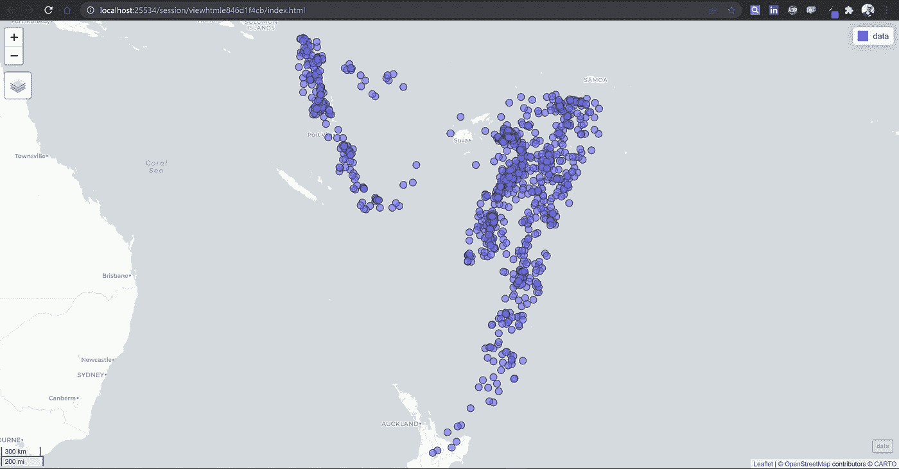

不错的叠加数据。图片作者。

```
sbux_sf <- st_as_sf(simulated_quake_data, 
                    coords = c("long", "lat"),  
                    crs = 4326)
plot(st_geometry(sbux_sf))
```


相同的图形，但没有覆盖。图片作者。

```
sqbin <- ggplot() +
  geom_bin2d(
    data=as.data.frame(st_coordinates(sbux_sf)),
    aes(x=X, y=X))+theme_bw()
hexbin <- ggplot() +
  geom_hex(
    data=as.data.frame(st_coordinates(sbux_sf)),
    aes(x=X, y=Y)) +
  scale_fill_continuous(type = "viridis")+theme_bw()
grid.arrange(sqbin, hexbin, ncol=2)
ggplot(sbux_sf, aes(x=mag))+
  geom_histogram(bins=50, aes(y=..density..))+
  geom_density(fill="#FF6666", alpha=0.5, colour="#FF6666")+
  theme_bw()
```

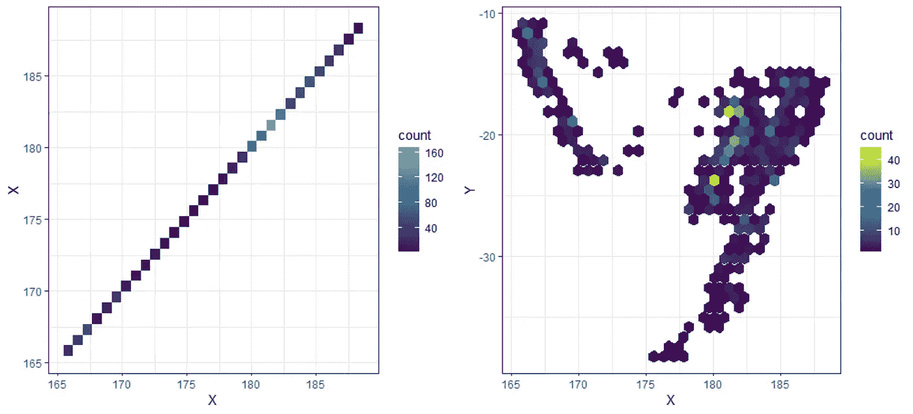

数据被分类，用六边形来观察大多数地震发生的地方。图片作者。

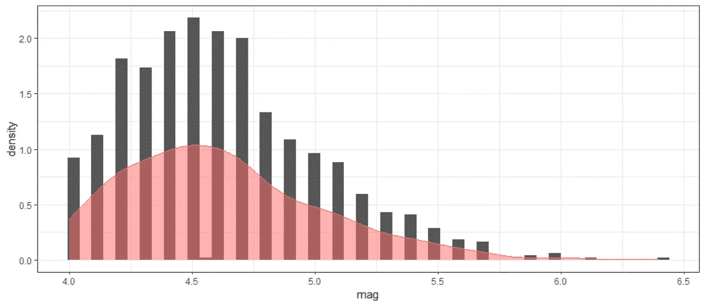

数量的密度。图片作者。

```
ggplot(data = sbux_sf) +
  stat_density2d_filled(
    data = as.data.frame(st_coordinates(sbux_sf)),
    aes(x = X, y = Y, alpha = ..level..),
    n = 16) + 
  scale_color_viridis_c() +
  theme_bw() +
  labs(x="Longitude", y="Latitude")+
  geom_sf(alpha=0)+
  theme(legend.position = "none")
```

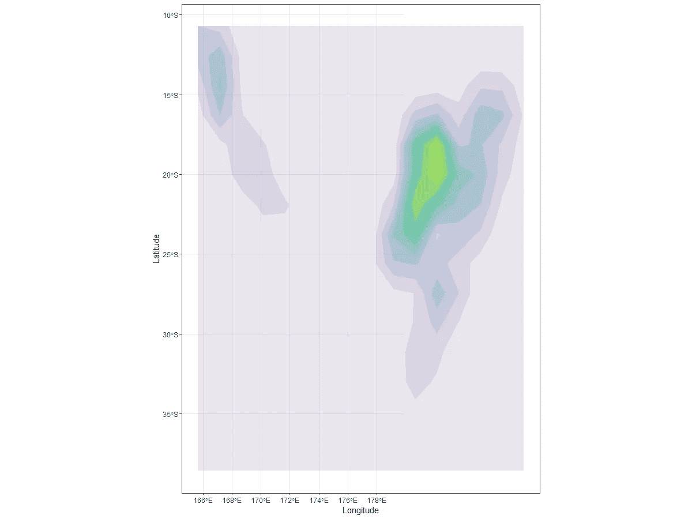

另一种方法是根据纬度和经度绘制数据。在创建图表的过程中似乎出现了一些问题，因为我没有得到坐标轴上的所有数据。图片作者。

在这里，另一种方法是连接数据上的点，并使用纬度和经度坐标来建立几何点和模型，预测和绘制数据。使用的模型应用了[反距离加权](https://rpubs.com/Dr_Gurpreet/interpolation_idw_R)，尽管也可以使用许多其他方法，例如[克里金法](/building-kriging-models-in-r-b94d7c9750d8)。

```
sd.grid <- sbux_sf %>%
  st_bbox() %>%
  st_as_sfc() %>%
  st_make_grid(
    n = 100,
    what = "centers"
  ) %>%
  st_as_sf() %>%
  cbind(., st_coordinates(.))
idw.hp <- idw(
  mag ~ 1, 
  locations = sbux_sf, 
  newdata=sd.grid,
  nmax = 150)
idw.hp = idw.hp %>%
  cbind(st_coordinates(.))
g1<-ggplot(idw.hp, aes(x = X, y = Y, fill = var1.pred)) +
  geom_raster() +theme_bw()+theme(legend.position = "none")
g2<-ggplot(idw.hp, aes(x = X, y = Y, fill = var1.pred)) +
  geom_raster() +
  scale_fill_viridis_b() +
  theme_void() +
  geom_sf(alpha=0)+theme(legend.position = "none")
grid.arrange(g1,g2)
```

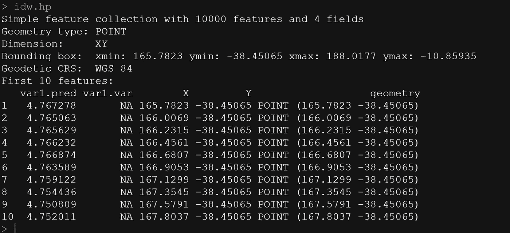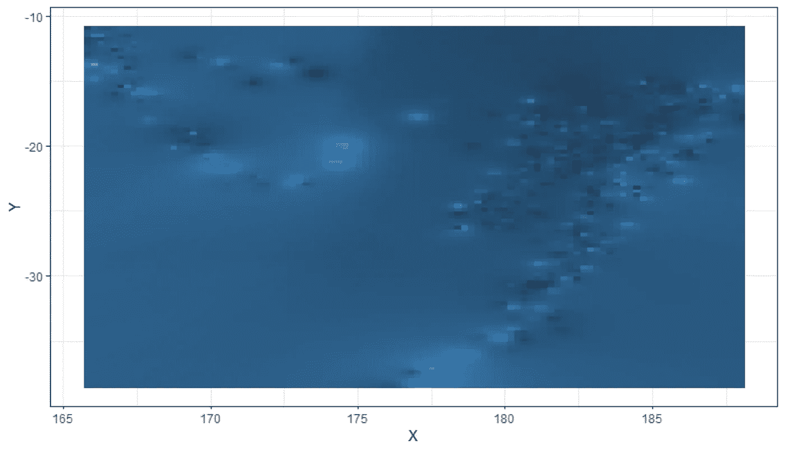

不错的绘图——您可以绘制斐济群岛的轮廓。图片作者。

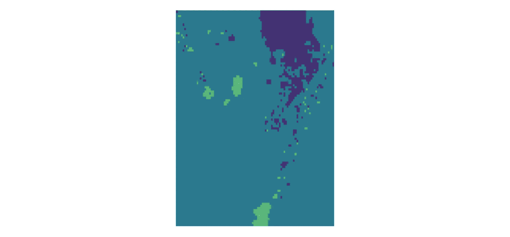

我也是。这些情节只是原情节的翻版。图片作者。

```
mapview(sbux_sf, map.types = "Stamen.Toner") 
coordinates(simulated_quake_data) <- c("long", "lat")
proj4string(simulated_quake_data) <- CRS("+proj=longlat +datum=WGS84")
lzn.vgm <- variogram(log(mag) ~ lat + long, simulated_quake_data, width=0.1)
plot(lzn.vgm)
lzn.fit = fit.variogram(lzn.vgm, 
                        vgm(c("Gau", "Sph", "Mat", "Exp")), 
                        fit.kappa = TRUE, 
                        fit.method= 1)
plot(lzn.fit, 1200)
```

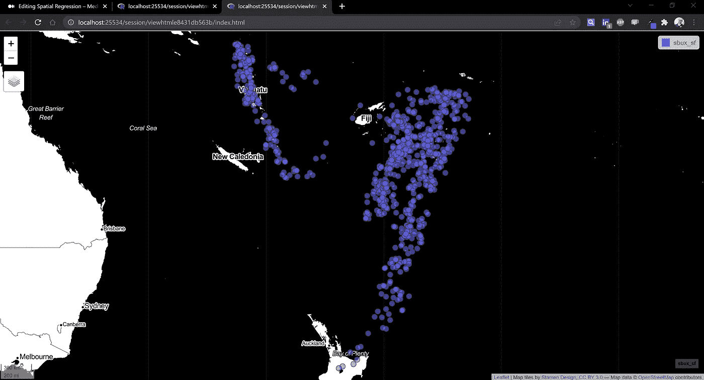

还有一个。图片作者。

我想我们现在手头已经有了相当多的地图和数据视图。移入[变异函数](https://en.wikipedia.org/wiki/Variogram)的时间。对于不知道变异函数是什么的人来说，变异函数是一种将位置之间的距离及其(协方差)结合起来的方法。空间协方差矩阵。诀窍是建立一个图，显示在什么距离点之间的差异不再重要。换句话说，当它们不再连接时。正如有不同类型的非空间协方差矩阵一样，也有不同类型的空间协方差矩阵。事实上，术语空间并不真正意味着什么，因为任何协方差矩阵被确定为连接相邻点和较远点之间的方差和协方差。这里的空间仅仅意味着您将包括位置数据。仅此而已。

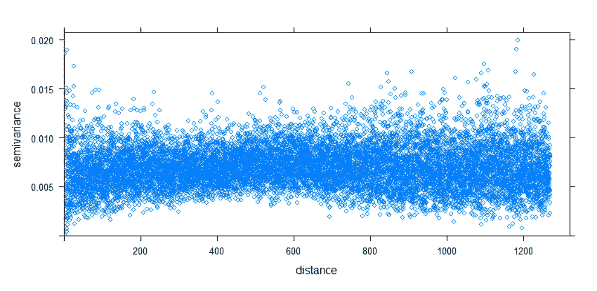

在我看来像是一条直线——有很多噪音。这个情节一点帮助都没有。图片作者。

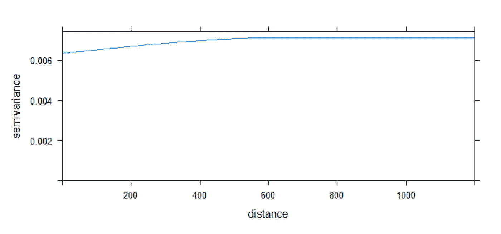

这个图是上面的 **lzn.fit** 模型结果的图形描述。图片作者。

上图中，你可以看到两种型号， *Nug* 和 *Sph* ，意思是块状和球形。球形部分正是构建协方差矩阵的方式，就像[自回归](https://besjournals.onlinelibrary.wiley.com/doi/10.1111/j.2041-210X.2009.00009.x#:~:text=The%20autoregressive%20structure%20assumes%20a,as%20does%20the%20exchangeable%20covariance).)，[托普利兹](https://statisticaloddsandends.wordpress.com/2018/03/26/toeplitz-covariance-structure/)的[非结构化](https://www.theanalysisfactor.com/unstructured-covariance-matrix-when-it-does-and-doesn%E2%80%99t-work/)。稍后，我将展示不同的[空间协方差矩阵](https://rdrr.io/cran/nlme/man/corSpatial.html)。

金块是最有趣的。掘金的意思是“起点”-因此，根据高度，您希望空间协方差矩阵从哪里开始。这种基体不一定要包括块状物。

让我们开始探索这种数据。有很多包，但我最终会选择我最喜欢的 [nlme](https://cran.r-project.org/web/packages/nlme/nlme.pdf) 包。许多其他包调用该包来扩展它。

```
simulated_quake_data <- fabricate(
  data = quakes,
  fatalities = round(pmax(0, rnorm(N, mean = mag)) * 100),
  insurance_cost = fatalities * runif(N, 1000000, 2000000))
simulated_quake_data<-simulated_quake_data%>%
  group_by(lat, long)%>%
  mutate(mag=mean(mag),
         fatalities=mean(fatalities),
         insurance_cost=mean(insurance_cost))%>%
  distinct(., lat,long, .keep_all= TRUE)
EC97 <- as.geodata(simulated_quake_data, 
                   coords.col = 1:2, 
                   data.col = 4)
Var1.EC97 <- variog(EC97, trend = "1st")
Var2.EC97 <- variog(EC97, trend = "2nd")
plot.new()
par(mfrow = c(2, 1))
plot(Var1.EC97, pch = 19, col = "blue", main = "1st order variogram")
plot(Var2.EC97, pch = 19, col = "red", main = "2nd order variogram")
plot.new()
par(mfrow = c(1, 1))
plot(Var1.EC97, pch = 19, col = "blue", main = "Variogram Simulated Quake Data")
par(new = TRUE)
plot(Var2.EC97, pch = 19, col = "red", xaxt = "n", yaxt = "n")
ini.vals <- expand.grid(seq(0, 30, by = 1), seq(2,30, by = 1))
ols <- variofit(Var1.EC97, ini = ini.vals, fix.nug = TRUE, wei = "equal")
summary(ols)
wls <- variofit(Var1.EC97, ini = ini.vals, fix.nug = TRUE, wei = "npairs")
lines(wls)
lines(ols, lty = 2, col = "blue")
```

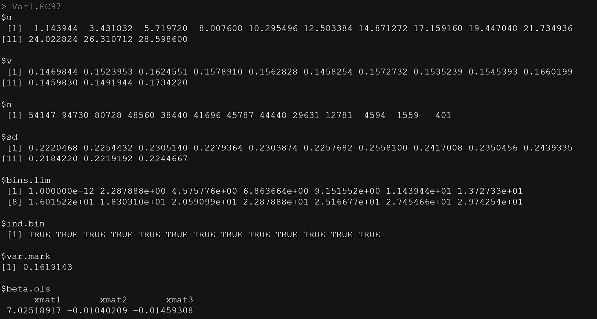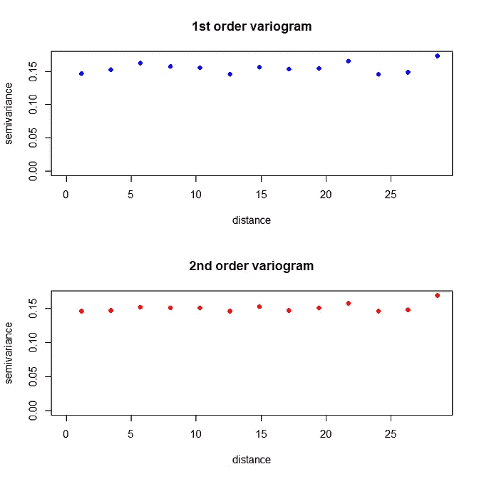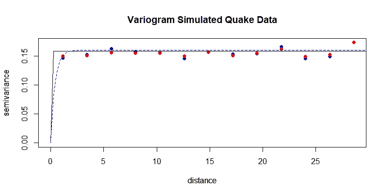

一阶和二阶变异函数都显示相同的结果。当试图将位置与地震震级联系起来时，真的没有太多的空间依赖性。我听汤姆说，我确实觉得这很有趣。但是我没有足够的知识去尝试去理解为什么会这样。从地质学的角度来看。图片作者。

让我们试着通过关注死亡人数而不是数量来模拟不同的数据。在这里，你可以看到我在坐标数据上建立了一个简单的线性模型。变异函数自然会遵循。

```
Model1=lm(fatalities~depth+mag,
          data=sbux_sf)
sbux_sf$residuals=residuals(Model1)
sbux_sf<-sbux_sf%>%cbind(., st_coordinates(.))
Vario_res = variogram(residuals~X+Y,
                     data=sbux_sf,
                     cutoff=100,
                     alpha=c(0,45,90,135))
plot(Vario_res)
```


尽管角度发生了变化，但它似乎是由一条平坦的线组成的。不要让差异欺骗了你。图片作者。

让我们再试一次，虽然我很确定结果会是一样的。我们可以构建一个来自 nlme 包的一般线性模型，并要求它构建一个球面协方差矩阵。

```
modSpher = gls(fatalities~depth+mag,
               data=sbux_sf,
               correlation=corSpher(c(100),
                                    form=~X+Y,
                                    nugget=F)) 
VarioSpher_raw = Variogram(modSpher, 
                           form =~ X+Y,
                           robust = TRUE, 
                           maxDist = 100, 
                           resType = "pearson") 
VarioSpher_normalized = Variogram(modSpher, 
                                  form =~X+Y,
                                  robust = TRUE, 
                                  maxDist = 100, 
                                  resType = "normalized") 
plot(VarioSpher_raw)
plot(VarioSpher_normalized)
```

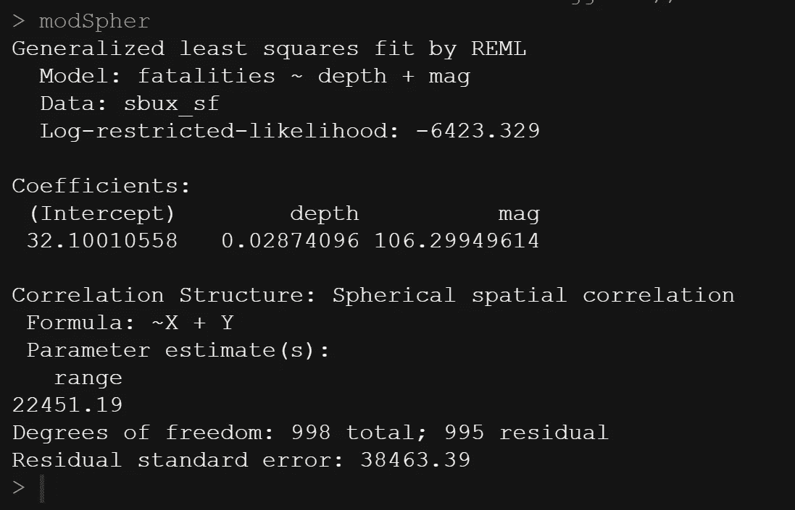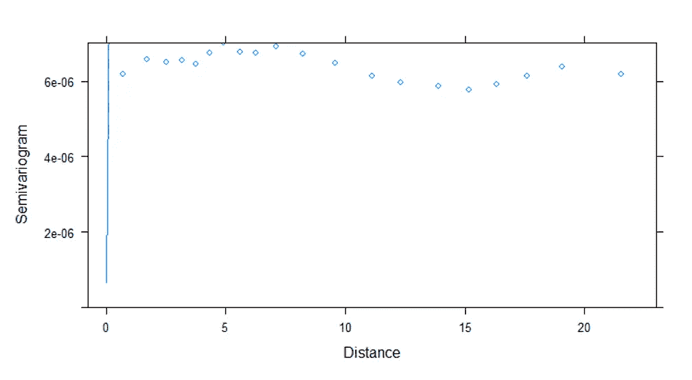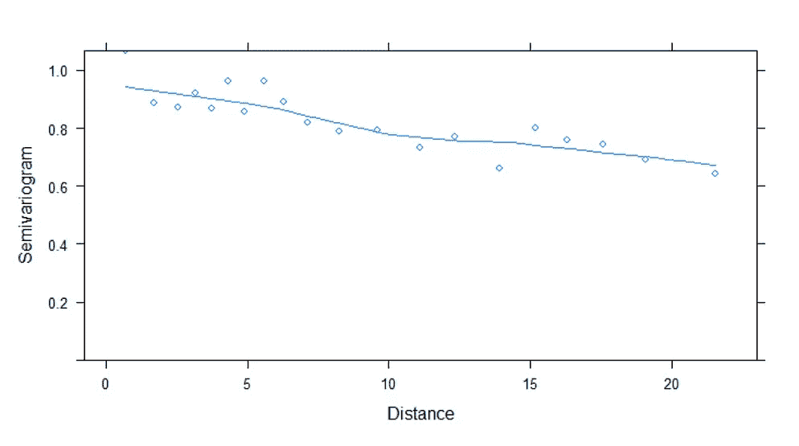

我猜模型，尤其是学生化残差变异函数，看到的不仅仅是直线。我总是觉得这很棘手，但它表明，通过增加距离，你减少了协方差。有道理。图片作者。

在这里，另一个例子来引导一个 glm 模型，没有空间协方差矩阵，并保存其输出以构建一个绘制在原始数据坐标上的残差气泡图。当您觉得数据建模并不适合您时，这实际上是一种非常方便的绘制空间数据的方法。

```
YF.glm = glm(fatalities ~ depth+mag, 
             family = gaussian,
             data = sbux_sf)
temp_data = data.frame(error = rstandard(YF.glm), 
                       x = sbux_sf$X, 
                       y = sbux_sf$Y)
coordinates(temp_data) <- c("x","y") 
bubble(temp_data, "error", col = c("black","grey"),
       main = "Residuals", xlab = "X-coordinates", ylab = "Y-coordinates")
plot(temp_data$error ~ temp_data$x, xlab = "X-coordinates", ylab = "Errors")
plot(temp_data$error ~ temp_data$y, xlab = "Y-coordinates", ylab = "Errors")
plot(variogram(error ~ 1, temp_data))
plot(variogram(error ~ 1, temp_data, alpha = c(0, 45, 90, 135)))
```

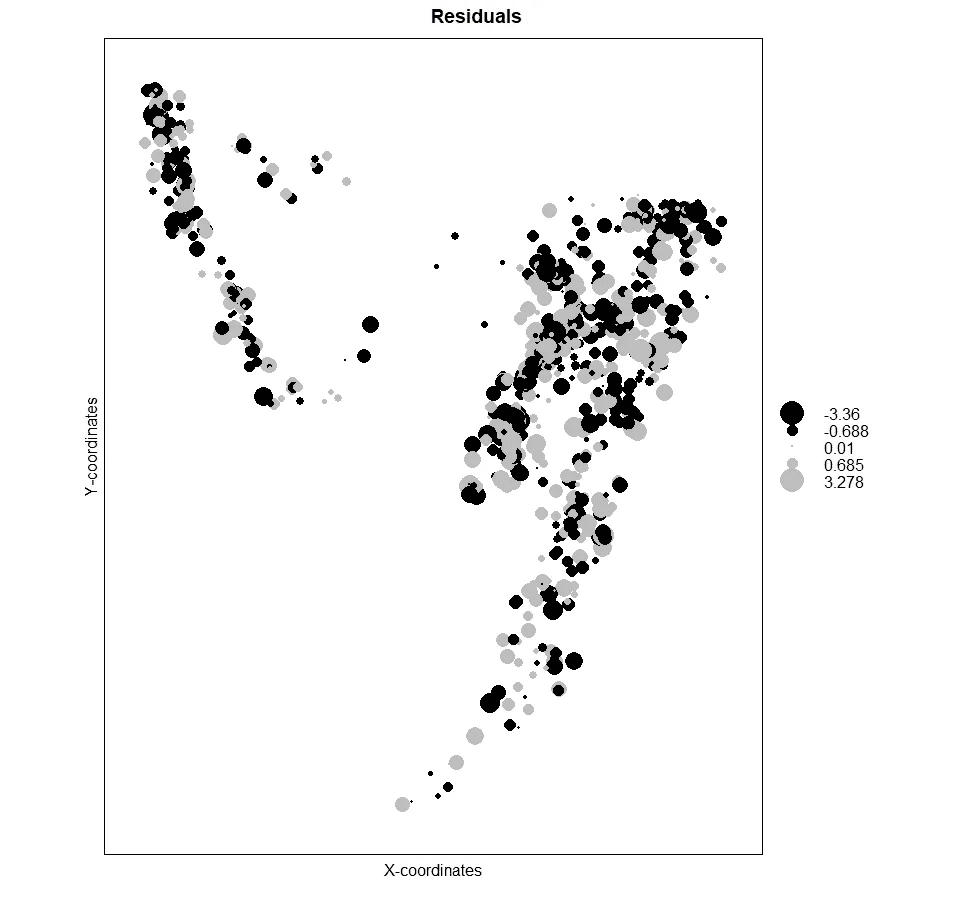

话说回来，如果我看剧情，我发现很难破译模式。当然，斐济岛可以被认出来，但我看不到一个清晰的模式。这是一个绘制数据的好方法，但在这里并不能提供很多信息。图片作者。

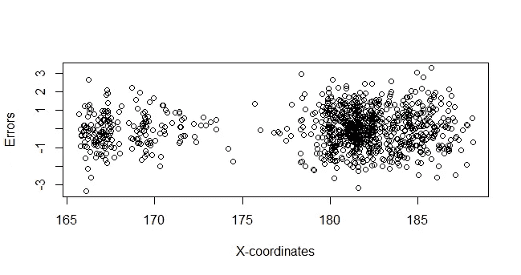

这是一种分别在 x 和 y 坐标上绘制误差的方法。上面的情节有更完整的画面。图片作者。

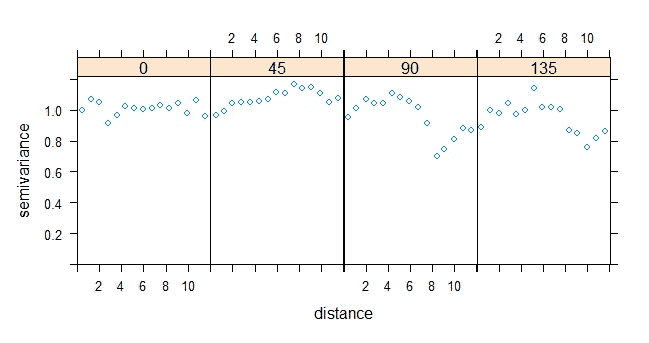

和变差函数-整体或不同角度。90 度角显示了一些有趣的东西，突然向下倾斜。图片作者。

角度增加了不同级别的信息，因为空间协方差可能根据路线表现不同。你可以清楚地看到，从任何以前的地图，以及泡沫图。尽管难以解读，但很容易看出，在空间环境中，你看的角度(以及方向)起着作用。就像看地图一样。

让我们在模型中加入一个球形相关矩阵。

```
f1 = fatalities ~ depth+mag
model1 <- gls(f1,  
              correlation = corSpher(form =~ X + Y, nugget = TRUE), 
              data = sbux_sf)
plot(model1)
plot(Variogram(model.1))
```

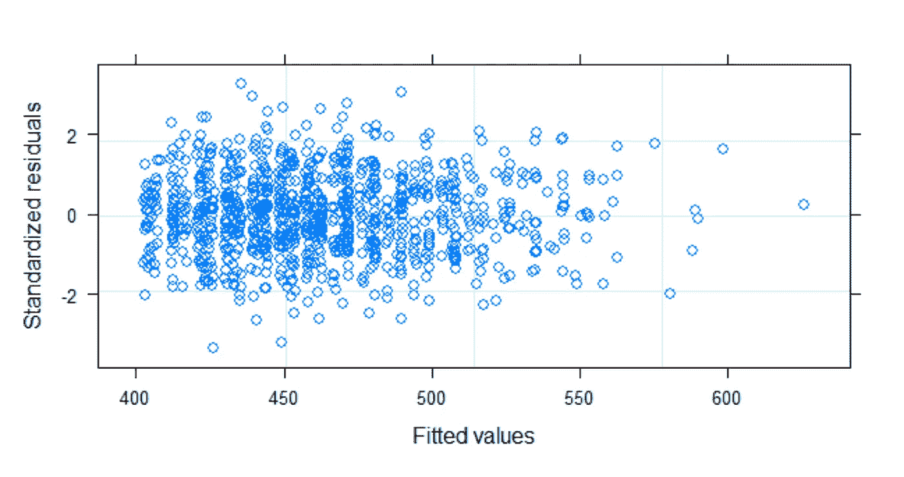

看起来不错。但是变异函数无法绘制出来。这不是一个好的迹象，也许我应该要求从不同的角度来绘制。图片作者。

这里，一个线性混合模型，包括作为解释方差分量使用的站的数量。我不得不承认，在这个数据集中，没有一个变量看起来像真正的方差分量，这些变量后来被包含在混合模型中过滤掉了。因此，我使用了由整数组成的单一变量，该变量在包含的站点数量的相同级别上具有重复值。因此，在模型中它是可行的，但从生物学角度来看，我看不出包含它有什么好处。另一方面，一个技术例子没有什么生物学价值。至少对我来说是这样。

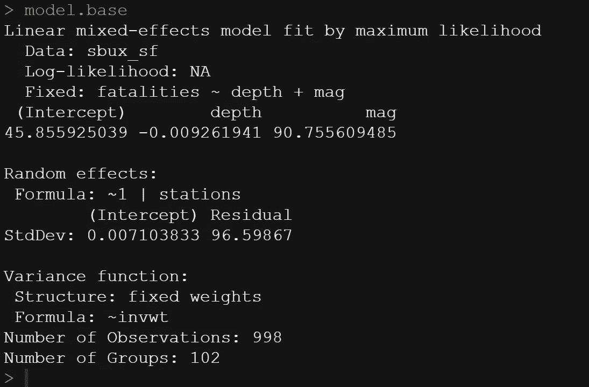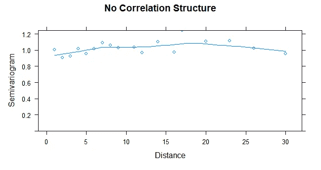

图片作者。

```
model.1<-glmmPQL(f1, random=~1|stations,
                    data=sbux_sf,
                    correlation=corExp(form=~X+Y, nugget = T),
                    family=gaussian)
plot(Variogram(model.1), 
     main = "Exponential Correlation")
model.2<-glmmPQL(f1, random=~1|stations,
                 data=sbux_sf,
                 correlation=corGaus(form=~X+Y, nugget = T),
                 family=gaussian)
plot(Variogram(model.2), 
     main = "Gaussian Correlation")
model.3<-glmmPQL(f1, random=~1|stations,
                 data=sbux_sf,
                 correlation=corSpher(form=~X+Y, nugget = T),
                 family=gaussian)
plot(Variogram(model.3), 
     main = "Spherical Correlation")
model.4<-glmmPQL(f1, random=~1|stations,
                 data=sbux_sf,
                 correlation=corRatio(form=~X+Y, nugget = T),
                 family=gaussian)
plot(Variogram(model.4), 
     main = "Rational Quadratic Correlation")
```

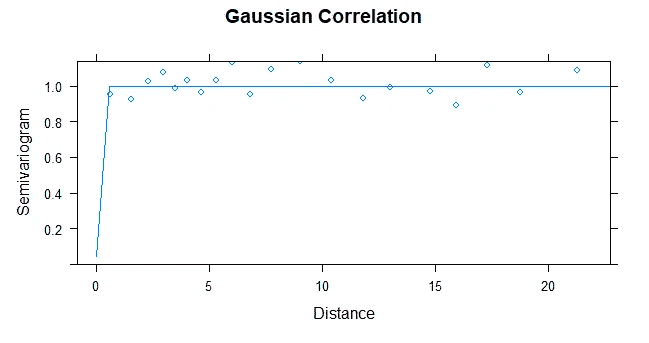

没什么意思，不管你用什么样的协方差结构。然而，模型变得越来越不稳定，如果你包括这么多额外的参数来估计，而没有任何额外的好处，就会发生这种情况。图片作者。

```
f2 = fatalities ~ s(depth)+s(mag)
model2.base <- gamm(f2, method = "REML",
                    data=sbux_sf,
                    family=gaussian)
model2.1 <- gamm(f2, 
                 method = "REML",
                 data=sbux_sf,
                 correlation=corExp(form=~X+Y, nugget = T),
                 family=gaussian)
model2.1$lme
model2.1$gam
par(mfrow = c(1, 2))
plot(model2.1$gam)
plot(model2.1$lme)
predict_gam(model2.1$gam)%>%
  ggplot(., aes(x=depth, 
                y=mag, 
                fill=fit)) +
  geom_tile()+
  scale_fill_viridis_c(option="magma")+
  theme_bw()
```

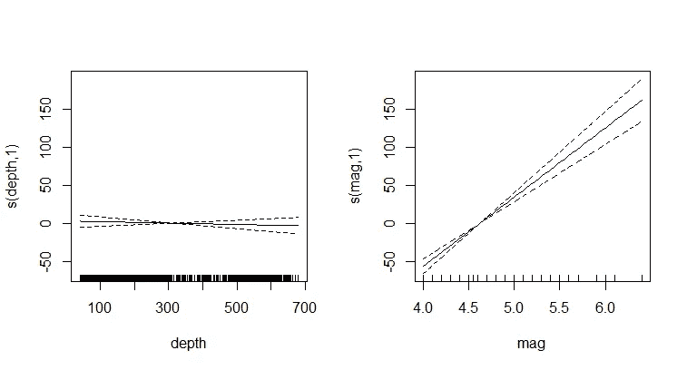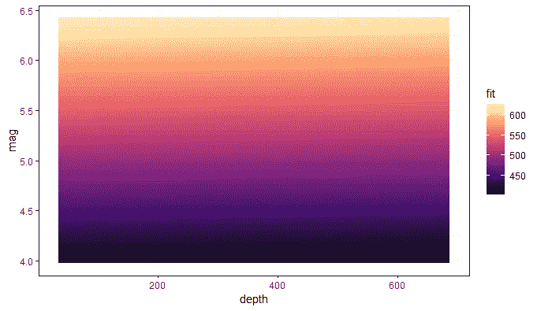

GAMM 模型揭示了与震级和死亡率的深层关系，但与深度和死亡率无关，也与深度和震级无关(我们没有真正建模，但仍然如此)。右图清楚地显示了震级的主要影响。图片作者。

```
f3 = fatalities ~ s(depth) + s(mag) + ti(depth,mag)
model3.base <- gamm(f3, 
                    method = "REML",
                    data=sbux_sf,
                    family=gaussian)
par(mfrow = c(1, 3))
plot(model3.base$gam)
model3.rand <- gamm(f3,
                    random = list(stations=~1),
                    method = "REML",
                    data=sbux_sf,
                    family=gaussian)
model3.1 <- gamm(f3, 
                 method = "REML",
                 data=sbux_sf,
                 random = list(stations=~1),
                 correlation=corExp(form=~X+Y, nugget = T),
                 family=gaussian)
predict_gam(model3.1$gam)%>%
  ggplot(., aes(x=depth, 
                y=mag, 
                fill=fit)) +
  geom_tile()+
  scale_fill_viridis_c(option="magma")+
  theme_bw()predict_gam(model3.1$gam) %>%
  ggplot(aes(depth, fit)) +
  geom_smooth_ci()+theme_bw()predict_gam(model3.1$gam)%>%
  ggplot(aes(depth, mag, z = fit)) +
  geom_raster(aes(fill = fit)) +
  geom_contour(colour = "white") +
  scale_fill_continuous(name = "y") +
  theme_minimal() +
  theme(legend.position = "top")
```


与单阶 GAMM 相同，但我们也包括了一个相互作用。图片作者。

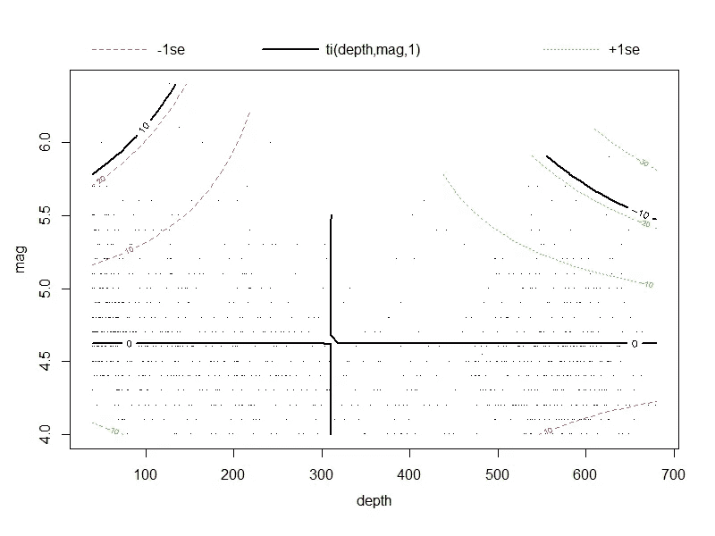

我们包含的交互是这样的——需要展示一些东西，但它没有太多意义。图片作者。

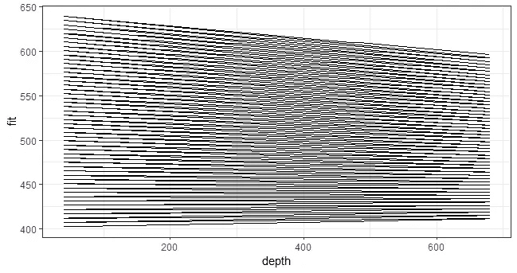

这是另一个很好的方式来证明增加一些东西实际上是什么也没有增加。图片作者。

最后一句话结束了这个简短的介绍。空间回归是“空间的”,因为它试图使用已知的距离度量，如经度和纬度，尽管不同的变量也可以包括在内。例如，可以包括来自聚类技术(也使用度量来评估“距离”)的数据，以形成空间协方差矩阵。由时间点组成的纵向数据也使用距离，但在这里，连接要平坦得多，因此添加的参数如*角度*不起作用。

您拥有空间数据这一事实并不意味着对其进行建模或将其包含在模型中会让您的生活变得更加轻松。在上面看到的数据中，地震并没有描绘出图片中看到的那么多变化。这是一幅受地理空间影响很小的“平面”图像。这就是变异函数也是平坦的原因-除了可能是一个很小的点之外，你在斐济的位置并不重要。就是这样。

有了这些类型的例子，你总是可以试着去找一个完美地展示技术增加了什么的例子，但是我没有改变我不能预见的。原因是在大多数例子中，数据分析总是看起来很好，但很少是令人兴奋的。

我希望你喜欢它。如果有什么不对劲，请告诉我！