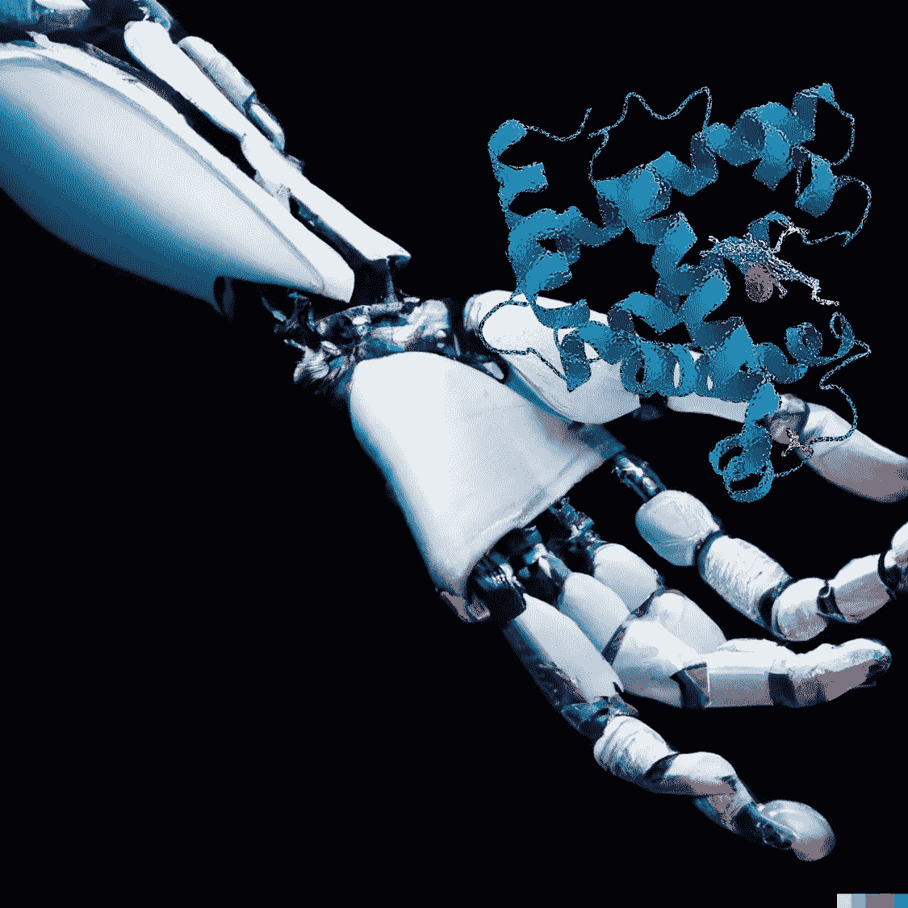
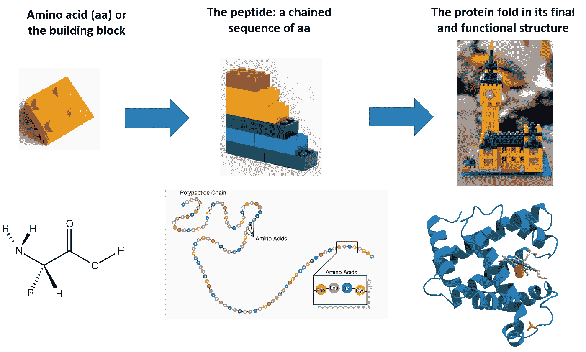
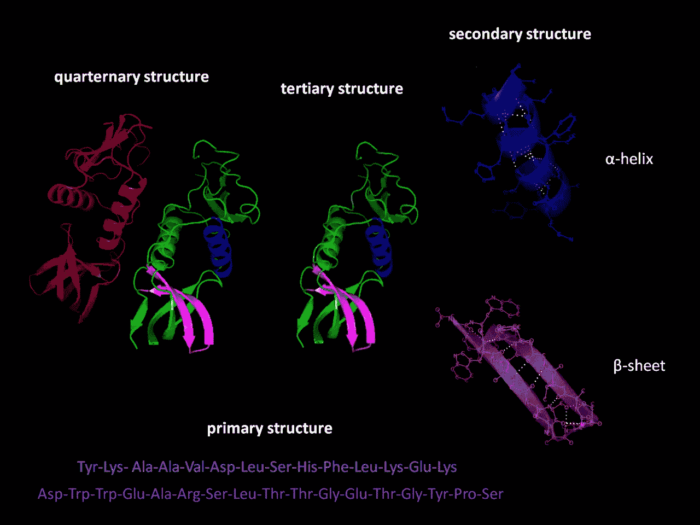
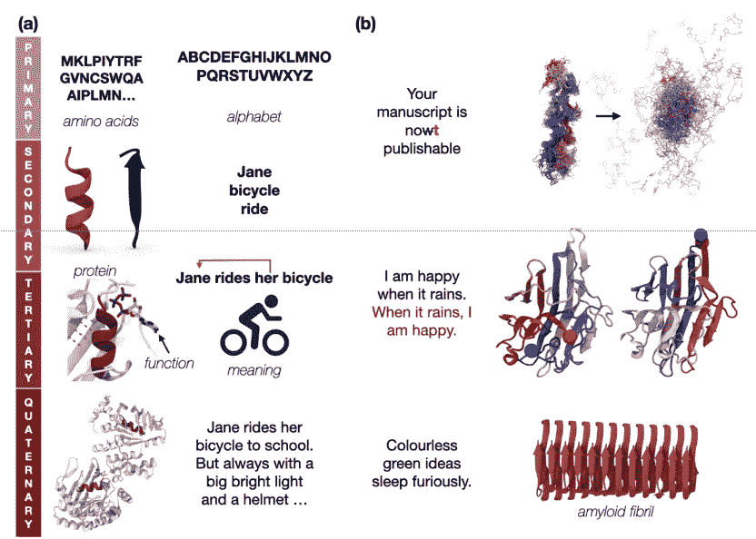
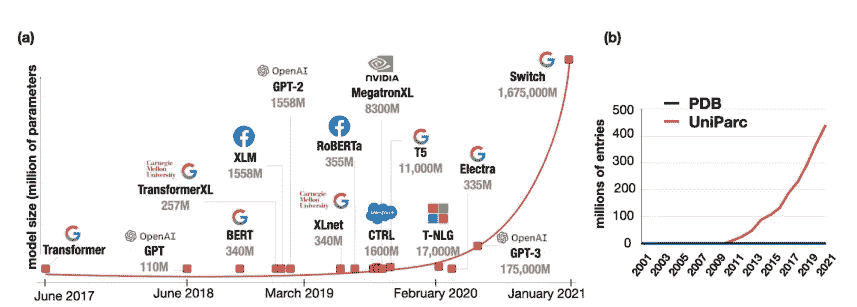
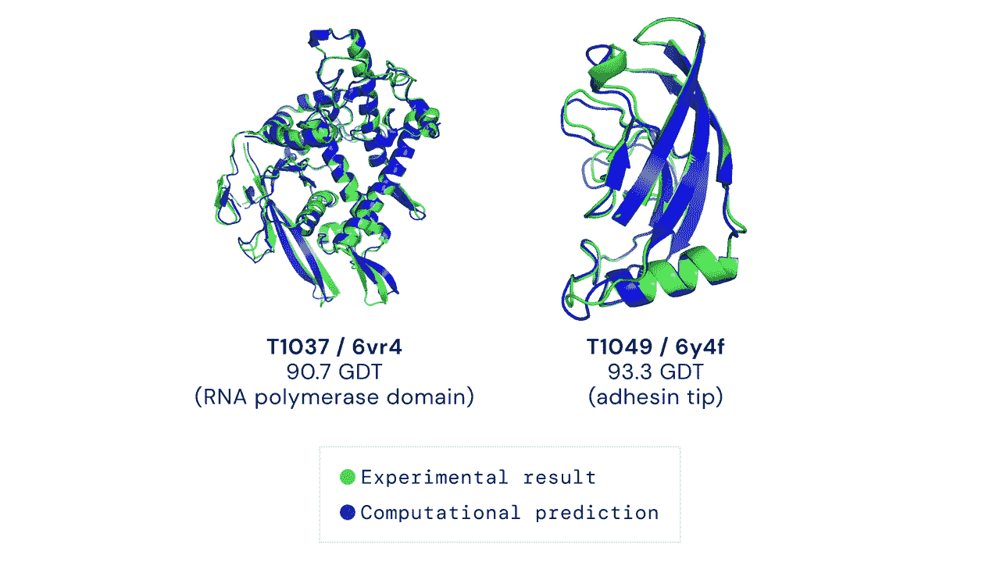
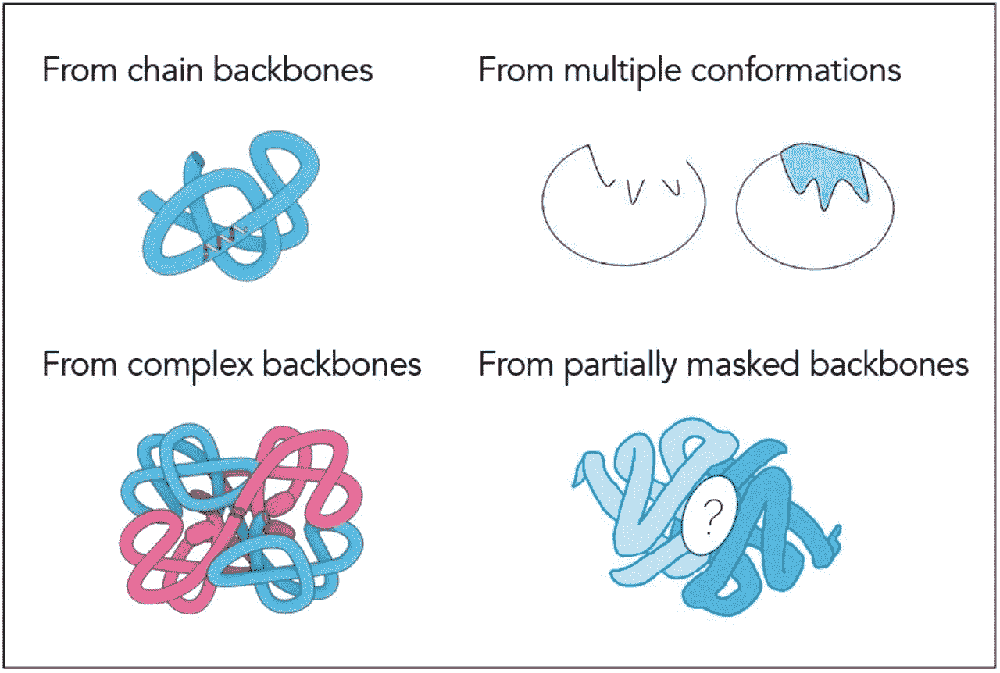
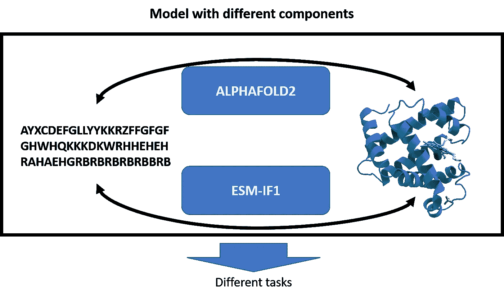

# 说生命的语言:AlphaFold2 和公司如何改变生物学

> 原文：<https://towardsdatascience.com/speaking-the-language-of-life-how-alphafold2-and-co-are-changing-biology-97cff7496221>

## 人工智能正在重塑生物学研究，并开辟治疗的新领域

用 [OpenAI Dall-E 2](https://openai.com/dall-e-2/) 生成的图像，然后被作者修改(这里使用[的蛋白质](https://en.wikipedia.org/wiki/Protein)

[蛋白质](https://en.wikipedia.org/wiki/Protein)是生命的基本构件，参与细胞中的任何过程。它们独特的结构和多样的功能允许它们在细胞中执行任何任务。DNA 和 RNA 可以被看作是 ROM 和 RAM 存储器。

理解蛋白质的结构和功能需要科学界付出相当大的努力。去年， [Alpha-fold2](https://www.deepmind.com/research/highlighted-research/alphafold) 彻底改变了如何预测蛋白质结构。本周(与欧洲生物信息研究所合作)，他们发布了最完整的人类蛋白质预测三维结构数据库。这篇文章旨在讨论为什么预测蛋白质很难，为什么它很重要，以及人工智能和最新研究如何影响未来。

**为什么对蛋白质及其结构大肆宣传？**

蛋白质是任何生物体的微型马达，从单细胞到更复杂的生物体，如人类。尽管我们只有 20 个氨基酸作为蛋白质的组成部分，但我们可以有无限个不同形状和功能的蛋白质。

蛋白质与生物体生存、生长和繁殖的功能有关。事实上，任何细胞都使用蛋白质来消化、繁殖、维持自身，等等。蛋白质能够实现这一切要归功于它们独特的结构，而它们的结构决定了它们的功能。新生成的蛋白质序列(或肽)在一个叫做折叠的过程中达到最终形状。

这张图片展示了蛋白质是如何由氨基酸结合而成的。在折叠过程中，蛋白质到达折叠结构(或其功能形状)。图片由作者使用不同来源([这里](https://unsplash.com/photos/qXakibuQiPU)、[这里](https://www.genome.gov/genetics-glossary/Amino-Acids)、[这里](https://en.wikipedia.org/wiki/Amino_acid)、[这里](https://en.wikipedia.org/wiki/Protein)、[这里](https://unsplash.com/photos/Ydpw_o7RKio)、[这里](https://unsplash.com/photos/gLosTt_i3E0))

然而，DNA 中的[突变](https://www.genome.gov/genetics-glossary/Mutation)可以改变蛋白质序列，并导致蛋白质的结构修饰。这种结构可以被改变以至于失去它的功能。这是许多[遗传疾病](https://www.genome.gov/For-Patients-and-Families/Genetic-Disorders)或癌症发生期间的基础。

也有蛋白质以错误的结构折叠的情况，这是不同疾病的基础。例如，[老年痴呆症](https://www.nia.nih.gov/health/alzheimers-disease-fact-shee)就是这种情况，异常折叠的[β淀粉样蛋白](https://en.wikipedia.org/wiki/Amyloid_beta)在患者的大脑中堆积。朊病毒疾病也是其他例子，其中的病理因素是蛋白质的错误折叠。

**蛋白质玩耍的无限棋盘**

20 世纪 50 年代，[香农](https://en.wikipedia.org/wiki/Shannon_number)估计大概可以玩 10**120 (10 的 120 次方)个游戏。考虑到在已知的宇宙中应该不超过 10**82 个原子，这可不是个小数目。

1969 年，Levinthal 指出，由于肽(一组氨基酸)具有大量的自由度，它可能以 10**300 种可能的构象结束。如果一个蛋白质要尝试所有可能的组合，它需要的时间会比宇宙的年龄还要长。由于一个[蛋白质在几毫秒内折叠](https://sitn.hms.harvard.edu/flash/2010/issue65/)(找到正确的构象或结构)，这被称为 [**莱文塔尔悖论**](https://en.wikipedia.org/wiki/Levinthal%27s_paradox) 。

图片来源:[此处](https://en.wikipedia.org/wiki/Protein_folding)。蛋白质折叠是一种生物学过程，其中蛋白质链(氨基酸结合的序列)在二级结构中自我组装，然后达到其最终构象或结构(也称为三级结构)。

蛋白质的结构决定了其功能，这对于设计治疗药物非常重要。传统上，研究人员依赖于实验方法，如**或 [**冷冻电子显微镜** ( **cryo-EM)**](https://en.wikipedia.org/wiki/Cryogenic_electron_microscopy) 。然而，虽然 X 射线晶体学正在返回详细的结构，但它既费力又昂贵(在某些情况下，蛋白质甚至需要 10 万美元)。因此，许多研究小组试图开发算法来预测序列的结构。**

**尽管事实上一个序列一对一地映射到一个 3D 结构，但是从序列中预测一个结构是非常困难的。一个单一的突变可以改变结构，两个非常不同的序列可以交出一个相似的结构。此外，该肽非常灵活，可以以多种方式旋转(此外，氨基酸也具有可以旋转的侧链)。此外，我们已经通过实验确定了大约 100，000 个蛋白质结构([蛋白质数据库](https://www.rcsb.org/))，我们还有数百万个结构未知的序列。**

****蛋白质如何成为生物的语言****

**由于蛋白质是氨基酸序列，人类语言和蛋白质序列之间有着惊人的相似性:**

*   ****层次组织:**字组织成字，字组织成句，句组织成段。段落也可以合并成更长的文本。同样，蛋白质字母表由 20 个氨基酸组成，它们可以在二级结构(通常具有功能或结构作用)和三级结构中的二级结构中结合。蛋白质可以组装成复杂的复合体。**
*   ****错别字和语法:**虽然单词中的错别字可以极大地改变句子的意思(一个错别字曾经让[一家旅行社损失了一千万美元](https://www.servicescape.com/blog/think-typos-wont-cost-you-money-think-again))，但你也可以写出语法正确但毫无意义的句子。同样，突变会破坏蛋白质的功能，导致疾病。**

****

**图片来源:[此处](https://arxiv.org/ftp/arxiv/papers/2201/2201.07338.pdf)。这张图片展示了如何比较人类语言和蛋白质序列。事实上，你可以注意到有一个类似的层次结构(面板 a)。此外，错别字可以改变句子的意思，因为突变正在改变蛋白质的结构(图 b)。**

*   ****进化:**语言不是一成不变的；它们不断发展，以表达新的概念，反映我们社会的变化。虽然今天有 8000 多种语言(归入 [140 个家族](https://en.wikipedia.org/wiki/List_of_language_families))，但它们可能起源于中非使用的一种共同的祖先语言(大约 5 万到 7 万年前)。所有的生物体(和它们的蛋白质)似乎都是从大约十亿年前的一个共同祖先进化而来的。**

****

**图片来源:[此处](https://commons.wikimedia.org/wiki/File:Simplified_language_tree_in_swedish.png)和[此处](https://en.wikipedia.org/wiki/Phylogenetic_tree)。左图展示了一个语言系统树的例子(一个语系是如何从一种初始语言发展而来的)。右边的面板显示了所有的生物体是如何来自一个共同的祖先(被称为[卢卡](https://astrobiology.nasa.gov/news/looking-for-luca-the-last-universal-common-ancestor)，最后一个普遍的共同祖先)**

*   ****依存:**在人类的语言中，词与周围的词是相互联系的。一个词的意思取决于上下文。此外，我们有长期依赖，这也可能是在不同的句子之间。蛋白质三维结构中存在相互作用，序列开始处的氨基酸可以与蛋白质序列末端的氨基酸相互作用。与此同时，蛋白质的二级结构之间以及蛋白质之间也有相互作用。**

**然而，也有一些不同之处。当表征蛋白质时，我们有时不知道单词的边界。此外，有许多蛋白质没有指定的功能(我们仍然需要破译它们)。**

****用变形金刚对付蛋白质****

**[变形金刚](https://en.wikipedia.org/wiki/Transformer_(machine_learning_model))、[注意力机制、](https://en.wikipedia.org/wiki/Attention_(machine_learning))以及衍生模型在[自然语言处理](https://en.wikipedia.org/wiki/Natural_language_processing)以及更远的领域取得了巨大成功。最初设计用于处理单词序列，它们被证明对图像([视觉变形器](https://en.wikipedia.org/wiki/Vision_transformer))和其他类型的数据(音乐、图表等等)都很有用。**

**简而言之，经典变换器由编码器和解码器构成，用于序列间问题(例如机器翻译)。自从他们问世以来，他们已经攻克了自然语言处理领域，逐渐在几乎任何应用程序中取代了 RNN 和 LSTM。为什么？因为它们更具并行性，所以它们可以对长依赖关系进行建模，并且预先训练使得大型转换器可以在许多领域中重用。现在大多数最大的模型都是基于变形的( [GPT-3](https://openai.com/api/) ，[伯特](https://en.wikipedia.org/wiki/BERT_(language_model))，以及他们所有的兄弟姐妹)。**

**事实上，变形金刚已经允许人工智能从业者用大量数据训练模型。这些年来，数据量持续增长(预计 2025 年将达到 [80 兆字节)。同样的事情也发生在生物学和医学上:自从](https://www.arrowcommunications.co.uk/iot-devices-to-generate-nearly-80-zettabytes-of-data-by-2025/)[组学革命](https://www.genomicseducation.hee.nhs.uk/blog/the-omics-revolution/)以来，我们积累了 DNA、RNA 和蛋白质序列。因此，为什么不使用 transformer 模型来利用生物学中的所有这些[大数据](https://elifesciences.org/articles/47381)？**

****

**图来源:[此处](https://arxiv.org/ftp/arxiv/papers/2201/2201.07338.pdf)。左图显示了最新变压器模型中模型参数的指数增长。右图显示了保存在 UniParc 中的蛋白质序列的指数增长。请注意，蓝线代表实验确定的沉积在 PDB 的结构数量(相比之下，它似乎是平的)。**

****AlphaFold2 或 DeepMind 如何让整个科学界感到惊讶****

**2020 年，DeepMind 参加了[结构预测的关键评估(CASP)挑战](https://predictioncenter.org/casp14/index.cgi)，这被认为是蛋白质结构预测最重要的挑战。它不仅仅是赢了，它的表现超过了 100 多个团队(超过 20%的准确率)。 [AlphaFold2](https://www.nature.com/articles/s41586-021-03819-2) 能够以原子级精度预测蛋白质结构。他们是如何做到的？**

**第一个直觉是，他们可以将数据表示为图形，并将任务视为图形推理问题(氨基酸作为节点，邻近度作为边)。然后他们抛弃了[卷积网络](https://en.wikipedia.org/wiki/Convolutional_neural_network)，发明了 Evoformer。其他有趣的技巧是注意力机制的使用，从多个序列比对开始，以及端到端的学习。**

****

**gif 源码，官方 AlphaFold2 GitHub [资源库](https://github.com/deepmind/alphafold)。**

**结果令人印象深刻，即使 AlphaFold 在建模[柔性区域或寡聚体装配](https://onlinelibrary.wiley.com/doi/epdf/10.1002/prot.26172)(四级结构，这甚至更难预测)方面存在问题。由于大多数蛋白质实际上是通过与其他蛋白质相互作用来工作的，这是一个重要的方面(DeepMind 还发布了[α折叠多聚体](https://www.biorxiv.org/content/10.1101/2021.10.04.463034v1)，一种专门为寡聚体装配训练的模型)**

****回到序列:AlphaFold 的克星****

**最近，META 在 ICML 发表了一篇文章，展示了 [ESM-IF1](https://www.biorxiv.org/content/10.1101/2022.04.10.487779v1.full) ，这是一种能够进行反向折叠的模型(根据蛋白质的结构预测其序列)。有趣的是，为了组装训练集，他们使用 AlphaFold2 预测了来自 [Uniprot](https://www.uniprot.org/help/uniref) 的 1200 万个序列的结构。这是一种克服实验确定的蛋白质结构数量有限的聪明方法。**

**然后，他们创建了一个模型，可以从[主链结构](https://foldit.fandom.com/wiki/Protein_backbone)(没有氨基酸链的蛋白质结构)预测蛋白质序列。氨基酸链对定义功能很重要，但它使问题更具挑战性，这已经是一个里程碑。该论文将反向折叠的方法描述为序列对序列的问题(使用自回归编码器-解码器从骨架坐标中检索序列)。**

****

**来自原[纸](https://www.biorxiv.org/content/biorxiv/early/2022/04/10/2022.04.10.487779/F1.large.jpg?width=800&height=600&carousel=1)。方法概述**

**有趣的是，他们将这个问题作为一个[语言建模](https://www.techtarget.com/searchenterpriseai/definition/language-modeling)任务来处理，他们训练模型学习条件分布 p(Y|X):给定空间坐标 X，你预测氨基酸的序列 Y。此外，他们表明添加高斯噪声有助于模型训练(高斯噪声也是一个新的大趋势)。**

**他们考虑了不同的任务，例如从主链预测序列、多重构象、寡聚体和部分掩蔽的主链。这些都是生物学中可能的情况，因为蛋白质可以被截短(被掩盖的部分)，与其他蛋白质相互作用(寡聚体)，或在不同的环境中改变构象(pH 值的变化，药物的存在)。因此，这个模型在不同的研究领域都是有用的。**

****

**出自原[纸](https://www.biorxiv.org/content/biorxiv/early/2022/04/10/2022.04.10.487779/F1.large.jpg?width=800&height=600&carousel=1)。所考虑任务的概述。**

****懂蛋白质语言写我们自己的浪漫****

> **“大自然是历史上最好的生物工程师。为什么不利用进化过程来设计蛋白质呢？” *—弗朗西斯·阿诺***

**首先，我想着重谈谈到目前为止出现的两点:**

*   **重新制定任务。AlphaFold2 和 ESM-IF1 都以一种巧妙的方式完成了转换数据的任务，这使他们能够以一种更简单的方式面对挑战。**
*   ****AlphaFold2 作为模型组件**。ESM-IF1 解决了缺乏使用 AlphaFold2 生成结构来训练其模型的例子的问题。**

**这两种想法都将影响未来，因为我们可以很容易地在生物学挑战中从 NLP 引入聪明的想法(从而使用已被证明有价值的方法)。随着几何学习的激增，我们也可以利用从图形中学到的经验(但这是另一个故事)。此外，AlphaFold 和 ESM-IF1 都是开源的，我希望它们能用于未来的研究。事实上，AlphaFold2 正在从序列中预测结构，而 ESM-IF1 正在做相反的事情，将它们结合起来对于许多生成任务来说可能是很棒的。**

**AlphaFold2 发布了一个预测结构的大型数据集，他们希望将其扩大到其他生物。了解这种结构对许多应用都很有用:**

*   **许多我们不太了解的蛋白质的功能**
*   **疾病和治疗选择。蛋白质结构用于暗示疾病，你需要这种结构来设计作用于蛋白质靶点的药物。**
*   **虽然这有助于治疗传染性疾病，但我们也可以设计抗昆虫和植物疾病的药物**

**然而，这些模型将有助于为不同的应用设计新的蛋白质。事实上，当使用[迁移学习](https://machinelearningmastery.com/transfer-learning-for-deep-learning/)时，[预训练模型](https://www.sciencedirect.com/science/article/pii/S2666651021000231)不一定用于原始任务。我们可以生成功能未知的蛋白质，然后通过反向折叠恢复序列。一旦你有了序列，你就可以在实验室里制造出蛋白质。**

****

**AlphaFold2 和 ESM-IF1 可以是一些人工智能模型的单独组件，甚至是一起组件(其中，您可以将这些预训练的模型用作多组件模型的构建块)。这可以用于不同于这两个模型所设计的原始任务的不同任务。图片由作者提供(里面的蛋白质来自[这里](https://en.wikipedia.org/wiki/Protein))**

****结论****

**在我们面前，有激动人心的时刻。这是更具变革性的研究和应用的开端。基因编辑很快进入临床，再加上可能了解突变如何改变研究的想法，可以成为许多疾病(从神经系统疾病到癌症)的解决方案。例如，阿尔茨海默氏症和朊病毒是蛋白质错误折叠在发病中起主要作用的疾病。**

**然而，几乎任何大型语言模型都是由大公司发布的。AlfaFold2 和 ESM-IF1 也是两家蓝筹公司的研究产品。当然，这些项目创造了与学术机构的合作，但由于它们的许多应用将影响许多人的未来生活，我们也需要机构的努力。**

**此外，当我们预测临床应用的结构时，我们还需要知道为什么模型会得出这样的预测。因此，我们还需要讨论这种技术的可解释程度，以及如何提高其可解释性。**

****其他资源****

*   **关于蛋白质结构预测([此处](https://biologicalmodeling.org/coronavirus/structure_intro))和折叠问题([此处](https://www.ncbi.nlm.nih.gov/books/NBK6824/)、[此处](https://www.khanacademy.org/science/biology/macromolecules/proteins-and-amino-acids/a/orders-of-protein-structure)、此处)。如果你对实验方面感兴趣，可以查看这些视频([这里](https://www.youtube.com/watch?v=gLsC4wlrR2A)，[这里](https://www.youtube.com/watch?v=Qq8DO-4BnIY&feature=emb_imp_woyt))**
*   **关于为什么我们需要大型语言模型([此处](https://pub.towardsai.net/a-new-bloom-in-ai-why-the-bloom-model-can-be-a-gamechanger-380a15b1fba7))和人工智能驯服语言多样性([此处](https://pub.towardsai.net/no-language-left-behind-579afea29e52))的制度性努力**
*   **关于蛋白质从头设计([视频](https://www.youtube.com/watch?v=_SDHZ-jxP4o))**

# **如果你觉得有趣:**

**你可以寻找我的其他文章，你也可以 [**订阅**](https://salvatore-raieli.medium.com/subscribe) 在我发表文章时得到通知，你也可以在**[**LinkedIn**](https://www.linkedin.com/in/salvatore-raieli/)**上连接或联系我。感谢您的支持！******

****这里是我的 Github 资源库的链接，我计划在那里收集代码，以及许多与机器学习、人工智能等相关的资源。****

**** ****