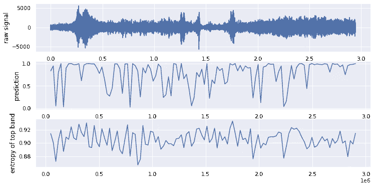
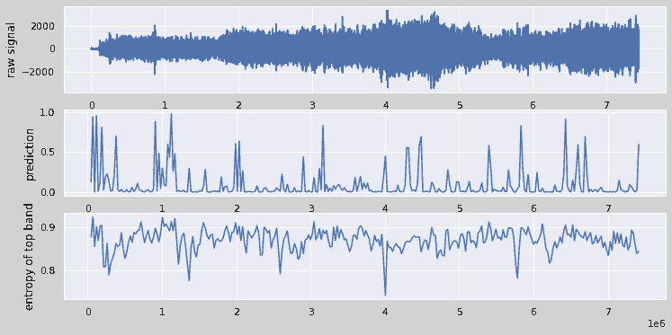

# 谱熵——一个被低估的时间序列特征

> 原文：<https://towardsdatascience.com/spectral-entropy-an-underestimated-time-series-feature-94e18ae5b958>

时间序列无处不在。作为数据科学家，我们有各种时间序列任务，如分段、分类、预测、聚类、异常检测和模式识别。

根据数据和方法，**特征工程**可能是解决这些时序任务的关键步骤。精心设计的功能有助于更好地理解数据，提高模型的性能和可解释性。将原始数据输入到黑盒深度学习网络可能不会很好，特别是当数据有限或可解释的模型更受青睐时。

如果您从事时间序列的特征工程，您可能已经尝试过构建一些基本特征，如均值、方差、滞后和基于滚动窗口的统计。

在这篇文章中，我将介绍基于谱熵的建筑特征。当您的数据适用时，我建议您将其作为必须尝试的功能之一(频域分析有意义)。我将展示我如何利用谱熵解决时间序列的两个分类问题。我已经展示了如何将谱熵应用于异常检测问题。请参考[用谱熵进行单变量随机时间序列的异常检测](https://medium.com/towards-data-science/anomaly-detection-in-univariate-stochastic-time-series-with-spectral-entropy-834b63ec9343?source=your_stories_page-------------------------------------)。

我的重点是在应用方面，所以我会跳过一些基本的介绍和理论。

## 频域分析和谱熵

通常，时间序列数据保存在时域中。索引是以固定间隔采样的时间戳。有些时间序列具有波形或季节性，如感觉数据(地震、声音等)。).我们可以认为有东西在振荡，产生像波一样的数据。

当存在强波形时，在频域中转换和分析数据是有意义的。**快速傅立叶变换**是一种经典的从时域到频域的变换方式。**频谱熵**基于香农熵将频谱密度(频域中的功率分布)编码为一个值。如果你对基础介绍感兴趣，请查看[单变量随机时间序列中的异常检测与谱熵](https://medium.com/towards-data-science/anomaly-detection-in-univariate-stochastic-time-series-with-spectral-entropy-834b63ec9343?source=your_stories_page-------------------------------------)。

这里有一个不深入公式的快速介绍的类比。

假设我们研究人们如何度过业余时间。一个人花 90%在足球上。另一个 90%花在象棋上。虽然他们的兴趣不同，但几乎可以肯定的是，他们将把业余时间奉献给自己最喜爱的爱好。他们在某种程度上是相似的。这种相似性就是熵。它们将具有相同的较低熵，意味着较低的不确定性。

另一个人花 20%在徒步旅行上，30 %在阅读上，20%在电影上，30%在任何事情上。显然，第三个人与前两个人不同。我们不知道第三个人具体在做什么活动。在这种情况下，熵很高，意味着更高的不确定性。

光谱熵的工作原理是一样的。时间如何分配对应于功率如何跨频率分配。

接下来，让我们看两个真实世界的例子，看看谱熵是如何创造奇迹的。数据集不在公共域中。请允许我使用模糊的描述并隐藏数据集细节。

## 信号选择

该数据集的目标是建立一个包含数百个样本的二元分类器。每个样本都是标有“通过”或“失败”的测试结果。一个样本有接近 100 个信号。信号的长度是恒定的。图 1 显示了一个例子(每个小图有三个信号)。

图一。一个样本有大约 100 个信号(图片由作者提供)。

如果我们从每个信号中提取 X 个特征，我们将有 100*N 个特征。考虑到样本量小，我们会遇到“维数灾难”问题。

由于我们对每个样本都有大量的数据，所以让我们有所选择，只关注最有预测能力的信号，忽略不相关的信号。我计算了每个信号的光谱熵，所以我们只有 100 个特征。然后浅树被训练。

从最重要的特征来看，只有三个信号显示出与标签的高度相关性。在我研究了这些信号之后，我根据这些信号构建了定制的特征。最后，我构建了一个高性能的成功模型。此外，该模型只需要十个左右的输入特征，具有很好的通用性和可解释性。

## 频带选择

这个例子是另一个二元分类问题。每个样本只有一个不同长度的时间序列。总样本量小于 100。

长度的变化没什么大不了的。我们可以将时间序列分割成更小的固定长度的片段，并使用样本标签作为片段标签。

小问题是我们有一个相对较大的频率范围。因为采样频率是 48000HZ(覆盖了人耳能听到的声音)，基于**奈奎斯特定理**，频域最高频率会是 24000。图 2 是一个例子。

图 2。原始信号和 FFT 结果示例(图片由作者提供)。

我直接尝试了光谱熵，但无法明确区分积极和消极。主要原因是两个标签具有**相似的峰值频率和谐波**。光谱分布是相同的。因此，整个频域上的谱熵不会显示出显著的差异。

既然频率分辨率高，我们就放大到某些频段而不是整个频谱。希望微妙的分离隐藏在某处。

我把频率分成了更小的波段。每个波段从 X 到 X+100。所以 24000 会给我们 240 个乐队。较高的频率只包含最小功率的噪声。因此，我忽略了较高频率的噪声，从 0 到 3000 中选取较低的频率，并将其分成 30 个频段。然后我计算了每个波段的光谱熵。最后，仅使用 30 个特征来训练基于树的模型。这种方法出奇地有效。图 3 显示了前两个特征(两个波段的光谱熵)。只使用 1200 到 1300 和 2200 到 2300 频段时有一个合理的界限。

图 3。前 2 个频段的频谱熵散点图(图片由作者提供)。

下面的图 4 显示了模型在标记为阳性的测试数据上的表现。顶部曲线是原始信号。中间的图是对每个部分的预测。底部是每个片段的频率 1200 到 1300 的熵。你可以看到大多数的预测都接近 1，熵可能在 0.9 到 0.93 之间。图 5 显示了标记为负的测试数据。现在预测下降到接近 0，熵在 0.8 到 0.9 的范围内变化。

图 4。标记为阳性的测试数据示例(图片由作者提供)。

图 5。标记为阴性的测试数据示例(图片由作者提供)。

## 结论

我展示了光谱熵如何帮助我快速找到最重要的信号和频带，以进行进一步的特性工程。

在这两个例子中，我们不必使用谱熵。例如，我们可以构建峰值频率、频带的平均幅度等特征。我们甚至可以将整个频域数据作为一个输入向量。毕竟，我们可以在频域中分离目标。

我喜欢从谱熵的角度探索特征，因为:

**这很容易解释和计算。**

**显著压缩频域**所包含的信息，保留核心信息。

缺点是一些信息丢失了。例如，根本不考虑量值。

此外，因为我们将频域中的值列表转换成信号值，所以不同的频谱分布可能具有相同的熵值。这就好比**哈希冲突**。例如，公平的硬币和有偏见的硬币具有不同的熵。但是对于一个偏向正面的概率为 X 的硬币和一个偏向反面的概率为 Y 的第二个硬币，如果 X 和 Y 相等，它们的熵将是相同的。

希望你能学到谱熵的好处，并在以后的时间序列工作中应用。

感谢阅读。

享受你的时间序列。

[更多关于时间序列的文章](https://medium.com/@ning.jia/list/time-series-7691e7b85020)