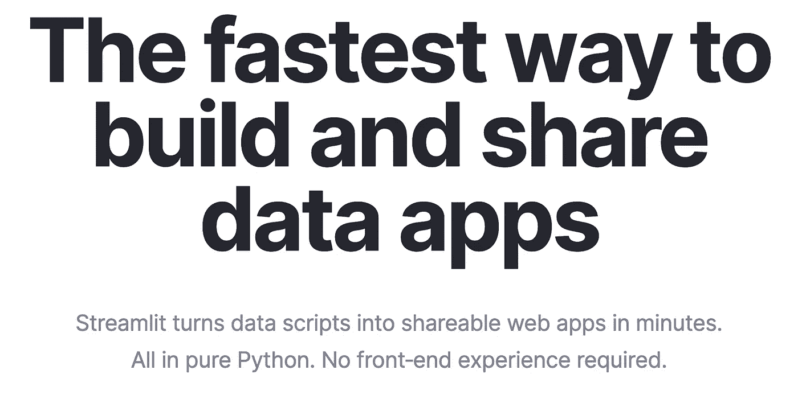
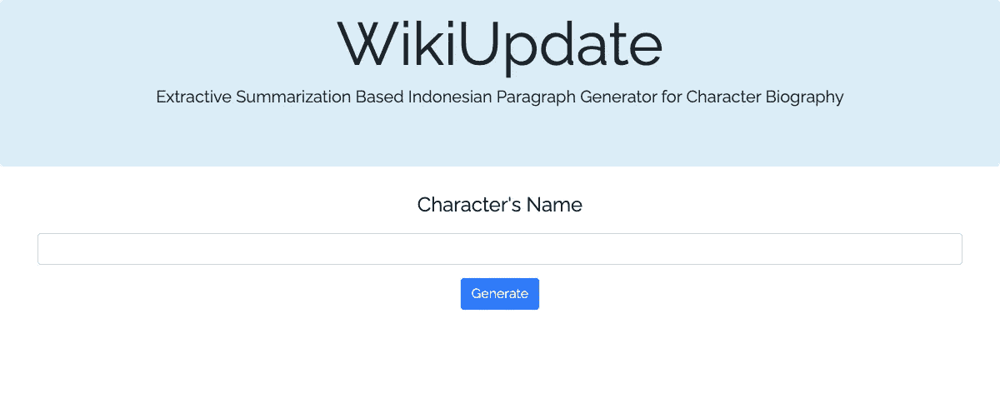
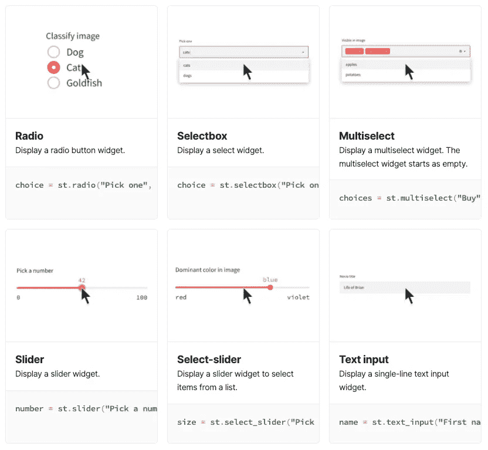
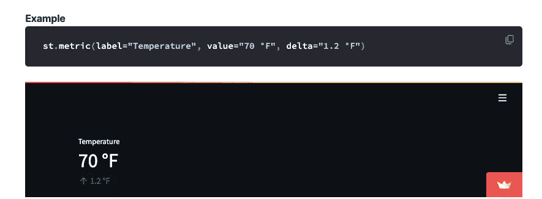

# 使用 Streamlit 加速 Python Web 应用程序的创建

> 原文：<https://towardsdatascience.com/speed-up-your-python-web-app-creation-with-streamlit-b0ee0026eacc>

## 学习机

## 不再摸索 HTML 页面


照片由 [Shiro hatori](https://unsplash.com/@shiroscope?utm_source=medium&utm_medium=referral) 在 [Unsplash](https://unsplash.com?utm_source=medium&utm_medium=referral) 上拍摄

你能为这个功能制作一个演示吗？"我看到屏幕上弹出的延迟通知气泡。是我的经理发来的。

好吧，你明白了。你以前用 Flask 做过演示；您有一个可以从中复制模板的 GitHub repo。

> 链接到 [GitHub repo](https://github.com/chandraseta/paparazzi-id) 我总是用它作为那些好奇的人的烧瓶模板。

“当然，应该在星期一之前完成。”那天是星期四，所以我将有一天半的时间来复制模板中的所有内容，刷新我的记忆，并完成演示。另外，万一我惨败，我会有周末作为紧急后备计划，对吗？

“太好了，我推荐使用 Streamlit，这样你就不用处理 HTML 和 CSS 了。”我对这条信息的反应是竖起大拇指，表示我们的谈话结束了。

> *Streamlit 到底是什么？我开始恐慌，然后谷歌了一下。*

快进到周一，我奇迹般地不用 Flask 就完成了演示页面。以下是我学到的。

# 烧瓶与细流

当你第一次听到一个新的图书馆时，你做的第一件事是什么？没错，你谷歌一下，我就是这么做的。第一个结果是 [streamlit.io](http://streamlit.io) ，我点击了它。



作者截图自 [streamlit.io](http://streamlit.io)

他们说我“不需要前端经验”

我之前提到的那个烧瓶模板？我的 SO 帮助我创造了它。她也是一名数据科学家，但不像我，她实际上可以很好地进行 web 开发。

自从我有了那个模板，我所有的演示页面看起来都是这样的。



作者的烧瓶应用程序截图

当然，我必须根据我需要显示的数据对布局进行一些编辑，但是您已经了解了要点。

任何使用过 Flask 的人都会知道，仅仅为了在网页上显示一个值而不得不编辑 Python 文件和 HTML 页面的痛苦。更不用说那些从用户那里获取输入的烦人的表单了。

下面是记录文本框输入的一段代码。

这是显示结果的部分。

重读代码让我回想起必须调试代码的所有后续部分，因为当我想显示更多项目时，我太骄傲了，不会向我的 SO 寻求帮助。

幸运的是，Flask 使用 Jinja2 语法(``部分中的语法),这让我更容易控制页面的流动。

无论如何，我尝试在 Streamlit 中重新创建页面，下面是页面的样子。


Streamlit 页面截图

我认为这是主观的，但我喜欢页面中等风格的干净设计。你甚至可以通过页面右上角的汉堡菜单把它改成深色主题。

这是代码。

就我个人而言，我非常喜欢如何通过纯 Python 代码创建网页。最重要的是，我相信任何人都希望不必处理任何单独的 HTML 和 CSS 文件。

# Streamlit 入门

我会推荐你在安装 Streamlit 之前[使用 Miniconda](https://medium.com/swlh/stop-using-anaconda-for-your-data-science-projects-1fc29821c6f6) 。之后，安装 Streamlit 就非常容易了。

```
pip install streamlit
```

成功安装 Streamlit 后，您可以直接运行以下命令。

```
streamlit hello
```

在您的浏览器中打开`localhost:8501`，您将看到此页面。


Streamlit 的 Hello 页面截图

hello 页面包含一些演示模板，您可以进行试验。它还包括演示底部的实际代码，以便您可以实际使用它作为您自己的演示的基础。


Streamlit 演示页面示例

Streamlit 也有自己的[图库](https://streamlit.io/gallery)，包含用户创建的演示页面，以及每个页面的源代码链接。如果您需要创建一个您认为其他人可能已经做过的通用演示页面，这是一个非常好的方法。

# 简化基础知识

如果您访问 [Streamlit docs](https://docs.streamlit.io/) ，您会很容易被文档中的所有元素和页面所淹没。

对我来说，我急于把事情做完，所以我专注于做两件事。

1.  获取输入
2.  显示输出

## 获取输入

Streamlit 有一组[输入小部件](https://docs.streamlit.io/library/api-reference/widgets)来帮助从用户那里获得输入。你可以选择从一个简单的文本框到相机输入和任何介于两者之间的东西。



Streamlit 输入部件的屏幕截图

对于像[下载按钮](https://docs.streamlit.io/library/api-reference/widgets/st.download_button)这样的东西，你可以通过点击一个按钮来下载一个数据帧或者一个 JSON 文件，想象一下使用 Flask 来实现会有多复杂。或者类似于[滑块](https://docs.streamlit.io/library/api-reference/widgets/st.slider)，或者[日期输入](https://docs.streamlit.io/library/api-reference/widgets/st.date_input)。

从那以后，我使用 Streamlit 创建了多个演示页面，我从未遇到过需要特定类型的输入而 Streamlit 没有小部件支持的问题。

## 显示输出

由于 Jinja2，使用 Flask 打印变量非常容易，但是 Streamlit 使得显示[文本](https://docs.streamlit.io/library/api-reference/text)和[数据](https://docs.streamlit.io/library/api-reference/data)更加容易。

使用 Streamlit 时，我最喜欢的事情是显示数据帧。

Streamlit 有一个叫做 [magic](https://docs.streamlit.io/library/api-reference/write-magic/magic) 的东西，你可以通过简单地调用变量名来打印出数据帧和 matplotlib 图。

紧随其后的是 [st.metric](https://docs.streamlit.io/library/api-reference/data/st.metric) ，我们可以用增量显示指标，这使得创建仪表板变得非常容易。



细流的公制屏幕截图

我对 Streamlit 的输出有一个抱怨，那就是试图打印居中的文本时。

不幸的是，在撰写本文时，Streamlit 还没有对类似`st.write(..., align="center")`的东西的原生支持

我最终编写了自己的自定义函数，只是为了在 Streamlit 中将文本居中。

# 优化流线

在这一点上，在弄清楚这两件事之后，我的演示已经开始运行了。然而，我注意到演示页面没有任何保存的状态，实际上运行每个输入的所有代码。

幸运的是，我找到了两者的解决方法。

## 会话状态

它在文档中被列为[状态管理](https://docs.streamlit.io/library/api-reference/session-state)，但我们将在代码中使用`st.session_state`。基本上，它是一个字典，可以为每个用户会话存储各种值。

简单地像下面这样使用它。

```
st.session_state["key"] = value
```

如果您想存储用户输入或任何需要在整个演示页面流程中保存的变量，这真的很有帮助。

## 贮藏

[在 Streamlit 中缓存](https://docs.streamlit.io/library/advanced-features/caching)对于数据科学家来说至关重要。

当你为一个机器学习模型创建一个演示时，加载模型通常会花很长时间。模型越大，载入内存的时间就越长。

Streamlit 的问题是，每次收到输入时，它都会运行所有代码。包括我们加载模型的部分。

为了避免这个问题，我们需要在加载模型的函数上添加`st.cache`装饰器。这将使页面将模型保存在缓存中，直到函数的名称、函数内部的代码或函数的输入参数发生变化。

对于装饰者，我通常使用以下配置。

```
@st.cache(show_spinner=True, max_entries=1)
```

当功能运行时，使用`show_spinner=True`将给出一个旋转动画。添加`max_entries=1`会将保留的条目数限制为 1。当您在云服务器上部署演示页面以限制内存使用时，这最后一部分至关重要。

# 收场白

周一早上，我向经理展示了演示页面。

“哦，你是用 Streamlit 创建的？我记得你说过你从来没用过？”

“是啊，我很好奇，它似乎真的很有趣，所以我决定尝试一下。”我回答道。

“你只花了两天时间就学会并编写了代码？干净利落。让我们将它部署到 GCP，这样我们就可以让团队的其他成员试用它了。”

“我实际上花了周四学习并试图创建一个工作演示页面，周五实际创建一个工作演示页面，周末平滑流程，包括会话状态和缓存。”

当然不是我打的。

"当然，我会把它部署在 GCP，完成后会给你链接."已发送。

我整个周末都在学习 Streamlit 吗？是的。

我后悔吗？绝对不行。

*学习机是一系列关于我所学到的，并且认为足够有趣可以分享的事情的故事。有时也是关于机器学习的基础。* [*定期更新*](https://chandraseta.medium.com/subscribe) *新故事和* [*成为中等会员*](https://chandraseta.medium.com/membership) *阅读无限故事。*

[](https://chandraseta.medium.com/membership) 