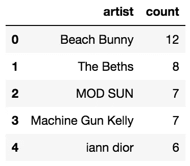
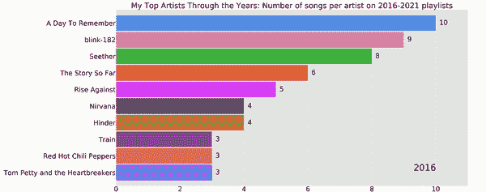
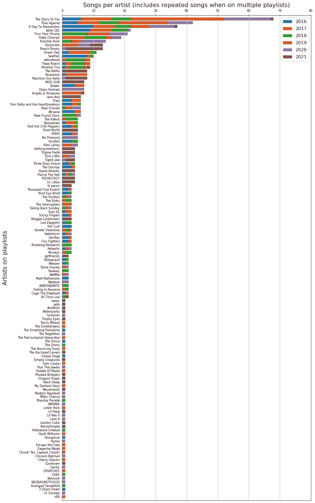
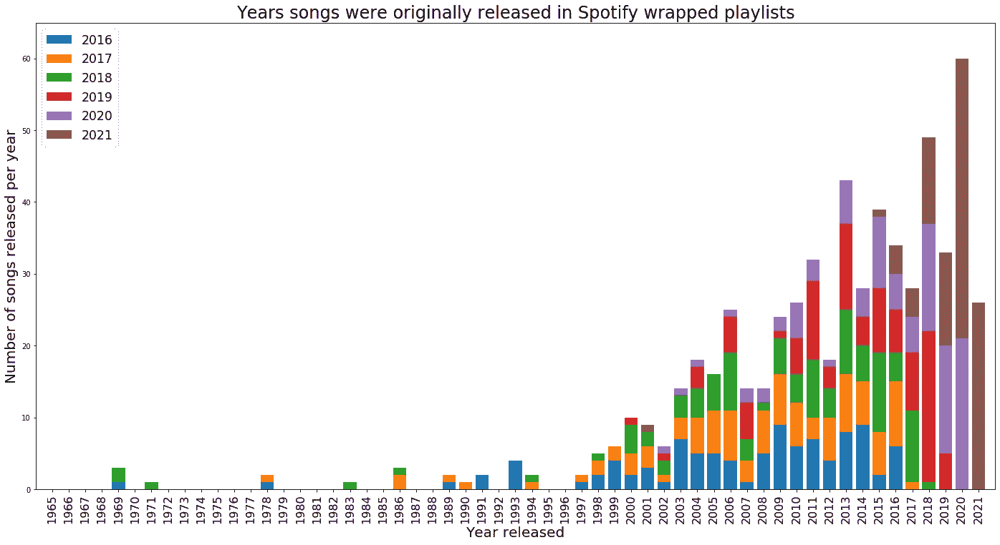
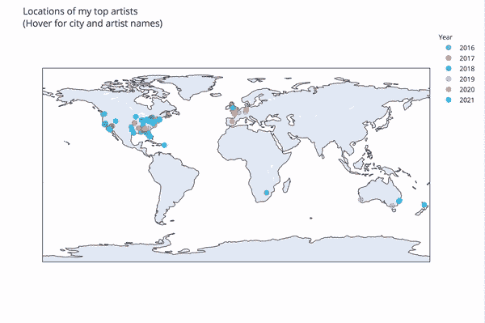
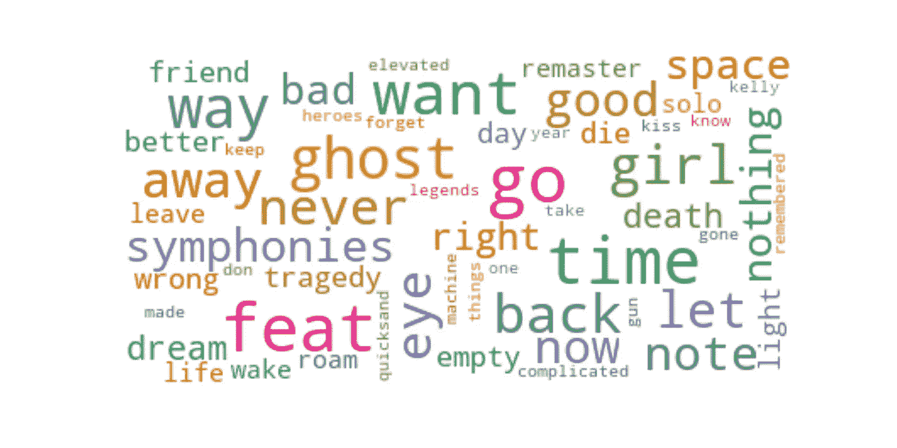
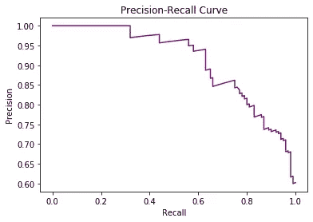
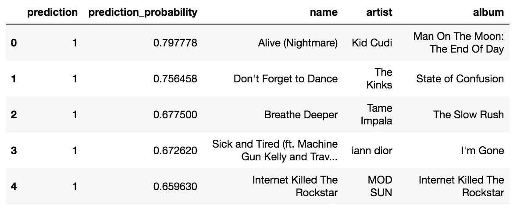
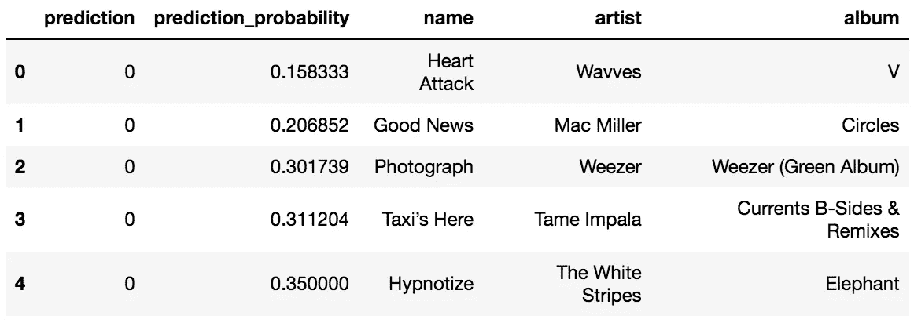
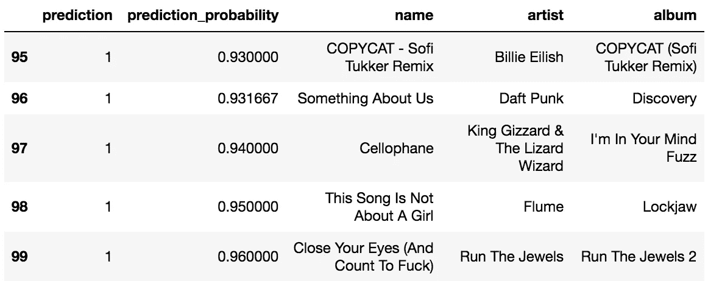

# Spotify Wrapped:热门歌曲的数据可视化和机器学习

> 原文：<https://towardsdatascience.com/spotify-wrapped-data-visualization-and-machine-learning-on-your-top-songs-1d3f837a9b27>

## 使用 Spotify 的年度热门歌曲播放列表进行数据可视化和机器学习


亚历山大·沙托夫在 [Unsplash](https://unsplash.com?utm_source=medium&utm_medium=referral) 上拍摄的照片

2021 年 12 月来到了，像每年一样(自 2016 年以来)，这个月带来了令人兴奋的 Spotify 播放列表:*你的 2021 年热门歌曲*。对于每个用户，这个播放列表显示了他们在那一年中听得最多的 100 首歌曲。第一名是他们听得最多的歌曲，第二名是第二多，以此类推，直到第 100 首歌曲。如果这还不够有趣，那就等着我们用数据科学来探索它吧！和往常一样，你可以在 Github [这里](https://github.com/areevesman/spotify-wrapped)继续关注。

## **数据探索**

例如，我想探究的一件事是有多少艺术家出现在我的播放列表中。我是否只听了许多不同艺术家的一首或几首歌？还是我只听了几个艺人和他们的很多歌？好吧，让我们来看看:

```
df_2021_ = df_2021[['artist', 'name']]\
    .groupby('artist')\
    .count()\
    .sort_values('name', ascending=False)\
    .reset_index()
df_2021_.columns = ['artist', 'count']
df_2021_.head()
```



作者图片

所以，我们看到的是我有 12 首沙滩兔子的歌，8 首贝斯的，7 首太阳的，7 首玛奇恩·冈·凯利的，6 首伊恩·迪奥的。

此外，我可以看到播放列表上总共有多少位艺术家:

```
len_artists=len(df_2021[['artist']].groupby('artist').count())
print(f'You had {len_artists} artists in the 100 songs.')
```

结果是:

```
You had 36 artists in the 100 songs.
```

要查看所有六年(2016–2021)的数据，我们可以重复上面的代码来创建各个表，然后像这样组合它们:

```
df_concat = pd.concat([df_2016_, df_2017_, df_2018_, df_2019_, df_2020_, df_2021_], axis=1)
df_concat.head()
```


作者图片

并查看每个播放列表上总共有多少位艺术家:

```
len_artists = len(df_2016[['artist']].groupby('artist').count())
print(f'You had {len_artists} artists in the 100 songs in 2016.')You had 39 artists in the 100 songs in 2016. len_artists = len(df_2017[['artist']].groupby('artist').count())
print(f'You had {len_artists} artists in the 100 songs in 2017.')You had 45 artists in the 100 songs in 2017. len_artists = len(df_2018[['artist']].groupby('artist').count())
print(f'You had {len_artists} artists in the 100 songs in 2018.')You had 40 artists in the 100 songs in 2018. len_artists = len(df_2019[['artist']].groupby('artist').count())
print(f'You had {len_artists} artists in the 100 songs in 2019.')You had 26 artists in the 100 songs in 2019. len_artists = len(df_2020[['artist']].groupby('artist').count())
print(f'You had {len_artists} artists in the 100 songs in 2020.')You had 40 artists in the 100 songs in 2020. len_artists = len(df_2021[['artist']].groupby('artist').count())
print(f'You had {len_artists} artists in the 100 songs in 2021.')You had 36 artists in the 100 songs in 2021.
```

## **数据可视化**

除了在表格中查看每个艺术家的歌曲，我们还可以在图表中查看。

下面的第一个图表是一个条形图，根据 2016-2021 年我在播放列表中的歌曲数量显示了我的前 10 位艺术家。随着时间的推移，总数在增加。



作者图片

因此，虽然我的顶级艺术家在 2016 年和 2017 年是一个值得记住和眨眼的日子-182，但到目前为止的故事和 Rise Against 到 2021 年结束。其中一个原因是现场音乐会。我去看了 blink-182 和 2016 年的一个难忘的日子，所以他们当时获得最高收听率是有道理的。

下一张图显示了 2016-2021 年我的六首热门歌曲播放列表。每个列表都用一种颜色表示。然后，它会绘制出每个播放列表中每个艺术家的歌曲数量，并将它们放在彼此的顶部。在这种情况下，我们可以看到所有进入播放列表的艺术家。



作者图片

该图显示了许多艺术家在我的播放列表中只有一首歌曲，如 y 轴底部的+44。此外，一些艺术家有许多，像故事到目前为止在 y 轴的顶端。在六年的聆听生涯中，我已经把他们的 68 首歌放在了我的最佳播放列表中。虽然我不确定他们是否发行了那么多的歌曲，但它提出了一个想法，即这个图表也应该在没有重复的情况下进行检查。例如，如果我在 2016 年的播放列表中有一首歌，那么如果它出现在未来的播放列表中，我就不应该再数一遍。无论这首歌是哪一年出现的，都是一样的道理。只有第一次才会算。图表如下:


作者图片

到目前为止，我仍然有很多故事，但这只是我排除重复之前的一半。此外，y 轴顶部的前四位艺术家处于相同的顺序，但在此之后，如果一些艺术家在这些年中比其他具有更独特歌曲的艺术家重复更多，则他们会下移。

现在，我已经绘制了进入我的播放列表的每位艺术家的歌曲数量，我可以考虑一些其他主题了。例如，我的播放列表中的歌曲是什么时候发布的？让我们考虑下图:



作者图片

虽然我有几首在 20 世纪 60 年代、70 年代、80 年代和 90 年代发行的歌曲，但这张图表显示，我的大部分音乐品味始于 20 世纪 90 年代末，总的来说，随着时间的推移，它们越来越受我欢迎。在 2019 年、2020 年和 2021 年，播放列表发布的那一年或仅仅一年前，播放列表中有任何一年中最多的歌曲。对新歌的关注在播放列表 2021 中尤为明显，那里只有一首歌是在 2015 年之前推出的。

现在我们知道这些歌是什么时候出的，是谁发行的。但是在哪里呢？这些艺术家都来自哪里？由于这个文件是 HTML 格式的，您需要使用下面的链接来完整地访问它。作为预览，下面的地图显示了包含一个或多个艺术家的每个城市的点。

**链接:**【https://chart-studio.plotly.com/~areevesman/40】T2



作者图片

这张地图显示了许多我喜欢的艺术家来自美国，但它并没有就此停止。我也喜欢来自加拿大，欧洲一些国家，加上澳大利亚，新西兰，甚至南非的艺术家。此外，地图显示了我的热门歌曲中没有艺术家的位置，我可以在未来探索这些位置。您可以放大或缩小以查看特定位置。当你悬停在地图上的点上时，它会显示城市的名称，哪些艺术家来自该城市，以及他们出现在我的播放列表中的第一年。

除了这些图表，我还想考虑艺术家在说什么。虽然我们没有这些歌曲的完整歌词，但我们有歌名。以下是基于这些歌曲标题的词云:



作者图片

在这张图片中，单词的大小代表了它出现的频率。这提供了歌曲含义的概念。比如左上角的 *friend* 这个词，可以说明有些歌是关于友情的。此外，右下角的*时间*一词表明，许多歌曲都是关于时间的感受。其中最大的一个词，*壮举*，表明有相当数量的歌曲是以其他艺术家为特色的。

注意事项:

*   像 *a、*等词。已被删除，因为它们更常见，没有提供太多的意义
*   *s* ， *t* 等。在绘图前从单词的末尾删除

另一个值得考虑的有趣的可视化包含 Spotify 的 API 提供的音乐功能。这些包括每首歌曲的特征:*声音、能量、可跳舞性、效价、活跃度、语速、乐器性、响度、长度、速度、流行度、调式、基调、时间签名、*和*发行年份*。

你可以在这些地方读到更多关于他们的信息。注:*长度*取自第(1)页的*持续时间 _ 毫秒*，*发布年*是第(1)页的*发布日期*的年元素:

*   [https://developer . Spotify . com/documentation/we b-API/reference/#/operations/get-track](https://developer.spotify.com/documentation/web-api/reference/#/operations/get-track)(1)
*   [https://developer . Spotify . com/documentation/we b-API/reference/#/operations/get-audio-features](https://developer.spotify.com/documentation/web-api/reference/#/operations/get-audio-features)(2)

在下面的图中，我们为我和我的女朋友绘制了每个播放列表中 100 首歌曲的每个特征的平均值。需要注意的是，每个特征都被缩放为最小值为 0，最大值为 1。平均值取自 1，200 首歌曲(600 首来自我的播放列表，600 首来自 Brenda 的播放列表)。根据我们对音乐的不同品味，她的播放列表被添加来帮助显示更多的绘制特征的信息。我的歌曲特征用较深的颜色绘制，而她的用较浅的覆盖图绘制。


作者图片

以下是我们从这张图中可以观察到的一些情况:

*   我的听觉度相当低，而布伦达的听觉度稍高。她喜欢更多的原声歌曲，而我喜欢更多的失真。
*   我的*能量*更高。我的歌往往更快、更响、更吵。
*   我的舞蹈能力较低。她喜欢更适合跳舞的音乐。
*   我的*化合价*有点低。我喜欢悲伤、压抑和愤怒的歌曲，而她喜欢更快乐、欢快和愉悦的歌曲。
*   我的*活跃度*略高。我的播放列表里可能还有几首现场版的歌曲。
*   我的*语速*更高。我的歌有更多的歌唱，而她有更多的乐器。
*   我的*乐器感*更低。加上我唱歌多，她乐器略多的想法。
*   我的*响度*略高。这表明，就像*能量*一样，我的歌可以更嘈杂。
*   我的*长度*更高。这只是一首歌的平均长度。
*   我的*节奏*更快。我的歌平均比她的快一点。
*   我的*人气*高一点。平均而言，我比她更喜欢流行歌曲。
*   我的*模式*更高。在每个播放列表中，我的主要歌曲比她多，而她的次要歌曲比我多。
*   我们的*键*大约是偶数。这只是一般的键(C，C#，D 等。)所以它们平均起来差不多也说得通。
*   我的 *time_signature* 更高。通常，歌曲是 4/4，但我有更多的歌曲是 5/4，6/4，或 7/4，和/或她有更多的更低，如 3/4。
*   我的*发布年份*在最初几年略低，但在最后一年较高。2016-2018 年她听的新音乐比我多，但 2021 年我听的比她多。他们在 2019 年和 2020 年差不多。

在下面的 GIF 中，特征首先由*声音*增加，然后是*能量*、*舞蹈能力*等等，直到*发行 _ 年份。*这显示了每首歌的单独特征，而不是所有 100 首歌的平均值。


作者图片

## **机器学习**

现在我们已经通过可视化探索了数据，让我们转向机器学习。我们将回答以下问题:

如果我从“我的播放列表”或“Brenda 的播放列表”中选择一首歌曲，我能使用上图中的数据预测它是哪一首吗？换句话说，对于每首歌来说，它的*声音、能量、可舞性、效价、活力、语速、乐器性、响度、长度、节奏、流行度、调式、基调、时间签名、*和*发行年份*是否足以预测它是在我的播放列表上还是在她的播放列表上？

让我们用数据来训练一些机器学习模型。为此，我们将完成以下步骤。

**数字变量缩放**

为了训练许多机器学习模型，我们需要缩放数值变量。许多已经在[0–1]的范围内，像*声音、能量、舞蹈性*等等。然而，其他像*发布 _ 年*不是。如果在没有缩放的情况下在模型中使用，那么*发布年份*从例如 1969 年到 2021 年的变化可以被解释为比另一个变量的变化对模型结果的影响更大，如果差异只是小于 1 的某个数字的话。如果全部缩放，这将有助于解决问题。虽然有许多方法可以选择如何执行缩放，但我选择了一种线性方法，其中最小值映射到零，最大值映射到一。

**分类变量编码**

对于要在模型中使用的分类变量，它必须找到一种解释为数字的方法。在我的模型中， *time_signature* 、 *mode* 和 *key* 是分类变量。我已经使用*一个热编码*来调整它们。在每个变量中，该变量的每个可能类别都有一列。如果变量在类别 *k* 中，那么在列 *k* 中有一个 1，在其他列中有一个 0。

**删除重复歌曲**

每年，Spotify 都会制作一份我们 100 首热门歌曲的播放列表。在某些情况下，某些歌曲会出现在一年以上的播放列表中。为了不给这些歌曲额外的偏向结果，我将每首歌只使用一次。

此外，有几首歌进入了我们的两个播放列表。虽然我可以根据我们谁更喜欢哪首歌，从一个播放列表中删除每首歌，但为了简单起见，我把它们都删除了。

删除重复歌曲后，我的歌曲比布伦达少了一些。为了保持班级人数均匀，我随机抽取了一些歌曲，再次添加到我的播放列表中。另一个选择是对布伦达的一些歌曲进行抽样删除。

**训练和测试集**

现在上面的步骤已经完成，下一步是将歌曲集分成训练集和测试集。每个类中的原始 600 首歌曲总共剩余 507 首歌曲，因此我将使用每个类中的 407 首来训练模型，然后使用训练好的模型来预测剩余 100 首歌曲的值。

此外，我将使用 5 个版本的训练/测试分割，这样我就可以跨测试集的版本比较模型性能。

**评估指标**

我们将使用以下指标来评估模型:

*   *准确度*:预测正确的次数除以总预测次数
*   *精度*:模型预测为阳性的实例数中真正为阳性的实例数
*   *回忆*:真实阳性数中真实阳性实例的数量
*   *特异性*:实际阴性实例总数中预测阴性实例的数量
*   *f1* :精度*和*召回*的调和平均值:2 /(1/ *精度* + 1/ *召回*，或 2* *精度* * *召回/(精度+召回)**
*   *ROC 曲线和分数*:受试者工作特性；图表:假阳性率(x 轴)和真阳性率(y 轴)得分之间:真阳性率和假阳性率之间的曲线下面积
*   *精度-召回曲线和分数*:不同概率阈值下*精度*和*召回*之间的曲线；分数:在*精度*和*召回*之间的曲线下面积

准确性将是评估模型的主要指标，因为我们希望尽可能正确地预测这两个类别。

**使用机器学习模型**

现在，我们准备将机器学习模型应用于我们的数据。我一共用了五个:

*   逻辑回归
*   k-最近邻
*   线性向量机
*   决策图表
*   随机森林

为了调整每个模型的超参数，我在 Python 的 scikit-learn 库中使用了网格搜索。最佳精度如下所示:

*   逻辑回归:0.7604
*   k-最近邻:0.7334
*   线性向量机:0.7751
*   决策树:0.7641
*   随机森林:0.8071

因为准确性是我们的最高标准，所以看起来 Random Forest 在这个数据上做出了最好的预测。我们还可以看看其他评估指标。

例如，对于第五个测试集上的随机森林:

*   *精度* : 0.86
*   *召回* : 0.7678
*   *特异性* : 0.8409
*   *f1* : 0.8113
*   *ROC 得分* : 0.9037
*   *ROC 曲线:*


作者图片

*   *精确召回分数:* 0.9096
*   *精确召回曲线*:



作者图片

所有模型和测试集的附加结果可以在*02 _ machine _ learning . ipynb*笔记本[这里](https://github.com/areevesman/spotify-wrapped/blob/main/code/02_Machine_Learning.ipynb)中看到。

**比较包含歌曲信息的预测**

此外，我们可以看到预测错误和正确的实际歌曲。这些来自随机森林的第五个测试集。对亚当的正确预测是 0，对布伦达的正确预测是 1。

对 Adam 播放列表中歌曲的不正确预测:



作者图片

对 Brenda 播放列表中歌曲的错误预测:



作者图片

正确预测 Adam 播放列表中的歌曲:


作者图片

对 Brenda 播放列表中歌曲的正确预测:



作者图片

我们根据预测概率对这些歌曲进行了排序。这些是由模型生成的每首歌曲在类别 1 中的概率(在 Brenda 的班级中)。如果概率超过 0.5，它选择 Brenda 作为类别。如果概率低于 0.5，我就被选中了。如果一首歌在不正确列表的顶部附近，这意味着它比它下面的歌曲损失更严重。如果一首歌接近正确列表的底部，这意味着它有更强的预测能力。

我将很高兴收到以上任何反馈。欢迎在 areevesman@gmail.com 通过 [Linkedin](https://www.linkedin.com/in/adamreevesman/) 或电子邮件发表评论或联系。

## 资源

*   我关于可视化和机器学习的笔记本和数据可以在[这里](https://github.com/areevesman/spotify-wrapped)找到。