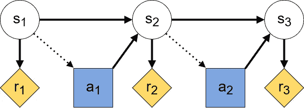
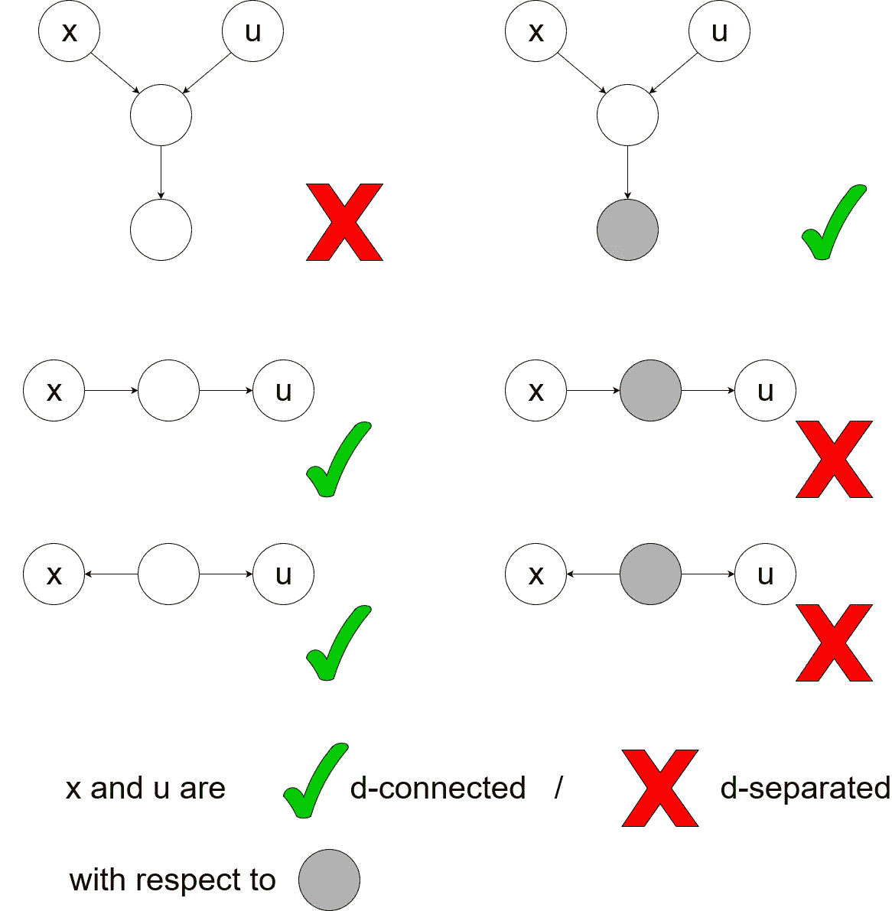
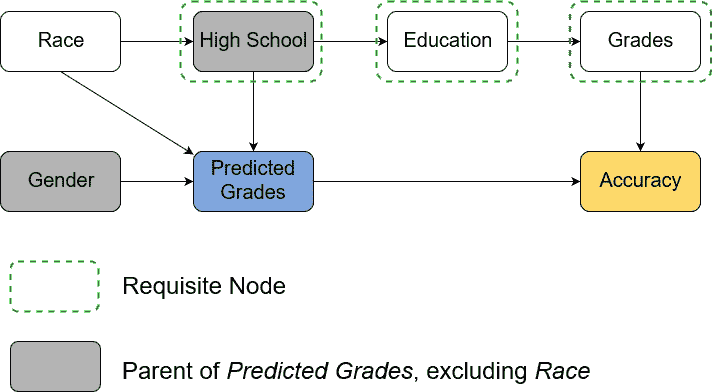
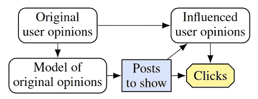
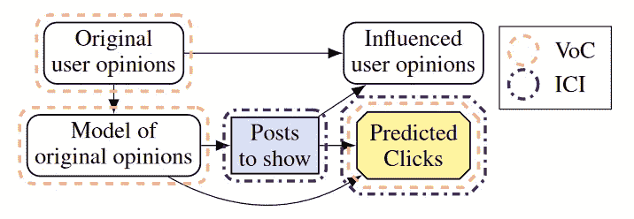

# 使用图形标准发现不公平或不安全的人工智能

> 原文：<https://towardsdatascience.com/spotting-unfair-or-unsafe-ai-using-graphical-criteria-90a4ea3383f6>

## 如何使用因果影响图来识别塑造人工智能代理行为的隐藏激励

对于先进的机器学习系统的公平性和安全性有很多担忧，这是理所当然的。为了解决问题的根源，研究人员可以使用因果影响图(CIDs)分析学习算法带来的激励。在其他人当中，DeepMind 安全研究已经写了关于他们对 cid 的研究的文章，我以前也写过关于如何利用它们来避免 T2 篡改奖励的文章。然而，虽然有一些关于使用 CIDs 的[类型激励](/new-paper-the-incentives-that-shape-behaviour-d6d8bb77d2e4)的文章，但我还没有看到用于识别这种激励的图形标准的简洁文字。为了填补这一空白，这篇文章将总结激励概念及其相应的图形标准，它们最初是在论文 [*代理激励:因果透视*](https://arxiv.org/abs/2102.01685) *中定义的。*

## 快速提醒:什么是 cid？

因果影响图是有向非循环图，其中不同类型的节点表示优化问题的不同元素。决策节点表示代理可以影响的值，效用节点表示优化目标，结构节点(也称为变化节点)表示状态等剩余变量。箭头示出了节点如何与虚线箭头因果相关，虚线箭头指示代理用于做出决定的信息。下面是马尔可夫决策过程的 CID，决策节点用蓝色表示，效用节点用黄色表示:

碱性 MDP 的 CID。状态、动作和奖励分别表示为 s、a 和 r。来源:作者生成，受启发[3]

## 示例 1:潜在不公平的成绩预测模型

第一个模型试图预测一个高中生的成绩，以评估他们的大学申请。该模型使用学生的高中和性别作为输入，并输出预测的 GPA。在下面的 CID 中，我们看到*预测等级*是一个决策节点。当我们训练我们的模型进行准确预测时，*准确性*是实用节点。剩下的结构节点显示了世界上相关的事实是如何相互联系的。从*性别*和*高中*到*预测年级*的箭头显示那些是模型的输入。在我们的例子中，我们假设学生的性别不会影响他们的分数，因此他们之间没有箭头。另一方面，一个学生的*高中*被认为会影响他的*学历*，进而影响他的*成绩*，这当然会影响*准确度*。这个例子假设一个学生的种族影响了他上的高中。注意模特只知道*高中*和*性别*。

品位预测模型的 CID。来源:[4]

当人工智能从业者创建一个模型时，他们需要注意种族和性别等敏感属性将如何影响模型的预测。为了严格地考虑模型何时可以被激励使用这样的属性，我们首先需要一个条件，即节点何时可以提供有用的信息来增加奖励。我们称这样的节点为“必备”。

## 必要条件和 d-分离

必要条件是更一般的图形属性[d-分离](https://en.wikipedia.org/wiki/Bayesian_network#d-separation)的特例。直观上，给定一组节点 *C* ，如果知道 *C* 的元素意味着知道 *a* 不会为推断 *b* 提供任何附加信息，则节点 *a* 与另一个节点*b*d 分离。我们说*C*d-将 *a* 与 *b* 分开。在图形模型的上下文中，d-separation 允许我们讨论一个节点何时提供关于其他一些节点的值的有用信息。这正是我们需要定义的 requisiteness，它涉及节点可以提供的信息，这样我们就可以根据一个决策来推断奖励节点的价值。如果决策及其父节点(不包括 *x* )将 *x* 从决策能够影响的那些实用程序节点中分离出来(即，有一条来自决策的路径)，则节点 *x* 是不必要的。

既然我们知道要判断一个节点是否是必需的，我们需要能够识别 d 分离，让我解释一下它的三个图形标准。假设你有两个节点， *x* 和 *u* ，你想确定它们是否被一组节点*A*d 分隔。为此，你需要考虑从 *x* 到 *u* 的每一条路径(忽略箭头的方向)。有三种方法可以通过 *A* 的元素来 d 分隔该路径。

1.  该路径包含一个碰撞器，该碰撞器是**而不是**A 的元素，并且**和**没有任何子元素是 *A* 的元素。在这里，一个碰撞器意味着一个节点有箭头从两边进入，如下图所示。直观上，一个对撞机受到路径两端的因果影响，所以 *x* 和 *u* 。因此，如果你知道一个碰撞器节点或其子节点的值，那么知道路径一端的值可以让你对另一端进行推断。因此，如果 A 中的某个元素是一个对撞机，那将会使关于 x 的知识更有用，而不是更少！
2.  该路径包含一个链或叉元素，它是 *A* 的一个元素。链元素包含从 *x* 向内的箭头和朝向 *u* 向外的箭头。fork 元素有两个向外的箭头。如果这种元素的值是已知的，那么知道 *x* 不会提供进一步的信息。
3.  这一点很空洞，但为了完整起见，我会提到它:如果 *x* 或 *u* 本身是 *A* 的元素，那么*A*d-分隔 *x* 和 *u* 。显然，如果 *x* 或 *u* 已经已知，那么获得 *x* 的知识对推断 *u* 没有帮助。

一个关于对撞机、链和叉如何导致 d 分离的图解。来源:作者生成

如果从 *x* 到 *u* 的每条路径都被*A*d 分隔，那么我们说 *x* 和 *u* 被*A*d 分隔。回到要求的主题，让我们再次检查等级预测的例子。我们看到从*性别*到*准确度*的唯一路径经过了决策节点。由于*预测坡度*是一个链的中间元素，它 d-分隔该路径。因此，*性别*在这个模型中不是必要的观察。

我们已经讨论了一个节点的知识如何有助于推断另一个节点的值。当代理需要做出推理来解决优化问题时，这种有用性会引起激励，这可能导致代理具有不期望的属性。我现在将介绍两种对成绩预测模型很重要的激励方式。

## 信息的价值

在我们的例子中，代理需要推断一个学生的分数来优化准确性。如果学生的高中是已知的，这就更容易了，因为它会影响真实的分数，从而影响准确性。我们说节点*高中*有信息价值(VoI)。直观地说，正 VoI 意味着一个代理人可以通过知道一个节点的价值来获得更高的回报。

节点 *x* 的 VoI 取决于问题“如果我考虑 *x* 的值，我能做出更好的决定吗？”。这个问题可能是假设性的，因为从 *x* 到决策可能没有直接联系。例如，如果 *x* 不是我们预测模型的输入。这就是为什么我们需要查看我们模型的 CID 的修改，其中我们添加了一个从 *x* 到决策的箭头。如果 *x* 在这个修改的 CID 中是必需的，那么 *x* 具有正的信息值。

在年级预测模型中，很明显*性别*没有 VoI，因为我们已经确定它不是必需的，并且它已经有一个指向预测年级的箭头。进一步，原来种族没有 VoI。当我们添加一个从种族到预测成绩的箭头时，有两条路径通向准确性:一条是通过预测成绩与准确性分离的 d-和另一条是通过高中，这是预测成绩的祖先。因此，*比赛*在修改的 CID 中不是必需的，因此没有正 VoI。另一方面，高中，教育和年级都有积极的 VoI。

假设模型的 CID 图，带有从比赛到预测成绩的箭头。我们看到，种族不是必不可少的，因为它通向准确性的道路被预测的成绩或其父母之一 d 分隔开。该 CID 中必需的节点在原始 CID 中具有正 VoI。来源:作者生成

*比赛*没有阳性 VoI 并不意味着它不会以不良方式影响模型。为了了解这种影响的类型，我们需要看看另一种类型的激励。

## 响应激励

即使代理不需要知道节点的值来做出最优决策，节点的下游效应也可能影响其行为。如果一个代理基于一个节点的值改变它的行为，我们说在这个节点上有一个响应激励。显然，必要节点具有响应激励。此外，在影响必要节点或其祖先的节点上存在响应激励。这是因为它们的值的变化会影响下游，并改变必要节点的值，从而激励代理做出响应。

从图形上看，为了找出哪些节点有响应激励，我们首先从那些不必要的节点中移除进入决策节点的箭头。由此产生的 CID 称为原始模型 CID 的最小缩减。如果在最小约简中存在从节点 *x* 到决策节点的有向路径，那么在 *x* 上存在响应激励。

品位预测模型 CID 的最小化。我们看到，从种族和高中到决策节点仍然有一条定向路径。因此，他们有回应的动机。来源:作者生成

在年级预测模型中，从非必要节点进入决策的唯一箭头来自性别。如果我们去掉它，我们会看到从比赛到预测成绩仍然有一条直接的路径。这意味着我们的模型可能会根据学生的种族对他们的成绩做出不同的预测！对于一个旨在帮助评估大学申请的算法来说，这是个坏消息。在人工智能公平文献的语言中，我们会说这个模型在种族方面是反事实不公平的。这里，关于属性的反事实公平性意味着属性的值不会改变模型的预测。可以表明，节点上的响应激励与相对于相应属性反事实地不公平的模型相同。

## 示例 2:操纵式内容推荐器

我们已经看到变量之间的因果关系如何刺激模型做出对某个群体有偏见的不公平预测。除了公平，开发人工智能系统的另一个主要关注点是它们的安全性。AIACP 论文使用了内容推荐系统的例子来说明不安全的行为是如何被激励的。这个众所周知的例子是关于一个系统，该系统向用户推荐在社交媒体应用上阅读的帖子，并且旨在最大化用户的点击率。为此，它创建了用户原始意见的*模型。基于这个模型，系统决定将*的帖子显示给*用户。这个决定创造了一个受*影响的用户意见*。对于意见受到影响的用户的*点击*，系统会得到奖励。这导致推荐系统有目的地向用户显示更极化的内容，因为系统了解到更激进的用户的点击更容易预测，因此更容易向他们显示产生点击的帖子。*

内容推荐系统的 CID。来源:[4]

在这个模型中有两种新的激励类型，我们在公平的例子中没有看到。我们观察到代理操纵变量*影响用户意见*，即使我们不希望它这样做。这就提出了一个问题，什么时候代理人控制一个变量是有价值的。

## 控制值

直觉上，如果代理可以通过设置节点的值来增加其回报，则非决策节点具有控制值(VoC)。像 VoI 一样，这个条件是假设的，所以一个节点有 VoC，即使代理人不可能影响它，只要这样做会增加他们的回报。

为了以图形方式确定哪些节点具有 VoC，我们需要查看模型的 CID 的最小缩减。任何一个非决策节点，只要它有一条到效用节点的最小化有向路径，它就有 VoC。实际上，这意味着必要节点和那些能够影响它们的非决策节点具有 VoC。

当我们看我们的推荐系统时，我们看到每个节点，除了定义的决策节点，都有 VoC。最小缩减与原始 CID 相同，并且每个节点都有一条指向*点击*的定向路径。不幸的是，这意味着*影响了用户意见*具有正 VoC。尽管如此，正如我前面提到的，一个节点可能有 VoC，即使代理不能影响它的值。因此，如果我们不希望代理改变的属性具有 VoC，这并不意味着代理能够或者将会改变它。为了确保这一点，我们需要一个考虑到代理局限性的属性。

## 工具控制激励

当我们追求一个复杂的目标时，通常有几个较小的次要目标有助于实现，即使它们并不直接有助于我们的主要目标。例如，为了在任何工作中取得进步，与同事交朋友是有帮助的，作为一名学生，当拥有健康的生活方式时，在任何程度上都更容易做好事，拥有更多的钱几乎总是有帮助的。在人工智能的背景下，这样的目标被称为工具性的。在 CID 中，如果控制一个节点是增加效用的工具，那么我们说在这个节点上存在工具控制激励。更正式地说，如果可以通过选择决策节点 *d* 的值来影响 *x* 而不考虑 *d* 如何影响问题的其他方面，从而改变效用节点的值，则在节点 *x* 上存在 ICI。

识别 ICI 的图形标准很简单。如果从决策节点到实用节点有一条经过 *x* 的有向路径，则在节点 *x* 上存在 ICI。从决策节点到 *x* 的路径表示代理可以用他们的决策改变 *x* ，从 *x* 到效用节点的路径表示改变 *x* 会影响结果效用。

再次考虑推荐系统，我们看到在*原始用户意见*或*原始用户意见模型*节点上没有 ICI，即使它们有 VoC。这是因为代理人无法控制他们。令人担忧的是，*上有一个 ICI 影响了用户意见*，表明改变它的值会影响收到的奖励，并且代理能够这样做。

## 如何修复操纵式推荐系统

如果我们是设计推荐系统的人工智能研究人员或工程师，那么使用 CIDs 分析我们模型的动机将有望提醒我们注意*影响用户意见*的 ICI。解决这个问题的一个方法是改变奖励信号。不是选择帖子来最大化用户的点击，而是选择帖子来最大化用户意见的原始模型所预测的点击。这移除了从*受影响的用户意见*到应用节点以及 ICI 的箭头。生成的 CID 如下所示:

修改的内容推荐系统的 CID，其中“受影响的用户意见”节点不具有工具控制激励。来源:[4]

## 讨论

我们已经看到了变量之间的因果关系可以激励代理人的不公平或不安全行为的各种方式。幸运的是，在 CIDs 上，有易于使用的图形标准来识别这种激励。人工智能实践者面临的挑战在于正确确定相关的因果关系，并创建有用的 CID。在现实生活版本的成绩预测模型中，大概不可能知道性别、种族、所有其他相关变量和结果之间的确切因果关系。因此，为了创建一个 CID 和进行因果激励分析，从业者将不得不求助于估计和有根据的猜测。最终，可能无法找到与性别或种族等敏感属性完全无关的有用特征。关于如何处理这种超出人工智能研究领域的属性，仍有一场讨论。

此外，激励是否可取完全取决于模型的目的。在分数预测的例子中，我们看到了回应激励是多么危险，因为它们会导致反事实的不公平。另一方面，如果你用关闭开关训练一个代理，你想激励它对开关作出反应。不要认为激励是好是坏，更好的方法是把它们看作学习过程中的一种机制，这种机制必须为程序员所用。

CIDs 和激励分析的概念仍然是新的。然而，已经有许多有趣的结果和有前途的研究方向，其中一些我想在以后的文章中讨论。我很高兴看到这个领域将如何有助于让人工智能对每个人来说更加公平和安全。

## 文献学

[1] Carey Ryan，*新论文:塑造行为的激励*，走向数据科学，1 月 22 日，[https://Towards Data Science . com/New-paper-The-Incentives-that-Shape-behavior-d6d 8 bb 77 D2 E4](/new-paper-the-incentives-that-shape-behaviour-d6d8bb77d2e4)

[2] Everitt 等人，*代理人激励:一个因果视角*，Arxiv，2021 年 2 月 2 日，[https://arxiv.org/abs/2102.01685](https://arxiv.org/abs/2102.01685)

[3] Everitt 等，*强化学习中的奖励篡改问题及解决方案:因果影响图视角*，Arxiv，2021 年 3 月 26 日，[https://arxiv.org/abs/1908.04734](https://arxiv.org/abs/1908.04734)

[4] Everitt 等人，*因果影响图的进展*，DeepMind 关于介质的安全研究，2021 年 6 月 30 日，[https://deepmindsafetyresearch . Medium . com/Progress-on-Causal-Influence-Diagrams-a7a 32180 b0d 1](https://deepmindsafetyresearch.medium.com/progress-on-causal-influence-diagrams-a7a32180b0d1)