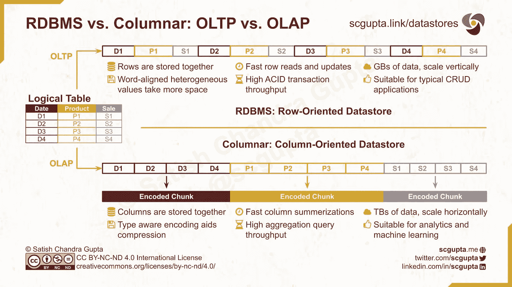

# SQL 联接:内部、左侧、右侧和完全联接

> 原文：<https://towardsdatascience.com/sql-joins-tutorial-inner-join-left-join-right-join-full-join-cross-join-5eef2eee0617>


[克莱班克斯](https://unsplash.com/@claybanks)在 [Unsplash](https://unsplash.com/photos/LjqARJaJotc) 拍摄的照片

## 数据工程

## 各种类型的 SQL 连接以及如何使它们更快

对于数据工程师和数据科学家来说，SQL 是宝贵的专业知识。所有现代数据仓库以及数据或三角洲湖都有 SQL 接口。了解 SQL 查询是如何执行的可以帮助您编写快速而经济的查询。

一旦你理解了 SQL 概念，比如 *join* 和 *window* ，你就会直观地理解 Spark、Pandas 或 r 中的类似 API，毕竟，SQL 是一种古老的编程语言，仍然是最适合它们的(另一个这样的例子是用于系统编程的 C)。

SQL 第一个[出现于 1974 年](https://web.archive.org/web/20070926212100/http://www.almaden.ibm.com/cs/people/chamberlin/sequel-1974.pdf)用于访问关系数据库中的数据，其最新标准发布于 [2016](https://www.iso.org/committee/45342/x/catalogue/p/1/u/0/w/0/d/0) 。它是一种声明性语言(即程序员指定*做什么*，而不是*如何做*)，具有强静态类型。

SQL Join 是合并来自不同源(或表)的具有不同属性(或列)的数据的最常见和最重要的操作之一。在本文中，您将了解各种 SQL 连接以及在大型表上编写高效连接的最佳实践。

# SQL 连接

SQL 联接操作用于组合两个或多个表中的行，有两种类型:

*   条件连接:根据一个或多个公共列(通常是主键或外键)上的条件来组合行。有 4 种类型的条件连接:内连接、左连接、右连接和完全连接。
*   交叉连接:两个表的笛卡尔积。

# 内部连接

只有当关键字出现在两个*表中时，内部连接才会产生一个组合两个表中的行的行。*

例如，如果您在不同的渠道上开展了两次营销活动，从两个表中获取了潜在客户信息:

*   表 A:姓名和电话号码
*   表 B:姓名和电子邮件

```
**Table A:** Name      |      Phone
----------------+-----------------
 Warren Buffett | +1-123-456-7890
 Bill Gates     | +1-987-654-3210**Table B:** Name      |      Email
----------------+-----------------
 Bill Gates     | bgates@live.com
 Larry Page     | lpage@gmail.com
```

使用内部连接，您可以找到所有拥有电话号码*和电子邮件地址*的客户线索:

```
SELECT A.Name, A.Phone, B.Email
FROM A
**INNER JOIN** B
ON A.name = B.name;
```

单词`INNER`是可选的，如果你愿意，你可以省略它。结果将是:

```
 Name      |      Phone      |      Email
----------------+-----------------+-----------------
 Bill Gates     | +1-987-654-3210 | bgates@live.com
```

# 左外部连接

左连接返回左表中的所有行和右表中的匹配行。

比方说，您的销售团队决定通过电话联系所有客户线索，但是如果可能的话，也想通过电子邮件跟进。通过 Left Join，您可以创建一个客户列表，其中有他们的电话号码，但也可能有他们的电子邮件:

```
SELECT A.Name, A.Phone, B.Email
FROM A
**LEFT OUTER JOIN** B
ON A.name = B.name;
```

单词`OUTER`是可选的，如果你愿意，你可以省略它。结果将是:

```
 Name      |      Phone      |      Email
----------------+-----------------+-----------------
 Warren Buffett | +1-123-456-7890 |       *null*
 Bill Gates     | +1-987-654-3210 | bgates@live.com
```

# 右外部联接

右连接返回右表中的所有行和左表中的匹配行。

比方说，您想要相反的结果:所有客户都有电子邮件地址，如果可能的话，还有他们的电话号码:

```
SELECT B.Name, A.Phone, B.Email
FROM A
**RIGHT OUTER JOIN** B
ON A.name = B.name;
```

单词`OUTER`是可选的，如果你愿意可以省略。结果将是:

```
 Name      |      Phone      |      Email
----------------+-----------------+-----------------
 Bill Gates     | +1-987-654-3210 | bgates@live.com
 Larry Page     |       *null*      | lpage@gmail.com
```

# 完全外部连接

完全联接将尽可能返回两个表中匹配的所有行。

比方说，您想要一份所有有电话号码或电子邮件地址的客户的综合列表，或者，如果可能的话，两者都有:

```
SELECT
  CASE
    WHEN A.Name IS NOT NULL THEN A.Name
    ELSE B.Name
  END AS Name,
  A.Phone, B.Email
FROM A
**FULL OUTER JOIN** B
ON A.name = B.name;
```

`OUTER`这个词是可选的，如果你愿意，你可以省略它。在一些数据库中，一个简单的`SELECT *`可能就可以了，你不需要那个`CASE`语句。结果将是:

```
 Name      |      Phone      |      Email
----------------+-----------------+-----------------
 Warren Buffett | +1-123-456-7890 |       *null*
 Bill Gates     | +1-987-654-3210 | bgates@live.com
 Larry Page     |       *null*      | lpage@gmail.com
```

以下是所有 4 个条件连接的备忘单:


SQL 联接:内部、左侧、右侧和完全联接。图片由作者提供，并在[Creative Commons BY-NC-ND 4.0 International](https://creativecommons.org/licenses/by-nc-nd/4.0/)许可下发布。

# 交叉连接

SQL 交叉连接是两个表的笛卡尔乘积。它将左表的每一行与右表的每一行配对。

假设您有一个表`CarType`，其中有 7 行值:轿车、掀背车、轿跑、MPV、SUV、皮卡和敞篷车。

你还有一个有 5 行的桌子`Color`:红色、黑色、蓝色、银灰色和绿色。

两者之间的交叉连接将生成一个 35 行的表，包含汽车类型和颜色的所有可能组合:

```
SELECT *
FROM CarType
**CROSS JOIN** Color;
```

我还没有在数据分析或数据科学项目中遇到过交叉连接的使用。

# SQL 联接最佳实践

并非所有的 SQL 查询都是相同的。加入通常是高成本操作。由于在线分析处理(OLAP)应用程序处理大量数据，优化的 SQL 查询可以节省您的时间和金钱。

大多数数据仓库在运行查询后会报告查询执行计划和各个部分的成本。检查它可以帮助您优化存储和查询。

## 来自关系代数的直觉

SQL 连接的查询计划至少有以下关系代数运算符:

*   **Projection(π):**表中列的子集。这对应于查询中关键字`SELECT`之后的列列表。
*   **Selection (σ):** 按条件过滤的行的子集。这来自查询中的`WHERE`子句中定义的条件。
*   **联接(⋈):** 来自`JOIN`操作的表之间的联接。

优化 SQL 连接查询的关键是最小化连接(⋈)操作符的表的大小。以下最佳实践正是为了做到这一点而设计的。

## 1.仅选择您需要的列

数据仓库是列数据库，即列中的值存储在一起(在 RDBMS 中，行存储在一起)。因此，`SELECT *`是一个特别糟糕的主意。



RDBMS 与列式:面向行的数据库用于 OLTP，面向列的数据库用于 OLAP 应用程序。图片由作者提供，并在[Creative Commons BY-NC-ND 4.0 International](https://creativecommons.org/licenses/by-nc-nd/4.0/)许可下发布。

## 2.通过分区和聚类快速过滤

考虑您将使用的典型的`WHERE`子句，并确定过滤中使用最多的列。根据您的数据库，执行以下任一可能的操作:

*   在一个常用的列上对表进行分区，该列平均分割数据(例如时间戳、日期)。
*   列上的聚类对分区内的数据进行排序。如果定义了多个聚类列，数据将按嵌套排序顺序存储。这将与您常用的过滤条件相匹配的数据放在一起。

## 3.仔细排列 WHERE 子句中的条件

在`WHERE`子句中，首先使用分区列和聚集列上的条件，因为这些条件会运行得更快。

对其余条件进行排序，使筛选出最多行的条件排在最前面。这样，每个条件都将尽可能减少最大行数。

## 4.尽可能地减少行数

左右表的行数越多，匹配连接中的键所需的时间就越长。您可以通过以下方式减少行数:

*   尽可能早地过滤数据:尽可能在连接前而不是连接后过滤子查询中的表。
*   尽可能早地聚合数据:聚合大大减少了行数，所以只要有可能，就在连接之前而不是在连接之后进行聚合。

## 5.尽可能晚地加入

这是显而易见的，但我必须重申一点:在将左右表馈送到`JOIN`操作之前，尽一切可能减小它们的大小。

# 摘要

SQL 连接是数据分析和数据科学中的常见操作。您了解了内连接、左连接、右连接和全连接，以及优化 SQL 连接查询的最佳实践。

要了解包括列仓库在内的各种数据库的更多信息:

[](/datastore-choices-sql-vs-nosql-database-ebec24d56106)  

**如果您喜欢，请:**

[](https://www.ml4devs.com/newsletter/)[](https://twitter.com/intent/follow?user_id=29633907)[](https://www.linkedin.com/in/scgupta/)

*最初发表于*[T5【ML4Devs.com】](https://www.ml4devs.com/articles/sql-joins-tutorial-inner-join-left-join-right-join-full-join-cross-join/)*。*