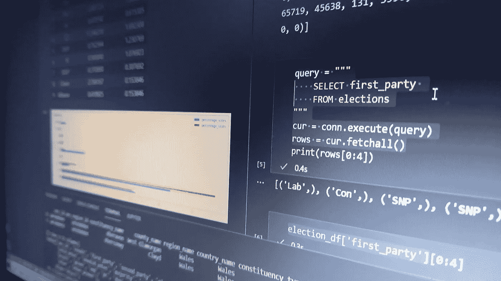
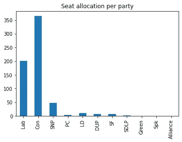
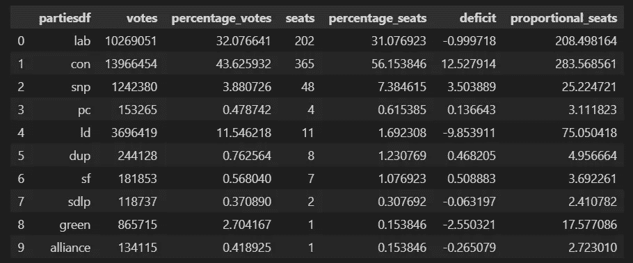
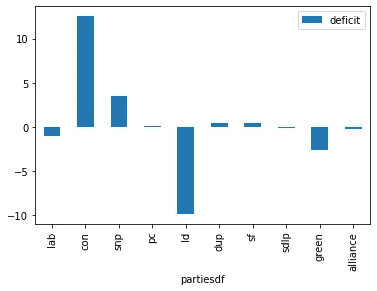
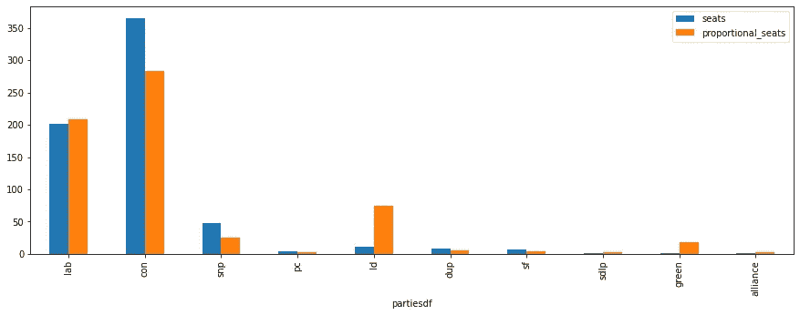

# SQL，Pandas，或两者兼而有之:用 Python 分析英国选举系统

> 原文：<https://towardsdatascience.com/sql-pandas-or-both-analysing-the-uk-electoral-system-24fa01d33d05>

## Python Pandas 非常适合分析和绘制数据，但是您应该用 Pandas 还是 SQL 编写代码呢？让我们来看看使用两者的一些常见操作，并看看它们是如何比较的。



作者图片

我不是 SQL 专家。事实上，老实说，这是我在职业生涯的大部分时间里试图避免的两件事之一(另一件是 Visual Basic)。但是有些人对使用 R、Python 或 Pandas 进行数据分析的想法嗤之以鼻，因为…嗯，这就是 SQL 的设计目的。

SQL 已经存在了很长时间——大约 50 年——并且仍然是关系数据库世界中事实上的查询语言。SQLite、MySQL、MariaDB 和 Postgresql 等流行产品都是基于 SQL 的，高端企业系统 Oracle 和 Microsoft SQL Server 也是如此。

所以，如果你是一个做数据分析的 Python 程序员，你应该用 Pandas 还是 SQL 编写代码呢？

我想使用 Python 对一些英国选举数据做一些分析，这需要我做一些相当普通和简单的分析任务。最初，我想弄清楚为什么英国政府在议会中拥有绝大多数席位，却只获得了相对较小比例的普选。

我决定同时使用 Pandas 和 SQL 来看看我更喜欢哪个。我将描述我做了什么以及如何做的，你可以自己决定你认为哪种方法更好(或者，实际上，如何改进它们)。

为了进行分析，我们将使用来自英国 2019 年大选(最后一次)的数据，当我们比较 SQL 和 Pandas 时，我们也可以了解一点民主在英国是如何运作的。

有两个文件，一个 CSV 文件(供 Pandas 使用)和一个 SQLite 数据库——两者包含完全相同的数据。这些数据是公共记录，来自下议院图书馆保存的选举结果。这些数据可以在 Open Parliament Licence 3.0 下免费使用，我的节略版可以从我的 Github repo 免费下载。

我在这里的兴趣是看看英国议会到底有多有代表性。鉴于目前的保守党政府获得了不到 50%的选票，他们怎么会在下议院获得大约 80%的多数席位呢？

# 因第一个到达终点线而获胜

事实上，任何熟悉英国*得票最多者当选*投票制度的人可能都已经知道答案了。为便于投票，英国被划分为 650 个选区，每个选区为他们选择的候选人投票(这些候选人通常代表一个政党)，得票最多的候选人获胜。如果只有两个候选人，那么获胜者肯定获得了 50%以上的选票。但通常情况并非如此。

大多数选区都有两个以上的候选人，所以如果投票结果很接近，获胜的候选人只比她的对手有一点点优势，那么这个候选人很可能只有不到 50%的选票。我们可以用一个简单的例子来说明这一点:假设一个选区有 5 万张选票，其中 5000 张投给了绿党，1 万张投给了自由民主党，1.5 万张投给了工党，剩下的 2 万张投给了保守党。保守党以 5000 英镑的多数票获胜，并获得该选区的议会席位。但是他们只获得了 40%的选票！

当这种情况在 650 个选区重复时，你可以看到在下议院拥有最多席位的政党可能不会得到大多数选民的支持。

这一制度的批评者认为这是一个根本性的弱点，他们更喜欢其他欧洲国家的比例制度。支持者称*第一个超过*第二个可以避免不可避免的联合政府的衰弱。

但是，让我们不要担心政治，让我们弄清楚发生了什么，无论如何都要进行分析。

# 原始数据

正如我所说的，有两个相同的数据集，一个是 SQLite 数据库，另一个是 CSV 文件。SQLite 是 Python 不可或缺的一部分，因此它非常适合这个练习，CSV 文件可以很容易地导入到 Pandas 数据帧中。

我在一定程度上对数据进行了匿名处理，因为我删除了当选议员的姓名以及他们所代表的选区的名称——这与个人或该国的地区无关，而只是关于数字是如何累加的。

这些表包含以下列:

*   ons_id:选区的标识符
*   结果:获胜的一方，以及它是新的胜利还是“保留”
*   第一方:获胜的一方
*   第二党:第二大党
*   选民:选民的数量
*   valid_votes:有效票数
*   invalid_votes:无效票数
*   多数票:获胜者和亚军之间的票数差异
*   保守党、工党、工党、英国退出欧盟党、绿党、苏格兰国民党、社会党、民主统一党、社会党、统一党、联盟党、其他:各党派及其投票份额

为了加载数据，我们使用下面的代码。

对于 CSV 文件:

```
import pandas as pd
election_df = pd.read_csv('elections.csv')
```

对于数据库:

```
import sqlite3 as sql
conn = sql.connect('elections.db')
```

这给了我们两种形式的数据集。

如果我们这样做

```
election_df.head(4)
```

我们可以看到它的样子。这是局部视图:


作者图片

为了进行分析，我们想知道每个政党的投票数。所以第一件要做的事情就是找出所有赢得下议院席位的政党的名字。我们首先从专栏 *first_party* 中获取所有获胜者的列表。

使用熊猫，我们只需这样做:

```
election_df['first_party']
```

我们可以把这个表达式赋给一个变量，这样我们就有了所有赢家的列表。

我们如何用 SQL 做到这一点？

第一件事是构造一个 SQL 查询，然后执行它。您可以看到下面的查询是一个字符串。我们首先使用`SELECT`关键字声明我们感兴趣的字段(`first_party`)，然后在`FROM`子句中声明包含该字段(`elections`)的表。我们使用前面从数据库文件创建的连接来执行它。这将返回一个游标，我们可以用它来检索包含我们的数据的行。

```
query = """
    SELECT first_party 
    FROM elections
"""
cur = conn.execute(query)
rows = cur.fetchall()
```

名单现在在`rows`。不太像熊猫那么简洁。

当然，我们的名单中有很多重复的地方，因为同一个政党可能赢得了很多席位。因此，我们想要的是这份获奖名单中的独特价值，对于熊猫来说，这很简单:

```
partiesdf = election_df['first_party'].unique()
```

我们只是使用`unique()`方法过滤结果，这就是我们分配给变量`partiesdf`的内容。

在 SQL 中，我们在查询中使用`DISTINCT`关键字来产生相同的结果。

```
query = """
    SELECT DISTINCT first_party 
    FROM elections
"""
cur = conn.execute(query)
rows = cur.fetchall()
partiesdb = rows
```

在这段代码中，我们将结果赋给了变量`partiesdb`。

事实上，我们用这两种技术得到的结果并不完全相同。对于 Pandas 版本，结果是一系列单值，而对于 SQL 查询，结果是一个元组列表。这样做的原因是，虽然我们将只从 Pandas 获得单个值的列表，但我们可以在 SQL `SELECT`语句中指定多个值，因此结果必须是一个潜在的多个值的列表。只要我们意识到差异，这并不是什么大不了的事情，也就是说，我们将使用 Pandas 系列的每个单独的元素，而在 SQL 版本中，我们感兴趣的是每个列表元素中元组的第一个值。我们的 Python 代码也会相应调整。

这是熊猫的版本:

```
['Lab', 'Con', 'SNP', 'PC', 'LD', 'DUP', 'SF', 'SDLP', 'Green','Spk', 'Alliance']
```

从 SQL 中我们得到:

```
[('Lab',), ('Con',), ('SNP',), ('PC',), ('LD',), ('DUP',), ('SF',), ('SDLP',), ('Green',), ('Spk',), ('Alliance',)]
```

名单中的所有名字都是那些在英国议会中至少拥有一套席位的政党，只有代表下议院议长的`Spk`除外。这位特殊的议员管理着众议院，被认为是中立的，通常不需要投票。因此，他或她不算党员。

稍后我们将从我们的计算中移除扬声器。

接下来我们要做的是找出每一方的获胜次数。每一个胜利都代表了下议院的一个席位，它们被记录在`'first_party'`栏中。所以，对于熊猫，我们可以写:

```
election_df['first_party'] == 'lab'
```

来获取工党的选举结果。就是这个:

```
0       True
1      False
2      False
3      False
4      False
    ...  
645     True
646    False
647    False
648     True
649    False
Name: first_party, Length: 650, dtype: bool
```

所以如果我们运行这段代码:

```
election_df[election_df['first_party']=='lab']
```

我们将获得工党所有胜利的列表，该列表的长度将代表他们获得的席位数。对我们之前创建的列表中的每个政党执行此操作，我们就可以获得每个政党赢得的席位总数。

我们可以这样做，将计数追加到一个空列表中，如下所示:

```
partywinsdf = []for i in partiesdf:
    partywinsdf.append(len(election_df[election_df['first_party']==i]))
print(partiesdf)
```

但是一种更 Pythonic 化的方法是像这样使用列表理解:

```
partywinsdf = [len(election_df[election_df['first_party']==i]) 
        for i in partiesdf]
```

结果是每个政党的席位数列表。下面是派对列表，后面是我们创建的获胜名单(即席位)，如上所示:

```
['Lab' 'Con' 'SNP' 'PC' 'LD' 'DUP' 'SF' 'SDLP' 'Green' 'Spk' 'Alliance']
[202, 365, 48, 4, 11, 8, 7, 2, 1, 1, 1]
```

我们从中可以看到，工党获得了 202 个席位，保守党获得了 365 个席位，苏格兰民族党(SNP)获得了 48 个席位，以此类推。

这种使用 Pandas 的方法运行良好，但是它与 SQL 相比如何呢？下面是等效的 SQL 版本，再次使用 Python 的列表理解。大多数处理都在函数`getWins(i)`中进行，该函数获取由`i`表示的一方的获胜次数。

```
def getWins(i):
    query = f"""
        SELECT * 
        FROM elections
        WHERE first_party = '{i[0]}'
    """
    cur = conn.execute(query)
    rows = cur.fetchall()
    return(len(rows))partyWinsdb = [ getWins(i) for i in partiesdb]
```

真正的工作是由`SELECT`语句完成的，该语句使用一个`WHERE`子句来过滤选择，使得`first_party`的值等于传递给该函数的参与方名称。请记住，在 SQL 版本中，参与方名称在元组中，因此参与方名称是`i[0]`，元组的第一个(也是唯一的)元素。

```
SELECT * 
FROM elections
WHERE first_party = '{i[0]}'
```

与 Pandas 版本相比，SQL 语句的语法(至少从我的角度来看)在意图上比 Pandas 更清晰。话虽如此，它仍然相当冗长。

让我们来看看图表形式的数据。为此，我们将使用 Pandas 绘图功能，因为这是最简单的制图方法之一。

我们的熊猫专用版本是:

```
dfdf = pd.DataFrame(partywinsdf,partiesdf)
dfdf.plot.bar(legend=False,title='Seat allocation per party')
```

SQL 版本几乎完全相同:

```
import pandas as pd
dfdb = pd.DataFrame(partyWinsdb,partiesdb)
dfdb.plot.bar(legend=False, title='Seat allocation per party')
```

我们从这两者中得到的图表是这样的:



作者图片

你可以从中看出，拥有最多议会席位的政党是保守党，比第二名工党多 150 个席位。苏格兰民族党(SNP)排在第二位，接下来是自由民主党、各种其他地区政党和绿党。

我们很快就会看到这个结果与每个政党的投票百分比的对比。但首先我要做一个决定。

# 我选择熊猫

在这一点上，我想我知道我更喜欢什么了。我承认我喜欢 SQL 语句的清晰性，但这并没有说服我放弃熊猫而选择 SQL。

我想做的下一件事是创建一个包含分析结果的新表，以便绘制一些图表。我可以使用 SQL 来完成这项工作，不会有太大的困难，但是我必须将它转换成熊猫的数据帧，以便绘制它。

因此，为了结束剩下的分析，我将使用熊猫——反正它主要是关于绘制图表的，所以我认为它更合适(你可能不同意，在这种情况下，我将非常高兴在下面的评论中听到你的观点)。

# 比例代表制

我接下来想做的是展示如果议会席位按投票数比例分配，2019 年选举的结果会是什么。

首先要做的是从数据中删除发言者，因为他不代表真实的一方。扬声器是元素 9，因此最简单的方法是:

```
partiesdf = list(partiesdf)
partiesdf.pop(9)
seats = list(partywinsdf)
seats.pop(9)
```

这只是从`partiesdf`列表和`seats`列表中删除了第 9 个元素。

现在我们算出总投票数和每个政党的投票数。

投票总数是`valid_votes`栏的总和。

```
total_votes=election_df['valid_votes'].sum()
```

为了获得每个政党的总投票数列表，我们将对应于该政党的列中的值相加。

```
total_votes_party = [election_df[i].sum() for i in partiesdf]
```

现在，我们可以使用这些数据创建一个新的数据框架:

```
share_df = pd.DataFrame()
share_df['partiesdf'] = partiesdf
share_df['votes'] = total_votes_party
share_df['percentage_votes']=share_df['votes']/total_votes*100
share_df['seats'] = seats
share_df['percentage_seats']=share_df['seats']/650*100
share_df['deficit']=share_df['percentage_seats']-share_df['percentage_votes']
share_df['proportional_seats']=share_df['percentage_votes']/100*650
```

生成的数据帧如下所示:



作者图片

让我们看看这有多有代表性。下面是一个条形图，比较了某个政党获得的席位百分比和投票百分比。我们这样创建它:

```
share_df.plot.barh(x='partiesdf',
    y = ['percentage_seats','percentage_votes'],figsize=(15,5))
```

这就是:


作者图片

你可以看到，保守党、DUP 和苏格兰国民党的席位比例高于选票比例，而其他政党的席位比例低于选票比例。我们可以通过绘制如下的`deficit`列来了解谁是系统中的赢家和输家:

```
share_df.plot.barh(x='partiesdf',y=['percentage_seats','percentage_votes'],figsize=(15,5))
```



作者图片

从这张图表中你可以看出为什么自由民主党(图中的`ld`)更喜欢英国的比例代表制选举。他们拥有的议会席位远少于他们的投票份额。绿党也同样处于不利地位。

最后，如果每个政党的投票数按比例代表，英国议会会是什么样子？如果我们将实际获得的席位数与真正比例制下分配的席位数进行对比，如下所示:

```
share_df.plot.bar(x='partiesdf',y=['seats','proportional_seats'],figsize=(15,5))
```

我们看到下议院的组成会有很大的不同。



作者图片

按比例分配的席位以橙色显示，你可以看到保守党的代表将大幅减少，他们将失去多数席位。工党将获得更多席位，但真正的赢家将是自由民主党，其席位将从 11 席飙升至 75 席，而绿党将从 1 席升至 17 席。

转而采用比例制是否是一种改进(事实上，是一种什么样的制度)不由我来说。然而，鉴于英国目前的政治状况，人们可以很容易地看到，在上述情况下，工党、自由民主党和绿党的联盟将比保守党拥有更多席位(约 300 个)，并且在其他地方政党的支持下组建政府是非常可行的。这样的结果意味着英国将会有一个完全不同的政府，不是通过改变选民的想法，而是通过不同的计票方法。

# 那么，现在怎么办？

我在这里的主要目的是弄清楚，在 Python 中，是否应该更多地依赖 SQL，而不是更少地依赖 Pandas 来进行数据分析，而不是在英国倡导新的选举制度。为此，我已经下定决心，虽然我不会像过去那样主动避开 SQL，但现在我会坚持使用 Pandas(尽管我仍然不会放弃 Visual Basic)。

感谢阅读，我希望我对变幻莫测的英国选举制度的探索对熊猫和 Python 中的 SQL(以及选举改革，如果你碰巧是英国人)有所帮助。

本文的所有源代码都可以在我的 [Github 库](https://alanjones2.github.io/Alan-Jones-article-code/)中找到。这里有到[选举. csv](https://raw.githubusercontent.com/alanjones2/Alan-Jones-article-code/master/sqlpandas/elections.csv) 和[选举. db](https://github.com/alanjones2/Alan-Jones-article-code/raw/master/sqlpandas/elections.db) 的直接链接。

如果你愿意，你可以订阅我偶尔发布的免费时事通讯，Substack 上的[Technofile](https://technofile.substack.com/)——我会在那里发布新的文章。[这里](https://technofile.substack.com/p/streamlit-special)举例来说就是我写的一堆 [Streamlit 文章](https://technofile.substack.com/p/streamlit-special)的帖子。

[](https://alanjones2.github.io/) [## AlanJones:编码、科学和技术

### 关于数据可视化和类似主题的文章、教程和应用程序——大部分是 Python 语言，参见一些示例…

alanjones2.github.io](https://alanjones2.github.io/)