# SSL 可以避免监督学习

> 原文：<https://towardsdatascience.com/ssl-could-avoid-supervised-learning-fd049a27cd1b>

## *对于* ***选择监督任务*** *与* ***满足一定性质的自监督学习(SSL)模型***

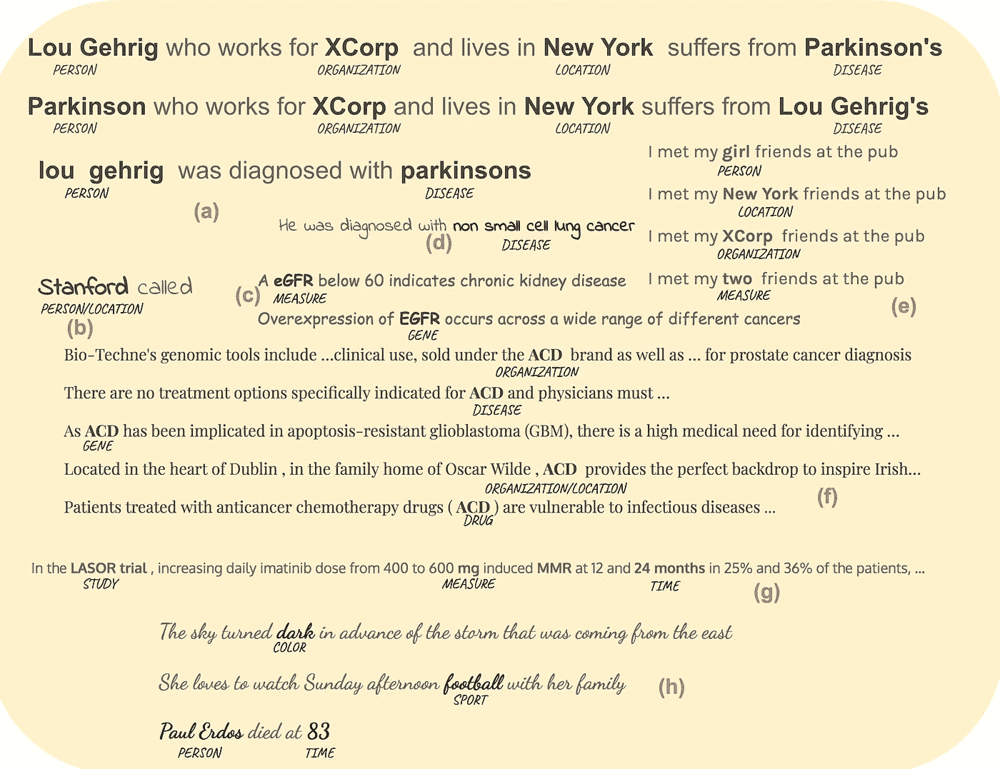

**图一。**命名实体识别(NER)在这篇文章中用自我监督学习(SSL)解决，避免了监督学习。**这里描述的方法解决了任何 NER 模型在现实应用中面临的挑战。**特别是监督模型， 需要足够的带标签的句子来处理此图中所示的情况:——(a)实体类型根据句子上下文而变化的术语(b)几乎没有上下文来确定实体类型的句子(c)其大小写为实体类型提供线索的术语(d)短语跨度的完整或适当子集的实体类型(e)在句子位置可能有多个实体类型并且只有该位置的单词为实体类型提供线索的句子(f) 在不同上下文中具有不同含义的单个术语(g)检测数值元素和单位(h)识别跨越不同领域的实体类型，这些类型需要被识别用于用例(例如，检测生物医学术语以及患者身份/健康信息的生物医学用途)。 作者图片

# TL；速度三角形定位法(dead reckoning)

自我监督学习(SSL)可用于避免对一些利用自我监督模型(如 BERT)的任务进行监督学习，而无需微调(监督)。例如，这篇文章描述了一种执行命名实体识别的方法，而无需对句子的模型进行微调。取而代之的是，BERT 的学习词汇的一个小子集被手动标记，并且通过词汇向量空间中的聚类，被标记的子集强度被放大 1k-30k 倍。这个放大的集合是用来执行 NER 使用伯特的填充遮罩功能。该方法用于标记 69 种实体类型，这些实体类型属于跨越两个领域的 17 大实体组——生物医学(疾病、药物、基因等)。)和患者信息(人员、位置、组织等。).

# 介绍

自我监督学习(SSL)越来越多地用于解决传统上由监督学习解决的语言和视觉任务。

在将标签归属于输入的全部或部分的现有技术方法中，SSL 是迄今为止最主要的方法。在许多情况下，标签本质上是合成的，即它们与输入无关，这需要在(input，label) 对上训练模型，以学习从输入到合成标签的映射。这在自然语言处理(NLP)中的例子有，归属标签如*名词、动词、*等。对句子中的单词*(词性标注)*，赋予描述句子中两个短语之间的关系类型的标签*(关系提取)*或将标签赋予句子*(例如，情感分析——肯定、否定、中立等。).*

如果 SSL 模型具有以下属性，则可以利用 SSL 来避免某些标注任务的监督学习

*   借口任务是预测输入的丢失/损坏部分
*   *模型的任何*输入都由一组固定的学习表示来表示，我们称之为*输入向量空间。*
*   模型输出的向量空间*输出向量空间*与输入向量空间相同。该属性是预测*(表示)*输入的丢失/损坏部分的借口任务的自然结果

给定这样的 SSL 模型，任何涉及标记输入*(例如命名实体识别)*的各个部分的任务都是仅使用 SSL 模型解决的潜在候选。

这篇文章使用满足上述属性的 SSL 模型来执行命名实体识别(NER ),而不需要监督学习。

NER——识别句子中单词或短语的实体类型的任务，迄今为止通常是通过在句子上训练模型来完成的，该句子被手动标记有句子中出现的单词/短语的实体类型。

例如，在下面的句子中，我们希望一个训练有素的模型将*卢·格里克*标记为*人*， *XCorp* 标记为 O *组织*，*纽约*标记为*地点，*帕金森标记为*疾病*。

```
 Lou Gehrig **[PERSON]** who works for XCorp **[ORGANIZATION]** and lives in New York **[LOCATION]** suffers from Parkinson’s **[DISEASE]**
```

这篇文章中描述的基于 SSL 的方法，除了不需要监督学习就能解决 NER 之外，还有以下优点

*   模型输出是可解释的
*   它比监督模型对[对抗性输入示例](https://arxiv.org/pdf/2109.05620.pdf)更加鲁棒
*   它有助于解决 NER 模型面临的一个潜在挑战*(在下一节描述)*。

这种方法的局限性也将在下面讨论。

此处描述的解决方案虽然在精神上类似于 2020 年 2 月发布的 [NER 解决方案，但在解决方案的关键细节上有所不同，这使其能够大规模执行细粒度 here 它用于标记 69 个实体，这些实体分属 17 个更广泛的实体组，跨两个领域-生物医学空间和患者身份/健康信息(PHI)空间。此外，该方法提供了一个通用的解决方案，可能适用于其他一些语言和视觉任务。](/unsupervised-ner-using-bert-2d7af5f90b8a)

在 11 个数据集上进行了性能测试。它在其中 3 个数据集上的表现优于当前的最先进水平，在 4 个数据集上接近最先进水平，在 3 个数据集上表现不佳*(第 11 个数据集是正在创建的自定义数据集，用于测试所有 69 个实体)*。这些结果将在下面的模型性能一节中进行分析。此外，下面还讨论了对抗输入的模型鲁棒性。

*这种方法的代码可以在 Github* 的 [*这里找到*](https://github.com/ajitrajasekharan/unsupervised_NER.git)

[*抱脸空间 app 演示*](https://huggingface.co/spaces/ajitrajasekharan/NER-Biomedical-PHI-Ensemble) *这种方法*

[*抱紧脸空间 App*](https://huggingface.co/spaces/ajitrajasekharan/Qualitative-pretrained-model-evaluation) *检查用于 NER* 的预训练 BERT 模型

# 任何 NER 模式的潜在挑战

监督模型在 [NER 基准](https://paperswithcode.com/area/natural-language-processing/named-entity-recognition-ner)上的艺术表现数字可能表明 NER 是一个已解决的任务。NER 在实际应用中的表现揭示了一个不同的观点。NER 模型在现实应用中面临的一些挑战如图 1 所示。在所有这些挑战中，有一个挑战*，甚至人类都有可能与之斗争，并与模型性能有直接关系。无论被监督还是无监督/自我监督，模型都在为此奋斗。当我们必须预测我们不熟悉的领域中的实体类型时，这一点就变得很明显了——例如，涉及法律短语的法律语言。*

*给定一个句子，和一个单词/短语*(下面术语“单词”和“短语”互换使用)*如下面句子中的 *XCorp* ，其实体类型需要确定，*

```
*Lou Gehrigwho works for **XCorp** and lives in New Yorksuffers from Parkinson’s*
```

*我们有两个线索**用于预测实体类型。***

*   ***句子结构提示** —句子的结构为短语的实体类型提供提示。例如，即使单词 *XCorp* 如下图所示，我们也可以猜测实体类型是 *Organization**

```
*Lou Gehrigwho works for _______ and lives in New Yorksuffers from Parkinson’s*
```

*   ***短语结构提示** —单词或短语本身提供了实体类型的提示。例如，单词 ***XCorp*** 中的后缀 ***Corp*** 揭示了它的实体类型——我们甚至不需要句子上下文来确定实体类型。*

*我们可以从这两个线索中推断出的实体类型可能是一致的，就像上面句子中的 *XCorp* 的情况一样。然而，情况不一定总是如此。在**只有一个实体类型**对空白位置有意义的情况下，如下面句子中的*卢·格里克*或*帕金森*的情况，单独的**句子结构提示**可能满足*(不管短语结构提示是否与句子结构提示一致)*。在句子结构提示*(不管短语结构提示是否与句子结构提示一致)*的驱动下，我们可以交换两个空白位置的单词，并且它们的实体类型也被交换*

```
*________who works for XCorp **[ORGANIZATION]** and lives in New York **[LOCATION]** suffers from ________Lou Gehrig **[PERSON]** who works for XCorp **[ORGANIZATION]** and lives in New York **[LOCATION]** suffers from Parkinson’s **[DISEASE]**Parkinson **[PERSON]** who works for XCorp **[ORGANIZATION]** and lives in New York **[LOCATION]** suffers from Lou Gehrig's **[DISEASE]***
```

*当我们预测一个短语在一个句子中的实体类型时，对于该短语在一个句子中的位置，**可能有多种实体类型，**短语结构线索**是我们可以用来检测正确实体类型的唯一线索。例如，在下面的句子中***

```
*I met my ____ friends at the pub.* 
```

*空白短语可以是一个*人、地点、组织、*或者只是一个度量，如下图所示。*

```
*I met my girl **[PERSON]** friends at the pub.I met my New York **[LOCATION]** friends at the pub.I met my XCorp **[ORGANIZATION]** friends at the pub.I met my two **[MEASURE]** friends at the pub.*
```

*在这种情况下，只有短语结构线索帮助我们确定实体类型，而不是句子结构。此外，在一些情况下，短语结构提示可能与句子结构提示不一致，因为句子结构提示可能由于语料库偏差而向许多可能的实体类型之一倾斜，这可能与基本事实实体类型不匹配。使这个问题更加复杂的是，即使两个线索一致，它也不一定匹配基本事实实体类型。例如，在下面的句子中，地面真实实体类型可能是*位置*，但是两个线索都可能指向一个*组织(短语结构线索* ***小马*** *也可能指向一种动物【马】，这取决于底层语料库)*。*

```
*I met my Colt friends at the pub.*
```

*总之，使用句子结构提示和短语结构提示，我们可以做出的预测，或者训练的模型可以对句子中的短语做出的预测落入下面的树的终端节点之一。*

*在我们的例子中，预测依赖于我们在句子来源领域的专业知识。在训练模型的情况下，预测依赖于模型被训练的语料库。*

**

*图二。作者图片*

*尽管使用了人工标记的句子，但监督模型往往难以应对这一挑战——模型输出在很大程度上取决于训练集中这些不同实体类型的句子表示的平衡，以及从监督学习步骤*(微调)*的预训练模型转移的单词结构知识。*

*最近的一篇论文通过精心设计两种对抗性攻击来检验 NER 模型的稳健性，这两种攻击是:(1)短语结构线索的变化*(在论文中称为实体级攻击)*和(2)句子结构线索的变化*(在论文中称为上下文级攻击)*，通过选择性替换句子中比其他单词更能捕捉上下文的某些单词。除了精神上的细微差别，这两种对抗性攻击检查了上述挑战中几个案例的模型性能。*

*这里描述的基于 SSL 的方法为这个挑战提供了一个既健壮又可解释的解决方案。*

# *这种方法的要点*

*当用掩蔽语言模型(MLM)和下一句预测目标进行自我监督训练时，BERT 模型产生(1)学习词汇向量和(2)模型。*

*   *词汇向量(~30k)是一组固定的向量，用于捕获词汇之间的语义相似性。也就是说，词汇表中每个术语的邻域捕获了该单词在它可能出现在句子中的各种句子上下文中的不同含义。在一个术语的邻域中捕获的不同含义既由模型预先训练的语料库决定，也在某种程度上由词汇表决定。*
*   *该模型可以将*(当用于表示句子中的单词时)*以上的向量转换为其上下文特定的含义，其中上下文特定的含义通过词汇向量*(输入和输出向量空间相同)*的**相同向量空间**中的邻域来捕获。如前所述，输出向量的预测发生在用于表示输入的相同向量空间中，这仅仅是因为模型通过预测用于表示输入的被屏蔽/被破坏的向量来学习。*

*如下所述，预训练的 BERT 模型的这两个特征被用来在没有监督学习的情况下进行 NER。*

**

*图 3。这种方法的要点——在下面的要点中描述。实体向量是代表性样本。表皮生长因子受体和 eGFR 的真实数量比图中显示的多 20 倍。作者图片*

*   *BERT 模型词汇表中的术语子集是用我们感兴趣的实体类型手工标记的。这种人工标记作为一种引导种子来收获可解释的载体。这方面的一个例子是上面图 3 中的步骤 1——标记像 *egfr* 这样的术语，不考虑情况。*
*   *在某种程度上，手动标注可能既嘈杂又不完整，因为**它不直接用于标注输入句子**中的实体。相反，手动标记的术语用于通过算法为模型的学习词汇中的每个单词创建一个*可解释的实体向量*。*一个实体向量*仅仅是出现在一个词汇项的向量邻域中的那些人工标注的词汇项的所有标签的集合。我们可以为词汇表检索词收获比用标签手动播种的词汇表检索词多 3 倍的信息丰富的实体向量。此外，即使对于那些手动播种的术语，算法收获的实体向量也比手动播种的具有更多的实体信息。向量邻域有助于此。到目前为止描述的两个步骤都是离线步骤。收获的实体向量用于下一步。这方面的一个例子是上面图 3 中的步骤 2——使用相同的人工种子 *egfr* 对像 *eGFR* 和 *EGFR* 这样的术语进行算法标记。请注意，这些术语的不同含义是通过算法标记来区分的——eGFR 几乎完全失去了*基因*实体类型*(即使* ***度量*** *在 eGFR 中不占主导地位，正如理想情况下应该的那样，它仍然有助于肌酸酐例子的句子上下文中的实体类型度量)*，而 eGFR 主要变成了*基因*。*
*   *然后，通过取一个输入句子，屏蔽需要确定其实体的短语，并对该屏蔽位置的顶部预测的实体向量求和，来执行 NER。实体向量的这种聚集捕获了特定句子上下文中的术语的实体类型。本质上就是**句子结构线索**。此外，还使用包括每个短语的定制提示句来获取每个屏蔽短语的聚合实体向量。在获取短语的聚合实体向量时，如果可用，也使用该定制提示的[CLS]向量，如下面详细解释的。定制提示语句的实体向量近似于独立于特定语句上下文的术语的所有不同实体类型。这实质上是短语结构提示。这两个实体向量然后被合并以预测句子中短语的实体类型。该预测是通过对其进行归一化而在合并的实体向量中存在的实体上的概率分布。这方面的一个例子是上面图 3 中的步骤 3——两个句子利用算法标记捕获的 *egfr* 的不同含义来输出相应的实体预测。*

*在测试的生物医学/PHI 实体检测用例中，使用了两个预训练的 BERT 模型。一个是在 Pubmed、临床试验和 Bookcorpus 子集上从头开始预训练的 cased 模型，具有丰富的生物医学实体类型的自定义词汇表，如*药物、疾病和基因*。另一个是 Google 最初的 BERT-base-case 模型，它的词汇丰富，包括*人物、*地点和*组织*。如下所述，在集合模式中使用模型。*

# *实施细节*

## *第一步。预训练模型的选择*

*预训练模型的选择取决于(1)在我们感兴趣的领域中训练的模型的可用性和/或(2)我们在感兴趣的领域中从头开始预训练模型的能力。例如，如果我们只需要标记实体类型，如*人员、位置、组织*，我们可以使用 BERT 基本/大型 cased 模型 *(cased 模型是某些用例的关键，在这些用例中，相同的术语可以基于大小写有不同的含义，例如，eGFR 是一个度量，EGFR 是一个基因。)*。然而，如果我们需要标记生物医学实体，如*药物、疾病、基因、物种等。，*在生物语料库上训练的模型将是正确的选择。对于我们需要标记*人员、位置、组织*以及生物医学实体类型的用例，那么 Bert base/large 与在生物医学语料库*(具有主要由药物/疾病/基因/物种术语组成的定制词汇表)*上训练的模型的组合可能是更好的选择。*

*对于其他领域，如法律实体的标记等。，在这种特定领域语料库上预训练一个具有丰富特定领域术语的词汇的模型将是正确的方法，尽管考虑到从头开始预训练所涉及的成本，检查预训练的模型是否存在于[公共模型库](https://huggingface.co/models)中可能是值得的。*

*一般来说，如果我们有一个在我们感兴趣的特定领域语料库上预先训练的模型，该模型具有代表与我们相关的所有实体类型的词汇，那么这就是理想的情况——我们可以只使用单个模型，而不需要集成多个模型。另一种选择是选择两个或更多的模型，每个模型在我们感兴趣的实体子集中都很强，然后集成它们。*

***第二步。每个模型词汇的标签子集***

*这种方法的性能依赖于合成标签的实体向量捕获词汇表检索词的所有不同上下文的程度。虽然实体向量创建的大部分权重提升是通过将标签分配给术语的算法来完成的，但是算法分配的质量/丰富性取决于人工标记种子的覆盖范围。*

*标签可以大致分为三类，其中只有第一类的一个子集是由人工标记的*(大约 4000 个术语)*。另外两个标签是自动的。*

*   ***专有名词的手工标注**。虽然这可能相对容易，但我们需要确保用我们可能感兴趣的所有可能的实体类型来标记一个单词。例如，在图 3 中， *egfr* 被标记为基因和测量值。虽然我们可能在种子标注期间遗漏某个术语的某些实体类型，并让算法标注或句子结构提示捕获句子中遗漏的实体类型，但在种子标注期间，对于为人工标注选择的词汇子集，尽可能详尽地标注某个术语的所有实体类型可能是有意义的。*
*   ***形容词和副词的标注**。需要标注名词短语之前的形容词和副词来获取单词的短语结构提示。例如，为了在句子*“卢·格里克* *中获得帕金森氏症的短语结构提示，他为****XCorp****工作并且住在纽约* *患有帕金森氏症*，我们使用模型预测句子*“帕金森氏症是一种 __”中的空白位置。*空白位置的预测将包括来自词汇的形容词，例如*“神经变性的”、“进行性的”、“神经学的”*等。手动标注这些形容词可能非常困难，如果不是几乎不可能的话，这主要是因为，为了确定实体类型，我们需要两个单词的前瞻。也就是说，我们不仅需要第一个预测，还需要包含第一个预测的句子中第一个预测之后的第二个预测*(例如，我们需要预测帕金森氏症是神经退行性的 ____，帕金森氏症是进行性的 ____，等等。，以清楚地确定模型认为这些形容词/副词符合什么名词。对于这些预测，可能并不总是需要两项预测，一项预测可能就足够了，但是如果“已知”是一项预测，那么我们也需要下一项预测，以确定模型是否认为它是“已知药物”、“已知疾病”等。)*。下面描述的标记方法提供了这个问题的解决方案。*
*   ***标注子词。在大多数情况下，手动标记前缀子词和中缀/后缀子词的实体类型也几乎是不可能的，所以我们只是让下面描述的自动方法来标记它们。前缀子词的例子有*‘cur’，‘soci’，‘lik’等*，中缀/后缀有 *##ighb，#iod，#Ds 等。*即使是像*【Car】*这样的术语也几乎不可能进行大规模的人工标注——它可能是代表汽车的完整单词或人名的前缀*【Carmichael】*、化学物质*【碳酸盐】*细胞类型*【Car-T 细胞】*疾病名称*【腕管综合征】*基因/蛋白质名称*此外，这种前缀词的实体类型也取决于模型被训练的语料库。中缀/后缀单词即使不更难，也一样难。****

*标记以上所有三类单词的过程如下。它主要由算法*(自动化步骤)*组成，人类在循环中播种、选择和验证过程。*

*   *我们首先决定我们想要预测的不同实体类型。每个实体类型也可以有子类型。例如，基因可以是一个实体类型，具有受体、酶等亚型。任何实体类型 X 的基本子类型是称为 X _ 形容词的子类型，用于标记形容词/副词。这里的一个关键约束是尽可能将实体类型*(连同它们的子类型)*划分成不相交的集合——实体标签类型的选择需要满足这个约束。*
*   *然后，我们通过检查词汇向量的邻域来创建聚类，其中每个聚类的中心是确定的。这种聚类过程的一个关键特征是，这些聚类是重叠的。聚类产生大约 4，000 个重叠的聚类，词汇量大约为 30，000。这是一个自动化的步骤。聚类中心用于下一步。*
*   *我们只标注这组聚类中心的所有专有名词。这是由人类执行的种子标记步骤。 ***这是人工标注术语*** 的唯一步骤。*
*   *然后，我们使用这些种子标签为词汇表中的所有术语创建实体向量。这是通过算法标记出现在一个术语的邻域中的所有术语并聚集这些标记来完成的。每个单词的实体向量实质上是它出现的所有邻域的集合。这是一个自动化的步骤。这一步的输出是所有词汇表检索词的实体向量的第一次迭代。甚至由人工进行种子标记的专有名词的实体向量也通过这一步骤得到了增强，与人工标记的那些术语相比，增加了更多的实体类型。下一步将进一步丰富形容词的实体向量。子词实体向量通过专有名词和形容词的丰富间接得到丰富。*
*   *我们仅使用专有名词*(手动标记的那些)*来构造定制提示，将它们传递给模型，并获取定制提示的所有预测，然后构造新的定制提示，附加第一次前瞻的每个预测。由此，我们选择主要使用的形容词，并将其标记为相应名词*(这里的形容词一词用于涵盖形容词和副词)*的形容词实体类型。这是一个半自动的步骤。这一步的输出是专有名词/动词的形容词/副词的实体标签。*
*   *我们再次重复实体向量创建步骤，为词汇表中的所有术语生成实体向量。这产生了前面提到的所有三个标签类别的标签——专有名词/动词、形容词/副词，作为子词。这是一个自动化的步骤。*

*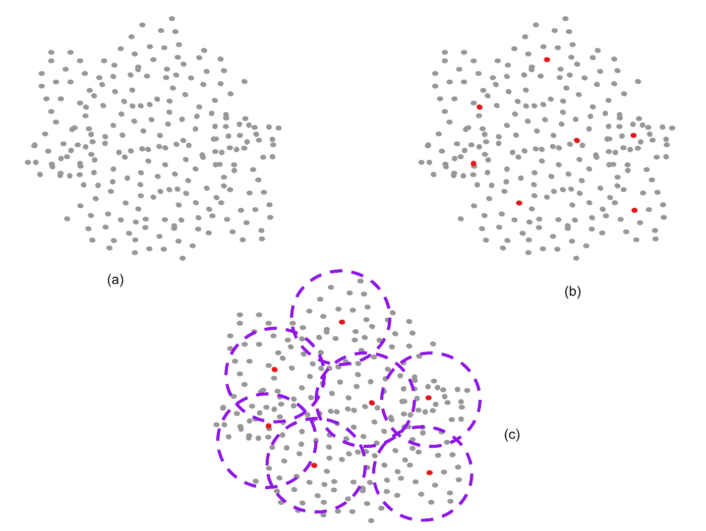*

*图 4。聚类辅助的手动标注流程示意图。我们首先沿着图 4 所示的路线对词汇向量进行聚类。这些聚类的中心(大约 4000 个)是手动标记的。考虑到分类之间的重叠，一个术语属于多个分类。它从附近的标记中心术语继承标记，从而将标记术语的数量缩放 3 倍，并且增加标记术语的数量，甚至超过手动标记的数量。作者图片*

**

*图 4a。使用中心选取的初始聚类用于选取术语，然后手动标记这些术语。作者图片*

*我们可能不得不重复上述步骤的全部或部分序列，以继续改进实体向量，特别是那些子类型*(在一个类型中得到正确的子类型排序)*。此外，如果我们计划在集合中使用多个模型，我们将不得不迭代每个模型擅长的实体类型，以创建形容词术语的实体向量。这种迭代是在单个模型级别上完成的。然而，与为监督模型标记句子相比，词汇上的这些标记迭代是更有针对性的迭代，以提高性能。此外，额外的词汇单词标记对模型性能的影响可以说更高，因为这种增加被该标记在其所属的所有邻域中的影响所放大，即使不是聚类中心。考虑扩展标记词汇集的一种方法是从训练、开发数据集中提取标记实体。即使词汇表中可能只存在一个子集也仍然有帮助。此外，这可能是利用训练数据集的一种方式——尽管句子很有用，但带标签的术语可能会有所帮助。*

*图 3 显示了由人类手动播种的类似 *egfr* 的单词的实体向量创建过程。如下所示，一个自动实体向量创建单词的示例，如“ *Car* ”，也可以是前缀单词，如上所述*

```
*PRODUCT/DISEASE/PROTEIN/DEVICE/GENE/RECEPTOR/CELL_COMPONENT/CELL_LINE/DRUG/ENZYME/MOUSE_GENE/PROTEIN_FAMILY/CELL_OR_MOLECULAR_DYSFUNCTION/UNTAGGED_ENTITY7/7/7/6/6/6/5/5/5/5/5/5/2/1 - word **Car** - Entity vector in Biomedical Corpus*
```

*使用基于伯特的案例为同一个单词 *Car* 自动创建实体向量的示例*

```
*PRODUCT/GENE/PERSON/DRUG/DISEASE/UNTAGGED_ENTITY/LOCATION/PROTEIN/CELL_LINE/MOUSE_GENE/ENZYME/DEVICE/PROTEIN_FAMILY/METABOLITE/RECEPTOR/CELL_COMPONENT/ORGANIZATION/CHEMICAL_SUBSTANCE/SPECIES/BIO/HAZARDOUS_OR_POISONOUS_SUBSTANCE/LA      B_PROCEDURE/THERAPEUTIC_OR_PREVENTIVE_PROCEDURE/CELL/MEASURE/OBJECT/TIME/MEDICAL_DEVICE/DRUG_ADJECTIVE/ORGAN_OR_TISSUE_FUNCTION/DIAGNOSTIC_PROCEDURE/ESTABLISHED_PHARMACOLOGIC_CLASS/LAB_TEST_COMPONENT/ORGANISM_FUNCTION/CELL_OR_MOLE      CULAR_DYSFUNCTION/VIRUS/NUMBER/HORMONE/CONGENITAL_ABNORMALITY/VIRAL_PROTEIN/SURGICAL_AND_MEDICAL_PROCEDURES/BODY_LOCATION_OR_REGION/NUCLEOTIDE_SEQUENCE/BODY_PART_OR_ORGAN_COMPONENT/EDU/CELL_FUNCTION/SPORT/ENT/MOUSE_PROTEIN_FAMILY/      SOCIAL_CIRCUMSTANCES/RELIGION/MENTAL_OR_BEHAVIORAL_DYSFUNCTION/PHYSIOLOGIC_FUNCTION/BODY_SUBSTANCE/STUDY/BACTERIUM128/83/81/68/64/62/61/53/46/42/40/36/36/36/34/27/25/22/20/20/19/16/10/10/8/7/7/7/5/5/5/5/4/4/4/3/3/3/3/3/3/3/2/2/2/      2/2/2/2/2/1/1/1/1/1/1 - word **Car** - Entity vector created from Bert-base-cased*
```

*后缀术语#伊马替尼的实体向量创建示例。主要的实体类型是人们所期望的药物。*

```
*DRUG/GENE/DISEASE/UNTAGGED_ENTITY/THERAPEUTIC_OR_PREVENTIVE_PROCEDURE/METABOLITE/HAZARDOUS_OR_POISONOUS_SUBSTANCE/SURGICAL_AND_MEDICAL_PROCEDURES/ENZYME/PROTEIN/ESTABLISHED_PHARMACOLOGIC_CLASS/LAB_PROCEDURE/VIRUS/CHEMICAL_SUBSTANC      E/PROTEIN_FAMILY/CELL/MOUSE_GENE/DRUG_ADJECTIVE/MEASURE/CHEMICAL_CLASS/HORMONE/DISEASE_ADJECTIVE/CELL_LINE/ORGANIZATION/PHYSIOLOGIC_FUNCTION/RECEPTOR/PERSON/VIRAL_PROTEIN/BIO_MOLECULE/BIO/DIAGNOSTIC_PROCEDURE/BODY_PART_OR_ORGAN_CO      MPONENT/LOCATION/VITAMIN/BACTERIUM/MOUSE_PROTEIN_FAMILY/CELL_FUNCTION/MENTAL_OR_BEHAVIORAL_DYSFUNCTION/GENE_EXPRESSION_ADJECTIVE/CELL_COMPONENT/CELL_OR_MOLECULAR_DYSFUNCTION/SPECIES/BODY_LOCATION_OR_REGION/ORGAN_OR_TISSUE_FUNCTION      /CONGENITAL_ABNORMALITY/MEDICAL_DEVICE/LAB_TEST_COMPONENT/SOCIAL_CIRCUMSTANCES/STUDY/POLITICS/BODY_SUBSTANCE/PRODUCT_ADJECTIVE/SPORT/ORGANISM_FUNCTION/LEGAL/EDU/PRODUCT1138/197/174/152/112/104/68/67/58/58/48/39/35/34/31/31/30/29/      28/25/24/21/20/17/17/17/16/16/15/14/13/13/11/10/9/9/9/9/8/8/7/7/7/7/6/5/4/3/3/2/2/1/1/1/1/1/1 - suffix **##atinib** - Entity vector in Biomedical Corpus*
```

*从上面的例子中，实体向量的一些特征可能是显而易见的*

*   *单词的实体向量本质上是实体类型上概率分布的因子形式，带有明显的尾部。*
*   *单个实体向量中存在一定程度的噪声。然而，由于短语结构线索和句子结构线索都是这些实体向量的集合，噪声的影响往往在很大程度上被减弱*(在下一节中进一步解释)*。*

*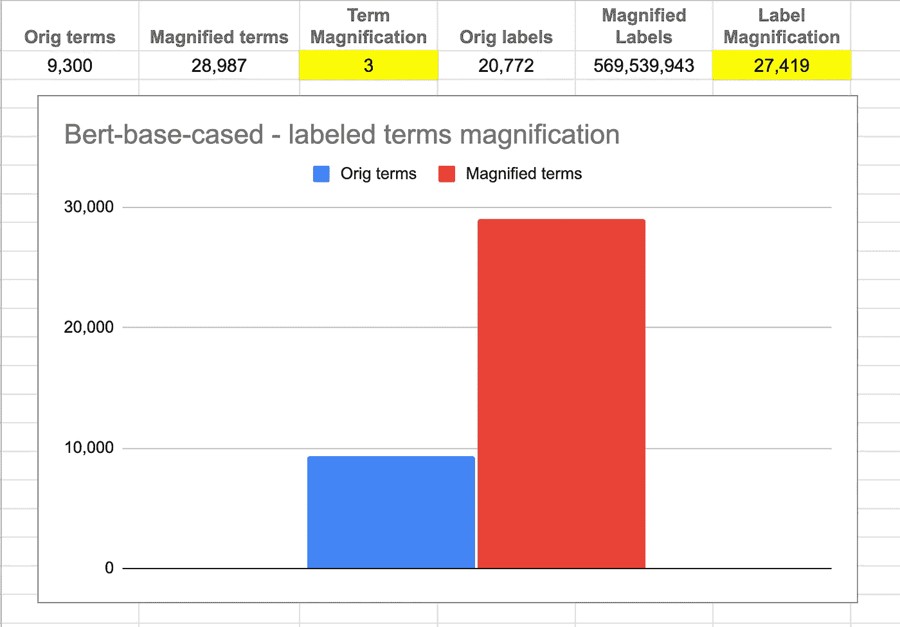*

*图 4b1。伯特基盒模型的标号放大。大约 9.3k 人类标记的术语被放大 3 倍以创建~29k 术语。原来 20k 的标签强度放大 27k 倍，达到 5.69 亿个标签。这种方法的性能依赖于这种放大。作者图片*

**

*图 4b2。标签放大获得的基于 bert 的 case 模型中的实体分布。作者图片*

*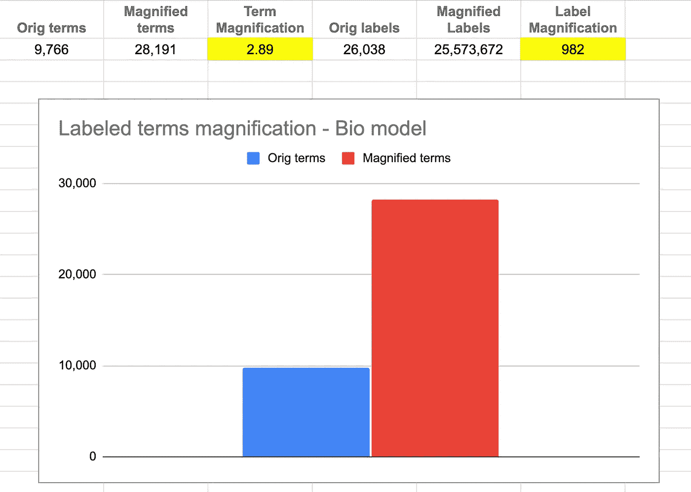*

*图 4b3。生物模型的标签放大。大约 9.7k 人类标记的术语被放大 3 倍以创建~29k 术语。原来 26k 的标签强度放大 982 倍到~ 2600 万标签。这种方法的性能依赖于这种放大。作者图片*

*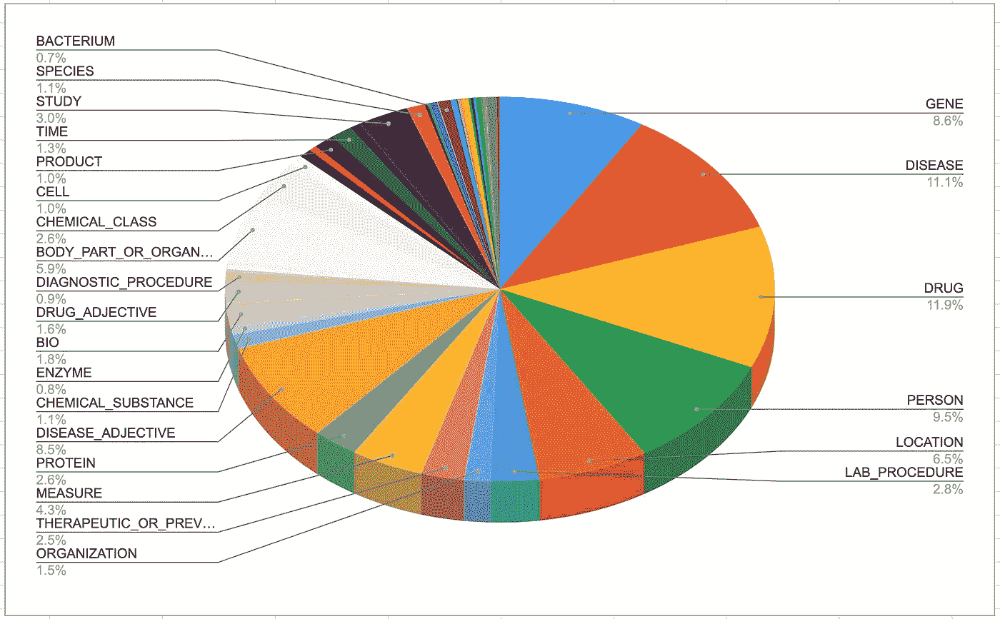*

*图 4b4。标签放大获得的生物模型中的实体分布。作者图片*

***步骤 3a。个体模型水平上的 NER 预测***

*给定一个输入句子，对于句子中需要确定实体类型的每个单词/短语，收集该单词的模型预测*(词汇向量单词)*。用于计算句子结构线索和短语结构线索的模型预测是通过模型的一次调用而获得的。例如，如果我们想预测句子中*卢·格里克和帕金森*的实体类型*

```
***Lou Gehrig** who works for XCorpand lives in New Yorksuffers from **Parkinson’s***
```

*我们构建了 4 个句子，每个单词两个——一个用于收集预测以构建短语结构线索，另一个用于句子结构线索。*

```
***1\. [MASK]** who works for XCorpand lives in New Yorksuffers from Parkinson’s
**2.** Lou Gehrig is a **[MASK]****3.** Lou Gehrigwho works for XCorpand lives in New Yorksuffers from **[MASK]**
**4.** Parkinson’s is a **[MASK]***
```

*一般来说，为了检测句子中 **n** 个单词的实体类型，我们构建了***2 * n****个句子。**

**我们构建由 *2*n* 句*组成的单个批处理(注意包含填充，使一个批处理中的所有句子长度相同)*并调用该模型。在某些用例中，我们可能只需要找到特定短语的实体类型，而在其他用例中，我们可能需要短语的自动检测。如果是后一种使用情形，我们使用 POS 标签来识别短语。**

**很少有细节有助于提高性能**

*   **对于生物医学领域来说，有大小写的模型往往比无大小写的模型表现得更好，因为它们可以利用区分基于大小写具有不同含义的单词的大小写提示——例如文本中存在的 *eGFR* 和 *EGFR* 。**
*   **使用有大小写的模型进行预测时，有选择地修改输入的大小写有助于改善模型预测。例如，如果*间皮瘤*是词汇表中的单词而不是*间皮瘤*，那么修改输入句子中*间皮瘤*的大小写以匹配词汇表中的大小写可以避免将单词分成子单词。这改进了描述符预测*(特别是当一个单词被分成多个子单词的时候)*。**
*   **当我们使用定制提示句来获取短语结构线索的模型预测*(描述符)*时，比如说*“帕金森氏症是一个[掩码]”*，如果模型的[CLS]向量已经用下一句预测进行了训练，并且在针对随机短语样本进行测试时具有高质量的预测，那么我们可以将描述符用于[CLS]向量预测以及被掩码位置的预测。例如，来自在生物医学语料库上训练的模型的句子的[CLS]位置的最高预测是*“帕金森氏症是一个[面具]”、进行性、疾病、痴呆、常见、感染等。这些描述符与[屏蔽]位置的顶部预测一起使用——神经退行性、慢性、常见、进行性、临床等。***

**短语结构提示和句子结构提示的计算是相同的，如下面的图 5 所示。每个描述符的实体向量在*下面的加权和之前通过一个 softmax(下图中未显示)。*这有助于减少标记不平衡的影响——特别是描述符签名中的绝对计数占主导地位，尽管强调了胜者获得所有*(soft max 的自然效果)*已经存在于单个描述符级别的特征*(实体签名具有明显的尾部)*。**

**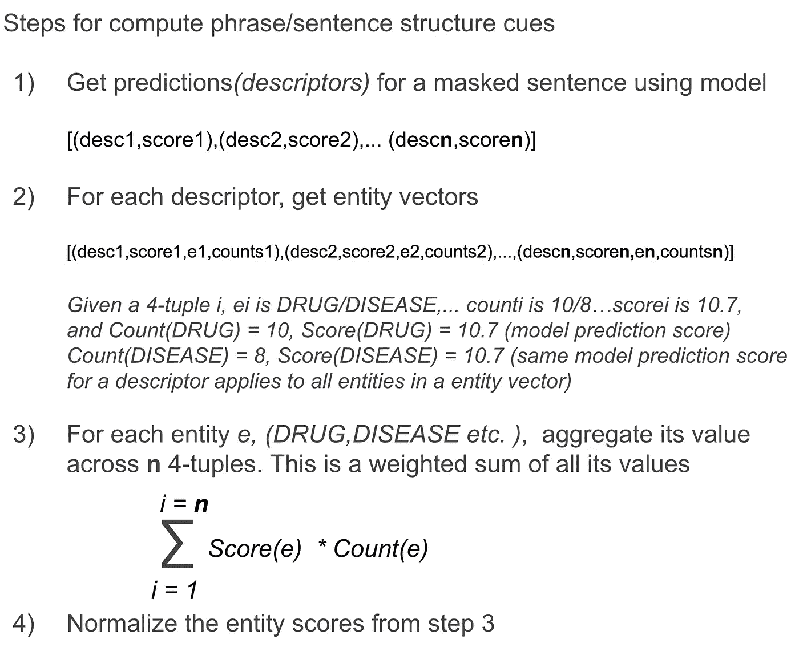**

**图 5。计算短语和句子结构线索的步骤。作者图片**

**用于集成的每个模型为每个被预测的单词输出短语结构提示和句子结构提示。**

****步骤 3b。集合模型预测****

**来自模型的集成结果，基于句子中特定实体类型的模型强度对预测进行优先排序。集合本质上基于它们专门或不专门擅长预测的实体来选择这些模型的输出。选择模型的预测时，决定其输出重要性的一个因素是，模型是预测属于其特定优势域的实体，还是预测其优势域之外的实体。该信号对于解决模型确信是错误的*(图 2 中的第二终端节点)*或者根本不确定其输出*(图 2 中的第五终端节点)*的情况是有价值的。11 个测试集的双重预测百分比从 6%到 26%不等。相比之下，对于这些情况，监督模型的输出将在很大程度上由支持这些预测之一的句子之间的训练集平衡来驱动，当两者被相等地表示时，选择其中之一的可能性是相等的。**

**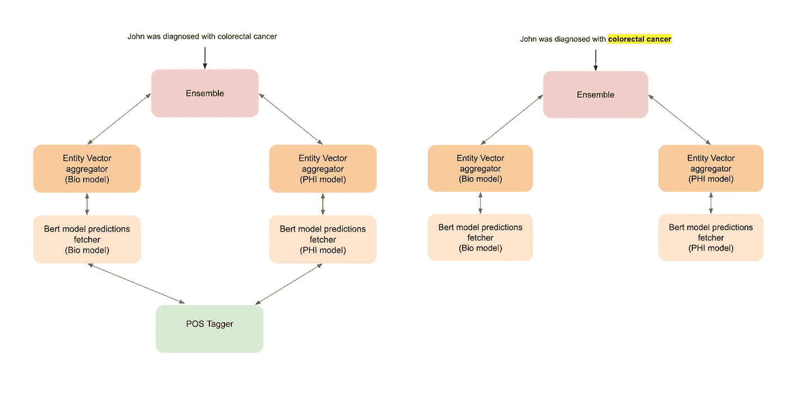**

**图 5a。模型的两个用例。在一个用例中，输入短语跨度由词性标注器确定，并且短语跨度被标注。在第二个用例中，输入句子中要标记的短语在输入期间被明确指定(例如结肠直肠癌)。在第二个用例中，没有使用 POS tagger。作者图片**

# ****合奏表演****

## **在为监督模型设计的测试集上评估自监督模型**

**NER 在应用中的两个用例(上图 5a)将在下面进行研究，因为它们与如何在为监督模型设计的流行基准上评估集合模型性能有关。**

*   ****给定任何句子，识别所有名词/动词短语跨度的实体类型**。这是旨在训练监督模型的主要用例。识别短语跨度的任务在监督训练过程*和*中被嵌入到模型中，具有检测实体类型的能力。在这种情况下，短语跨度的定义隐含在 train/dev 集中短语跨度的标记中。然后，测试集主要包含短语跨度与训练集中隐含的定义一致的句子。然而模型学习的问题*“什么是短语跨度？”从标记的训练集短语跨度中隐含的*是，它们在训练集中的标记需要一致*(从训练集中不一致的短语跨度规范可以看出，实际情况并非总是如此。参见下面的图 5b)。此外，训练集驱动的短语跨度隐式定义限制了监督模型在测试时标记短语的能力。例如，考虑图 1 中的例子*“他被诊断患有非小细胞肺癌”*。如果模型训练只标记了术语*癌症*，那么我们就失去了癌症类型的关键信息。增加复杂性的另一个事实是，短语跨度的范围可能会改变实体类型。在图 1 中的*癌症*的例子中，无论我们选择*癌症*还是*非小细胞肺癌*作为短语跨度，实体类型保持不变。然而，在句子中，再次从图 1 中，*“我在酒吧遇见了我的***朋友”，“我在酒吧遇见了我的****XCorp****朋友”*，如果我们只是选择了粗体短语，NER 就会给出*地点*和*组织*。然而，如果我们考虑短语跨度*“我在酒吧遇见了我的* ***纽约*** ***朋友*** *”，“我在酒吧遇见了我的****XCorp*******朋友****，一个 NER 模特需要标记他们两个总之，基准数据集*(旨在评估监督模型)*隐式定义训练数据中的短语跨度带来了挑战，因为定义可能不一致。更重要的是，短语跨度是什么的任何定义，其被烘焙到训练集，并因此被烘焙到监督模型，对于自监督模型是不可访问的，因为它不从训练集学习那些隐式烘焙的规则*(下面更多的例子)*。******
*   ***给定一个句子，以及句子中的特定短语，识别它们的实体类型**。特定短语可以是短语跨度的适当子集或完整的短语跨度。这种用例的一个例子是关系抽取——我们有一个具有特定实体类型的短语，我们希望获得涉及它和特定实体类型的其他术语的所有关系。例如，考虑图 1 中的术语 *ACD* ，它有不同的实体类型。比方说，我们希望找到所有这样的句子，其中 *ACD* 用来表示*药物*，并且与*疾病*一起出现在句子中。目标是确定 *ACD* 是否治疗该疾病，或者该疾病是否是由 *ACD* 引起的副作用。监督模型通常不适合这种用例，除非任务所需的短语跨度与模型被训练的短语跨度一致。*

*本帖*中描述的自我监督 NER 方法将识别短语跨度的任务从实体识别任务*中分离出来。这使得它可以在上述两种用例中使用。在第一个用例中，我们使用一个 POS 标签来标识短语跨度。在第二种情况下，我们识别句子中明确指定的短语的实体类型。然而，在为监督学习设计的标准基准测试集上评估这种方法提出了上面已经提到的挑战*

*   *因为我们在训练集上没有学习步骤来学习隐含在训练集中的短语跨度定义。如果短语跨度的规范不一致(这在流行的基准中确实是这种情况)，则短语跨度的一致标识(例如，在名词短语之前使用形容词，如在*“他患有* ***【结肠直肠癌】*** 中，或者只是挑选连续的名词短语序列作为短语跨度，*他从寒冷的* ***纽约*** *飞到阳光明媚的* ***阿拉巴马*在短语跨度的实体类型基于所包含的内容而变化的情况下*(****XCorp****朋友 vs* ***XCorp 朋友*** *在图 1 中)*即使实际上集合模型预测是正确的，预测也将被认为是错误的。***
*   *为了避免这个问题，在基准测试集上的集成评估是通过将测试集视为第二个用例来完成的。也就是说，一个句子和短语的跨度是给定的——模型必须检测实体类型。这使得我们能够忽略跨数据集的短语跨度定义的变化以及在训练集中隐含捕获的短语跨度定义的不一致。然而，这意味着我们失去了发现假阳性的能力，因为短语跨度已经给定。也就是说，句子中的所有其他术语都被平凡地标记为“其他”——当模型将不在短语范围中的术语或短语标记为不是“其他”的实体时，我们丧失了识别错误情况的能力——假阳性。另一种看待这个问题的方式是，我们被告知什么术语是“其他的”,我们只是被要求在一个不是“其他”的句子中标记实体。因此，由于模型预测总是正确的，因此“其他”上的模型性能不会计入输出中。模型性能是除“其他”之外的所有要标记的实体的平均值。*
*   *有趣的是，我们有机会在所有基准中评估模型的误报率，除了一个扭曲。在用于评估模型性能的 10 个基准数据集中，只有“OTHER”标签的句子数量从 24%到 85%不等，如下图 7 所示。这些句子被视为用例 1 句子(*给定任何句子，识别所有名词/动词短语跨度的实体类型)*，并且计算将其他标记为其他实体类型的假阳性率*(在该测试集中被测试)*。图 6 中的性能数字考虑了由于这些句子导致的实体类型精度的降低。奇怪的是，这些带有“OTHER”标签的句子实际上包含了具有实体类型的句子，如果这种方法检测到的是细粒度的实体类型，那么这些实体类型就有资格成为合法的实体子类型*(下面附加细节部分中的示例)*。因此，如果实体类型如当前方法中定义的那样宽泛，那么大部分误报不是误报而是真报。为了说明这一点，下面的图 7 中列出了忽略仅“其他”句子中的假阳性的模型性能。在 10 个基准测试中，有 5 个测试的性能高于最先进水平，这种宽松的评估不包括将实体标记为其他实体的模型的误报*(注意，由于位置被捕获并计入 F1 分数计算中，一个人被错误标记)*——不用说，列出这一点纯粹是为了说明上面提到的观点。*

*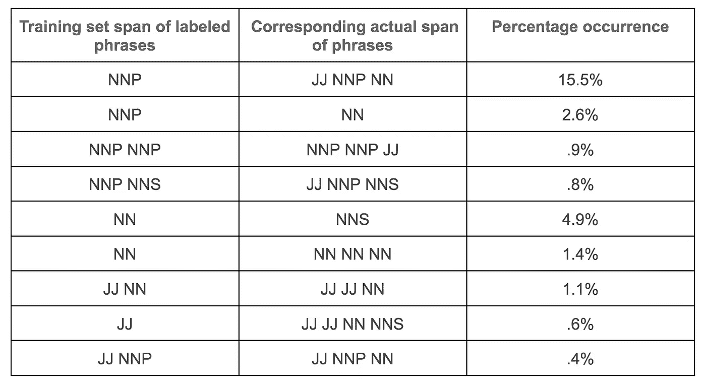*

*图 5b。从一个数据集测试集(BC2GM)中抽取标记短语样本。一般而言，人类标记的短语跨度往往与匹配完整短语跨度长度的一些短语不一致(例如，连续 NN/NNP)，并且在其他情况下，它们往往在长度上小于实际短语跨度。这些不一致的短语跨度标注的例子出现在 [Github 存储库](https://github.com/ajitrajasekharan/unsupervised_NER)的 dataset 子目录中。作者图片*

## *对模型性能的一般观察*

*这些是在不同测试中对模型性能的一般观察，这些测试包括通过手动标记充分播种的实体类型以及通过手动标记未充分播种的实体类型*(对所选实体类型的连续标记是一个持续的过程，旨在提高模型性能，就像使用标记句子的监督模型一样)*。*

*   ***在 *(3 个数据集)*的情况下，集成性能超过了最先进水平，其中被测试的标签具有丰富的实体向量。**此外，在这些测试集中，模型表现良好的句子具有足够的上下文。最后，对于具有实体类型歧义的测试句子，短语和句子结构线索的组合足以匹配基本事实实体类型。*
*   ***在被测试的标签具有中等/差质量的实体向量**的情况下，集成性能接近于 *(4 个数据集)*或者远低于 *(3 个数据集)*的最先进水平。此外，句子的上下文不足以让模型很好地执行*(例如短句)*。最后，对于具有实体类型模糊性的测试句子，如果不使模型输出偏向特定的实体类型，短语和句子结构线索不足以匹配基本事实实体类型。监督学习通过强制模型在训练期间出现歧义的情况下选择特定标签来解决这一问题，从而使模型在测试集上选择特定的实体类型-这些主要是两种预测都适用的句子，并且测试集中的选择是这种方法中的第二个选择(当只选择第一个时，导致模型性能下降-由于这个原因，双重预测评估做得更好)。使用这种方法，即使在单词级别使用训练集也没有额外的标记。 ***如前所述，根本没有使用训练集和开发集，而是直接在测试集*** 上进行测试。虽然监督模型可以在训练集上启动，在测试集上做得更好，如果它已经启动，在模糊的情况下选择一个实体类型，不清楚这样获得的更高性能是否会应用到生产中，如果模型输出没有启动，会出现这种情况。此外，由监督模型设定的训练集上的学习并不总是有助于生产使用，[特别是对于非分布单词或句子](https://arxiv.org/pdf/2109.05620.pdf)。对监督模型的对抗性攻击在一定程度上揭示了监督模型的这一弱点。这里描述的 NER 方法更健壮，部分是因为模型被训练的句子的数量，在实践中，几乎总是比训练集大几个数量级。这减少了句子结构中的不平衡，即使存在。最后，即使在集合输出与预期输出不匹配的情况下，可解释的实体向量也提供了洞察力。这在某些实体类型未被充分标记的情况下尤其有用。*

*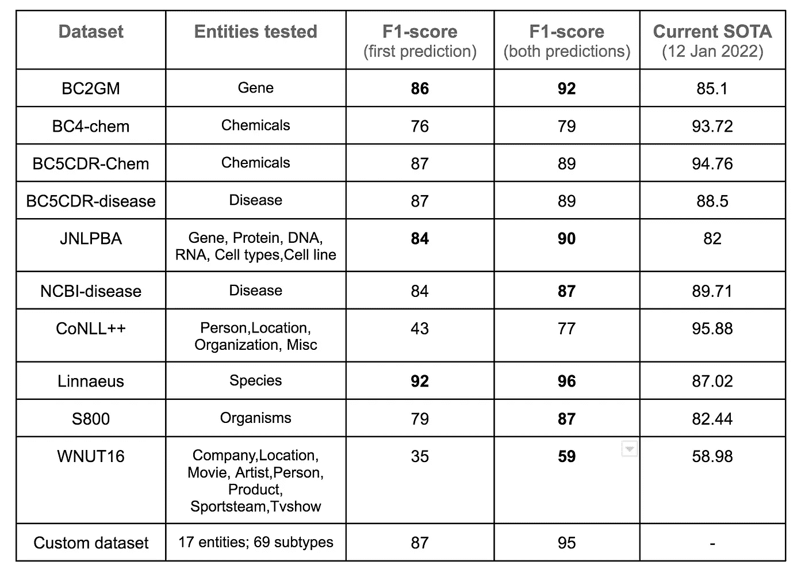*

*图 6。当模型输出双重预测时，仅使用第一个预测或前两个预测中的最佳预测来模拟性能。 [BC2GM](https://paperswithcode.com/sota/named-entity-recognition-on-bc2gm) ， [BC4](https://paperswithcode.com/sota/named-entity-recognition-on-bc4chemd) ， [BC5CDR-chem](https://paperswithcode.com/sota/named-entity-recognition-on-bc5cdr-chemical) ， [BC5CDR-Disease](https://paperswithcode.com/sota/named-entity-recognition-on-bc5cdr-disease) ， [JNLPBA](https://paperswithcode.com/dataset/jnlpba) ， [NCBI-disease](https://paperswithcode.com/sota/named-entity-recognition-ner-on-ncbi-disease) ， [CoNLL++](https://paperswithcode.com/sota/named-entity-recognition-on-conll) ，[林奈](https://paperswithcode.com/sota/named-entity-recognition-on-linnaeus)， [S800](https://paperswithcode.com/sota/named-entity-recognition-on-species-800) ， [WNUT16](https://paperswithcode.com/sota/named-entity-recognition-on-wnut-2016) 。作者图片*

*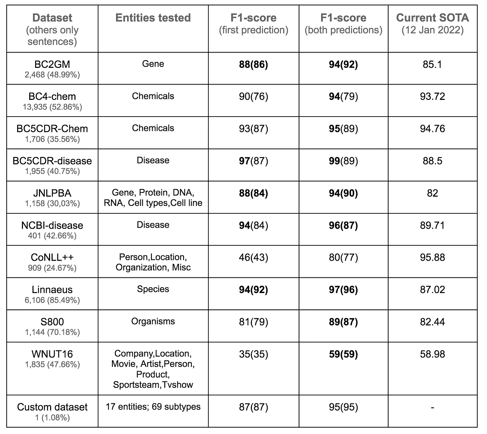*

*图 7。模型性能不分解只有“其他”标签的句子。有关这方面的更多详细信息，请参见关于模型性能的更多详细信息部分。图片作者。*

*上面的 F1 分数是通过在与实体级别相对的令牌级别对模型预测进行计数来计算的。此外，F1 分数是前面提到的所有实体*(除其他)*的平均值。*

# *对立例子的表现*

*下图中例句的稳健性能，在最近的论文[检验 NER 模型的](https://arxiv.org/pdf/2109.05620.pdf)稳健性中展示，是使用预训练模型的自然结果，无需对标记数据集进行进一步的监督学习。对抗性攻击是通过采用句子“*我感谢我的北京……*”并首先通过替换相对于监督模型的训练集非分布选择的选择实体来转换它而构建的。在下一次对抗性攻击中，句子经历了第二次转换——句子中捕获句子上下文的一些单词被替换，以检查模型对上下文级别的单词变化的鲁棒性如何。*

*下面的结果表明，集成性能不仅对顶部预测不变的两种变化都是稳健的，而且甚至对一个词的预测分布在所有三个句子变体中也保持几乎相同。*

*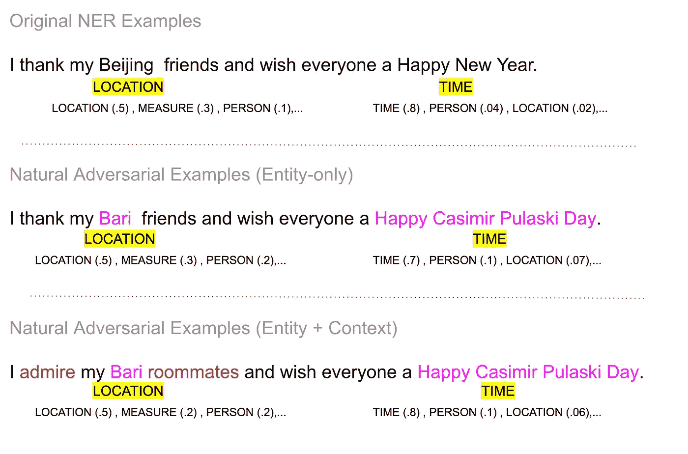*

****图 8*** *模型对对抗性例子的预测保持不变。例子来自* [*论文*](https://arxiv.org/pdf/2109.05620.pdf)*

*此外，与监督模型不同，在监督模型中，我们对模型所做事情的唯一了解很大程度上局限于实体类型的概率分布，我们可以清楚地跟踪概率分布是如何通过这里描述的方法得到的。这是这种方法的主要优点之一——通过使用可解释的实体向量，输出变得透明。例如，在上面的例句中，示出了构成短语结构和句子结构线索的模型预测。它们在三个句子中几乎保持不变，清楚地证明了预测在三个句子中是不变的。此外，句子结构提示预测位置“我遇到了我的 ___ 个朋友……”清楚地显示了实体类型的模糊性——它是计数(两个/三个)、人物形容词*(最好的、最接近的、最喜欢的、以前的)*、组织/地点*(学院、学校)*的混合抓取。句子结构线索异质性是一个有用的指标，可以用来决定我们何时必须依赖短语结构线索来得出答案。*

*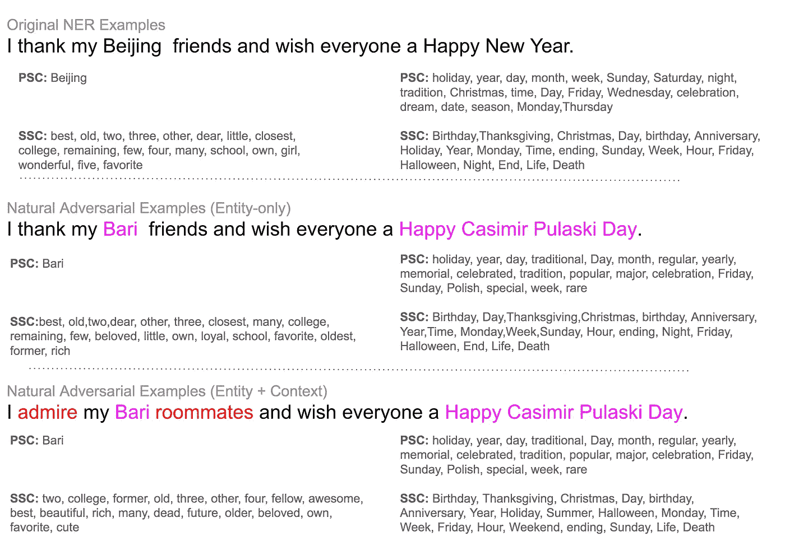*

****图 9*** *模型实体向量对于对抗性例子保持不变。例子来自* [*论文*](https://arxiv.org/pdf/2109.05620.pdf) *图片作者**

*我们可以将对抗性输入扩展到论文中描述的两种攻击之外，以查看如果短语被扩展，模型输出是否正确地标记了短语。例如，在“我感谢我的**北京**朋友……”的示例中，当我们要求模型预测标记短语“我感谢我的**北京** **朋友**……”时，我们可以检查模型预测是否切换到 Person。集成方法对所有三个句子做出正确的预测，如下所示。*

*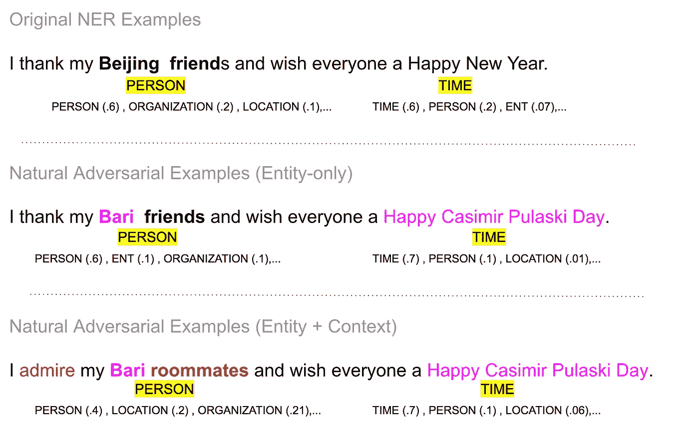*

****图 10*** *模型对扩展的对抗性例子的预测保持不变。这些是从* [*论文*](https://arxiv.org/pdf/2109.05620.pdf) *中展开的例子。作者图片**

**顺便说一下，用于构建上下文级攻击的上下文级单词是从位置的模型预测中选择的——与用于构建句子结构线索的方法完全相同。因此，这种方法对句子结构的这种变化具有弹性也就不足为奇了。**

# *这种方法的局限性是什么？*

*   *虽然我们可以在某种程度上通过词汇单词标记来影响模型输出，但是模型预测本质上是由句子和单词结构驱动的，而句子和单词结构又是由它被训练的语料库驱动的。因此，如果某些实体类型共享相同的句子上下文并且单词结构也相同，那么很难(如果不是几乎不可能)将这些实体类型彼此分开。相比之下，使用监督模型，我们可以通过添加更多带有特定标签的句子来使模型输出偏向特定的实体类型。有人可能会说，我们可以等效地做一个不平衡的种子标签，操纵预测，就像不平衡的句子标签一样。在这种方法中，假设输出依赖于专有名词标记和形容词标记，则更难装配，并且假设形容词标记是自动的，则选择性的形容词标记不容易扭曲模型结果。*
*   *从计算效率的角度来看，要预测的具有 ***n*** 短语的单个句子需要 ***2*n*** 个句子预测，即使一个模型调用作为一批完成。相比之下，监督模型产生的输出只有一句话。对此似乎没有解决办法。尝试仅用 *n + 1* 个句子进行预测，其中 n 个句子用于短语结构线索，而 *+1* 用于使用子词收集的所有上下文结构线索，预测质量显著恶化。这主要是因为子词标签淡化了实体预测，因为子词可以出现在许多上下文中，尤其是少于 3-4 个字符的上下文。*
*   *模型集成逻辑不充分，需要改进。当两个模型不一致时，当前的集成方法有时在以下选择之间挣扎:( 1)仅使用一个基于该实体类型的模型强度的模型。在这种情况下，如果有意义，选择该模型的前两个预测。(2)使用两个模型，并选择两个模型的顶部预测。这种情况产生了前两个预测，在某些情况下，如果第二个预测受到短语结构提示*(上面图 2 中的右分支路径)*和支配的句子结构提示的过度影响，则该预测可能根本没有意义。句子结构提示很少是差的，除非句子长度太小，没有足够的上下文，或者如果预测是在一个领域中，模型在*中不是很强(在这种情况下，它将最有可能被整体淘汰)*。*
*   *改进人类标记的词汇数据集是一个持续的过程，就像改进监督学习的句子标记数据集一样。然而，这可能比不上一个人收获句子所需的努力。我们为代表实体类型的特定单词添加额外的标签，该模型在这些实体类型中表现不佳。例如，当前的 bootstrap 人类标签集可以针对语言、产品、娱乐等广泛类别以及危险物质等子类别进行改进。这将在下一个类别选择的限制中进一步讨论*
*   *实体类型的大类的选择必须理想地不重叠。在代表“理想分离的实体类型”的线索重叠的某些情况下，这可能很难。例如，化学物质的大类包括毒品和危险物质。因此，如果我们的应用程序需要标记药物，由于药物的句子结构提示与危险物质的句子结构提示基本相同(药物导致不良反应的句子与摄入石棉导致疾病的句子结构基本相同)，我们将别无选择，只能根据短语结构提示将石棉作为危险物质与药物分开。这将要求对石棉的短语结构提示预测相当强，以覆盖句子结构提示。总之，当实体类别“化学物质”包括两个不同的子类别(石棉与药物)但共享相同的句子上下文时，我们必须关注这些实体子类型，并确保它们在带有标签的基础词汇表中得到很好的表示，以便能够区分这些子类型。*

# *这和之前的迭代有什么不同？*

*这种方法的核心思想的一个实现已经在 2020 年 2 月发布的 [NER 解决方案中实现。](/unsupervised-ner-using-bert-2d7af5f90b8a)*

*不同之处在于实现的一些关键细节。具体来说，*

*   *先前的实现停止于仅仅标记聚类中心。没有实体向量的算法创建/扩展。这严重地限制了模型的性能，原因有多种:( 1)形容词和前缀/中缀词没有被标记，因为如前所述手动标记它们很困难。(2)模型性能对人类标注中的噪声和标注的不完全性都很敏感。(3)人工标注的粗糙性，限制了它进行细粒度的 NER。*
*   *即使只是一个次要的细节，以前的实现也没有为句子的所有屏蔽位置向模型批量输入，这严重影响了模型预测时间性能。*
*   *此外，上述模型的集合是解决生物医学领域 NER 问题的关键。*

# *最后的想法*

*在[寻找通用架构](https://arxiv.org/pdf/2103.03206.pdf)的过程中，Transformer 架构已经成为一个很有前途的候选者，该架构可以在输入模态内和跨输入模态工作，而不需要针对模态的设计。对于一些任务，在自我监督学习期间，对基于变换器的模型的任何输入由一组固定的学习表示来表示。*

*这些固定的学习表示集用作静态参考界标来定向模型输出，其中模型输出只是由模型基于它们在表示输入时出现的上下文而变换的那些学习表示。正如本文所示，这一事实可以用来解决某一类任务，而不需要监督学习。*

*[*抱脸空间 app 演示*](https://huggingface.co/spaces/ajitrajasekharan/NER-Biomedical-PHI-Ensemble) *这种方法**

*[*抱紧脸空间 App*](https://huggingface.co/spaces/ajitrajasekharan/Qualitative-pretrained-model-evaluation) *检验用于 NER 的预训练 BERT 模型。可以检查句子和短语结构线索的模型预测以及[CLS]预测**

**这种方法的代码可以在 Github* 的 [*这里找到*](https://github.com/ajitrajasekharan/unsupervised_NER.git)*

**本文手动导入自* [*Github*](https://ajitrajasekharan.github.io/2021/01/02/my-first-post.html)*

# *模型性能—其他详细信息*

## *[1。BC2GM](https://paperswithcode.com/sota/named-entity-recognition-on-bc2gm) 数据集*

*这个数据集专门测试基因。基因在实体载体中得到了很好的表示，假设它被播种了足够的基因标签*(对于生物医学语料库，2156 个人类标签，25167 个其中含有基因的实体载体，对于基于 bert-base-cased[BBC]语料库，11369 个其中含有基因的实体载体)。最先进的模型性能在很大程度上是由于这一点，此外，当基因在句子中出现时，它与其他实体重叠的实例很少，并且当它出现时，它在很大程度上仅限于两种实体类型。例如，在句子中，基因 ADIPOQ 出现在一个药物也可能出现的句子中。然而，这种方法在第二个预测中捕获了它，即使不是第一个*(这反映在与下图中的“仅采用模型顶部预测”相比，“采用前两个预测的匹配”运行的更高的性能数字中)。***

```
***ADIPOQ**  has beneficial functions in normalizing glucose and lipid metabolism in many peripheral tissuesPrediction for ADIPOQ: DRUG (52%), GENE (23%), DISEASE (.07%),...*
```

*基因亚型的排序没有经过任何测试集的测试。尽管即使对于基因来说，子类型的细粒度检测仍然有很大的改进空间，但是考虑到包含小鼠基因和人类基因的句子结构的重叠，一些子类型(如小鼠基因)的检测可能非常困难。例如，上面的句子可以指人类或小鼠的 ADIPOQ。如果它取自涉及小鼠的段落上下文，则该预测不会捕捉到该子类型涉及小鼠基因的事实，给定的子类型分布如上句所示。*

```
*"GENE" : 0.4495,
"PROTEIN": 0.1667,
"MOUSE_GENE": 0.0997,
"ENZYME": 0.0985,
"PROTEIN_FAMILY": 0.0909,
"RECEPTOR": 0.0429,
"MOUSE_PROTEIN_FAMILY": 0.0202,
"VIRAL_PROTEIN": 0.0152,
"NUCLEOTIDE_SEQUENCE": 0.0114,
"GENE_EXPRESSION_ADJECTIVE": 0.0051*
```

**

*[BC2GM](https://paperswithcode.com/sota/named-entity-recognition-on-bc2gm) —测试详情(单次预测和两次预测)—图片作者*

## *[2。BC4](https://paperswithcode.com/sota/named-entity-recognition-on-bc4chemd) 数据集*

*这个数据集专门测试化学物质。化学物质在实体向量中得到了很好的表示，因为它被播种了足够的标签，跨越了 12 个子类型 *(6，265 个人类标签，167，908 个* *用于生物医学语料库的具有药物类型/子类型的实体向量，71，020 个用于 bert-base-cased[BBC]语料库的具有药物类型/子类型的实体向量)**

*药物、化学物质、有害或有毒物质、既定药理类、化学类、维生素、实验室程序、外科和内科程序、诊断程序、实验室测试成分、研究、药物形容词*

*这一大类子类型与相对于当前技术状态(93)的观察(图 6)性能 76(一个预测)79(两个预测)有直接关系。性能下降的主要原因是测试集中没有任何术语被标记为化学的句子的假阳性，但是模型将一个或多个短语标记为属于上述子类型之一。这一点在测试集上评估模型性能时是显而易见的，跳过了刚刚标记为 other 的句子上的模型输出。单次预测评估的性能(图 7)接近(90)现有技术水平，并略微超过前两次预测评估的性能(94)。这里有几个例子，在这些例子中，句子上的标签只带有另一个标签。以粗体标记的术语被认为是假阳性——它们是属于化学物质大类的候选物，这种方法能够检测到。*

```
*Importantly , the health effects caused by these **two substances** can be evaluated in one common end point , intelligence quotient ( IQ ) , providing a more transparent analysis .The mechanisms responsible for **garlic** - drug interactions and their in vivo relevance .**Garlic phytochemicals** and **garlic supplements** influence the pharmacokinetic and pharmacodynamic behavior of concomitantly ingested **drugs** .* 
```

*在数据集 *( failed_sentences.txt)* 的结果目录中，存在一整套标记的假阳性，如果化学品的标签类别与该模型所观察的一样宽，则这些假阳性实际上不是假阳性*

**

*[BC4](https://paperswithcode.com/sota/named-entity-recognition-on-bc4chemd) —测试详情(单次预测和两次预测)—作者图片*

## *[3。BC5CDR-chem](https://paperswithcode.com/sota/named-entity-recognition-on-bc5cdr-chemical) 数据集*

*该数据集测试化学品，就像 BC4 数据集一样。关于 BC4 的相同观察结果也适用于这个数据集，包括对只有“其他”标签的句子的假阳性的模型下降。如前所述，跳过这些句子，对于单个预测(93)和 95(两个预测)，模型性能(图 7)接近并高于现有技术水平(94)。毫无疑问，它比 87(单次预测)89(两次预测)低几分。来自其他句子的句子样本仅具有被模型标记为化学的短语的句子。在第一个例子中，模型将*化疗*分类为治疗性 _ 或预防性 _ 程序。*

```
*Onset of hyperammonemic encephalopathy varied from 0 . 5 to 5 days ( mean : 2 . 6 + / - 1 . 3 days ) after the initiation of **chemotherapy** .Cells were treated for 0 - 24 h with each **compound** ( 0 - 200 microM ) .*
```

*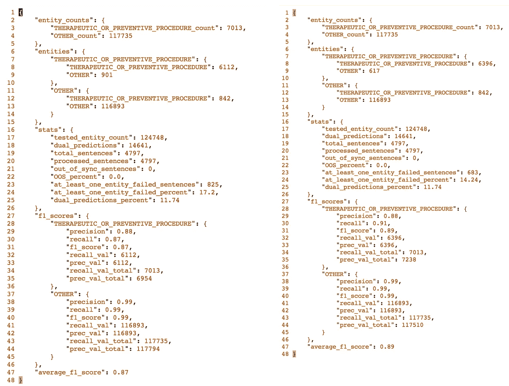*

*[BC5CDR-chem](https://paperswithcode.com/sota/named-entity-recognition-on-bc5cdr-chemical) —测试详情(单次预测和两次预测)—图片由作者提供*

## *[4。BC 5 cdr-疾病](https://paperswithcode.com/sota/named-entity-recognition-on-bc5cdr-disease)数据集*

*这个数据集专门测试疾病。疾病在实体向量中也得到很好的表示，假设它被播种了足够的标签，跨越 4 个子类型 *(3，206 个人标签，56，732 个* *用于生物医学语料库的具有疾病类型/子类型的实体向量，29，300 个用于基于 bert-base-cased[BBC]语料库的具有疾病类型/子类型的实体向量)**

*疾病，精神或行为功能障碍，先天性异常，细胞或分子功能障碍疾病形容词*

*虽然该模型已经接近并超过了现有技术水平，87/89 对 88.5，但是当不考虑仅“其他”句子中的模型预测时，它明显超过了现有技术水平。模型性能提升到 97(单次预测)和 99(两次预测)。*

*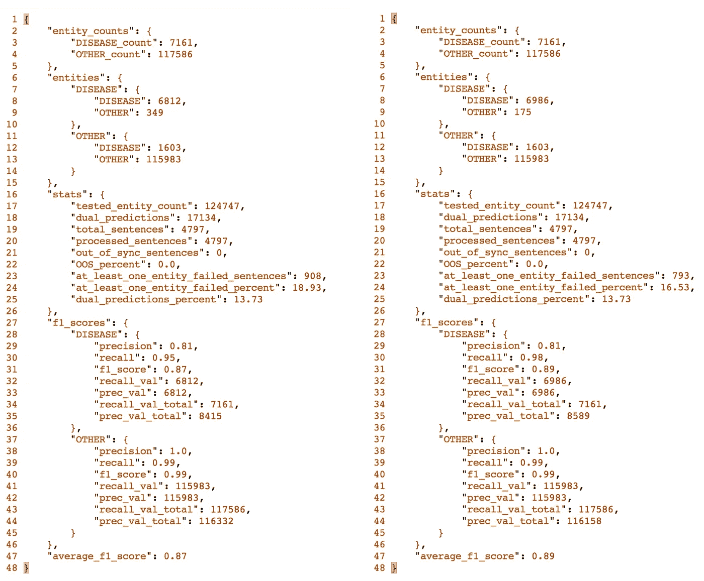*

*[BC5CDR-Disease](https://paperswithcode.com/sota/named-entity-recognition-on-bc5cdr-disease) —测试详情(单次预测和两次预测)—图片作者*

*[**5。JNLPBA**](https://paperswithcode.com/dataset/jnlpba) **数据集***

*该数据集测试基因、RNA、DNA、细胞、细胞类型，这些类型被分组到实体类别 BODY_PART_OR_ORGAN_COMPONENT 中，具有以下子类型*

*身体位置或区域、身体物质/细胞、细胞系、细胞成分、生物分子、代谢物、激素、身体形容词。*

*与基因、药物和疾病一样，该类别也具有潜在的标签支持*(对于生物医学语料库，3224 个人标签，89817 个* *具有疾病类型/子类型的实体向量，对于基于 bert-base-cased[BBC]语料库，28365 个具有疾病类型/子类型的实体向量)**

*虽然该模型也已经表现出接近现有技术水平，84/90 对 82，但是当不考虑仅在“其他”句子中的模型预测时，它进一步超过现有技术水平。模型性能提升到 88(单次预测)和 94(两次预测)。*

**

*[JNLPBA](https://paperswithcode.com/dataset/jnlpba) —测试集细节(单个预测和两个预测)。测试集中的所有实体类型都被映射到没有限定符的 B/I 标签。因此没有分裂——所有的分裂都被贴上合成的标签“基因”。—作者图片*

*[**6。NCBI 病**](https://paperswithcode.com/sota/named-entity-recognition-ner-on-ncbi-disease) **数据集***

*该数据集专门测试疾病，如 [BC5CDR-Disease](https://paperswithcode.com/sota/named-entity-recognition-on-bc5cdr-disease) 数据集。同样的观察结果也适用于这个数据集。*

*与 BC5CDR 疾病一样，虽然该模型已经接近并超过了现有技术水平，84/87 对 89.71，但当不考虑仅“其他”句子中的模型预测时，它明显超过了现有技术水平。模型性能提升到 94(单次预测)和 96(两次预测)。*

**

*[NCBI 病](https://paperswithcode.com/sota/named-entity-recognition-ner-on-ncbi-disease) —测试详情(单次预测和两次预测)—图片由作者提供*

*[**7。**conll++](https://paperswithcode.com/sota/named-entity-recognition-on-conll)数据集**数据集***

*该数据集测试与 PHI 用例相关的实体类型—人员、位置、组织。组织有其他子类型 EDU、政府、大学*

*对这些实体类型的标签支持*

*人— *(对于生物医学语料库，3628 个人标签，21741 个* *带有疾病类型/子类型的实体向量，对于基于 bert-base-cased[BBC]语料库，25815 个带有疾病类型/子类型的实体向量)**

*位置— *(对于生物医学语料库，2600 个人类标签，23370 个* *带有疾病类型/亚型的实体向量，对于基于 bert-base-cased[BBC]语料库，23652 个带有疾病类型/亚型的实体向量)**

*组织— *(对于生物医学语料库，2664 个人标签，46090 个* *带有疾病类型/亚型的实体向量，对于基于 bert-base-cased[BBC]语料库，34911 个带有疾病类型/亚型的实体向量)**

*所有实体类型相对于现有水平的整体表现不佳以及组织的糟糕表现是由以下因素造成的。语料库中的句子主要来自运动队和比分，在给定稀疏句子上下文的情况下，组织和位置同样适用于运动队。人和地点也一样。监督模型表现得非常好，因为训练使它们倾向于选择特定的实体类型，这是测试集中高分的原因。由此得出的一个结论是，这种方法在测试集上的表现不如监督模型，在监督模型中，训练集在歧义的情况下将结果偏向特定类型。*

*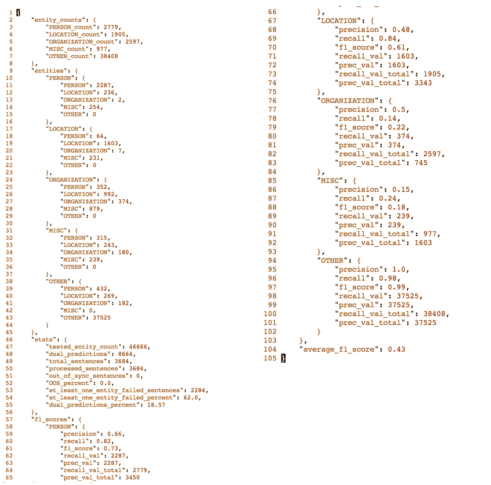*

*[CoNLL++](https://paperswithcode.com/sota/named-entity-recognition-on-conll) 测试 1/2 的详细信息(单一预测)。作者图片*

**

*[CoNLL++](https://paperswithcode.com/sota/named-entity-recognition-on-conll) 测试 2 的详细信息(两个预测)。作者图片*

## *8.[林奈](https://paperswithcode.com/sota/named-entity-recognition-on-linnaeus)数据集*

*这个数据集测试物种。这个实体类型有 4 个亚型物种，细菌，病毒，生物 _ 形容词。与上面的实体类型相比，这个类别具有相对较低的人类标签。然而，这些种子标签被实体向量放大以产生与上述类型相当的向量。*

**(对于生物医学语料库，959 个人标签，33665 个* *带有疾病类型/亚型的实体向量，对于基于 bert-base-cased[BBC]语料库，18612 个带有疾病类型/亚型的实体向量)**

*虽然模型的性能已经超过了现有技术水平，92/96 对 87，但如果不考虑“其他”句子中的模型预测，它会得到进一步的提高。模型性能提升到 94(单次预测)和 97(两次预测)。*

*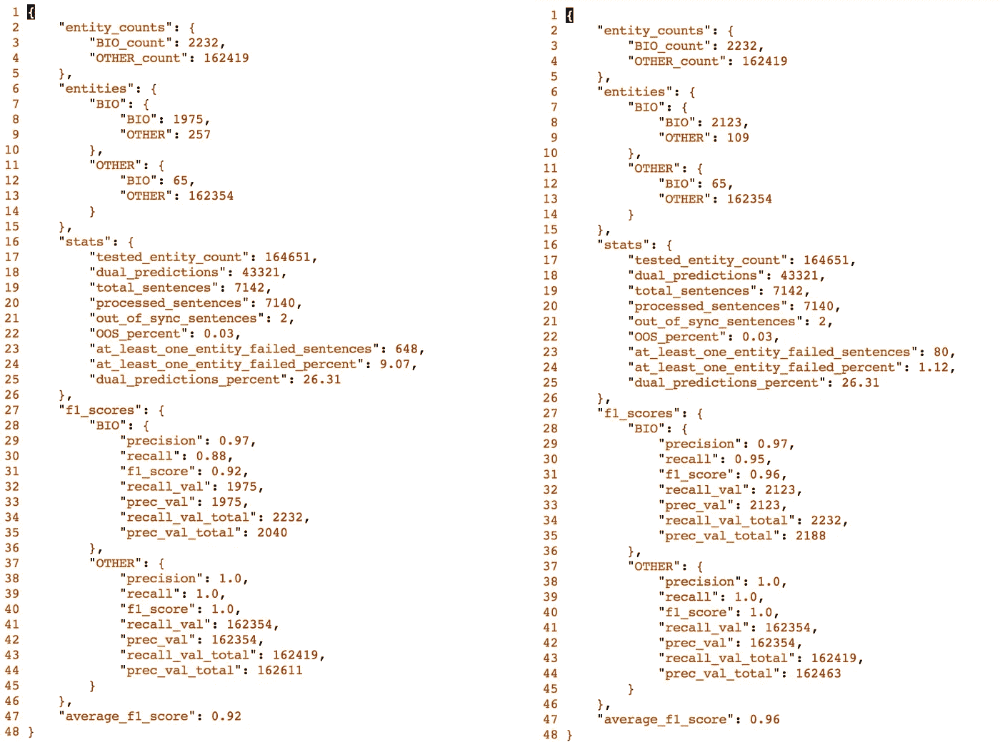*

*[林奈](https://paperswithcode.com/sota/named-entity-recognition-on-linnaeus) —测试详情(单次预测和两次预测)—作者图片*

## *[9。S800](https://paperswithcode.com/sota/named-entity-recognition-on-species-800) 数据集*

*这个数据集也测试了像[林奈](https://paperswithcode.com/sota/named-entity-recognition-on-linnaeus)数据集这样的物种，同样的观察也适用。*

**

*[S800](https://paperswithcode.com/sota/named-entity-recognition-on-species-800) —测试详情(单次预测和两次预测)—作者图片*

***10。**[**wnut 16**](https://paperswithcode.com/sota/named-entity-recognition-on-wnut-2016)**数据集***

*在这个数据集上的模型性能是最低的 35/59，尽管它在两个预测评估中胜过最先进的(58)。对模型性能差的原因的一些观察。*

*   *在这个数据集中，句子结构是独特的。这些都是简短的推文，除了具有独特结构的单词之外，通常没有什么上下文。如果预训练包括这些独特的句子和单词结构，性能可能会提高。*
*   *该模型在对象类型上表现极差。这一类别的种子标签支持(752)几乎与物种(959)一样多，并且在两个模型中都有足够的实体向量支持— (33，276)生物医学语料库和(18416)基于 bert-base-cased[BBC]语料库。尽管有这种标记支持，但性能不佳的一个原因是该语料库独特的短语和句子结构。在语料库的训练集上最低限度地评估模型并填补标记中的空白，可以帮助提高模型性能。*
*   *需要注意的一点是，即使忽略只有“其他”标签的句子，模型性能也保持不变。*

*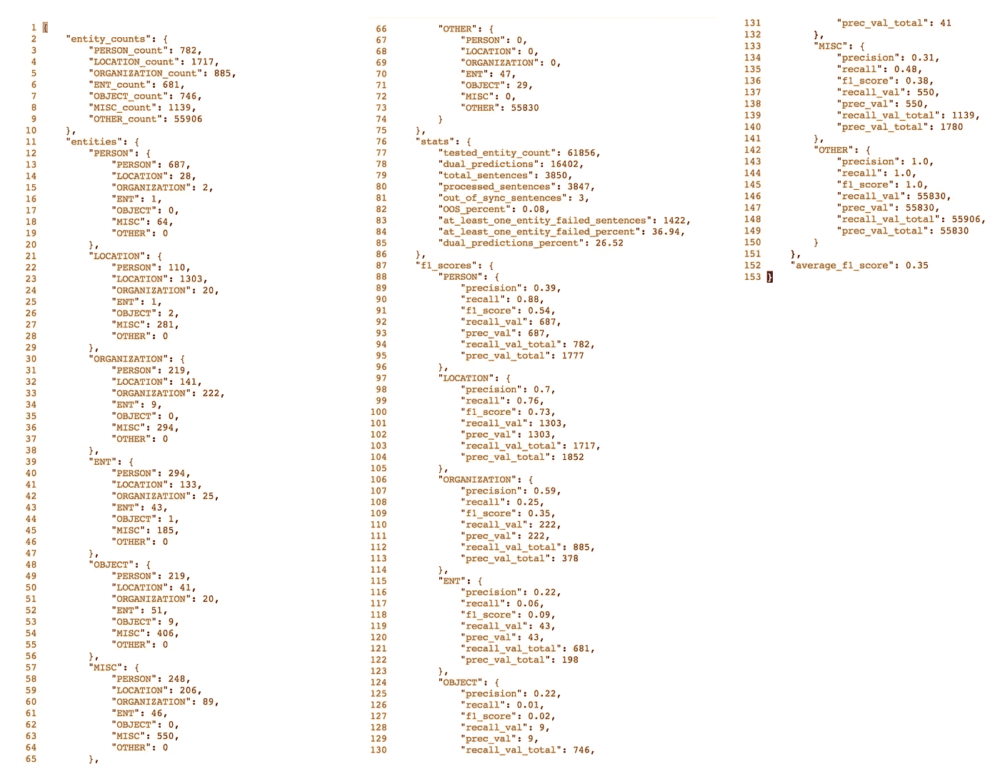*

*[WNUT16](https://paperswithcode.com/sota/named-entity-recognition-on-wnut-2016) —测试 1 之 1 的详情(单一预测)。作者图片*

**

*[WNUT16](https://paperswithcode.com/sota/named-entity-recognition-on-wnut-2016) —测试 2 的细节(两个预测)。作者图片*

***11。自定义数据集*(正在创建)****

*这是一个正在创建的数据集，用于创建下图中的所有实体类型和子类型*

*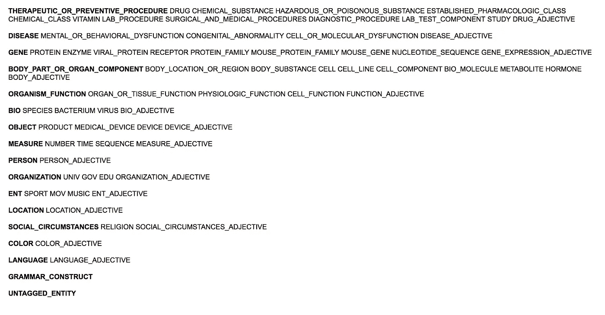*

*正在创建自定义数据集以测试此图中的所有实体类型和子类型。作者图片*