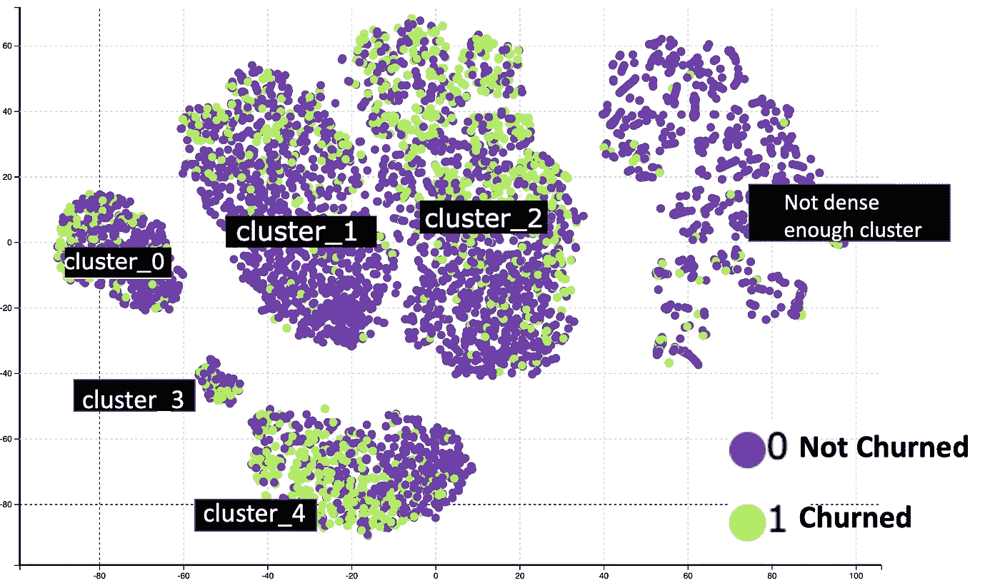
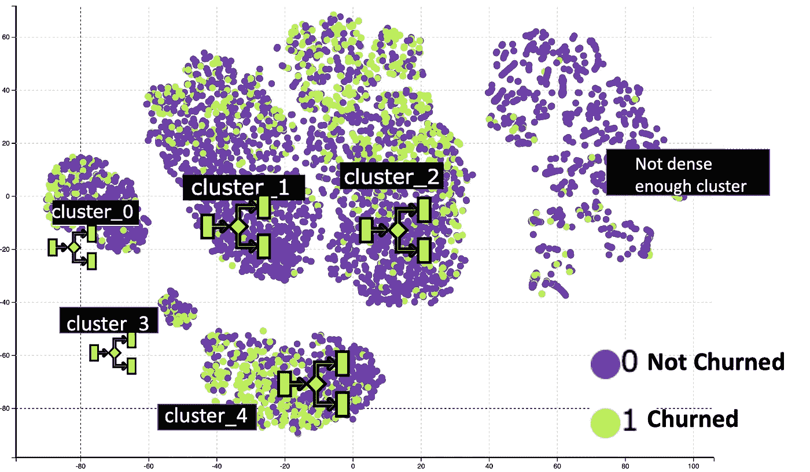
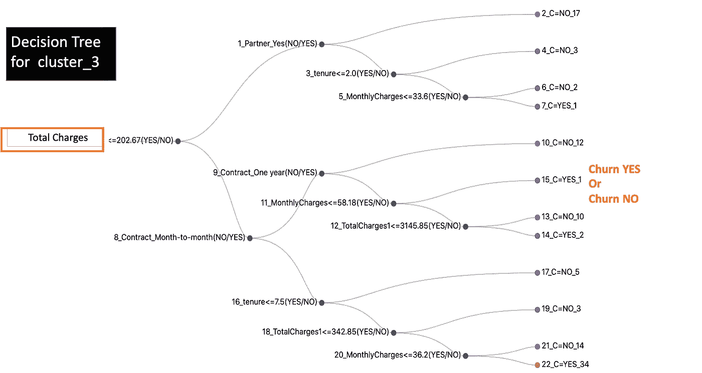
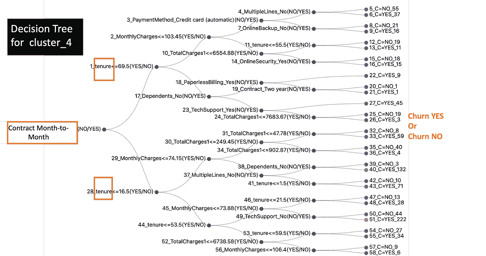
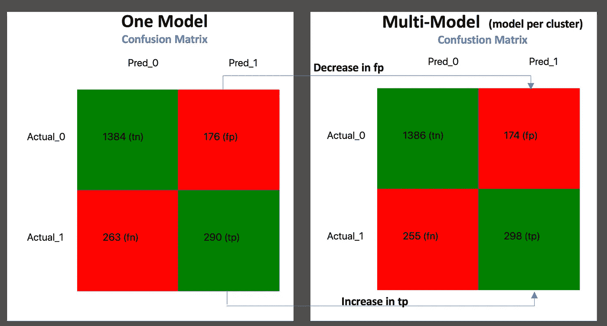

# 堆叠数据探索—探索数据的全新高级方式

> 原文：<https://towardsdatascience.com/stacked-data-exploration-a-new-and-advanced-way-to-explore-your-data-a1fba36d5a39>

## 开始探索堆叠数据的无限可能性

丹尼斯·强森在 [Unsplash](https://unsplash.com/s/photos/stack?utm_source=unsplash&utm_medium=referral&utm_content=creditCopyText) 拍摄的照片

> *“创新就是以一种新的方式获取并使用现有的东西”* —汤姆·弗雷斯顿，MTV 的联合创始人

在这个故事中，让我向您介绍堆叠数据探索，这是一种新的和先进的方法来探索您的数据。根据我的研究，术语堆叠数据探索还不存在。所以把这个故事当作这个非常有趣的主题的引子。

# 什么是堆叠数据探索

堆叠式数据探索是将不同的数据探索技术结合起来，产生更高级的数据探索结果。一种数据探索技术的输出成为下一种技术的输入。组合的结果通常比单独的技术更强大。

堆叠数据探索(图片由作者提供)

# 这为什么有用

堆叠已被证明在机器学习期间非常有用，其中学习者被训练来组合单个学习者。您可以将类似的概念应用于数据探索。

在数据探索阶段，通常，数据科学家单独使用数据探索技术。直方图、相关矩阵、降维、聚类等都可以单独用来探索数据。如果单独使用它们可以产生强大的效果，想象一下当我们将它们结合在一起时会产生什么样的效果！

让我们来看看这是怎么回事吧！

# 堆叠数据探索示例

现在，让我们通过一个例子来看看堆叠数据的实际应用。让我们来看一个电信公司客户的数据集。该数据集包含人口统计信息、服务、账单信息以及客户是否有过交易。

电信客户流失数据集(图片由作者提供)

在本例中，我们将尝试以下堆叠数据探索。

堆叠数据探索示例(图片由作者提供)

以下是对每个步骤的描述。最后的结果会在最后揭晓。

# 步骤 1 —降维(TSNE)

在这一步中，我们将把高维数据简化为二维数据。这将帮助我们以更好的方式可视化数据探索结果。这一步将使用 TSNE(t-分布式随机邻居嵌入)，因为它在保持高维空间中接近的点以及低维空间中彼此接近的点方面做得非常好。

这是 TSNE 应用于电信数据集的结果，我们将数据缩减为二维。

TSNE 将数据简化为二维的结果(图片由作者提供)

每个点代表一个客户。我们可以更进一步，根据现场客户流失率给这些点着色。

带有客户流失信息的 TSNE 结果(图片由作者提供)

现在我们将 TSNE 的结果输入到下一步的聚类中。

# 步骤 2—聚类(DBSCAN)

在前面的步骤中，我们可以观察到很好的集群形成。我们可以利用这一事实，对 TSNE 输出使用聚类算法。这将有助于我们为上面可视化中的每个可视化集群分配一个集群编号。

这里使用的聚类技术是 DBSCAN(带噪声的应用程序的基于密度的空间聚类)。这种技术的优点是它不需要预先指定簇的数量。这是 DBSCAN 应用于 TSNE 输出的结果。

TSNE+DBSCAN 的结果(图片由作者提供)

我们可以清楚地观察到 5 个集群。因为 DBSCAN 是基于密度的技术，所以聚类对应于密集区域。最右边的星团是一个不太密集的星团。所以暂时可以忽略。

# 2 个堆叠步骤后的见解

仅通过数据探索堆叠过程中的两个步骤，我们就获得了一些非常有趣的见解，例如:

*   我们观察到很好的星团形成，并且我们已经能够标记密集形成的星团。这意味着客户可以被分成不同的群体。这种见解可能非常有用。
*   在每个密集集群中，流失客户和非流失客户之间没有明显的区别。这意味着，如果你正在使用机器学习来预测搅拌者，你将需要一个复杂的算法来区分搅拌者和非搅拌者。

# 步骤 3 —机器学习来解释聚类(决策树)

让我们进入堆叠数据探索的下一个层次。我们可以试着解释每一个聚类，看看搅拌者和非搅拌者的区别。所以在这个步骤 3，*中，我们为每个集群*运行一个决策树。

TSNE+DBSCAN +决策树的结果(图片由作者提供)

有 5 个决策树被计算。然而，为了简单起见，下面只显示了 cluster_3 和 cluster_4 的决策树。

cluster_3 的决策树

cluster_4 的决策树

我们可以观察到，对于 cluster_3，区分搅动者和非搅动者的最重要的场是总电荷。这意味着 cluster_3 中预测的搅动器对总电荷敏感。

对于 cluster_4，区分搅拌者和非搅拌者的最重要的领域是合同和保有权。该群中的预测搅动者是那些任期短且有月度合同的人。

# 使用叠加数据勘探的结果

您可以通过以下方式使用到目前为止获得的结果:

**客户细分信息** *:* 您可以使用上面创建的细分市场进行客户细分，并向客户发送任何营销信息，以避免客户流失。可以基于每个片段对消息进行微调。

例如，由于 cluster_3 中的预测搅动者对总电荷敏感，所以焦点应该放在它们得到的值上，从而证明电荷是合理的。

对于 cluster_4，由于预测的搅动者具有较低的任期和月度合同，消息应集中于长期合同的优势，目标是将月度合同转换为年度合同。

**改进机器学习模型:**如果您正在开发一个用于预测客户流失的机器学习模型，为每个聚类训练一个模型而不是一个单一的模型可能会很有用。由于每个集群流失的根本原因是不同的，您将获得更好的总体结果。

下图显示了单模型方法混淆矩阵，以及多模型方法的混淆矩阵。在多模型方法中，为上述每个聚类训练一个机器学习分类器。

使用多模型方法，真阳性增加，假阳性减少。

混淆矩阵—一个模型与多个模型

# 结论

堆叠数据浏览是一种浏览数据的高级方式。与单独的数据探索技术相比，结果是强大的。在这个故事中，我给了你一个堆叠数据探索的例子。然而，有无限的方法可以组合不同的数据探索技术。

现在轮到您提出自己的方法来堆叠不同的数据探索技术了！你可以用哪种技巧来评论这个故事。

# 数据集引用

电信数据集可在此获得。 [**商业和非商业用途都是允许的。**](https://www.ibm.com/community/terms-of-use/download/)

  

请**订阅**,以便在我发布新故事时随时获得通知。

  

你也可以通过我的推荐链接**加入 Medium**

  

# 额外资源

# 网站(全球资讯网的主机站)

你可以访问我的网站进行零编码分析。[**https://experiencedatascience.com**](https://experiencedatascience.com/)

# Youtube 频道

这是我的 YouTube 频道
[https://www.youtube.com/c/DataScienceDemonstrated](https://www.youtube.com/c/DataScienceDemonstrated)的链接