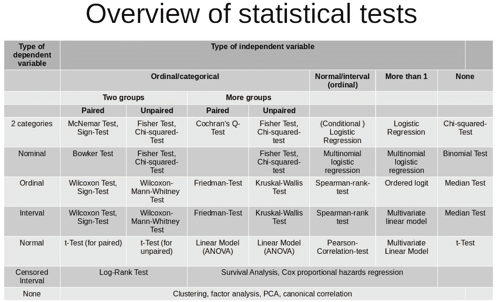
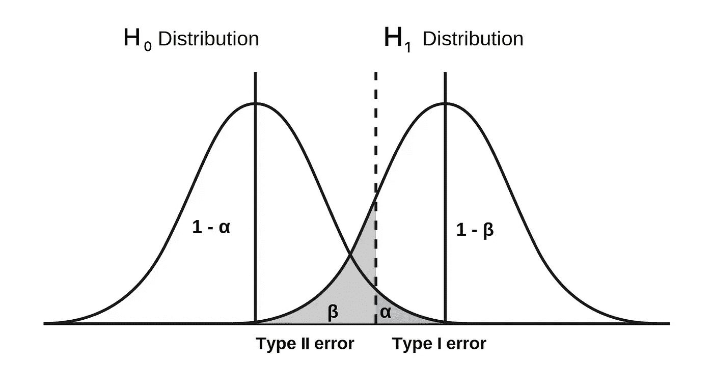
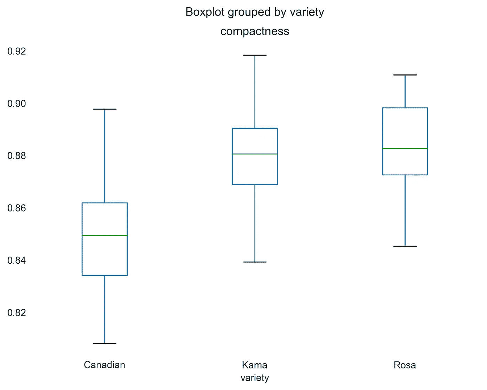
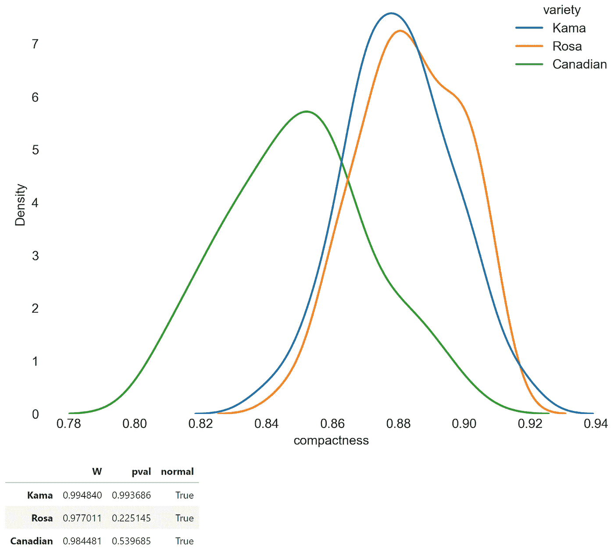
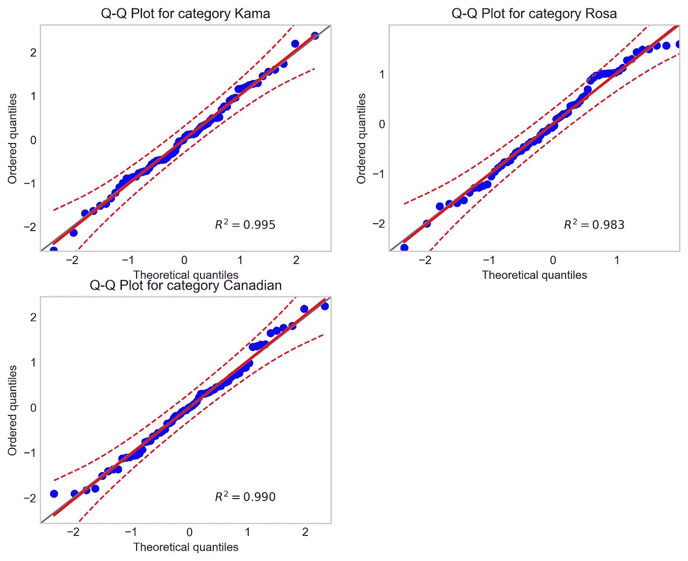

# 用 Python 进行统计假设检验

> 原文：<https://towardsdatascience.com/statistical-hypothesis-testing-with-python-6a2f38c12486>

## 使用 Pingouin 检验方差分析的案例研究


[斯科特·格雷厄姆](https://unsplash.com/@homajob?utm_source=medium&utm_medium=referral)在 [Unsplash](https://unsplash.com?utm_source=medium&utm_medium=referral) 上拍照

H 假设检验是一种推断统计方法，它让我们通过分析样本数据集来确定总体特征。假设检验所需的数学工具在 20 世纪初由统计学家罗纳德·费雪、杰吉·内曼和埃贡·皮尔逊正式提出。他们有影响力的工作建立了像零假设和 p 值这样的概念，这些工具成为现代科学研究的一个基本部分。应该指出的是，费希尔和尼曼-皮尔逊曾在学术上竞争过，但最终他们不同方法的结合成为假设检验的现代形式。除了学术研究，假设检验对数据科学家特别有用，因为它让他们进行 A/B 检验和其他实验。在本文中，我们将通过使用 Pingouin Python 库，对 seeds 数据集进行假设检验的案例研究。

# 假设检验的基本步骤

假设检验的第一步是提出研究假设，这是一个可以进行统计检验并涉及变量比较的陈述，例如，药物 X 比安慰剂更能降低血压。在此之后，我们指定零假设 **H₀** ，这表明该效应在总体中不存在。相比之下，H₁的另一个假设认为这种影响确实存在于人群中。下一步是数据收集，根据研究的类型，可以通过实验、调查、访谈和其他方法来完成。例如，A/B 测试从不同的网站版本收集用户反馈，以评估其性能。您也可以使用为其他目的创建的数据集，这种方法称为二次数据分析。



统计测试概述— [图片由 Philipp Probst](https://philipppro.github.io/Statistical_tests_overview/) 提供(麻省理工学院许可)

之后，我们需要决定哪种测试最适合我们的假设。有许多可用的方法，包括 t 检验、方差分析(ANOVA)、卡方检验、Kruskal-Wallis 等等。选择合适的测试取决于许多因素，包括变量的类型及其分布。像方差分析这样的参数测试是基于各种假设的，所以我们需要评估我们的数据集是否满足这些假设。上表提供了所有基本假设检验的概述，在试图找到最合适的假设检验时，它是一个很有价值的工具。请记住，有更多的假设检验可用，但这张表涵盖了基本情况。



第一类和第二类错误-作者图片

之后，我们需要指定显著性水平α (alpha)，这是一个拒绝零假设的阈值，通常设置为 0.05。因此，假设检验的 p 值大于 0.05 意味着不能拒绝零假设。相反，p 值≤ 0.05 允许我们拒绝零假设，接受替代假设。更具体地说，p 值是在零假设为真的情况下观察到的效应发生的概率。此外，显著性水平α等于犯 I 型错误的概率，即当零假设为真(假阳性)时拒绝零假设。此外，β (beta)是犯 II 型错误的概率，即当零假设为假(假阴性)时未能拒绝零假设。另一个重要的概念是统计功效，它是零假设被正确拒绝的概率，定义为 1-β。完成前面的步骤后，我们执行假设检验并陈述我们的结论，要么拒绝零假设，要么不拒绝。

# 平古因图书馆


Pingouin 徽标—图片由[https://pingouin-stats.org/](https://pingouin-stats.org/)提供

Pingouin 是一个开源的 Python 库，支持各种各样的假设测试和统计模型。该库包括许多测试，如 ANOVA、t-test、卡方检验、Kruskal-Wallis、Mann-Whitney、Wilcoxon signed-rank 等，因此涵盖了各种各样的病例。此外，Pingouin 允许您计算两个变量之间的相关系数，以及创建线性和逻辑回归模型。Pingouin 用户友好但功能强大，因为它为所有测试返回大量结果，这使它成为科学 Python 生态系统的一大补充。在本文的其余部分，我们将使用 Pingouin 运行假设测试并解释所提供的结果。请随意查看官方的[库文档](https://pingouin-stats.org/api.html)以获得关于其功能的更多细节，如果你愿意，可以考虑让[做点贡献](https://pingouin-stats.org/contributing.html)。

# 种子数据集

本文的案例研究基于[种子数据集](https://archive.ics.uci.edu/ml/datasets/seeds)，该数据集由 UCI 机器学习知识库免费提供。该数据集包含 3 个小麦品种样本的信息，即卡马、罗莎和 Canadian⁴.此外，数据集包括每个小麦籽粒的各种几何属性，包括面积、周长、紧密度、籽粒长度、籽粒宽度等。该数据集广泛用于机器学习任务，如分类和聚类，但我们利用它进行假设检验。更具体地说，我们的目标是评估小麦品种之间的几何差异。

# 方差分析的案例研究

我们现在将通过使用 Pingouin 库和 seeds 数据集来检查一个假设检验的实际例子。我们的研究假设是紧实度值与小麦品种相关，因此我们陈述零假设和替代假设:

> ***H₀*** *:所有小麦品种的平均紧实度相同。*
> 
> ***H₁*** *:小麦品种平均紧实度不同。*

陈述完我们的假设之后，我们继续讨论基于 Python 3.9 和 Anaconda 的编码部分。如果你感兴趣，这篇文章的完整代码可以在 Jupyter 笔记本上找到，所以我鼓励你克隆相关的 [Github 库](https://github.com/derevirn/hypothesis-test)。

```
import pandas as pd
import pingouin as pg
import matplotlib.pyplot as plt
import matplotlib as mpl
import seaborn as sns
mpl.rcParams['figure.dpi'] = 300
plt.style.use('seaborn-whitegrid')

df = pd.read_csv('data/seeds.csv')

dv = 'compactness'
iv = 'variety'
df.groupby(iv).mean()
```


作者图片

我们首先导入必要的 Python 库，并将种子数据集加载到 pandas 数据框架中。然后，我们使用`groupby()`函数按照小麦品种对数据集行进行分组，并计算每一列的平均值。正如我们所看到的，每个品种的大多数变量的平均值都有很大的不同。紧实度似乎是一个例外，所有小麦品种都有相似的均值，所以我们要详细考察这个变量。

```
df.boxplot(column = dv, by = iv, figsize = (8, 6), grid = False)

plt.box(False)
plt.show()
```



作者图片

我们使用`boxplot()` pandas 函数为密实度变量创建盒状图。显然，卡马和罗莎品种有相似的四分位数，中间值几乎相同。相比之下，加拿大品种似乎与其他品种略有不同，但我们需要用假设检验来验证这一点。我们希望比较所有小麦品种的平均紧密度值，即有一个数字因变量和一个自变量，有三个类别。因此，最适合这种情况的检验是单向方差分析。

```
fig, ax = plt.subplots(figsize = (8, 6))
ax.grid(False)
ax.set_frame_on(False)

sns.kdeplot(data = df, x = dv, hue = iv,
            fill = False, ax = ax)
plt.show()

pg.normality(df, dv = dv, group = iv, method = 'shapiro')
```



作者图片

作为参数检验，ANOVA 基于对数据集的各种假设，其中之一是所有组样本通常都是 distributed⁵.我们可以直观地评估这一点，通过使用`kdeplot()` Seaborn 函数为每个小麦品种创建一个 KDE 图。此外，我们使用 Pingouin `normality()`函数运行夏皮罗-威尔克正态 test⁶，它确认所有样本都是正态分布的。请记住，夏皮罗-维尔克在大样本上不是特别准确，所以像 Jarque-Bera 或 Omnibus 这样的测试在这些情况下是更可取的。此外，研究表明，方差分析对违反此 assumption⁷是稳健的，因此与正态分布的轻微偏差不是严重的问题。不过，您应该始终评估数据集是否满足测试假设，否则考虑使用非参数测试。

```
fig, axes = plt.subplots(2, 2, figsize = (10, 8))
axes[1,1].set_axis_off()

categories = df[iv].unique()
for ax, cat in zip(axes.flatten(), categories):
    mask = df[iv] == cat
    sample = df.loc[mask, dv]
    pg.qqplot(sample, ax = ax)
    ax.set_title(f"Q-Q Plot for category {cat}")
    ax.grid(False)
```



作者图片

除了像夏皮罗-维尔克这样的测试，绘制 Q-Q 图是另一种评估样本正态性的方法。这是一个散点图，可让您轻松比较正态分布和样本分布的分位数。如果样本分布为正态分布，所有点都在 y = x 线附近。我们可以使用 Pingouin `qqplot()`函数，轻松创建各种理论分布的 Q-Q 图。此外，基于线性回归模型，图中还包括最佳拟合线。显然，所有样本的分位数都接近正态分布，这进一步证实了夏皮罗-维尔克检验和 KDE 图直观评估。

```
pg.homoscedasticity(df, dv = dv, group = iv, method = 'levene')
```


ANOVA 检验也是基于所有样本都具有相同方差的假设，这种性质称为同方差。Pingouin 函数让我们通过使用 Levene 测试(一种评估 variances⁸.平等性的典型方法)来轻松评估这一点根据 Levene 检验结果，分组样本不满足同方差假设，即它们具有不等方差。我们可以通过使用 Welch ANOVA 检验来解决这个问题，与经典的 ANOVA⁹.相比，Welch ANOVA 检验对违反这一假设的情况更加稳健

```
df_anova = pg.welch_anova(df, dv = dv, between = iv)
df_anova
```


作者图片

在执行 Welch ANOVA 测试后，我们检查结果数据框架以评估结果。首先，F 值表明，与样本内的差异相比，样本均值之间的差异较大。部分 Eta 平方值代表效应大小，从而帮助我们计算统计功效。此外，p 值几乎等于零，使其特别低于显著性水平(α = 0.05)。因此，我们可以拒绝零假设，接受替代假设，即小麦品种具有不同的平均紧密度值。

```
pg.pairwise_gameshowell(df, dv = dv, between = iv)
```


作者图片

拒绝方差分析的无效假设后，建议进行事后检验，以确定哪些组间差异具有统计学意义。我们选择了 Games-Howell 检验，因为它对方差的异质性是稳健的，因此它是韦尔奇方差分析⁰.的补充显然，加拿大品种和其他品种之间的差异在统计学上是显著的。相比之下，卡马和罗莎品种的平均紧实度值没有显著差异。

# 结论

在本文中，我通过使用 Pingouin 库和 seeds 数据集介绍了统计假设检验的基本概念。希望我帮助你理解了这些概念，因为假设检验是一个具有挑战性的话题，会导致许多误解。请随意阅读[现代统计学介绍](https://openintro-ims.netlify.app/index.html)，这是一本很好的书，深入探讨了这个主题，同时对初学者也很友好。我也鼓励你在评论中分享你的想法，或者在 [LinkedIn](https://www.linkedin.com/in/giannis-tolios-0020b067/) 上关注我，我经常在那里发布关于数据科学的内容。你也可以访问我的[个人网站](https://giannis.io/)或者查看我最新的一本书，书名是[用 PyCaret](https://leanpub.com/pycaretbook/) 简化机器学习。

# 参考

[1]比奥、戴维·让、布里吉特·m·约尔斯和拉斐尔·波切尔。" P 值和假设检验理论:对新研究者的解释."临床骨科及相关研究 468.3(2010):885–892。

[2]约翰内斯·伦哈德。"模型和统计推断:费希尔和尼曼-皮尔森之间的争论."英国科学哲学杂志(2020)。

[3]拉斐尔·瓦莱特。" Pingouin:Python 中的统计数据."j .开放源码软件。3.31 (2018): 1026.

[4] Charytanowicz，magorzata 等，“用于 x 射线图像特征分析的完全梯度聚类算法”生物医学中的信息技术(2010):15–24。

[5]亨利·舍夫。方差分析。第 72 卷。约翰·威利父子公司，1999 年。

[6]夏皮罗、塞缪尔·桑福德和马丁·维尔克。"正态性的方差分析检验(完全样本)."生物计量学 52.3/4(1965):591–611。

[7]施密德、伊曼纽尔等《真的健壮吗？重新调查方差分析对违反正态分布假设的稳健性方法:欧洲行为和社会科学研究方法杂志 6.4 (2010): 147。

[8]霍华德·勒文。"方差相等的稳健检验."对概率和统计的贡献。纪念哈罗德·霍特林的文章(1961):279–292。

[9]刘，杭城人。"比较韦尔奇方差分析，一个克鲁斯卡尔-沃利斯测试，和传统方差分析的情况下，方差的异质性."(2015).

[10]游戏，保罗和约翰·豪厄尔。" n 和/或方差不等的成对多重比较程序:一项蒙特卡罗研究."教育统计学杂志 1.2(1976):113–125。