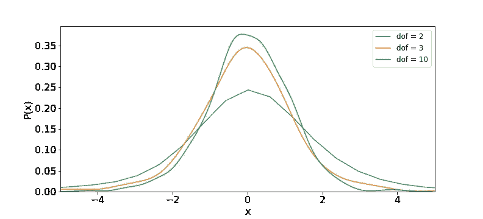

# 简单解释了统计 T 检验

> 原文：<https://towardsdatascience.com/statistical-t-test-simply-explained-b510045d69e>

## 介绍学生的 t 分布和学生的 t 检验

micha Parzuchowski 在 [Unsplash](https://unsplash.com?utm_source=medium&utm_medium=referral) 上的照片

# 介绍

在我之前的文章中，我们讨论了最不可靠的统计测试，即 **Z 测试**，你可以在这里阅读:

 [## 简单解释了 z 测试

### 统计假设检验的 Z 检验的直观解释

towardsdatascience.com](/z-test-simply-explained-80b346e0e239) 

在本文中，我们将讨论 **T-Test** ，它也非常受欢迎，与 Z-Test 非常相似。

当我们想知道一个样本的平均值是否与总体有显著的统计学差异时，通常使用 z 检验。然而，当我们想要**测量两个样本之间的统计差异时，通常应用 T 检验。**

> 实际上，T-检验和 Z-检验都可以应用于相同的用例，但这都归结于您从数据集获得的信息。

有趣的是，T-Test 也被称为**学生的 T-Test** ，因为发起者 William Gosset 使用了他的**笔名** *【学生】*作为他的雇主在发布时更喜欢使用笔名。

# 要求

*   样本量很小， **n < 30。**
*   总体方差/标准差**未知**(这是现实生活测试/例子中的常态)。
*   数据点是随机采样的**并且是独立的**。****

# **学生 t 分布**

**T 检验假设样本数据遵循 [**学生 t 分布**](https://en.wikipedia.org/wiki/Student%27s_t-distribution) 。这种分布与正态分布非常相似，但具有更长的尾部和更短的峰值。**

**当样本量较小时，使用 t 分布。然而，随着样本量的增加，t 分布**收敛于正态分布。****

****样本越少，t 分布越短越粗，尾部越长。**这在逻辑上是有意义的，因为数据点越少，我们对**平均值的近似越不确定**，因此峰值越小。然而，随着我们获得更多的数据点，我们变得更加确定真实的平均值。**

**样本中数据点的数量被称为分布的**自由度(dof)** 。我不会在这篇文章中解释自由度是什么，但你可以在这里阅读更多关于它的[。尽管如此，简单地说，自由度的**决定了统计分布的**形状。****](https://en.wikipedia.org/wiki/Degrees_of_freedom_(statistics))**

**下图描绘了不同 **dof** 值的几种 t 分布。随着 dof 的**增加，我们看到 t 分布收敛到正态分布，如上所述。****

****

**不同自由度(dof)的 t 分布图。作者用 Python 生成的图。**

# **示例:非配对 T 检验**

**我们现在来看一个**非配对 T 检验**的例子。这是我们想要比较来自两个不同人群的两个样本之间的**平均值的地方，以确定它们在统计上是否不同。****

**该问题的 **t 统计量**为:**

****

**作者在 LaTeX 中生成的方程。**

**其中*为样本均值，*为总体均值，*为样本的标准差， ***n*** 为样本大小。总体均值通常是未知的，因此被近似或假设为零。*****

> ****注:根据假设的类型和样本之间的统计关系，一些来源会引用不同的 t 统计公式。然而，在我们的例子中，我们选择了样本方差不相等的公式。****

****比方说，我们想知道在数学考试中，女生的分数是否比男生平均高 5 分。此问题的**空、 *H_0* 和备选、 *H_1* 假设**为:****

********

****作者在 LaTeX 中生成的方程。****

****我们随机抽取 **15 名女生**和 **15 名男生，**用计算出的**均值分别为 90** 和 **82** 和**标准差 12** 和 **10** 。****

****对于这个问题，我们需要选择一个合适的**显著性水平/临界值。**这是对我们观察到的结果有多大可能是正确的概率的度量。换句话说，它是我们的替代假设随机发生的**概率。**临界值越低，拒绝零假设所需的观察差异的统计显著性越大。通常，p 值为 **0.05 (5%)** ，这是我们在本例中使用的值。****

****使用 [t 表](https://www.sjsu.edu/faculty/gerstman/StatPrimer/t-table.pdf)，我们发现我们的**临界 t 统计量为 1.701** ，这里我们使用了用于双样本测试的**自由度公式:******

********

****作者在 LaTeX 中生成的方程。****

****使用上面的数据，我们的**计算的 t 统计量是:******

********

****作者在 LaTeX 中生成的方程。****

****所以，我们的 t 统计量是 **2.477** ，大于临界值 **1.701！**因此，我们拒绝零假设，我们新的零假设是，女生的分数平均比男生高 5 分。****

> ****注意:如果我们知道总体方差，并且每个样本的大小都大于 30，那么我们可以对上述问题使用双样本 Z 检验。****

# ****结论****

****在本文中，我们描述并解释了 T 检验和 T 分布。此外，我们还通过一个非配对双样本检验的例子来说明如何在实践中实施 T 检验。还有其他测试，如单样本和配对双样本测试，你可以在这里阅读更多关于[的内容。](https://en.wikipedia.org/wiki/Student%27s_t-test)****

# ****和我联系！****

*   ****要在媒体上阅读无限的故事，请务必在这里注册！ 💜****
*   ****[T31*😀*](/subscribe/@egorhowell)****
*   ****[*LinkedIn*](https://www.linkedin.com/in/egor-howell-092a721b3/)*👔*****
*   *****[*推特*](https://twitter.com/EgorHowell) 🖊*****
*   ****[*github*](https://github.com/egorhowell)*🖥*****
*   *******🏅*******

> *****(所有表情符号都是由 [OpenMoji](https://openmoji.org/) 设计的——开源的表情符号和图标项目。许可证: [CC BY-SA 4.0](https://creativecommons.org/licenses/by-sa/4.0/#)*****