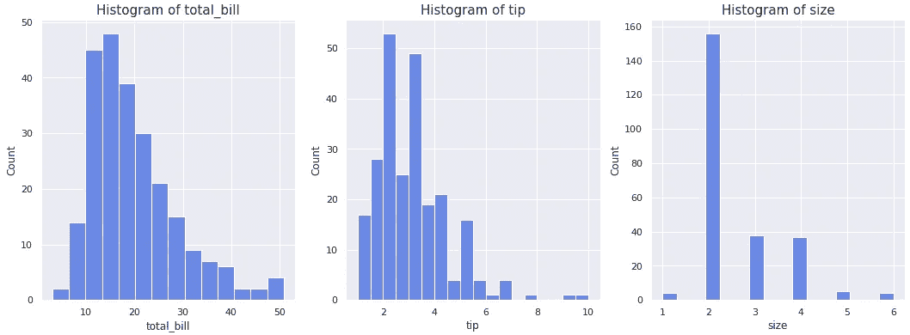

# 数据科学统计学:你不想错过的洞察

> 原文：<https://towardsdatascience.com/statistics-for-data-science-learnings-that-you-dont-want-to-miss-ecce40b11f64>


照片由[алексарцибашев](https://unsplash.com/@lxrcbsv?utm_source=unsplash&utm_medium=referral&utm_content=creditCopyText)在 [Unsplash](https://unsplash.com/s/photos/statistics?utm_source=unsplash&utm_medium=referral&utm_content=creditCopyText)

这是一份关于数据科学统计学的学习资料汇编，选自我所学的课程。

在这篇文章中，我想分享关于数据科学统计学的最重要的知识，这些知识是我在迄今为止学习数据科学的过程中从几门课程中选择和总结的。

正如我经常在我的帖子里写的，我不是统计学家，也没有任何 STEM 相关领域的背景。也就是说，当我学习*统计*时，有时概念对我来说有点难以理解，所以我需要将它们转换成我大脑理解的语言，这就是我试图与你分享它们的方式。

闲聊到此为止，让我们深入讨论帖子内容。

# 偏见的来源

有几个偏差来源可以扭曲数据，给你的结果很有意义，因为是实际数据告诉你的，但它们不会反映现实，因为它们是有偏差的。

*   便利偏差:当一个人选择一个容易得到的样本时。假设你想做一个选举投票，你走到外面，开始问你的邻居。这个样本有很大的偏见，因为它不代表人口，而只是你的邻居，那里的每个人都应该过着相似的生活。
*   **无响应偏差**:当您在一项调查中有太多的响应 NAs 时，就会出现无响应偏差，因此，总数会被它扭曲。
*   **选择偏差**:这种偏差是当你选择将成为你研究一部分的人时产生的。假设我们正在研究人口的平均身高，但我们只选择了高于 180 厘米的人来回答。你认为这个样品公平吗？我想不会。
*   **志愿者偏差**:这是互联网民意调查的偏差，例如，由于愿意回答的人只有那些有兴趣这样做的人，因此他们的回答已经存在偏差，使得样本不具有统计代表性。

# 数据分布

了解数据分布非常重要。这是我在进行探索性数据分析(EDA)时首先要做的事情之一。但是，老实说，很长一段时间我甚至不确定为什么我要绘制所有这些直方图和/或箱线图，只是为了观察分布形状。

现在我知道，在 EDA 过程中要执行的许多统计测试都是基于正态分布的。这是许多测试的先决条件，因此，如果你的变量不正常，你就不应该费心去做那个测试，因为结果不会有统计学意义。

让我们快速加载来自 Python: `df = sns.load_dataset('tips')`的 Seaborn 包中内置的数据集提示。

然后，我们可以画出数值变量的分布。

```
# create figure
fig, ax = plt.subplots(1,3, figsize=(18,6))# Plots
for idx, var in enumerate(['total_bill', 'tip', 'size']):
   g=sns.histplot(data=df, x=var, color='royalblue', ax=ax[idx])
   g.set_title(f'Histogram of {var}', size=15);
```



tips 数据集中数值变量的直方图。图片由作者提供。

分布不是钟形的，因此这里没有正态性。通过一个简单的正态性测试，这一点可以得到证实。那么，现在怎么办？这个数据是不是已经不行了？

远非如此。数据仍然是好的，但是正态分布的偏差只是告诉我们，我们不应该使用传统的测试，例如 T-test 或 ANOVA 来分析均值比较的方差。或者，如果我们想要执行这些测试中的一个，一些好的方法是从变量执行采样或引导，然后执行统计测试。

例如，假设我们想按聚会的规模来比较平均费用。由于有六组，我们需要进行方差分析测试。我们可以从每个组的数据集中提取 n 个样本，然后取费用的平均值。然后我们将有六个正态分布的组，可以互相测试。

另一种常见的转换是对数转换，或另一种级别的 [Box-Cox 转换](https://www.geeksforgeeks.org/box-cox-transformation-using-python/)，以使数据呈正态分布。

# 假设检验

最近，我在下面的链接中写了关于假设检验的文章。

</an-illustrated-explanation-of-hypothesis-tests-3594ffff34dc>  

一般来说，当我们创建一个假设检验时，我们所做的就是这样说:

> 假设我的无效假设(当前状态)是真理，那么另一个选择是新真理的概率是多少。

例如，如果我们正在测试两个平均值是否来自同一个分布(通常是正态分布)，那么，如果*平均值-1*为 10，并且我们假设为真，那么另一个具有*平均值-2*20 的分布来自同一个数据集的概率是多少？测试结果将给出一个概率值(著名的 p 值),如 0.001，或 0.1%的概率，它们来自同一分布，再次考虑真实平均值为 10。

# 错误类型

在进行假设检验时，有两种错误。我发现思考这个问题最简单的方法是使用正义的概念。

第一个假设:每个人都是无辜的，除非被证明。所以，真相是一个人是无辜的。

**第一类错误**:当零假设为真时，拒绝零假设。这意味着你认为某人有罪，而实际上那个人并没有罪。记住，除非被证明是无辜的。

**第二类错误**:当备选项为真时，不要拒绝零假设。这意味着一个人有罪，但我们说这个人是无辜的。

假设检验中的误差很难消除。他们将永远存在，所以这个想法是权衡哪一个应该是焦点。假设我们犯错误的次数将是显著性水平 **α，**，那么 5%的值意味着我们将在 100 次中看到 5 次错误。

如果类型 1 的误差风险更大，选择一个更低的显著性水平 **α** ，比如 1%。我们不想给一个无辜的人定罪，所以证据必须非常有力，我们才能通过无效假设。

如果类型 2 误差是要减少的误差，则选择更高的显著性水平，如 10%。当我们增加 **α** 的值时，我们降低了类型 2 错误率。在这里，我们不想考虑只有强有力的证据支持何的选择。

# 置信区间

置信区间是一个常见的错误来源。许多人认为，给定 100 个元素的样本，从 1 到 5 的 95%置信区间意味着我们有 95%的机会从数据中选择一个值，它将在 1 到 5 之间。

事实上，正确的解读是:95%的情况下，我们选择一个与原始样本(100)大小相同的随机样本，来自相同的人群，它会给我们一个在该区间内的平均数。

# 箱线图和 T 检验

箱线图为组间平均比较提供了类似于 T 检验的结果。让我们看看实际情况。让我们创建两个正态分布并进行 t 检验。

```
# Create a df
df = pd.DataFrame( {'v1':np.random.randn(100)*1000,
'v2':np.random.randn(100)*1000})# Pivot it for plotting and testing
df = df.melt(var_name='vars', value_name='val' ,value_vars=df.columns)
```

现在让我们使用`scipy`包进行 t 测试。

```
# Ho [p-value > 0.05] = No statistical evidence for different avgs
Ha [p-value <= 0.05] = Evidence of statistical different averagessp.stats.ttest_ind(df.query('vars == "v1"')['val'], df.query('vars == "v2"')['val'] )**[OUT]:**
Ttest_indResult(statistic=-0.9969050118330597, pvalue=0.32002736861405306)
```

由于我们的 p 值超过 5%，没有证据拒绝两个平均值之间的方差相似的 Ho。现在，如果我们画出 v1 和 v2 的箱线图，这是结果。


箱线图提供了类似于 T 检验的结果。图片由作者提供。

如果我们看中间值，它们真的很接近，我们真的看不出太大的差异。这与 T 检验得出的结论相同。现在，请注意，这是用两个正态分布的随机样本完成的，但它说明了我们想要表达的观点。

# 线性回归

线性回归无处不在。我不会在这篇文章中再创造一个例子，但我会与你分享一些注意事项。

**独立/解释/ X** :用于解释变量中的方差的变量，您将尝试预测结果。

**因变量/响应变量/目标变量/ Y:** 被预测、估计的变量。

**截距:**回归线与 y 轴相交的点。这也被理解为*“如果变量 x 为零，y 的标准值就是截距，取平均值”*。但这并不总是一个合理的值。所以，这样说并不总是有意义的。

**斜率:**回归线的倾斜度。可以读作*" x 中每增加一个单位，y 中增加斜率* x"* 。对于回归 *y = 3+2x* ，斜率为 2，因此 x 每增加一个单位，y 将增加 2 倍。

**外推**:对超出原始数据集值空间的值应用回归模型时要小心。例如，如果您有一个在两个轴上取值范围为 0-10 的回归，如果您试图预测一个在 20 范围左右的值，线性回归可能不会返回一个合理的值，因为您无法判断线性关系是否一直延续到 20 的范围。请参见下图。


线性回归不适用于 20 左右的值。图片由作者提供。

**多重共线性:**多重共线性是指两个或多个变量具有非常相似的方差，因此它们在这些条件下表现相同。因此，他们将解释目标变量中的相同方差，在模型中产生冗余，这使得模型不太可靠。从线性回归模型中移除多重共线性变量非常重要。这可以用一种叫做相关性的统计测试来验证，最著名的是皮尔森和斯皮尔曼的方法。在熊猫身上使用`df.corr()`很容易做到。

**残差:**线性回归的残差对于从统计角度验证它非常重要。它们必须是正态分布的，具有恒定的方差。换句话说，这意味着，随着值的增加，回归线也在上升，因此误差往往在某个恒定的范围内。如果模型在低数值或高数值中显示出高方差，或者两者都显示出高方差，那么它是否能够正确预测值就存在问题。

# 在你走之前

这些是我从数据科学的基础统计学课程中学到的一些最好的东西。我相信还有很多要补充的。也许将来我可以张贴这篇文章的第二部分，但我认为它现在是好的。

我鼓励你四处看看并研究统计学，因为数据科学本质上只是统计学+计算机科学+商业的一个花哨名称。

如果你对这些内容感兴趣，请关注我的博客。

<https://gustavorsantos.medium.com/>  

也在 LinkedIn 上找到我，告诉我你读了这篇文章。