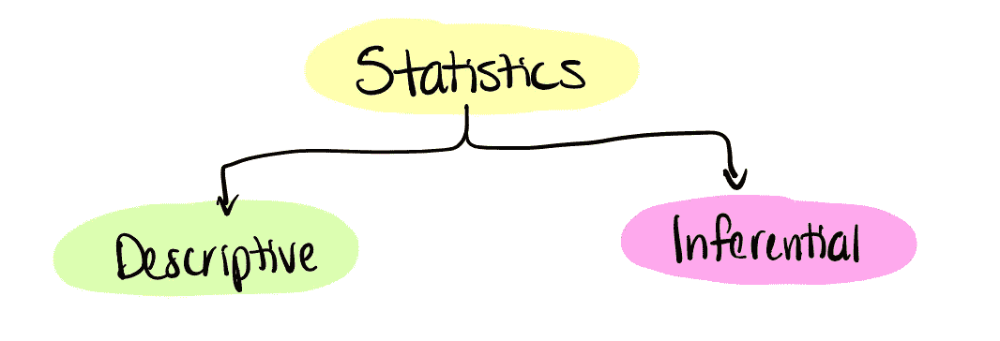
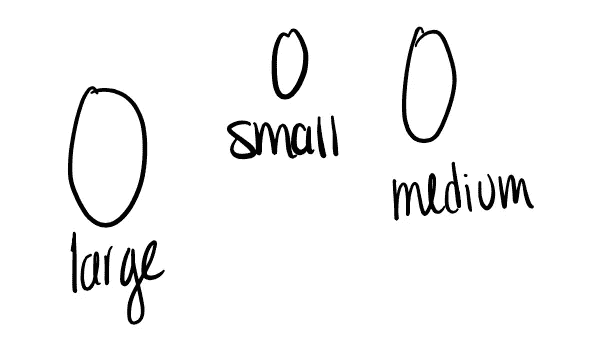
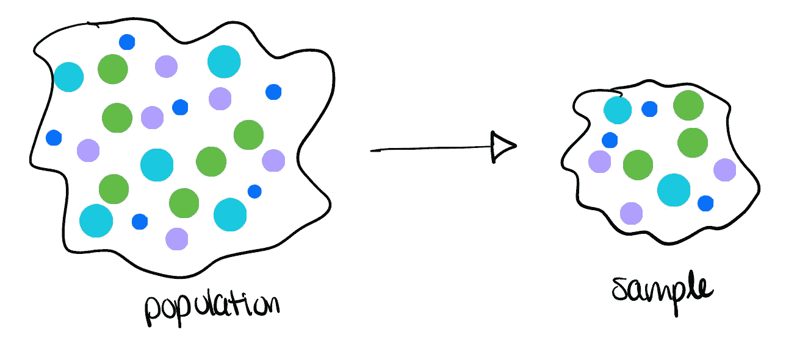
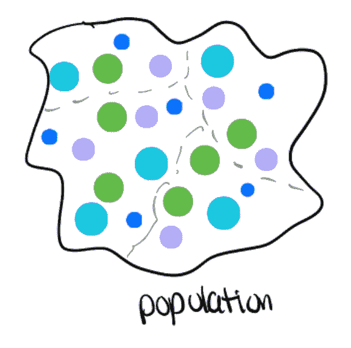
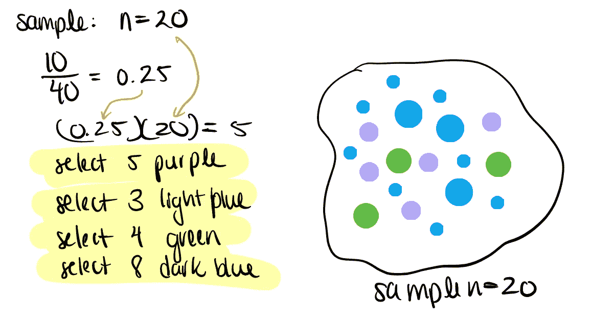

# 统计训练营 1:奠定基础

> 原文：<https://towardsdatascience.com/statistics-lecture-1-227f934924d9>

## [统计训练营](https://towardsdatascience.com/tagged/statistics-bootcamp)

## 学习作为数据科学家日常使用的库背后的数学和方法

作者图片

为了更正式地解决关于媒体的统计讲座系列的需求，我已经开始创建一系列的统计训练营，如上面的标题所示。这些将建立在彼此的基础上，因此将被相应地编号。这样做的动机是以一种自下而上的方式使统计知识民主化，以满足数据科学界对更正规的统计培训的需求。这些将从简单开始，向上和向外扩展，一路上有练习和工作实例。谈到工程、编码和统计，我个人的哲学是，如果你理解数学和方法，现在使用大量库的抽象就会消失，让你成为生产者，而不仅仅是信息的消费者。对许多学习者/读者来说，这些的许多方面将是一个回顾，然而有一个全面的理解和一个参考资源是重要的。快乐阅读/学习！

# 研发过程

我们在统计学和数据科学背后的全部原因是我们正在进行研究，无论是在正式还是非正式的环境中。我在下面概述了无论是在学术界还是工业界都应该遵循的研究和开发流程。我喜欢称之为研发的“优雅 8 ”:

1.  确定一个感兴趣的问题(这个问题的回答会对你的工作产生显著的影响)
2.  从文献中寻找信息。这一点尤其重要，这样你就不会在不知不觉中重复工作，无意中抄袭，浪费时间和资源等。
3.  生成一个假设(稍后将详细介绍)。这一点尤其重要，因为在“数据科学”中，您不断地进行数据探索和清理(通常是一前一后)，而您忘记了生成一个有意义的假设，为当前对现象的工作理解增加新的价值。
4.  识别变量:独立变量(拟议的原因)，非独立变量(拟议的结果)
5.  收集/获得/获得数据
6.  分析数据——如何分析数据必须在数据获取之前考虑，并与假设创建同步进行，以便以可测试的方式制定
7.  根据你的数据得出结论！(你**能**说什么，你**不能**说什么……)
8.  提出建议

# **术语**

我们将从一些简单的术语开始。我的道歉，这第一篇文章将比随后的新兵训练营更多，因为它设置了我们的舞台。那么什么是统计学呢？统计学是一门进行研究以收集、组织、总结、分析数据并从中得出结论的科学。当我们收集或获取数据时，我们通过拥有关于主题的所有数据(总体水平)或我们总体的子集(样本)来实现这一目的。**人口**是被研究的所有个体或项目(对象)的集合。**样本**是从一个总体(应具有与总体相似的特征)中选取的一组受试者

统计可以分为两种类型:**描述性的**和**推断性的。**

作者图片

**描述性**统计包括数据的收集、组织、汇总。例子包括:平均值，中位数，百分位数，计数等。

*例如:2005-2006 年，各州政府人均医疗支出为 2845 美元。*

**推断**统计由利用样本得出和测量总体结论可靠性的方法组成。例子包括:估计，假设检验，变量之间的关系和预测。

例:到 2035 年，25%的美国人口将达到或超过 65 岁。

# 数据类型

除了可能的数据转换，我们有两种类型的数据。这些是**定性**和**定量。定性**表示一个非数值。有两种类型:名词性或序数。

*举例:
名义:性别、种族、地理位置
序数:一所房子里的房间数(每个房间可能大小不同)*

**定量**数据构成区间、有序、排名数据。同样，有两种主要类型:离散型和连续型。离散表示可以计算可能的值。想想这里的无符号整数。连续/区间数据假设两个特定值之间有无限个值。在这里想想浮点数。

*示例:
连续:图像中对象的半径、高度(可用分数)
离散:班级中的学生人数*

# **测量水平**

当分解数据类型时，您必须考虑度量级别。**名义上的**数据被分类到互斥的类别中，在这些类别中不能强加任何顺序或等级。

*例如:性别、种族、政党*

**序数**指有序或排列的类别，其中级别之间不一定存在精确的差异。例如字母等级、李克特量表调查评估。

作者图片

**区间**数据是连续测量单位之间具有精确和固定幅度差异的数据。然而，没有*没有*有意义的零，但是测量单位之间有意义的距离。

*举例:历年花样滑冰成绩*

**比率**数据具有区间测量的所有特征，但带有一个*真值*零。因此，可以创建比率。

*举例:身高、体重、工资、时间*

# 总体与样本

我们在上面定义了**总体**和**样本**之间的差异，但现在我们要看看这在选择统计检验时意味着什么，特别是一个**统计**或一个**参数。**

作者图片

**统计**是通过使用来自**样本**的数据值获得的度量。

*示例:样本均值、样本标准差、中位数、四分位数、频率*

**参数**相比之下是通过使用来自总体的所有数据值获得的度量，通常是未知的并且在研究中是感兴趣的。

*示例:总体平均值、总体方差*

# 抽样

**抽样**是一种方法，通过这种方法，我们可以获得代表感兴趣的总体的总体子集，并且*应该被研究人员不带偏见*

N 注意:使用的采样程序将影响您可以应用于数据的推断统计类型！

## 简单随机样本

一种抽样程序，其中给定大小的每个可能的样本都同样可能是所获得的样本。

我们如何做到这一点？我们需要生成随机样本，并且可以使用随机数表或函数来实现。这将对群体中的所有受试者/项目进行编号。我们应该从表中的一个随机位置开始，然后以可变的步长向任何方向前进，直到获得一个样本。

## 系统抽样

1.  对群体中的每一个项目/主题进行编号，不要对任何特定的内容进行排序
2.  根据你想要的样本量
    *计算“k ”, k =总体规模/样本量*
3.  从一个随机数开始(在第一个 *k* 内)
4.  挑选每个*第 k 个*项目，直到所需的样品尺寸

*例:
总体有 200 个受试者，需要 50 个样本。2000/50 = 40
(40 为第 k 项)。*

注意:这很容易出现抽样问题，例如，如果您的人口列表是按男性、女性、男性、女性等顺序排列的。这里使用 k=2 不会给你一个有代表性的样本，因为你只会选择雌性。

*举例:
男
女
男
女
男
女*

## 巢式抽样法

如果您的数据很大，则整群抽样效果很好。本质上，您将总体划分为大小大致相等的组，然后获得随机的聚类样本。执行此操作的步骤:

1.  将人口分成集群(组)
    -集群的数量通常很大，每个集群的大小相似
2.  随机抽取一些集群
3.  包括所有这些以达到样本量

《出埃及记》大学的系，学校的班级

作者图片

## 分层抽样

当我们想要确保时，我们正在创建一个具有各种特征的人口代表。

1.  将人口划分为亚人口(根据某些特征分组或分层)
2.  从规模与人口成比例的每个阶层中获取一个简单的随机样本
3.  合并样本，形成总体样本

作者图片

《出埃及记》假设我们想要 20 的样本量:

**阶层样本量=期望样本量*(阶层规模/人口)规模**

作者图片

## 整群抽样与分层抽样

**相似之处**

*   目标:获得人口的代表性样本
*   将人口分组

**差异**

*   集群:随机抽取群体样本
*   分层:在群体中随机抽样

**何时使用哪个**

*   集群:人口中的大量群体，预计群体之间的差异很大。自然发生，并可能有很大的可变性
*   分层:少数群体，期望群体间的相似性，特征分层与研究问题有关

# 组合抽样方案

分层抽样中的聚类:

*例:研究问:拦截对青少年(13-17 岁)足球运动员的受伤风险有什么影响？*

*按城市分层:达拉斯、芝加哥、纽约州
每个城市内的聚类:每个城市内的青少年球队
包括每个抽样球队的所有球员到最终样本*

# 研究分类

**观察研究—** 研究人员只是观察正在发生的事情或过去已经发生的事情，并试图根据这些观察得出结论(不能操纵或控制)。数据科学通常属于这一类！

《出埃及记》吸烟与肺癌
劣势:只能推断关联/相关性。注意:因果建模中的一些工作通常不遵循这一路线，但这在传统上是正确的。

**实验研究** —研究人员操纵一个变量(自变量、解释变量)，并试图确定它如何影响结果(因变量/响应)。

*Ex。*
随机对照试验(RCTs)优点:因果联系可以建立

# 总结

在本次训练营中，我们介绍了统计数据的定义、总体、样本之间的差异，以及它们如何相应地与测量参数和统计数据配对。我们讨论了多种取样技术，指出了优缺点，以及如何在研究中结合它们。然而，最重要的是，我们已经通过概述我们的研究方法，为这个系列的后续训练营奠定了基础，开发的想法紧随其后。不幸的是，应用统计学来获得你想要的结果是不自然的，而且太普遍了，这也是创建这个训练营的很大一部分动机。所以，记住你的'**优雅 8** '！

系列中的下一个训练营:

[#2 中心、变化和位置](/statistics-bootcamp-2-center-variation-and-position-9de00a231e80)

此外，如果你喜欢看到这样的文章，并希望无限制地访问我的文章和所有由 Medium 提供的文章，请考虑使用下面的我的推荐链接注册。会员费为 5 美元/月；我赚一小笔佣金，这反过来有助于推动更多的内容和文章！

 