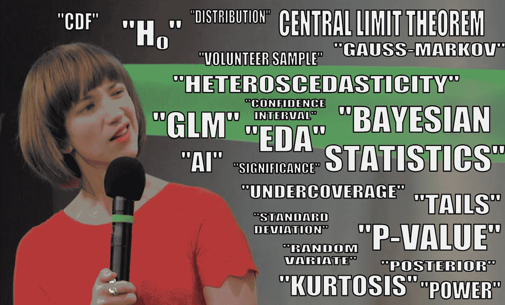
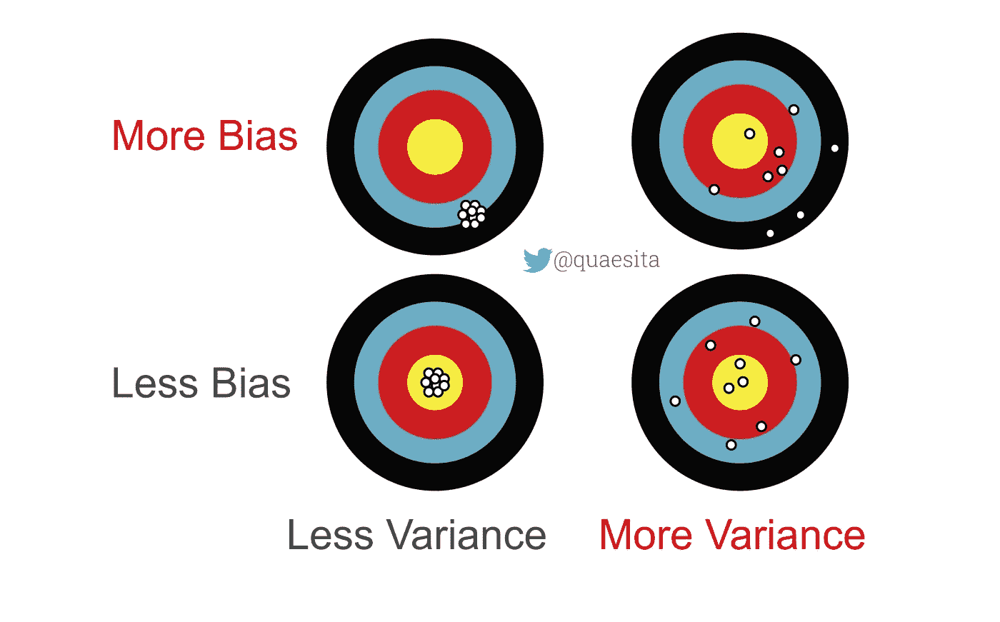
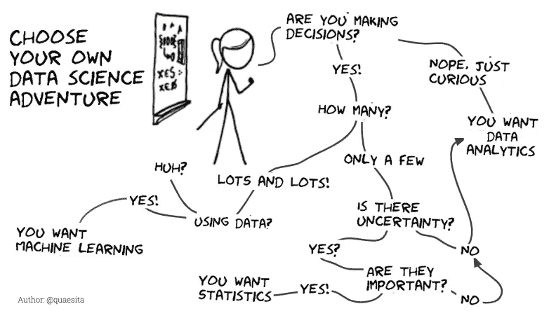
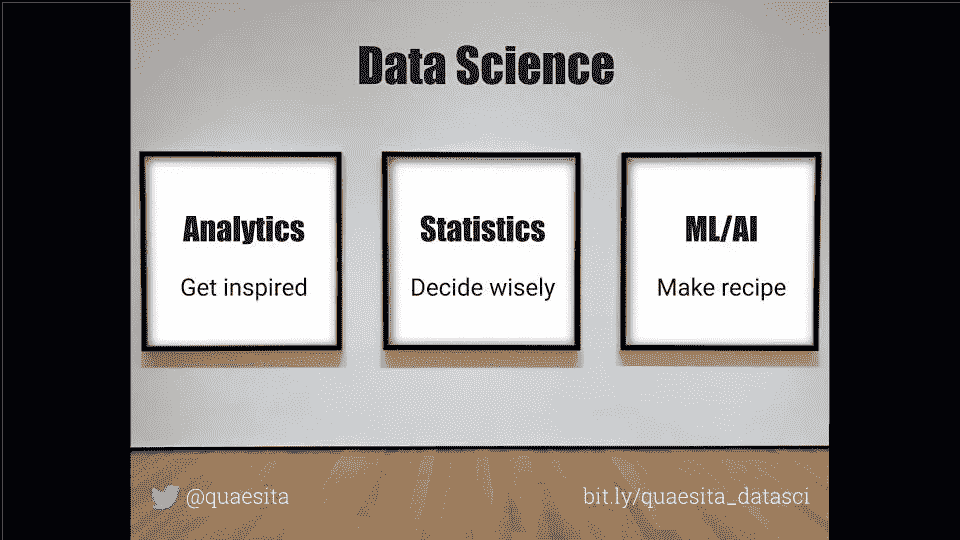
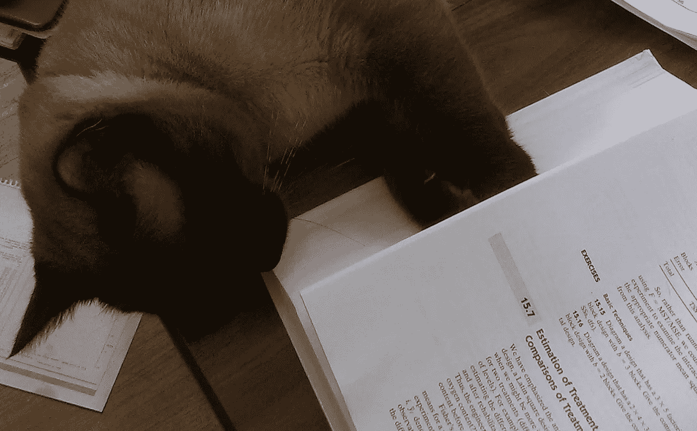
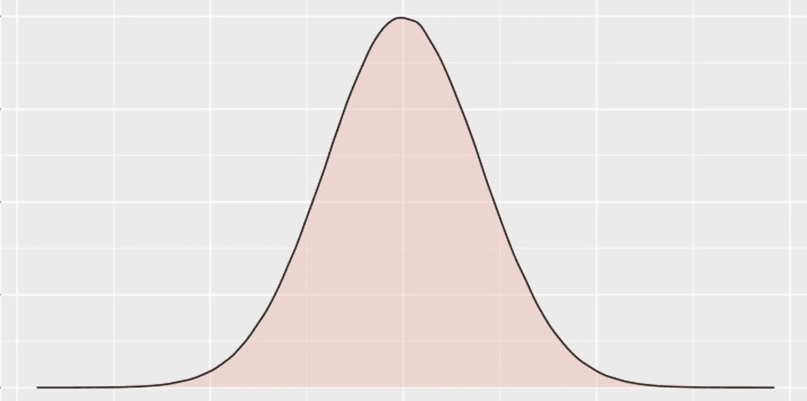
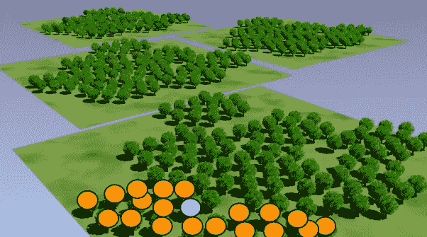
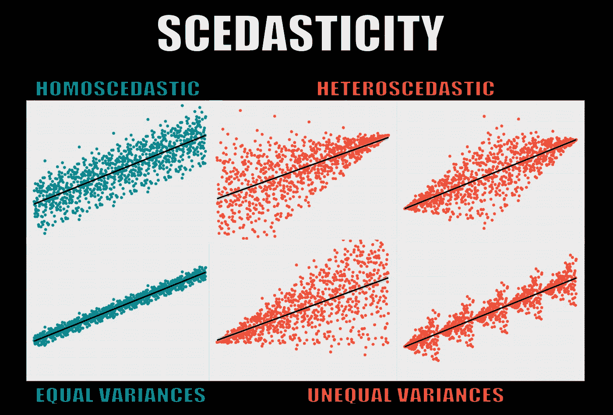

# 统计要点列表:不敬的统计学家行话指南

> 原文：<https://towardsdatascience.com/stats-gist-list-an-irreverent-statisticians-guide-to-jargon-be8173df090d>

## 用通俗易懂的语言来弥补你统计知识的不足

你的统计知识有差距吗？或者，您可能是来寻求如何向初学者传达数据科学概念的技巧的？让我尽力给你指出一些中肯的解释吧！

***注:*** *只要有链接，它通常会带你去另一篇我解释过一个基础概念的文章，而不是在这里重复。如果没有链接，说明我还没有写这篇文章——如果你对其中一个特别感兴趣，或者你希望看到一个遗漏的术语被添加进来，请在评论中告诉我。这份名单是按字母顺序排列的。词条有* ***加粗*** *。尽情享受吧！*

你的作者，希望风向不要突然改变。

[**替代假设**](http://bit.ly/quaesita_damnedlies)

对世界上所有可能的状态的描述，在这些状态下，您不希望采取您的 [**默认操作**](http://bit.ly/quaesita_damnedlies) 。(此处举例[。)](http://bit.ly/quaesita_hypexample)

[**分析学**](http://bit.ly/quaesita_battle)

分析学是 [**数据科学**](http://bit.ly/quaesita_datasci) 的一个分支学科，经常与**统计学**相混淆。

> 分析是为了找到好的问题，而统计是为了找到好的答案。

关键区别在于，分析主要关心的是中的*你的 [**数据**](http://bit.ly/quaesita_hist) 而**统计**关心的是*之外的*你的 [**数据**](http://bit.ly/quaesita_hist) 。点击了解更多[。](http://bit.ly/quaesita_versus)*

[**人工智能**](http://bit.ly/quaesita_ai)**【AI】**

这个术语过去指的是其他东西，但现在它经常被用作机器学习的同义词，比如 T2。

> “如果是用 Python 写的，很可能是机器学习。如果是用 PowerPoint 写的，很可能是 AI。”—马特·韦洛索

关于 ML/AI 和**统计**的区别，参见**机器学习上的条目。**

[**假设**](http://bit.ly/quaesita_saddest)

假设是丑陋的创可贴，我们贴在信息缺失的地方。如果我们知道 [*所有*事实](http://bit.ly/quaesita_popwrong)(并且我们*知道*我们的事实实际上是真实的事实)，我们就不需要假设(或统计学家)。不幸的是，当我们只有部分信息时——当我们想知道整个人口的情况，但我们只观察了来自 T21 样本的数据——我们超越这些微不足道的信息的唯一方法就是做出假设。

> 统计推断=数据+假设

是的，**统计学**不是魔术，它是一门艺术，通过非常仔细的假设(和数学方法)得出超越我们 [**数据**](http://bit.ly/quaesita_hist) 的结论。

**条形图**

一种可视化计数的方法。和**分布**一样，在人气争夺方面可以想到**条形图**(用于**分类数据**)和**直方图**(用于**连续数据**)。或者小费罐。那也行得通。

[**贝叶斯统计**](http://bit.ly/quaesita_freqvsbayes)

一个统计学派研究信念的数学模型。你从你所相信的东西的数学描述开始，然后(通过 [**贝叶斯法则**](http://bit.ly/mfml_part4) )在添加一些 [**数据**](http://bit.ly/quaesita_hist) 之后，发现你合理地应该相信什么。结果是高度个人化的，因为它们是关于*合理地*更新信念的主观模型——不同的开始信念(称为“**先验**”)应该给出不同的结果(称为“**后验**”)。在贝叶斯**统计**， [**参数**](http://bit.ly/quaesita_vocab) 有 [**概率**](http://bit.ly/quaesita_bday) 附加在它们上面，就你的典型(<http://bit.ly/quaesita_fvsb>**)stat 101 类而言，这是十恶不赦的亵渎。一个**参数**是否应该有一个 [**概率分布**](http://bit.ly/quaesita_distribution) 的问题[贝叶斯与频率主义者之争](http://bit.ly/quaesita_fvsb)是怎么一回事。**

**[**贝叶斯法则**](http://bit.ly/mfml_part4)**

**一个帮助你从代码编译时检查 Twitter 的**概率**到检查 Twitter 时代码编译的**概率**的公式。[贝叶斯法则](https://youtu.be/hfH8Dh8V1RU)是[贝叶斯统计](http://bit.ly/quaesita_fvsb)的数学基础。**

**[**偏置**](http://bit.ly/quaesita_biasdef)**

**当结果总是偏离目标时，就会出现统计偏差。但这并不是偏倚的唯一定义，所以在这里深入一下: [**选择偏倚**](http://bit.ly/quaesita_bias) ，[算法偏倚](http://bit.ly/quaesita_aibias)，[其他种类的偏倚](http://bit.ly/quaesita_biasdefn)。**

****

**[**二进制数据**](http://bit.ly/quaesita_datatypes)**

****数据**可以取两类值，例如(是，否)。当你处理两个以上的类别时，它被称为 [**多类数据**](http://bit.ly/quaesita_datatypes) 。**

**[**二项分布**](http://bit.ly/quaesita_distributions)**

****分布**描述了一系列尝试中特定数量成功的**概率**。在[二进制数据](http://bit.ly/quaesita_datatypes)的上下文中找到。**

****捕获的数据****

**捕获的数据是为了特定的分析目的而有意创建的，而**排气数据**是数字/在线活动的副产品。**

**[**因果关系**](http://bit.ly/quaesita_corr)**

**一个变量对*的倾向导致*另一个变量发生变化。**

**[**分类数据**](http://bit.ly/quaesita_datatypes)**

****数据**采用类别值，如桔子、苹果、芒果。 [**二进制数据**](http://bit.ly/quaesita_datatypes) 是一种分类数据。**

**[**CDF**](http://bit.ly/quaesita_distributions)**

**参见**累积分布函数**。**

**[**中心极限定理**](http://bit.ly/quaesita_lemur) **(CLT)****

**CLT 是一个方便的规则，它说如果我们从大量数据中计算平均值或总和，这些总和/平均值将是正态分布的。在这里了解更多。**

****

**中心极限定理(CLT)说，如果你正在处理大量数据，你可以安全地假设样本平均值的分布是正态的(钟形)，就像我身后的曲线一样。**

****卡方检验****

**如果你经常使用 [**分类数据**](http://bit.ly/quaesita_datatypes) ，你可能想了解更多的东西。这是查看两个分类变量**是否独立的经典快速检查，例如问一个类似于*的问题，“最喜欢的音乐流派在所有大学专业中的分布是相同的吗？”*(或者，更病态的是，许多 STAT101 教授将其介绍为，*“在泰坦尼克号上幸存取决于你的船票有多贵吗？”因为我们统计学家是一群冷酷的家伙。)*****

****经典统计学****

****常客统计的同义词。****

****聚类** [**采样**](http://bit.ly/quaesita_bias)**

**一种收集**数据**的方法，包括决定部分/群(如学校)，从收集的数据中随机选择几个群，然后收集这些群中所有单元(如学生)的**观察**。**

**[**组合学**](http://bit.ly/quaesita_bday)**

**计算事物的数学分支，比如在不冒犯任何人的情况下，你可以安排婚礼宾客入座的次数(0)。这是我在这个问题上的入门，它将帮助你理解，除了别的以外，为什么你的密码锁实际上是一个排列锁。**

****置信区间****

**一个来自 **frequentist statistics** 的概念，带有一个微妙的定义。事实上这很棘手，所以在解释置信区间时要小心(不要把它们和**可信区间**混淆)。95%的置信区间意味着:*“如果在无限个样本上重复这一过程，计算出的置信区间(每个样本都不同)将包含 95%的真实总体* ***参数*** *。”***

**[**连续数据**](http://bit.ly/quaesita_datatypes)**

****数据**是通过测量而不是计数获得的。例子:176.5 cm(我的身高)，12%(我手机上的空闲空间)，3.141592… (pi)，-40.00(摄氏遇上华氏)等。**

****方便样品****

**非随机的**样本**，但是**观察**便于进行，例如，当你在机场终端设置一个展台，并要求路过的人进行一项关于航空旅行的调查……可能会出什么问题呢？**

**[**关联**](http://bit.ly/quaesita_correlation)**

**两个**变量**看起来一起运动的倾向。点击了解更多[。](http://bit.ly/quaesita_correlation)**

****

**如果两个变量 X 和 Y 以某种方式一起运动，那么它们就是相关的。(作者剧情。)**

****

**在左边，身高和(从左到右)距离是正相关的。当一个上升时，另一个也上升。右边，身高和距离是负相关的。图片作者。**

**[**盘点数据**](http://bit.ly/quaesita_datatypes)**

**[只能取非负整数值的数据](http://bit.ly/quaesita_hist)。通过计算事物获得。**

****可信区间****

****置信区间**的贝叶斯表亲。它有你*希望*有**置信区间**的简单解释。95%可信区间解释为*“我相信* ***参数*** *以 95%* ***的概率*** *。”***

**[**【累积分布函数】**](http://bit.ly/quaesita_distributions)**

**描述观察到一个**随机变量**的特定值的**概率**的数学公式。见 [**分布**](http://bit.ly/quaesita_distributions) 。**

**[**数据**](http://bit.ly/quaesita_hist)**

**用电子形式记录某人的东西。或者，稍微恭敬一点的解释，读一下[这个](http://bit.ly/quaesita_hist)。**

**<http://bit.ly/quaesita_datasci>**

******分析**的同义词。在你的 [**数据**](http://bit.ly/quaesita_hist) 中寻找模式以形成**假设**或产生想法的行为。****

********

****[**数据科学**](http://bit.ly/quaesita_datascim)****

****数据科学是让数据变得有用的学科。它的三个子学科叫做**统计**、**机器学习**和**分析**。要了解这三个领域之间的差异以及它们如何融入数据科学，[请阅读此](http://bit.ly/quaesita_datascim)。****

********

****[**数据点**](http://bit.ly/quaesita_slkid)****

******观察**和实例的同义词。****

****[**数据集**](http://bit.ly/quaesita_vocab)****

******样本**的同义词(采集**数据**)。****

****[**数据类型**](http://bit.ly/quaesita_datatypes)****

****正如它听起来的那样——对您在野外遇到的各种数据的方便描述。许多 STAT101 类都是从数据类型开始他们的第一课，所以如果你热衷于重新创造那种体验，请前往[这篇文章](http://bit.ly/quaesita_datatypes)进行一次有指导的旅行。****

****[**默认动作**](http://bit.ly/quaesita_damnedlies)****

****如果你没有收集到任何(更多)[证据](http://bit.ly/quaesita_hist)，你[承诺](http://bit.ly/quaesita_inspired)要做的实际行动/决定。这是一个经常被忽视但又非常重要的概念；没有它就无法入门**经典统计学**！(例[此处](http://bit.ly/quaesita_hypexample)。)****

******因变量******

******变量**(在我们的模型中通常是 Y)我们[想用一些其他的来预测](http://bit.ly/mfml_006)(在我们的**模型中通常是 x**，它们是我们的**自变量**)。****

****[**离散数据**](http://bit.ly/quaesita_datatypes)****

******数据**通过计数而非测量获得的数据。例子:1 个小故事，6 个单词，2 双婴儿鞋，0 次穿等。****

****[**分配**](http://bit.ly/quaesita_distributions)****

****把这个想象成你的 [**人口**](http://bit.ly/quaesita_popwrong) [**数据**](http://bit.ly/quaesita_hist) 的 [**直方图**](http://bit.ly/quaesita_hist) 。这个概念很抽象，因为我们通常无法观察到 [**人口**](http://bit.ly/quaesita_population) 。****

********

****一个发行版给你整个[人口](http://bit.ly/quaesita_popwrong)的受欢迎度竞赛结果。基本上就是人口直方图。点击了解更多[。(作者剧情。)](http://bit.ly/quaesita_hist)****

******虚拟变量******

******指示变量**的同义词。****

******经验法则******

****如果你的数据是<http://bit.ly/quaesita_distributions>**，(68%)-(95%)-(几乎全部)会在**的 1–2–3[**标准差**内找到](http://bit.ly/quaesita_lemur)** 。******

****排气数据****

****捕获的数据**是为了特定的分析目的而有意创建的，而排放数据是数字/在线活动的副产品。当网站出于调试或数据收集等目的存储活动日志，而不是为了特定的分析时，通常会出现耗尽数据的情况。**

****错误****

**我们在 [**数据**](http://bit.ly/quaesita_hist) 中观察到的和我们用 [**模型**](http://bit.ly/quaesita_emperor) 预测到的差异。误差的另一个术语是“残差”在 [**简单线性回归**](http://bit.ly/mfml_006) 中，我们假设误差为 [**正态分布**](http://bit.ly/quaesita_distributions) 。在一种叫做 GLM 的方法中，我们被允许对误差有更多创造性的假设。**

**[**估计、估算者和估算者**](http://bit.ly/quaesita_vocab)**

**一个*估计*只是一个关于一个**参数**(*估计命令*)的真实值的 ***最佳猜测*** 。它是你猜测的值，而一个*估计值*是你用来得出那个数字的公式。**

**[**期望值 E(X)**](http://bit.ly/quaesita_distributions)**

**在**分布**的上下文中提到的([概率 T39 加权)平均值。同义词包括:期望、期望值、均值。](http://bit.ly/quaesita_bday)**

**[**实验**](http://bit.ly/quaesita_experiment)**

**为测试涉及**因果**关系的 [**假设**](http://bit.ly/quaesita_damnedlies) 而采取的[科学](http://bit.ly/quaesita_scientists)程序。核心特征是随机分组和实验者对这些组的操作(不同的组被分配不同的“处理”)。实验允许你对两件事情如何相关做出因果陈述(即，为了能够说一种药物*导致*疾病进展的改善，你需要运行一个设计良好的随机实验)。直到你有了清晰的、可测量的、量化的零假设和替代假设陈述，以及你将如何随机对宇宙的不同部分做不同事情的计划，你要做的是*而不是*一个实验。**

****

**图片修改自 [Wiki Commons](https://upload.wikimedia.org/wikipedia/commons/a/a0/Grumpy_Cat_%2814349262900%29.jpg) 。**

****探索性数据分析****

**使用你的**数据** 的一部分[的行为，目的是产生想法，形成](http://bit.ly/quaesita_sydd) [**假设**](http://bit.ly/quaesita_damnedlies) ，并发现对 [**机器学习**](http://bit.ly/quaesita_simplestm) 潜在有用的输入。所有这些鼓舞人心的金块都必须经过单独数据的测试才能被认真对待(否则你就是在欺骗)。**

****常客统计****

**你在 STAT 101 中看到的那种方法，基于长期运行的频率，你会看到如果程序被重复无数次。与 [**贝叶斯统计**](http://bit.ly/quaesita_fvsb) 不同，在使用这些方法时，你永远不会看到“信念”或“**先验**”这样的字眼。在频率统计中，**参数**永远不会有 [**概率**](http://bit.ly/quaesita_bday)—[这段视频](http://bit.ly/quaesita_ytbayescoin)将通过掷硬币和性格测试帮助你理解这一点。**

****高斯-马尔可夫假设****

**[技术**假设**](https://en.wikipedia.org/wiki/Gauss%E2%80%93Markov_theorem) 为了使用标准 [**线性回归**](http://bit.ly/mfml_006) 。他们大致翻译为，*“假设是* ***正常*** *乖巧。”(现在你明白下面我衬衫上的笑话了。)参见**正态分布**和**scedassity**了解更多信息。***

****

***“假设是* ***正常*** *乖巧。”***

****广义线性模型(GLM)****

**广义线性模型(GLMs)将<http://bit.ly/mfml_006>**扩展到 [**误差**](http://bit.ly/mfml_006) 分布不 [**正态**](http://bit.ly/quaesita_distributions) 的情况。如果您试图预测**分类响应**(例如点击/不点击)，您可能希望了解更多相关信息。****

****[**直方图**](http://bit.ly/quaesita_hist)****

****描述你的 [**数据**](http://bit.ly/quaesita_hist) 中事物发生频率的图。 [**类别**](http://bit.ly/quaesita_datatypes) (或数值区间)位于水平轴上，条形的高度给出了特定类别在数据中出现的相对次数。另见:**条形图**和 [**分布**](http://bit.ly/quaesita_distributions) 。****

********

****在这里看这个小直方图的完整故事[。(作者剧情。)](http://bit.ly/quaesita_hist)****

****[**假设**](http://bit.ly/quaesita_damnedlies)****

****对现实如何运作的描述。H0 代表**零假设**(所有你想采取 [**默认行动**](http://bit.ly/quaesita_damnedlies) 的世界)，H1 代表**替代假设**(所有你不想的世界)。(例[此处](http://bit.ly/quaesita_hypexample)。)****

****[**假设检验**](http://bit.ly/quaesita_fisher)****

****这个游戏试图看看你的**数据**是否让你相信你的 [**无效假设**](http://bit.ly/quaesita_damnedlies) 是荒谬的，因此你应该停止做你的 [**默认动作**](http://bit.ly/quaesita_damnedlies) 。(例[此处](http://bit.ly/quaesita_fisher)。)****

******自变量******

******变量**(通常是 X 在我们的 [**车型**](http://bit.ly/quaesita_emperor) )我们要用[来预测](http://bit.ly/mfml_006)的另一个(通常是 Y 在我们的**车型**)。****

******指示变量******

****一个**变量**，如果满足某个条件，则取值 1，否则取值 0。例如，如果你的主人是一只猫，我可能会将你的宠物记录为 Cat=1，如果还没有猫认领你，则记录为 Cat=0。Devs 和 **ML** 民间称使用指示变量**一键编码** *。*****

********

****我的猫礼貌地告诉我，我还没有读完另一页。****

****如果你(或你所在的团队)直接从现实世界收集[观察数据](http://bit.ly/quaesita_vocab)，你就在使用 ***原始数据*** 。换句话说，您可以控制如何记录和存储这些测量结果。****

****[**继承数据**](http://bit.ly/quaesita_provenance)****

****继承的(次级)数据是那些你从别人那里获得的数据。对面是**原始数据**。下面是我对使用继承数据的指导。****

********

****图片由作者提供。****

****[**峰度**](http://bit.ly/quaesita_lemur)****

****峰度是描述**分布的** [尾部](http://bit.ly/quaesita_lemur)的一种方式。****

****[**逻辑回归**](http://bit.ly/mfml_part4)****

****当**响应变量** (Y)是 [**二进制**](http://bit.ly/quaesita_datatypes) 时，通常使用一个好的**模型**。****

****[**长尾分布**](http://bit.ly/quaesita_lemur)****

****一种[不对称(偏斜)**分布**](http://bit.ly/quaesita_lemur) ，其特征是相对罕见的极大或极小值。****

********

****图片作者。****

****[**损失函数**](http://bit.ly/quaesita_lossvsmetric)****

****一个**损失函数**是你的**机器学习**算法在优化/模型拟合步骤中试图最小化的公式。****

****[**机器学习**](http://bit.ly/quaesita_simplest) **(ML)******

****这是一门与统计相关的学科，但有不同的关注点:自动化。**统计**关心的是严谨性、推理和得出正确的结论，而**机器学习**关心的是性能和将**数据**中的模式转化为完成工作的方法。统计学在应用机器学习项目的测试步骤中极其重要，因为这是检验原型是否实际工作的时候。****

****[**意为**](http://bit.ly/quaesita_lemur)****

****安[平均](http://bit.ly/quaesita_lemur)。用于谈论 [**样本**](http://bit.ly/quaesita_vocab) 【样本均值】或 [**总体**](http://bit.ly/quaesita_vocab) 【总体均值】的上下文中。这是一个重要的 [**时刻**](http://bit.ly/quaesita_lemur) (描述形状的 [**分布的**](http://bit.ly/quaesita_distributions) )，这就是为什么你看到它经常被谈论的原因。****

****[**均方差**](http://bit.ly/quaesita_babymse)****

****均方差(MSE)是众多<http://bit.ly/quaesita_opera>**指标之一，你可以用它来衡量你的 [**模型**](http://bit.ly/quaesita_emperorm)**的表现。如果你参加了一个 [**机器学习**](http://bit.ly/quaesita_simplest) 的课程，你很可能会在教学大纲中很早就遇到它——它通常是婴儿的第一个 [**损失函数**](http://bit.ly/quaesita_emperorm) 对于 [**连续的**](http://bit.ly/quaesita_datatypes) 数据。********

****[**中位数**](http://bit.ly/quaesita_lemur)****

****中间的东西。从最小到最大排列你的数据，取中间的一个——这就是中位数。中值对异常值**稳健，而均值<http://bit.ly/quaesita_lemur>**则不稳健。********

****[**模式**](http://bit.ly/quaesita_lemur)****

****模式读作*“最常见的值。”*模式对应于 [**分布/直方图**](http://bit.ly/quaesita_distributions) 出现峰值的点。当你听到一个分布是*多峰*时，这意味着有不止一个峰值。当一个分布是*对称单峰*时，就像漂亮的小**钟形曲线**一样，众数也恰好是**均值**。如果你想在技术上正确，你应该停止说*“普通人”*，而实际上你指的是*“模态人”。*****

******型号******

****根据上下文，或者是配方的花哨词语，或者是系统如何工作的描述。例如，这里有一个直线模型:工资 *=截距+斜率** 经验年限 *+误差*****

****[**瞬间**](http://bit.ly/quaesita_lemur)****

****指的是[分布](http://bit.ly/quaesita_distributions)形状的某些数字汇总。你的数据点的[平均值](http://bit.ly/quaesita_lemur)称为第一[矩](http://bit.ly/quaesita_lemur)，你的数据点的平方平均值为第二矩，以此类推。****

****[**多类数据**](http://bit.ly/quaesita_datatypes)****

******分类数据**可以取两个以上类别的值，例如(猫、狗、鹦鹉、金鱼、[食蚁兽](https://www.openculture.com/2015/05/salvador-dali-takes-his-anteater-for-a-stroll-in-paris-1969.html))。当你只处理两类数据时，它被称为 [**二进制数据**](http://bit.ly/quaesita_datatypes) 。****

******多重比较******

****测试许多假设的行为。如果你不对你的方法做任何特殊的修正(**多重测试修正**)，而你声称是在做统计结论，你就是在你的数据中进行一次钓鱼探险:你会随机地发现“一些有趣的东西”，尽管结果不会是真实的。****

****如果你不是在做**统计**，而是在进行**探索性数据分析** (EDA)，你就没问题了，因为你知道你不应该认真对待那些发现。但是，如果你声称从这个过程中得出统计结论，你没有做的不是统计——这是一个严重偏离要点的哑剧。只是。不要。****

****永远记住[分割你的**数据**](http://bit.ly/quaesita_sydd) ，这样你就能在一个不受干扰的数据集中运行一个精益可控的测试，在你从*不同的数据*中寻找灵感之后。****

******多次测试校正******

****也就是说，如果你希望用有效的统计方法测试多个假设，你可以……但是这是有代价的。*你必须做出调整(从阅读 *Bonferroni 校正*(最简单、最严格、最耗费数据的选项)开始，然后进行类似的调整)，否则你认为是“**统计显著的**”结果将会是令人尴尬的假结果。****

*****哦，这个价格相当高——你需要更多的**数据**才能得到同样质量的结果。不要测试多重**假设**，除非你有一个非常好的理由。****

****[**多元回归**](http://bit.ly/mfml_007)****

****像**简单线性回归**，除了现在你可以使用一个以上的**预测器**，例如使用经验和教育来预测工资。****

******多元数据******

****当您的尺寸对于单个数字而言过于复杂时，例如，裁缝需要一套尺寸来为您量身定制一套好的西装。非多变量的数据称为**单变量**(适合单个数字，例如你的身高)。****

******多元回归******

****就像**多元回归**，除了现在你预测一个**反应**那是**多元**——你的 Y 现在是一个向量，而不是一个标量。****

******非参数统计******

****哪些方法不需要你做出 [**假设**](http://bit.ly/quaesita_saddest) 关于你的数据来自哪个 [**分布**](http://bit.ly/quaesita_distributions) 。****

****[**无响应偏差**](http://bit.ly/quaesita_bias)****

****当你的目标参与者忽略了他们的回答。例如，你设立了一个摊位，询问人们他们的一天过得如何，而许多过着垃圾一天的人对你怒目而视，而不是接受你的调查。结果，由于无响应**偏差**，你记录的**数据**过于乐观。****

****[**正态分布**](http://bit.ly/quaesita_distributions)****

****对称的钟形分布在自然界和任何我们看到总和/平均值的地方都很常见。参见 [**中心极限定理**](http://bit.ly/quaesita_lemur) 。****

********

****正态分布，也称为钟形或高斯分布。(作者剧情。)****

****[**零假设**](http://bit.ly/quaesita_damnedlies)****

****在所有可能的世界中，你乐意采取你的[默认行动](http://bit.ly/quaesita_damnedlies)。(此处举例[。)](http://bit.ly/quaesita_hypexample)****

****[**观察**](http://bit.ly/quaesita_vocab)****

****[中的单项**样本**中的](http://bit.ly/quaesita_vocab)。****

********

****我们从这棵标有蓝色的树上得到的测量值是一个观察值。图片作者。****

******一键编码******

******指示器变量**的使用。****

****[**离群值**](http://bit.ly/quaesita_ytoutliers)****

****异常数据点或不大可能由负责大量数据的流程生成的数据点。你该拿它们怎么办？看情况…****

****[**p 值**](http://bit.ly/quaesita_puppies)****

****当假设 [**无效假设**](http://bit.ly/quaesita_damnedlies) 实际上为真时，获得一个 [**样本**](http://bit.ly/quaesita_vocab) 的概率至少与我们刚刚观察到的样本一样极端。这是一个口，所以我做了下面的视频来帮助你理解它。****

****要计算 p 值，你需要知道在**零假设** 下 **CDF** 是什么样子。你的 p 值越小，你的**零假设**看起来就越可笑。****

****[**参数**](http://bit.ly/quaesita_vocab)****

****[**人口**](http://bit.ly/quaesita_vocab) 的汇总衡量。****

****[**PDF**](http://bit.ly/quaesita_distributions)****

****参见 [**概率密度函数**](http://bit.ly/quaesita_distributions) 。****

******泊松回归******

****当**响应变量** (Y)只能是非负整数时，这通常是一个很好的模型。参见:**统计数据，响应，GLM** 。****

****[**人口**](http://bit.ly/quaesita_popwrong)****

****我们感兴趣的所有项目的集合。****

******后路******

****当你在之前**添加数据时，你最终拥有的信念(起始信念)。如果你看到这个词，你就在 [**贝叶斯统计**](http://bit.ly/quaesita_fvsb) 地。******

**[**力量**](http://bit.ly/quaesita_statistics)**

**权力是拒绝 [**无效假设**](http://bit.ly/quaesita_damnedlies) 为假的概率(即改变你的想法，如果这是正确的做法)。连同**显著性水平**，它决定了你的**假设检验**的质量。**

****预测区间****

**给出我们可能观察到的下一个值的合理范围的区间。一个常见的统计问题是，人们认为这就是**置信区间**所做的——不，这是预测区间:它比**置信区间**更宽，这意味着与 [**总体参数**](http://bit.ly/quaesita_vocab) 将在哪里着陆相比，你对下一个 [**观测值**](http://bit.ly/quaesita_vocab) 将在哪里着陆的确定程度要低得多。这在直觉上也说得通——当我发现一个城市里所有男性的平均身高是 6 英尺 4 英寸时，我会比发现我在杂货店里随便看到的一个人的身高是 6 英尺 4 英寸更惊讶。其中一个会成为头条新闻，另一个会耸耸肩。**

****预测器****

****独立变量**的另一种说法。预测因子是观察到的 [**数据**](http://bit.ly/quaesita_hist) 。**

****原始数据****

**如果你(或你所在的团队)直接从现实世界中收集 [**观察**](http://bit.ly/quaesita_vocab) ，那么你就在使用**原始数据**。换句话说，您可以控制如何记录和存储这些测量结果。如果没有，我们称之为次级**(继承的)数据**。**

****之前****

**一个起始信念写成一个 [**分布**](http://bit.ly/quaesita_distribution) 。如果你看到这个单词，你就在 [**贝叶斯统计**](http://bit.ly/quaesita_fvsb) 的土地上。**

**[**概率**](http://bit.ly/quaesita_bday)**

***P(X=4)* 在英语中读作*“我的骰子 4 朝上着地的概率。”如果我有一个公平的六面骰子， *P(X=4)* =1/6。但是…但是…但是…概率是什么，那 1/6 从何而来？很高兴你问了！我已经为你介绍了一些概率基础知识[在这里](http://bit.ly/quaesita_bday)，还有**组合学**作为额外奖励。***

**[**【概率密度函数(PDF)**](http://bit.ly/quaesita_distributions)**

**描述观察一个 [**随机变量**](http://bit.ly/quaesita_lemur) 特定值的相对**概率**的数学公式。如果**随机变量**不是<http://bit.ly/quaesita_datatypes>**，技术上这应该叫做[概率质量函数](http://bit.ly/quaesita_lemur)，它不应该存在于**随机变量**取不到的值。****

******Q-Q 剧情******

****一个用于检查 [**分布**](http://bit.ly/quaesita_distributions) [**假设**](http://bit.ly/quaesita_saddest) 的可视化测试工具，它将您获得的**数据**与您倾向于从您感兴趣的**分布**中获得的**数据**进行比较。还有，它经常让你哭，但那是[而不是它被命名为](https://en.wikipedia.org/wiki/Quantile)的原因。****

******R 平方******

****由 X 解释的 Y 中可变性的比例。在**简单线性回归**中，这是 X 和 Y 之间的 [**相关性**](http://bit.ly/quaesita_corr) 的平方。这里有一个有趣的技巧:你可能很不擅长直觉<http://bit.ly/quaesita_corr>**相关性，但你很擅长直觉 R 平方作为表现等级…所以你可以在你的朋友面前像变魔术一样使用它。在[guessthecorrelation.com](http://guessthecorrelation.com/)上试试吧——不要猜测**相关性**本身，而是猜测 R 的平方，通过分配一个“百分比等级”(就像一个老师给学生评分)到你所说的 X“捕捉”Y 的程度，然后求平方根。(如果点云向右下方移动，不要忘记插入一个减号。)******

****[**随机变量**](http://bit.ly/quaesita_distributions)****

****随机变量(R.V .)是一种将现实转化为数字的数学函数。把它想成一条规则，在真实世界的事件发生后，决定你应该在你的数据集[中记录什么数字。](http://bit.ly/quaesita_hist)****

****[**随机变量**](http://bit.ly/quaesita_distributions)****

****许多学生混淆了随机变量和随机变量。如果你是一个普通读者，跳过这一点，但爱好者会注意到:随机变量是像{1，2，3，4，5，6}这样的结果值**,而随机变量是将现实映射到数字上的函数**。你课本公式中的小 *x* 对大 *X* 。****

****[**原始数据**](http://bit.ly/quaesita_provenance)****

****一个**数据集**完全以它被收集时的形式存在——没有对它进行清理或**转换**。****

****[**回归分析**](http://bit.ly/mfml_006)****

******统计**方法涉及拟合[线性**模型**到](http://bit.ly/mfml_part4) [**数据**](http://bit.ly/quaesita_hist) 。通常，目标是[预测](http://bit.ly/quaesita_parrot)或 [**假设检验**](http://bit.ly/quaesita_damnedlies) 关于 [**相关性**](http://bit.ly/quaesita_corr)/关系。[见](http://bit.ly/mfml_006)****简单线性回归。********

****[**代表样本**](http://bit.ly/quaesita_bias)****

****准确反映[群体](http://bit.ly/quaesita_vocab)特征的 [**样本**](http://bit.ly/quaesita_vocab) 。****

******剩余******

******错误**的同义词。****

******响应******

******因变量**的另一种说法。****

****[**响应偏差**](http://bit.ly/quaesita_bias)****

****当你的目标参与者在他们的回答中撒谎时就会发生。想要享受一些即时反应和偏见，戴上一顶难看的帽子，问问你的同事你戴上它是否好看。****

****[**样品**](http://bit.ly/quaesita_vocab)****

****感兴趣的 [**人群**的一个子群。](http://bit.ly/quaesita_popwrong)****

****[**样品**](http://bit.ly/quaesita_vocab) **尺寸******

****您的**样本**中的**观察值** ( **数据点**)的数量。****

****[**采样**](http://bit.ly/quaesita_bias)****

****画 [**的行为观察**](http://bit.ly/quaesita_vocab) 从一个 [**的群体**](http://bit.ly/quaesita_popwrong) 。****

******取样架******

****所有条目的列表，从中我们可以得出我们的**样本** [**观察值**](http://bit.ly/quaesita_vocab) 。****

******安全**(有时也拼写为**安全**)****

****我们能为一个概念挑选出的最丑陋的词是，“错误**和错误**的**分布**在任何地方都是一样的吗？”****

********

****”“同方差误差都是相似的，但每个异方差模型都有自己的不幸之处。“同异方差是指沿线各处方差相等，异方差是指方差不等。****

****你会在**线性回归** 101 的上下文中看到这个词，在这里我们问一个关于**高斯-马尔可夫假设**是否满足的诊断问题(如果满足，我们可以继续进行**简单线性回归**，如果不满足，就*悲伤长号*)。如果线周围的**误差**的散布看起来像一根香肠(到处都是相同宽度的散布)，你可以说，“咻，误差是**同方差的**”如果散点图看起来更像一把扇子或一支小号乐队，或者一条吞下羚羊的蟒蛇，我们将**误差**声明为**异方差**，并转向 **GLMs** 而不是**简单线性回归**，或者找到一种巧妙的方法**转换**您的**数据**。****

****[**选择偏差**](http://bit.ly/quaesita_bias)****

****当您的**取样**方法偏好某些参与者而非其他参与者时，就会发生这种情况。关于**偏差**的其他定义，参见[本列表](http://bit.ly/quaesita_biasdef)。****

******显著性水平******

****最大 [**概率**](http://bit.ly/quaesita_bday)[**I 型错误**](http://bit.ly/quaesita_statistics) 你愿意容忍。除了**功率**和**样本** **大小，**这是一个非常重要的旋钮，你可以用它来控制你的测试质量。****

****[**简单线性回归**](http://bit.ly/mfml_006)****

******回归分析**只有一个**响应变量**和一个**预测变量**，这意味着你只是在数据中拟合一条直线。****

****[**简单随机抽样**](http://bit.ly/quaesita_bias)****

****完全随机的抽签。在这个**抽样**方案中，从**总体**中抽取任何[排列](http://bit.ly/quaesita_bday)的项目是同样可能的。****

******辛普森悖论******

****一个聚合悖论是，每个群体的分解数据**和**都指向与聚合数据完全相反的结论。****

********

****在该图中，汇总数据向上向右(直线为正斜率)，而分解数据分别产生向下向左的负斜率。****

****[**偏斜度**](http://bit.ly/quaesita_lemur)****

****顾名思义:一种对**分布**不对称性的度量。为了便于记忆，帮助你记住哪个是正的，哪个是负的，请阅读[这个](http://bit.ly/quaesita_lemur)。****

****[**标准差**](http://bit.ly/quaesita_lemur)****

****离差的度量。告诉你你的**数据**点距离它们的**均值**有多远。更多信息，请看[这篇文章](http://bit.ly/quaesita_lemur)。这个术语用在谈论 [**样本**](http://bit.ly/quaesita_vocab)(**样本** **标准差**)或 [**总体**](http://bit.ly/quaesita_vocab)(**总体标准差**)的上下文中。**标准差**是一个 [**分布**](http://bit.ly/quaesita_distributions) 形状的重要描述符之一，这也是你看到它被如此频繁谈论的原因。我在这里更详细地介绍了[。](http://bit.ly/quaesita_lemur)****

********

****把那些自称为“偏差”的东西想象成测量就餐者和长长的霍格沃茨风格宴会桌中心线之间的距离。图片: [Pixabay](https://pixabay.com/photos/dining-room-banquet-oxford-5114247/) 。****

****[**统计**](http://bit.ly/quaesita_vocab)****

****从**样本**计算出的汇总测量值。换句话说，任何使你的**数据**变得模糊的方法。如今我们使用这些术语的方式是， [**分析**](http://bit.ly/quaesita_analysts) 是关于计算**统计**的学科，但是 [**统计**](http://bit.ly/quaesita_statistics) 是关于超越那些 [**数据**](http://bit.ly/quaesita_hist) 的*——一个[伊卡洛斯式的飞跃](http://bit.ly/quaesita_popwrong)进入未知领域(如果你不小心的话，预计会有一个大的冲击)。在这里了解更多[关于](http://bit.ly/quaesita_datasci) [**数据科学**](http://bit.ly/quaesita_datasci) 的子学科。*****

******统计上显著的******

****并不意味着刚刚发生的事情在宇宙眼中是“意义重大”的。这是一个技术术语，简单地说就是一个 [**无效假设**被拒绝](http://bit.ly/quaesita_fisher)。****

****[**统计**](http://bit.ly/quaesita_statistics)****

****在不确定的情况下改变想法的科学。对于一个 8 分钟的纪律介绍，阅读[这个](http://bit.ly/quaesita_statistics)。****

******分层抽样******

****将您的**人口**分成类别，例如统计人员和非统计人员，然后从每个类别中抽取期望规模的**简单随机样本**(例如随机抽取 100 名统计人员和 100 名非统计人员)。****

****[**结构化数据**](http://bit.ly/quaesita_provenance)****

****结构化数据被整齐地格式化以供分析。你在<http://bit.ly/quaesita_statistics>**类中使用的大部分**数据集**都是结构化的，然而在野外，有大量的**非结构化数据** ( **数据**需要*你*在上面放置结构)。******

****[**非结构化数据**](http://bit.ly/quaesita_provenance)****

****如果我们迂腐的话，就没有非结构化数据这种东西(因为通过存储，它们必然被迫具有某种结构)，但是让我大方一点。下面是该定义想要传达的意思:**结构化数据**被整齐地格式化以供分析，而非结构化数据不是您想要的格式，它们迫使您将自己的结构放在上面。(想想[巨魔](http://bit.ly/trollololo)留下的图片、邮件、音乐、视频、文字评论。)****

> ****你称之为非结构化数据的东西只是需要你把它结构化的数据。****

******系统抽样******

****系统的选择过程，例如从所有可被 99 整除的 id 中构建您的**样本**。****

******时间序列******

****一个时间索引的**数据集**，其中顺序很重要。例如，如果我们记录你今天的睡眠时间和我今天的睡眠时间，我们可以按任何顺序写，不管是先写你的还是先写我的。但是如果我们记录你几天的睡眠，如果我们打乱这些记录，我们会失去一些东西。****

******变身******

****获取一个**变量**(数据集的[列)并对该列中的所有值应用一个函数(例如对数)来生成一个新的**变量**。](http://bit.ly/quaesita_slkid)****

****[**I 型错误**](http://bit.ly/quaesita_statistics)****

****错误地[拒绝](http://bit.ly/quaesita_fisher)[**无效假设**](http://bit.ly/quaesita_fisher) 。(相当于“给一个无辜的人定罪。”)与[假阳性](https://www.youtube.com/watch?v=nvRSzEqPQNo&list=PLRKtJ4IpxJpDxl0NTvNYQWKCYzHNuy2xG&index=45)的概念相关，但它不是完全相同的东西(就像**预测区间**不同于**置信区间**)。****

****[**II 型错误**](http://bit.ly/quaesita_statistics)****

****错误地未能[拒绝](http://bit.ly/quaesita_fisher)无效假设**。(相当于“未能给有罪的人定罪。”)这个的概率等于 1 的负次方。与[假阴性](https://www.youtube.com/watch?v=nvRSzEqPQNo&list=PLRKtJ4IpxJpDxl0NTvNYQWKCYzHNuy2xG&index=45)相关，但不完全相同(就像**预测区间**不同于**置信区间**)。******

**[**III 型错误**](http://bit.ly/quaesita_statistics)**

**正确拒绝错误的**无效假设**。换句话说，使用所有正确的数学方法来解决*错误的*问题！**

****欠覆盖偏差****

**当您无法接触到您的整个 [**人口**](http://bit.ly/quaesita_vocab) 时会发生这种情况(例如，当您的调查只能被拥有计算机的人看到，但您想要对所有成年人的**人口**做出声明)。**

****均匀分布****

**形状像砖块的概率分布:所有的结果都有相同的概率。有人让我附上一张我玩这个分布的照片，就像我玩上面的**正态分布**一样，这是我能想到的最好的东西:**

****

**均匀分布凯西向你问好。**

****单变量数据****

**当你的尺寸适合一个单一的数字时，例如你的身高。如果不是单变量，那就是**多变量，**例如，一个裁缝为了给你做一套好的定制服装需要的一套尺寸。**

**[**方差 Var(X)**](http://bit.ly/quaesita_distributions)**

**这是[的平方**标准差**的平方](http://bit.ly/quaesita_distributions)。用在谈论 [**样本**](http://bit.ly/quaesita_vocab) 【样本方差】<http://bit.ly/quaesita_vocab>**【总体方差】的上下文中。这是一个重要的 [**时刻**](http://bit.ly/quaesita_distributions) (描述形状的 [**分布的**](http://bit.ly/quaesita_distributions) )，这也是为什么你看到它经常被谈论的原因。****

******变量******

****非正式用法:你的**数据集**的一列，如果你的**数据集**是以[礼貌方式](http://bit.ly/quaesita_slkid)格式化的。正式用法:见**随机变量**。****

******志愿者样本******

****一个 [**样本**](http://bit.ly/quaesita_vocab) ，其中回答者不同于普通人，因为他们选择加入(例如，如果我们想测量伸出援手的意愿，并通过参加我们的调查请求人们伸出援手，那么我们正在收集一个志愿者样本，我们预计回答者比不回答者更愿意提供帮助)。一个**无反应偏差**的配方。****

******Z 分数******

****允许您比较以不同尺度测量的数量，例如*‘在跳远运动员中，Melanie 的最好跳是 Yufeng 的马拉松时间在马拉松运动员中的两倍。’*****

> ****z-score =(事物的[均值](http://bit.ly/quaesita_lemur) ) /(事物的[标准差](http://bit.ly/quaesita_lemur))****

# ****感谢阅读！喜欢作者？****

****让我们做朋友吧！你可以在 [Twitter](https://twitter.com/quaesita) 、 [YouTube](https://www.youtube.com/channel/UCbOX--VOebPe-MMRkatFRxw) 、 [Substack](http://decision.substack.com) 和 [LinkedIn](https://www.linkedin.com/in/kozyrkov/) 上找到我。有兴趣让我在你的活动上发言吗？使用此表格取得联系。****