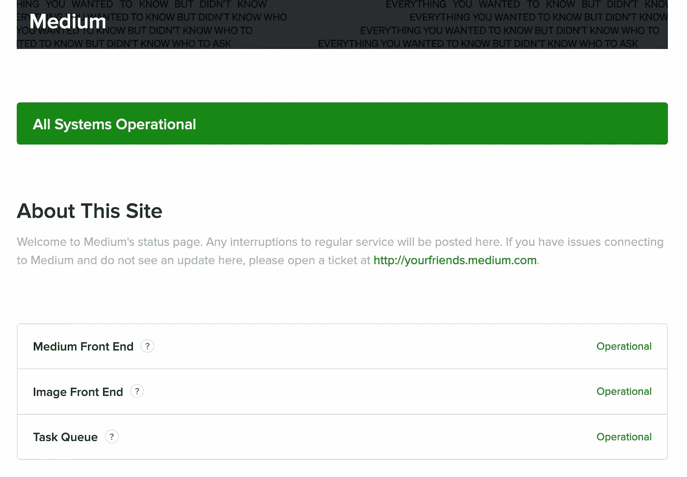
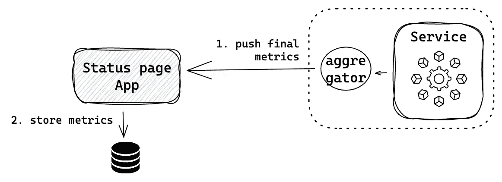
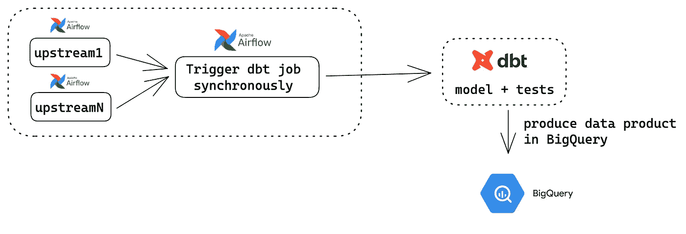

# 数据产品的状态页面—我们都需要一个

> 原文：<https://towardsdatascience.com/status-page-for-data-products-we-all-need-one-5a493092059a>

## 有效地与数据用户沟通

斯蒂芬·道森在 [Unsplash](https://unsplash.com/) 上拍摄的照片

在软件工程领域，状态页并不是什么新鲜事物。对于当今快速发展的世界中的许多平台来说，与用户透明地交流最新事件、定期维护和实时服务状态是至关重要的。它可以在服务提供商和用户之间建立信任并提高沟通效率，尤其是在停机期间。

尽管它已经被各种服务(如网站、云服务和 REST APIs)大量采用，但它在数据世界中还没有得到足够的重视。

在本文中，我想提高为数据产品构建状态页面的意识，包括但不限于表、视图、仪表板、文件、ML 模型和任何其他数据表示。最后分享一下我的解决方案。如果文章引起你的共鸣，请留下你的评论，分享你的想法。

## 什么是状态页？

> 如果您熟悉状态页面的概念，可以跳过这一部分。

状态页是一个网页，通知访问者服务的当前健康状况和整体历史性能。它被那些需要不断更新客户当前服务状况的公司所使用。在停机期间，该页面为工程团队说话，因此团队可以专注于解决问题，而不是处理重复的客户票证。当然提高了沟通效率。

我们以 Medium 的[状态页](https://medium.statuspage.io/)为例来看一下。该页面包含三个部分:

*   服务的当前运行状态(前端、后端)
*   系统指标(正常运行时间、页面响应时间)
*   过去的事件

来自[媒体状态页面](https://medium.statuspage.io/)的截图

尽管每个状态页面看起来都不同，但它们有一些共同的目标:

1.  **告知用户面向用户的关键服务的最新运行状态。**这是状态页面的首要指标，也是人们访问页面的首要原因——他们想知道服务现在是否正常工作。只需要面向用户的关键服务，因为用户不关心内部服务。
2.  **通知用户正在进行的问题或维护。**如果服务遇到任何问题或处于维护模式，告诉用户问题发生的原因、预计完成时间以及任何更新是至关重要的。让用户参与进来很重要。
3.  向用户通知服务的历史性能。对过去性能的概述显示了服务稳定性，这对于提供 SLA 的服务尤其重要。它给出了服务稳定性和过去事件解决速度的总体情况。

除了这些核心特性之外，一些高级状态页面显示了一段时间内的系统指标，比如 REST API 响应时间、服务正常运行时间等。

> 更多状态页面示例，请查看 Github repo[awesome-status-pages](https://github.com/ivbeg/awesome-status-pages)。

## 如何建立一个状态页面？

有多种方法可以建立一个状态页面，而且非常简单。我们可以使用第三方服务或开源项目来设置它。GitHub repo[awesome-status-pages](https://github.com/ivbeg/awesome-status-pages)列出了许多选项。

由作者创建

***第三方服务***

市场上有许多可靠的状态页面产品:Atlassian、Better Uptime 和 AdminLabs 等等。大多数产品可以以闪电般的速度建立起来，并提供与 Slack、电子邮件、文本消息和其他通信渠道的本地集成。

使用第三方的缺点是成本。对于 Atlassian 来说，为了支持 10 人的团队，价格从 99 美元/月起。尽管有更便宜的提供商，但成本仍然是预算有限的团队所关心的问题。

***开源项目***

我们还可以使用一个开源项目来构建一个状态页面，比如 [Statping](https://github.com/statping-ng/statping-ng) 、 [ClearStatus](https://github.com/weeblrpress/clearstatus/) 、 [Gatus](https://github.com/TwinProduction/gatus) 等。除了我们在与开源项目合作时可以获得的乐趣之外，开源解决方案更适合定制付费服务中不可能或昂贵的东西，如 UI、身份验证方法、额外的通信渠道等。然而，维护一个开源项目需要大量的人力，这对小型初创企业来说是一个问题。

我的建议是，在使用开源软件之前，先看看第三方的解决方案。虽然动手做很有趣，但是工程工作量不一定值得。卸载监控工作让工程师有更多的时间来开发服务的新功能。市场上现有的产品相当强大，可以覆盖大部分用例*(我们会在下一节讨论它们不能覆盖的内容)。*

**架构—拉 v.s .推**

如果我们选择开源项目，了解大多数状态页面项目选择的两种架构设计是有好处的。

**拉**

在基于拉的架构中，状态页面应用程序有一个 cron 作业，从服务中获取原始指标。该应用程序可以使用原始输入计算最终指标，然后将它们存储在数据库中。用户每次访问页面，web app 直接从数据库中获取结果，无需进一步处理。

拉式架构(由和高创建)

当服务由于其限制而不能提供精确的度量时，通常使用这种架构，因此状态页面需要首先重新处理它。许多像 Prometheus 这样的监控堆栈使用这种方法来获得高级系统指标。它要求服务提供一个接口，最好是 REST API，供应用程序使用。

**按下**

在基于推的架构中，工作负载被转移到服务上。聚合器层应该处理所有的原始指标，并以固定的时间间隔将最终指标推送到状态页面应用程序。如果状态页面在该时间间隔内没有收到指标，则服务有问题。

基于推送的架构(由[高](https://medium.com/u/2adc5a07e772?source=post_page-----5a493092059a--------------------------------)创建)

在这个架构中，我们将业务逻辑从状态页面中分离出来，保持轻量级，并构建一个单独的聚合器组件来处理指标。在一个大规模的组织中，多个团队想要显示他们的定制服务度量。推送架构允许每个团队开发自己的聚合逻辑。状态页面团队只负责可视化。

## 为什么我们需要数据产品的状态页面？

我们已经讨论了什么是状态页面以及如何构建它。但是，我们如何将它应用到数据领域呢？为什么我们甚至需要数据产品的状态页面？

在现代数据栈中，数据团队做的不仅仅是传统的 ETL 工作。数据工程师与数据分析师、数据科学家和后端工程师一起构建数据产品。如本文所述— [数据产品的类型](https://pmdata.substack.com/p/types-of-data-products)，数据产品包括数据平台、数据洞察和数据激活。以下是几乎每个数据团队都有的一些数据产品示例:

*   数据平台——像 Airflow 这样的自托管工具。
*   数据洞察—提供有价值洞察的表格。
*   数据激活—面向用户的产品使用 REST API 从机器学习模型中获取预测。

数据用户最感兴趣的是表的健康状况——告诉他们这些见解是否可靠，以及面向用户的产品的健康状况。相反，数据平台的健康状况与他们的关系不大。

前面描述的大多数状态页面解决方案都是为基于 API 的服务设计的，****对于表格来说可能比较棘手。****

**我们如何定义一个表的健康状况？*“桌子有空”*不代表*“桌子很健康。”*我们不使用二进制指标来确定表的健康状况，而是使用一些指标的组合:可用性、新鲜度、正确性、唯一性、完整性等等。这些指标可以是表格的 SLA 的一部分，正如我在本文中所讨论的那样— [是时候为您的数据团队设置 SLA、SLO、SLI—只需 3 个步骤](https://medium.com/towards-data-science/its-time-to-set-sla-slo-sli-for-your-data-team-only-3-steps-ed3c93009aa5)。**

**由于传入数据流的性质，这些指标是动态的，对于数据用户来说，处理不可靠的数据可能会令人沮丧且浪费时间。数据可观察性工具的兴起有助于数据团队更有效地发现数据问题。然而，大多数工具是为内部数据团队设计的，对于像 HR、投资者、业务用户等数据用户来说，这些工具可能太技术性了。**

**鉴于所有这些原因，是时候考虑为数据产品，特别是表，创建一个状态页面了。**

## **如何设计数据产品的状态页面**

**我将分享一个基于我团队基础设施的面向表格的状态页面解决方案。由于市场上还没有这种类型的产品，我们不得不寻求一种具有创造性思维的开源解决方案。**

**简而言之，我的团队使用同步气流 dbt 云操作符来触发 dbt 作业，运行模型和测试。测试涵盖了所有的数据质量指标，如唯一性、新鲜度等。，并且是真理的唯一来源。**

****

**基础设施(由高创建)**

**我们选择[统计](https://github.com/statping-ng/statping-ng)作为基础项目有两个原因:**

1.  **编程语言——工程师喜欢维护用 Vue js 和 Go 编写的项目。**
2.  **基于拉动的架构—由气流和 dbt 提供的指标非常原始。为了从中获得有意义的指标，我们需要处理它们，我们希望这个逻辑成为状态页面的一部分，而不是维护一个聚合器服务。**

**这是我们的度量处理单元，每 5 分钟运行一次。我们利用 [Airflow REST API](https://airflow.apache.org/docs/apache-airflow/stable/stable-rest-api-ref.html) 和 [dbt Cloud API](https://docs.getdbt.com/dbt-cloud/api-v2) 来获取原始指标。**

****

**公制处理逻辑([、高](https://medium.com/u/2adc5a07e772?source=post_page-----5a493092059a--------------------------------))**

1.  **检查 DAG 的可用性。如果 DAG 不可用或暂停，除维护期间外，所有指标都会停止。**
2.  **如果 DAG 处于活动状态，请在最近一次 DAG 运行中检查 dbt 任务(触发模型和测试的同步 dbt 云操作符)的结果。如果结果是成功的，那么所有的指标都是向上的。**
3.  **如果 dbt 任务失败，那么检查 [dbt 运行工件](https://docs.getdbt.com/dbt-cloud/api-v2#tag/Runs/operation/getArtifactsByRunId)。**
4.  **仔细检查工件文件，检查每个关键测试的结果，确定哪个指标出了问题。**
5.  **用新数据点更新总得分。**
6.  **每 5 分钟重复一次这个过程。**

**时间间隔可以是动态的，取决于 DAG 频率。例如，对于每日 DAG，每小时提取状态就足够了。但是对于每小时一次的 DAG，时间间隔应该增加到每 5 分钟一次。**

**通过这种方式，一个表被视为一个常规的*服务，它有自己的“*健康”定义*通过显示实时统计数据，用户可以决定该表现在对他们是否有价值。(例如，一些用户不介意未刷新的数据，而另一些用户可能介意)如果数据用户希望表在未来有更好的性能，他们也可以使用这些统计信息与数据团队协商更好的性能。***

## **结论**

**近年来，我们在开发数据可观察性工具方面投入了巨大的努力。它已经成为数据工程师提高工作效率和质量的一个转折点。但是大多数工具是为数据团队设计的，其他数据用户很难掌握。**

**数据产品的状态页面目前是数据领域中的一个空白，可以弥合数据团队和数据用户之间的沟通差距。我希望这篇文章能提供一些思考的素材，我也希望听到你们的声音。干杯！**