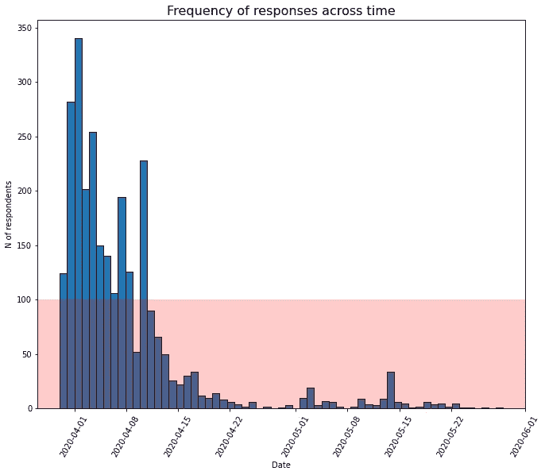
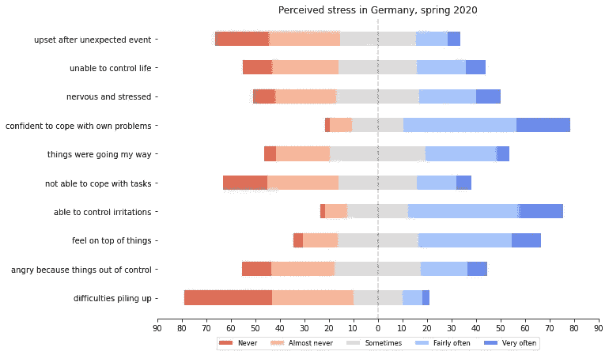
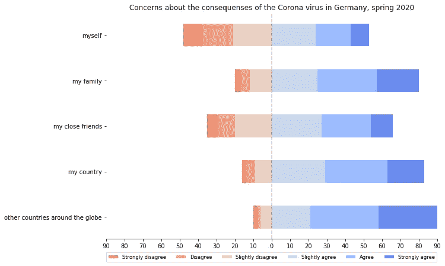
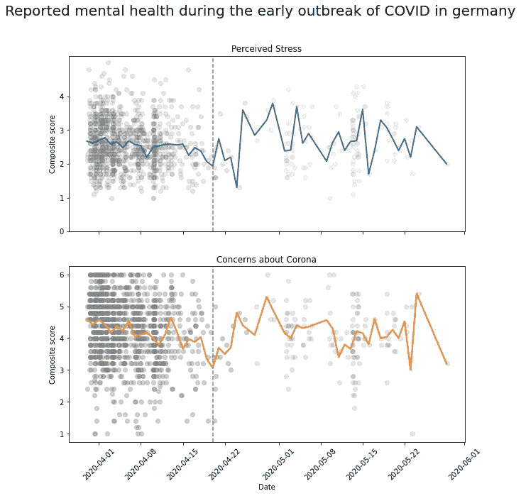

# 待在家里，勇敢点？Python 中的时间序列方法

> 原文：<https://towardsdatascience.com/stay-home-be-brave-a-time-series-approach-in-python-33a98b9bac17>

## 探索德国人在 COVID 疫情爆发的前几周的心理健康状况，并了解数据质量检查的重要性

迪伦·费雷拉在 [Unsplash](https://unsplash.com/s/photos/stay-home?utm_source=unsplash&utm_medium=referral&utm_content=creditCopyText) 上的照片

每当人们对趋势、轨迹或季节性感兴趣时，时间序列分析就是你的朋友。这一系列技术似乎在经济和金融领域更占优势(例如，股票价格、营销等。)，然而心理学家也对采用它越来越感兴趣。乍一看，这并不奇怪，因为心理过程天生就有时间限制，从几分钟到几年(例如，社会排斥后的即时疼痛或整个生命周期的认知下降)。然而，很明显，当谈到预测时，人类是一个特别难啃的骨头。但是，如果我们想简单地探索这种随时间推移而发生的心理过程的动态呢？

让我们以新冠肺炎的心理影响为例。试着回忆一下 2020 年春天关于一种新病毒传播的令人不安的消息。除了许多还没有人真正熟悉的统计数据，运载尸体的货车和过度拥挤的医院出现在媒体上。“拉平曲线”的政治措施得以实施，并从根本上改变了我们的社会生活——几乎是在一夜之间。规则几乎每周都要重新定义，公共功能几乎完全关闭。我们可以争辩说，我们已经生活在长期的紧急状态中，没有改善的前景，这种情况很可能诱发抑郁症状和焦虑。因此，想知道电晕测量的放松如何可能减少我们感知的压力以及对疫情的担忧并不牵强。2020 年 4 月 20 日，德国发生了这样的事情:学校在婴儿学步时重新开放，并允许在 800 平方米的商店购物。那么，这个信号是如何影响公众的日常心理健康的呢？人们真的松了一口气吗？幽居病的症状会持续到五月吗？

## COVIDistress 研究

为了找到答案，我们将分析来自 [COVIDistress 研究](https://osf.io/z39us/)的数据，这是一个合作的国际开放科学项目，旨在衡量全球早期电晕危机期间的经历、行为和态度。该调查包括 48 种语言，总样本量为 173，426 名参与者，他们在 2020 年 3 月 30 日至 5 月 30 日之间做出了回应。作者认为，年龄较小、身为女性、受教育程度较低、单身、与更多孩子呆在一起，以及生活在 COVID‐19 情况更严重的国家或地区，与压力水平明显较高有关( [Kowal 等人，2020](https://iaap-journals.onlinelibrary.wiley.com/doi/full/10.1111/aphw.12234) )。由于我们是社会物种，我们天生就与他人联系，但只是在自愿的基础上:即使与社会隔绝可能会引发孤独感，缺乏隐私也同样令人痛苦。虽然承认哪些群体似乎更容易受到隔离后果的影响是有价值的，但我想知道你是否可以在研究过程中跟踪感知压力的轨迹，并测试它与政治措施的关系。正如我们将会发现的那样，这并不是一件容易的事情——但稍后会有更多的介绍。

## 测量电晕封锁的心理影响

感知压力用 PSS-10 测量，PSS-10 是由 Cohen (1983)开发的 10 项问卷，用于评估个人在过去一周内感知生活不可预测、不可控和超负荷的程度。为了测试人们对正在发生的疫情有多担心，他们被要求评估他们对冠状病毒在不同领域(个人、自己的国家等)的后果的担心程度。).关于确切措辞的更多详细信息，你可以点击查看整个调查[。为了让您更好地理解这些术语的实际含义，让我快速向您解释一下。](https://osf.io/mhszp/)

# 一个小小的时间序列指南

> **时间序列分析**通常描述一个系统化的过程(例如，气候变化、股票价格变化等)。)随时间展开，并基于等间距的多个观察。

即使这不适用于我们具有更复杂设计的案例研究，这些多重观察实际上源于单一来源(例如，个体、指数)。根据经验，你至少需要 **50 次观察**才能做出大致准确的预测，当然，更多的数据总是受欢迎的([麦克利里等人，1980](https://www.ojp.gov/ncjrs/virtual-library/abstracts/applied-time-series-analysis-social-sciences) )。

## 成分

时间序列数据中有四个**可变性来源，要么需要明确建模，要么需要通过数学变换(如差分)去除，以做出准确预测:**

*   **趋势**发生在中长期数据水平出现明显变化的时候。例如，数据在序列开始时的平均值可能比序列结束时的平均值高，因此呈现出负趋势。
*   **季节**指的是持续出现的增加或减少的重复模式。这可以归因于日历的各方面(例如，月份、星期几等。).例如，我们可以观察到外面的温度每天早上上升，晚上下降。
*   周期与季节有一个共同的属性:某些波动的重复出现。但与季节不同，周期没有固定的持续时间，不必归因于日历的各个方面，通常表现为超过 2 年的时间(例如，商业周期)。
*   **随机性**描述了一种不规则的变化，这种变化使得轨迹抖动自然而无系统。它可以归因于噪声，是从数据中去除趋势、季节和周期后剩余的方差。

## 概念

**自相关**:另一个值得特别注意的常见方差来源叫做**自相关**。它源于当前状态多少受到先前状态影响的想法。假设我在某个时刻非常沉思，这使得我不太可能很快转变成一个随和快乐的模式。用心理学术语来说，我们说先前的情感状态至少部分地决定了我们当前的情绪。然而，正如我们将在后面看到的，这一观点显然只适用于一个人内部的情绪，而不适用于个体之间的情绪，因此需要纵向数据。在统计学术语中，如果一个变量与一定数量的先前时间点(称为滞后)相关，则时间序列显示自相关。例如，双滞后自相关是与当前值前两次出现的值的皮尔逊相关。跨越许多滞后的自相关系数被称为自相关函数(ACF)，它在模型选择和评估中起作用。

**平稳**:在现实生活中，许多时间序列并不是**平稳的**，这使得它的轨迹看起来摇摆不定。从技术上来说，这意味着序列均值、方差和/或自相关结构确实会随时间而变化。但是这一点使得预测未来值变得更加困难，因为过去的值不太相似。然而，如果我们通过数学转换(例如，差分)来解释一个序列中存在的系统模式，我们可以实现平稳性并开始预测。

## 型号选择

如果**预测**系列中的未来点数是你的主要目标，ARIMA 模型可能适合你。它们是直接从数据中发展出来的，不需要关于过程可能发生的环境的理论。 **ARIMA** 代表自回归综合移动平均线。AR(q)和 MA(p)项都指定了正式描述序列中存在的自相关的预测值，而 I[d]描述了用于使序列平稳的差分阶数。

然而，我们心理学家通常对一系列事件的系统方面特别感兴趣。例如，我们热衷于描述第一次锁定期间感知压力变化背后的潜在趋势。或者，我们可以尝试将这些压力反应与外部因素联系起来，例如每个国家电晕爆发的严重程度。在另一种情况下，我们可以评估关键事件的影响，如政治措施的变化(如引入口罩、有条件重新开业等)。).因此，除了预测之外，我们还对**描述性**和**解释性**模型感兴趣。为此，我们可以首先使用回归模型，然后将 ARIMA 模型拟合到残差中，以解释任何剩余的自相关。如果你对更多的技术细节感兴趣，你可以在 Jebb 及其同事(2015)的一篇[论文](http://journal.frontiersin.org/article/10.3389/fpsyg.2015.00727/abstract)中找到非常好的解释。

## 好的——现在让我们先检查我们的数据

现在我们开始有趣的部分——用 Python 编码。由于数据可以在线下载，每个人都可以通过 COVIDistress 开源研究项目免费获取这些数据。回答是按月存储的，所以我们每个月都有一个文件。为了创建单个文件，我们需要将它们连接起来，以加载包含所有月份的数据帧。这是如何用尽可能少的努力来准备它的:设置好项目路径后，我们使用 list comprehension 使用 Python 的`glob`库为我查找所有相关的 excel 文件。为了节省一些不必要的计算时间，我们可以将感兴趣的变量名存储在一个单独的列表中。然后我们浏览所有文件，查找相关的列，并使用`pd.concat()`将所有月份的列合并在一起。生成的数据帧可以导出为 csv 文件，因此我们只需运行该命令一次，并随时返回数据。为了避免在反复运行脚本时出现问题，在合并所有文件之前包含一个条件:包含所有月份的 csv 文件不能已经存储在我的文件夹中，否则生成的文件将包含数千个重复条目。还有另一个技巧可以方便随后的计算和用`matplotlib`可视化:通过告诉`pandas`根据记录的日期列解析日期，日期将被直接转换成`datetime64`格式，并可以用作数据帧的索引。

通过在 df 上使用`head()`方法，我们可以看到这个数据帧的预览。通过在 df 上调用 dtypes，我们得到每一列的数据类型。这对于验证数据是否被熊猫正确检测是很重要的。由于应对冠状病毒后果的政治措施因国家而异，我们将重点关注德国，因此相应地对数据进行子集划分。

## 坚持住！我们错过了一些东西。

索菲娅·阿莫鲁索在 [GIPHY](https://giphy.com/gifs/QBXCS6WlxbShWfBnZF) 上发现的点警告 GIF

这里有一个陷阱:我们有一个特殊的数据结构，与纵向研究设计有很大不同。尽管这项研究持续了数周，并且在数周内定期对记录进行采样，但每次观察只发生一次。这被称为**重复横截面设计**，不能简单地在传统的 ARIMA 模型中建模，因为过去的价值不能直接与现在或未来的价值联系起来。相反，ARIMA 条款必须整合到一个多层次模型中(MLM) ( [莱博&韦伯，2014](https://onlinelibrary.wiley.com/doi/abs/10.1111/ajps.12095) )。具体来说，我们可以从某一天的所有回答中计算出平均压力水平，并将其作为人口感知压力水平的代表。然而，我们无法判断受访者第一天的压力水平与一周后的压力水平有多大关联，因为它是从不同的人身上取样的。

此外，很明显，一个人感受到的压力不仅仅取决于疫情的状态，还与许多其他因素有关:一个人对压力的倾向性、个人问题和应对策略等等。由于相同的被调查者没有被多次要求评估他们的压力水平，我们没有机会从其他方差来源(例如，重复测量方差分析利用的东西)中理清这些个体成分。但是，我们能不能在记住这些限制的同时，至少了解一下总体压力水平？为了确定我们是否有足够的数据来对每天进行粗略的估计，我们对每天的观察结果进行计数。结果发现，每次约会有近 80%的回复都在 100 人以下。相比之下，当我们看国际样本时，只有 3%的日子包括 100 个参与者。尽管如此，分析整个样本要复杂得多，因为答复是嵌套在国家和日期中的，这需要层次模型。

我们可以通过使用一个名为`strftime`的简单函数来获得每月的观察频率——它转换日期时间索引的各个方面(例如，日、月、秒等。)转换成可读性很好的字符串。例如，我们可以通过使用括号内的`%B`获得完整的月份名称(更多代码在[文档](https://docs.python.org/3/library/datetime.html#strftime-and-strptime-behavior))。要查看调查的响应频率每天是如何变化的，我们可以通过简单地调用数据帧索引上的`matplotlib`的直方图函数来创建一个直方图——x 轴将自动格式化。

> 声明:所有图片均由作者创作，除非另有说明。

每个日期的德国参与者人数直方图，红色区域表示 N = 100 或更少。

该图只是支持了我们已经知道的:即使在研究期开始时有大约两周的时间有足够的数据支持，参与的兴趣也会很快消退。

# 调查结果

现在，如果我们把这些日常变化暂时放在一边，德国人在最初的几个月里一般是如何处理对他们的幸福构成的威胁的？

为了找到答案，我们首先创建两个数据框架，每个数据框架分别包含用于测量感知压力和对电晕的关注的项目的相关列。通过使用`startswith()`方法，我们可以很容易地找到各个尺度的所有变量，而无需繁琐的输入。接下来，我们创建两个列表，以确保我们稍后在图形上放置正确的标签:

1.  每个等级的相关回答类别列表(例如，1 =强烈不同意，2 =不同意等。)和
2.  包含参与者被要求评价的陈述的列表(例如，*在过去的一周中，您因意外发生的事情而心烦意乱的频率有多高？，*你可以在这里找到完整的调查

然后，我们构建一个函数，将相应的数据子集和陈述作为输入，并返回一个字典，其中包含符合量表上每个类别的响应百分比。通过这种方式，函数可以很容易地应用到我们的压力和关注数据中。

这是一个如何从我们的德国样本中寻找感知压力量表响应的例子。

包含属于类别的响应百分比的字典输出

例如，结果表明，8%的德国人最近从未感到紧张和压力，而 21%的德国人经常感到紧张和压力。然而，通过简洁直观的数据可视化，我们可以对这些分布有更好的印象。发散堆积条形图是一种很好的方式来展示受访者在多大程度上赞同或否认特定的陈述。为此，我使用并改编了我在 [Stackoverflow](https://stackoverflow.com/questions/23142358/create-a-diverging-stacked-bar-chart-in-matplotlib) 上找到的一段代码(感谢 [eitanlees！](https://stackoverflow.com/users/3320620/eitanlees))根据响应类别的数量是奇数还是偶数来校正偏移量。

2020 年德国受访者感知压力反应的堆叠发散条形图

平均而言，大多数人在疫情的前几周精神上表现良好——至少比例表明了这一点:积极的陈述被转移到了左边，因此大多数参与者在大多数时间都感觉能够应对困难。同样，消极的反应会转移到右边，因此大多数人只是偶尔会感到对自己的生活缺乏控制。从数字上来说，只有 4%的人从未感觉到掌控一切，3%的人经常遇到困难。尽管如此，如果我们将这转换回绝对数字，4%的样本(N = 2732)至少有 109 名参与者。因此，情节并没有描绘出这样一幅完全积极的画面，因为答案差异很大，这表明个人在不同程度上经历了疫情的心理后果。这个例子再次表明，花点时间深入分析回答是值得的，而不是马上得出平均值。

如果我们将同样的函数应用于对日冕的担忧的反应，一个有趣的模式出现了…

关于受访者对 2020 年冠状病毒后果的担忧的堆积分歧条形图

看起来，人们对冠状病毒对他们自己和他们的亲密朋友的影响的担忧有所不同，但大多数人都同意它对他们的国家和全球的影响。也许这可以归结为这样一种想法，即人们觉得即使在困难的情况下，他们仍然是自己命运的建筑师。但是对于普通大众来说，这种包罗万象的问题的后果不再由他们控制，而是取决于更多的因素(例如，政治决策、经济发展等)。).

在我们为所有问题创建一个单一的分数来反映每个人的压力分数之前，需要颠倒一些陈述。例如，如果人们高度认同这样的陈述*“在过去的一周，我对自己处理个人问题的能力充满信心，”*这表明他们的应对能力使他们感觉到的压力水平较低，这也应该反映在他们的得分中。为了实现这一点，我们可以利用字典理解来引导程序找到需要交换数字的变量。然后，我们可以在我们的`df_stress`数据帧上使用 pandas `replace()`方法，并简单地将结果字典作为参数传递。

通过编写一个名为`aggregate_timeseries()`的函数，它包括以下步骤:我们逐行对每条语句的所有得分进行求和，这是针对每个单独的观察。因为这个操作单独产生的对象将是一个没有指定名称的序列，所以我们将其转换为 dataframe 并解决命名问题。即使这个分数包含了我们想要的——一个反映每个人感受到的压力的综合分数——我们甚至可以将它分解为每个人每天的一个分数，这种技术被广泛称为**下采样**。对于这个任务，我们可以使用`resample`方法获得一天内所有观察值的平均值。研究期间可能还包括我们没有任何数据的某一天，因此我们可以使用`interpolate()`来估算那天可能的压力分数。稍加格式化后，我们的`daily_timeseries()`函数可以获取任何包含每次观察一个分数的数据帧，并将其转换为日平均值的时间序列。

现在，整体压力分数如何随时间变化？日复一日的数据可用性如何影响最终的轨迹？让我们把两者都形象化，用单个数据点和每日平均值来表示分数的可变性。首先，我们需要通过合并各自的数据框架，将压力和担忧反应结合起来。为了标注德国放松措施的日期(2020 年 4 月 20 日)，我们`import datetime as dt`添加了一条垂直虚线，其格式与日期时间索引兼容。此外，我们通过将`alpha`设置为 0.1 来增加各个点的不透明度，从而处理可能重叠的数据点。

整个研究期间(2020 年 5 月 30 日至 6 月 1 日)对心理影响问题的回答。灰点代表个人观察。

现在这里发生的事情已经很明显了。灰色散点的密度越高，我们在这个特定时间点的数据就越多。在研究的第一阶段，每天的平均值有足够的数据支持。似乎平均压力估计值有所下降。当涉及到对电晕的关注时，这似乎更加明显，但这归结为一个简单的技术事实:标度更窄，这样斜率(例如，从时间 A 到时间 B)比标度更宽时更容易变陡。

在研究期间的剩余时间里，日平均值基于非常少的数据，因为这些点像纸屑一样分散。在单日，它甚至是基于单次观察计算的(使用平均值是多余的)。因此，根据样本的反应，该线在较高值和较低值之间波动很大。看——这很好地说明了我们在小样本中使用算术平均值表示平均值时通常会遇到的问题:它对极端的个体值非常敏感。因此，我们在这里看到的轨迹不是德国人口中感知压力随时间的发展，而最有可能是噪音。因此，我们可以拒绝使用数据进行更复杂的时间序列建模的想法，因为我们遇到了轨迹完全随机的可能性:每天都抽取一个新的子样本来计算平均值，该平均值应该以与前一天相同的方式代表人口的心理。这就像把苹果和橘子相比较，仍然试图找到它们之间的联系。

# 首先对您的数据进行数据科学研究

不要因为不能运行“实际的”分析而失望——它只会给我们无法解释的、没有实际意义的结果。这也是由于探索性分析的性质:如果数据集不适合分析，就没有办法让它适合。因此，我们无法回答科罗纳的放松对公众感受到的压力有多大影响的问题。但是除了所有关于时间序列分析的术语之外，我们还学到了很多关于检查数据适用性的重要性。最终，光靠统计数据无法得出有意义的事实。只有分析师知道。

## 参考

[1] A. Lieberoth、J. Rasmussen、S. Stoeckli、T. Tran、d . b . epuli、H. Han、S. Y. Lin、J. Tuominen、G. A. Travaglino 和 S. Vestergren， [COVIDiSTRESS 全球调查网络](https://osf.io/z39us/)，(2020 年)。COVIDiSTRESS 全球调查。DOI 10.17605/OSF。IO/Z39US，从 osf.io/z39us 检索

[2] M. Kowal、T. Coll‐Martín、G. Ikizer、J. Rasmussen、K. Eichel、A. Studzińska、… & O. Ahmed，[在 COVID‐19 疫情期间，谁的压力最大？来自 26 个国家和地区的数据。](https://iaap-journals.onlinelibrary.wiley.com/doi/epdf/10.1111/aphw.12234) (2020)，应用心理学:健康与幸福，12(4)，946–966

[3] R .麦克利里、R. A .海伊、E. E .梅丁格和 d .麦克多沃尔，[社会科学应用时间序列分析](https://www.ojp.gov/ncjrs/virtual-library/abstracts/applied-time-series-analysis-social-sciences) (1980)，Sage 出版物

[4] A. T. Jebb，L. Tay，W. Wang 和 Q. Huang，[心理学研究中的时间序列分析:检验和预测变化](https://www.frontiersin.org/articles/10.3389/fpsyg.2015.00727/full) (2015)，心理学前沿， *6* ，727

[5] M. J .莱博和 c .韦伯，[重复截面设计的有效方法](https://onlinelibrary.wiley.com/doi/abs/10.1111/ajps.12095) (2015)，*美国政治科学杂志*， *59* (1)，242–258