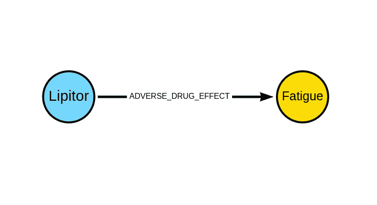
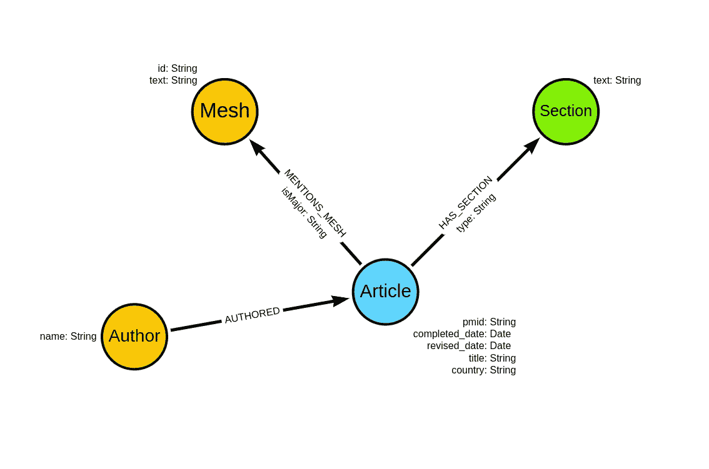
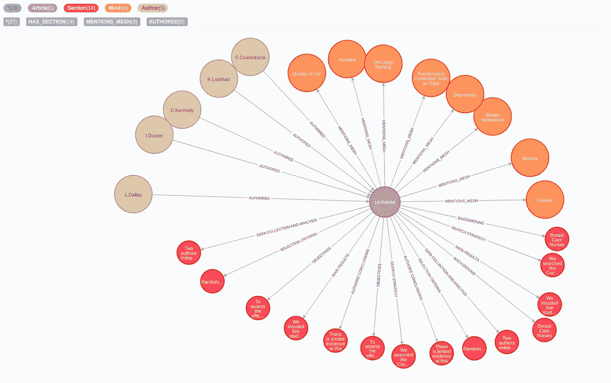
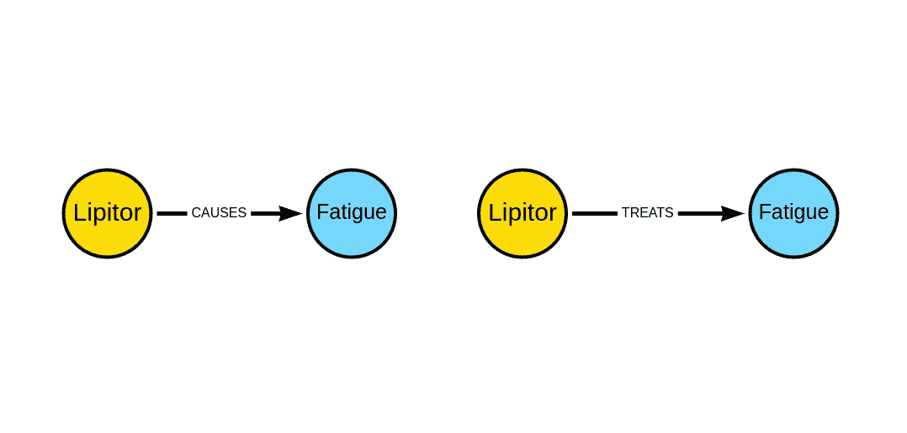
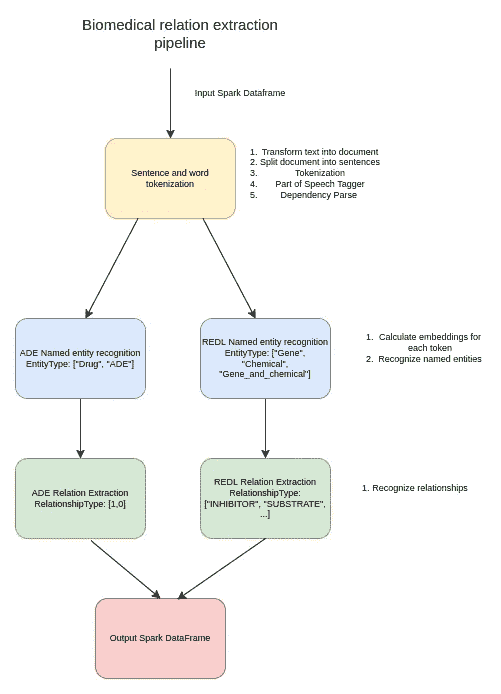
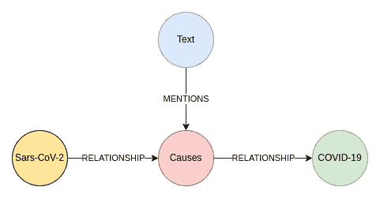
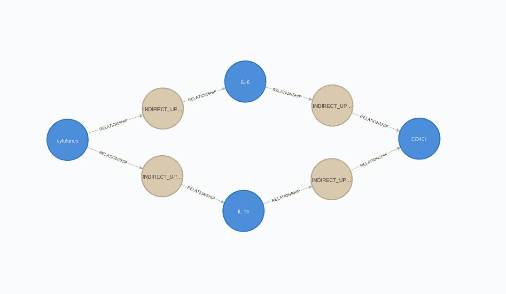

# 利用 Spark NLP 和生物医学知识图表与最新的医学研究保持联系

> 原文：<https://towardsdatascience.com/stay-in-touch-with-the-latest-medical-research-by-utilizing-spark-nlp-and-biomedical-knowledge-950d5ed4c758>

## 利用自然语言处理技术从生物医学文章中抽取关系，构建生物医学知识图

生物医学领域是寻找各种实体(如基因、药物、疾病等)之间的联系和关系的主要例子。实际上，任何医生都不可能了解所有最新发表的研究。比如我在写这篇文章的时候(3 月 10 日)查询 [PubMed Central](https://www.ncbi.nlm.nih.gov/pmc/) ，找到了 2022 年发表的 10 万篇文章。这意味着每天有一千多篇文章发表。即使是一个庞大的医生团队也很难阅读它们并从中获得有价值的见解。

为了与所有最新的生物医学研究保持联系，我们可以利用各种 NLP 技术。例如，我在以前的博客文章中已经写了关于构建生物医学知识图的内容。然而，焦点更多地集中在命名实体识别上。从那时起，我发现了生物医学关系提取模型，我们将在这篇文章中看看。

我们将快速回顾关系提取模型的目的。例如，假设您正在分析下面的句子:

```
Been taking Lipitor for 15 years , have experienced severe fatigue a lot!
```

第一步是识别句子中出现的所有生物医学实体。在这种情况下，我们可以识别出**立普妥**和**严重疲劳**。关系提取模型通常是非常定制的和特定于领域的。例如，假设我们已经训练了模型来识别药物的副作用。药物不良反应是指药物与药物的意外情况或后果之间的关系。在这种情况下，我们可以说立普妥导致不必要的严重疲劳。如果你和我一样，你会想到用一个图来存储和表示两个实体之间的关系。



不良药物关系的图形表示。作者图片

由于图形数据库是为存储实体及其关系而设计的，因此使用它们来存储我们通过利用关系提取 NLP 模型提取的高度互连的数据是有意义的。

## 议程

在本帖中，我们将从从 PubMed 下载生物医学文章开始。PubMed 提供了一个获取数据的 API 和一个每天更新的 FTP 站点。FTP 站点没有明确的许可声明，但是它描述了使用数据的[条款和条件](https://ftp.ncbi.nlm.nih.gov/pubmed/updatefiles/README.txt):

```
NLM freely provides PubMed data. Please note some abstracts may be protected by copyright.

General Terms and Conditions:
-Users of the data agree to: 
--acknowledge NLM as the source of the data in a clear and conspicuous manner,
--properly use registration and/or trademark symbols when referring to NLM products, and
--not indicate or imply that NLM has endorsed its products/services/applications.
```

因为这些数据将仅用于 NLP 管道的简单演示，所以我们都准备好了。

接下来，我们将通过 NLP 管道运行数据，以提取生物医学实体之间的关系。有许多开源的命名实体识别模型，但不幸的是，我还没有遇到任何不需要人工训练的生物医学关系提取模型。由于这篇文章的目标不是教你如何训练生物医学关系提取模型，而是如何应用它来解决现实世界的问题，我们将使用约翰·斯诺实验室的医疗保健模型。约翰·斯诺实验室为识别实体和从新闻类文本中提取关系提供免费模型。然而，生物医学模型不是开源的。幸运的是，他们为医疗保健模式提供了 30 天的免费试用期。为了遵循本文中的示例，您需要开始免费试用并获得许可密钥。

在本文的最后一部分，我们将把提取的关系存储在 Neo4j 中，这是一个原生图数据库，旨在存储和分析高度互联的数据。我还将解释一些关于我们可以用来表示数据的不同图形模型的考虑。

## 步伐

*   从 PubMed FTP 站点下载并解析每日更新的文章
*   在 Neo4j 中存储文章
*   使用约翰·斯诺实验室模型从文本中提取关系
*   在 Neo4j 中存储和分析关系

像往常一样，所有的代码都可以作为一个[谷歌 Colab 笔记本](https://github.com/tomasonjo/blogs/blob/master/pubmed/Pubmed%20NLP.ipynb)获得。

## 从 PubMed FTP 站点下载每日更新

如上所述，PubMed 的每日更新可以在他们的 [FTP 站点](https://ftp.ncbi.nlm.nih.gov/pubmed/updatefiles/)上获得。数据以 XML 格式提供。这些文件有一个增量 ID。我首先尝试以编程方式计算特定日期的增量文件 id。然而，这并不简单，我也不想浪费时间去搞清楚，所以您必须手动复制代码中所需的文件位置。

我的直觉是，将 XML 转换成字典并进行处理会更容易。但是，如果我必须再做一次，我可能会使用 XML 搜索函数，因为我必须包含几个异常，以便正确地从字典格式中提取所需的数据。

解析字典的代码有 70 行长，没什么意思，所以我在这里跳过。然而 [Colab 笔记本](https://github.com/tomasonjo/blogs/blob/master/pubmed/Pubmed%20NLP.ipynb)显然包含了所有的代码。

## 在 Neo4j 中存储文章

在转移到 NLP 提取管道之前，我们将文章存储在 Neo4j 中。文章的图形模型如下:



PubMed 文章的图形模型。图片由作者提供。

图形模型是非常自描述的。图表的中心是文章。我们将他们的 PubMed ids、标题、国家和日期存储为属性。当然，如果我们愿意，我们可以将 country 重构为一个单独的节点，但是这里我将它们建模为节点属性。每篇文章包含一个或多个文本部分。有几种类型的部分是可用的，如摘要、方法或结论。我已经将节类型存储为文章和节之间的关系属性。我们也知道谁写了一篇特定的研究论文。特别是 PubMed 文章还包含了论文中提到或研究的实体，当这些实体被映射到网格本体时，我们将把它们存储为网格节点。

大多数文章只有摘要。您可能可以通过 PubMed API 下载大多数文章的全文。然而，我们不会在这里这样做。

在导入数据之前，我们必须设置我们的 Neo4j 环境。如果你使用的是 Colab 笔记本，建议你在 Neo4j 沙盒中打开一个[空白项目。Neo4j 沙盒是 Neo4j 的免费限时云实例。否则，如果你想要一个本地 Neo4j 环境，我建议你下载并安装](https://sandbox.neo4j.com/?usecase=blank-sandbox) [Neo4j 桌面应用](https://neo4j.com/download/)。确保在本地环境中安装 APOC 库。

设置好 Neo4j 实例后，将连接细节复制到脚本中。

处理 Neo4j 的一个好的实践是定义惟一的约束和索引，以优化导入和读取查询的性能。

现在我们都设置好了，我们可以继续将文章导入 Neo4j。

导入被分成 1000 篇文章的批次，以避免处理单个巨大的事务和潜在的内存问题。import Cypher 语句有点长，但是不太复杂。如果你需要帮助理解 Cypher 语法，我建议你在 [Neo4j 的 Graph Academy](https://neo4j.com/graphacademy/) 完成一两门课程。

如果您打开 Neo4j 浏览器，您应该能够观察到存储在图形中的文章。



存储为图表的示例文章。图片由作者提供。

我们可以在进入 NLP 管道之前快速检查数据。

```
MATCH (a:Article)
RETURN count(*) AS count
```

我们的数据库里有 25000 多篇文章。这有点多，因为新的每日文章应该接近 1000 而不是 25000。我们可以比较修改和完成的日期，以更好地理解为什么有这么多文章。

```
MATCH (a:Article)
RETURN a.pmid AS article_id,
       a.completed_date AS completed_date,
       a.revised_date AS revised_date
ORDER BY completed_date ASC
LIMIT 5
```

*结果*

我不知道为什么 20 年前的文章会被修改，但是我们可以从 XML 文件中得到这些信息。接下来，我们可以检查哪些网格实体在 2020 年或以后完成的文章中作为主要主题被最频繁地研究。

```
MATCH (a:Article)-[rel:MENTIONS_MESH]->(mesh_entity)
WHERE a.completed_date.year >= 2020 AND rel.isMajor = "Y"
RETURN mesh_entity.text as entity, count(*) AS count
ORDER BY count DESC
LIMIT 5
```

*结果*

有趣的是，尽管我们只导入了一个每日更新，新冠肺炎却名列前茅。在关系提取 NLP 模型流行之前，您可以使用共现网络来识别实体之间的潜在联系。例如，我们可以检查哪些实体最常与新冠肺炎同时出现。

```
MATCH (e1:Mesh)<-[:MENTIONS_MESH]-(a:Article)-[:MENTIONS_MESH]->(e2)
WHERE e1.text = 'COVID-19'
RETURN e1.text AS entity1, e2.text AS entity2, count(*) AS count
ORDER BY count DESC
LIMIT 5
```

*结果*

新冠肺炎的同现结果是有意义的，尽管它们除了与人类和流行病有关以及与新型冠状病毒有很强的联系之外，没有解释太多。

## 关系提取 NLP 流水线

简单的共现分析可能是分析实体之间关系的强大技术，但它忽略了文本中可用的大量信息。由于这个原因，研究人员已经投入了大量的精力来建立训练关系抽取模型。

如果同现分析可以检测实体之间的潜在关系，则关系提取模型被训练来确定实体之间的关系类型。


共现分析和关系抽取模型的比较。图片由作者提供。

如上所述，关系提取模型试图预测两个实体之间的关系类型。确定关系类型为何重要的一个简单示例如下:



确定关系类型的重要性。图片由作者提供。

一种药物可以与文中的特定条件同时出现。然而，了解药物是否用于治疗疾病或引起不良副作用是至关重要的。

关系提取模型大多是非常特定于领域的，并且被训练成仅检测特定类型的链接。对于这个例子，我已经决定在 NLP 管道中包含两个 John Snow Labs 模型。一个模型将检测药物和条件之间的[药物副作用](https://nlp.johnsnowlabs.com/2021/07/16/re_ade_biobert_en.html)，而另一个模型用于提取药物和蛋白质之间的[关系](https://nlp.johnsnowlabs.com/2022/01/05/redl_drugprot_biobert_en.html)。

John Snow Labs NLP pipeline 构建于 Apache Spark 之上。无需深入细节，NLP 流水线的输入是 Spark 数据帧。管道中的每一步都从数据帧中获取输入数据，并将其输出存储回数据帧。一个简单的例子是:

这个示例管道由三个步骤组成。第一步是将输入文本转换成文档的 DocumentAssembler。它将 Spark 数据帧的**文本**列作为输入，并将其结果输出到**文档**列。下一步是使用 SentenceDetector 将文档分割成句子。类似地，SentenceDetector 将**文档**列作为输入，并将其结果存储在 DataFrame 的**句子**列下。

我们可以在管道中添加任意数量的步骤。需要注意的唯一重要的事情是，我们需要确保管道中的每一步都有有效的输入和输出列。虽然这个例子中的 NLP 管道定义很简单，但是涉及到许多步骤，所以我将用一个图表来展示它，而不是复制代码。



Spark NLP 关系抽取生物医学流水线。图片由作者提供。

有些步骤与 ADE(药物不良反应)和 REDL(药物和蛋白质)关系都相关。然而，由于模型检测不同类型的实体之间的关系，我们必须使用两个 NER 模型来检测两种类型的实体。然后，我们可以简单地将这些实体输入到关系提取模型中。例如，ADE 模型将只产生两种类型的关系(0，1)，其中 1 表示药物副作用。另一方面，REDL 模型被训练来检测药物和蛋白质之间的九种不同类型的关系(激活剂、抑制剂、激动剂……)。

最后，我们需要定义图模型来表示提取的实体。大多数情况下，这取决于您是否希望提取的关系指向它们的原始文本。


基于是否链接到原文的图形模式考虑。图片由作者提供。

如果你不需要找到原文，这个模型非常简单。然而，由于我们知道 NLP 提取并不完美，我们通常希望在提取的关系和原始文本之间添加一个链接。这个模型允许我们通过检查原始文本来容易地验证任何关系。在右边的例子中，我有意跳过定义实体和关系节点之间的关系类型。我们可以使用一般的关系类型，或者使用提取的关系类型，如原因、抑制等。在这个例子中，我选择使用一个通用的关系类型，所以最终的图形模型是:



提取关系的最终图形模型。图片由作者提供。

剩下唯一要做的就是执行代码，将提取的生物医学关系导入 Neo4j。

这段代码只处理 1000 个部分，但是如果您愿意，可以增加这个限制。因为我们没有指定节节点的任何唯一 id，所以我从 Neo4j 中获取了文本和节内部节点 id，这将使关系的导入更快，因为通过长文本匹配节点不是最佳方式。通常，您可以通过计算和存储 sha1 这样的文本散列来解决这个问题。在 Google Colab 中，处理 1000 个部分大约需要一个小时。

现在我们可以检查结果。首先，我们将查看被提及次数最多的关系。

```
MATCH (start:Entity)-[:RELATIONSHIP]->(r)-[:RELATIONSHIP]->(end:Entity)
WITH start, end, r,
     size((r)<-[:MENTIONS]-()) AS totalMentions
ORDER BY totalMentions DESC
LIMIT 5
RETURN start.name AS startNode, r.type AS rel_type, end.name AS endNode, totalMentions
```

*结果*

因为我不是医学博士，我不会评论这些结果，因为我不知道它们有多准确。如果我们要问医生一个特定的关系是否有效，我们可以给他们提供原文，让他们决定。

```
MATCH (start:Entity)-[:RELATIONSHIP]->(r)-[:RELATIONSHIP]->(end:Entity)
WHERE start.name = 'cytokines' AND end.name = 'chemokines'
MATCH (r)<-[:MENTIONS]-(section)<-[:HAS_SECTION]-(article)
RETURN section.text AS text, article.pmid AS pmid
LIMIT 5
```

*结果*


特定关系的原始文本。图片由作者提供。

寻找特定实体之间的间接关系也可能是有趣的。

```
MATCH (start:Entity), (end:Entity)
WHERE start.name = "cytokines" AND end.name = "CD40L"
MATCH p=allShortestPaths((start)-[:RELATIONSHIP*..5]->(end))
RETURN p LIMIT 25
```

*结果*



生物医学实体之间的间接关系。图片由作者提供。

有趣的是，结果中的所有关系都是 **INDIRECTED_UPREGULATOR。您可以搜索任何关系类型的间接模式。**

## 后续步骤

我们有几个选项来增强我们的 NLP 渠道。首先想到的是使用实体链接或解析器模型。基本上，实体解析器将实体映射到目标知识库，如 UMLS 或恩森布尔。通过将实体准确地链接到目标知识库，我们实现了两件事:

*   实体歧义消除
*   能够利用外部资源丰富我们的知识图表

例如，我在我们的图中发现了两个节点实体，它们可能指的是同一个真实世界的实体。


同一实体的潜在副本。图片由作者提供。

虽然 John Snow Labs 提供了多种实体解析模型，但是要高效地将实体映射到指定的目标知识库需要一些领域知识。我见过一些真实世界的生物医学知识图表，它们使用多个目标知识库，如 UMLS、OMIM、Entrez，来覆盖所有类型的实体。

使用实体解析器的第二个特点是，我们可以通过使用外部生物医学资源来丰富我们的知识图。例如，一个应用是使用知识库来导入现有的知识，然后通过 NLP 提取来发现实体之间的新关系。

最后，你还可以使用各种图形机器学习库，比如 [Neo4j GDS](https://neo4j.com/docs/graph-data-science/current/algorithms/) 、[皮肯](/knowledge-graph-completion-with-pykeen-and-neo4j-6bca734edf43)，甚至[皮托什几何](/integrate-neo4j-with-pytorch-geometric-to-create-recommendations-21b0b7bc9aa)来预测新的关系。

如果您发现任何令人兴奋的使用 NLP 管道和图形数据库组合的应用程序，请告诉我。如果你对这篇文章中的自然语言处理或知识图谱有什么改进的建议，也请告诉我。感谢阅读！

和往常一样，所有代码都可以作为 [Google Colab notebook](https://github.com/tomasonjo/blogs/blob/master/pubmed/Pubmed%20NLP.ipynb) 获得。