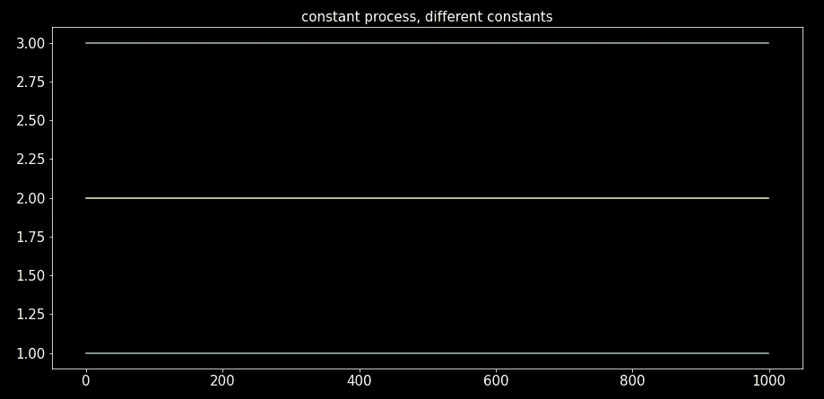
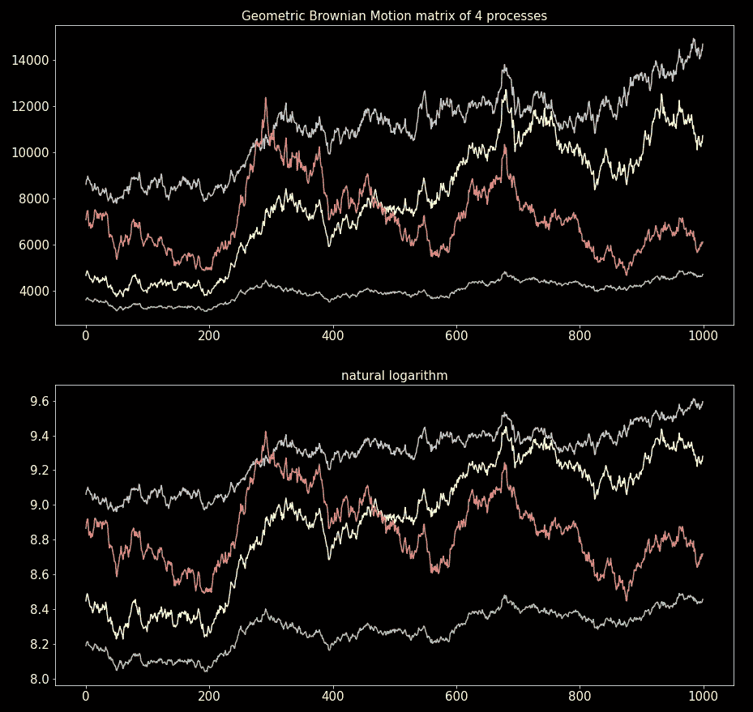

# 随机过程模拟——几何布朗运动

> 原文：<https://towardsdatascience.com/stochastic-processes-simulation-geometric-brownian-motion-31ec734d68d6>

## 随机过程模拟系列的第 4 部分。用 Python 从头开始模拟几何布朗运动。

图片作者。

除了布朗运动本身，几何布朗运动可能是最著名的随机过程。当我们考虑一个增量方差与过程值成比例的过程时，它就出现了。

在这个故事中，我们将讨论几何(指数)布朗运动。我们将学习如何模拟这样一个过程，并从数据中估计模拟所需的参数。我们的具体目标是模拟许多可能相关的几何布朗运动。

我选择使用面向对象范例中的许多元素，主要是因为这个故事将为系列中关于广义布朗运动的下一个故事铺平道路。这样，我们将能够扩展代码而无需重写。

在整个故事中，我们将使用随机过程模拟系列的[第一个故事](/stochastic-processes-simulation-brownian-motion-the-basics-c1d71585d9f9)中开发的关于布朗运动的代码。所以如果你还没检查过，那就先检查一下。

## 目录

*   这个过程的方程式
*   代码结构和架构
*   恒定过程
*   漂移过程
*   适马过程
*   初始值
*   模拟，把碎片放在一起
*   从数据中估计常数参数
*   根据数据估计相关性
*   数据模拟
*   代码摘要
*   最后的话

## 这个过程的方程式

该过程的 SDE(随机微分方程)为:

其中 *W_t* 是一个[布朗运动](/stochastic-processes-simulation-brownian-motion-the-basics-c1d71585d9f9)。换句话说，微分和过程本身的商遵循一个[扩散过程](/stochastic-processes-simulation-brownian-motion-the-basics-c1d71585d9f9)(it4 过程)。

使用初等随机微积分(查看参考资料了解详情)，我们可以很容易地将 SDE 积分为封闭形式:

这个方程考虑了 **μ和σ是 *t* 和 *W*** *，*的函数的可能性，这就是为什么这个方程被称为**广义几何布朗运动**。

**当μ和σ为常数**时，等式就简单多了:

这就是著名的**几何布朗运动**。

## 代码结构和架构

*先验*，我们可能不知道μ和σ的形式。好吧，你让我在这里；这个故事讲的是几何布朗运动，所以μ和σ应该是常数。

但是如果他们不是呢？如果μ和σ可以是时间的确定性函数或其他随机过程，会发生什么？

如果我们在一个简单的函数中编写代码，我们将需要参数(两个)来选择μ和σ的选项。这种方法会使函数的内部结构非常混乱，其中考虑了许多情况(假设有 *m* 个选择来构建μ和σ，那么情况的数量将是 *m* x *n* )。此外，如果我们要为μ或σ引入另一个函数，我们就需要改变这个函数——这是一个灾难。

我们不会这么做的。相反，我们将沿着 OO(面向对象设计)的道路走下去，并为μ和σ对象应该是什么建立接口(抽象)。然后我们创建一个广义的布朗运动对象，它依赖于这些抽象接口而不是具体的实现。这样，无论何时改变μ或σ对象，我们都不需要改变广义布朗运动对象。

起初，这种面向对象的方法可能看起来更长；但是记住，最短的路径似乎更长。最终，这一切都是值得的。

记住，我们的目标是生成许多布朗运动；因此，我们的界面应该能够同时创建许多流程。

## 恒定过程

正如我在上一节提到的，这个故事是关于几何布朗运动的；因此，μ和σ是常数。然而，通过我们的 OO 方法实现我们所寻求的通用性。它们应该是恒定的过程，而不是简单的常数。我们将创建一个小对象来生成常量流程(一个包含 *T* 行的 2D 数组，其中每一列都是常量)。这个数组的特点是定义实际常量(“常量”)的参数可以是:

*   一个 float，在这种情况下所有进程都有相同的常数，我们需要参数“n_procs”来定义进程(列)的数量。
*   浮点元组，在这种情况下，每个进程都有一个由元组定义的不同常数。“n_procs”参数被忽略。生成的数组的列的索引顺序与常量元组的顺序相同。

让我们来看看“ConstantProcs”类:

并绘制恒定的过程(没什么意思，只有直线，但是我们需要执行健全性检查):

图片作者。

## 漂移过程

这是我们第一个面向对象接口的例子。以下协议是漂移过程的接口:

在这种情况下，漂移过程是恒定的。因此，我们将“ConstantProcs”对象包装在下面的类中，该类实现了“Drift”协议。我们继承了“ConstantProcs ”,使包装更加明确，并避免重复代码。

## 适马过程

这是西格玛流程的界面:

这也是不变的。与上一节完全类似，我们将“ConstantProcs”包装在一个符合“适马”协议的类中。

## 初始值

初始值是*P0*作为*T3 的值，它们出现在故事第一部分的几何布朗运动方程中。这是另一个我们需要抽象接口(协议)的例子。选择初始值的策略可能会根据我们的需要而改变。但是，这不应该改变广义布朗运动的对象。在这种情况下，该协议不需要 2D 阵列，而是需要 1D 阵列，其中每个向量值对应于每个过程的初始值(*P0)*。*

想到的第一个行为是随机选择。我们希望输入一个值的区间，然后得到均匀采样的随机值。所以我们就这么做了。我们实现了这样的逻辑，使其符合“InitP”协议:

我们想要的另一个行为是从数据中获取 P_0。如果我们输入一个矩阵(2D 数组，进程以列为索引)，初始值就是从这个矩阵中获取的。第一个值或最后一个值被用作 *P_0* 。所以我们编码。

在这里我们可以看到，我们可以构建任何我们想要的对象，只要它符合协议，它就不会有代码重写的波动。

作为一个例子，我们制作一个随机初始值对象的实例:

## 模拟，把碎片放在一起

最后，我们来编码几何布朗运动，你猜对了，我们将为它建立一个类。这个类将依赖于μ(漂移协议)、σ(适马协议)和 *P_0* (InitP 协议)的抽象。它还取决于ρ，即过程的相关系数。

下面的代码利用了“brownian_motion”库，在本系列的第一篇文章[中编码。以“brownian_motion.py”的名称保存该代码，并将其放在要运行该代码的目录中。](/stochastic-processes-simulation-brownian-motion-the-basics-c1d71585d9f9)

这是一个我们如何为μ、σ和 *P_0* 构建对象，然后将它们注入“GenGeoBrownian”的例子:

在“P_mat”栏中绘制流程图:

图片作者。

## 从数据中估计常数参数

我们已经模拟了几何布朗过程，现在是时候从数据中估计μ和σ了。

我们知道扩散增量正态分布，均值为μ，方差为σ。使用欧拉-丸山方法进行离散逼近(随机微分的前向差分),并使δ*t =*1:

利用这个方程，我们可以分别取δ*P _ t/P _ t，*的均值和标准差*来估计μ和σ。*

我们从进程矩阵(“proc_mat”)中估计常量元组，因为“ConstantDrift”和“ConstantSigma”对象的输入是一个元组:

如何使用这些功能的示例:

## 根据数据估计相关性

为了估计相关性，我们需要为模拟(单个ρ数)计算扩散增量的相关矩阵(成对相关),然后取除对角线(其总是包含 1)之外的所有条目的平均值。

## 数据模拟

最后，一个我们刚刚开发的工具在真实例子中的使用示例。到目前为止，我们在整个代码中只使用了 NumPy 数组。在实践中，我们可能会在 pandas 数据帧中获得进程的数据。以下代码片段显示了如何执行必要的评估并创建对象实例:

一旦创建了“GenGeoBrownian”实例，生成过程就非常简单:

绘图:

图片作者。

## 代码摘要

这个故事中有相当多的代码，尽管主要是由于我的大量 docstrings。对面向对象的一些批评是它太冗长；是的，但在这种情况下，它给了我们所需要的灵活性。

以下是故事中所有工具的代码摘要:

## 最后的话

经过所有的努力工作，我们成功地模拟了许多相关的几何布朗运动，并从数据中估计了这些模拟所需的参数。我们还为μ和σ的更复杂过程创建了接口。界面 OO 方法将在本系列的下一个故事中得到回报，在那里我们将讨论广义布朗运动。

## 参考

[1] B .克森达尔，[随机微分方程](http://.../) (2013)，第六版，施普林格。

在[媒体](https://medium.com/@diego-barba)上关注我，订阅以在下一个故事一出来就获得更新。

 [## 每当迭戈·巴尔巴出版时，就收到一封电子邮件。

### 每当迭戈·巴尔巴出版时，就收到一封电子邮件。通过注册，您将创建一个中型帐户，如果您还没有…

medium.com](https://medium.com/subscribe/@diego-barba) 

我希望这个故事对你有用。如果我错过了什么，请让我知道。

喜欢这个故事吗？通过我的推荐链接成为媒体会员，可以无限制地访问我的故事和许多其他内容。

 [## 通过我的推荐链接加入 Medium-Diego Barba

### 作为一个媒体会员，你的会员费的一部分会给你阅读的作家，你可以完全接触到每一个故事…

medium.com](https://medium.com/@diego-barba/membership) 

## 浏览随机过程模拟系列

该系列之前的故事:

 [## 随机过程模拟—布朗运动，基础

### 随机过程模拟系列的第 1 部分。从头开始用 Python 模拟相关布朗运动。

towardsdatascience.com](/stochastic-processes-simulation-brownian-motion-the-basics-c1d71585d9f9)  [## 随机过程模拟——奥恩斯坦·乌伦贝克过程

### 随机过程模拟系列的第 2 部分。模拟奥恩斯坦-乌伦贝克过程，规范…

towardsdatascience.com](/stochastic-processes-simulation-the-ornstein-uhlenbeck-process-e8bff820f3)  [## 随机过程模拟——考克斯-英格索尔-罗斯过程

### 随机过程模拟系列的第 3 部分。从头开始用 Python 模拟 Cox-Ingersoll-Ross 过程。

towardsdatascience.com](/stochastic-processes-simulation-the-cox-ingersoll-ross-process-c45b5d206b2b) 

系列的下一个故事:

 [## 随机过程模拟——广义几何布朗运动

### 随机过程模拟系列的第 5 部分。用 Python 模拟广义布朗运动。

towardsdatascience.com](/stochastic-processes-simulation-generalized-geometric-brownian-motion-a327c0fa6226)