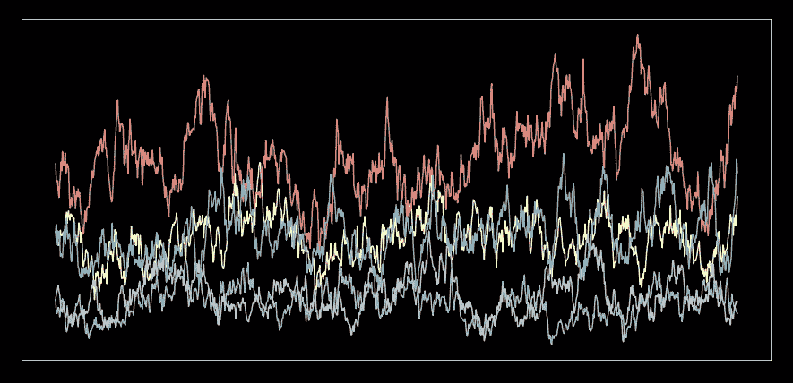
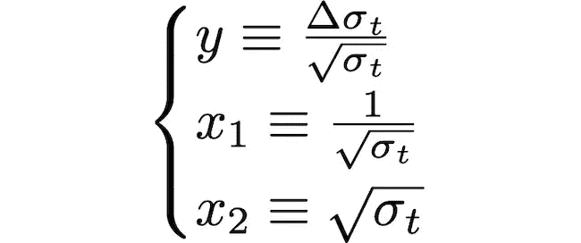

# 随机过程模拟——考克斯-英格索尔-罗斯过程

> 原文：<https://towardsdatascience.com/stochastic-processes-simulation-the-cox-ingersoll-ross-process-c45b5d206b2b>

## 随机过程模拟系列的第 3 部分。从头开始用 Python 模拟 Cox-Ingersoll-Ross 过程。

图片作者。

考克斯-英格索尔-罗斯(CIR)过程是另一个非常重要的平稳过程。尽管它的大部分应用是在金融领域，但它本身就是一个有趣的平稳随机过程。

它是基本仿射跳跃扩散过程和遍历过程的最简单的特例。

这个过程的主要特点，除了平稳性，就是永远是正的。因此，使其成为一个有吸引力的随机候选者，用作扩散过程中的随机项系数。

在这个故事中，我们将学习 CIR 过程的基础知识。我们将模拟一个 CIR 过程和许多相关的过程。我们还将学习如何从数据中估计 CIR 参数。

我们将继续引用关于[布朗运动](/stochastic-processes-simulation-brownian-motion-the-basics-c1d71585d9f9)系列第一个故事中的概念和代码。如果你已经知道布朗运动的基本知识，就使用那个故事中的代码。否则，请先阅读，然后再回到这个故事。

## 目录

*   SDE 的过程
*   模拟过程
*   参数估计
*   相关过程
*   代码摘要
*   最后的话

## SDE 的过程

CIR 过程的 SDE(随机微分方程)是:

其中 *W_t* 为[布朗运动](/stochastic-processes-simulation-brownian-motion-the-basics-c1d71585d9f9)， *a* ， *b* 和 *c* 为正常数；此外，**为了避免零值，必须满足条件*2ab*>=*c***。注意**过程σ_ *t* 不能获得负值**。

遗憾的是，这个 SDE 没有封闭形式的解，但是我们可以用数值方法求解。

CIR 过程是平稳的，它有一个正偏态分布，有一个渐近均值 *b.*

过程的均值回复由漂移项( *dt* 项)给出，它与[奥恩斯坦-乌伦贝克过程](https://medium.com/towards-data-science/stochastic-processes-simulation-the-ornstein-uhlenbeck-process-e8bff820f3)的漂移项具有相同的形式。当σ_ *t* 大于 *b 时，*漂移项变为负值，将σ_ *t* 拉回到 *b* 。如果σ_ *t* 小于 *b* ，则相反。 ***a* 是均值回复参数，** it 控制漂移的幅度，因此，较高的值将导致更激进的均值回复。

最后， *c* 控制过程中随机冲击的大小( *dW* 项)。请注意，过程本身的平方值调节随机冲击。因此，对于较高的过程值，随机冲击比较小的值更显著。

## 模拟过程

首先，我们定义 dataclass，它包含流程的参数。传递许多参数通常会变得混乱；在它们自己的对象中传递它们更干净。如果***2ab*<c，这个类将在创建时抛出一个异常(ValueError)。**

为了模拟这一过程，我们需要使用欧拉-丸山方法将 SDE 转换成离散方程(时间序列方式)。使δt = 1(单位时间步长):

然后，使用这个等式，我们沿着它的路径为流程生成值(对于循环)。下面代码中的函数“_generate_CIR_process”就是这样做的。

为了生成 CIR 过程模拟，我们将使用我们在本系列的第一个故事[中开发的关于布朗运动的代码。将代码保存为“brownian_motion.py”。如果您将它保存在不同于您打算运行以下代码的目录中，您将需要更改 import 语句。](/stochastic-processes-simulation-brownian-motion-the-basics-c1d71585d9f9)

请注意，尽管 CIR 参数满足***2ab*>=*c*，该过程仍有可能沿路径变为负值。**特别是对于接近不等式的值。这是因为离散步长而不是连续微分。如果发生这种情况，模拟将在运行时引发 ValueError 异常

模拟流程:

图片作者。

## 参数估计

为了估计给定过程的 CIR 参数，我们使用两个变量的线性回归。

使用 Euler-Maruyama 方法(随机差分δσ*_ t*作为前向差分，我们用离散方程近似随机微分方程:

使δt = 1 并除以σ的平方根 *_t:*

其中，ε为内径标准正常值。

使用变量替换:

然后，我们可以将离散方程写成:

其现在具有带有两个变量的线性模型的形式。

以下函数执行回归并估计 CIR 参数:

让我们用一个模拟过程来测试它，看看我们是否能恢复 CIR 参数:

我们得到:

cir params(a = 0.05125324782019516，b=0.5043588622427937，c=0.02014670637207867)

这与输入参数非常接近。

## 相关过程

如果我们可以模拟一个过程，为什么不模拟很多呢？如果我们要模拟许多 CIR 过程，我们自然希望选择使它们成对相关。

在[系列的第一部分](/stochastic-processes-simulation-brownian-motion-the-basics-c1d71585d9f9)中，我们编码了一个相关布朗运动的矩阵；我们将使用这些过程来建立相关的 CIR 过程。当随机项相关时，[扩散过程](/stochastic-processes-simulation-brownian-motion-the-basics-c1d71585d9f9)(it4 过程)发生相关。

让我们编写一个函数来得到相关的 CIR 过程。我们想要的两个主要功能:

1.  CIR 参数由所有进程共享，进程可以相互关联。
2.  每个过程都有自己的 CIR 参数，过程可以相互关联。

我们让“CIR 参数”参数采用两种不同的类型来实现这一点。通过让“CIR _ 参数”是“CIRParams”的实例来再现上面的情况 1)；情况 2)通过让“CIR _ 参数”是“CIRParams”的实例的元组来再现。

我们将需要布朗运动系列的[第一个故事](/stochastic-processes-simulation-brownian-motion-the-basics-c1d71585d9f9)中的代码来生成相关的 CIR 过程模拟。获取该代码，并将其作为“brownian_motion.py”保存在运行以下代码的同一目录中。

两种情况的使用示例:

图片作者。CIR 相关过程，单参数。

图片作者。CIR 相关过程，多参数。

## 代码摘要

以下是整个故事中使用的所有代码的摘要。我们刚刚开发的迷你库的复制粘贴部分。

## 最后的话

我们已经成功地开发了模拟 Cox-Ingersoll-Ross 过程并从数据中估计其参数的程序。我们可以使用我们的新库对这种过程进行蒙特卡罗模拟。我们也可以用它来模拟广义几何布朗运动中随机项的系数，我们将在本系列的下一篇文章中看到。

## 参考

[1] S. Shreve，[金融随机微积分 II，连续时间模型](http://...)，(2004)，Springer。

在[媒体](https://medium.com/@diego-barba)上关注我，并订阅以获得该系列下一个故事的最新消息。

<https://medium.com/subscribe/@diego-barba>  

我希望这个故事对你有用。如果我错过了什么，请让我知道。

喜欢这个故事吗？通过我的推荐链接成为媒体会员，可以无限制地访问我的故事和许多其他内容。

<https://medium.com/@diego-barba/membership>  

## 浏览随机过程模拟系列

该系列之前的故事:

</stochastic-processes-simulation-brownian-motion-the-basics-c1d71585d9f9>  </stochastic-processes-simulation-the-ornstein-uhlenbeck-process-e8bff820f3>  

该系列的下一个故事:

</stochastic-processes-simulation-geometric-brownian-motion-31ec734d68d6>  </stochastic-processes-simulation-generalized-geometric-brownian-motion-a327c0fa6226> 