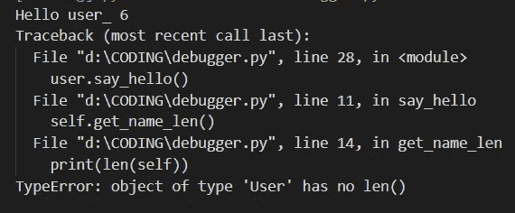
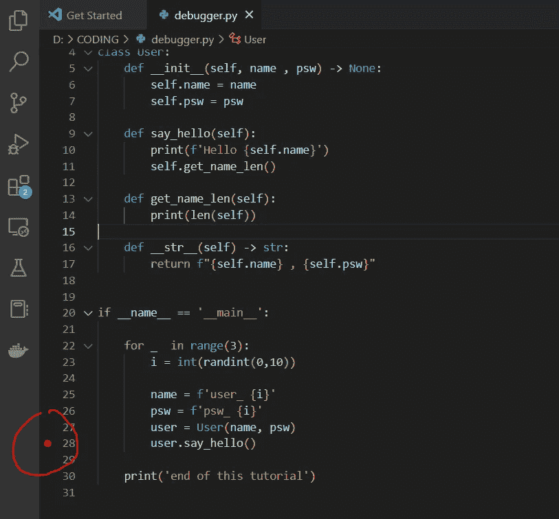
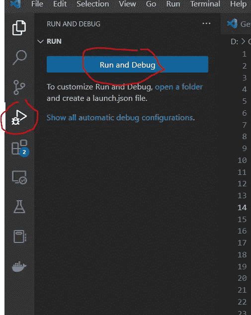
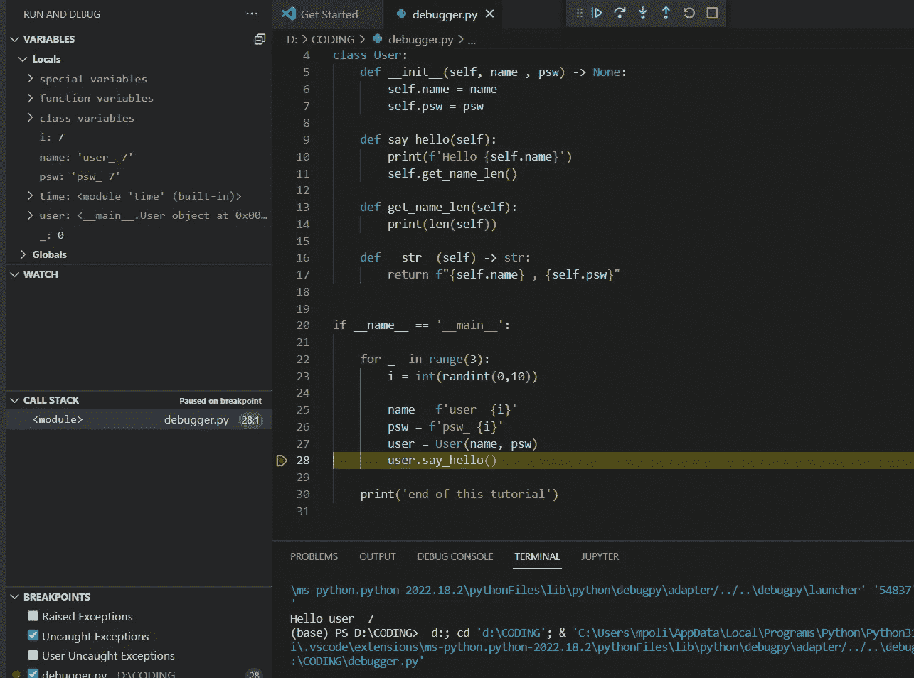
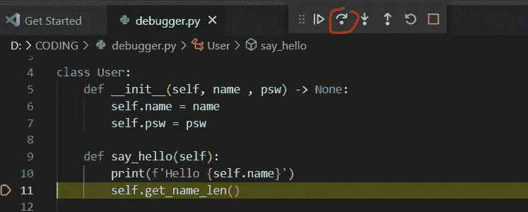
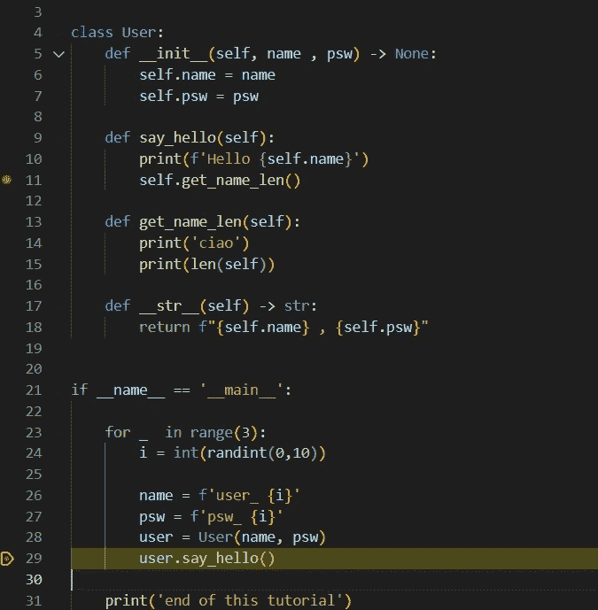
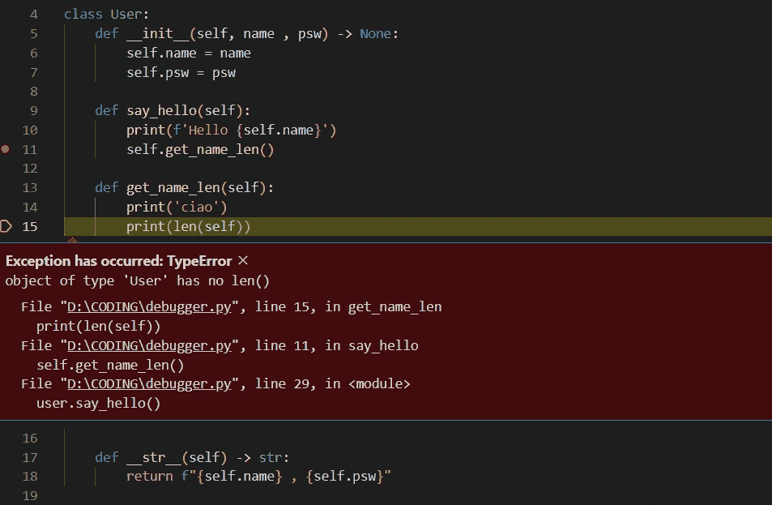
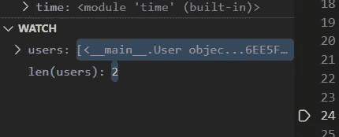

# 停止使用 Print，并开始调试

> 原文：<https://towardsdatascience.com/stop-using-print-and-start-debugging-3cd11524c92a>


照片由 [Fotis Fotopoulos](https://unsplash.com/@ffstop?utm_source=medium&utm_medium=referral) 在 [Unsplash](https://unsplash.com?utm_source=medium&utm_medium=referral) 上拍摄

## 了解如何使用 Visual Studio 代码调试 Python 程序

## 介绍

我曾经读到过，在编程中，由于一个非常特殊的原因，代码中的错误被称为*错误*。当计算机还是巨大的主机时(很久很久以前),发生了一个 bug 卡住了齿轮，这就是为什么程序不再运行了！

今天，我们所说的虫子指的是完全不同的东西。每个人，甚至是世界上最有经验和收入最高的程序员都会编写包含 bug 的代码，但技巧在于找到它们。在这篇文章中，我们找到了方法！

## 打印和 Jupyter 笔记本

数据科学家使用 Jupyter 笔记本或 Google Colab 编写代码是很常见的。不幸的是，我也发现它们使用起来超级方便，尽管调试起来不那么方便。

在这些笔记本中，我们可以将代码分成单元，这样在一个单元执行结束时，我们可以打印出我们感兴趣的变量的所有值，并查看是否有任何地方出错。或者至少我们可以知道代码内部发生了什么。

即使在不使用笔记本的情况下，我们也经常使用 print()来计算变量的值，从而理解为什么代码会以某种方式运行并修复它。

例如，假设我们想执行下面的代码。

```
admin = get_user_input() #returns user input

if admin == 'admin':
  print(f'welcome {admin}') 
```

通过前面的代码，我们知道我们有了变量 admin。当这个变量取值为*‘admin’*时，我们要问候我们的管理员。

然而，我们发现这种情况从未发生过，即使它应该发生，因为使用程序的是我们的管理员。

然后，程序员新手通常会去打印出 admin 变量，并找出问题所在。

```
admin = get_user_input() #returns user input
print('The value of admin is : ' , admin)

if admin == 'admin':
  print(f'welcome {admin} ')
```

我们注意到此打印的结果如下。

```
The value of admin is : admin\n
```

我们发现我们的 *get_user_input* 函数会额外返回一个 *\n* ，这就是为什么这种情况不会发生。然后，我们准备好修复我们的代码并运行一切。**发现 Bug**！

但是这是找到 bug 的最好方法吗？不完全是。在这种简单的情况下，我们有 4 行代码，这可能是好的，但在更复杂的项目中，您必须首选各种 ide 提供的调试器工具。

## 使用 VSCode 调试

**IDE** 代表集成开发环境(Integrated Development Environment)，是一款通过提供调试器等非常有用的工具，让你编写代码的工具。

在本文中，我们将查看 **VSCode 调试器**,但它们的工作方式几乎相同，所以即使您使用 PyCharm 或任何其他 IDE，也不用担心。

让我们先用 VSCode 用 Python 写一个简单的代码。示例代码如下。

```
from random import random, randint
import time 

class User:
    def __init__(self, name , psw) -> None:
        self.name = name
        self.psw = psw

    def say_hello(self):
        print(f'Hello {self.name}') 
        self.get_name_len()

    def get_name_len(self):
        print(len(self.name))

    def __str__(self) -> str:
        return f"{self.name} , {self.psw}"

if __name__ == '__main__':

    for _  in range(3):
        i = int(randint(0,10))

        name = f'user_ {i}' 
        psw = f'psw_ {i}' 
        user = User(name, psw) 
        user.say_hello()
```

在这段代码中，我们创建了一个用户类，其中每个用户都由名称和密码来描述。

另外，一个用户有两个方法，比如问候用户的 *say_hello* ，返回用户名长度的 *get_name_len* ，以及定义如何打印用户的 *__str__* 方法。

最后，在 *main* 中，我们创建三个随机用户，并让他们使用 *say_hello* 方法。

现在我们来介绍一个错误。例如在 *get_name_len* 方法中，我们只打印 *self* 的长度，而不是 *self.name* 的长度。

```
from random import random, randint
import time 

class User:
    def __init__(self, name , psw) -> None:
        self.name = name
        self.psw = psw

    def say_hello(self):
        print(f'Hello {self.name}') 
        self.get_name_len()

    def get_name_len(self):
        print(len(self))

    def __str__(self) -> str:
        return f"{self.name} , {self.psw}"

if __name__ == '__main__':

    for _  in range(3):
        i = int(randint(0,10))

        name = f'user_ {i}' 
        psw = f'psw_ {i}' 
        user = User(name, psw) 
        user.say_hello()
```

现在，如果我们去执行代码，我们将得到以下错误。



错误(图片由作者提供)

我们现在的目的是尝试使用 VSCode 调试器来查找错误。

首先要做的是在你代码的某一点插入一个 ***断点*** 。有了断点，你告诉你的编译器在那个点暂停运行,这样你就可以检查你代码中的各种变量，然后只在你需要的时候继续运行。

要输入断点，单击代码的最左边，会出现一个红点。



断点(作者图片)

现在让我们点击下面的图标，在调试模式下运行代码。



调试(图片由作者提供)

一旦你点击，你会看到你的代码将开始运行，但几乎立即停止。

您现在应该有一个这样的屏幕。



调试(图片由作者提供)

所以，旁边有那个符号的黄线，告诉你代码在哪里停止，就在你放断点的地方。

另一方面，在左上角，您可以看到代码中变量的内容。这些变量中有许多看起来毫无意义，因为它们指向代码中的函数。但是如果你看得很清楚，应该有一个用户变量，因为在断点之前我们已经创建了一个用户。在我的情况下，我可以看到如下内容。


变量(图片由作者提供)

这样我就知道了我的用户变量的内容是什么，并且我已经避免了自己编写 print()。

现在，我们可以开始使用位于工具栏顶部的主要调试器命令，如下所示。


命令(图片由作者提供)

主要命令以红色突出显示。第一种方法允许我们前进一行代码，看看会发生什么。第二种方法允许我们进入函数内部，看看会发生什么。最后一个允许我们超越函数的范围。

因为我们的程序现在卡在了 *user.say_hello()* 函数上，所以让我们单击向下箭头来看看这个函数内部发生了什么。

单击后，您将看到执行将在该函数中继续。


say_hello(图片作者)

现在我们需要理解栈是用来做什么的。栈基本上告诉你你有多少个函数。事实上，如果你看到左下角现在增加了一条线。


堆栈(作者图片)

这告诉我们，我们现在在 *say_hello* 函数的范围内，所以如果我们通过单击向上箭头退出该函数，我们将回到主界面。

现在让我们用 *forward* 命令向前移动一行代码。



转发命令(图片由作者提供)

现在我们在另一个函数上，我们单击向下箭头进入函数本身。


堆栈(作者图片)

你可以看到，因为我们已经进入了另一个函数内部，堆栈增加了，所以我们在一个函数内部的函数中(不，这不是 Inception)。

显然，我们可以输入多个唯一的断点。因此，让我们停止调试，这次通过输入 2 个断点重新启动它。



两个断点(作者图片)

因此，在这种情况下，通过单击*前进*，我们将在第二个断点处停止。

如果我们现在再次点击前进，代码将会停止，但是这次是因为**我们发现了错误**！



发现错误(图片由作者提供)

我们的意图成功了。发现错误，我们没有用无用的打印弄脏我们的代码！

只有一件事还没说。手表区是干什么的？来看看变量。

假设我们将所有用户保存在一个列表中。

```
from random import random, randint
import time 

class User:
    def __init__(self, name , psw) -> None:
        self.name = name
        self.psw = psw

    def say_hello(self):
        print(f'Hello {self.name}') 
        self.get_name_len()

    def get_name_len(self):
        print('ciao')
        print(len(self.name))

    def __str__(self) -> str:
        return f"{self.name} , {self.psw}"

if __name__ == '__main__':

    users = []
    for _  in range(3):
        i = int(randint(0,10))

        name = f'user_ {i}' 
        psw = f'psw_ {i}' 
        user = User(name, psw) 
        user.say_hello()
        users.append(user)

    print('end of this tutorial')
```

现在我们想看看这个列表在我们浏览代码时会发生什么。
因此，让我们单击加号按钮，在 watch 下添加可行用户。实际上，我们也可以添加 *len(users)* 。


手表(图片由作者提供)

现在，当您使用 forward 命令向前移动代码时，您将看到列表被填满，并且您将能够检查其中的对象。



经过一些迭代后(图片由作者提供)

## 最后的想法

这些是使用调试器的基础。这是一个非常有用且易于使用的工具。当然，像所有的事情一样，你必须习惯它。所以下一次你的代码有问题时，强迫自己使用调试器而不是打印机，你会发现很快你就会自动地一直使用它！

# 结束了

*马赛洛·波利蒂*

[Linkedin](https://www.linkedin.com/in/marcello-politi/) ， [Twitter](https://twitter.com/_March08_) ， [CV](https://march-08.github.io/digital-cv/)