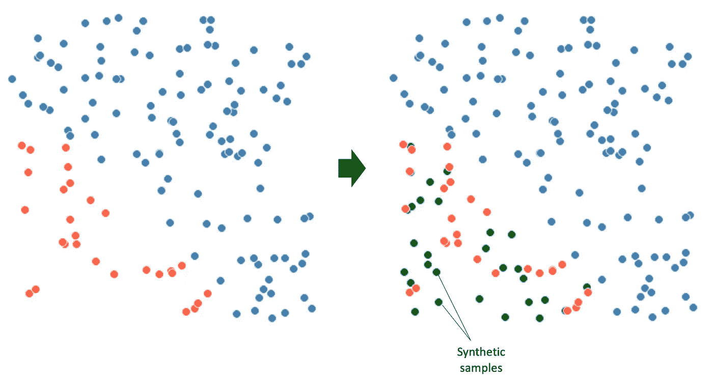
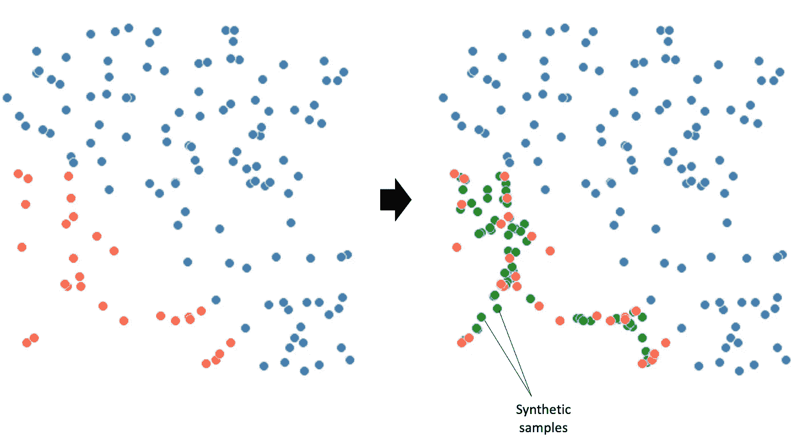
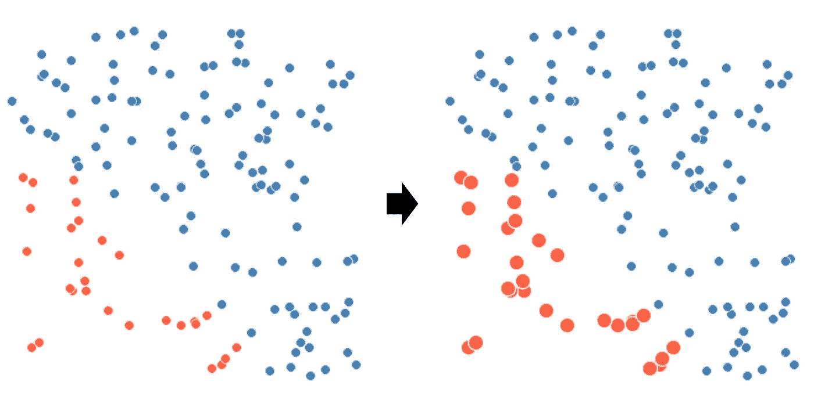
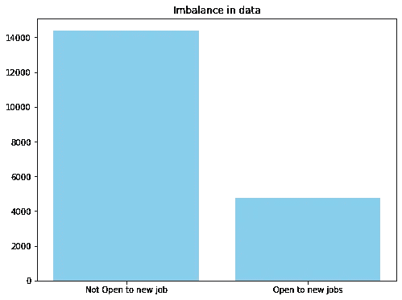
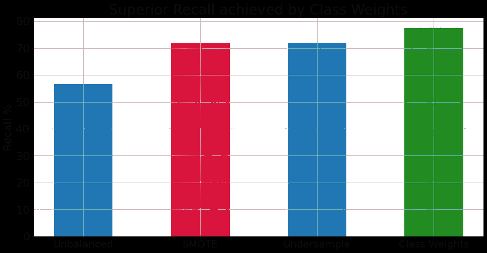
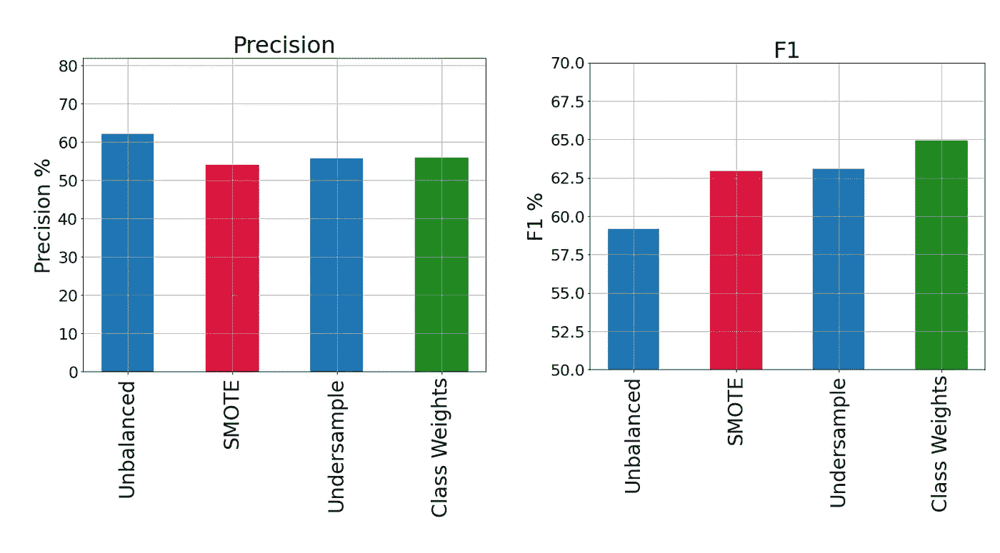
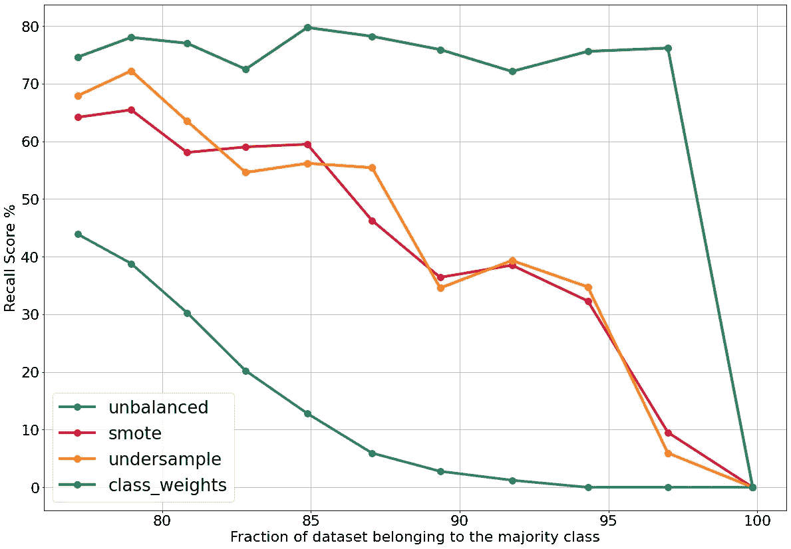

# 停止使用 SMOTE 来处理阶级不平衡

> 原文：<https://towardsdatascience.com/stop-using-smote-to-treat-class-imbalance-take-this-intuitive-approach-instead-9cb822b8dc45>

## 请采用这种直观的方法


在 freepik.com 发现的 rawpixel 图像

在分类问题中，无论是二元分类还是多类分类，都会出现属于每一类的观测值数量不平衡的情况。类别不平衡的一个典型例子是欺诈性交易与非欺诈性交易，在这种情况下，我们整个数据集中的任何随机样本都会有更多的非欺诈性交易观察结果。另一个例子可以是在大公司工作的员工流失的数据集，其中离开公司的员工通常比在给定时间内留在公司的员工多。

假设你计划建立一个机器学习模型来预测可能离开公司的员工。数据中的不平衡带来了挑战，因为大多数机器学习算法都是在假设每个类别中的观察值数量大致相等的情况下创建的。

处理类不平衡的方法有很多，欠采样和 SMOTE 是最流行的。然而，这两种方法都不能达到高水平的召回，同时给流水线制造了过度的复杂性。

> SMOTE 和欠采样都无法达到高水平的召回率，同时给机器学习管道带来了过度的复杂性

本文将向您展示一种比欠采样和 SMOTE 在不平衡数据上具有更好性能的直观方法。它还具有更低的复杂性，并且已经**内置到 scikit-learn 分类模型中**。

# SMOTE 复习工具

SMOTE 代表 2002 年推出的“合成少数过采样技术”。顾名思义，它通过创建合成数据点来增加少数类中的观察数量，从而平衡数据。

作为第一步，SMOTE 使用 k-最近邻方法来识别特征空间中彼此接近的数据点。然后，它会在数据点之间投射线条，并沿着这些线条创建虚假的观察。听起来很公平，对吧？让我们看看它对数据做了什么。

**这是他们告诉你的击打方式:**



你在网上订购的东西(图片由作者提供)

**这是 SMOTE 实际做的:**



你收到的邮件(图片由作者提供)

如你所见，SMOTE 没有填充红点所占据的区域。它只是在少数阶级中产生了一种不寻常的模式，现在我们的模式必须借鉴。

# 欠采样刷新程序

欠采样背后的想法很简单:从多数类中消除观测值，直到你的类具有相同数量的观测值。


随机欠采样的工作原理(图片由作者提供)

# 类别权重

scikit-learn 和神经网络中的所有分类模型都有一个超参数，称为类权重。这个超参数被设计来控制精确度和召回率之间的权衡，换句话说，这与处理类别不平衡是一样的。

其思想是给每个类分配权重，使得所有类的观察值的加权和相等。对于两个类别，其中 n 是观察次数，w 是权重:


自然，少数阶级的权重会高于多数阶级的权重。机器学习模型在训练时，更关注权重较高的观测值。通过这样选择权重，我们将补偿少数群体中较少的观察值。



类别权重如何工作(图片由作者提供)

# 哪种方法比较好？

让我们来看看这三者的作用。在案例研究中，我们将回顾一个 Kaggle 数据集，其中包含可能正在寻找工作变动的个人。我们的目标是利用这些数据，识别那些对新的定向招聘机会持开放态度的人。这是数据和它的许可证信息:[https://creativecommons.org/publicdomain/zero/1.0/](https://creativecommons.org/publicdomain/zero/1.0/)

<https://www.kaggle.com/datasets/kukuroo3/hr-data-predict-change-jobscompetition-form>  

数据预处理和特征工程步骤不在本文的讨论范围内，所以让我们看一下图表:



数据中大约 1:3 的阶级不平衡(图片由作者提供)

我们用四种不同的策略来比较。首先，我们训练一个随机森林模型，就好像我们不在乎不平衡一样。

其次，我们使用 SMOTE 进行过采样:

```
sm = SMOTE(sampling_strategy=1, k_neighbors=5, random_state=7)
X_train_over, y_train_over = sm.fit_resample(X_train, y_train)
```

然后欠采样:

```
rus = RandomUnderSampler(random_state=1)
X_train_un, y_train_un = rus.fit_resample(X_train, y_train)
```

最后但同样重要的是，类权重:

```
count_class_1 = y_train.value_counts()[0]
count_class_2 = y_train.value_counts()[1]
ratio = count_class_1/count_class_2
rf_estimator = RandomForestClassifier(class_weight={1:ratio, 0:1})
```

以下是每种策略的召回指标:



作者图片

正如你所看到的，调整类权重导致了最好的回忆。然而，我们知道高召回率可以简单地通过牺牲精确度来实现。因此，让我们绘制精度和 F1 分数。



类权重具有最好的 f1 分数和相似的精度(图片由作者提供)

正如您所观察到的，在类不平衡方面，类权重比其他方法表现得更好。

# 如果失衡更严重呢？

我相信你们中的许多人都想知道不平衡更严重的情况，我们有 80/20 或 90/10 的分裂。为了测试这些策略在不同不平衡水平下的性能，我编写了一个函数，在 for 循环中随机消除少数类中的一些数据点，并重复建模过程，记录每种方法的性能。

```
for i in range(11):
    to_drop = df[df['target']==1].sample(400).index.values
    df = df.drop(to_drop)
    X = df.drop(["target"], axis=1)
    y = df["target"]
    train_all_strategies(X, y, 'smote', 'undersampling', 'class_weights')
```

还有一个超参数调整步骤，以确保每种方法返回最佳结果。下面我们绘制了每次迭代的回忆分数。



我们今天看到的最重要的情节(图片由作者提供)

情节的主要要点:

**1-当使用更新的类别权重处理类别不平衡时，模型的性能始终很高**

**2-模型的性能随着平滑和欠采样而逐渐下降**

**3-当整个数据集由一个类别组成时，所有策略的召回率都降至零(非常明显)**

# 摘要

在本文中，我们讨论了 SMOTE、随机欠采样和类权重来处理分类的类不平衡。在一个案例研究中，我们展示了仔细选择类权重是如何产生最佳建模性能的。我们还证明了这种方法在从 25/75 一直到 1/99 的不同等级的不平衡中保持其优越性。

这种方法的另一个优点是简单；同时，SMOTE 需要大量的时间来运行，并且类权重不会增加机器学习流水线的时间复杂度。

请务必关注更多内容！